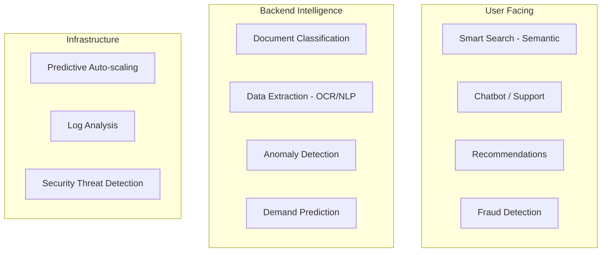
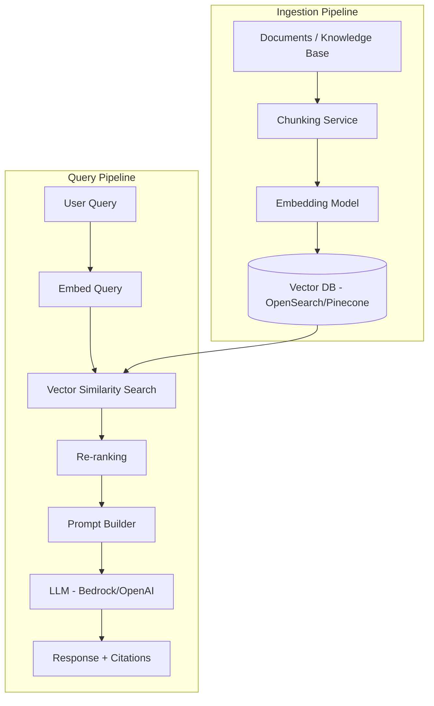
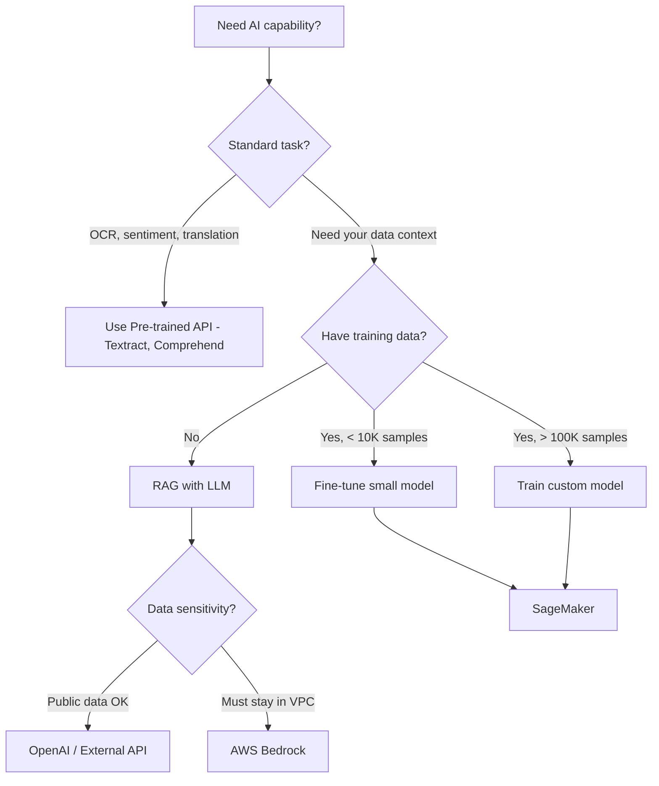

# AI in System Design — When, Where, and How

## The Decision: Do You Even Need AI?

Before adding AI to your system, ask:

| Question | If Yes | If No |
|----------|--------|-------|
| Can a human write rules for this? | Use rules engine, skip AI | Consider AI |
| Do you have labeled training data? | ML model viable | Use pre-trained/LLM |
| Is the task well-defined with clear inputs/outputs? | Traditional ML | LLM might help |
| Does accuracy need to be > 99%? | AI alone won't cut it — hybrid approach | AI can add value |
| Is latency budget > 500ms? | AI feasible | Need optimized/smaller models |

<div class="callout-warn">

**Common mistake**: Using GPT-4 for something a regex or SQL query can solve. AI adds latency, cost, and unpredictability. Use it only when the problem genuinely requires intelligence — pattern recognition, natural language understanding, or decisions with too many variables for rules.

</div>

---

## Where AI Fits in System Architecture



### Tier 1: Pre-trained APIs (Easiest)

Use when: You need standard AI capabilities without training custom models.

| Need | AWS Service | Alternative |
|------|------------|-------------|
| Text extraction from images | Textract | Google Vision |
| Sentiment analysis | Comprehend | Google NLP |
| Speech to text | Transcribe | Whisper (OpenAI) |
| Translation | Translate | DeepL API |
| Image moderation | Rekognition | Google Vision |

**Cost**: Pay per API call. No infrastructure to manage.

### Tier 2: LLM Integration (RAG Pattern)

Use when: You need AI that understands YOUR data — not just general knowledge.

### Tier 3: Custom ML Models

Use when: You have unique data and need specialized predictions (fraud scoring, demand forecasting, recommendation engines).

---

## RAG — The Most Common AI Pattern

### What is RAG?

**Retrieval-Augmented Generation**: Instead of fine-tuning an LLM on your data (expensive, slow), you retrieve relevant context at query time and feed it to the LLM.


### RAG Architecture in Production



### Key Decisions in RAG

| Decision | Options | Recommendation |
|----------|---------|----------------|
| Chunk size | 256 / 512 / 1024 tokens | Start with 512, test with your data |
| Chunk overlap | 0 / 50 / 100 tokens | 50-100 tokens (prevents cutting context) |
| Embedding model | OpenAI ada-002, Cohere, Titan | Titan on AWS (cheapest), ada-002 (best quality) |
| Vector DB | OpenSearch, Pinecone, pgvector, Chroma | pgvector if already on PostgreSQL, OpenSearch for scale |
| LLM | GPT-4, Claude, Bedrock Titan | Bedrock if on AWS (no data leaves your VPC) |
| Top-K retrieval | 3 / 5 / 10 chunks | 5 is a good default, more = more context but higher cost |

<div class="callout-tip">

**Applying this** — Start with pgvector (PostgreSQL extension) for your vector DB. You already have PostgreSQL — no new infrastructure. When you outgrow it (> 10M vectors, need sub-10ms search), migrate to OpenSearch or Pinecone. Don't start with a specialized vector DB for a prototype.

</div>

---

## Model Serving — How to Deploy AI

### Option 1: API-based (Managed)

```
Your App → HTTPS → OpenAI API / AWS Bedrock
```

- ✅ Zero infrastructure
- ✅ Always latest models
- ❌ Data leaves your network (OpenAI) — Bedrock keeps it in VPC
- ❌ Per-token pricing adds up at scale
- ❌ Rate limits, latency variability

### Option 2: Self-hosted (SageMaker)

```
Your App → SageMaker Endpoint → Your Model on GPU
```

- ✅ Data stays in your VPC
- ✅ Predictable latency
- ✅ Custom models
- ❌ GPU costs ($1-10/hour per endpoint)
- ❌ Ops overhead (scaling, monitoring)

### Option 3: Hybrid

```
Non-sensitive queries → Bedrock / OpenAI (cheaper, faster)
Sensitive data queries → SageMaker self-hosted (data privacy)
```

### Cost Comparison (1M queries/month, ~500 tokens each)

| Approach | Monthly Cost | Latency |
|----------|-------------|---------|
| GPT-4 API | ~$15,000 | 2-8s |
| GPT-3.5 API | ~$1,000 | 0.5-2s |
| Bedrock Claude Haiku | ~$500 | 0.5-2s |
| SageMaker (Llama 3 on g5.xlarge) | ~$1,200 | 0.3-1s |

<div class="callout-scenario">

**Scenario**: Building a customer support chatbot. 50K queries/day. Some queries involve PII (account details). **Decision**: Use Bedrock (data stays in VPC) with Claude Haiku for most queries (fast, cheap). Escalate complex queries to Claude Sonnet (better reasoning, 3x cost). Never send PII to external APIs.

</div>

---

## AI Decision Framework



<div class="callout-interview">

**Q: "How would you add AI to an existing system?"**

First, identify if AI is actually needed (rules engine might suffice). For knowledge-based Q&A, use RAG: chunk documents, embed into vector DB, retrieve relevant context, feed to LLM. Use Bedrock on AWS to keep data in VPC. Start with pgvector for vector storage. Use managed APIs (Textract, Comprehend) for standard tasks. Only train custom models when you have unique data and pre-trained models don't meet accuracy requirements.

</div>

---

## Common Pitfalls

| Pitfall | Reality |
|---------|---------|
| "Let's use GPT-4 for everything" | GPT-4 costs 30x more than Haiku. Use the cheapest model that meets accuracy needs |
| "AI will replace our rules engine" | Rules are deterministic, auditable, fast. AI is probabilistic, slow, expensive. Use both |
| "We need real-time AI" | Most AI use cases can tolerate 1-5s latency. Don't over-optimize |
| "Fine-tuning will fix accuracy" | Usually, better prompts + better retrieval (RAG) fixes accuracy. Fine-tuning is last resort |
| "Vector DB is mandatory for RAG" | pgvector in PostgreSQL handles millions of vectors. You don't need Pinecone on day 1 |

<div class="callout-tip">

**Applying this** — The best AI architecture is the simplest one that works. Start with managed APIs and RAG. Measure accuracy. Only add complexity (fine-tuning, custom models, specialized vector DBs) when you have data proving the simpler approach isn't enough.

</div>

---

<!-- practice-pack -->

## 🏢 More Real-World Scenarios

<div class="callout-scenario">

**Scenario**: An e-commerce company adds an LLM call to product search to "understand intent". Search p95 latency jumps from 120 ms to 2.3 s, conversion drops, and the monthly model bill reaches $40K. **Decision**: Put AI where its latency and cost fit. Keep the synchronous search path fast (lexical + vector retrieval, learned ranking), and use the LLM **offline** to enrich data (generate product attributes, synonyms, and query rewrites for frequent queries, cached) or **only for long-tail queries** where traditional search returns poor results. Measure with an A/B test on conversion, not on demo impressions.

</div>

## 🏋️ Practice Assignments

### 🟢 Low — Build the reflexes

**L1.** AI or not? (a) validate an Indian PAN number format, (b) categorize free-text support tickets into 20 categories, (c) compute GST on an invoice, (d) summarize a 40-page contract for a lawyer's first read, (e) detect duplicate customer records with spelling variations.

<details>
<summary>Show answer</summary>

(a) No — regex. (b) Yes — classification of unstructured text (an LLM or a fine-tuned small classifier). (c) No — deterministic rules; must be exact and auditable. (d) Yes — summarization, with a human reviewing. (e) Maybe — start with fuzzy matching (normalized names, phonetic keys, edit distance); add embeddings or ML only if rules miss too much.

</details>

**L2.** Name three ways to cut LLM cost in a production feature.

<details>
<summary>Show answer</summary>

Route to the smallest model that meets the quality bar (and escalate only hard cases); cache responses for repeated inputs and use prompt caching for long, stable system prompts and documents; shorten prompts and outputs (retrieve fewer, better chunks; cap `max_tokens`); use batch APIs for non-urgent work; and precompute offline instead of calling per request.

</details>

**L3.** Why should AI calls be asynchronous in many workflows?

<details>
<summary>Show answer</summary>

LLM calls take seconds, can fail or be rate-limited, and vary in latency. Putting them behind a queue (process ticket → enqueue classification → update when done) keeps user-facing requests fast, allows retries with backoff, smooths spikes against provider rate limits, and lets you batch for lower cost.

</details>

### 🟡 Medium — Apply it

**M1.** Design an AI ticket-triage feature for a support system with 20K tickets/day.

<details>
<summary>Show answer</summary>

On ticket creation, publish an event → a triage worker calls a fast model with the ticket text and a structured-output schema (category, priority, language, sentiment, suggested team) → validate the output against the schema and allowed values → write results with a confidence score. Low-confidence results go to a human queue; agents can correct labels, which are logged as evaluation data. Rules still handle hard requirements (VIP customers → high priority). Track accuracy weekly against agent corrections, plus cost per ticket and p95 latency.

</details>

**M2.** Your RAG assistant gives confident wrong answers for 8% of questions. How do you diagnose it?

<details>
<summary>Show answer</summary>

Build an evaluation set of real questions with expected answers and source documents. For each failure, check whether retrieval found the right chunk (retrieval problem: chunking, embeddings, missing hybrid search, no reranker, stale index) or the model ignored or misread it (generation problem: prompt, context ordering, too many chunks). Fix the bigger bucket first, add "answer only from the provided context; say you don't know otherwise" with citations, and re-run the eval after every change.

</details>

**M3.** Where should guardrails sit in an AI feature's architecture?

<details>
<summary>Show answer</summary>

Before the model: input validation, PII redaction where possible, authorization of what data can be retrieved for this user (filter retrieval by permissions — never rely on the prompt to hide data). After the model: output schema validation, content filters, groundedness checks for RAG, and business-rule checks before any action. Around it: rate limits, cost budgets, logging for audit, and human approval for consequential actions.

</details>

### 🔴 High — Think like a senior

**H1.** Design the AI platform layer for a company where 15 product teams want to add LLM features.

<details>
<summary>Show answer</summary>

An internal **AI gateway** in front of model providers: authentication per team, model routing and fallback across providers, rate limiting and cost budgets per team, prompt/response logging with PII redaction, caching, and usage dashboards. Shared building blocks: a RAG service (ingestion, chunking, embeddings, permission-aware retrieval), an evaluation harness teams must use before launch, and guardrail libraries. Governance: data-classification rules for what can be sent to which model, and an approval checklist for features that take actions. Teams then focus on product logic instead of re-solving infrastructure.

</details>

**H2.** The model provider has a 2-hour outage. How should your AI features behave?

<details>
<summary>Show answer</summary>

Decide per feature during design: critical features fail over to a second provider or a self-hosted model through the gateway (with prompts tested on both); non-critical features degrade gracefully (hide the "summarize" button, fall back to keyword search, queue work for later processing). Use circuit breakers so requests fail fast instead of piling up, and show users honest messages. Test failover regularly, because a different model needs its own evaluated prompts.

</details>

## 🛠️ Mini Project — AI Ticket Triage Service

**Goal**: An AI feature designed like a real production system. 1 week of evenings.

**Build**

1. Spring Boot ticket service + PostgreSQL; on ticket creation, publish to a queue (RabbitMQ/Kafka/SQS).
2. Triage worker calling the Claude API with structured output (JSON schema: category, priority, sentiment, confidence), a small fast model first and escalation to a larger model when confidence is low.
3. Validation, retries with backoff, a circuit breaker, and a fallback rule-based classifier when the API is unavailable.
4. An evaluation set of 200 labelled tickets (synthetic or anonymized); report accuracy per category and cost per 1,000 tickets.
5. Agent correction endpoint feeding the eval set; a dashboard with accuracy trend, latency, and cost.

**Acceptance criteria**: ticket creation latency unaffected by the AI call; the service keeps working (with fallback) when the API key is revoked; README with eval results and the cost model.

---

## 🎯 Interview Corner

<div class="callout-interview">

**Q: "How do you decide whether a feature should use an LLM at all?"**

I ask four questions. Is the input unstructured, or the task fuzzy (language, images, intent), so that rules would be brittle? Can the business tolerate probabilistic, occasionally wrong output, with a human or a validation step catching errors? Do latency and cost per call fit the feature, seconds and cents rather than milliseconds and fractions of a cent? Can I measure quality with an evaluation set? If the task is deterministic (calculations, validation, compliance rules), I use code. Often the answer is a hybrid: rules for the hard constraints, the model for understanding text, and a human for low-confidence cases.

</div>

<div class="callout-interview">

**Q: "How would you control cost and latency for an LLM feature at scale?"**

I'd treat model calls like any expensive dependency. I route each request to the smallest model that passes the quality bar and escalate only when needed. I cache identical requests and use prompt caching for long, stable context. I keep prompts lean, retrieve fewer and better chunks, and cap output length. Anything not user-facing runs asynchronously or through batch APIs. For latency, I stream responses to the UI and precompute where possible. I track cost per request and per feature on dashboards with budgets and alerts, the same way I'd track database load.

</div>

<div class="callout-interview">

**Q: "How do you make sure an AI feature doesn't leak data a user shouldn't see?"**

Authorization happens outside the model. In RAG, retrieval filters chunks by the user's permissions, using document ACLs or tenant IDs stored as metadata on each chunk, so the model never receives data the user can't access. Prompts are not a security boundary: "don't reveal X" can be bypassed by prompt injection. I redact PII before sending to providers when it isn't needed, choose providers and regions according to data classification, log prompts and outputs with access controls, and treat tool output and retrieved documents as untrusted input. Any action the model takes goes through the same permission checks as a normal API call by that user.

</div>

---

<!-- journey-link:start -->

<div class="callout-journey">

🛒 **ShopNorth Journey** — ShopNorth keeps LLM work offline for search (enrichment) so customer-facing latency stays low — a core idea from this tutorial.

**Continue the story:** [Chapter 15 · Evolving with AI](/tutorials/journey-15-ai) · **New here?** [Start the journey](/tutorials/journey-start)

</div>

<!-- journey-link:end -->
