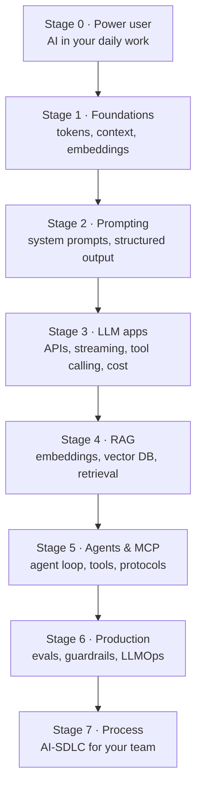

# AI Engineer Roadmap — From Full-Stack Developer (or Anyone) to Shipping Production AI, Step by Step

> **AI Engineering · Start Here** — This page is the map for the whole AI Engineering section. It tells you what to learn, in what order, why each step matters, and gives you one small project per stage so you *build* your way up instead of reading your way up.

---

## Table of Contents

1. The Learning-to-Drive Analogy
2. What an "AI Engineer" Actually Does (and Doesn't)
3. The Seven Stages at a Glance
4. Stage 0 — Use AI Daily as a Power User
5. Stage 1 — Understand How LLMs Work
6. Stage 2 — Prompting & Structured Output
7. Stage 3 — Build LLM Features into Real Apps
8. Stage 4 — RAG: Answer from Your Own Data
9. Stage 5 — Agents, Tools & MCP
10. Stage 6 — Production: Evals, Guardrails, Cost
11. Stage 7 — AI in Your Delivery Process (AI-SDLC)
12. Paths by Starting Point (Backend, Frontend, Non-Developer)
13. The 12-Week Plan
14. Practice Assignments (Low / Medium / High)
15. Capstone Project — "Ask the Docs" Support Assistant
16. Interview Corner
17. Quick Reference

---

## 1. The Learning-to-Drive Analogy

Nobody learns to drive by studying combustion engines first. You learn in layers:

1. **Passenger** — you ride along and notice what driving looks like. (*Use AI tools daily.*)
2. **Learner's permit** — you learn the controls: steering, brakes, what the dashboard means. (*How LLMs work: tokens, context, temperature.*)
3. **Driving in a parking lot** — controlled practice. (*Prompting, structured output.*)
4. **Driving in the city** — real roads, real traffic. (*Building features into real apps.*)
5. **Using the navigation system** — you're no longer limited to roads you remember. (*RAG: using your company's data.*)
6. **Driving for a delivery company** — the car makes stops, picks things up, follows a route. (*Agents and tools.*)
7. **Fleet manager** — insurance, maintenance, safety reviews, fuel costs. (*Evals, guardrails, cost in production.*)

You don't need to be a mechanic (an ML researcher) to be an excellent driver. **Most AI engineering is software engineering with a new, probabilistic component.** Your existing skills — APIs, databases, testing, security, observability — are the foundation, not something to throw away.

---

## 2. What an "AI Engineer" Actually Does (and Doesn't)

| Role | Main work | Math/ML depth | Your path? |
|------|-----------|---------------|------------|
| **ML Researcher** | Invent new model architectures, training methods | Very high | No |
| **ML Engineer** | Train/fine-tune models, feature pipelines, model serving | High | Maybe later |
| **Data Scientist** | Analysis, experiments, classical ML models | Medium-high | No |
| **AI Engineer / LLM App Engineer** | Build products **on top of** foundation models: prompts, RAG, agents, tool integration, evals, guardrails, cost | Low-medium | **✅ Yes — this section** |
| **Software engineer using AI tools** | Uses AI assistants to build any software faster | None | ✅ Everyone (see `ai-sdlc`) |

**The key shift since 2023**: you no longer need to train a model to build an intelligent feature. Foundation models (Claude, GPT, Gemini, Llama, Mistral) are available through an API call. The hard problems moved from "build a model" to "give the model the right context, connect it to the right tools, check its work, and keep it safe and affordable" — which is exactly what backend engineers are good at.

---

## 3. The Seven Stages at a Glance

| Stage | Tutorial in this section | Time (part-time) | You can say in an interview... |
|-------|--------------------------|------------------|--------------------------------|
| 0 | `ai-sdlc` (sections 4-5) | Ongoing | "I use AI assistants daily with repo context files and review every change." |
| 1 | `genai-fundamentals` | 1 week | "I understand tokens, context windows, sampling, and why models hallucinate." |
| 2 | `prompt-engineering` | 1 week | "I write prompts as specs, get schema-valid JSON, and test prompts." |
| 3 | `llm-app-development` | 2 weeks | "I've built streaming, tool-calling LLM features in Spring Boot with retries and cost control." |
| 4 | `rag-deep-dive` | 2-3 weeks | "I've built RAG with pgvector, hybrid search, and measured retrieval quality." |
| 5 | `ai-agents`, `mcp-deep-dive` | 2-3 weeks | "I know when an agent is justified, and I've built one with guardrails and an MCP server." |
| 6 | `ai-production-llmops`, `ai-in-system-design` | 2 weeks | "I ship AI features with eval sets in CI, prompt-injection defenses, and cost budgets." |
| 7 | `ai-sdlc` | Ongoing | "I've helped my team adopt AI with specs, guardrails, and DORA metrics." |

---

## 4. Stage 0 — Use AI Daily as a Power User

Before you build with AI, **work** with it. Using AI tools daily builds intuition for what models are good and bad at — intuition you'll need when designing features.

**Do this for two weeks:**

- Use a coding assistant (Claude Code, GitHub Copilot, Cursor) on real tasks: explaining unfamiliar code, writing tests, refactoring.
- Use a chat assistant for design discussions: "Here are my constraints; attack this design."
- Keep a small log: tasks where AI saved time, where it confidently got things wrong, and *why*.

**Applying this** — The mistakes you log become your intuition: models are great at transforming and explaining text, decent at code in popular frameworks, weak at exact arithmetic and at facts they weren't given, and overconfident when context is missing. Every later stage exists to fix one of those weaknesses (tools for arithmetic, RAG for missing facts, evals for overconfidence).

---

## 5. Stage 1 — Understand How LLMs Work

**Goal**: a correct mental model — not the math.

| Concept | Why it matters for builders |
|---------|-----------------------------|
| Tokens | Pricing, limits, and latency are all per token |
| Next-token prediction | Explains hallucinations and why context matters so much |
| Context window | How much you can send per request; long ≠ free |
| Temperature/sampling | Consistency vs creativity |
| Embeddings | The foundation of semantic search and RAG |
| Model families & sizes | Picking the cheapest model that passes your quality bar |

**Mini project**: a CLI that sends the same prompt 10 times at different settings and shows the variation in outputs, the token counts, and the cost per call.

→ Tutorial: `genai-fundamentals`

---

## 6. Stage 2 — Prompting & Structured Output

**Goal**: prompts as **engineering artifacts** — versioned, tested, reviewed.

- System prompts that define role, rules, and output format.
- Few-shot examples; putting instructions and data in clearly separated sections.
- **Structured output**: JSON that matches a schema, so your code can rely on it.
- A tiny test set of inputs with expected outputs, run on every prompt change.

**Mini project**: an "email triage" function that turns a customer email into typed JSON `{category, urgency, orderId?, summary}`, with 20 test emails and an accuracy score.

→ Tutorial: `prompt-engineering`

---

## 7. Stage 3 — Build LLM Features into Real Apps

**Goal**: production-grade integration in the stack you already know.

- Call a model API from Java/Spring (official SDK or Spring AI) and from the frontend via your backend (never expose API keys in the browser).
- **Streaming** responses to the UI (Server-Sent Events).
- **Tool calling**: let the model call your functions (order lookup, calculations).
- Timeouts, retries with backoff, rate limits, circuit breakers — the same resilience patterns you use for any remote API.
- Cost control: token budgets, caching, choosing cheaper models for simpler routes.

**Mini project**: a Spring Boot `/api/assistant` endpoint that streams answers and can call `getOrderStatus(orderId)` as a tool.

→ Tutorial: `llm-app-development`

---

## 8. Stage 4 — RAG: Answer from Your Own Data

**Goal**: ground answers in your company's documents, with citations.

- Chunk documents, embed them, store vectors (**pgvector** is a great start — it's just PostgreSQL).
- Retrieve relevant chunks per question; hybrid search (keywords + vectors); reranking.
- Prompt with retrieved context and require citations; say "I don't know" when the context lacks the answer.
- **Measure retrieval** separately from generation.

**Mini project**: "Ask the Handbook" — RAG over 50 Markdown files (e.g., this site's tutorials!) with source citations.

→ Tutorial: `rag-deep-dive`

---

## 9. Stage 5 — Agents, Tools & MCP

**Goal**: know when multi-step, model-driven workflows are worth it — and build them safely.

- The **agent loop**: model decides → calls a tool → sees the result → decides again.
- Tool design, limits on iterations and cost, human approval for risky actions.
- **Workflows vs agents**: most business problems need a fixed pipeline with LLM steps, not an autonomous agent.
- **MCP (Model Context Protocol)**: the standard way to expose your systems (DBs, APIs, docs) as tools to any AI client.

**Mini project**: an MCP server exposing read-only order and inventory tools, used from Claude Desktop or Claude Code.

→ Tutorials: `ai-agents`, `mcp-deep-dive`

---

## 10. Stage 6 — Production: Evals, Guardrails, Cost

**Goal**: ship AI features you can trust, change safely, and afford.

- **Evals**: a golden dataset + automated scoring, run in CI on every prompt/model change.
- **Guardrails**: prompt-injection defenses, PII handling, output validation, human-in-the-loop for high-stakes actions.
- **Observability**: traces of prompts, tool calls, token usage, latency, and user feedback.
- **Cost & latency budgets** per feature.

**Mini project**: add an eval suite + cost dashboard to your Stage 4 RAG app, and a CI gate that fails if accuracy drops.

→ Tutorials: `ai-production-llmops`, `ai-in-system-design`

---

## 11. Stage 7 — AI in Your Delivery Process (AI-SDLC)

**Goal**: multiply your *team's* output, not just your own — spec-driven development, context files, guardrails, and honest metrics.

→ Tutorial: `ai-sdlc`

---

## 12. Paths by Starting Point

| You are... | Your advantage | Your gap | Suggested emphasis |
|-----------|----------------|----------|--------------------|
| **Backend engineer (Java/Spring)** | APIs, data, resilience, security, testing | Frontend streaming UX, Python ecosystem | Stages 3, 4, 6 are your superpower; learn enough Python to read examples |
| **Frontend / full-stack JS** | UX for streaming and chat, rapid prototyping | Data pipelines, retrieval quality, security at the backend | Stage 3 (streaming UX, Vercel AI SDK-style patterns), then Stage 4 carefully |
| **Data / analytics** | SQL, data cleaning, evaluation mindset | Production services | Stages 4 and 6 (evals are data science!) |
| **QA / test engineer** | Test design, edge cases | Building services | Stage 6 — eval design is in high demand |
| **Non-developer (PM, analyst, ops)** | Domain knowledge, problem framing | Coding | Stages 0-2 deeply; no-code tools and MCP-enabled assistants; then light scripting |

**Scenario**: A 9-year Java/Spring engineer asks whether to switch to Python to "do AI". **Answer**: Not necessary to switch — add, don't replace. Production AI features mostly live inside existing services, and Java now has first-class options (official Anthropic Java SDK, Spring AI, LangChain4j). Learn enough Python to read notebooks and examples, but build your portfolio in the stack where you're already senior: a Spring Boot RAG service with evals and guardrails is a stronger interview story than a Python tutorial clone.

---

## 13. The 12-Week Plan (≈5-6 hours/week)

| Week | Focus | Output |
|------|-------|--------|
| 1 | Stage 0 + Stage 1 | Usage log; tokens/sampling CLI |
| 2 | Stage 2 | Email triage with structured output + 20-case test set |
| 3-4 | Stage 3 | Spring Boot streaming assistant with one tool, retries, token logging |
| 5-7 | Stage 4 | RAG over your docs with pgvector, citations, retrieval metrics |
| 8-9 | Stage 5 | MCP server for your data; one small agent with approval gates |
| 10-11 | Stage 6 | Eval suite in CI, prompt-injection tests, cost dashboard |
| 12 | Stage 7 + polish | Write-ups: architecture diagram, trade-offs, numbers — your interview stories |

**Applying this** — Each week's output should be a small Git repo with a README containing **numbers**: accuracy on the test set, p95 latency, cost per 1,000 requests. "I built a RAG app" is common; "my RAG app answers 87% of 120 test questions correctly with citations at $0.40 per 1,000 queries, and here's how I raised it from 64%" gets you hired.

---

## 14. 🏋️ Practice Assignments

### 🟢 Low — Build the reflexes

**L1.** For each problem, pick the simplest approach: (a) extract invoice number and total from emails, (b) answer employee questions about the HR handbook, (c) "book the cheapest flight that fits my calendar and expense policy", (d) detect fraudulent card transactions from 200 numeric features.

Show answer

(a) **Single LLM call with structured output** (Stage 2). (b) **RAG** over the handbook (Stage 4). (c) **Agent with tools** (search flights, read calendar, check policy) plus human approval before booking (Stage 5) — or a fixed workflow if the steps are always the same. (d) **Classical ML** (gradient boosting such as XGBoost) on tabular features — an LLM is the wrong tool: slower, costlier, and less accurate for numeric tabular classification.

**L2.** Name three existing backend skills that transfer directly to AI engineering, and where each is used.

Show answer

Examples: **resilience patterns** (timeouts, retries, circuit breakers) for model APIs; **SQL/databases** for vector search with pgvector and for storing conversations/evals; **testing** for eval suites; **security** (input validation, least privilege, secrets management) for prompt-injection defense and tool permissions; **observability** for tracing prompts, tokens, and latency; **API design** for tool/MCP interfaces.

**L3.** Why is "just use the biggest model for everything" a weak strategy?

Show answer

Cost and latency scale with model size and tokens; many routes (classification, extraction, routing) are handled equally well by smaller, faster models or lower effort settings. The right approach is to set a quality bar with an eval set, then choose the cheapest configuration that passes it — per route, not globally. For hard reasoning routes, the most capable model can still be the cheapest *per completed task* if it needs fewer retries.

### 🟡 Medium — Plan it

**M1.** Your manager asks for "an AI chatbot for our internal wiki" in 4 weeks. Break it into stages with a deliverable and a success metric for each week.

Show answer

- **Week 1**: collect 50 real employee questions with expected answers + source pages (the eval set); ingest wiki pages (chunking, metadata, access control labels). Metric: eval set signed off by 2 domain experts.
- **Week 2**: baseline RAG (embeddings + pgvector + top-k retrieval + prompt with citations). Metric: retrieval hit rate (correct page in top 5) and answer accuracy on the eval set.
- **Week 3**: improve — hybrid search, reranking, better chunking, "I don't know" behavior; permission filtering so users only retrieve pages they may see. Metric: accuracy ≥ target, zero permission leaks in tests.
- **Week 4**: production hardening — streaming UI, feedback buttons, tracing, cost/latency dashboard, prompt-injection tests, pilot with one team. Metric: p95 latency, cost per question, thumbs-up rate.

**M2.** A frontend developer wants to call the LLM API directly from the React app to "save time". What do you tell them?

Show answer

Never ship an API key to the browser — anyone can extract it and spend your budget or abuse your account. Put a backend endpoint in between: it holds the key, authenticates the user, enforces rate limits and per-user quotas, adds the system prompt and retrieved context (which the client must not control), validates and logs outputs, and streams the response to the UI via SSE. The frontend's job is a great streaming UX, not model access.

### 🔴 High — Think like a senior

**H1.** You lead a team of 5 Java developers with no AI experience. Design a 3-month enablement plan that ends with one production AI feature. Include how you'd choose the feature.

Show answer

- **Choosing the feature**: high-volume, text-heavy, low-risk, measurable, with a human fallback — e.g., support ticket triage (category + urgency + draft reply for an agent to edit). Avoid customer-facing autonomous actions first.
- **Month 1 — foundations**: everyone does Stages 0-2 with the team's own data; a shared prompt/eval repo; approved tools and data policy; each developer builds one tiny structured-output function.
- **Month 2 — build**: Spring Boot service with the official SDK or Spring AI; structured output; eval set of 200 labeled historical tickets; CI gate on eval accuracy; tracing and token metrics; security review (PII redaction before sending, prompt-injection tests).
- **Month 3 — ship**: shadow mode (AI suggests, humans decide, compare), then assisted mode for one queue; weekly quality review of disagreements; dashboards for accuracy, override rate, latency, and cost per ticket; a postmortem-style retro and a playbook for the next feature.
- **Throughout**: pair programming, a weekly 30-minute demo, and a rotating "eval owner".

**H2.** A stakeholder says: "We should fine-tune our own model for our support bot." How do you evaluate this?

Show answer

Ask what problem fine-tuning would solve. **Knowledge** gaps (product facts, policies that change) are better solved by **RAG** — fine-tuned knowledge goes stale and can't cite sources. **Format/tone/behavior** consistency is usually solved by better prompts, examples, and structured output first. Fine-tuning becomes worth it when you have thousands of high-quality examples of a narrow task, prompting has plateaued on your eval set, and you need lower latency/cost from a smaller model distilled on that task. Process: build the eval set first; measure prompt + RAG baselines; only then run a fine-tuning experiment and compare on the same evals, including total cost (data labeling, training, hosting, re-training when things change).

---

## 15. 🛠️ Capstone Project — "Ask the Docs" Support Assistant

**Goal**: one portfolio project that grows with you through every stage. Use this very site's Markdown tutorials (or your company's public docs) as the knowledge base.

| Stage | Increment |
|-------|-----------|
| 2 | A `classifyQuestion(text)` function returning typed JSON: `{topic, difficulty, needsCode}` with a 30-case test set |
| 3 | Spring Boot `/api/ask` endpoint with streaming (SSE), timeouts, retries, token logging |
| 4 | RAG: chunk + embed all tutorials into pgvector; hybrid retrieval; answers with links to the source tutorial and section |
| 5 | A tool `getTutorialOutline(id)` and an MCP server so Claude Desktop/Code can query the docs; a small agent that builds a personalized study plan (with the plan shown for approval, never auto-scheduled) |
| 6 | 100-question eval set (with expected sources); CI job failing below 85% retrieval hit rate; prompt-injection test docs; cost and latency dashboard |
| 7 | Write it up: architecture diagram, ADRs for model choice and vector store, before/after numbers |

**Acceptance criteria**: every answer cites sources; "I don't know" when retrieval finds nothing relevant; p95 latency < 3 s to first token; cost per question measured; evals run in CI.

---

## 🎯 Interview Corner

**Q: "How would you go from a backend engineer to building AI features — what matters most?"**

Most production AI engineering is software engineering around a probabilistic component, so my backend skills are the foundation. I'd layer on a solid mental model of LLMs — tokens, context windows, sampling, why they hallucinate. Then prompting with structured output, so the model returns data my code can trust. Then integration with the patterns I already use for any remote dependency: timeouts, retries, circuit breakers, streaming. Then RAG, to ground answers in company data with citations. Then tools and agents where they're justified. The piece that separates prototypes from production is evaluation: a golden dataset scored automatically in CI, plus guardrails and cost tracking.

**Q: "When would you use an LLM, and when would you use classical ML or plain code?"**

Plain code when the rules are known and exact: validation, calculations, routing by known fields. It's cheaper, faster, and deterministic. Classical ML, like gradient-boosted trees, for structured numeric prediction with plenty of labeled data: fraud scores, churn, demand forecasting. LLMs for unstructured language and open-ended reasoning: understanding free-text emails, summarizing, extracting fields from messy documents, answering questions over documents, and orchestrating tools. Often the best design combines them: an LLM extracts structured fields from text, then deterministic code or an ML model makes the decision. And I validate the choice with an eval set rather than intuition.

**Follow-up trap**: "Isn't an LLM good enough for everything now?" → It can do many things, but cost, latency, determinism, and auditability still favor code or classical ML for well-defined numeric or rule-based tasks.

**Q: "What's the most common reason AI features fail after a successful demo?"**

The demo was tested on a handful of happy-path examples, and nobody built an evaluation set. In production, real inputs are messier: different phrasing, missing information, adversarial content. Quality drops, nobody can measure by how much, and every prompt tweak fixes one case while silently breaking others. Model upgrades change behavior too. The fix is treating AI features like any other critical code path: a representative golden dataset, automated scoring in CI, monitoring of real traffic and user feedback, and a loop that turns production failures into new test cases.

---

## Quick Reference

| Stage | Core idea | Tutorial |
|-------|-----------|----------|
| 0 | Use AI daily; log strengths and failures | `ai-sdlc` |
| 1 | Tokens, context, sampling, embeddings | `genai-fundamentals` |
| 2 | Prompts as specs; schema-valid JSON; prompt tests | `prompt-engineering` |
| 3 | SDK/Spring AI, streaming, tools, resilience, cost | `llm-app-development` |
| 4 | Chunk → embed → retrieve → cite; measure retrieval | `rag-deep-dive` |
| 5 | Agent loop, tool design, MCP, workflows first | `ai-agents`, `mcp-deep-dive` |
| 6 | Evals in CI, guardrails, tracing, budgets | `ai-production-llmops`, `ai-in-system-design` |
| 7 | Team adoption with specs and metrics | `ai-sdlc` |

> **You don't become an AI engineer by learning more AI; you become one by shipping AI features the way you already ship software — with tests, limits, monitoring, and a clear idea of what "correct" means.**

---

<!-- journey-link:start -->

🛒 **ShopNorth Journey** — ShopNorth's AI search and support assistant in Chapter 15 put this roadmap into practice on a real product.

**Continue the story:** [Chapter 15 · Evolving with AI](/tutorials/journey-15-ai) · **New here?** [Start the journey](/tutorials/journey-start)

<!-- journey-link:end -->
