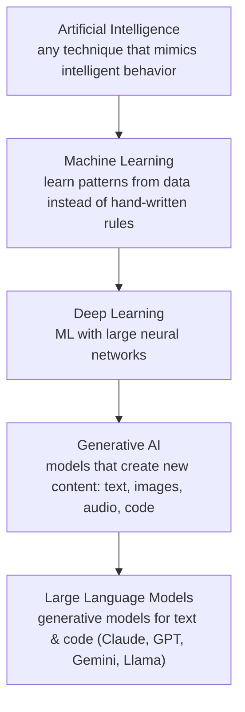
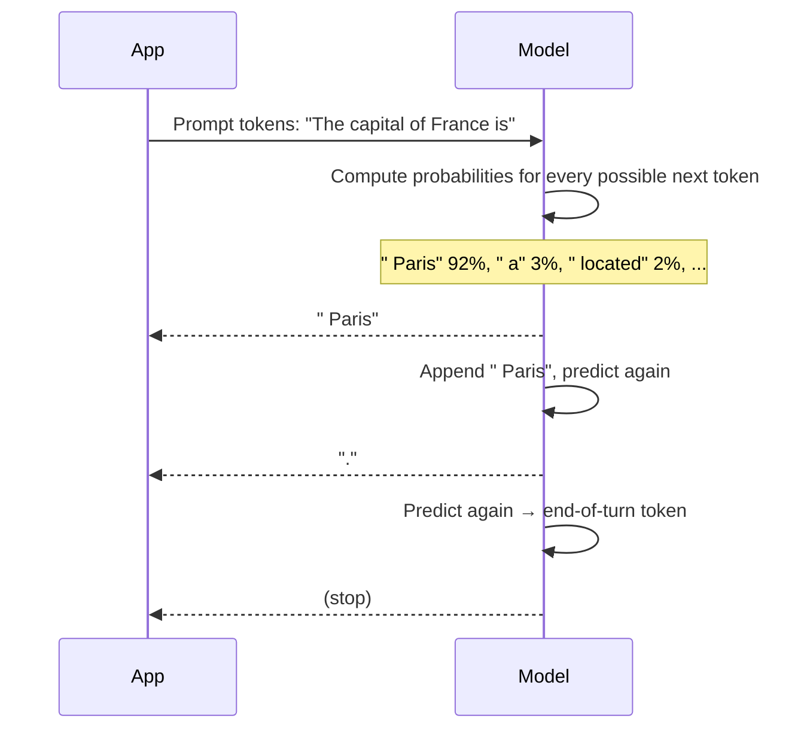
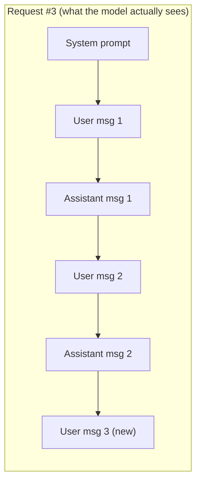
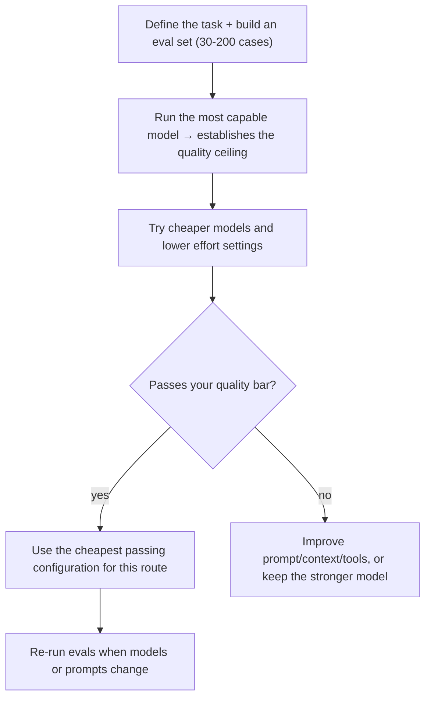

# Gen AI Fundamentals — How LLMs Work (the Builder's Mental Model)

> **AI Engineering · Foundations** — You don't need linear algebra to build great AI features. You do need an accurate picture of what happens between "send prompt" and "get text back" — because every cost, latency, and quality problem you'll debug later traces back to it.

---

## Table of Contents

1. The Autocomplete-on-Steroids Analogy
2. The Vocabulary: AI, ML, Deep Learning, Gen AI, LLM
3. Tokens — The Unit of Everything
4. Next-Token Prediction — How Text Gets Generated
5. Transformers & Attention — Just Enough Intuition
6. How Models Are Made: Pre-training → Instruction Tuning → Alignment
7. The Context Window — The Model's Only Memory
8. Sampling, Determinism & Reasoning Effort
9. Hallucinations — Why They Happen and How to Reduce Them
10. Embeddings — Meaning as Numbers
11. Choosing a Model — Capability, Latency, Cost
12. Practice Assignments (Low / Medium / High)
13. Mini Project — Token & Cost Explorer
14. Interview Corner
15. Quick Reference

---

## 1. The Autocomplete-on-Steroids Analogy

Your phone keyboard suggests the next word: type "See you" and it suggests "tomorrow". It learned that from the texts you've typed.

A **Large Language Model** is the same idea scaled up enormously:

- It learned from a huge amount of text (books, code, websites, documentation).
- Instead of suggesting one word from your texting habits, it predicts the next **token** from patterns across all of that text — including patterns of reasoning, code structure, and conversation.
- It repeats the prediction, one token at a time, feeding each output back in as input, until it decides it's done.

That simple loop explains a lot: why models are fluent (they learned how text *sounds*), why they can be confidently wrong (fluent-sounding continuation ≠ verified fact), and why **what you put in the prompt** changes everything (it's the text they're continuing).

---

## 2. The Vocabulary



| Term | Meaning |
|------|---------|
| **Foundation model** | A large model trained on broad data, usable for many tasks without retraining |
| **LLM** | A foundation model specialized in language (and usually code) |
| **Multimodal** | Accepts (or produces) more than text: images, PDFs, audio |
| **Inference** | Running a trained model to get output (what API calls do) |
| **Training / fine-tuning** | Changing the model's weights with data (rarely needed for app builders) |
| **Parameters / weights** | The learned numbers inside the model — billions of them |
| **Open-weight vs API models** | Download and host yourself (Llama, Mistral, Qwen) vs call a provider's API (Claude, GPT, Gemini) |

---

## 3. Tokens — The Unit of Everything

Models don't read characters or words; they read **tokens** — chunks of text from a fixed vocabulary (often tens of thousands of entries). Common words are one token; rare words split into pieces.

```text
"Refund order ORD-99812 please"
→ ["Ref", "und", " order", " ORD", "-", "998", "12", " please"]   (illustrative split)
```

**Rules of thumb for English**: ~1 token ≈ 3-4 characters ≈ ¾ of a word. Code, JSON, non-English languages, and unusual identifiers often cost **more** tokens per character. Different model families use different tokenizers, so counts differ between providers — measure with the provider's token-counting API rather than estimating.

| Why tokens matter | Example |
|-------------------|---------|
| **Pricing** | Billed per million input tokens and per million output tokens (output is typically several times pricier) |
| **Limits** | The context window and max output length are measured in tokens |
| **Latency** | Output is generated token by token; 1,000 output tokens take far longer than 100 |
| **Quirks** | Character-level tasks (count letters, reverse a string) are hard because the model sees tokens, not letters |

<div class="callout-tip">

**Applying this** — Output tokens usually dominate both cost and latency. The cheapest optimization is often asking for less output: "Return only the JSON", "Answer in at most 3 sentences", or structured output instead of prose. Log `input_tokens` and `output_tokens` for every call from day one — you'll need them for cost dashboards.

</div>

---

## 4. Next-Token Prediction — How Text Gets Generated



Key consequences:

1. **Generation is sequential.** Each token depends on all previous ones, which is why streaming is possible (and why long outputs are slow).
2. **The model has no separate "fact database".** Knowledge lives implicitly in the weights; it produces what is *likely* given the context. Likely usually means correct for well-known facts — and plausible-but-wrong for obscure ones.
3. **Input processing is parallel; output is serial.** A 50,000-token prompt is processed relatively quickly (and can be cached), while 5,000 output tokens are generated one by one.

---

## 5. Transformers & Attention — Just Enough Intuition

Modern LLMs use the **Transformer** architecture (introduced in the 2017 paper *"Attention Is All You Need"*). The core idea is **attention**: when processing each token, the model learns how much every other token in the context should influence it.

```text
"The customer returned the laptop because it was damaged."
                                           ↑
                        attention links "it" strongly to "laptop", not "customer"
```

| Idea | What to remember |
|------|------------------|
| Attention | Every token can "look at" every other token in the context — that's how models resolve references and follow long instructions |
| Layers | Dozens of stacked attention + feed-forward layers build increasingly abstract representations |
| Cost | Attention over long contexts is expensive, which is why long prompts cost money and time |
| Position | The model knows token order; very long contexts can make details in the middle harder to use reliably ("lost in the middle") |

<div class="callout-info">

**You don't need to implement a transformer to be an AI engineer.** But "every token attends to every other token" explains practical advice you'll see everywhere: put instructions clearly, separate data from instructions with tags or headings, and don't bury the one critical rule in the middle of 100 pages of context.

</div>

---

## 6. How Models Are Made: Pre-training → Instruction Tuning → Alignment

| Phase | What happens | Result |
|-------|--------------|--------|
| **Pre-training** | Predict the next token over a massive text corpus | A "base model" that continues text but doesn't reliably follow instructions |
| **Instruction tuning (supervised fine-tuning)** | Train on examples of instructions → good responses | Follows requests, answers questions |
| **Preference training (RLHF, RLAIF, Constitutional AI...)** | Train toward responses humans (or AI feedback guided by principles) prefer: helpful, honest, harmless | An assistant model with good behavior |
| **Reasoning training** | Train the model to think through problems before answering | Better at math, code, multi-step problems |

The **training cutoff** matters: the model knows nothing about events after it. For current or company-specific information, you must **provide it in the context** (RAG, tools, web search).

---

## 7. The Context Window — The Model's Only Memory

The **context window** is the maximum number of tokens (input + output) a single request can hold. Current frontier models offer very large windows — on the order of hundreds of thousands to a million tokens.

**The model has no memory between requests.** Chat apps *look* like they remember because the application resends the conversation history every turn.



| Implication | What to do |
|-------------|------------|
| Long conversations get expensive (history resent each turn) | Prompt caching for stable prefixes; summarize or trim old turns |
| More context ≠ better answers | Retrieve the *relevant* 5 chunks rather than dumping 500 pages |
| Hitting the limit fails the request | Count tokens; chunk; compaction/summarization |
| "Memory" features | Stored by your application (DB, memory tools) and injected into context |

<div class="callout-scenario">

**Scenario**: A support chatbot works great for 5 messages, then answers slow down and costs spike on long conversations. **Answer**: Each turn resends the whole history, so input tokens grow with every message. Fixes: **prompt caching** on the stable system prompt and earlier turns (cached input is billed at a small fraction of the normal rate), a sliding window or running summary of older turns, and moving large reference material out of the history into per-turn retrieval.

</div>

---

## 8. Sampling, Determinism & Reasoning Effort

At each step, the model has a probability distribution over the next token. **Sampling** picks from it.

| Setting | Effect |
|---------|--------|
| **Temperature** (on models that expose it) | Low (0-0.3) → more consistent, focused; high (0.8-1) → more varied, creative |
| **Top-p / top-k** | Restrict choices to the most likely tokens |
| **Max tokens** | Hard cap on output length (a response can be cut off mid-sentence) |
| **Stop sequences** | Strings that end generation |
| **Reasoning / thinking & effort** | Lets the model think before answering; higher effort = deeper reasoning, more tokens, more latency |

<div class="callout-warn">

**Even at temperature 0, outputs are not guaranteed identical.** Infrastructure-level nondeterminism (batching, floating-point order) means you should design for variation: validate outputs, use structured output, and evaluate on many runs — never assume one good run means it always works. Also note that some newer models no longer accept sampling parameters at all and are tuned through reasoning effort instead — check your provider's docs for the model you use.

</div>

### "Thinking" models

Recent models can spend tokens **reasoning before answering** (called extended or adaptive thinking). This substantially improves results on multi-step problems (debugging, planning, math, complex extraction), at the cost of latency and tokens. Many APIs expose an **effort** level: low effort for simple, high-volume tasks; high effort for hard ones.

---

## 9. Hallucinations — Why They Happen and How to Reduce Them

A **hallucination** is fluent, confident output that isn't true or isn't supported by the provided sources.

| Why | Example |
|-----|---------|
| The model predicts *plausible* text, not verified facts | Invents a Spring property that sounds right |
| The fact isn't in its training data or context | Your company's refund policy |
| The prompt pressures it to answer | "Give me the exact figure" when none exists |
| Ambiguous question | Picks one interpretation silently |

### Reduction techniques (in order of impact)

1. **Ground it**: provide the source material in context (RAG, tool results) and instruct it to answer **only** from that material.
2. **Allow "I don't know"**: explicitly permit and prefer it when sources are insufficient.
3. **Require citations** — then verify them programmatically (does the quoted text exist in the source?).
4. **Use tools for exact work**: calculators, database lookups, code execution instead of mental arithmetic.
5. **Structured output + validation**: schema checks, allowed values, cross-field rules.
6. **Evaluate**: measure hallucination rate on a test set; don't guess.

<div class="callout-interview">

**Q: "Why do LLMs hallucinate, and how do you reduce it?"**

They generate the most plausible continuation of the text, not a looked-up fact, so when the needed information is missing, or the prompt pushes for an answer, they produce something fluent but unsupported. I reduce it by grounding with retrieved sources or tool results, telling the model to answer only from them and to say when it doesn't know, requiring citations I can verify, using tools for exact computation, and measuring the hallucination rate on an evaluation set instead of trusting spot checks.

</div>

---

## 10. Embeddings — Meaning as Numbers

An **embedding model** converts text into a vector (a list of, say, 1,024 numbers) such that **similar meanings are close together** in that space.

```text
"How do I get my money back?"      → [0.12, -0.44, 0.08, ...]  ─┐ close
"What is your refund policy?"      → [0.10, -0.41, 0.11, ...]  ─┘
"Kafka partition rebalancing"      → [-0.52, 0.33, -0.19, ...]    far away
```

Similarity is usually measured with **cosine similarity** (the angle between vectors).

| Use case | How embeddings help |
|----------|---------------------|
| Semantic search | Find documents by meaning, not exact keywords |
| **RAG** | Retrieve relevant chunks to put in the prompt |
| Deduplication / clustering | Group similar tickets, find near-duplicate records |
| Classification & routing | Nearest labeled examples |
| Recommendations | "Similar articles" |

<div class="callout-info">

**Embedding models are separate from chat models.** Some LLM providers don't offer an embedding model themselves (Anthropic, for example, points customers to partners such as Voyage AI); others do (OpenAI, Google, Cohere), and open-source options (e5, bge, nomic) can run on your own hardware. You must use **the same embedding model** for indexing and for queries — vectors from different models aren't comparable, so changing models means re-embedding everything.

</div>

---

## 11. Choosing a Model — Capability, Latency, Cost

Model families usually come in tiers. Example from Anthropic's lineup at the time of writing (check current pricing pages — these change):

| Tier | Example | Relative cost (input / output per 1M tokens) | Good for |
|------|---------|----------------------------------------------|----------|
| Most capable | Claude Opus 5 | $5 / $25 | Complex reasoning, agentic coding, hard analysis |
| Balanced | Claude Sonnet 5 | $2 / $10 | Most production features |
| Fast & cheap | Claude Haiku 4.5 | $1 / $5 | High-volume classification, extraction, routing, sub-agents |

### A practical selection process



| Other factors | Questions |
|---------------|-----------|
| Latency | Time to first token? Total time for typical output length? |
| Data governance | Where is data processed? Retention? Enterprise agreements? Region requirements? |
| Deployment | Direct API vs cloud marketplaces (AWS Bedrock, Google Vertex AI, Azure) vs self-hosted open-weight |
| Features | Tool use, structured output, vision/PDF input, long context, prompt caching, batch discounts |

<div class="callout-scenario">

**Scenario**: A team uses the top model for everything, including classifying 2 million support tickets a month, and the bill is too high. **Decision**: Split by route. Build an eval set for classification, test a smaller/faster model (and lower effort) — classification often holds quality at a fraction of the cost — and process non-urgent backlogs with the **Batch API** (typically ~50% cheaper, asynchronous). Keep the top model for the hard routes (drafting complex replies) where it measurably wins. Judge cost per *completed* task, not per request.

</div>

---

## 12. 🏋️ Practice Assignments

### 🟢 Low — Build the reflexes

**L1.** Estimate the tokens and cost: a prompt of 3,000 English words and a response of 600 words, at $2 per 1M input tokens and $10 per 1M output tokens.

<details>
<summary>Show answer</summary>

~1 token ≈ ¾ word → input ≈ 4,000 tokens, output ≈ 800 tokens. Cost ≈ 4,000 × $2/1M + 800 × $10/1M = $0.008 + $0.008 = **$0.016 per call** → $16 per 1,000 calls. (Measure exactly with the provider's token counter; code and JSON tokenize less efficiently.)

</details>

**L2.** A chat app "remembers" the user's name from earlier in the conversation. Where does that memory actually live?

<details>
<summary>Show answer</summary>

In the **application**, not the model. The app stores the conversation and resends the history (or a summary) with every request; the model sees the name because it's in the current context window. Start a new conversation without that history and the model knows nothing.

</details>

**L3.** Why might a model fail "How many r's are in 'strawberry'?" while writing correct Java code?

<details>
<summary>Show answer</summary>

It processes **tokens**, not letters — "strawberry" may be one or two tokens, so letter-level counting isn't directly visible to it. Code follows patterns that are well represented at the token level. Fix for such tasks: give it a tool (code execution) or ask it to spell the word out character by character first.

</details>

### 🟡 Medium — Apply it

**M1.** Your RAG assistant answers questions about company policy. List five techniques, in priority order, to reduce hallucinated answers.

<details>
<summary>Show answer</summary>

1. Better retrieval (so the right policy text is actually in context) — measure the retrieval hit rate.
2. A strict instruction: answer only from the provided documents; if the answer isn't there, say so and suggest who to contact.
3. Require citations (document + section) and validate that cited passages exist.
4. Structured output separating `answer`, `citations`, and `confidence/insufficientContext` so the UI can handle "don't know" gracefully.
5. An eval set that includes unanswerable questions, tracking the hallucination rate and false "don't know" rate on every change.

</details>

**M2.** Explain why a 100K-token prompt plus a 100-token answer can be faster than a 2K-token prompt plus a 4,000-token answer.

<details>
<summary>Show answer</summary>

Input tokens are processed in parallel (prefill), and a cached prefix is even faster; output tokens are generated sequentially, one forward pass each. 4,000 sequential output tokens usually dominate total latency. Output length is the main latency lever — and cost lever, since output tokens are priced higher.

</details>

**M3.** You switch embedding models for better quality. What must you do with your existing vector index, and how do you roll it out safely?

<details>
<summary>Show answer</summary>

Re-embed **all** documents with the new model — vectors from different models live in different spaces and can't be compared (dimensions may also differ). Safe rollout: build the new index in parallel (a new table/column or collection), evaluate retrieval quality on your query eval set against the old one, shadow-query both, then switch reads over behind a flag and keep the old index until you're confident. Store the embedding model name/version alongside each vector.

</details>

### 🔴 High — Think like a senior

**H1.** A product manager asks: "Can we just put our entire 3,000-page knowledge base into the prompt, since the context window is huge?" Give a senior answer.

<details>
<summary>Show answer</summary>

It might technically fit a very large context window, but it's usually the wrong design: (1) **cost** — every question pays for the whole corpus in input tokens (caching helps, but the cache must stay warm and identical); (2) **latency** — processing huge prompts adds time; (3) **quality** — models can miss details buried in very long contexts, and irrelevant text can distract; (4) **freshness & permissions** — you can't easily filter by what the user is allowed to see or update one page. **RAG** retrieves the few relevant, permitted chunks per question. Long context is great for tasks that genuinely need the whole document at once (reviewing one contract, analyzing one long log). Decide with an eval: compare accuracy, latency, and cost per question for both approaches.

</details>

**H2.** Design a model-selection strategy for a platform with 6 AI features (ticket classification, reply drafting, contract review, chat assistant, code review bot, nightly report summarization).

<details>
<summary>Show answer</summary>

- **Per-route evals**: each feature gets its own eval set and quality bar, owned by the feature team.
- **Default by task type**: classification and routing → fast/cheap tier; nightly summarization → cheap tier via **Batch API**; chat assistant and reply drafting → balanced tier, streaming, prompt caching on the system prompt; contract review and code review → most capable tier with higher reasoning effort, because errors are expensive.
- **A model gateway/abstraction** in the platform (one internal client) that handles auth, retries, logging of tokens/cost/latency per feature, model version pinning, and fallbacks — so switching models is a config change plus an eval run.
- **Governance**: approved models list, data classification rules (what data may go to which provider/region), budgets and alerts per feature.
- **Re-evaluation cadence**: when a new model ships, run all eval suites; adopt per route only where it wins on quality or cost per completed task.

</details>

---

## 13. 🛠️ Mini Project — Token & Cost Explorer

**Goal**: build intuition with real numbers. One or two evenings, any language (Java example uses the official Anthropic Java SDK).

**Build a CLI that:**

1. Takes a prompt file and a model name.
2. Calls the token-counting endpoint to report input tokens **before** sending.
3. Sends the request, streams the output to the console, and records `input_tokens`, `output_tokens`, and wall-clock time to first token and to completion.
4. Computes cost from a small price table you maintain in config.
5. Runs the same prompt 5 times and prints how much the outputs differ (e.g., a simple word-overlap score).
6. Repeats with a short vs long requested output length and a cheap vs capable model; prints a comparison table.

```java
// Minimal request with the official Java SDK (com.anthropic:anthropic-java)
AnthropicClient client = AnthropicOkHttpClient.fromEnv();   // reads ANTHROPIC_API_KEY

MessageCreateParams params = MessageCreateParams.builder()
    .model("claude-opus-5")
    .maxTokens(16000L)
    .addUserMessage("Explain Kafka consumer groups in 3 sentences.")
    .build();

Message response = client.messages().create(params);
response.content().stream()
    .flatMap(block -> block.text().stream())
    .forEach(text -> System.out.println(text.text()));
System.out.println("input=" + response.usage().inputTokens()
    + " output=" + response.usage().outputTokens());
```

**Acceptance criteria**

- A README table: model × prompt length × output length → tokens, latency, cost.
- A short paragraph with your three most surprising findings.
- The API key comes from an environment variable, never from code.

---

## 🎯 Interview Corner

<div class="callout-interview">

**Q: "Explain how a large language model generates a response."**

The input text is split into tokens, and the transformer processes them with attention, so each token's representation takes the rest of the context into account. The model outputs a probability distribution over its vocabulary for the next token, one is sampled, appended to the context, and the process repeats until it emits an end token or hits the max-tokens limit. The prompt is processed in parallel, but output is generated one token at a time, which is why output length drives latency and why streaming works. Knowledge comes from pre-training plus instruction and preference tuning, so anything after the training cutoff, or private to a company, has to be supplied in the context.

</div>

<div class="callout-interview">

**Q: "What is a context window and what are its practical implications?"**

It's the maximum number of tokens — input plus output — a model can handle in one request, and it's the model's only working memory, since the API is stateless. Chat applications resend history every turn, so long conversations grow in cost and latency. That's why prompt caching, summarizing older turns, and retrieval matter. A bigger window doesn't mean you should fill it: irrelevant context raises cost and can hurt accuracy. Retrieving the relevant, permitted pieces usually beats dumping everything.

**Follow-up trap**: "So with a million-token window, is RAG dead?" → No. RAG still wins on cost per query, latency, permissions filtering, freshness of individual documents, and citations. Long context is complementary, for tasks that need a whole document at once.

</div>

<div class="callout-interview">

**Q: "What are embeddings and where do you use them?"**

An embedding model maps text to a fixed-length vector where semantic similarity becomes geometric closeness, usually measured with cosine similarity. I use them for semantic search and RAG retrieval, deduplicating or clustering similar tickets, and nearest-example classification or routing. Practical rules: index and query with the same embedding model, store the model version with the vectors, re-embed everything when you switch models, and evaluate retrieval quality on a set of real queries. Combining vectors with keyword search usually beats either alone, especially for product codes and exact identifiers.

</div>

---

## Quick Reference

| Concept | One-Liner |
|---------|-----------|
| LLM | Predicts the next token, repeatedly |
| Token | ~¾ word in English; unit of price, limits, latency |
| Output tokens | Pricier and slower than input — keep outputs lean |
| Attention | Every token weighs every other token in context |
| Training phases | Pre-train → instruction tune → preference/alignment → reasoning |
| Cutoff | No knowledge after training; supply current/private data in context |
| Context window | The only memory; history is resent each turn |
| Sampling | Temperature/top-p where supported; outputs vary — validate |
| Thinking/effort | More reasoning = better on hard tasks, more tokens and latency |
| Hallucination | Plausible ≠ true; ground, cite, allow "I don't know", evaluate |
| Embeddings | Meaning → vectors; same model for index and query |
| Model choice | Eval first; cheapest configuration that passes, per route |

---

## Related Topics

- `ai-roadmap` — where this fits in the learning path
- `prompt-engineering` — steering the model once you know how it works
- `rag-deep-dive` — embeddings and retrieval in practice
- `ai-in-system-design` — architecture-level decisions

> **An LLM is a brilliant improviser with no notes. Your job as an engineer is to hand it the right notes, check its work, and pay only for the performance you need.**

---

<!-- journey-link:start -->

<div class="callout-journey">

🛒 **ShopNorth Journey** — ShopNorth uses LLMs offline to extract product attributes and online for a support assistant — knowing how the models work shapes both designs.

**Continue the story:** [Chapter 15 · Evolving with AI](/tutorials/journey-15-ai) · **New here?** [Start the journey](/tutorials/journey-start)

</div>

<!-- journey-link:end -->
