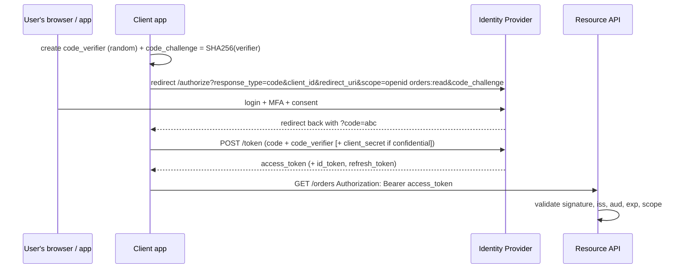
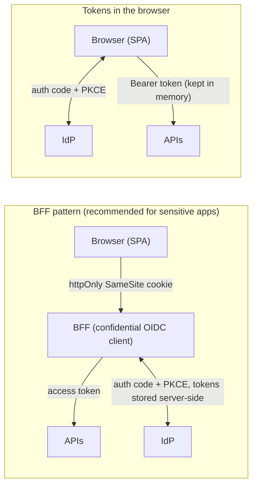

# Auth & Security Decisions — Choosing the Right Flow for Every Client, Service, and Partner

> **Architecture Decisions · Security** — "We use JWT" is not an authentication architecture. Real systems have browsers, mobile apps, backend services, partners, and enterprise customers — each needs a different flow. This page is a decision guide: which protocol, which OAuth grant, where tokens live, how services trust each other, and the mistakes that cause real breaches.

---

## Table of Contents

1. The Office Building Analogy
2. Authentication vs Authorization — and the Vocabulary
3. Sessions vs Tokens
4. OAuth 2.0 & OpenID Connect — The Flows That Matter
5. Decision Matrix: Which Flow for Which Client
6. Browser Apps: SPA Tokens vs the BFF Pattern
7. Service-to-Service: Client Credentials, mTLS, Workload Identity
8. Partners and Enterprise Customers: API Keys, SAML, SCIM
9. JWT Done Right — Validation, Lifetimes, Revocation
10. Authorization Models: RBAC, ABAC, ReBAC
11. Choosing an Identity Provider
12. Common Vulnerabilities (and How They Happen)
13. Practice Assignments (Low / Medium / High)
14. Mini Project — One App, Four Flows
15. Interview Corner
16. Quick Reference

---

## 1. The Office Building Analogy

- At the **front desk**, you prove who you are with your government ID → **authentication** (the identity provider).
- You receive a **visitor badge** that opens only floors 3 and 5, and expires at 6 PM → an **access token** with scopes and an expiry.
- The badge says "Visitor — Floors 3, 5" but not your full ID details → tokens carry **claims**, not passwords.
- On floor 5, the finance room has its own lock: the badge gets you on the floor, but whether you may open *that* cabinet is decided by the finance team → **authorization** in the service.
- The building's own staff (cleaning robots, HVAC systems) use **machine badges** → service-to-service credentials.
- A partner company's staff badge in using **their** company ID, trusted by agreement → **federation (SAML/OIDC SSO)**.

---

## 2. Authentication vs Authorization — and the Vocabulary

| Term | Meaning |
|------|---------|
| **Authentication (AuthN)** | Who are you? (login, MFA) |
| **Authorization (AuthZ)** | What may you do? (roles, permissions, ownership) |
| **Identity Provider (IdP)** | The system that authenticates users and issues tokens (Auth0, Cognito, Keycloak, Okta, Entra ID) |
| **OAuth 2.0** | A framework for **delegated authorization** — obtaining access tokens for APIs |
| **OpenID Connect (OIDC)** | An identity layer on top of OAuth 2.0 — adds the **ID token** and standard user info for **login** |
| **ID token** | "Who logged in" — for the **client app**; never send it to APIs as an access credential |
| **Access token** | "What this caller may access" — sent to **APIs** (often a JWT) |
| **Refresh token** | Long-lived credential to get new access tokens without re-login |
| **Scopes / audience** | What the token is for (`orders:read`) and which API it's for (`aud: shop-api`) |
| **SAML** | Older XML-based SSO protocol, still standard in enterprises |
| **mTLS** | Both sides present X.509 certificates — strong machine identity |

---

## 3. Sessions vs Tokens

| | Server-side session (cookie) | Self-contained token (JWT bearer) |
|--|------------------------------|-----------------------------------|
| State | Stored on the server (DB/Redis) | In the token; server validates the signature |
| Revocation | Instant (delete the session) | Hard before expiry (short lifetimes, denylists) |
| Scaling | Needs shared session storage | Stateless validation at every service |
| Browser security | httpOnly, Secure, SameSite cookie — not readable by JS | Where to store it in the browser is the hard part |
| Best for | Traditional web apps, BFFs | APIs, mobile apps, service-to-service |

<div class="callout-info">

**Not either/or**: a common modern setup is **cookie session between the browser and a BFF** (backend for frontend), and **OAuth access tokens between the BFF and APIs**. The browser never sees a token; APIs stay stateless.

</div>

---

## 4. OAuth 2.0 & OpenID Connect — The Flows That Matter

### Authorization Code + PKCE (users, any client)



**PKCE** (Proof Key for Code Exchange) ensures a stolen authorization code can't be redeemed by an attacker, because only the original client knows the `code_verifier`. The OAuth 2.0 Security Best Current Practice (and OAuth 2.1) makes PKCE the default for all clients.

### Other grants

| Grant | Use for | Notes |
|-------|---------|-------|
| **Client Credentials** | Service-to-service (no user) | Client ID + secret or, better, a private key JWT / mTLS |
| **Refresh Token** | Renewing access tokens | Use **rotation** (each use returns a new refresh token, reuse is detected) |
| **Device Authorization** | TVs, CLIs, IoT without a browser | User approves on another device |
| **Token Exchange** (RFC 8693) | A service acting on behalf of a user towards another API | Narrower, audience-specific tokens |
| ❌ Implicit | Formerly for SPAs | **Deprecated** — tokens in URLs leak |
| ❌ Resource Owner Password | Apps collecting passwords | **Deprecated** — defeats SSO/MFA and trains phishing |

---

## 5. Decision Matrix: Which Flow for Which Client

| Client / caller | Recommended | Token storage |
|-----------------|-------------|---------------|
| Server-rendered web app (Spring MVC/Thymeleaf) | OIDC Auth Code (+ PKCE), confidential client | Server session; httpOnly cookie to the browser |
| **SPA (React/Angular)** | **BFF pattern** (preferred) or Auth Code + PKCE in the browser | BFF: httpOnly cookie session; browser-only: tokens in memory, short-lived, refresh rotation |
| Native mobile app | Auth Code + PKCE via the system browser (AppAuth) | OS secure storage (Keychain / Android Keystore) |
| Backend service → backend service (no user context) | Client Credentials, or mTLS / workload identity | In memory; cached until near expiry |
| Service acting for a user downstream | Forward the user's token (same audience) or Token Exchange | — |
| Partner integration (B2B API) | Client Credentials per partner (+ mTLS for high security) or API keys for simple read APIs | Partner's secret store |
| Enterprise customers' employees (SSO) | Federation: SAML or OIDC with their IdP (Okta, Entra ID) via your IdP | — |
| CLI / TV / IoT | Device Authorization grant | Local secure storage |
| Webhooks from providers (Stripe, Razorpay) | HMAC signature verification (shared secret) | — |

<div class="callout-scenario">

**Scenario**: A React SPA stores the access and refresh tokens in `localStorage`. A third-party analytics script is compromised (a supply-chain attack) and exfiltrates tokens from thousands of users. **Decision**: Anything in `localStorage` is readable by any JavaScript on the page — one XSS or malicious script is enough. Move to the **BFF pattern**: the SPA talks to its own backend using an httpOnly, Secure, SameSite cookie; the BFF holds tokens server-side and calls APIs. Add a strict Content Security Policy and Subresource Integrity for third-party scripts.

</div>

---

## 6. Browser Apps: SPA Tokens vs the BFF Pattern



| | BFF | Tokens in the SPA |
|--|-----|-------------------|
| XSS impact | Attacker can make requests while the page is open, but **can't steal tokens** | Tokens can be stolen and used elsewhere |
| Extra component | Yes (a small backend) | No |
| CSRF | Needs SameSite cookies + CSRF protection | Not applicable for bearer tokens |
| Refresh tokens | Kept server-side | Must be in the browser (rotation + short lifetimes) |

<div class="callout-tip">

**Applying this** — Spring Boot makes a BFF straightforward: `spring-boot-starter-oauth2-client` handles the login and session, and Spring Cloud Gateway's `TokenRelay` filter forwards the user's access token to downstream APIs. The React app just calls same-origin `/api/...` with cookies.

</div>

---

## 7. Service-to-Service: Client Credentials, mTLS, Workload Identity

| Option | How | Strength |
|--------|-----|----------|
| **Client Credentials** | Service gets a token from the IdP with scopes; calls APIs with it | Good; centralized scopes and auditing |
| Private-key JWT client auth | The service signs its token request with a private key instead of a shared secret | Better (no shared secret) |
| **mTLS** | Both sides verify certificates; identity = certificate subject/SAN | Strong machine identity; used in banking/B2B and by service meshes automatically |
| **Workload identity** | The platform issues identities to workloads (Kubernetes service accounts → IRSA/EKS Pod Identity, SPIFFE/SPIRE) | No long-lived secrets at all |
| Shared API key between services | A static secret | Weakest: rotation pain, broad blast radius |

```java
// Spring: outbound calls with client-credentials tokens, fetched and refreshed automatically
@Bean
RestClient inventoryClient(RestClient.Builder builder, OAuth2AuthorizedClientManager manager) {
    var interceptor = new OAuth2ClientHttpRequestInterceptor(manager);            // Spring Security 6.4+
    interceptor.setClientRegistrationIdResolver(request -> "inventory-api");      // registration in application.yml
    return builder.baseUrl("https://inventory.internal").requestInterceptor(interceptor).build();
}
```

---

## 8. Partners and Enterprise Customers: API Keys, SAML, SCIM

| Need | Option |
|------|--------|
| Simple partner read API, low risk | **API keys** (hashed at rest, scoped, rotatable, per partner), over TLS, with rate limits |
| Partner write/financial APIs | OAuth Client Credentials, optionally **mTLS**; per-partner scopes; IP allow-lists |
| Enterprise SSO ("log in with our company's Okta") | **SAML 2.0** or **OIDC** federation per customer tenant, usually configured in your IdP |
| Enterprise user provisioning/deprovisioning | **SCIM** — the customer's directory creates/disables users in your app automatically |
| Incoming webhooks | Verify HMAC signatures with timestamps (replay protection) |

<div class="callout-warn">

**Deprovisioning is a security requirement.** When an enterprise customer's employee leaves, their access to your SaaS must end promptly. SSO stops new logins, but existing sessions and refresh tokens may live on — combine SSO with SCIM deprovisioning, short session lifetimes, and revoking refresh tokens on user disable.

</div>

---

## 9. JWT Done Right — Validation, Lifetimes, Revocation

### Validation checklist (every API, every request)

| Check | Why |
|-------|-----|
| Signature with the IdP's key (JWKS), **allowed algorithms only** (e.g., RS256/ES256) | Rejects forged and `alg: none` tokens |
| `iss` = your IdP | Rejects tokens from other issuers |
| **`aud` = this API** | A token for another API (or an ID token) must not work here |
| `exp` / `nbf` with small clock skew | Expired tokens rejected |
| Required scopes/permissions | Coarse-grained access |
| Token type (access vs ID token) | Some IdPs mark it; prevent ID-token misuse |

```yaml
# Spring Boot resource server: signature via JWKS discovery, issuer and audience validation
spring:
  security:
    oauth2:
      resourceserver:
        jwt:
          issuer-uri: https://login.shop.example/
          audiences: shop-api
```

### Lifetimes and revocation

| Token | Typical lifetime | Revocation strategy |
|-------|------------------|---------------------|
| Access token | 5-15 minutes | Mostly expires quickly; for emergencies, a short-TTL denylist of token IDs (`jti`) or users |
| Refresh token | Hours-days, sliding; **rotated** on use | Revoke at the IdP; reuse detection revokes the whole family |
| Session (BFF) | Idle timeout + absolute timeout | Delete server-side |

<div class="callout-interview">

**Q: "How do you revoke a JWT?"**

A signed JWT stays valid until it expires, so I keep access tokens short-lived, around 5-15 minutes, and put the long-lived part in refresh tokens that the IdP can revoke, with rotation and reuse detection. For urgent cases like a compromised account, APIs check a small denylist of token IDs or user IDs in Redis for the remaining access-token lifetime, or use token introspection for high-risk endpoints. Server-side sessions, for example in a BFF, allow instant revocation for browser users.

</div>

---

## 10. Authorization Models: RBAC, ABAC, ReBAC

| Model | Idea | Example | Good for |
|-------|------|---------|----------|
| **RBAC** | Roles → permissions | `ADMIN` can refund; `SUPPORT` can view orders | Most business apps; simple and auditable |
| **ABAC** | Rules over attributes (user, resource, context) | "Refund allowed if amount < ₹10,000 and user.region == order.region and during business hours" | Complex, contextual policies |
| **ReBAC** | Permissions from relationships | "Can edit doc if member of the folder's team" (Google Zanzibar style) | Sharing/collaboration apps (docs, projects) |
| **Ownership checks** | Resource belongs to the caller | `order.customerId == token.sub` | Every user-facing API — the most commonly forgotten check |

Policy engines (OPA/Rego, Cedar, OpenFGA/SpiceDB for ReBAC) help when rules grow beyond simple annotations.

```java
@PreAuthorize("hasAuthority('SCOPE_orders:read')")
@GetMapping("/orders/{id}")
OrderDto get(@PathVariable UUID id, @AuthenticationPrincipal Jwt jwt) {
    Order order = orders.findById(id).orElseThrow(OrderNotFound::new);
    if (!order.customerId().equals(jwt.getSubject())) throw new OrderNotFound();   // don't reveal it exists
    return OrderDto.from(order);
}
```

---

## 11. Choosing an Identity Provider

| IdP | Strengths | Consider |
|-----|-----------|----------|
| **Auth0 (Okta CIAM)** | Developer experience, many social/enterprise connections, Actions for custom logic, B2B organizations | Cost at scale (per MAU), vendor lock-in (see `auth0-deep-dive`) |
| **Amazon Cognito** | Cheap at scale, AWS-native (IAM, API Gateway, ALB) | Less flexible customization, UX/feature gaps |
| **Keycloak** (self-hosted) | Open source, full-featured, no per-user fees | You operate it: upgrades, HA, security patches |
| **Okta / Microsoft Entra ID** | Workforce identity, enterprise SSO | Primarily employee/B2B scenarios |
| Firebase Auth / Supabase Auth | Fast for startups/mobile | Enterprise features limited |

<div class="callout-tip">

**Applying this** — Never build your own password storage, MFA, and token issuance unless identity is your product. Use a standards-based IdP (OIDC), keep your apps coded against the **standards** (Spring Security's OIDC/resource server support) rather than vendor SDKs where possible, and switching IdPs later becomes a configuration migration instead of a rewrite.

</div>

---

## 12. Common Vulnerabilities (and How They Happen)

| Vulnerability | How it happens | Prevention |
|---------------|----------------|------------|
| **IDOR / BOLA** (Broken Object Level Authorization) | API checks the token but not ownership: `GET /orders/882` returns someone else's order | Ownership checks on every resource; tests for cross-user access — #1 in the OWASP API Security Top 10 |
| Missing `aud` validation | A token issued for another app works on your API | Validate audience |
| `alg: none` / algorithm confusion | Library accepts unsigned tokens or treats a public key as an HMAC secret | Pin allowed algorithms; maintained libraries |
| Tokens in `localStorage` + XSS | Script steals tokens | BFF or in-memory tokens; CSP |
| Open redirects in login flows | Attacker-controlled `redirect_uri` receives codes | Exact redirect URI registration |
| Long-lived tokens / no rotation | Stolen token usable for weeks | Short access tokens, rotated refresh tokens |
| Secrets in Git / frontend bundles | Client secrets leaked | Secret managers; public clients have no secrets (PKCE) |
| Missing MFA for admins | Credential stuffing takes over admin accounts | Enforce MFA (phishing-resistant for admins: WebAuthn/passkeys) |
| Mass assignment | Client sends `"role": "ADMIN"` in a profile update | Explicit DTOs; never bind directly to entities |

---

## 13. 🏋️ Practice Assignments

### 🟢 Low — Build the reflexes

**L1.** Which token does each recipient use: (a) the React app wants to show the user's name, (b) the order API decides whether to serve a request?

<details>
<summary>Show answer</summary>

(a) The **ID token** (or the userinfo endpoint) — identity information for the client. (b) The **access token** — its audience is the API, with scopes. APIs must reject ID tokens used as access tokens.

</details>

**L2.** Pick the flow: (a) a nightly batch job calling the billing API, (b) an Android app, (c) a smart TV app, (d) a Spring MVC server-rendered admin portal.

<details>
<summary>Show answer</summary>

(a) Client Credentials (or workload identity/mTLS). (b) Authorization Code + PKCE via the system browser; tokens in the Android Keystore. (c) Device Authorization grant. (d) OIDC Authorization Code (confidential client, + PKCE) with a server-side session cookie.

</details>

**L3.** List four claims/properties your API must validate on every JWT.

<details>
<summary>Show answer</summary>

Signature (with allowed algorithms and the IdP's current keys), issuer (`iss`), audience (`aud`), expiry (`exp`/`nbf`) — plus required scopes/permissions for the endpoint.

</details>

### 🟡 Medium — Apply it

**M1.** Find the vulnerability and fix it:

```java
@GetMapping("/invoices/{id}")
@PreAuthorize("isAuthenticated()")
InvoiceDto get(@PathVariable long id) { return InvoiceDto.from(invoiceRepo.findById(id).orElseThrow()); }
```

<details>
<summary>Show answer</summary>

**IDOR/BOLA**: any logged-in user can read any invoice by iterating IDs (sequential longs make it trivial). Fix: check ownership (`invoice.customerId == jwt.sub`, or tenant membership), return 404 for others; use non-guessable IDs (UUIDs) as defense in depth, not as the primary control; add automated tests that user A cannot read user B's invoice; log and alert on patterns of 404s across sequential IDs.

</details>

**M2.** Design authentication for a B2B SaaS where each customer company wants to use its own Okta or Entra ID, plus some small customers using email/password.

<details>
<summary>Show answer</summary>

Use an IdP with multi-tenant "organizations" support (Auth0 Organizations, Cognito with per-tenant federation, Keycloak realms/IdP brokering). Per customer: configure an enterprise connection (SAML or OIDC) to their IdP; home-realm discovery by email domain at login routes users to their company's IdP. Small customers use database connections with MFA. Tokens include an `org_id`/tenant claim; every API enforces tenant isolation. SCIM provisioning for customers that want automatic joiner/leaver sync; just-in-time provisioning otherwise. Admin roles per tenant (RBAC), audit logs per tenant.

</details>

**M3.** Design token lifetimes and revocation for a banking web app (a BFF in front of APIs).

<details>
<summary>Show answer</summary>

Browser ↔ BFF: server-side session with httpOnly/Secure/SameSite=Strict cookie, idle timeout ~10 minutes, absolute timeout ~8-12 hours, step-up authentication (MFA) for high-risk actions (transfers, adding payees). BFF ↔ APIs: access tokens of ~5 minutes; refresh tokens rotated and bound to the BFF (confidential client). Revocation: logout destroys the session and revokes refresh tokens at the IdP; "logout everywhere" revokes all sessions for the user; compromised accounts trigger a user-level denylist checked by APIs for the remaining access-token lifetime. Monitor unusual token usage (new device, geography).

</details>

### 🔴 High — Think like a senior

**H1.** Your company has 40 microservices, each validating tokens differently (some don't check `aud`, two use a shared static API key between them). Design a consistent security architecture and a migration plan.

<details>
<summary>Show answer</summary>

**Target**: edge gateway validates user tokens (issuer, audience, scopes) and strips untrusted headers; every service is a resource server using a shared, platform-maintained Spring Security starter (issuer/audience/allowed algorithms configured centrally, standard error handling, method security); service-to-service calls use client credentials with per-service scopes or workload identity + mTLS via a mesh; no static shared secrets; fine-grained authorization (ownership, tenant) in each service with tests. **Migration**: inventory current validation per service (a scanner/test that sends tokens with wrong `aud`, expired, and `alg: none`); roll out the shared starter service by service behind contract tests; introduce client credentials for internal callers alongside the old keys, then remove the keys; rotate every existing secret; add CI security tests (IDOR test harness, token validation tests) and gateway-level telemetry of rejected tokens. Track progress on a dashboard.

</details>

**H2.** Design authentication for a payments platform used by merchants' servers (API), merchants' staff (dashboard), and end customers (checkout page), with PCI and fraud concerns.

<details>
<summary>Show answer</summary>

- **Merchant servers → API**: secret API keys (per environment: test/live), shown once, stored hashed, rotatable with overlap, restricted by IP allow-lists and scopes; high-risk endpoints optionally with mTLS or request signing (HMAC with timestamps against replay). Idempotency keys required on money-moving calls.
- **Webhooks to merchants**: signed payloads (HMAC + timestamp), retries with backoff, and a secret the merchant can rotate.
- **Merchant dashboard**: OIDC login with MFA mandatory (WebAuthn/passkeys encouraged), RBAC per merchant organization (owner, developer, finance, support), SSO for large merchants, audit logs of all sensitive actions (key creation, payout changes), step-up auth for payout-account changes.
- **Customer checkout**: no customer account needed; card data captured in a PCI-scoped hosted field/iframe so merchant sites never touch card numbers (reduces merchants' PCI scope); 3-D Secure for customer authentication per regulations; publishable (non-secret) keys in the browser limited to creating payment intents.
- **Platform**: separation of test/live data and keys, secret scanning (detect leaked keys on GitHub and auto-revoke), fraud scoring on logins and API usage.

</details>

---

## 14. 🛠️ Mini Project — One App, Four Flows

**Goal**: Implement the four flows you'll meet in almost every company, with Keycloak running locally. 3 evenings.

**Setup**: Keycloak in Docker with a realm `shop`, clients for each flow, users with roles `CUSTOMER` and `SUPPORT`.

**Build**

1. **Resource server** `order-api` (Spring Boot): validates issuer + audience; `@PreAuthorize` scope checks; ownership checks; tests proving user A can't read user B's orders (IDOR test).
2. **BFF + SPA**: a Spring Boot BFF (`oauth2-client`, session cookie, `TokenRelay` via Spring Cloud Gateway) serving a small React page that lists "my orders" — confirm no tokens are visible to JavaScript (DevTools).
3. **Service-to-service**: a `reporting-job` using client credentials to call `order-api` with a `reports:read` scope; token caching until near expiry.
4. **Device flow** (stretch): a CLI that logs in via the device authorization grant and calls the API.
5. **Negative tests**: expired token, wrong audience, token signed by another key, ID token used as access token, missing scope → all rejected with 401/403.

**Acceptance criteria**

- A README with a diagram per flow and a table of token lifetimes and storage.
- All negative tests pass in CI.
- No client secrets committed; Keycloak config exported as a realm JSON with placeholders.

---

## 🎯 Interview Corner

<div class="callout-interview">

**Q: "Explain OAuth 2.0 vs OpenID Connect."**

OAuth 2.0 is a framework for delegated authorization: a client obtains an access token scoped to specific permissions and uses it to call an API on the user's behalf, without ever handling the user's password. On its own, OAuth doesn't define how to identify the user. OpenID Connect adds an identity layer on top: the ID token — a signed JWT about the authenticated user for the client app — plus standard scopes like `openid` and `profile`, a userinfo endpoint, and discovery metadata. So OIDC is for login and OAuth access tokens are for API access. A common bug is sending ID tokens to APIs, which should reject them by checking the audience and token type.

</div>

<div class="callout-interview">

**Q: "How should a single-page app handle authentication securely?"**

My preferred approach for anything sensitive is a backend for frontend. The SPA talks only to its own backend using an httpOnly, Secure, SameSite session cookie. The BFF is a confidential OIDC client that does the authorization code flow with PKCE, keeps access and refresh tokens server-side, and relays access tokens to APIs. An XSS bug then can't steal tokens. If a browser-only SPA is required, it uses authorization code with PKCE, keeps short-lived tokens in memory rather than localStorage, uses refresh token rotation, and has a strict Content Security Policy. The implicit flow is deprecated.

**Follow-up trap**: "Aren't cookies vulnerable to CSRF?" → Yes, so SameSite cookies plus CSRF tokens or checks on state-changing requests are part of the BFF design. That's a far smaller risk than exposing tokens to JavaScript.

</div>

<div class="callout-interview">

**Q: "What's the most common security bug in APIs, and how do you prevent it?"**

Broken object-level authorization, also called IDOR — the top item in the OWASP API Security Top 10. The API authenticates the caller correctly but never checks that the requested resource belongs to them, so changing an ID in the URL exposes other users' data. Prevention: authorization checks on every resource access based on the token's subject or tenant, enforced in the service rather than only at the gateway. Return 404 instead of 403 to avoid leaking existence. Add automated tests where user A tries to access user B's resources, and monitor for enumeration patterns. Non-guessable IDs help, but they're defense in depth, not the control.

</div>

---

## Quick Reference

| Topic | Decision |
|-------|----------|
| Login | OIDC Authorization Code + PKCE (everywhere) |
| Web apps | Server session cookie; SPAs via BFF when possible |
| Mobile | Auth Code + PKCE via system browser; secure OS storage |
| Service-to-service | Client credentials, mTLS, or workload identity; no shared static keys |
| Partners | Scoped API keys (hashed) or client credentials (+ mTLS); webhooks signed |
| Enterprise | SAML/OIDC federation + SCIM |
| JWT validation | Signature (pinned algs), iss, **aud**, exp, scopes |
| Lifetimes | Access 5-15 min; refresh rotated; sessions with idle + absolute timeouts |
| AuthZ | RBAC for roles, ABAC for context, ReBAC for sharing — always ownership checks |
| Top bug | IDOR/BOLA — test cross-user access |

---

## Related Topics

- `auth0-deep-dive` — a full IdP implementation walkthrough
- `api-gateway-pattern` — validating tokens at the edge
- `k8s-production` — workload identity and RBAC in clusters
- `ai-production-llmops` — least privilege for AI tools and agents

> **Authentication proves who's knocking; authorization decides which doors open. Pick the flow that fits each caller, keep tokens short-lived and out of JavaScript, and check ownership on every single request.**

---

<!-- journey-link:start -->

<div class="callout-journey">

🛒 **ShopNorth Journey** — ShopNorth verifies tokens in every service and enforces ownership inside its queries — authenticate at the edge, authorize at the data.

**Continue the story:** [Chapter 7 · Security & Login](/tutorials/journey-07-security) · **New here?** [Start the journey](/tutorials/journey-start)

</div>

<!-- journey-link:end -->
