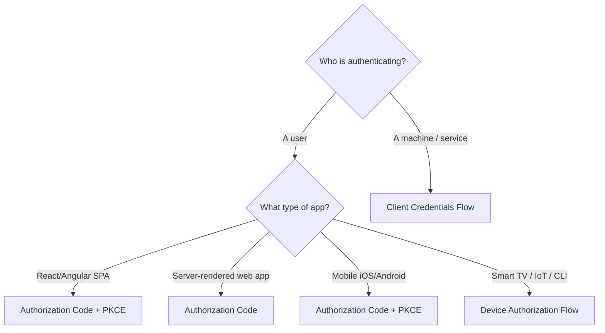
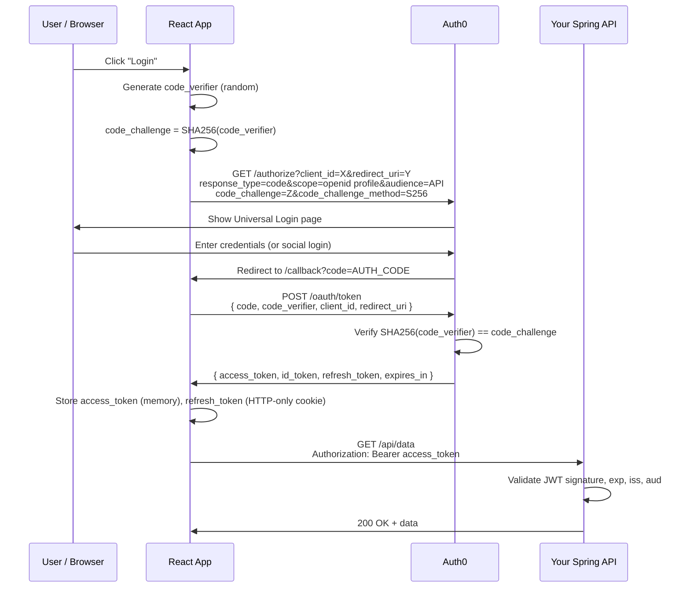
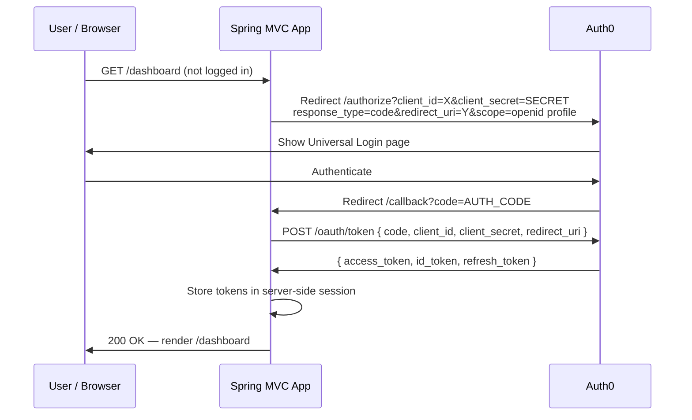
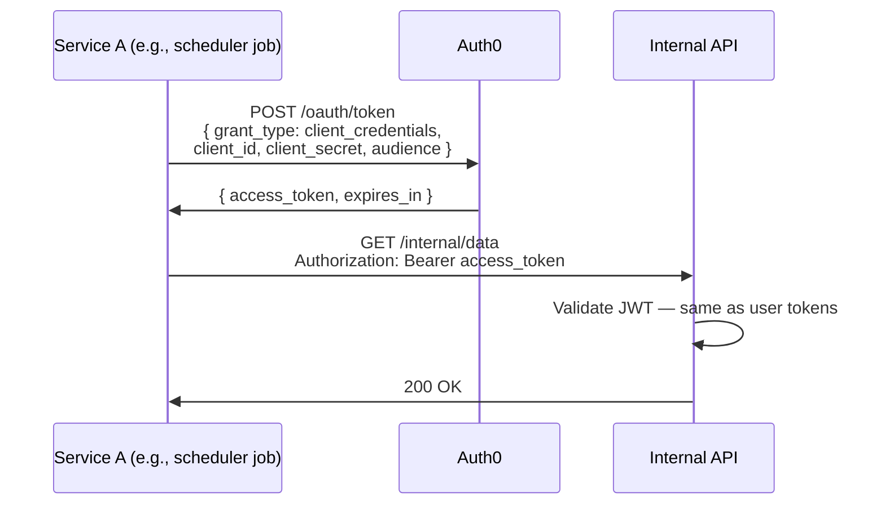
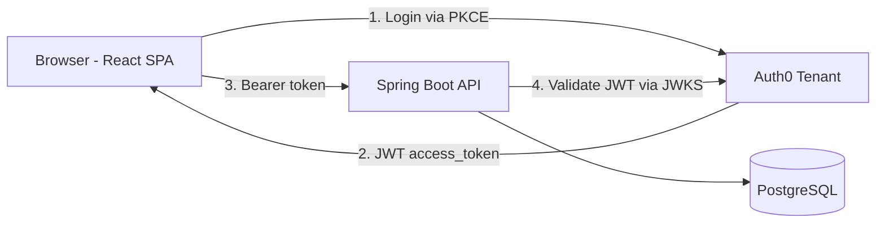
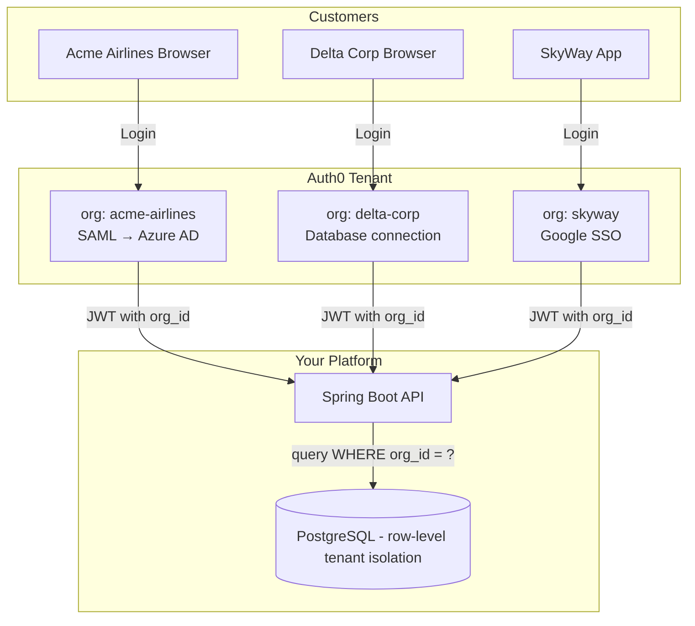
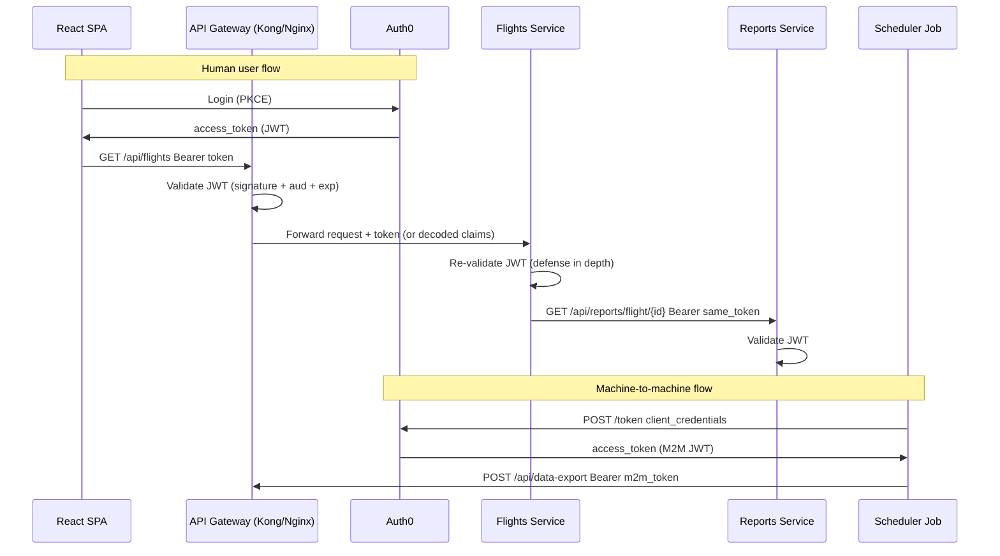

# Auth0 — Zero to Industry Implementation

> A complete, practitioner-level guide to understanding and implementing Auth0 in real applications — from first principles to production-grade multi-tenant systems.

---

## Table of Contents

1. [Why Auth Exists as a Problem](#1-why-auth-exists-as-a-problem)
2. [Authentication vs Authorization — The Foundation](#2-authentication-vs-authorization)
3. [OAuth 2.0 — The Open Standard](#3-oauth-20)
4. [OpenID Connect (OIDC) — Identity on Top of OAuth2](#4-openid-connect-oidc)
5. [JWT — The Token Format](#5-jwt-the-token-format)
6. [What Auth0 Actually Is](#6-what-auth0-actually-is)
7. [Auth0 Core Concepts](#7-auth0-core-concepts)
8. [OAuth2 Flows — Which One for Your App](#8-oauth2-flows)
9. [RBAC — Roles, Permissions, and Enforcement](#9-rbac-in-auth0)
10. [Spring Boot Integration — Resource Server](#10-spring-boot-integration)
11. [React SPA Integration](#11-react-spa-integration)
12. [Machine-to-Machine (M2M)](#12-machine-to-machine-m2m)
13. [Use Case: Small Single-Tenant App](#13-use-case-small-app)
14. [Use Case: Medium Multi-Tenant SaaS](#14-use-case-medium-saas)
15. [Use Case: Complex Microservices Platform](#15-use-case-microservices)
16. [Auth0 Actions — Custom Logic](#16-auth0-actions)
17. [Organizations — Multi-Tenancy Built-In](#17-organizations)
18. [Production Patterns and Hardening](#18-production-patterns)
19. [Auth0 vs Alternatives](#19-auth0-vs-alternatives)
20. [Interview Questions — With Model Answers](#20-interview-questions)

---

## 1. Why Auth Exists as a Problem

Imagine you're building a web app. On Day 1 it's a side project — one user, you. Authentication is trivial: one hardcoded admin password. On Day 30 you have 100 users. You add a user table, hash passwords with bcrypt, build a login form. On Day 180 you have 10,000 users. A competitor's database gets breached. Users reuse passwords. You start getting account takeover attempts. You need MFA, but that means SMS or TOTP — another integration. Corporate clients want to log in with their company's Active Directory. Some users expect "Login with Google." You need password reset emails. You need to comply with GDPR (forget-me requests). You need to audit every login for a financial client. You need to block logins from certain countries. You need to handle token expiry gracefully.

**This is the real scope of "auth."** It is not just a user table and bcrypt.

```
What "auth" actually means at production scale:
┌─────────────────────────────────────────────────────────────────┐
│  Credential storage   Password hashing (Argon2, bcrypt)         │
│  MFA                  TOTP (Google Authenticator), SMS, Push     │
│  Social login         Google, GitHub, Apple, Facebook           │
│  Enterprise SSO       SAML 2.0, OIDC with Okta, Azure AD       │
│  Session management   Tokens, refresh, revocation               │
│  Security events      Brute force, credential stuffing defense  │
│  Compliance           GDPR, HIPAA, SOC2, user data portability  │
│  Audit logs           Every login, failed attempt, MFA event    │
│  Password policies    Strength, expiry, breach detection        │
│  Bot detection        CAPTCHA, behavioral analysis              │
└─────────────────────────────────────────────────────────────────┘
```

Building all of this from scratch for your startup would take a team of security engineers 6–12 months and would still have gaps. Auth0 is a managed identity platform that gives you all of it out of the box — so you can build your product, not your auth infrastructure.

<div class="callout-tip">

**The golden rule in security** — Don't roll your own auth unless you are a security company. Every line of auth code you write is a potential vulnerability. Auth0 is used by thousands of companies and has a dedicated security team watching for threats 24/7. Your 3-person startup does not have that.

</div>

---

## 2. Authentication vs Authorization

These terms are often confused. Understanding the distinction is foundational.

| Concept | Question it answers | Example |
|---------|--------------------|---------| 
| **Authentication** | *Who are you?* | You log in with your email + password. The system verifies you are indeed `vinayak@example.com`. |
| **Authorization** | *What are you allowed to do?* | You are logged in. But can you access `/admin/reports`? Only if you have the `ADMIN` role. |

```
Authentication → Identity verification → "You are who you say you are"
Authorization  → Permission enforcement → "You are allowed to do this"

Example flow:
1. User hits /admin/dashboard
2. App checks: are you authenticated? (do you have a valid token?)
   → No: redirect to login
   → Yes: proceed to step 3
3. App checks: are you authorized? (do you have ADMIN role?)
   → No: return 403 Forbidden
   → Yes: render the dashboard
```

Auth0 handles **authentication** and issues tokens that carry **authorization** metadata (roles, permissions) as claims. Your application then enforces authorization using those claims.

<div class="callout-tip">

**In Spring Security:** `@PreAuthorize("hasRole('ADMIN')")` is authorization. The JWT filter that validates the token before that is authentication. They are separate concerns, and Spring Security separates them cleanly.

</div>

---

## 3. OAuth 2.0

OAuth 2.0 (RFC 6749) is an authorization framework — it defines how a user can grant a third party limited access to their resources, without sharing credentials.

### The Problem OAuth2 Solves

Before OAuth, if you wanted to use "Login with Google" on your app, you'd have to ask the user for their Google password. That's insane — you should never have someone else's credentials. OAuth2 introduces a **delegation model**: the user grants *your app* permission to act on their behalf, with a *scoped, time-limited token* — and their credentials never leave Google.

### The Four Roles

```
┌──────────────────────────────────────────────────────────────┐
│                    OAuth 2.0 Roles                           │
├─────────────────────┬────────────────────────────────────────┤
│ Resource Owner      │ The user (the human with the data)     │
│ Client              │ Your application (wants the data)      │
│ Authorization Server│ Auth0 (verifies identity, issues tokens)│
│ Resource Server     │ Your API (has the data, trusts tokens)  │
└─────────────────────┴────────────────────────────────────────┘
```

### Core OAuth2 Concepts

**Access Token** — A credential your app presents to the API. Short-lived (minutes to hours). Proves the holder has been authorized. In Auth0, this is a JWT.

**Refresh Token** — A long-lived credential (days to weeks). Your app uses it to get new access tokens without making the user log in again. Never sent to the API — only used at the token endpoint.

**Authorization Code** — A temporary, one-time-use code returned after the user authenticates. Your app exchanges it for tokens. Designed so tokens never travel through the browser's URL bar.

**Scope** — What the token permits. `openid profile email` means the token grants access to the user's OpenID identity, profile data, and email. You can define custom scopes for your API (e.g., `read:flights`, `write:reports`).

**Client ID / Client Secret** — Credentials for your *application* (not the user). The client ID is public. The client secret is private — only server-side apps can keep it secret. SPAs and mobile apps cannot.

### Why PKCE Exists

SPAs run in the browser — you cannot hide a client secret there. PKCE (Proof Key for Code Exchange, RFC 7636) solves this.

```
PKCE flow:
1. App generates a random 64-byte string: code_verifier = "random_long_string_abc123..."
2. App creates its SHA-256 hash:          code_challenge = SHA256(code_verifier)  
3. App sends code_challenge to Auth0 in the /authorize request
4. User authenticates, Auth0 returns authorization_code
5. App sends authorization_code + code_verifier to /token
6. Auth0 hashes code_verifier and compares to code_challenge
7. If they match → tokens issued. If not → rejected.

Attack scenario without PKCE:
  Attacker intercepts authorization_code (e.g., from redirect URI in browser history)
  → With PKCE: useless, attacker doesn't have code_verifier
  → Without PKCE (no secret for SPA): attacker exchanges code for tokens → account takeover

PKCE replaces the client secret for public clients (SPAs, mobile apps).
```

<div class="callout-tip">

**PKCE is mandatory for SPAs and mobile apps.** Auth0 requires it by default for these application types. There is no good reason to disable it.

</div>

---

## 4. OpenID Connect (OIDC)

OAuth 2.0 is an *authorization* framework — it tells you what a user can do, but doesn't tell you *who* the user is. OpenID Connect (OIDC) is a thin identity layer built on top of OAuth 2.0 that adds authentication.

### What OIDC Adds

| Feature | OAuth 2.0 alone | With OIDC |
|---------|----------------|-----------|
| Access Token | ✅ | ✅ |
| Refresh Token | ✅ | ✅ |
| **ID Token** | ❌ | ✅ (JWT with user identity) |
| **UserInfo endpoint** | ❌ | ✅ |
| **Standard claims** | ❌ | ✅ (sub, name, email, picture...) |
| Who is logged in? | Unknown | Known via ID Token |

### The ID Token

The ID Token is a JWT issued alongside the access token. It is **for your application** (the client) — not for your API. It tells your frontend who just logged in.

```json
{
  "iss": "https://your-tenant.us.auth0.com/",
  "sub": "auth0|64f1a2b3c4d5e6f7g8h9i0j1",
  "aud": "your-app-client-id",
  "exp": 1717000000,
  "iat": 1716996400,
  "name": "Vinayak S",
  "email": "vinayak@example.com",
  "picture": "https://lh3.googleusercontent.com/...",
  "email_verified": true
}
```

### The Access Token (for your API)

The access token is **for your API** (the resource server). Your API validates it to know the caller is authenticated. When the `audience` parameter matches your API identifier in Auth0, the access token is also a JWT with your custom claims.

```json
{
  "iss": "https://your-tenant.us.auth0.com/",
  "sub": "auth0|64f1a2b3c4d5e6f7g8h9i0j1",
  "aud": "https://api.yourapp.com",
  "exp": 1717000000,
  "iat": 1716996400,
  "scope": "openid profile email read:flights",
  "https://yourapp.com/roles": ["AIRLINE_ADMIN", "FLEET_VIEWER"],
  "https://yourapp.com/tenant": "acme-airlines"
}
```

<div class="callout-tip">

**Common beginner mistake** — sending the ID token to your API. The ID token is for your client app only. Your API should validate the access token (with your API's audience), not the ID token.

</div>

---

## 5. JWT — The Token Format

JWTs (JSON Web Tokens, RFC 7519) are the token format Auth0 uses for both access tokens and ID tokens.

### Structure

A JWT is three Base64URL-encoded segments joined by dots:

```
eyJhbGciOiJSUzI1NiIsInR5cCI6IkpXVCIsImtpZCI6InRlc3QifQ
.
eyJzdWIiOiJhdXRoMHwxMjM0NTYiLCJpc3MiOiJodHRwczovL2Rldi54eXoudXMuYXV0aDAuY29tLyIsImF1ZCI6Imh0dHBzOi8vYXBpLnlvdXJhcHAuY29tIiwiZXhwIjoxNzE3MDAwMDAwLCJpYXQiOjE3MTY5OTY0MDB9
.
[signature]

Header  → { "alg": "RS256", "typ": "JWT", "kid": "test" }
Payload → { "sub": "auth0|123456", "iss": "...", "aud": "...", "exp": ..., "iat": ... }
Signature → RS256(base64(header) + "." + base64(payload), private_key)
```

### Standard Claims (Registered Claim Names)

| Claim | Full Name | Meaning |
|-------|-----------|---------|
| `iss` | Issuer | Who created this token (Auth0 tenant URL) |
| `sub` | Subject | Who this token is about (user ID) |
| `aud` | Audience | Who this token is for (your API identifier) |
| `exp` | Expiration | Unix timestamp — token is invalid after this |
| `iat` | Issued At | When the token was issued |
| `jti` | JWT ID | Unique ID for the token (useful for blacklisting) |

### Signing Algorithms

**HS256 (HMAC + SHA-256)** — Symmetric. One shared secret for both signing and verification. If your API verifies tokens, it needs the secret. If the secret leaks from any server, attackers can forge tokens. Suitable only when the same party both issues and verifies tokens.

**RS256 (RSA + SHA-256)** — Asymmetric. Auth0 signs with a private key. Your API verifies with Auth0's public key. The private key never leaves Auth0. Even if an attacker compromises your API, they can't forge tokens. **This is the correct choice for APIs.**

**ES256 (ECDSA + SHA-256)** — Asymmetric like RS256 but with shorter keys and faster verification. Newer Auth0 tenants may use this.

### JWKS — The Public Key Distribution Mechanism

Auth0 publishes its public keys at a well-known URL:

```
https://your-tenant.us.auth0.com/.well-known/jwks.json
```

Response:
```json
{
  "keys": [
    {
      "kty": "RSA",
      "use": "sig",
      "n": "...modulus...",
      "e": "AQAB",
      "kid": "test-key-id",
      "x5c": ["...certificate..."]
    }
  ]
}
```

Your Spring Boot app fetches this on startup and caches the public keys. When a JWT arrives, it reads the `kid` (Key ID) from the header, finds the matching key from JWKS, and verifies the signature. Auth0 rotates keys periodically — Spring Security's resource server auto-handles rotation by re-fetching JWKS when an unknown `kid` appears.

### Why JWT Verification Needs No Database Call

```
Traditional session validation:
  Request arrives → Extract session ID → Query database → Get user → Check auth

JWT validation:
  Request arrives → Extract JWT → Verify RS256 signature with cached public key
  → Check exp, iss, aud claims → Extract roles from claims → Done

The JWT is self-contained. The private key only lives at Auth0.
If the signature is valid and the claims are within bounds → you trust the token.
No network call needed for each request.
```

<div class="callout-tip">

**This is why JWTs are used in microservices.** Each service can independently validate a JWT with just the public key. No auth service roundtrip on each request. This is the scalability win.

</div>

---

## 6. What Auth0 Actually Is

Auth0 is a managed **Identity Platform** (IDaaS — Identity as a Service). Think of it as outsourcing your entire authentication infrastructure:

```
What you hand off to Auth0:
┌────────────────────────────────────────────────────────────────┐
│  Authorization Server        Issues OAuth2/OIDC tokens         │
│  User Database               Stores credentials, profiles      │
│  Password hashing            Argon2/bcrypt managed for you     │
│  MFA engine                  TOTP, SMS, push notifications     │
│  Social connections          Google, GitHub, Apple, etc.       │
│  Enterprise SSO              SAML 2.0, OIDC with AD/Okta      │
│  Brute-force protection      Auto-blocks suspicious IPs        │
│  Breached password detection Checks HaveIBeenPwned API        │
│  Anomaly detection           Impossible travel, new device     │
│  Audit logs                  Every auth event, searchable      │
│  Email templates             Welcome, reset, verify — branded  │
│  Universal Login page        Hosted, customizable login UI     │
│  Token lifecycle             Issue, refresh, revoke            │
│  Compliance                  SOC2 Type II, ISO 27001, GDPR     │
└────────────────────────────────────────────────────────────────┘

What you keep:
┌────────────────────────────────────────────────────────────────┐
│  Your API / Resource Server  Validates tokens, enforces authz  │
│  Your frontend               Initiates login flow              │
│  Your RBAC model             Define roles/permissions in Auth0  │
│  Your custom claims          Add business data to tokens       │
│  Your business logic         Post-login Actions (see §16)      │
└────────────────────────────────────────────────────────────────┘
```

Auth0 runs as a cloud service. You interact with it via:
- The Auth0 Dashboard (web UI for configuration)
- The Auth0 Management API (programmatic configuration)
- Auth0 SDKs (for your frontend and backend)
- Standard OAuth2 / OIDC endpoints (language-agnostic)

---

## 7. Auth0 Core Concepts

### Tenant

Your isolated Auth0 environment. Everything — users, apps, settings — lives inside a tenant. Typically one tenant per environment:

```
dev-yourapp.us.auth0.com    ← development tenant
staging-yourapp.us.auth0.com← staging tenant
yourapp.us.auth0.com        ← production tenant
```

Multi-region tenants are also available (US, EU, AU) for data residency compliance.

### Applications

An **Application** in Auth0 represents a piece of software that wants to authenticate users.

| Application Type | When to use | Key setting |
|-----------------|-------------|-------------|
| **Regular Web App** | Server-side apps (Spring MVC, Node/Express, Django) | Has client secret — kept on server |
| **Single Page App (SPA)** | React, Angular, Vue | No client secret — uses PKCE |
| **Native App** | iOS, Android, Desktop (Electron) | No client secret — uses PKCE |
| **Machine-to-Machine (M2M)** | Backend-to-backend, CLI tools, cron jobs | Client Credentials flow — no user |

Each application gets a **Client ID** (public) and optionally a **Client Secret** (server-side only).

### APIs (Resource Servers)

An **API** in Auth0 represents your backend that accepts tokens. You register your API with an identifier (a URL like `https://api.yourapp.com`). This identifier becomes the `aud` (audience) claim in access tokens issued for that API.

```
Without API registration in Auth0:
  Access token issued → opaque string → your API can't validate it

With API registration:
  Access token issued as JWT → audience = your API identifier
  → your API validates the JWT locally using Auth0's public key
```

### Connections (Identity Providers)

**Connections** define how users authenticate. Auth0 supports:

- **Database Connection** — Auth0 manages credentials (email/password, hashed with bcrypt). Users stored in Auth0's database.
- **Social Connections** — Google, GitHub, Apple, LinkedIn, Twitter, etc. You configure the OAuth2 credentials for each social provider.
- **Enterprise Connections** — SAML 2.0 (for corporate IdPs like PingFederate, ADFS), OIDC (for Okta, Azure AD), LDAP/AD (via connector).
- **Passwordless** — Magic link (email), SMS OTP, WhatsApp OTP.

### Users and Identities

Each user in Auth0 has a unique `user_id` with format `{provider}|{id}`:

```
Database user:     auth0|64f1a2b3c4d5e6f789
Google user:       google-oauth2|112233445566778899
GitHub user:       github|12345678
SAML enterprise:   samlp|yourcompany|vinayak@yourcompany.com
```

**Account Linking** — If a user signs up with Google and later with email/password using the same email, Auth0 can merge those into one user with two linked identities.

### Organizations

Organizations allow you to model B2B multi-tenancy natively in Auth0. Each customer company (e.g., "Acme Airlines", "Delta Corp") is an Organization. Users can belong to one or more organizations and have different roles per organization.

More on this in [§17](#17-organizations).

### Actions

Actions are serverless JavaScript functions that run at specific points in the authentication pipeline:

```
Login flow with Actions:
  User authenticates
       ↓
  [Action: Post-Login]  ← inject custom claims, check business rules
       ↓
  Token issued
```

More on this in [§16](#16-auth0-actions).

---

## 8. OAuth2 Flows

### Flow Selection Guide



---

### Flow 1: Authorization Code + PKCE (SPA and Mobile)

This is the most common flow you will implement.



**Key implementation notes:**

- `code_verifier` is a random 43–128 character string. Generate it fresh for every login attempt.
- Store the `access_token` in memory (JavaScript variable) — NOT in localStorage. `refresh_token` in an HTTP-only cookie if your architecture allows it.
- The `audience` parameter is critical — it tells Auth0 which API this token is for. Without it, Auth0 issues an opaque access token that your API can't validate as a JWT.

---

### Flow 2: Authorization Code (Server-Side Web App)

Used when your app renders HTML on the server (Spring MVC + Thymeleaf, for example). The client secret is safe on the server.



The difference from PKCE flow: the app sends the `client_secret` to the token endpoint instead of the `code_verifier`. This is only safe because the client secret never leaves the server.

---

### Flow 3: Client Credentials (Machine-to-Machine)

No user involved. One service authenticates itself to call another service.



**Practical note**: Cache the access token. Don't fetch a new one on every request. Check `expires_in` and only refresh when it's about to expire.

```java
// Example: caching M2M token in Spring (pseudocode)
@Component
public class Auth0TokenProvider {
    private String cachedToken;
    private Instant tokenExpiry;

    public String getToken() {
        if (cachedToken == null || Instant.now().isAfter(tokenExpiry.minusSeconds(60))) {
            fetchNewToken();
        }
        return cachedToken;
    }
}
```

---

### Flow 4: Device Authorization (IoT / CLI / Smart TV)

For devices that can't open a browser or receive redirects.

```
1. Device calls: POST /oauth/device/code
   → Gets: { device_code, user_code: "WDJB-MJHT", verification_uri: "https://auth0.com/activate" }

2. Device shows user: "Go to https://auth0.com/activate and enter code WDJB-MJHT"

3. User authenticates on their phone/laptop

4. Device polls: POST /oauth/token { device_code, grant_type: urn:ietf:params:oauth:grant-type:device_code }
   → Initially: 403 authorization_pending
   → Once user approves: 200 { access_token, refresh_token }
```

---

## 9. RBAC in Auth0

Role-Based Access Control in Auth0 works in three layers: Roles defined in Auth0 → Permissions (scopes) attached to roles → Claims injected into the JWT.

### Setting Up RBAC

**Step 1: Define Permissions on your API in Auth0 Dashboard**

```
API: https://api.yourapp.com
Permissions:
  read:flights    → Read flight data
  write:reports   → Create and update reports
  admin:users     → Manage user accounts
```

**Step 2: Create Roles**

```
Role: VIEWER
  Permissions: read:flights

Role: ANALYST
  Permissions: read:flights, write:reports

Role: ADMIN
  Permissions: read:flights, write:reports, admin:users
```

**Step 3: Assign Roles to Users**

Via Dashboard, Management API, or an Auth0 Action (post-login).

**Step 4: Enable RBAC in API Settings**

Turn on "Enable RBAC" and "Add Permissions in the Access Token" in your API settings. Auth0 will now include granted permissions in the `permissions` claim of the access token.

**Resulting JWT:**
```json
{
  "sub": "auth0|abc123",
  "permissions": ["read:flights", "write:reports"],
  "https://yourapp.com/roles": ["ANALYST"]
}
```

The `permissions` array is a standard Auth0 claim when RBAC is enabled. Custom namespace claims (like `https://yourapp.com/roles`) are injected via Actions.

---

## 10. Spring Boot Integration — Resource Server

Your Spring Boot API is the **Resource Server** — it receives access tokens and validates them.

### Dependencies (Maven)

```xml
<dependency>
    <groupId>org.springframework.boot</groupId>
    <artifactId>spring-boot-starter-security</artifactId>
</dependency>
<dependency>
    <groupId>org.springframework.boot</groupId>
    <artifactId>spring-boot-starter-oauth2-resource-server</artifactId>
</dependency>
```

### application.yml

```yaml
spring:
  security:
    oauth2:
      resourceserver:
        jwt:
          issuer-uri: https://your-tenant.us.auth0.com/
          # Spring auto-discovers JWKS from: {issuer-uri}/.well-known/openid-configuration
          # which points to: {issuer-uri}/.well-known/jwks.json
```

That's all the configuration needed for basic JWT validation. Spring Security auto-configures:
- Fetches JWKS from the Auth0 discovery endpoint
- Validates signature on every request
- Validates `iss`, `exp`, `aud`
- Populates `SecurityContext` with the JWT principal

### Security Configuration

```java
@Configuration
@EnableWebSecurity
@EnableMethodSecurity   // enables @PreAuthorize
public class SecurityConfig {

    @Bean
    public SecurityFilterChain filterChain(HttpSecurity http) throws Exception {
        http
            .csrf(csrf -> csrf.disable())
            .sessionManagement(s -> s.sessionCreationPolicy(SessionCreationPolicy.STATELESS))
            .authorizeHttpRequests(auth -> auth
                .requestMatchers("/actuator/health").permitAll()
                .anyRequest().authenticated()
            )
            .oauth2ResourceServer(oauth2 -> oauth2
                .jwt(jwt -> jwt.jwtAuthenticationConverter(jwtAuthConverter()))
            );
        return http.build();
    }

    @Bean
    public JwtAuthenticationConverter jwtAuthConverter() {
        JwtAuthenticationConverter converter = new JwtAuthenticationConverter();
        converter.setJwtGrantedAuthoritiesConverter(new Auth0PermissionsConverter());
        return converter;
    }
}
```

### Extracting Permissions from Auth0 JWT

Auth0 puts permissions in the `permissions` claim (array of strings like `"read:flights"`). Spring Security expects `GrantedAuthority` objects. You need a converter:

```java
public class Auth0PermissionsConverter implements Converter<Jwt, Collection<GrantedAuthority>> {

    @Override
    public Collection<GrantedAuthority> convert(Jwt jwt) {
        // Extract the 'permissions' claim from Auth0 RBAC
        List<String> permissions = jwt.getClaimAsStringList("permissions");
        if (permissions == null) {
            return Collections.emptyList();
        }

        return permissions.stream()
            .map(permission -> new SimpleGrantedAuthority(permission))
            // Auth0 permissions are like "read:flights" — no ROLE_ prefix needed
            .collect(Collectors.toList());
    }
}
```

### Using Permissions in Controllers

```java
@RestController
@RequestMapping("/api/flights")
public class FlightController {

    @GetMapping
    @PreAuthorize("hasAuthority('read:flights')")
    public List<Flight> getFlights() {
        // only accessible with read:flights permission
        return flightService.findAll();
    }

    @PostMapping("/reports")
    @PreAuthorize("hasAuthority('write:reports')")
    public Report createReport(@RequestBody ReportRequest request) {
        return reportService.create(request);
    }

    @DeleteMapping("/{id}")
    @PreAuthorize("hasAuthority('admin:users')")
    public void deleteUser(@PathVariable String id) {
        userService.delete(id);
    }
}
```

### Accessing Current User in Service Layer

```java
@Service
public class FlightService {

    public List<Flight> getFlightsForCurrentUser() {
        // Get the JWT from SecurityContext
        JwtAuthenticationToken auth =
            (JwtAuthenticationToken) SecurityContextHolder.getContext().getAuthentication();

        Jwt jwt = auth.getToken();
        String userId = jwt.getSubject();                    // "auth0|abc123"
        String tenant = jwt.getClaimAsString("https://yourapp.com/tenant");
        List<String> permissions = jwt.getClaimAsStringList("permissions");

        return flightRepository.findByTenantAndUserId(tenant, userId);
    }
}
```

### Validating the Audience

By default, Spring Security's resource server only validates `iss` and `exp`. You should also validate `aud`:

```yaml
spring:
  security:
    oauth2:
      resourceserver:
        jwt:
          issuer-uri: https://your-tenant.us.auth0.com/
          audiences: https://api.yourapp.com
```

This ensures your API only accepts tokens intended for it — not tokens issued for a different API or app.

<div class="callout-tip">

**Always validate audience.** Without audience validation, any valid Auth0 token (even from your dev environment or a different application) could be used to call your API. Audience validation is your first line of defense against token substitution attacks.

</div>

---

## 11. React SPA Integration

### Installation

```bash
npm install @auth0/auth0-react
```

### Provider Setup (main.jsx / App.jsx)

```jsx
import { Auth0Provider } from '@auth0/auth0-react';

const root = createRoot(document.getElementById('root'));

root.render(
  <Auth0Provider
    domain="your-tenant.us.auth0.com"
    clientId="your-client-id"
    authorizationParams={{
      redirect_uri: window.location.origin,
      audience: "https://api.yourapp.com",   // CRITICAL — requests JWT access token
      scope: "openid profile email read:flights"
    }}
  >
    <App />
  </Auth0Provider>
);
```

### Login, Logout, User Info

```jsx
import { useAuth0 } from '@auth0/auth0-react';

function Navbar() {
  const { loginWithRedirect, logout, user, isAuthenticated, isLoading } = useAuth0();

  if (isLoading) return <Spinner />;

  return (
    <nav>
      {isAuthenticated ? (
        <>
          
          <span>{user.name}</span>
          <button onClick={() => logout({ logoutParams: { returnTo: window.location.origin } })}>
            Log Out
          </button>
        </>
      ) : (
        <button onClick={() => loginWithRedirect()}>Log In</button>
      )}
    </nav>
  );
}
```

### Calling Your Protected API

```jsx
import { useAuth0 } from '@auth0/auth0-react';

function FlightsList() {
  const { getAccessTokenSilently } = useAuth0();
  const [flights, setFlights] = useState([]);

  useEffect(() => {
    const fetchFlights = async () => {
      try {
        // getAccessTokenSilently: returns cached token or silently refreshes
        const token = await getAccessTokenSilently();

        const response = await fetch('https://api.yourapp.com/api/flights', {
          headers: {
            Authorization: `Bearer ${token}`,
          },
        });
        const data = await response.json();
        setFlights(data);
      } catch (error) {
        console.error(error);
      }
    };

    fetchFlights();
  }, [getAccessTokenSilently]);

  return <ul>{flights.map(f => <li key={f.id}>{f.name}</li>)}</ul>;
}
```

### Route Protection

```jsx
import { withAuthenticationRequired } from '@auth0/auth0-react';

// Wrap any component to require authentication
const ProtectedDashboard = withAuthenticationRequired(Dashboard, {
  onRedirecting: () => <LoadingSpinner />,
});

// Or use a custom ProtectedRoute component
function ProtectedRoute({ component: Component }) {
  const { isAuthenticated, isLoading } = useAuth0();

  if (isLoading) return <LoadingSpinner />;
  if (!isAuthenticated) {
    loginWithRedirect();
    return null;
  }
  return <Component />;
}
```

### Silent Authentication — How It Works

The Auth0 React SDK handles token refresh automatically via `getAccessTokenSilently()`. Under the hood:

```
1. Access token valid → return it from in-memory cache
2. Access token expired → attempt silent auth:
   a. Opens hidden iframe to Auth0 /authorize endpoint
   b. Auth0 checks for valid session cookie (HTTP-only, set by Auth0)
   c. If session valid → issues new access token → return it
   d. If session expired → throw error → redirect to login
```

The user never sees a login prompt during silent refresh (assuming the Auth0 session is still valid, default 7 days).

---

## 12. Machine-to-Machine (M2M)

When a backend service, cron job, or script needs to call another protected API — no user is involved. Use the Client Credentials flow.

### Auth0 Setup

1. Create an M2M Application in Auth0 Dashboard
2. Authorize it to call your API with specific scopes
3. Note the Client ID and Client Secret

### Spring Boot — Calling a Protected API with M2M

```java
@Component
public class FleetDataClient {

    private final RestClient restClient;
    private final TokenProvider tokenProvider;

    public FleetDataClient(RestClient.Builder builder, TokenProvider tokenProvider) {
        this.restClient = builder.baseUrl("https://api.fleetdata.internal").build();
        this.tokenProvider = tokenProvider;
    }

    public List<Aircraft> getAircraft(String airlineCode) {
        String token = tokenProvider.getToken();

        return restClient.get()
            .uri("/aircraft?airline={code}", airlineCode)
            .header("Authorization", "Bearer " + token)
            .retrieve()
            .body(new ParameterizedTypeReference<List<Aircraft>>() {});
    }
}

@Component
public class TokenProvider {

    @Value("${auth0.domain}")
    private String domain;
    @Value("${auth0.client-id}")
    private String clientId;
    @Value("${auth0.client-secret}")
    private String clientSecret;
    @Value("${auth0.audience}")
    private String audience;

    private String cachedToken;
    private Instant expiry;

    public synchronized String getToken() {
        if (cachedToken != null && Instant.now().isBefore(expiry.minusSeconds(60))) {
            return cachedToken;
        }
        return fetchNewToken();
    }

    private String fetchNewToken() {
        RestClient client = RestClient.create();
        Map<String, String> body = Map.of(
            "grant_type", "client_credentials",
            "client_id", clientId,
            "client_secret", clientSecret,
            "audience", audience
        );

        Map<String, Object> response = client.post()
            .uri("https://" + domain + "/oauth/token")
            .contentType(MediaType.APPLICATION_JSON)
            .body(body)
            .retrieve()
            .body(new ParameterizedTypeReference<Map<String, Object>>() {});

        this.cachedToken = (String) response.get("access_token");
        int expiresIn = (Integer) response.get("expires_in");
        this.expiry = Instant.now().plusSeconds(expiresIn);
        return this.cachedToken;
    }
}
```

---

## 13. Use Case: Small Single-Tenant App

**Scenario:** A startup building a project management tool. One team, ~100 users, all in one company. They want Google login and email/password. No multi-tenancy needed yet.

### Auth0 Setup

```
1. Create tenant: startup-projmgmt.us.auth0.com

2. Create Application: "Project Management Web App"
   Type: Single Page Application
   Allowed Callback URLs: http://localhost:5173/callback, https://app.projmgmt.io/callback
   Allowed Logout URLs: http://localhost:5173, https://app.projmgmt.io
   Allowed Web Origins: http://localhost:5173, https://app.projmgmt.io

3. Create API: "Project Management API"
   Identifier: https://api.projmgmt.io
   Enable RBAC: ON
   Add Permissions in Access Token: ON
   Permissions: read:projects, write:projects, admin:workspace

4. Enable Connections:
   ✅ Username-Password-Authentication (Database)
   ✅ Google (configure Google OAuth2 credentials)

5. Create Roles:
   VIEWER  → read:projects
   EDITOR  → read:projects, write:projects
   ADMIN   → read:projects, write:projects, admin:workspace
```

### Architecture



### What makes this "small"

- One Auth0 tenant, one environment (plus dev)
- One user database connection
- Simple RBAC with 3 roles
- No custom Actions needed
- No multi-tenancy
- Total Auth0 setup time: ~2 hours

---

## 14. Use Case: Medium Multi-Tenant SaaS

**Scenario:** A SaaS platform serving 50 companies. Each company has its own users, roles, and data. Some companies want SSO with their corporate IdP. You need strict tenant isolation.

### Key Design Decision: Auth0 Organizations

Auth0 Organizations let you model each customer as a separate entity:

```
Auth0 Organizations:
  org_acmeairlines → Acme Airlines users + roles
  org_deltacorp    → Delta Corp users + roles
  org_skyway       → SkyWay Ltd users + roles
```

Each organization can have its own:
- Login page branding (logo, colors)
- Connections (Acme Airlines might use SAML with their corporate AD)
- Roles and role assignments per member

### Token with Organization Context

When a user logs in via an organization, the token includes an `org_id` claim:

```json
{
  "sub": "auth0|abc123",
  "org_id": "org_acmeairlines",
  "https://yourapp.com/org_name": "Acme Airlines",
  "permissions": ["read:flights", "write:reports"]
}
```

Your API extracts `org_id` and uses it for data isolation:

```java
@GetMapping("/reports")
@PreAuthorize("hasAuthority('read:reports')")
public List<Report> getReports() {
    JwtAuthenticationToken auth =
        (JwtAuthenticationToken) SecurityContextHolder.getContext().getAuthentication();

    String orgId = auth.getToken().getClaimAsString("org_id");
    // All queries are tenant-scoped
    return reportRepository.findByOrganizationId(orgId);
}
```

### Handling Enterprise SSO

When a customer company wants to use their corporate IdP (e.g., Azure AD, Okta):

```
1. In Auth0 Dashboard → Organizations → Acme Airlines → Connections
2. Add Enterprise Connection: "Acme Airlines Azure AD"
   Type: OIDC (or SAML 2.0 if older IdP)
   Configure: Client ID + Secret from Azure AD app registration
   
3. Login flow:
   User visits your SaaS → enters email → Auth0 detects @acmeairlines.com domain
   → Redirects to Acme Airlines Azure AD
   → User authenticates with corporate credentials
   → Azure AD issues SAML assertion / OIDC token to Auth0
   → Auth0 maps to internal user → issues your app's JWT
   → User is logged in
```

From your application's perspective — the token looks exactly the same regardless of whether the user logged in via email/password, Google, or corporate SAML. Auth0 normalizes everything.

### Architecture



---

## 15. Use Case: Complex Microservices Platform

**Scenario:** An airline operations platform with 8 microservices, an API Gateway, external partner APIs, and both human users and automated systems.

### Token Flow in Microservices



### API Gateway — Centralized Token Validation

Validate the JWT at the gateway level to reject bad tokens before they reach any service. Services can still re-validate for defense in depth.

```nginx
# Nginx + lua-nginx-module / OpenResty example
location /api/ {
    # Validates JWT using Auth0 JWKS
    access_by_lua_block {
        local jwt = require "resty.jwt"
        local validators = require "resty.jwt-validators"
        
        local token = ngx.req.get_headers()["Authorization"]
        token = token and token:sub(8)  -- strip "Bearer "
        
        local obj = jwt:load_jwt(token)
        jwt:verify_jwt_obj("", obj, {
            valid_issuers = { "https://your-tenant.us.auth0.com/" },
            aud = "https://api.yourapp.com"
        })
        
        if not obj.verified then
            ngx.exit(401)
        end
    }
    proxy_pass http://backend;
}
```

### Token Propagation Between Services

When Flights Service needs to call Reports Service on behalf of the same user, it propagates the original access token:

```java
@Service
public class FlightReportService {

    private final RestClient restClient;

    public ReportSummary getReportForFlight(String flightId, String accessToken) {
        return restClient.get()
            .uri("/internal/reports/flight/{id}", flightId)
            .header("Authorization", "Bearer " + accessToken)
            .retrieve()
            .body(ReportSummary.class);
    }
}
```

Extract the token from the incoming request:

```java
@GetMapping("/flights/{id}")
public FlightDetail getFlight(@PathVariable String id,
                              @RequestHeader("Authorization") String authHeader) {
    String token = authHeader.substring(7); // strip "Bearer "
    return flightService.getFlightWithReport(id, token);
}
```

### Custom Scopes for Microservice-to-Microservice

Define granular scopes for internal service calls:

```
Permissions in Auth0:
  read:flights           → Flight data access
  internal:read:reports  → Internal service access to reports
  m2m:export-data        → Scheduled export job scope
```

M2M applications get `internal:*` or `m2m:*` scopes. Human user tokens get `read:*` scopes. Your services can distinguish human vs machine callers:

```java
// Check if caller is a machine or a human
boolean isMachine = permissions.contains("m2m:export-data");
boolean isHuman = jwt.getClaimAsString("sub").startsWith("auth0|");
```

---

## 16. Auth0 Actions

Actions are serverless Node.js functions that run during the authentication pipeline. They let you inject custom logic without changing your application code.

### Trigger Points

```
Login pipeline:
  User authenticates
       ↓
  Post-Login Action (most common)
       ↓
  Tokens issued

Pre-User Registration:
  User attempts to sign up
       ↓
  Pre-User Registration Action (block signups, validate domain)
       ↓
  User created (or rejected)

Post-User Registration:
  User created
       ↓
  Post-User Registration Action (send welcome email, init in your DB)
```

### Most Important: Post-Login Action

```javascript
// Action: Add custom claims to the access token
// Runs on every login

exports.onExecutePostLogin = async (event, api) => {
  const namespace = 'https://yourapp.com';

  // 1. Add roles to the token
  const roles = event.authorization?.roles || [];
  api.accessToken.setCustomClaim(`${namespace}/roles`, roles);

  // 2. Add tenant/organization info
  if (event.organization) {
    api.accessToken.setCustomClaim(`${namespace}/org_name`, event.organization.display_name);
    api.accessToken.setCustomClaim(`${namespace}/org_id`, event.organization.id);
  }

  // 3. Add app-specific metadata from your database (via Management API or a custom endpoint)
  const userMetadata = event.user.user_metadata;
  if (userMetadata?.airline_code) {
    api.accessToken.setCustomClaim(`${namespace}/airline_code`, userMetadata.airline_code);
  }

  // 4. Enforce business rules — block login under certain conditions
  const allowedDomains = ['acmeairlines.com', 'deltaops.com'];
  const userEmail = event.user.email;
  const domain = userEmail.split('@')[1];

  if (event.client.name === 'Enterprise Portal' && !allowedDomains.includes(domain)) {
    api.access.deny(`Email domain ${domain} is not authorized for enterprise access.`);
    return;
  }
};
```

### Post-User Registration Action (Sync to Your Database)

```javascript
// Notify your backend when a new user registers
exports.onExecutePostUserRegistration = async (event, api) => {
  const axios = require('axios');

  try {
    await axios.post('https://api.yourapp.com/internal/users/sync', {
      auth0UserId: event.user.user_id,
      email: event.user.email,
      name: event.user.name,
    }, {
      headers: {
        'X-Internal-Secret': event.secrets.INTERNAL_SYNC_SECRET
      }
    });
  } catch (error) {
    // Log but don't fail — user registration succeeded even if sync fails
    console.error('User sync failed:', error.message);
  }
};
```

<div class="callout-tip">

**Why use a namespace (URL) for custom claims?** Auth0 requires custom claims to use a namespaced key to avoid conflicts with standard OIDC claims. Use a URL you control (doesn't need to be a real URL). This is an industry convention from the OIDC spec.

</div>

<div class="callout-warn">

**Action performance matters.** Actions run synchronously in the login pipeline. If your Action calls an external API and it takes 2 seconds, every login takes 2 seconds longer. Keep Actions fast — cache responses, use async patterns, handle failures gracefully.

</div>

---

## 17. Organizations

Organizations are Auth0's native solution for B2B multi-tenancy. Each organization represents one of your business customers.

### Organization-Specific Login

Users can log in to your app in the context of a specific organization:

```
// In your React app: direct user to org-specific login
loginWithRedirect({
  authorizationParams: {
    organization: 'org_acmeairlines'  // Auth0 org ID
  }
});
```

Or enable org detection by email domain:

```
In Auth0 Dashboard → Organizations → Acme Airlines → Connections
Enable "Login with email domains": acmeairlines.com
→ Auth0 auto-detects org from email domain during login
```

### Member Roles per Organization

The same user can have different roles in different organizations:

```
User: vinayak@contractor.com
  In org_acmeairlines: role = VIEWER
  In org_deltaops:     role = ADMIN
```

Role assignments are per-organization, so permissions are also scoped to the organization context of the current login.

### Invitations

Organizations have a built-in invitation flow:

```javascript
// Using Auth0 Management API to invite a member
POST https://your-tenant.us.auth0.com/api/v2/organizations/{orgId}/invitations
Authorization: Bearer {management_api_token}

{
  "inviter": { "name": "Acme Admin" },
  "invitee": { "email": "newpilot@acmeairlines.com" },
  "client_id": "your_app_client_id",
  "roles": ["rol_viewerRoleId"],
  "ttl_sec": 604800   // 7 days
}
```

Auth0 sends the invitation email with a link. When the user clicks it, they register and are automatically added to the organization with the specified role.

---

## 18. Production Patterns and Hardening

### Token Storage — The Right Way

```
❌ NEVER store access tokens in localStorage
   → XSS vulnerability: any injected JS can steal it
   → sessionStorage is equally bad

✅ Access token in memory (JavaScript variable)
   → Survives page interactions, lost on browser refresh
   → Auth0 SDK does this automatically

✅ Refresh token in HTTP-only cookie (if using refresh rotation)
   → Not accessible by JavaScript
   → Sent automatically by browser on same-origin requests

✅ For SPAs without backend-for-frontend: rely on silent auth
   → Auth0 session cookie (HTTP-only, set by Auth0)
   → getAccessTokenSilently() uses iframe to get new token
```

### Token Expiry — Recommended Settings

```
Access Token Expiry: 15 minutes (default: 86400 seconds — too long!)
  Why 15 min: limits window of exploitation if token is leaked

Refresh Token Expiry (Absolute): 30 days
  User must log in again after 30 days of inactivity

Refresh Token Rotation: ENABLED
  Each use of refresh token issues a new refresh token + invalidates the old one
  Prevents refresh token reuse after theft

Refresh Token Reuse Interval: 0 seconds
  Any reuse of an invalidated refresh token immediately revokes the entire token family
```

In Auth0 Dashboard: Applications → Your App → Refresh Token Rotation → Enable

### Anomaly Detection

Auth0 built-in anomaly detection (free tier):

```
Brute Force Protection:
  ✅ Block IP after 10 failed login attempts
  ✅ Send suspicious activity email to user

Breached Password Detection:
  ✅ Check against HaveIBeenPwned database on login
  ✅ Force password reset if breach detected

Bot Detection:
  ✅ Invisible CAPTCHA on login (Auth0 Adaptive MFA)

Impossible Travel Detection (Enterprise):
  ✅ Alert if same user logs in from London and New York within 2 hours
```

### Restricting Login to Specific Domains

Especially for enterprise apps where you don't want random users signing up:

```javascript
// Post-Login Action: restrict by email domain
exports.onExecutePostLogin = async (event, api) => {
  const ALLOWED_DOMAINS = ['acmeairlines.com', 'deltaops.com'];
  const emailDomain = event.user.email.split('@')[1];

  if (!ALLOWED_DOMAINS.includes(emailDomain)) {
    api.access.deny('Access restricted to authorized organizations.');
  }
};
```

### Rate Limiting Your API

Auth0 doesn't rate-limit your API — that's your responsibility. Use API Gateway or Spring:

```java
// Spring Boot with Bucket4j rate limiting
@Component
public class RateLimitFilter extends OncePerRequestFilter {

    private final Map<String, Bucket> buckets = new ConcurrentHashMap<>();

    @Override
    protected void doFilterInternal(HttpServletRequest request,
                                    HttpServletResponse response,
                                    FilterChain chain) throws IOException, ServletException {
        String userId = extractUserIdFromToken(request);
        if (userId != null) {
            Bucket bucket = buckets.computeIfAbsent(userId, k ->
                Bucket.builder()
                    .addLimit(Bandwidth.classic(100, Refill.intervally(100, Duration.ofMinutes(1))))
                    .build()
            );

            if (!bucket.tryConsume(1)) {
                response.setStatus(429);
                response.getWriter().write("{\"error\": \"rate_limit_exceeded\"}");
                return;
            }
        }
        chain.doFilter(request, response);
    }
}
```

### Monitoring Auth Events

Auth0 provides logs for every auth event. Stream them to your monitoring stack:

```
Auth0 Dashboard → Monitoring → Streams → Create New Stream
Destination options: AWS EventBridge, Datadog, Splunk, Sumo Logic, HTTP Webhook

Events to monitor:
  fp  → Failed login (wrong password)
  fu  → Failed login (user doesn't exist)
  fs  → Failed login (suspicious IP)
  slo → Logout
  ss  → Signup
  s   → Successful login
  fapi→ Failed Management API call
```

Stream to your SIEM or create CloudWatch alerts for:
- `fp` count > 50/minute from same IP → possible credential stuffing
- New login from new country for high-privilege user → alert security team

### Secrets Management

Never hardcode Auth0 credentials. Use environment-specific secrets:

```yaml
# application.yml — reads from environment variables
spring:
  security:
    oauth2:
      resourceserver:
        jwt:
          issuer-uri: ${AUTH0_ISSUER_URI}
          audiences: ${AUTH0_AUDIENCE}

auth0:
  domain: ${AUTH0_DOMAIN}
  client-id: ${AUTH0_CLIENT_ID}
  client-secret: ${AUTH0_CLIENT_SECRET}  # M2M only — never in frontend
```

Use AWS Secrets Manager, HashiCorp Vault, or Kubernetes Secrets for production deployments.

---

## 19. Auth0 vs Alternatives

### Decision Matrix

| Factor | Auth0 | AWS Cognito | Keycloak (self-hosted) | Build Your Own |
|--------|-------|-------------|----------------------|----------------|
| **Setup time** | Hours | Hours | Days | Months |
| **Cost (1K users)** | Free (up to 7.5K MAU) | Free (up to 50K MAU) | ~$50-200/mo infra | Engineering + infra |
| **Cost (100K MAU)** | ~$2,300/mo | ~$500/mo | ~$100-300/mo infra | High |
| **Cost (1M MAU)** | ~$23,000/mo | ~$5,000/mo | ~$500/mo infra | Your cost |
| **Developer Experience** | ⭐⭐⭐⭐⭐ | ⭐⭐⭐ | ⭐⭐⭐ | N/A |
| **Social Connections** | ✅ All major providers | ✅ | ✅ (manual config) | Build each |
| **Enterprise SSO** | ✅ Excellent | ✅ | ✅ | Build each |
| **RBAC** | ✅ Built-in | ✅ Built-in | ✅ Built-in | Build |
| **Multi-tenancy** | ✅ Organizations (native) | ⚠️ Workarounds needed | ✅ Realms | Build |
| **Customization** | High (Actions, Hooks) | Medium | Very High | Unlimited |
| **Compliance** | SOC2, ISO27001, HIPAA | SOC2, HIPAA, etc. | Your responsibility | Your responsibility |
| **Vendor lock-in** | High | Medium (AWS) | Low (open-source) | None |
| **Self-hosting** | ❌ | ❌ | ✅ | ✅ |
| **Spring Security Integration** | ⭐⭐⭐⭐⭐ | ⭐⭐⭐⭐ | ⭐⭐⭐⭐⭐ | N/A |

### When to Choose Each

```
Auth0:
  ✅ Startup / early-stage product
  ✅ Strong developer experience matters more than cost
  ✅ Complex auth requirements (Actions, Organizations)
  ✅ Need to move fast, can't invest in auth infrastructure
  ❌ Budget is the primary constraint at scale (>100K users)
  ❌ Data sovereignty (can't use SaaS IdP)

AWS Cognito:
  ✅ Already deep in AWS ecosystem
  ✅ Cost-sensitive at scale
  ✅ Comfortable with AWS complexity
  ❌ Developer experience is notably worse than Auth0
  ❌ Multi-tenancy requires complex custom solutions

Keycloak:
  ✅ Self-hosting required (on-prem, air-gapped)
  ✅ Extreme customization needs
  ✅ Budget-constrained at large scale
  ✅ Enterprise with existing Kubernetes infra
  ❌ Requires dedicated team to operate and maintain
  ❌ Higher operational burden

Build Your Own:
  ✅ You ARE a security/identity company
  ✅ Unique requirements no vendor can meet
  ❌ Every other case — don't do this
```

---

<!-- practice-pack -->

## 🏢 Real-World Scenarios

<div class="callout-scenario">

**Scenario**: A B2B SaaS product signs its first enterprise customer, who requires employees to log in with their company's Okta (SAML) and to be removed automatically when they leave the company. The product's homegrown username/password login can't do either, and the deal deadline is 6 weeks away. **Decision**: Moving identity to Auth0 with **Organizations** lets each enterprise customer get its own connection (SAML/OIDC to their IdP), branded login, and membership; just-in-time provisioning creates users on first login, and SCIM-style deprovisioning or short session lifetimes handle leavers. The API keeps validating the same JWTs, with an `org_id` claim used for tenant isolation.

</div>

<div class="callout-scenario">

**Scenario**: A security review finds that the React SPA stores access tokens in `localStorage`, tokens live for 24 hours, and the API accepts tokens issued for *any* audience in the tenant. An XSS bug would let attackers steal day-long tokens usable against every API. **Decision**: Use Authorization Code + PKCE with the Auth0 SPA SDK (tokens held in memory, refresh token rotation, or a backend-for-frontend holding tokens in a secure cookie), shorten access token lifetime (e.g., 10-15 minutes), and have each API validate `iss`, `aud`, `exp`, and the signature against the JWKS — rejecting tokens minted for other audiences. Add a strict Content Security Policy to reduce XSS risk.

</div>

## 🏋️ Practice Assignments

### 🟢 Low — Build the reflexes

**L1.** Which OAuth flow for: (a) React SPA, (b) server-rendered Spring MVC app, (c) nightly job calling an internal API, (d) smart TV app, (e) mobile app?

<details>
<summary>Show answer</summary>

(a) Authorization Code + PKCE. (b) Authorization Code (confidential client with a client secret, PKCE recommended too). (c) Client Credentials (machine-to-machine). (d) Device Authorization flow (user enters a code on a phone). (e) Authorization Code + PKCE using the system browser. Never use the deprecated Implicit or Resource Owner Password flows for new apps.

</details>

**L2.** Name the JWT claims your API must validate on every request.

<details>
<summary>Show answer</summary>

Signature (with the issuer's public key from JWKS, expected algorithm such as RS256 — reject `none` and unexpected algorithms), `iss` (your Auth0 tenant domain), `aud` (this API's identifier), `exp` (not expired, with small clock skew), and `nbf` if present. Then authorization claims: `scope` / `permissions`, and custom claims like `org_id` or roles.

</details>

**L3.** Scopes vs roles vs permissions — what's the difference in Auth0?

<details>
<summary>Show answer</summary>

**Permissions** are defined on an API (`read:orders`, `refund:payments`). **Roles** group permissions and are assigned to users (`support-agent` → `read:orders`). **Scopes** are what a client application requests and is granted in a token. With RBAC enabled and "Add Permissions in the Access Token", the token's `permissions` claim lists what the user may do on that API; the API checks permissions, not role names.

</details>

### 🟡 Medium — Apply it

**M1.** Configure a Spring Boot resource server to accept Auth0 tokens and require `read:orders` on `GET /orders`.

<details>
<summary>Show answer</summary>

`spring.security.oauth2.resourceserver.jwt.issuer-uri=https://YOUR_TENANT.auth0.com/` (trailing slash matters for Auth0's issuer) plus an audience validator (`JwtValidators.createDefaultWithIssuer(issuer)` combined with a custom `OAuth2TokenValidator` that checks `aud` contains your API identifier — or `spring.security.oauth2.resourceserver.jwt.audiences` in recent Boot versions). Map the `permissions` claim to authorities with a `JwtGrantedAuthoritiesConverter` (`setAuthoritiesClaimName("permissions")`, prefix `SCOPE_` or none), then `.requestMatchers(GET, "/orders/**").hasAuthority("SCOPE_read:orders")`.

</details>

**M2.** Add the user's `tenant_id` and roles to the access token. Where and how?

<details>
<summary>Show answer</summary>

A **post-login Action**: read `tenant_id` from `event.user.app_metadata` (not `user_metadata`, which users can edit) or `event.organization.id`, then `api.accessToken.setCustomClaim("https://yourapp.com/tenant_id", tenantId)` and similarly for roles from `event.authorization.roles`. Use a namespaced claim URL to avoid collisions with standard claims. Keep tokens small — don't put large permission lists or PII in them.

</details>

**M3.** An employee's access must be revoked immediately, but access tokens are valid for 15 minutes. What can you do?

<details>
<summary>Show answer</summary>

Block the user in Auth0 and revoke their refresh tokens (no new access tokens). For the remaining minutes of the current token: accept the window (short lifetimes make it small), or check a revocation list (a Redis set of blocked user IDs or token `jti`s, consulted by the API gateway) for sensitive operations, or require step-up authentication on high-risk actions. Design for "fast enough" revocation proportional to risk rather than calling Auth0 on every request.

</details>

### 🔴 High — Think like a senior

**H1.** Migrate 2 million users from a legacy database with bcrypt password hashes to Auth0 without forcing password resets.

<details>
<summary>Show answer</summary>

Two options: (1) **Bulk import** users with their existing bcrypt hashes (Auth0's import supports common hash formats), so users log in with existing passwords immediately; or (2) **automatic (lazy) migration** with a custom database connection: on login, Auth0 calls your legacy "login" script, verifies the password against the old DB, and stores the user in Auth0; after most active users migrate, bulk-import or retire the rest. Plan: keep user IDs stable (or a mapping) so downstream data links remain, migrate MFA enrollments if possible, run both paths in parallel, monitor login success rates, and communicate to users.

</details>

**H2.** Design authorization for a microservices platform where 30 services call each other and also act on behalf of users.

<details>
<summary>Show answer</summary>

Edge: the gateway validates user tokens (issuer, audience, expiry) and forwards them (or exchanges them). Service-to-service: each service has its own M2M identity (Client Credentials, tokens cached until near expiry) with narrowly scoped permissions per target API, or mTLS identities via a service mesh. On-behalf-of calls carry the user context — either the original user token (if audiences allow) or a token exchange (RFC 8693) to a downscoped token for the downstream API. Fine-grained authorization (who can see which order) stays in services or a policy engine (OPA/Cedar/FGA) using claims as input. Audit logs record both service and user identities.

</details>

## 🛠️ Mini Project — Secure Multi-Tenant App with Auth0

**Goal**: An end-to-end auth setup you could show in an interview. A weekend (Auth0 free tier).

**Build**

1. Auth0 tenant: an API (audience) with permissions `read:orders`, `write:orders`; roles `viewer` and `editor`; a React SPA application; an M2M application for a reporting job.
2. React app with the Auth0 SPA SDK (Authorization Code + PKCE, refresh token rotation, tokens in memory).
3. Spring Boot resource server validating issuer and audience, mapping permissions to authorities, and enforcing them per endpoint.
4. A post-login Action adding a namespaced `tenant_id` claim from `app_metadata`; the API filters data by it.
5. A nightly job using Client Credentials with token caching.
6. Negative tests: expired token, wrong audience, missing permission, other tenant's data — each must return 401/403.

**Acceptance criteria**: all negative tests pass; no tokens in `localStorage`; README with a sequence diagram of each flow.

---

## 🎯 Interview Corner

<div class="callout-interview">

**Q: "What is the difference between OAuth2 and OpenID Connect?"**

OAuth2 is an authorization framework — it defines how a client can get a token that grants access to resources on behalf of a user. But OAuth2 says nothing about who the user is — the access token just proves the holder has permission to do something. OpenID Connect builds on top of OAuth2 and adds an identity layer. It introduces the ID Token — a JWT that contains verified user identity claims like their name, email, and subject ID. So: OAuth2 handles authorization, OIDC handles authentication. When you 'Login with Google' on a third-party site, OIDC is what's actually happening — OAuth2 is the framework, OIDC is the profile on top that makes it an auth system.

</div>

<div class="callout-interview">

**Q: "Why use PKCE for SPAs? Can't you just use a client secret?"**

Client secrets are like passwords for your application. They only work if the recipient can keep them secret. A Single Page Application runs entirely in the browser — all its JavaScript is downloadable by anyone who opens DevTools. There's no safe place to store a client secret. So instead of a secret, PKCE uses a per-login mathematical proof: the app generates a random code_verifier, hashes it into a code_challenge, sends the hash at the start, and then proves it knows the original by sending the unhashed value at token exchange time. Even if an attacker intercepts the authorization code in transit, they can't exchange it for tokens because they don't have the code_verifier. It's cryptographically equivalent to a client secret for this flow, without requiring a stored secret.

</div>

<div class="callout-interview">

**Q: "How does your API validate a JWT without calling Auth0 on every request?"**

JWTs are signed with RS256 — an asymmetric algorithm. Auth0 holds the private key and uses it to sign every token. Auth0 publishes the corresponding public key at a JWKS endpoint. My Spring Boot API fetches that public key on startup and caches it. When a request comes in, I verify the JWT's signature using the cached public key — this is pure cryptography, no network call. I also validate the standard claims: iss (must be my Auth0 tenant), aud (must be my API's identifier), and exp (must not be expired). If all checks pass, I trust the token. Spring Security's OAuth2 resource server does all of this automatically when you configure the issuer URI.

</div>

<div class="callout-interview">

**Q: "How do you handle JWT revocation?"**

This is a fundamental tension with stateless JWTs. The honest answer is: you can't instantly revoke a JWT without some form of state — because the whole point of JWT is to eliminate the central state lookup. There are three practical strategies. First, use very short access token expiry — 15 minutes. A revoked token is valid for at most 15 minutes. For most use cases this is acceptable. Second, maintain a Redis-based token blacklist for critical operations — password changes, account deactivations. You add the JWT's jti claim to a Redis set with a TTL matching the token's remaining lifetime. Your API checks this set only for sensitive operations. Third, use short-lived tokens plus refresh token rotation — when you revoke a refresh token (e.g., user logs out), the user is forced to re-authenticate at the next token expiry. The art is knowing which strategy to apply: short expiry for most tokens, blacklist for high-risk events.

</div>

<div class="callout-interview">

**Q: "How would you implement multi-tenancy with Auth0?"**

Auth0 Organizations is the native answer for B2B SaaS. Each customer company gets an Organization in Auth0. When a user logs in, they authenticate within the context of their organization — the JWT includes an org_id claim. All my API queries are then scoped to that org_id — no request can ever access another tenant's data because the org_id comes from a cryptographically verified JWT, not a URL parameter the user can manipulate. Organizations also let me give each customer their own SSO connection — Acme Airlines might use Azure AD, Delta Corp uses Google Workspace, a startup uses username/password. From my API's perspective it all looks the same: a JWT with an org_id claim. That's the power of abstracting identity providers through Auth0.

</div>

<div class="callout-interview">

**Q: "What's the difference between an ID Token and an Access Token?"**

They look similar — both are JWTs — but they serve completely different audiences. The ID Token is for your frontend application. It answers 'who just logged in?' and contains the user's profile: name, email, picture, subject ID. Your React app reads the ID Token to display 'Welcome, Vinayak' and knows which user is authenticated. The Access Token is for your API — it's the credential your frontend presents to your backend. It contains the user's permissions and scopes. A critical mistake I see is developers sending the ID Token to their API. You should never do that. The ID Token's audience is your client application, not your API. Your API should only accept and validate access tokens whose audience matches your registered API identifier.

</div>

<div class="callout-interview">

**Q: "Describe the Client Credentials flow and when you'd use it."**

The Client Credentials flow is for machine-to-machine authentication — no user is involved. One service authenticates itself to call another service. Service A makes a direct POST to the Auth0 token endpoint with its client_id and client_secret, and receives an access token. It then presents that token to Service B's API. Service B validates it just like a user token — the only difference is there's no user sub, just a machine identity. I'd use this for: scheduled jobs that export data, internal microservice calls where one service needs to call another, and CLI tools running in CI/CD pipelines. The key implementation detail is token caching — don't fetch a new M2M token on every request. Cache it for the duration of its lifetime minus a 60-second safety margin.

</div>

<div class="callout-interview">

**Q: "How would you migrate several products from PingOne to Auth0 without breaking authorization?"**

Picture several B2B products sharing one PingOne tenant, with enterprise customers logging in every day. Login itself is the easy part; the risk is authorization. Role names from PingOne are baked into `@PreAuthorize` annotations across many controllers, and changing every one of them widens the blast radius. So I'd do all role translation in one place: a custom `JwtAuthenticationConverter` in Spring Security that reads Auth0's namespaced role claims and maps them to the exact `GrantedAuthority` names the code already expects. The application code stays identical. For the cutover, I'd run both identity providers side by side behind a feature flag, with the API accepting tokens from either issuer (Spring's `JwtIssuerAuthenticationManagerResolver` supports this). Customers move in waves, and I'd watch login success and 403 rates per customer before each wave. Done this way, the migration needs no downtime and customers don't notice it.

</div>

<div class="callout-interview">

**Q: "What are Auth0 Actions and when would you use them?"**

Actions are serverless JavaScript functions that run at specific points in the Auth0 login pipeline. The most common is the Post-Login Action. I use them for three things: first, injecting custom claims into the JWT — for example, adding the user's tenant name, internal user ID, or feature flags from your own database into the token so your API doesn't need to look them up on every request. Second, enforcing business rules at login time — blocking users who aren't in an approved email domain, or requiring MFA for admin users. Third, syncing to your application database on first login — creating a user record in your system when a new user authenticates for the first time. The key consideration is performance — Actions run synchronously in the login flow. If your Action calls an external API that's slow, every login is slow. Keep them fast, handle errors gracefully, and test them thoroughly.

</div>

<div class="callout-interview">

**Q: "How do you secure service-to-service communication in microservices?"**

There are two layers. At the transport level, I use mTLS between services — either implemented directly or via a service mesh like Istio, which handles mTLS transparently without application code changes. At the application level, services that call each other on behalf of a user propagate the original user's JWT — the downstream service gets the same token with the user's identity and permissions, re-validates it, and enforces its own authorization rules. For background jobs or scheduled services that don't act on behalf of a user, I use Auth0 Client Credentials — each service has an M2M application with scoped permissions. The API Gateway validates all incoming tokens before they reach any service, which eliminates bad tokens at the edge. Defense in depth means each service also re-validates — so even if the gateway is misconfigured, individual services reject unauthorized callers.

</div>

<div class="callout-interview">

**🎯 Master these three diagrams for whiteboard interviews:**

**1. Authorization Code + PKCE flow** — can you draw it from memory? Sequence diagram with 8 steps.

**2. JWT structure and validation** — Header.Payload.Signature, RS256 with JWKS, no DB call.

**3. Microservices token propagation** — SPA → Gateway (validate) → Service A → Service B, M2M parallel track.

If you can draw and explain these three diagrams while talking through the security rationale at each step, you will pass the auth section of any senior backend interview.

</div>

---

## Quick Reference: Auth0 Key URLs

| Endpoint | URL pattern | Purpose |
|----------|-------------|---------|
| Authorization | `https://{tenant}.auth0.com/authorize` | Start login flow |
| Token | `https://{tenant}.auth0.com/oauth/token` | Exchange code for tokens |
| JWKS | `https://{tenant}.auth0.com/.well-known/jwks.json` | Public keys for JWT validation |
| Discovery | `https://{tenant}.auth0.com/.well-known/openid-configuration` | All OIDC endpoints |
| UserInfo | `https://{tenant}.auth0.com/userinfo` | Get user profile (use ID token instead) |
| Logout | `https://{tenant}.auth0.com/v2/logout` | End Auth0 session |
| Management API | `https://{tenant}.auth0.com/api/v2/` | Programmatic config |

---

## Your Reading Checklist

- [ ] Draw the Authorization Code + PKCE flow from memory — 8 steps, correct labels
- [ ] Explain JWT structure: three segments, what each contains, why RS256 over HS256
- [ ] Explain why an API must validate `aud` and not just the signature
- [ ] Write the Spring Security resource server config from scratch (SecurityConfig + converter)
- [ ] Explain the difference between ID token and access token to a non-technical colleague
- [ ] Describe two strategies for JWT revocation and when to use each
- [ ] Explain how Auth0 Organizations enable multi-tenancy
- [ ] Write a Post-Login Action that adds a custom claim to the access token
- [ ] Explain how M2M works and why token caching matters
- [ ] Answer all 10 interview questions above without looking at the answers

---

## Related Topics

- `auth-security-decisions` — Broader security decisions: mTLS, session vs JWT, x509
- `microservices-patterns` — Saga, CQRS, and how auth fits in distributed systems
- `api-gateway-pattern` — How the API Gateway enforces authentication at the edge

---

<!-- journey-link:start -->

<div class="callout-journey">

🛒 **ShopNorth Journey** — ShopNorth's customers and admins log in through Auth0, with roles, permissions, and MFA required for admins.

**Continue the story:** [Chapter 7 · Security & Login](/tutorials/journey-07-security) · **New here?** [Start the journey](/tutorials/journey-start)

</div>

<!-- journey-link:end -->
