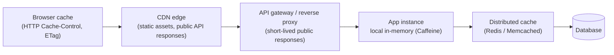
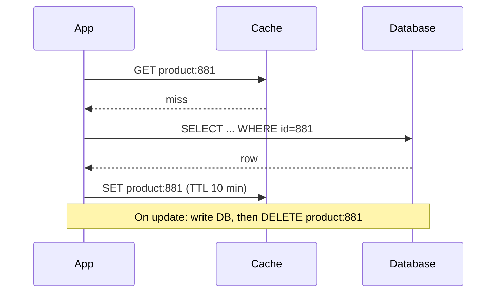
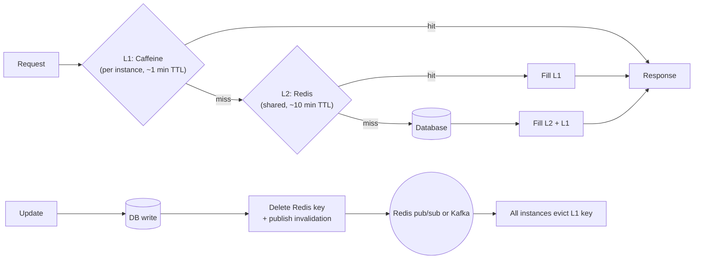

# Caching Strategy — Where to Cache, Which Pattern, and How to Stay Consistent

> **Architecture Decisions · Data Layer** — "Add Redis" is the most common performance fix and one of the most common sources of production bugs: stale prices, cache stampedes that take down the database, memory blowups, and data leaking between users. This page covers the decisions — layers, patterns, invalidation, and failure modes — with Spring and Redis code.

---

## Table of Contents

1. The Kitchen Counter Analogy
2. Should You Cache This? — The Decision Checklist
3. Cache Layers: Browser → CDN → Gateway → Local → Distributed
4. Redis vs Memcached vs Local Caches (Caffeine)
5. Caching Patterns: Cache-Aside, Read-Through, Write-Through, Write-Behind
6. Invalidation and Consistency — The Hard Part
7. TTLs, Eviction Policies, and Sizing
8. Failure Modes: Stampede, Penetration, Avalanche, Hot Keys
9. Two-Level Caching (Local + Redis)
10. Caching in Spring Boot
11. Observability and Operations
12. Practice Assignments (Low / Medium / High)
13. Mini Project — Product Catalog Cache with Consistency Tests
14. Interview Corner
15. Quick Reference

---

## 1. The Kitchen Counter Analogy

A chef keeps the most-used ingredients — salt, oil, chopped onions — **on the counter** instead of walking to the storeroom every time.

- The counter is small → you keep only what's used often (**eviction**).
- Chopped onions go bad → you throw them out after a few hours (**TTL**).
- If the storeroom manager replaces the olive oil brand, the bottle on your counter is now the **wrong one** until someone swaps it (**invalidation**).
- If the counter is wiped clean at the start of dinner rush, every cook runs to the storeroom at once and jams the door (**cache stampede**).

Caching is always a trade: **speed and reduced load, in exchange for possibly stale data and more moving parts.**

---

## 2. Should You Cache This? — The Decision Checklist

| Question | Cache-friendly answer |
|----------|-----------------------|
| Is it read much more often than written? | Yes (e.g., 100:1 reads to writes) |
| Is it expensive to compute or fetch? | Slow query, remote API, heavy computation |
| Can users tolerate slightly stale data? How stale? | Product descriptions: minutes; stock counts: seconds; account balance: **no** |
| Is the same data requested by many users (high hit ratio)? | Catalog, config, feature flags — yes; one-off reports — no |
| Is it user-specific or sensitive? | Needs per-user keys and careful isolation — or don't cache it |

<div class="callout-warn">

**Cache the fix, not the problem.** If a query takes 3 seconds because it's missing an index (see `sql-indexing`), a cache hides the problem until the cache is cold — during a deploy, after a Redis failover, or at peak — and then the database falls over. Fix the query first; then cache for scale.

</div>

---

## 3. Cache Layers: Browser → CDN → Gateway → Local → Distributed



| Layer | Latency | Best for | Watch out for |
|-------|---------|----------|---------------|
| Browser | 0 ms | Static assets (hashed file names, long max-age), some GETs | Can't purge; use versioned URLs |
| CDN | ~10-30 ms from user | Images, JS/CSS, public pages, public API responses | Never cache personalized responses without `Vary`/`private` |
| Local (in-process) | ~nanoseconds-µs | Hot, small, rarely changing data: config, feature flags, reference data | Each instance has its own copy → inconsistency between instances |
| Distributed (Redis) | ~0.5-2 ms | Shared data across instances: sessions, product details, rate limits | Network hop, a critical dependency, memory cost |

<div class="callout-tip">

**Applying this** — Use HTTP caching headers correctly: `Cache-Control: public, max-age=31536000, immutable` for fingerprinted static assets; `Cache-Control: private, no-store` for account pages and anything with personal data; `ETag` + `If-None-Match` so unchanged API responses return `304 Not Modified` cheaply. Many teams add Redis for things the browser and CDN could have served for free.

</div>

---

## 4. Redis vs Memcached vs Local Caches (Caffeine)

| | **Redis** | **Memcached** | **Caffeine** (local, JVM) |
|--|-----------|---------------|---------------------------|
| Data types | Strings, hashes, lists, sets, sorted sets, streams, bitmaps, HyperLogLog | Strings only | Java objects |
| Persistence | Optional (RDB snapshots, AOF) | None | None |
| Replication / HA | Replicas, Sentinel, Cluster | Client-side sharding, no replication | Per JVM |
| Atomic ops / scripts | Yes (INCR, Lua, transactions) | Basic (incr/cas) | In-process |
| Threading | Single-threaded command execution (I/O threads available) | Multithreaded | In-process |
| Best for | Shared cache + data structures (leaderboards, rate limiting, sessions, locks) | Simple, large, multi-threaded key-value caching | Ultra-fast per-instance caching |
| Managed | ElastiCache/MemoryDB, Azure Cache, Memorystore, Redis Cloud | ElastiCache for Memcached | — |

<div class="callout-info">

**Licensing note**: Redis changed its license in 2024, which led the Linux Foundation to launch **Valkey**, a fork of the last BSD-licensed version (supported by AWS ElastiCache and others). Redis later added AGPL as a licensing option for Redis 8. For most application code the API is the same — check your provider's offering and your company's licensing policy.

</div>

---

## 5. Caching Patterns

### Cache-aside (lazy loading) — the default



```java
public ProductDto getProduct(long id) {
    String key = "product:v2:" + id;                          // version the key format
    ProductDto cached = redis.opsForValue().get(key);
    if (cached != null) return cached;
    ProductDto fresh = productRepo.findDto(id).orElseThrow(ProductNotFound::new);
    redis.opsForValue().set(key, fresh, jitter(Duration.ofMinutes(10)));
    return fresh;
}

@Transactional
public void updatePrice(long id, Money price) {
    productRepo.updatePrice(id, price);
    afterCommit(() -> redis.delete("product:v2:" + id));      // delete (not update) AFTER the DB commit
}
```

### The patterns compared

| Pattern | Read | Write | Pros | Cons |
|---------|------|-------|------|------|
| **Cache-aside** | App checks cache, loads DB on miss | App writes DB, **deletes** cache | Simple, resilient (cache down → still works), caches only what's read | First request after expiry is slow; race conditions (section 6) |
| **Read-through** | Cache library loads from DB on miss | — | Cleaner app code | Needs a loader abstraction (e.g., Caffeine `LoadingCache`) |
| **Write-through** | — | Write cache and DB synchronously | Cache always fresh for written keys | Write latency; caches data that may never be read |
| **Write-behind (write-back)** | — | Write cache; flush to DB asynchronously | Very fast writes, batching | **Data loss risk** if cache fails before flush; complex |
| **Write-around** | Cache-aside on reads | Write DB only | Avoids caching write-once data | Recent writes miss the cache |
| **Refresh-ahead** | Refresh popular keys before expiry | — | No slow misses for hot keys | Wasted refreshes for cold keys |

<div class="callout-interview">

**Q: "Which caching pattern would you use for product details?"**

Cache-aside with a TTL: read from Redis, and on a miss load from the database and populate with a jittered TTL. On updates, write the database and then delete the cache key after the commit, rather than updating it, which avoids racing writers leaving stale values. I'd add stampede protection for hot products, cache "not found" results briefly to stop penetration, and keep the TTL as a safety net against missed invalidations. Write-behind I'd avoid for business data because of its data-loss risk.

</div>

---

## 6. Invalidation and Consistency — The Hard Part

> "There are only two hard things in Computer Science: cache invalidation and naming things." — Phil Karlton

### Why "delete after commit" and not "update the cache"

```text
Race with UPDATE-the-cache:
  T1: write DB price=100      T2: write DB price=120
  T2: SET cache 120           T1: SET cache 100      → cache says 100, DB says 120 (stale until TTL)

With DELETE-the-cache:
  both writers delete → the next reader loads the latest DB value
```

### The remaining race (and how to reduce it)

```text
Reader: cache miss → reads DB (old value, price=100)
Writer: updates DB to 120 → deletes cache
Reader: SETs cache with the OLD value 100          → stale until TTL
```

| Mitigation | How |
|------------|-----|
| **TTL as a safety net** | Staleness is bounded by the TTL — always set one |
| Delayed double delete | Delete again after a short delay (e.g., 500 ms) — reduces, doesn't eliminate |
| Versioned values | Store `version`/`updated_at` with the value; `SET` only if newer (Lua script compare) |
| **CDC-driven invalidation** | Debezium reads the database log and publishes changes; an invalidator deletes keys — invalidations can't be forgotten by any code path |
| Lease / single-flight on miss | Only one loader per key; writers invalidate the lease (Memcached-style leases) |

| Data | Acceptable staleness | Strategy |
|------|----------------------|----------|
| Product description, images | Minutes | Cache-aside + TTL + delete on write |
| Price shown on a listing page | Seconds-minutes, but **re-verify at checkout** | Cache for display; the order service reads the authoritative price |
| Stock count on product page | Seconds; exact at purchase | Short TTL or "In stock / Few left" buckets; reserve against the DB |
| Account balance, payment status | None | Don't cache, or cache only with strict invalidation and read-your-writes |

<div class="callout-scenario">

**Scenario**: After a price drop campaign, customers see the old higher price on product pages for up to an hour, while checkout charges the new price — support is flooded. **Answer**: The pricing admin tool updated the database directly via a bulk SQL script, bypassing the application code that deletes cache keys; the 1-hour TTL was the only thing fixing it. **Decision**: Move invalidation to **CDC** (every DB change, from any source, triggers cache deletion), shorten TTLs for price data, and always compute the authoritative price at checkout from the source of truth.

</div>

---

## 7. TTLs, Eviction Policies, and Sizing

### TTLs

- Every key gets a TTL — even if you invalidate explicitly — as a safety net and to bound memory.
- **Add jitter** (e.g., ±10-20%) so keys created together don't expire together (avalanche).
- Shorter TTL = fresher, lower hit ratio; longer TTL = more stale, higher hit ratio. Choose per data type.

```java
static Duration jitter(Duration base) {
    long seconds = base.toSeconds();
    return Duration.ofSeconds(seconds + ThreadLocalRandom.current().nextLong(seconds / 5 + 1));
}
```

### Eviction policies (when memory is full)

| Policy | Evicts | Notes |
|--------|--------|-------|
| LRU | Least recently used | Common default; one-off scans can flush hot items |
| LFU | Least frequently used | Better for stable hot sets |
| **W-TinyLFU** (Caffeine) | Frequency-aware admission + LRU window | Excellent hit ratios, resists scans |
| Redis `maxmemory-policy` | `allkeys-lru`, `allkeys-lfu`, `volatile-*`, `noeviction` | For a pure cache use `allkeys-lru`/`allkeys-lfu`; `noeviction` makes writes fail when full |

### Sizing

Estimate: `number of hot keys × average value size × overhead factor (~1.5-2x)`. Keep values small (store DTOs, not entity graphs), use compact serialization (JSON is readable; Protobuf/Kryo smaller), and avoid **big keys** (a 50 MB list blocks Redis while it's read or deleted — use `UNLINK` for async deletes and split large structures).

---

## 8. Failure Modes: Stampede, Penetration, Avalanche, Hot Keys

| Problem | What happens | Fix |
|---------|--------------|-----|
| **Cache stampede** (thundering herd / dog-piling) | A hot key expires; 5,000 concurrent requests all miss and hit the DB | **Single-flight** per key (one loader, others wait — Caffeine's `get(key, loader)` does this per JVM; a Redis lock for cross-instance), serve stale while refreshing, probabilistic early refresh |
| **Cache penetration** | Requests for IDs that don't exist always miss and hit the DB (often an attack: `/products/99999999`) | Cache "not found" (null marker) with a short TTL; validate IDs; Bloom filter of valid IDs |
| **Cache avalanche** | Many keys expire at once, or Redis restarts empty → DB overwhelmed | TTL jitter, warm-up on deploy, rate-limit DB loaders, circuit breaker to the DB, multi-level cache |
| **Hot key** | One key (a viral product) gets 100K reads/s → one Redis shard saturates | Local cache in front (Caffeine, short TTL), key replication (`product:881:{1..8}` random suffix), read from replicas |
| **Redis down** | Every request becomes a DB request | Timeouts on cache calls (fail fast), circuit breaker, treat cache errors as misses **with load shedding** — the DB must not be sized assuming a 99% hit rate without a plan |

```java
// Single-flight in one JVM with Caffeine: concurrent misses for the same key share one load
LoadingCache<Long, ProductDto> products = Caffeine.newBuilder()
    .maximumSize(50_000)
    .expireAfterWrite(Duration.ofMinutes(2))
    .refreshAfterWrite(Duration.ofMinutes(1))     // serve the old value while one background refresh runs
    .recordStats()
    .build(id -> productRepo.findDto(id).orElse(ProductDto.NOT_FOUND));   // cache "not found" too
```

<div class="callout-warn">

**The hidden dependency**: if your database can serve only 2,000 QPS and your cache hit ratio is 98% on 50,000 QPS, a cold cache sends 50,000 QPS to a database built for 2,000. Plan for cold starts: warm the cache before shifting traffic, limit concurrent DB loads, and load-test with an empty cache.

</div>

---

## 9. Two-Level Caching (Local + Redis)



| Benefit | Cost |
|---------|------|
| Microsecond reads for hot data; protects Redis from hot keys | Instances can be briefly inconsistent with each other |
| Survives short Redis blips | Invalidation must reach every instance (pub/sub) — and pub/sub messages can be lost, so keep L1 TTLs short |

---

## 10. Caching in Spring Boot

```java
@Configuration
@EnableCaching
class CacheConfig {
    @Bean
    RedisCacheManagerBuilderCustomizer redisCaches() {
        return builder -> builder
            .withCacheConfiguration("products", RedisCacheConfiguration.defaultCacheConfig()
                .entryTtl(Duration.ofMinutes(10))
                .disableCachingNullValues()
                .serializeValuesWith(RedisSerializationContext.SerializationPair.fromSerializer(
                    new GenericJackson2JsonRedisSerializer())))
            .withCacheConfiguration("categories", RedisCacheConfiguration.defaultCacheConfig()
                .entryTtl(Duration.ofHours(6)));
    }
}

@Service
class ProductService {
    @Cacheable(cacheNames = "products", key = "#id", sync = true)   // sync = single-flight per JVM
    public ProductDto get(long id) { return repo.findDto(id).orElseThrow(ProductNotFound::new); }

    @CacheEvict(cacheNames = "products", key = "#id")               // evicts after the method returns
    @Transactional
    public void updatePrice(long id, Money price) { repo.updatePrice(id, price); }
}
```

| Gotcha | Explanation |
|--------|-------------|
| Self-invocation | `@Cacheable` works through a proxy — calling it from the same class bypasses the cache (same as `@Transactional`, see `spring-beans-di`) |
| Evict vs commit timing | `@CacheEvict` runs when the method returns — if the transaction commits after that, another request can re-cache the old value in between. With a transaction-aware cache manager (`transactionAware()`) or an after-commit hook, eviction happens after commit |
| Caching entities | Cache DTOs, not JPA entities (lazy proxies, sessions, huge graphs) |
| Keys | Include everything that changes the result: `id`, locale, currency, **tenant/user** for personalized data |
| Serialization changes | Changing a DTO's shape breaks deserialization of old entries → version cache names/keys (`products-v2`) on breaking changes |

<div class="callout-warn">

**Leaking one user's data to another** is the scariest caching bug: `@Cacheable("cart")` keyed only by `#storeId`, or a CDN caching a personalized API response without `Cache-Control: private`. Every personalized cache key must include the user/tenant ID, and personalized HTTP responses must never be publicly cacheable.

</div>

---

## 11. Observability and Operations

| Metric | Why |
|--------|-----|
| **Hit ratio** per cache/key pattern | The core effectiveness signal (Micrometer exposes Caffeine/Redis cache stats) |
| Latency of cache calls (p99) | Redis slowness shows up everywhere |
| Evictions, memory usage, fragmentation | Undersized cache or big keys |
| DB load vs cache misses | Detect stampedes and avalanches |
| Stale-data incidents / invalidation lag (CDC lag) | Consistency health |
| Redis slow log, big key scans | Operational hygiene |

---

## 12. 🏋️ Practice Assignments

### 🟢 Low — Build the reflexes

**L1.** For each, cache or not, and where: (a) product images, (b) a user's account balance, (c) the list of product categories, (d) a feature-flag configuration, (e) search results for a common query.

<details>
<summary>Show answer</summary>

(a) CDN with long max-age and versioned URLs. (b) Don't cache (or only with strict read-your-writes and invalidation) — correctness-critical. (c) Redis and/or local cache, hours TTL, invalidated on change. (d) Local in-memory cache refreshed periodically or via push (small, read on every request). (e) Redis with a short TTL (minutes), keyed by normalized query + filters + locale; consider CDN caching for anonymous users.

</details>

**L2.** Why delete the cache key on update instead of setting the new value?

<details>
<summary>Show answer</summary>

Concurrent writers can set values in a different order than they committed to the DB, leaving a stale value in the cache indefinitely (until TTL). Deleting makes the next reader load the current DB value. It's simpler and safer, though a small read-during-write race remains (bounded by TTL).

</details>

**L3.** What is cache penetration, and one way to stop it?

<details>
<summary>Show answer</summary>

Repeated requests for keys that don't exist (e.g., random IDs) always miss and hit the database — sometimes deliberately as an attack. Fixes: cache a "not found" marker with a short TTL, validate IDs, or use a Bloom filter of existing IDs to reject impossible keys before touching the DB.

</details>

### 🟡 Medium — Apply it

**M1.** A viral product page gets 80K requests/second, and the Redis shard holding its key is at 100% CPU. Fix it.

<details>
<summary>Show answer</summary>

It's a **hot key**. Add a local L1 cache (Caffeine) in each app instance with a short TTL (e.g., 5-30 s) so most reads never reach Redis; optionally replicate the key across shards with random suffixes (`product:881:#3`) and read a random copy; serve the page's static parts from the CDN; use Redis read replicas. For invalidation, delete all copies and broadcast L1 eviction; the short L1 TTL bounds staleness.

</details>

**M2.** Design caching for a product listing page that shows price and "In stock / Only 3 left / Out of stock".

<details>
<summary>Show answer</summary>

Product content (name, images, description): cache-aside, 10-30 min TTL + CDC invalidation. Price: cache-aside with a short TTL (1-5 min) + CDC invalidation; the checkout always reads the authoritative price. Stock: don't cache exact counts for long — cache a **bucketed** availability ("IN_STOCK", "LOW", "OUT") with a short TTL (10-30 s) updated by inventory events; the purchase path reserves stock against the source of truth. Different freshness per field → separate keys with different TTLs, assembled at read time.

</details>

**M3.** Your service's cache hit ratio dropped from 95% to 60% after a deploy, and DB CPU spiked. List likely causes.

<details>
<summary>Show answer</summary>

(1) Cache key format or DTO serialization changed → old entries unreadable or unused (a cold cache for the new version). (2) Cache name/TTL configuration changed (shorter TTL, caching disabled for a cache). (3) A key now includes a high-cardinality field (a timestamp, request ID, or full query string with tracking parameters). (4) Rolling deploy restarted all instances, flushing local caches at once. (5) Redis evicting due to memory pressure from new, larger values. Check metrics by key pattern, compare configs, and pre-warm caches on future deploys.

</details>

### 🔴 High — Think like a senior

**H1.** Design a caching layer for a multi-tenant SaaS API (3,000 tenants, per-tenant permissions) with strict data isolation.

<details>
<summary>Show answer</summary>

Every key is namespaced by tenant (`t:{tenantId}:product:{id}`), enforced by a shared cache helper rather than ad-hoc keys (code review + tests that assert tenant prefixes). Per-user permission-dependent results either include the user/role in the key or are cached pre-authorization (the service caches data, then applies authorization on every request). Invalidation per tenant (delete by tenant prefix via tracked key sets, or bump a per-tenant **version** number included in keys, which makes old keys unreachable). Noisy-tenant protection: per-tenant memory quotas or separate logical databases/clusters for the largest tenants. HTTP responses: `Cache-Control: private` for anything tenant-specific. Security tests attempting cross-tenant access via cached endpoints. Metrics per tenant for hit ratio and memory.

</details>

**H2.** The team proposes write-behind caching for shopping carts to handle Big Billion Day traffic. Evaluate it.

<details>
<summary>Show answer</summary>

Carts are a reasonable candidate for Redis as the **primary store** (not a cache in front of a DB): they're high-write, short-lived, and user-scoped. Options: (1) Redis with persistence (AOF every second) + replication and a clear acceptance of losing ≤ 1 s of cart updates on failover — often acceptable for carts; (2) write-behind to a durable DB via a stream (Redis Streams/Kafka) for analytics and recovery, with idempotent flushes; (3) a database designed for this write pattern (DynamoDB/Cassandra) with a cache. Risks to discuss: data loss windows, cart restore on Redis failure, consistency with checkout (checkout reads the cart and re-validates prices and stock against sources of truth), memory sizing at peak, and cleanup TTLs for abandoned carts. Write-behind is **not** appropriate for orders or payments.

</details>

---

## 13. 🛠️ Mini Project — Product Catalog Cache with Consistency Tests

**Goal**: Measure, break, and fix a cache. 2-3 evenings.

**Build**

1. Spring Boot + Postgres (100K products) + Redis (Docker). A `GET /products/{id}` endpoint.
2. **Baseline**: no cache — load test with k6/Gatling using a Zipf-like distribution (a few hot products); record p95 latency and DB QPS.
3. **Cache-aside** with jittered TTLs and delete-after-commit invalidation; re-measure.
4. **Stampede test**: make the DB query artificially slow (200 ms), expire a hot key under 2,000 concurrent requests — observe DB load; fix with single-flight (Caffeine `LoadingCache`/`@Cacheable(sync = true)` + a Redis lock) and compare.
5. **Penetration test**: request random non-existent IDs; add null caching or a Bloom filter; measure DB load.
6. **Consistency test**: concurrent price updates and reads; detect stale reads after updates; then add CDC-based invalidation with Debezium (or a DB trigger → queue) and measure how long stale values survive.
7. **Two-level cache**: Caffeine L1 + Redis L2 with pub/sub eviction; measure latency and Redis QPS.

**Acceptance criteria**

- A results table: approach × p95 latency × DB QPS × hit ratio × max observed staleness.
- Redis killed mid-test → the service degrades (slower, rate-limited) but doesn't crash.
- No personalized data in shared cache keys (write one test that would catch it).

---

## 🎯 Interview Corner

<div class="callout-interview">

**Q: "How do you keep a cache consistent with the database?"**

I accept that a cache is eventually consistent and bound the staleness to what the data can tolerate. The default is cache-aside: on a write, commit to the database and then delete the key, not update it, so concurrent writers can't leave an out-of-order value. Every key has a TTL as a safety net. For data where invalidation must never be missed — for example, when several services or scripts write the table — I drive invalidation from change data capture, like Debezium, so every committed change triggers a delete regardless of which code path made it. Correctness-critical reads like balances or prices at checkout always go to the source of truth.

**Follow-up trap**: "Is there still a race?" → Yes. A reader can load the old value just before a write and repopulate the cache after the delete. TTLs bound it, and versioned conditional sets or leases shrink it further.

</div>

<div class="callout-interview">

**Q: "What is a cache stampede and how do you prevent it?"**

When a heavily requested key expires, or the cache restarts cold, thousands of concurrent requests miss at once and all hit the database, which can take it down. Prevention: single-flight loading, so only one request per key recomputes the value while others wait or get the stale value — Caffeine does this per JVM, and a short Redis lock or lease does it across instances. Refresh-ahead or serve-stale-while-revalidate for hot keys. TTL jitter so keys don't expire together. Warming caches before shifting traffic. And load-shedding or circuit-breaking on the database path, so a cold cache degrades service instead of cascading into an outage.

</div>

<div class="callout-interview">

**Q: "Redis or a local in-memory cache?"**

Local caches like Caffeine are the fastest option with no network hop, ideal for small, hot, rarely changing data like configuration, reference data, or a very hot product. But each instance has its own copy, so they can diverge and they're lost on restart. Redis is shared across instances, gives one consistent view to invalidate, supports rich data structures, and survives app restarts, at the cost of a network hop and a critical dependency. For high-traffic systems I often combine them: a short-TTL local cache in front of Redis, with pub/sub invalidation. That absorbs hot keys and Redis blips while Redis stays the shared layer.

</div>

---

## Quick Reference

| Topic | Guidance |
|-------|----------|
| Cache when | Read-heavy, expensive, shareable, staleness tolerable |
| Layers | Browser/CDN (HTTP headers) → local (Caffeine) → Redis → DB |
| Default pattern | Cache-aside + TTL + delete-after-commit |
| Avoid | Write-behind for business-critical data; caching entities; keys without tenant/user |
| Consistency | TTL safety net, CDC invalidation, source of truth for critical reads |
| TTL | Always set; add jitter; per data type |
| Eviction | `allkeys-lru`/`lfu` for Redis caches; W-TinyLFU in Caffeine |
| Stampede | Single-flight, refresh-ahead, serve stale, jitter |
| Penetration | Null caching, Bloom filters, ID validation |
| Hot keys | L1 local cache, key replication, replicas |
| Spring | `@Cacheable(sync = true)`, evict after commit, DTOs, versioned cache names |
| Monitor | Hit ratio, cache latency, evictions, DB load on misses |

---

## Related Topics

- `cache-system` — designing a distributed cache itself
- `sql-indexing` — fix slow queries before caching them
- `cdn-deep-dive` — the edge cache layer
- `spring-beans-di` — why `@Cacheable` fails on self-invocation

> **A cache is a copy of the truth that's allowed to be a little wrong. Decide how wrong for each piece of data, make every copy expire, and make sure the system survives the day the cache is empty.**

---

<!-- journey-link:start -->

<div class="callout-journey">

🛒 **ShopNorth Journey** — ShopNorth uses cache-aside with event-driven eviction for product pages — and never charges a cached price.

**Continue the story:** [Chapter 2 · System Design (HLD)](/tutorials/journey-02-system-design) · **New here?** [Start the journey](/tutorials/journey-start)

</div>

<!-- journey-link:end -->
