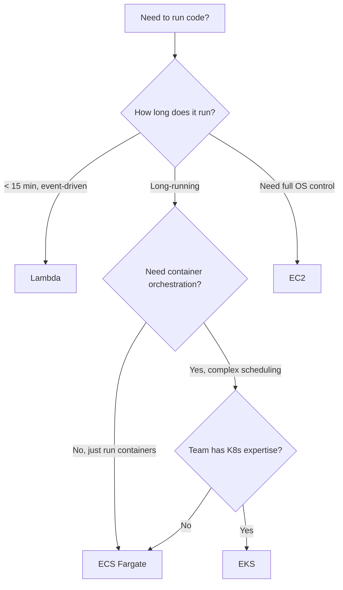
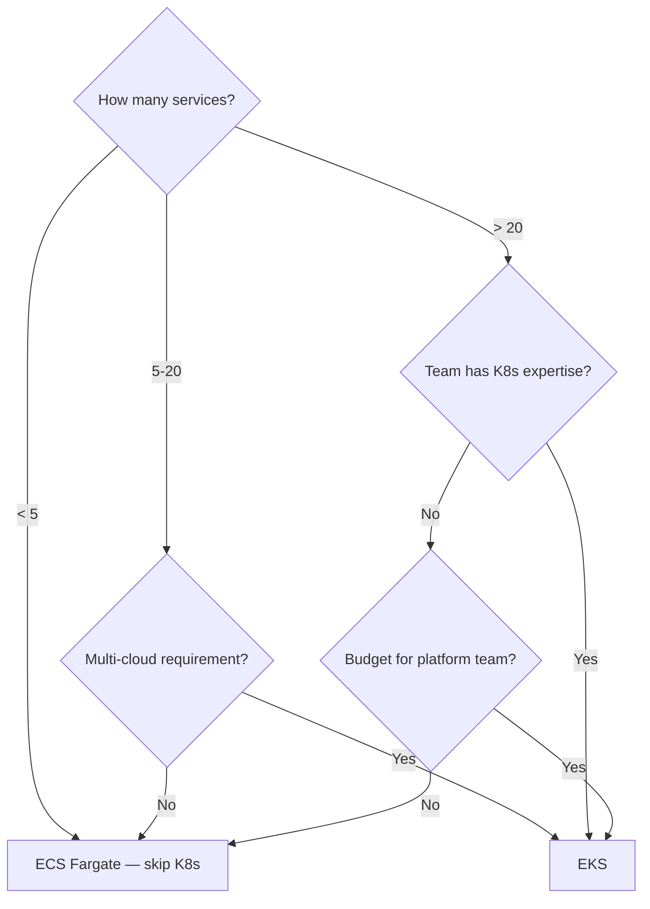
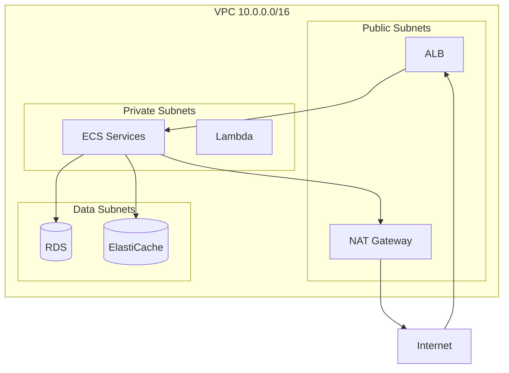

# Cloud & Infrastructure Decisions

## AWS Services — The Decision Tree

You don't need to know every AWS service. You need to know **when to pick which one** for compute, networking, storage, and orchestration.

---

## Compute — Where Does Your Code Run?



| Service | Best For | Avoid When |
|---------|----------|------------|
| **Lambda** | Event handlers, API endpoints < 15min, cron jobs, file processing triggers | Long-running processes, WebSockets, high-throughput steady load |
| **ECS Fargate** | Microservices, web apps, APIs — no server management | Need GPU, need OS-level access |
| **ECS on EC2** | Same as Fargate but need GPU, spot instances, or specific instance types | Small team, don't want to manage EC2 |
| **EKS** | Already using K8s, need portability across clouds, complex scheduling | Small team, single cloud, < 10 services |
| **EC2** | Legacy apps, need full OS control, specific hardware | Anything that can run in containers |

### Lambda vs ECS — The Common Dilemma

| Factor | Lambda | ECS Fargate |
|--------|--------|-------------|
| Cold start | 100ms-10s (depends on runtime) | None (always running) |
| Max duration | 15 minutes | Unlimited |
| Pricing | Per-invocation + duration | Per-vCPU-hour + memory-hour |
| Scaling | Instant (1000 concurrent default) | 2-5 min to scale out |
| Steady load cost | Expensive (paying per-request) | Cheaper (fixed capacity) |
| Spiky load cost | Cheap (pay only when invoked) | Expensive (over-provisioned) |

<div class="callout-scenario">

**Scenario**: API gets 10 requests/sec steady, spikes to 1000/sec during sales. **Lambda** — you pay almost nothing during quiet periods and scale instantly during spikes. If the same API gets 500 req/sec 24/7, **ECS Fargate** is 60-70% cheaper.

</div>

---

## Networking — ALB vs NLB

| Factor | ALB (Application) | NLB (Network) |
|--------|-------------------|----------------|
| Layer | Layer 7 (HTTP/HTTPS) | Layer 4 (TCP/UDP) |
| Routing | Path-based, host-based, header-based | Port-based only |
| WebSocket | ✅ | ✅ |
| SSL termination | ✅ At ALB | ✅ or passthrough to target |
| Static IP | ❌ (use Global Accelerator) | ✅ |
| Latency | ~1-2ms added | ~100μs added |
| Cost | Per-hour + LCU (request-based) | Per-hour + LCU (connection-based) |
| Best for | Web apps, REST APIs, microservices | gRPC, IoT, gaming, extreme low latency |

### Decision

```
HTTP/REST API → ALB
Need path-based routing (/api/v1/users → Service A) → ALB
gRPC or raw TCP → NLB
Need static IP (partner whitelisting) → NLB
WebSocket with HTTP fallback → ALB
Extreme low latency (< 1ms) → NLB
```

<div class="callout-tip">

**Applying this** — 90% of web applications need ALB. NLB is for specific use cases: gRPC services, IoT MQTT brokers, gaming servers, or when partners need to whitelist a static IP. If you're unsure, start with ALB.

</div>

---

## Database Services

| Need | Service | Why |
|------|---------|-----|
| Relational, ACID | RDS (PostgreSQL/MySQL) | Managed, backups, replicas, Multi-AZ |
| Relational, massive scale | Aurora | 5x throughput of MySQL, auto-scaling storage |
| Key-value, serverless | DynamoDB | Zero ops, auto-scaling, single-digit ms |
| In-memory cache | ElastiCache (Redis) | Sub-ms reads, pub/sub, data structures |
| Document store | DocumentDB | MongoDB-compatible, managed |
| Search | OpenSearch | Full-text search, log analytics |
| Time-series | Timestream | IoT metrics, auto-tiered storage |

### RDS vs Aurora — When to Upgrade

| Factor | RDS | Aurora |
|--------|-----|--------|
| Cost | $$ | $$$ (20-30% more) |
| Read replicas | Up to 5 | Up to 15 |
| Failover time | 60-120 seconds | < 30 seconds |
| Storage | Manual provisioning | Auto-scales to 128TB |
| Replication lag | Seconds | Milliseconds |

**Upgrade to Aurora when**: You need > 5 read replicas, faster failover, or auto-scaling storage. For most apps, RDS is sufficient and cheaper.

---

## Secrets & Configuration

| What | Service | Why NOT alternatives |
|------|---------|---------------------|
| API keys, DB passwords | Secrets Manager | Auto-rotation, audit trail, cross-account |
| Feature flags, config | Parameter Store (SSM) | Free tier, hierarchical, versioned |
| Encryption keys | KMS | Hardware-backed, audit, key rotation |
| Certificates | ACM | Free public certs, auto-renewal |

```java
// Secrets Manager — retrieve DB password at runtime
SecretsManagerClient client = SecretsManagerClient.create();
String secret = client.getSecretValue(b -> b.secretId("prod/db/password"))
    .secretString();

// NEVER do this:
// String password = "hardcoded-password-123"; ❌
// String password = System.getenv("DB_PASSWORD"); // ⚠️ OK for dev, not prod
```

<div class="callout-tip">

**Applying this** — Use Secrets Manager for anything that rotates (passwords, API keys). Use Parameter Store for config that changes occasionally (feature flags, endpoint URLs). Use environment variables only in development. In production, always fetch secrets at runtime from Secrets Manager.

</div>

---

## Docker & Kubernetes — Decision Framework

### Do You Need Kubernetes?



### K8s vs ECS — Honest Comparison

| Factor | ECS Fargate | EKS |
|--------|-------------|-----|
| Learning curve | Low | High (steep) |
| Ops overhead | Minimal | Significant |
| Ecosystem | AWS-native | Massive (Helm, Istio, ArgoCD, etc.) |
| Portability | AWS only | Any cloud, on-prem |
| Cost | Service cost only | $73/mo per cluster + node costs |
| Service mesh | App Mesh (limited) | Istio, Linkerd (mature) |
| Best for | AWS-only shops, small teams | Multi-cloud, large teams, complex needs |

<div class="callout-interview">

**Q: "How would you design the infrastructure for a microservices platform on AWS?"**

ECS Fargate for compute (unless multi-cloud needed, then EKS). ALB for HTTP routing with path-based rules. RDS PostgreSQL for relational data, DynamoDB for high-throughput key-value. ElastiCache Redis for caching and sessions. Secrets Manager for credentials. CloudWatch for monitoring. CodePipeline or GitHub Actions for CI/CD. All in a VPC with private subnets for services, public subnets only for ALB.

</div>

---

## VPC Design — Production Layout



| Subnet | Contains | Internet Access |
|--------|----------|----------------|
| Public | ALB, NAT Gateway, Bastion | Direct (IGW) |
| Private | ECS tasks, Lambda, App servers | Outbound only (via NAT) |
| Data | RDS, ElastiCache, OpenSearch | None (isolated) |

**Key rule**: Database subnets have NO internet access. Not inbound, not outbound. Services connect via VPC internal networking only.

---

<!-- practice-pack -->

## 🏢 More Real-World Scenarios

<div class="callout-scenario">

**Scenario**: A startup's monthly AWS bill jumps from $8K to $31K. The investigation finds NAT Gateway data-processing charges: services in private subnets pull Docker images and call S3 and DynamoDB through the NAT Gateway, paying per GB, plus cross-AZ traffic between chatty services. **Decision**: Add **VPC gateway endpoints** for S3 and DynamoDB (no data-processing charge), interface endpoints (PrivateLink) for ECR and other high-volume AWS APIs where the per-GB savings beat the hourly cost, cache images closer to workloads, and keep chatty service pairs in the same AZ where possible. Turn on cost allocation tags and a budget alert per team so the next spike is caught in days, not at month-end.

</div>

## 🏋️ Practice Assignments

### 🟢 Low — Build the reflexes

**L1.** Choose the compute option: (a) an image-resize function triggered by S3 uploads, a few thousand per day; (b) 15 Spring Boot microservices with steady traffic, small team, no Kubernetes experience; (c) 200 services, a platform team, and multi-cloud requirements; (d) a nightly 3-hour batch job.

<details>
<summary>Show answer</summary>

(a) AWS Lambda — event-driven, spiky, short. (b) ECS on Fargate — containers without cluster management. (c) Kubernetes (EKS) — the platform team can run it, and portability and ecosystem matter. (d) AWS Batch or an ECS/Fargate scheduled task (Lambda's 15-minute limit rules it out); Spot capacity to cut cost.

</details>

**L2.** Where should database passwords and API keys live, and how does the application get them?

<details>
<summary>Show answer</summary>

In a secrets manager (AWS Secrets Manager or SSM Parameter Store SecureString, HashiCorp Vault), encrypted with KMS, never in code, images, or plain environment files in the repo. The application gets them at runtime using its IAM role (no static credentials), e.g., via Spring Cloud AWS or the ECS/EKS secrets integration, with automatic rotation for database credentials.

</details>

**L3.** What goes in public subnets vs private subnets in a standard VPC layout?

<details>
<summary>Show answer</summary>

Public: load balancers and NAT gateways (resources that need a route to the internet gateway). Private: application servers/containers (outbound via NAT or VPC endpoints), and a separate private (isolated) tier for databases with no internet route at all. Spread each tier across at least two (preferably three) availability zones.

</details>

### 🟡 Medium — Apply it

**M1.** Design the AWS setup for a Spring Boot API + React frontend + PostgreSQL with 99.9% availability.

<details>
<summary>Show answer</summary>

React build in S3 behind CloudFront (with Origin Access Control). API in ECS Fargate across 2-3 AZs behind an ALB, autoscaling on CPU or request count, health checks on `/actuator/health/readiness`. RDS PostgreSQL Multi-AZ with automated backups and point-in-time recovery; read replica if needed. Secrets in Secrets Manager; logs and metrics in CloudWatch (or OpenTelemetry to a vendor); WAF on CloudFront/ALB. Everything in Terraform/CDK. 99.9% allows ~43 minutes of downtime per month — Multi-AZ and rolling deployments cover it without multi-region.

</details>

**M2.** Reduce compute cost by 40% for a fleet of 60 always-on EC2 instances without hurting reliability.

<details>
<summary>Show answer</summary>

Right-size (most instances run at low CPU — use Compute Optimizer data), move to newer/Graviton (ARM) instance types where the stack supports it (often ~20% better price-performance), buy Savings Plans for the steady baseline, use Spot for stateless, interruption-tolerant capacity behind autoscaling, scale down non-production at nights and weekends, and remove idle resources. Measure the result per service with cost allocation tags.

</details>

**M3.** When is multi-region worth it?

<details>
<summary>Show answer</summary>

When the business requires surviving a full regional outage (high availability targets like 99.99%+ with strict RTO), users are global and latency matters, or regulations require data residency in multiple regions. Costs: data replication and consistency complexity, duplicated infrastructure, cross-region data transfer, and much harder testing. For most products, multi-AZ in one region plus tested backups and a documented regional recovery plan (pilot light or warm standby) is the better trade-off.

</details>

### 🔴 High — Think like a senior

**H1.** Design the AWS account structure for a company with 8 teams, separate dev/staging/prod, and compliance requirements.

<details>
<summary>Show answer</summary>

AWS Organizations with Control Tower (or equivalent): a management account (billing only), a security/audit account (centralized CloudTrail, GuardDuty, Security Hub, log archive), a shared-services/network account (Transit Gateway, shared VPC endpoints, DNS), and workload accounts per environment — per team or per domain for larger orgs (e.g., `payments-prod`, `payments-staging`). Service Control Policies enforce guardrails (no disabling CloudTrail, allowed regions only, no public S3 buckets). SSO (IAM Identity Center) with role-based access; production access is time-bound and audited. Accounts are the strongest isolation boundary for blast radius and cost.

</details>

**H2.** Your team runs everything on EKS but spends 30% of its time on cluster upgrades and add-ons. Should you move to ECS?

<details>
<summary>Show answer</summary>

Assess what Kubernetes is actually giving you: multi-cloud portability you need? Operators/CRDs you depend on (Kafka, databases, service mesh)? Internal developer platform built on it? If not, ECS/Fargate removes most cluster operations and the migration for stateless services is mostly task definitions and pipelines. If yes, reduce operational load instead: managed node groups or Karpenter, Fargate profiles for some workloads, fewer add-ons, a standard platform module, and scheduled upgrades with automation. Decide with numbers (engineer-weeks spent per quarter vs migration cost) and an ADR.

</details>

## 🛠️ Mini Project — Production-Grade AWS Stack with Terraform

**Goal**: Infrastructure you'd be comfortable taking to production. 1-2 weeks of evenings (stay within free tier or a small budget, and destroy afterwards).

**Build**

1. Terraform: a VPC across 2 AZs (public, private, isolated subnets), an S3 gateway endpoint, an ALB, ECS Fargate service for a Spring Boot API, RDS PostgreSQL (single-AZ to save cost, with the Multi-AZ flag documented), Secrets Manager for DB credentials.
2. React frontend in S3 + CloudFront with Origin Access Control.
3. GitHub Actions: build the image, push to ECR, deploy to ECS with a rolling update and a smoke test.
4. Observability: CloudWatch dashboards and alarms (5xx rate, latency, CPU), plus an AWS Budget alert.
5. Run `terraform destroy` at the end and confirm nothing billable remains.

**Acceptance criteria**: one command (`terraform apply`) creates everything; no secrets in code or state outputs; a diagram plus a cost estimate in the README.

---

## 🎯 Interview Corner

<div class="callout-interview">

**Q: "ECS, EKS, or Lambda — how do you choose for a new set of services?"**

I decide by workload shape and team capacity. Lambda suits event-driven, spiky, short tasks where paying per invocation wins and cold starts are acceptable. ECS on Fargate suits containerized services for a team that wants to ship without running clusters: it's operationally the lightest option for steady services. EKS makes sense when we need Kubernetes specifically: a platform team, a portable or multi-cloud strategy, or ecosystem pieces like operators and service meshes. I'd also say what I would not do: pick Kubernetes for three services and a two-person team just because it's popular.

</div>

<div class="callout-interview">

**Q: "How do you manage secrets for applications running in AWS?"**

Secrets live in AWS Secrets Manager or SSM Parameter Store, encrypted with KMS. Applications read them at runtime using their IAM role, so there are no long-lived access keys anywhere. In ECS or EKS, the platform injects them into the task or pod, or the app fetches them through Spring Cloud AWS. Database credentials rotate automatically. Nothing secret goes into Git, Docker images, Terraform outputs, or logs: there's secret scanning in CI, and IAM limits access to each secret to the services that need it. CloudTrail audits every read.

**Follow-up trap**: "Aren't environment variables fine?" → They're acceptable as the delivery mechanism if the source is a secrets manager, but they can leak through process dumps and debug endpoints. Never commit them to `.env` files in the repo.

</div>

<div class="callout-interview">

**Q: "Your AWS bill doubled this month. How do you investigate?"**

I start with Cost Explorer grouped by service, then by usage type and cost allocation tags, to find which line grew. The usual suspects are data transfer (NAT Gateway processing, cross-AZ or cross-region traffic), forgotten resources (idle instances, unattached volumes, old snapshots), log volume in CloudWatch, autoscaling that never scaled down, and a new feature with an expensive access pattern. Once found: fix the cause (VPC endpoints, log retention, right-sizing), then prevent recurrence with budgets and anomaly-detection alerts per team, plus tagging policies so every cost has an owner.

</div>

---

<!-- journey-link:start -->

<div class="callout-journey">

🛒 **ShopNorth Journey** — ShopNorth runs on EKS with managed RDS, ElastiCache, MSK, and Secrets Manager — six people shouldn't run database failover themselves.

**Continue the story:** [Chapter 12 · Deploying on Kubernetes](/tutorials/journey-12-kubernetes) · **New here?** [Start the journey](/tutorials/journey-start)

</div>

<!-- journey-link:end -->
