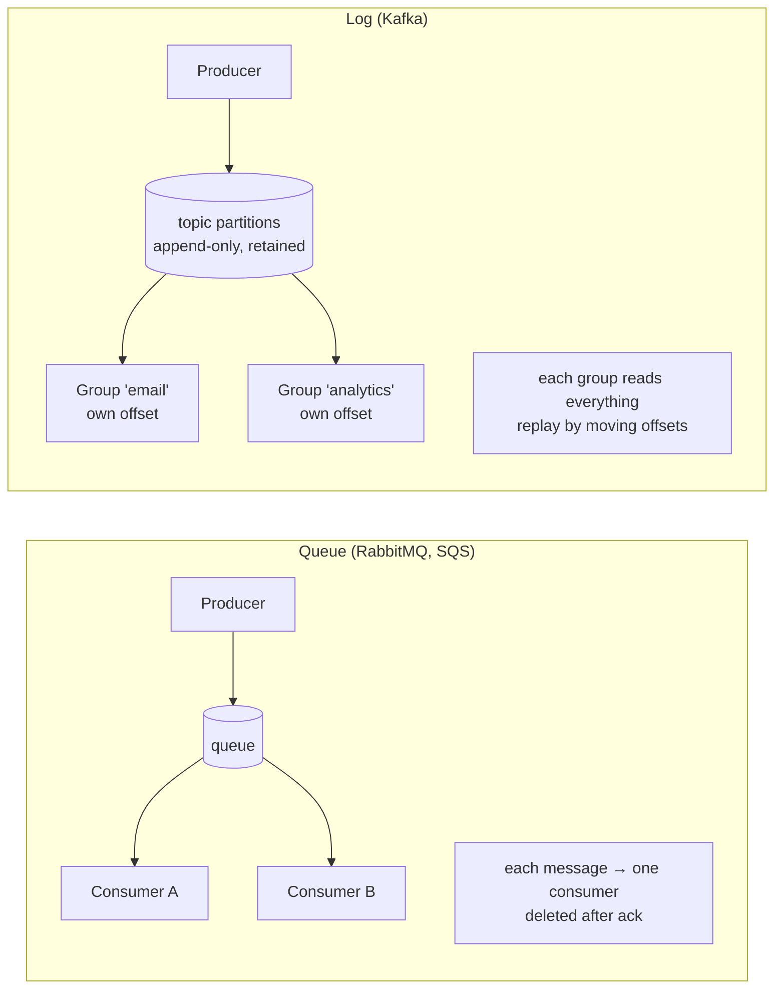
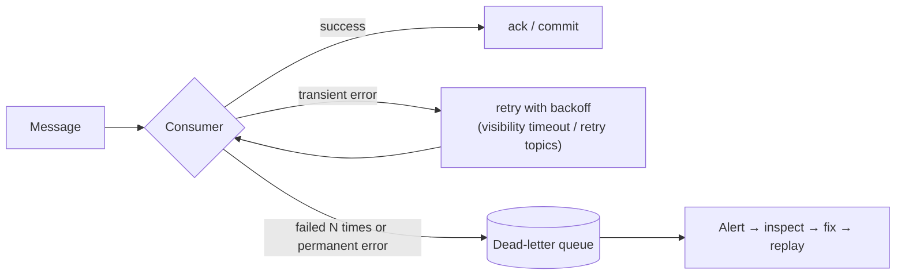
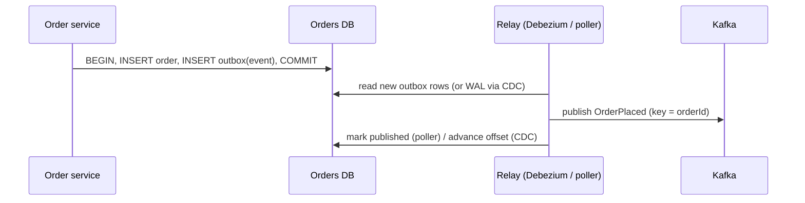
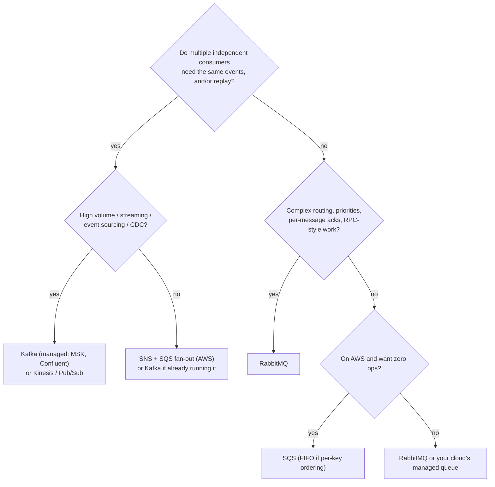

# Messaging & Event Systems — Kafka vs RabbitMQ vs SQS vs SNS, Decided with Real Scenarios

> **Architecture Decisions · Communication** — "Should we use Kafka?" is one of the most common architecture questions — and "Kafka for everything" is one of the most common mistakes. This page gives you the mental models, the guarantees each system actually provides, and a decision process grounded in real scenarios.

---

## Table of Contents

1. The Newspaper vs the Courier Analogy
2. Why Messaging at All
3. Two Fundamental Models: Queues vs Logs
4. The Contenders at a Glance
5. Delivery Guarantees — What "Exactly Once" Really Means
6. Ordering
7. Retries, Poison Messages, and Dead-Letter Queues
8. Reliable Publishing — The Outbox Pattern
9. Decision Framework with Scenarios
10. Operating Messaging in Production
11. Practice Assignments (Low / Medium / High)
12. Mini Project — Same Workflow on Kafka and SQS
13. Interview Corner
14. Quick Reference

---

## 1. The Newspaper vs the Courier Analogy

- A **courier** (a **queue**) takes one parcel to one recipient. Once delivered, the parcel is gone from the courier's van. If you have 5 couriers, each parcel still goes to exactly one of them — that's how you share work.
- A **newspaper** (a **log**) prints each day's edition once, and **anyone** can read it — today, or next week from the archive. A new subscriber can even read old editions. Readers keep their own bookmark of where they stopped.
- A **town crier** (a **pub/sub notification**) shouts news to everyone subscribed right now; if you weren't listening, you missed it — unless each listener has their own mailbox (a queue subscribed to the topic).

RabbitMQ and SQS are mostly **couriers**, Kafka is the **newspaper**, SNS is the **town crier** that drops copies into mailboxes.

---

## 2. Why Messaging at All

| Benefit | Example |
|---------|---------|
| **Decoupling in time** | Order service publishes "OrderPlaced" and returns; email, loyalty, and analytics process it later |
| **Load leveling** | A burst of 50K uploads is buffered; workers process at a steady rate |
| **Fan-out** | One event, many independent consumers |
| **Resilience** | A consumer being down doesn't fail the producer; messages wait |
| **Scaling work** | Add consumers to process faster |

| Cost | Example |
|------|---------|
| Eventual consistency | The email arrives seconds later; the UI may show stale data |
| Harder debugging | Flows span services and time; tracing is essential |
| Duplicates and ordering | Consumers must be idempotent; ordering needs design |
| Operations | Another critical system to run, monitor, and secure |

<div class="callout-tip">

**Applying this** — Use messaging when the caller **doesn't need the result right now**. "Validate the card and tell me if it's approved" is a synchronous call. "Send the receipt email" is a message. Mixing these up — making users wait on queues, or making critical requests fire-and-forget — causes most messaging pain.

</div>

---

## 3. Two Fundamental Models: Queues vs Logs



| | Queue | Log |
|--|-------|-----|
| After consumption | Message removed (acked) | Message **retained** (by time/size), independent of consumers |
| Multiple independent readers | Needs one queue per reader (e.g., SNS → multiple SQS) | Built in: consumer groups |
| Replay history | ❌ | ✅ Reset offsets, reprocess days of events |
| Per-message acknowledgment & retries | ✅ Natural | ⚠️ Offsets are per partition; per-message retry needs extra topics |
| Ordering | Queue-wide or none (SQS standard: best-effort) | **Per partition** |
| Typical use | Task distribution, work queues, commands | Event streaming, event sourcing, CDC, analytics pipelines |

---

## 4. The Contenders at a Glance

| | **Apache Kafka** (or MSK / Confluent) | **RabbitMQ** | **AWS SQS** | **AWS SNS** |
|--|--|--|--|--|
| Model | Distributed log | Broker with exchanges → queues (also streams) | Managed queue | Managed pub/sub push |
| Throughput | Very high (millions/s across a cluster) | High (tens of thousands/s per node; depends) | Nearly unlimited (standard); FIFO has per-group limits | High |
| Ordering | Per partition (by key) | Per queue (single consumer) | Standard: none; **FIFO**: per message group | FIFO topics available |
| Retention / replay | Days → forever | Until consumed (streams retain) | Up to 14 days, no replay after delete | None (push) |
| Routing | By topic/partition key | **Rich**: direct, topic, headers, fanout exchanges | None (one queue) | Filter policies per subscription |
| Delay / scheduling | Not built in | Plugins / TTL + DLX | **Delay queues, visibility timeout** | — |
| Ops effort | High self-managed; moderate managed | Moderate | **None** (serverless) | None |
| Sweet spot | Event backbone, streaming, CDC, many consumers, replay | Complex routing, RPC-style work queues, priorities | Simple, reliable work queues on AWS | Fan-out notifications to SQS/Lambda/HTTP/email |

Other names you'll hear: **Google Pub/Sub** (managed, log-like with acks), **Azure Service Bus** (queues/topics with sessions), **Amazon Kinesis** (managed streaming, Kafka-like), **Redis Streams** (lightweight log), **NATS / JetStream**, **Apache Pulsar** (log + queue semantics, tiered storage).

<div class="callout-info">

**The classic AWS combination — SNS + SQS fan-out**: publish once to an SNS topic; each consuming service owns an SQS queue subscribed to it (optionally with filter policies). Each service consumes at its own pace with its own retries and DLQ. It gives Kafka-like fan-out without running Kafka — but no replay of old events.

</div>

---

## 5. Delivery Guarantees — What "Exactly Once" Really Means

| Guarantee | Meaning | Risk |
|-----------|---------|------|
| At-most-once | Ack before processing | Lost messages on crash |
| **At-least-once** (the practical default) | Ack after processing | **Duplicates** on crash/retry |
| Exactly-once | Effect happens once | Only achievable within boundaries you control |

Kafka's **exactly-once semantics (EOS)** — idempotent producers plus transactions — gives exactly-once *within Kafka* (consume → process → produce with atomic offset commits, e.g., Kafka Streams). The moment your consumer writes to a database or calls an external API, you're back to at-least-once **unless your consumer is idempotent**.

### The idempotent consumer

```java
@KafkaListener(topics = "order-placed", groupId = "loyalty")
@Transactional
public void on(OrderPlaced event) {
    // processed_events has a unique constraint on (consumer, event_id)
    if (!processedEvents.tryInsert("loyalty", event.eventId())) {
        return;                                   // duplicate delivery → already applied
    }
    loyaltyAccounts.addPoints(event.customerId(), pointsFor(event.total()));
}   // the dedup insert and the business update commit together
```

<div class="callout-interview">

**Q: "Does Kafka give exactly-once delivery?"**

Kafka offers exactly-once semantics inside Kafka: idempotent producers and transactions that commit output records and consumer offsets atomically, which Kafka Streams uses. End to end with side effects like database writes or emails, you effectively have at-least-once delivery, so I make consumers idempotent: dedupe by event ID in the same transaction as the business change, or use naturally idempotent operations like upserts. Idempotency plus at-least-once is how real systems get "exactly-once effects".

</div>

---

## 6. Ordering

Most systems need **per-entity ordering**, not global ordering: all events for order 881 in order; events for different orders can interleave.

| System | How to get per-entity order |
|--------|-----------------------------|
| Kafka | Partition key = entity ID (`orderId`) → same partition → ordered; one consumer per partition in a group |
| SQS FIFO | `MessageGroupId = orderId`; ordering within the group (and dedup IDs for a 5-minute window) |
| RabbitMQ | Single queue with a single active consumer (or consistent-hash exchange to shard by key) |

<div class="callout-warn">

**Ordering and parallelism are in tension.** Retrying a failed message in place blocks everything behind it on that partition/group; moving it to a retry topic breaks order for that key. Decide per use case: for "order status" events, blocking the key (and alerting) may be right; for "send email", skip-and-retry-later is fine. Also, consumers should tolerate out-of-order arrival where possible (e.g., ignore an event whose version is older than the stored state).

</div>

---

## 7. Retries, Poison Messages, and Dead-Letter Queues

A **poison message** fails every time (bad data, a bug). Without a limit, it's retried forever and can block a partition.



| System | Mechanism |
|--------|-----------|
| SQS | `maxReceiveCount` in the redrive policy → DLQ; visibility timeout = retry delay; DLQ redrive to replay |
| RabbitMQ | Dead-letter exchange (DLX) on reject/expire; TTL-based delay queues for backoff |
| Kafka | Retry topics with increasing delays + a DLT (Spring Kafka's `@RetryableTopic` automates this) |

```java
@RetryableTopic(attempts = "4", backoff = @Backoff(delay = 2000, multiplier = 3),
                exclude = { InvalidOrderEventException.class })        // permanent errors go straight to DLT
@KafkaListener(topics = "order-placed", groupId = "invoicing")
public void handle(OrderPlaced event) { invoiceService.create(event); }

@DltHandler
public void dlt(OrderPlaced event, @Header(KafkaHeaders.EXCEPTION_MESSAGE) String error) {
    alerts.raise("Invoice creation failed permanently for " + event.orderId() + ": " + error);
}
```

<div class="callout-tip">

**Applying this** — A DLQ is useless if nobody looks at it. Alert on DLQ depth > 0 for critical flows, include the failure reason and original metadata with each message, and build a safe **replay** tool (with idempotent consumers, replay is low-risk).

</div>

---

## 8. Reliable Publishing — The Outbox Pattern

The dual-write problem: the service saves the order to its database and publishes "OrderPlaced" — but these are two separate systems.

```java
@Transactional
public void placeOrder(Order o) {
    orderRepo.save(o);
    kafka.send("order-placed", toEvent(o));   // ❌ DB commit may fail after send, or send may fail after commit
}
```

✅ **Transactional outbox**: write the event to an `outbox` table in the **same database transaction** as the order; a relay (a poller, or CDC with **Debezium** reading the database log) publishes it to the broker and marks it sent. The broker gets the event **if and only if** the order was committed (at-least-once — hence idempotent consumers).



See `distributed-transactions` for sagas built on top of this.

---

## 9. Decision Framework with Scenarios



| Scenario | Choice | Why |
|----------|--------|-----|
| Image thumbnail generation after upload (one worker per job) | **SQS** (or RabbitMQ) | Work queue, per-message retries, DLQ, zero ops on AWS |
| Order events consumed by 8 services + analytics, with replay for new services | **Kafka** | Log with consumer groups, retention, replay, high throughput |
| Payment status updates must be processed in order per payment | **Kafka** (key = paymentId) or **SQS FIFO** (group = paymentId) | Per-entity ordering |
| Notify email, SMS, and mobile teams whenever a user signs up (small scale) | **SNS → SQS** per team | Fan-out without running a cluster |
| Priority task routing (VIP tickets first), complex routing keys | **RabbitMQ** | Exchanges, priority queues |
| Stream DB changes to a search index and data lake | **Kafka + Debezium** | CDC is a log problem |
| Delayed jobs ("send reminder in 24 h") | **SQS delay / scheduler service** (EventBridge Scheduler), or DB-backed scheduler | Kafka has no native per-message delays |

<div class="callout-scenario">

**Scenario**: A 12-person startup running on AWS wants Kafka "because Netflix uses it" to send welcome emails and generate invoices. **Decision**: SQS (plus SNS for fan-out) — managed, cheap at low volume, with DLQs and retries built in, and no brokers or partitions to operate. Revisit Kafka when there are many consumers needing replay, streaming analytics, or CDC. The right tool is the one whose guarantees match the need at the lowest operational cost.

</div>

---

## 10. Operating Messaging in Production

| Area | Practice |
|------|----------|
| **Monitoring** | Consumer lag (Kafka) / queue depth and age of oldest message (SQS/RabbitMQ); DLQ depth; publish/consume error rates |
| **Schemas** | Versioned schemas (Avro/Protobuf/JSON Schema) in a schema registry; backward-compatible evolution (add optional fields; never repurpose) |
| **Event design** | Include event ID, type, version, occurred-at, entity ID, correlation/trace ID; prefer facts ("OrderPlaced") over commands in pub/sub |
| **Security** | TLS in transit, auth (SASL/IAM), ACLs per topic/queue, encryption at rest, no secrets/PII in payloads unless required |
| **Capacity** | Kafka partitions sized for peak consumer parallelism; SQS FIFO throughput limits per group; RabbitMQ memory/disk alarms |
| **Tracing** | Propagate trace context in message headers; one trace across producer → broker → consumers |

---

## 11. 🏋️ Practice Assignments

### 🟢 Low — Build the reflexes

**L1.** Queue or log for each: (a) resize uploaded images, (b) keep a search index in sync with product changes, (c) five services react to "UserRegistered", (d) retrain a model from last month's clickstream.

<details>
<summary>Show answer</summary>

(a) Queue (work distribution). (b) Log (CDC/event stream; replay to rebuild the index). (c) Log (Kafka consumer groups) or SNS→SQS fan-out. (d) Log with retention (replay historical events) — or a data lake fed from the log.

</details>

**L2.** A Kafka consumer processes a message, writes to the DB, then crashes before committing the offset. What happens and what must the consumer do?

<details>
<summary>Show answer</summary>

After restart (or rebalance), the message is delivered again because the offset wasn't committed → the DB write happens twice unless the consumer is **idempotent** (dedupe by event ID in the same DB transaction, or use upserts/conditional updates).

</details>

**L3.** How do you get per-order ordering with 12 consumers in Kafka?

<details>
<summary>Show answer</summary>

Use `orderId` as the message key so all events of an order go to the same partition; have at least 12 partitions so 12 consumers in the group each own partitions. Within a partition, events are consumed in order by one consumer.

</details>

### 🟡 Medium — Apply it

**M1.** Design retries for an "invoice creation" consumer where the tax service is sometimes down for minutes, and some events have invalid data.

<details>
<summary>Show answer</summary>

Classify errors: tax service down/timeouts = transient → retry topics with exponential backoff (e.g., 30 s, 2 min, 10 min, 1 h) so the main partition isn't blocked; invalid data = permanent → straight to the DLT with the validation error, plus an alert to the owning team. The consumer is idempotent (invoice keyed by order ID with a unique constraint). Monitor retry-topic lag and DLT depth; provide a replay tool once the data is fixed. If invoices must be created in order per customer, reconsider blocking vs out-of-order tolerance explicitly.

</details>

**M2.** Explain the dual-write problem with a concrete failure, and fix it.

<details>
<summary>Show answer</summary>

`save(order)` commits, then `kafka.send` fails (broker unreachable) → the order exists but no `OrderPlaced` event: no email, no inventory reservation. Or the send succeeds but the DB transaction rolls back → consumers act on a non-existent order. Fix: transactional outbox — insert the event into an `outbox` table in the same transaction; a relay (Debezium CDC or a poller) publishes it and marks it sent; consumers are idempotent because the relay may publish twice.

</details>

**M3.** Your SQS standard queue sometimes delivers messages twice and out of order, breaking "account balance updated" processing. Options?

<details>
<summary>Show answer</summary>

(1) Make the consumer idempotent and order-tolerant: events carry a per-account version/sequence number; apply only if `version = current + 1` (or greater than current for last-write-wins), ignore duplicates. (2) Switch to **SQS FIFO** with `MessageGroupId = accountId` and deduplication IDs (ordering per account, dedup within 5 minutes), accepting lower throughput per group. (3) Kafka with key = accountId. Option 1 is valuable regardless, since no broker removes the need for idempotency.

</details>

### 🔴 High — Think like a senior

**H1.** Your company runs RabbitMQ for commands, Kafka for events, and SQS in some teams — ops is complaining. Propose a messaging strategy.

<details>
<summary>Show answer</summary>

Don't force one tool; standardize **by use case** and reduce variants: Kafka (managed) as the **event backbone** for domain events, CDC, and analytics; SQS (or RabbitMQ, pick one) for **task/work queues** and delayed jobs. Document the decision tree (section 9) as an ADR. Provide a platform library for producing/consuming with standard envelopes (event ID, type, version, trace context), outbox support, idempotent-consumer helpers, retry/DLQ conventions, and schema registry integration. Central observability (lag, DLQ depth, per-team dashboards), ACLs and naming conventions, and a migration plan for the least-justified deployments (e.g., a RabbitMQ used only as a simple queue → SQS). Measure ops load before and after.

</details>

**H2.** Design event-driven order processing for 20K orders/minute peak where inventory, payment, notification, loyalty, and analytics react to orders, and the business wants new consumers to be able to process the last 30 days of orders.

<details>
<summary>Show answer</summary>

Kafka (managed) with an `orders` topic keyed by `orderId`, partitions sized for peak consumer parallelism (e.g., 48-96), replication factor 3, `min.insync.replicas=2`, producers with `acks=all` and idempotence enabled, retention ≥ 30 days (or tiered storage) to allow new consumers to replay. The order service publishes via an outbox + Debezium. Events use a schema registry with backward-compatible Avro/Protobuf. Each downstream service has its own consumer group, idempotent processing, retry topics, and a DLT; critical consumers (inventory, payment) are monitored for lag in seconds, analytics can lag. The saga for payment/inventory uses events plus compensations (see `distributed-transactions`). Tracing via headers; alerts on lag, DLT, and producer errors. Capacity-test at 2x peak.

</details>

---

## 12. 🛠️ Mini Project — Same Workflow on Kafka and SQS

**Goal**: Feel the differences by building the same flow twice. 2-3 evenings.

**Workflow**: `order-service` places orders; `email-service` and `loyalty-service` react.

**Build**

1. **Kafka version** (Docker: Kafka in KRaft mode): the order service writes orders + outbox rows in one transaction; a poller publishes to `order-placed` keyed by `orderId`; two consumer groups; idempotent consumers with a `processed_events` table; `@RetryableTopic` with a DLT; inject failures (a flag makes loyalty fail 30% of the time; a malformed event goes to the DLT).
2. **SQS version** (LocalStack): SNS topic → two SQS queues with redrive policies/DLQs; the same outbox relay publishes to SNS; consumers with visibility-timeout-based retries and idempotency.
3. Experiments: (a) kill a consumer for 5 minutes during load, then restart — measure catch-up; (b) add a third consumer after 10K orders — Kafka can replay history, SQS cannot; (c) send duplicate events — verify no double loyalty points; (d) measure end-to-end latency.
4. Write a comparison table in the README from your measurements.

**Acceptance criteria**

- Zero lost orders (every order has an event) even when the broker is stopped during writes.
- Zero double-applied loyalty points under duplicates and restarts.
- A written recommendation of which you'd choose for this workflow, and why.

---

## 🎯 Interview Corner

<div class="callout-interview">

**Q: "Kafka or RabbitMQ — how do you choose?"**

Kafka is a distributed, replicated log. Events are retained by time or size, each consumer group tracks its own offsets, and consumers can replay, so it's ideal for an event backbone with many independent consumers, high throughput, CDC, and stream processing, with ordering per partition key. RabbitMQ is a broker with flexible routing through exchanges, per-message acknowledgments, priorities, and TTL and dead-lettering, which makes it strong for task queues, complex routing, and RPC-style work distribution — but consumed messages are gone and there's no replay. I choose by need: fan-out plus replay plus volume points to Kafka, and work distribution with rich routing points to RabbitMQ or a managed queue like SQS, weighing operational cost too.

</div>

<div class="callout-interview">

**Q: "How do you guarantee an event is published when data is saved?"**

The dual write — commit to the database and then publish — can fail between the two steps, losing or inventing events. I use the transactional outbox. The event is inserted into an outbox table in the same database transaction as the business change, and a relay, either Debezium reading the database log or a poller, publishes it to the broker and marks it done. So the event is published if and only if the transaction committed. The relay may publish more than once, so consumers are idempotent, deduplicating by event ID in the same transaction as their own changes.

**Follow-up trap**: "Why not use Kafka transactions for this?" → Kafka transactions cover Kafka-to-Kafka atomicity, but they can't make a database commit and a Kafka write atomic. The outbox makes the database the single source of truth.

</div>

<div class="callout-interview">

**Q: "How do you handle a message that keeps failing?"**

First I classify the failure. Transient errors, like a downstream timeout, get limited retries with exponential backoff, via retry topics in Kafka, visibility timeouts in SQS, or TTL queues in RabbitMQ, so the main flow isn't blocked. Permanent errors, like invalid data or a bug, go straight to a dead-letter queue with the error reason and metadata, and alert the owning team. Consumers are idempotent, so once the cause is fixed, replaying from the DLQ is safe. If strict per-key ordering matters, I decide explicitly whether to block that key or accept out-of-order processing, and monitor DLQ depth for critical flows.

</div>

---

## Quick Reference

| Concept | One-Liner |
|---------|-----------|
| Queue | One consumer per message, deleted on ack — work distribution |
| Log | Retained, many consumer groups, replay — event streaming |
| Kafka | Log; per-partition order; high throughput; replay; ops-heavy unless managed |
| RabbitMQ | Rich routing, acks, priorities, DLX; no replay (except streams) |
| SQS | Serverless queue; FIFO for per-group order; DLQ via redrive |
| SNS | Push pub/sub; SNS→SQS for durable fan-out |
| Guarantees | At-least-once + idempotent consumers = exactly-once effects |
| Ordering | Per entity via key/group; conflicts with retries and parallelism |
| Failures | Retry with backoff → DLQ → alert → fix → replay |
| Publishing | Transactional outbox (+ Debezium) to avoid dual writes |

---

## Related Topics

- `kafka-deep-dive` — Kafka internals and Java code
- `distributed-transactions` — sagas and the outbox in depth
- `notification-system` — priority lanes built on messaging
- `service-communication` — sync vs async between services

> **Pick a messaging system by the promise you need — who reads each message, whether they can read it again, and in what order — not by what's popular. Then assume every message can arrive twice.**

---

<!-- journey-link:start -->

<div class="callout-journey">

🛒 **ShopNorth Journey** — This is why ShopNorth chose Kafka for its order and payment events, keyed by order ID to keep each order's events in sequence.

**Continue the story:** [Chapter 6 · Microservices & Events](/tutorials/journey-06-microservices) · **New here?** [Start the journey](/tutorials/journey-start)

</div>

<!-- journey-link:end -->
