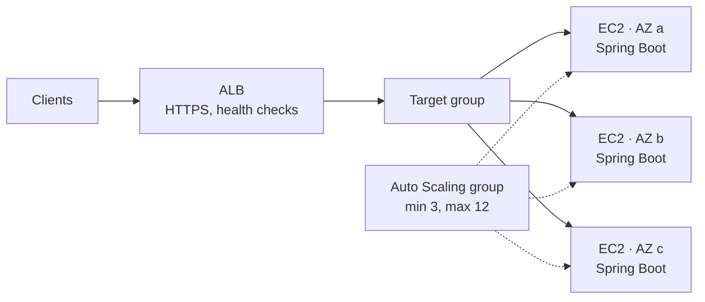

# EC2, Load Balancers & Auto Scaling — The Taxi Fleet Analogy

<!-- sdlc-stage:start -->
<div class="sdlc-stage">

📍 **SDLC stage: Deployment — infrastructure & runtime** · ShopNorth uses this in [Chapter 12 · Deploying on Kubernetes](/tutorials/journey-12-kubernetes)

</div>
<!-- sdlc-stage:end -->

## The Taxi Fleet Analogy

A taxi company at a busy railway station runs its fleet like this:

- It owns **cars of different types**: small hatchbacks, sedans, vans. Each trip gets a car that fits. Those are **EC2 instance types**.
- A **dispatcher** at the taxi stand sends each passenger to the next free car and stops sending people to a car with a flat tire. That's a **load balancer** with **health checks**.
- The company always keeps **at least 10 cars** on the road, and when the queue at the stand grows past 20 people, it calls in more cars. That's an **Auto Scaling group** with a **target-tracking** policy.
- On the evening of a big cricket match, it puts 40 extra cars on the road *before* the crowd leaves the stadium. That's **scheduled scaling**.
- A car that breaks down is towed away and replaced automatically. That's **health-check replacement**.
- Some drivers work on a cheap "standby" contract: very low cost, but they may be called away with 2 minutes' notice. That's **Spot**.

## 1. EC2 Essentials for Developers

**EC2** gives you virtual machines ("instances"). Even if your team runs containers or Lambda, EC2 is underneath much of it: EKS worker nodes, ECS on EC2, and the build runners in CI.

### Reading an instance type

`m7i.large` breaks down as: **m** (family: general purpose) · **7** (generation) · **i** (Intel processor) · **large** (size: 2 vCPUs, 8 GiB).

| Family | Optimized for | Typical use |
|--------|--------------|-------------|
| `t` (t3, t4g) | Burstable CPU, cheap | Dev tools, low-traffic services |
| `m` (m7i, m7g) | Balanced CPU and memory | Most application servers, Kubernetes nodes |
| `c` (c7i, c7g) | More CPU per GiB | CPU-heavy services, batch work |
| `r` (r7i, r7g) | More memory per vCPU | Caches, large JVM heaps, in-memory processing |
| `g`, `p` | GPUs | Machine learning, video |
| Letter `g` after the generation (m7**g**) | AWS Graviton (ARM) processors | Often better price-performance; needs ARM-compatible software |
| Letter `d` (m6g**d**) | Local NVMe disks | Fast temporary storage |

### The other building blocks

| Piece | What it is | Developer gotcha |
|-------|-----------|------------------|
| **AMI** | The disk image an instance boots from | Bake your app in (fast boot) or install at boot (flexible, slower) |
| **User data** | A script that runs at first boot | Keep it short and idempotent; log its output |
| **EBS** | Network block storage that survives reboots | `gp3` lets you set IOPS and throughput independently of size |
| **Instance store** | Local disks that vanish when the instance stops | Only for caches and scratch data |
| **Instance metadata (IMDSv2)** | An internal endpoint with the instance's role credentials | Require IMDSv2 (token-based) to block SSRF attacks from stealing credentials |
| **Session Manager** | Shell access through Systems Manager | No SSH keys, no open port 22, every session logged |

### Paying for EC2

| Model | Discount vs on-demand | Commitment | Good for |
|-------|----------------------|-----------|----------|
| **On-Demand** | — | None | Unpredictable or short-lived capacity, sale-day extra |
| **Savings Plans** | Up to ~70% | $ per hour for 1 or 3 years | The steady baseline you always run |
| **Spot** | Up to ~90% | None, but AWS can reclaim it with a **2-minute warning** | Stateless, interruption-tolerant work: CI runners, batch, staging |

ShopNorth covers its always-on node baseline with a **Compute Savings Plan**, adds on-demand nodes for sale peaks, and runs staging and CI runners on **Spot**. Its images are built for x86 today; building multi-architecture images (`linux/amd64` and `linux/arm64` with Docker Buildx) to unlock cheaper Graviton nodes is on the backlog.

## 2. Elastic Load Balancing

A load balancer spreads traffic across healthy targets in several availability zones. For the concepts (algorithms, layer 4 vs 7, sticky sessions), see [Load Balancing](/tutorials/load-balancing); here are the AWS specifics:

| | Application Load Balancer (ALB) | Network Load Balancer (NLB) |
|---|---|---|
| Layer | 7 (HTTP/HTTPS, gRPC, WebSockets) | 4 (TCP/UDP/TLS) |
| Routing | Host, path, headers, query strings | Port only |
| Static IPs | No (DNS name) | Yes, one per AZ (Elastic IPs possible) |
| Integrations | WAF, Cognito/OIDC authentication, Lambda targets | PrivateLink endpoint services |
| ShopNorth | `api.shopnorth.example` → the API gateway pods | Not used |

**Target groups** hold the targets (instances, IP addresses such as EKS pods, or Lambda functions) plus the settings that matter for zero-downtime deploys:

| Setting | Default | ShopNorth | Why |
|---------|---------|-----------|-----|
| Health check path | `/` | `/actuator/health/readiness` | Only send traffic to pods ready to serve |
| Healthy / unhealthy threshold | 5 / 2 | 2 / 3 | Recover quickly, but don't flap on a single slow check |
| **Deregistration delay** | 300 s | 30 s | Let in-flight requests finish when a pod leaves; 300 s makes every deploy slow |
| Slow start | off | 30 s | New JVM pods get a ramp of traffic while their JIT warms up |

With the AWS Load Balancer Controller (Chapter 12), these are Ingress annotations:

```yaml
metadata:
  annotations:
    alb.ingress.kubernetes.io/healthcheck-path: /actuator/health/readiness
    alb.ingress.kubernetes.io/target-group-attributes: deregistration_delay.timeout_seconds=30,slow_start.duration_seconds=30
```

## 3. Auto Scaling Groups

An **Auto Scaling group (ASG)** keeps a fleet of EC2 instances at the right size, spread across availability zones, and replaces unhealthy ones.

| Concept | Meaning |
|---------|---------|
| **Launch template** | What to launch: AMI, instance types, security groups, IAM role, user data |
| **Min / desired / max** | The floor, the current target, and the ceiling |
| **AZ balancing** | Keeps instances evenly spread across the configured subnets |
| **Health checks** | EC2 status checks, or **ELB** health checks (better: "is the app serving?") |
| **Health check grace period** | How long after launch to ignore failed checks — must exceed your app's startup time |
| **Instance warm-up** | How long before a new instance's metrics count toward scaling decisions |

### Scaling policies

| Policy | How it decides | Use it for |
|--------|---------------|-----------|
| **Target tracking** | Keep a metric near a target, like a thermostat | Most workloads: CPU at 50%, or requests per target |
| **Step scaling** | Add N instances when an alarm crosses thresholds | Fine control for bursty metrics |
| **Scheduled** | Change min/desired at set times | Known events — the 8 PM sale |
| **Predictive** | Forecasts from daily and weekly patterns | Recurring daily traffic shapes |

Target tracking on request count is often better than CPU for web APIs — an I/O-bound service may be overloaded at 30% CPU:

```hcl
resource "aws_autoscaling_policy" "requests_per_target" {
  name                   = "keep-500-requests-per-target"
  autoscaling_group_name = aws_autoscaling_group.api.name
  policy_type            = "TargetTrackingScaling"

  target_tracking_configuration {
    predefined_metric_specification {
      predefined_metric_type = "ALBRequestCountPerTarget"
      resource_label         = "${aws_lb.api.arn_suffix}/${aws_lb_target_group.api.arn_suffix}"
    }
    target_value = 500   # requests per minute per instance, found by load testing
  }
}

resource "aws_autoscaling_schedule" "diwali_prescale" {
  scheduled_action_name  = "diwali-prescale"
  autoscaling_group_name = aws_autoscaling_group.api.name
  min_size               = 12
  max_size               = 30
  desired_capacity       = 12
  start_time             = "2026-11-07T12:30:00Z"   # 12:30 UTC = 6:00 PM IST on sale day, two hours early
}
```

### Other features worth knowing

| Feature | What it gives you |
|---------|------------------|
| **Warm pools** | Pre-initialized, stopped instances that start in seconds instead of minutes |
| **Lifecycle hooks** | Pause an instance at launch (warm up) or termination (drain connections, ship logs) |
| **Instance refresh** | Rolling replacement after a new AMI or launch template version, with a minimum healthy percentage |
| **Mixed instances policy** | Several instance types and a Spot/on-demand mix in one group |
| **Capacity rebalancing** | Replaces Spot instances proactively when AWS signals elevated interruption risk |

## 4. The Classic Pattern: Spring Boot on an ASG

Before (or instead of) Kubernetes, most companies run Java services like this — you'll meet it at work:



- The AMI is built by a pipeline (Packer) with the JDK and the app's JAR baked in, so instances boot ready to serve.
- The ALB health check calls the readiness endpoint; the ASG uses **ELB health checks** with a grace period longer than the JVM's startup.
- A deploy is an **instance refresh** to the new launch template version (or a blue/green swap of two ASGs behind the same ALB).
- Logs and metrics leave the instance (CloudWatch agent or Datadog agent), because instances are disposable.

## 5. How ShopNorth Uses EC2

ShopNorth runs on EKS, so EC2 shows up as Kubernetes nodes:

| Node group | Managed by | Instances | Runs |
|-----------|-----------|-----------|------|
| `system` | An **EKS managed node group** (an ASG underneath) | 3 × `m7i.large`, one per AZ | Cluster add-ons: CoreDNS, Karpenter, the AWS Load Balancer Controller, External Secrets, Argo CD, Datadog's cluster agent |
| `apps` | **Karpenter** (launches EC2 directly, not through an ASG) | Picks from `m7i`, `c7i`, and `r7i` sizes to fit pending pods | All ShopNorth services |

Karpenter watches for pods that can't be scheduled, launches the cheapest instance types that fit them in the right zones within seconds, and **consolidates** (replaces or removes underused nodes) when load drops. For the sale, the pre-scaling change raises Karpenter's minimum capacity along with every service's `minReplicas` (Chapter 14).

<div class="callout-warn">

**Check your EC2 quotas before the sale, not during it.** Each account has a limit on running on-demand vCPUs per instance family group (the "Running On-Demand Standard instances" quota covers families like M, C, and R). ShopNorth's load test needed 512 vCPUs; the quota was 384. Kabir requested an increase two weeks ahead through **Service Quotas** — and for the sale night itself, an **On-Demand Capacity Reservation** guaranteed the instances would be available in each zone.

</div>

## 🏢 Real-World Scenarios

<div class="callout-scenario">

**Scenario**: A team's ASG used ELB health checks with a 30-second grace period. Their Spring Boot app took 70 seconds to start. Every new instance failed health checks while booting, was terminated, and replaced by another one that met the same fate — the group never grew during a traffic spike. **Decision**: The grace period is set above the measured p99 startup time (120 s), the image starts faster (class data sharing, fewer startup tasks), and a warm pool keeps pre-initialized instances ready.

</div>

<div class="callout-scenario">

**Scenario**: Deployments took 25 minutes because each instance waited the default **300-second deregistration delay** before being replaced, one batch at a time. Someone set it to 0 to speed things up — and every deploy produced a burst of 502 errors as in-flight requests were cut off. **Decision**: Set the delay a bit above the longest normal request (30 s), and make the app shut down gracefully on `SIGTERM`. Fast deploys and zero dropped requests aren't in conflict.

</div>

## 🏋️ Practice Assignments

### 🟢 Low — Build the reflexes

**L1.** Decode these instance types and name a workload for each: `c7i.2xlarge`, `r7g.xlarge`, `t4g.small`.

<details>
<summary>Show answer</summary>

`c7i.2xlarge`: compute-optimized, 7th generation, Intel, 8 vCPUs — CPU-heavy services or batch jobs. `r7g.xlarge`: memory-optimized, 7th generation, Graviton (ARM), 4 vCPUs and 32 GiB — caches or services with large heaps (needs ARM-compatible images). `t4g.small`: burstable, Graviton, 2 vCPUs — a low-traffic internal tool or a dev environment.

</details>

**L2.** What are min, desired, and max in an Auto Scaling group, and what happens when an instance fails its ELB health check?

<details>
<summary>Show answer</summary>

**Min** is the floor the group never goes below, **max** is the ceiling, and **desired** is the current target that scaling policies change between them. When an instance fails the ELB health check (after the grace period), the ASG marks it unhealthy, terminates it, and launches a replacement to get back to the desired count, keeping the spread across availability zones.

</details>

### 🟡 Medium — Apply it

**M1.** ShopNorth's admin API runs on an ASG behind an ALB. CPU stays at 25% while latency doubles at peak. The scaling policy targets 60% CPU. What's wrong and what do you change?

<details>
<summary>Show answer</summary>

The service is I/O-bound (waiting on the database or other services), so CPU never reaches the target and the group never scales — and more instances might not help anyway if the bottleneck is downstream. First find the bottleneck (connection pool waits, slow queries). If the instances themselves are saturated (threads, connections per instance), switch to target tracking on **`ALBRequestCountPerTarget`**, using a target found by load testing (the request rate per instance where latency is still within the SLO), or on a latency-based custom metric. Cap max size using the database's connection budget.

</details>

**M2.** You need to roll out a new AMI with a security patch to 30 instances with no downtime. How?

<details>
<summary>Show answer</summary>

Update the launch template with the new AMI (new version) and start an **instance refresh** with a minimum healthy percentage (e.g., 90%) and instance warm-up equal to the app's startup time; the ASG replaces instances in batches, waiting for new ones to pass ELB health checks. Use a **checkpoint** (e.g., pause after 10%) to verify metrics before continuing, with automatic rollback on alarm if configured. Deregistration delay and graceful shutdown ensure in-flight requests finish. Alternatively, blue/green: a second ASG with the new AMI behind the same target group or a second target group, then shift traffic.

</details>

### 🔴 High — Think like a senior

**H1.** Design compute capacity for ShopNorth's sale night so that the 8 PM spike can't be blocked by EC2 itself. Cover quotas, capacity, and cost.

<details>
<summary>Show answer</summary>

**Quotas:** compute the vCPUs needed at the load-tested peak (plus headroom for a zone loss) and raise the on-demand vCPU quota weeks in advance; check other quotas (EBS volumes, ENIs per instance and IPs per subnet for pods, load balancer targets). **Capacity:** create On-Demand Capacity Reservations in each AZ for the sale window (billed whether used or not), and let Karpenter use a broad set of instance types so it isn't blocked by one type's shortage. **Pre-scale** at 6 PM (Karpenter minimums + `minReplicas`) and warm up. **Cost:** the Savings Plan covers the baseline; reservations and on-demand cover only the sale window; Spot is excluded from production that night. **Afterwards:** release the reservations and scale down via GitOps; review the bill.

</details>

**H2.** A colleague proposes running production on Spot to save 70%. When is that reasonable, and how would you make it safe for ShopNorth?

<details>
<summary>Show answer</summary>

Reasonable for stateless, interruption-tolerant capacity with enough diversity, never for the only copy of anything. Make it safe by: mixing Spot with an on-demand baseline that alone can carry critical paths (checkout); diversifying across many instance types and all AZs (Karpenter's capacity-optimized selection); handling the 2-minute interruption notice (Karpenter or the node termination handler cordons and drains the node; pods shut down gracefully); PodDisruptionBudgets so a wave of interruptions can't take a service below its minimum; and excluding Spot during the sale night. Good candidates: catalog and search replicas above the baseline, background workers, staging, CI. Measure interruption rates per instance type before relying on it.

</details>

## 🛠️ Mini Project — A Self-Healing Spring Boot Fleet

**Goal**: Run a Spring Boot API on an Auto Scaling group behind an ALB and watch it heal and scale. 1 weekend (destroy it afterwards).

**Build**

1. Write a launch template that installs Java 21 and runs your Spring Boot JAR from user data (or bake an AMI with Packer), with IMDSv2 required and an IAM role for Session Manager.
2. Create an ALB with HTTPS (or HTTP for the exercise) and a target group whose health check is `/actuator/health/readiness`; set the deregistration delay to 30 s.
3. Create an ASG across 2 AZs, min 2 / max 6, ELB health checks with a grace period longer than your measured startup time.
4. Add a target-tracking policy on `ALBRequestCountPerTarget`; run a k6 test and watch instances launch.
5. Terminate an instance by hand and time the replacement; run k6 during an **instance refresh** and confirm zero failed requests.
6. Add a scheduled action that raises the minimum at a set time.

**Acceptance criteria**: screenshots or logs of scale-out under load, self-healing after termination, and a zero-error instance refresh.

## 🎯 Interview Corner

<div class="callout-interview">

**Q: "How does an Auto Scaling group keep an application highly available?"**

It keeps a desired number of instances spread across several availability zones and replaces any that fail health checks. With ELB health checks, an instance that's running but whose app isn't serving gets replaced, as long as the grace period covers startup time. Behind an Application Load Balancer, only healthy targets receive traffic, and deregistration delay plus graceful shutdown let in-flight requests finish when instances leave. Scaling policies, such as target tracking on CPU or requests per target, scheduled actions for known events, and predictive scaling, adjust capacity, while min and max protect both availability and downstream limits.

</div>

<div class="callout-interview">

**Q: "ALB or NLB — how do you choose?"**

An ALB works at layer 7. It understands HTTP, so it can route by host, path, or header, terminate TLS, integrate with WAF and OIDC authentication, and target instances, IPs, or Lambda functions. It's the default for web APIs and microservices. An NLB works at layer 4 with very low latency and high connection rates, and gives static IPs per zone. I'd pick it for non-HTTP protocols, for partners who need fixed IPs to allowlist, or to expose a service through PrivateLink.

</div>

<div class="callout-interview">

**Q: "How would you reduce EC2 costs without hurting reliability?"**

First, right-size using real utilization data, because most instances are oversized. Then match pricing to the workload shape: Savings Plans for the steady baseline, Spot for interruption-tolerant capacity like CI, batch, and extra stateless replicas, with instance diversification and graceful draining, and on-demand only for peaks. Move to newer generations and Graviton where the software supports ARM, for better price-performance. Scale down non-production at night, and remove idle resources. I'd track each change by service with cost allocation tags, so savings are measured, not assumed.

</div>

<div class="callout-interview">

**Q: "What's the difference between scaling on CPU and scaling on request count?"**

CPU-based scaling works when the service is CPU-bound, because CPU tracks load. Many web services are I/O-bound, waiting on databases or other services, so they can be overloaded at 30% CPU and never trigger scaling. Request count per target scales directly on the work arriving. You choose the target from a load test: the request rate one instance handles within the latency SLO. For queue workers, the right metric is backlog per worker, such as queue depth or consumer lag. Whatever the metric, max capacity should respect downstream limits like database connections.

</div>

## Quick Reference

| Concept | Remember |
|---------|----------|
| `m7i.large` | family · generation · processor · size |
| Graviton (`g`) | Cheaper per performance; needs ARM images |
| IMDSv2 + hop limit | Protects instance credentials |
| Spot | Up to ~90% off, 2-minute reclaim warning |
| Savings Plans | Commit $/hour for the steady baseline |
| ALB vs NLB | HTTP routing vs TCP speed and static IPs |
| Deregistration delay | ~30 s + graceful shutdown, not 300 s or 0 |
| Grace period | Longer than app startup, or the ASG kills booting instances |
| Scaling policies | Target tracking, step, scheduled, predictive |
| Before a big event | Quotas, capacity reservations, pre-scaling |

> **Golden rule: let machines be disposable — health checks replace them, scaling sizes them, and nothing important ever lives only on one instance.**

<!-- journey-link:start -->

<div class="callout-journey">

🛒 **ShopNorth Journey** — ShopNorth's pods run on EC2 nodes: a managed node group (an Auto Scaling group) for cluster add-ons and Karpenter-launched nodes for the services, behind an ALB with readiness health checks. Before the sale, Kabir raised EC2 quotas and reserved capacity in all three zones.

**Continue the story:** [Chapter 12 · Deploying on Kubernetes](/tutorials/journey-12-kubernetes) · **New here?** [Start the journey](/tutorials/journey-start)

</div>

<!-- journey-link:end -->
