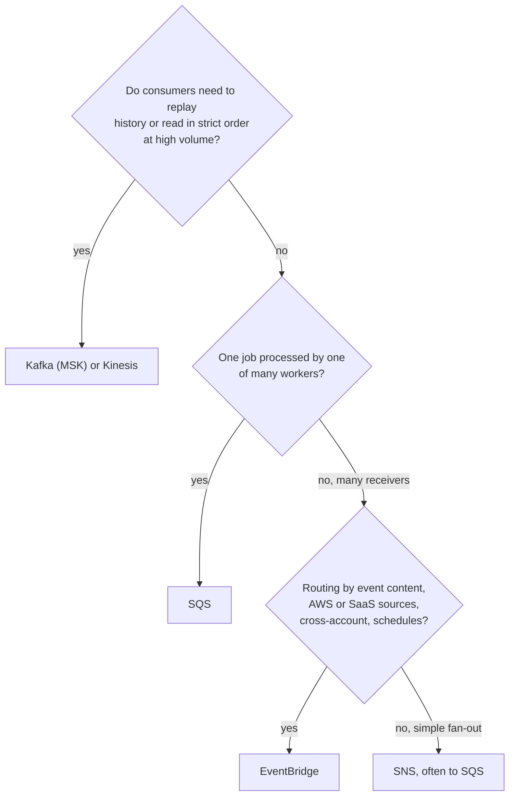

# Amazon EventBridge — Routing Events by Content: The Sorting Center Analogy

<!-- sdlc-stage:start -->
<div class="sdlc-stage">

📍 **SDLC stage: Development — services & events** · ShopNorth uses this in [Chapter 6 · Microservices & Events](/tutorials/journey-06-microservices)

</div>
<!-- sdlc-stage:end -->

## The Sorting Center Analogy

A national parcel company runs a huge **sorting center**:

- Parcels arrive from everywhere: its own trucks, partner airlines, other companies' warehouses. Each parcel has a **standard label** — sender, type, destination, contents. That's an **event** with a standard envelope.
- The center doesn't care who sent a parcel. **Sorting rules** read the label: "fragile parcels from Mumbai → the special-handling desk", "anything addressed to Pune → the Pune truck, *and* a copy of the label to the tracking team". That's a **rule** with an **event pattern** and **targets**.
- If the Pune truck is full, the parcel waits and is **retried** for hours; if it still can't go, it's put aside in a **holding bay**. That's **retries** and a **dead-letter queue**.
- Every parcel's label is **photographed and archived**, so if a desk lost a day's work, it can be replayed. That's **archive and replay**.
- A **timetable desk** sends trucks at fixed times, even when no parcel arrived. That's **EventBridge Scheduler**.

## 1. Core Concepts

| Concept | What it is |
|---------|-----------|
| **Event** | A JSON message with a standard envelope (`source`, `detail-type`, `time`, `account`, `region`, `resources`) and your data in `detail` |
| **Event bus** | Receives events. The **default bus** gets AWS service events; **custom buses** carry your own; **partner buses** receive SaaS events (Auth0, Datadog, and others) |
| **Rule** | An **event pattern** that matches events by content, plus up to 5 **targets** |
| **Target** | Lambda, SQS, SNS, Step Functions, another bus, Kinesis, an ECS task, an **API destination** (any HTTPS API), and more |
| **Archive and replay** | Keep events for a period and send them through the bus again later |
| **Schema registry** | Discovers event shapes and generates code bindings |
| **Pipes** | Point-to-point: a source (SQS, Kinesis, DynamoDB Streams, MSK…) → filter → enrich → target |
| **Scheduler** | One-time and recurring schedules, with time zones, retries, and DLQs |

This is what an S3 upload looks like as an event (abridged):

```json
{
  "version": "0",
  "id": "1f3e2a6c-5b7d-4c7e-9a2b-3c4d5e6f7a8b",
  "detail-type": "Object Created",
  "source": "aws.s3",
  "account": "123456789012",
  "time": "2026-10-22T09:14:03Z",
  "region": "ap-south-1",
  "resources": ["arn:aws:s3:::shopnorth-product-images-prod"],
  "detail": {
    "bucket": { "name": "shopnorth-product-images-prod" },
    "object": { "key": "originals/SKU-48213/front.jpg", "size": 482113 }
  }
}
```

## 2. Event Patterns: Matching by Content

A rule's pattern is JSON that mirrors the event. ShopNorth's image-resizer rule matches only new objects under `originals/`:

```json
{
  "source": ["aws.s3"],
  "detail-type": ["Object Created"],
  "detail": {
    "bucket": { "name": ["shopnorth-product-images-prod"] },
    "object": { "key": [{ "prefix": "originals/" }] }
  }
}
```

| Operator | Example | Matches |
|----------|---------|---------|
| Exact values (OR) | `"status": ["PAID", "SHIPPED"]` | Either value |
| `prefix` / `suffix` | `"key": [{ "suffix": ".jpg" }]` | Strings that start/end with it |
| `anything-but` | `"env": [{ "anything-but": "staging" }]` | Everything except the value |
| `numeric` | `"total": [{ "numeric": [">=", 100000] }]` | Numbers in a range |
| `exists` | `"couponCode": [{ "exists": true }]` | Field present |
| `wildcard` | `"key": [{ "wildcard": "originals/*/front.jpg" }]` | Glob-style strings |

Test a pattern before deploying it — a typo means the rule silently matches nothing:

```bash
aws events test-event-pattern --event-pattern file://pattern.json --event file://sample-event.json
```

## 3. How ShopNorth Uses EventBridge

| Source | Bus | Rule matches | Target | Why EventBridge |
|--------|-----|--------------|--------|-----------------|
| S3 (product images bucket) | Default | `Object Created` under `originals/` | `image-resizer` Lambda | Filter by prefix without code; the bucket is managed by Terraform, the function by SAM |
| Amazon Inspector (ECR image scanning) | Default → central alerts bus | `CRITICAL` active findings | SNS `platform-alerts` → Slack | Security findings reach the team without polling |
| RDS | Default → central alerts bus | Events in the `failover` category for production instances | SNS `platform-alerts` | Know about failovers even if no one is watching dashboards |
| AWS Health | Default → central alerts bus | Issues and scheduled maintenance affecting ShopNorth's resources | SNS `platform-alerts` | AWS-side problems show up next to ShopNorth's own alerts |
| **Auth0** (partner event source) | Partner bus `aws.partner/auth0.com/…` | Failed-login bursts, breached-password detections | `security-alerts` Lambda; archive for 30 days | SaaS events arrive without building a webhook receiver |
| Scheduler | — | `cron(0 1 * * ? *)` in `Asia/Kolkata` | `sales-report` Lambda, retry policy + DLQ | Managed cron with retries; no always-on scheduler pod |

The Inspector rule's pattern:

```json
{
  "source": ["aws.inspector2"],
  "detail-type": ["Inspector2 Finding"],
  "detail": { "severity": ["CRITICAL"], "status": ["ACTIVE"] }
}
```

<div class="callout-tip">

**A central alerts bus.** Production and staging each forward platform events (Inspector, RDS, Health) to one custom bus in the `shared` account — a cross-account rule plus a resource policy on the central bus that allows only ShopNorth's accounts. Alert routing lives in one place, and adding an account is a rule, not a new integration.

</div>

## 4. Delivery: Retries, DLQs, and Ordering

| Behavior | Detail | What it means for you |
|----------|--------|----------------------|
| Delivery | At least once | Targets must be idempotent (use the event `id`) |
| Ordering | Not guaranteed | Don't rely on arrival order; use versions or timestamps in `detail` |
| Retries | By default for up to 24 hours and 185 attempts, with back-off | Transient target failures recover on their own |
| Dead-letter queue | An SQS queue per target | Events that exhausted retries are kept for inspection |
| Payload size | Up to 1 MB (since January 2026; older material says 256 KB) | Large data in S3, keys in the event |
| Latency | Typically well under a second, not single-digit milliseconds | Not for latency-critical request paths |

## 5. Choosing Between SQS, SNS, EventBridge, and Kafka



| | SQS | SNS | EventBridge | Kafka (MSK) |
|---|---|---|---|---|
| Model | Queue, pull | Topic, push | Bus with rules, push | Log, pull |
| Routing | None (one queue = one stream) | Filter policies per subscription | Rich content patterns, many target types | By topic and partition key |
| Ordering | FIFO queues only | FIFO topics only | None | Per partition |
| Replay | No (deleted when processed) | No | Archive and replay | Yes — retained log, reset offsets |
| Sources | Your code | Your code | Your code, 100+ AWS services, SaaS partners, schedules | Your code, connectors |
| Throughput | Very high | Very high | High | Very high, sustained |
| Cost model | Per request | Per request | Per event | Per broker-hour + storage |
| ShopNorth uses it for | Email/SMS jobs | Notification fan-out | AWS, SaaS, and S3 events; schedules | Order, payment, inventory events |

## 6. Designing Good Events

- **`detail-type` is a past-tense fact**: `OrderPaid`, not `PayOrder` — events describe what happened; commands ask for something to happen.
- **Include identifiers and the important fields, not whole databases**: consumers can fetch details if needed, and payloads stay small.
- **Version the schema** (`"schemaVersion": 2` in `detail`), and only add fields in a backward-compatible way.
- **Make consumers idempotent** with the envelope's `id` or a business key.
- **Document events** in the schema registry so teams can discover them and generate types.

## 7. Pipes and API Destinations in One Minute

- **EventBridge Pipes** connects one source to one target with optional filtering and enrichment — e.g., read an SQS queue, drop test messages, enrich each with a Lambda call, start a Step Functions workflow. It replaces small "glue" consumers you'd otherwise write and run.
- **API destinations** send events to any HTTPS endpoint (Slack webhooks, a partner's API) with managed authentication and a rate limit, so a burst of events can't overwhelm the receiver. ShopNorth uses one to post deployment events to its `#releases` Slack channel without a Lambda.

## 🏢 Real-World Scenarios

<div class="callout-scenario">

**Scenario**: A team added a rule to catch new invoices in S3 and process them with a Lambda that wrote a "processed" marker file — into the same bucket and prefix. The marker matched the rule too, triggering the function again, which wrote another marker. The loop ran for hours before the bill alert fired. **Decision**: Match the narrowest pattern (prefix *and* suffix), write outputs elsewhere, cap the function's concurrency, and alarm on unusual invocation counts for every event-driven function.

</div>

<div class="callout-scenario">

**Scenario**: After a deploy, a Lambda target started failing for every event because of a missing permission. EventBridge retried for 24 hours, then dropped the events — there was no DLQ — and a day of partner events was gone. **Decision**: Every target gets a DLQ with an alarm, the bus has an archive (30 days), and after the fix the team replays the archive for the affected window. Consumers dedupe on the event `id`, so replaying is safe.

</div>

## 🏋️ Practice Assignments

### 🟢 Low — Build the reflexes

**L1.** Write an event pattern that matches S3 `Object Created` events in the bucket `shopnorth-invoices-prod` for keys ending in `.pdf`.

<details>
<summary>Show answer</summary>

```json
{
  "source": ["aws.s3"],
  "detail-type": ["Object Created"],
  "detail": {
    "bucket": { "name": ["shopnorth-invoices-prod"] },
    "object": { "key": [{ "suffix": ".pdf" }] }
  }
}
```

The bucket must have EventBridge notifications enabled for S3 to send these events at all.

</details>

**L2.** Which would you use: (a) run a cleanup job every night at 2 AM IST, (b) process 10,000 resize jobs with retries by a pool of workers, (c) react to Auth0 security events, (d) let three services read every order event and replay last week's events after a bug fix?

<details>
<summary>Show answer</summary>

(a) **EventBridge Scheduler** (cron with a time zone, retries, DLQ). (b) **SQS** — a work queue with competing consumers. (c) **EventBridge** with the Auth0 partner event source. (d) **Kafka (MSK)** — consumer groups read independently, and offsets can be reset to replay.

</details>

### 🟡 Medium — Apply it

**M1.** ShopNorth wants a Slack alert whenever any production RDS instance fails over, plus a weekly report of all failovers. Design it with EventBridge.

<details>
<summary>Show answer</summary>

A rule on the default bus in the production account matching `source: aws.rds`, `detail-type: RDS DB Instance Event`, and `detail.EventCategories: ["failover"]` (optionally limited to production instance identifiers), forwarding to the central alerts bus in `shared`. There, a rule sends it to the SNS topic `platform-alerts` (which notifies Slack), with a DLQ. For the weekly report: enable an **archive** on the central bus filtered to RDS events, or add a second target — a small Lambda or Firehose — that writes each event to S3; a scheduled job summarizes the week. Test the pattern with `test-event-pattern` using a sample failover event, and trigger a real failover in staging during a game day.

</details>

**M2.** A rule targets a Lambda function, and the function was throttled for 30 minutes during an outage. What happened to the events, and what would you configure differently?

<details>
<summary>Show answer</summary>

EventBridge retried delivery with back-off; events delivered successfully once the throttling ended, within the default 24-hour/185-attempt retry window. Configure a **DLQ** on the target so events that exhaust retries aren't lost, a **maximum event age** that fits the business (a security alert 20 hours late may be pointless), an **archive** for replay, and **reserved concurrency** for the function so other functions can't starve it. Make the function idempotent, because retries can deliver the same event more than once.

</details>

### 🔴 High — Think like a senior

**H1.** Another team proposes moving ShopNorth's order events from Kafka to an EventBridge custom bus "because it's serverless". Evaluate.

<details>
<summary>Show answer</summary>

**EventBridge would give:** no brokers to size, content-based routing to many target types, cross-account delivery, SaaS integration, per-event pricing. **It would lose:** per-key ordering (EventBridge doesn't guarantee order; order state transitions rely on Kafka's per-partition ordering), long-term replay with independent consumer offsets (archives can replay, but every consumer gets the replay, and there are no per-consumer offsets), sustained high-throughput streaming at predictable cost, and Kafka-native tools (Debezium/outbox, Kafka Streams). **Recommendation:** keep Kafka as the backbone for domain events where ordering and replay matter. Use EventBridge at the edges: integrating AWS/SaaS events, scheduled work, cross-account routing, and fanning selected domain events out to many simple consumers (e.g., an `OrderShipped` copy for a partner). An EventBridge Pipe can bridge selected Kafka topics where useful.

</details>

**H2.** Design a reliable "abandoned cart reminder": email customers 2 hours after they add items, unless they've ordered. Use AWS services and explain failure handling.

<details>
<summary>Show answer</summary>

When a cart is first updated, the Cart service creates a **one-time schedule** in EventBridge Scheduler named after the cart (`cart-reminder-<cartId>`), firing in 2 hours with the cart ID as input, targeting an SQS queue (or a Lambda) — creating it again for the same name fails harmlessly, giving natural deduplication; updates can reschedule it. When an order is placed, the Order flow deletes the schedule (or the reminder handler checks first). The handler runs **idempotently**: it re-reads the cart and orders — if an order exists or the cart is empty, it does nothing; otherwise it publishes a notification to the SNS topic → email queue (marketing priority, separate from order confirmations). Scheduler has a retry policy and a DLQ; the email queue has its own DLQ. Respect consent: only customers who opted into marketing emails, with one reminder per cart. Metrics: schedules created, reminders sent, conversions.

</details>

## 🛠️ Mini Project — Event-Driven Glue Without Servers

**Goal**: Wire three AWS event flows with EventBridge and prove failure handling. 1 weekend (free-tier friendly).

**Build**

1. Enable EventBridge notifications on an S3 bucket; create a rule matching `Object Created` with a key prefix, targeting a Lambda that logs the key.
2. Create a custom bus with an archive (7 days) and a rule that sends `OrderPaid` events (that you `put-events` with the CLI) to an SQS queue.
3. Create an EventBridge Scheduler schedule (every 5 minutes, in your time zone) that sends a JSON payload to the same queue, with a retry policy and a DLQ.
4. Break the Lambda target (remove its permission) and upload a file; observe the retries, then add a DLQ to the target and see the event land there.
5. Replay the archive for the last hour into the bus and show your consumer handles duplicates by event `id`.
6. Use `aws events test-event-pattern` to test three patterns, including one with `anything-but` and `numeric`.

**Acceptance criteria**: three working flows, a DLQ that caught a failure, a successful replay with duplicates ignored, and tested patterns committed to a repo.

## 🎯 Interview Corner

<div class="callout-interview">

**Q: "What is Amazon EventBridge, and when would you use it instead of SNS?"**

EventBridge is a serverless event router. Events arrive on a bus from my applications, more than a hundred AWS services, or SaaS partners, and rules match them by content and deliver them to targets like Lambda, SQS, Step Functions, other buses, or any HTTPS API. I'd choose it over SNS when I need rich content-based routing, AWS or SaaS events as sources, cross-account delivery, archive and replay, schema discovery, or scheduling. SNS is simpler and very high throughput for plain fan-out, especially to SQS queues, and it supports FIFO ordering, which EventBridge doesn't.

</div>

<div class="callout-interview">

**Q: "How does EventBridge handle failures when delivering to a target?"**

Delivery is at least once. If a target fails or is throttled, EventBridge retries with exponential back-off, by default for up to 24 hours and 185 attempts, both configurable. Events that still fail go to a dead-letter queue, an SQS queue configured per target, and without one they're dropped. So I always configure DLQs with alarms, set a maximum event age that matches the business value of late events, enable an archive on important buses so I can replay a window after fixing a bug, and make every consumer idempotent using the event ID.

</div>

<div class="callout-interview">

**Q: "Your team needs a cron job in AWS. What are your options?"**

For a simple job, EventBridge Scheduler is my first choice. It supports cron and rate expressions with time zones, one-time schedules, flexible windows, retries, and a DLQ, and it can target Lambda, SQS, Step Functions, ECS tasks, and many AWS APIs directly. If the job is longer than 15 minutes, I'd schedule an ECS task or a Step Functions workflow instead of Lambda. Inside Kubernetes, a CronJob works, with concurrency rules and idempotency. Whatever the mechanism, I make the job idempotent and prevent overlapping runs, for example with reserved concurrency of one, and I alarm when an expected run doesn't succeed.

</div>

## Quick Reference

| Concept | Remember |
|---------|----------|
| Buses | Default (AWS events), custom (yours), partner (SaaS) |
| Rule | Content pattern + up to 5 targets |
| Patterns | Exact, prefix/suffix, anything-but, numeric, exists, wildcard |
| Delivery | At least once, no ordering, retries up to 24 h, DLQ per target |
| Payload | Up to 1 MB (since Jan 2026) |
| Archive | Replay a time window after a fix |
| Scheduler | Cron/rate/one-time, time zones, retries, DLQ |
| Pipes | Source → filter → enrich → target |
| API destinations | Call HTTPS APIs with auth and rate limits |
| Not for | Ordered, replayable high-volume streams (use Kafka) |

> **Golden rule: use EventBridge to connect things that shouldn't know about each other — and give every target a DLQ, because "retried for 24 hours" still ends.**

<!-- journey-link:start -->

<div class="callout-journey">

🛒 **ShopNorth Journey** — ShopNorth routes S3 uploads to the image resizer, Auth0 security events to an alerting Lambda, AWS findings and failovers to a central alerts bus, and runs its nightly report on EventBridge Scheduler — while Kafka stays the backbone for order events (Chapter 6).

**Continue the story:** [Chapter 6 · Microservices & Events](/tutorials/journey-06-microservices) · **New here?** [Start the journey](/tutorials/journey-start)

</div>

<!-- journey-link:end -->
