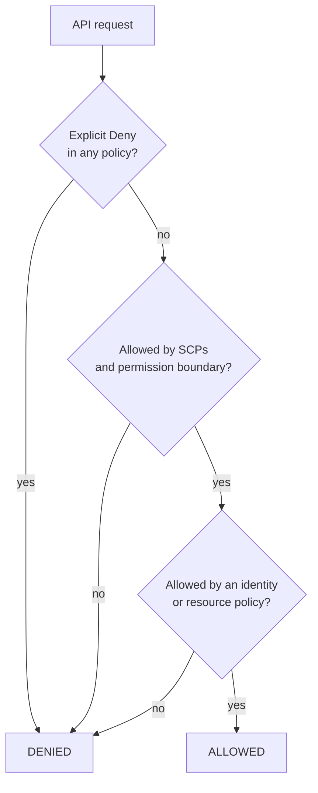

# AWS IAM, Secrets & Encryption — The Office Keycard Analogy

<!-- sdlc-stage:start -->
<div class="sdlc-stage">

📍 **SDLC stage: Development — security** · ShopNorth uses this in [Chapter 7 · Security & Login](/tutorials/journey-07-security)

</div>
<!-- sdlc-stage:end -->

## The Office Keycard Analogy

A large office building controls access like this:

- Every employee has a **badge** that proves who they are. That's an **identity**.
- Badges don't open doors by themselves. **Access rules** say "badges in the Finance group may open floor 4, weekdays, 8 AM to 8 PM". That's a **policy**.
- Visitors and contractors get a **temporary badge** for one job that expires at 6 PM. That's a **role** with **temporary credentials**.
- Headquarters sets rules no local manager can override: "nobody enters the server room without two people". That's a **service control policy**.
- Valuables go in a **safe**; the safe's key is itself kept in a key cabinet with its own rules. That's **KMS** and envelope encryption.
- Passwords for the vendor portals live in a **locked cabinet**, and they're changed every month. That's **Secrets Manager** with rotation.

IAM (Identity and Access Management) answers one question for every single AWS API call: **who is asking, and are they allowed to do this to that resource, right now?**

## 1. Who Can Act: Principals

| Principal | Credentials | Use it for | ShopNorth |
|-----------|------------|-----------|-----------|
| **Root user** | Email + password (+ MFA) | Almost nothing — a few account-level tasks | MFA on, no keys, locked away |
| **IAM user** | Password and/or long-lived access keys | Legacy; avoid | None |
| **IAM Identity Center user** | SSO sign-in, short-lived sessions | People | Every engineer |
| **IAM role** | Temporary credentials from STS when assumed | Workloads, CI pipelines, cross-account access | One role per service, per function, per pipeline |

The theme: **long-lived credentials are the enemy.** Roles give temporary credentials (minutes to hours) that rotate automatically.

## 2. Policies: The JSON That Decides

A policy is a list of statements: *Effect* (Allow/Deny), *Action* (API calls), *Resource* (ARNs), and optional *Condition*s. This is the Order service's policy in production:

```json
{
  "Version": "2012-10-17",
  "Statement": [
    {
      "Sid": "ReadOwnSecrets",
      "Effect": "Allow",
      "Action": "secretsmanager:GetSecretValue",
      "Resource": "arn:aws:secretsmanager:ap-south-1:123456789012:secret:production/order-service/*"
    },
    {
      "Sid": "ConnectToKafka",
      "Effect": "Allow",
      "Action": ["kafka-cluster:Connect", "kafka-cluster:DescribeCluster"],
      "Resource": "arn:aws:kafka:ap-south-1:123456789012:cluster/shopnorth-prod/*"
    },
    {
      "Sid": "OrderTopics",
      "Effect": "Allow",
      "Action": ["kafka-cluster:DescribeTopic", "kafka-cluster:WriteData", "kafka-cluster:ReadData"],
      "Resource": "arn:aws:kafka:ap-south-1:123456789012:topic/shopnorth-prod/*/orders.*"
    },
    {
      "Sid": "OwnConsumerGroups",
      "Effect": "Allow",
      "Action": ["kafka-cluster:DescribeGroup", "kafka-cluster:AlterGroup"],
      "Resource": "arn:aws:kafka:ap-south-1:123456789012:group/shopnorth-prod/*/order-service*"
    }
  ]
}
```

It can read **only its own secrets** and **only its own topics** — if the Order service is ever compromised, the attacker can't read the payment webhook secret or the catalog database password.

### Two kinds of policies

| | Identity-based | Resource-based |
|---|---|---|
| Attached to | A role, user, or group | The resource itself |
| Says | "This principal may do X to Y" | "These principals may do X to me" |
| Examples | The policy above | S3 bucket policies, SQS queue policies, KMS key policies, Lambda resource policies |
| Cross-account | Needs the other side's resource policy too | Can grant other accounts directly |

### How AWS evaluates a request



Three rules to remember: **everything is denied by default**, **an explicit Deny always wins**, and **guardrails (SCPs, permission boundaries) cap the maximum** — they never grant anything by themselves. For cross-account access, both the caller's identity policy *and* the resource's policy must allow it.

## 3. Roles in Practice: Trust + Permissions

Every role has two policies:

- The **trust policy**: *who may assume this role* (a service, an account, an identity provider).
- The **permissions policy**: *what the role may do* once assumed.

How each kind of AWS compute gets its role:

| Compute | Mechanism | Trusted principal |
|---------|-----------|-------------------|
| EC2 | Instance profile | `ec2.amazonaws.com` |
| Lambda | Execution role | `lambda.amazonaws.com` |
| ECS | **Task role** (for your code) and **execution role** (for pulling images and secrets) | `ecs-tasks.amazonaws.com` |
| EKS pods | **EKS Pod Identity** (newer, simpler) or **IRSA** (OIDC-based) | `pods.eks.amazonaws.com` for Pod Identity |

ShopNorth uses **EKS Pod Identity**. The Order service's role trusts the EKS Pod Identity service, and an *association* ties it to one Kubernetes service account:

```json
{
  "Version": "2012-10-17",
  "Statement": [{
    "Effect": "Allow",
    "Principal": { "Service": "pods.eks.amazonaws.com" },
    "Action": ["sts:AssumeRole", "sts:TagSession"]
  }]
}
```

```bash
aws eks create-pod-identity-association \
  --cluster-name shopnorth-prod \
  --namespace shopnorth \
  --service-account order-service \
  --role-arn arn:aws:iam::123456789012:role/order-service-prod
```

Every pod running as the `order-service` service account (Chapter 12's Deployment sets `serviceAccountName: order-service`) gets that role's temporary credentials, and the AWS SDK picks them up automatically.

## 4. CI Without Keys: GitHub Actions OIDC

Chapter 11's pipeline pushes images to ECR without any stored AWS keys. GitHub issues the workflow a signed OIDC token; AWS trusts GitHub's identity provider, but only for one repository and branch:

```json
{
  "Version": "2012-10-17",
  "Statement": [{
    "Effect": "Allow",
    "Principal": {
      "Federated": "arn:aws:iam::123456789012:oidc-provider/token.actions.githubusercontent.com"
    },
    "Action": "sts:AssumeRoleWithWebIdentity",
    "Condition": {
      "StringEquals": { "token.actions.githubusercontent.com:aud": "sts.amazonaws.com" },
      "StringLike":   { "token.actions.githubusercontent.com:sub": "repo:shopnorth/order-service:ref:refs/heads/main" }
    }
  }]
}
```

The role's permissions allow pushing to **one** ECR repository — nothing else:

```json
{
  "Version": "2012-10-17",
  "Statement": [
    { "Effect": "Allow", "Action": "ecr:GetAuthorizationToken", "Resource": "*" },
    {
      "Effect": "Allow",
      "Action": [
        "ecr:BatchCheckLayerAvailability", "ecr:InitiateLayerUpload", "ecr:UploadLayerPart",
        "ecr:CompleteLayerUpload", "ecr:PutImage", "ecr:BatchGetImage"
      ],
      "Resource": "arn:aws:ecr:ap-south-1:123456789012:repository/order-service"
    }
  ]
}
```

<div class="callout-warn">

**The `sub` condition is the security boundary.** Without it, *any* GitHub repository in the world could assume your role with its own OIDC token. Pin it to your organization, repository, and branch (or a GitHub Environment), and never use a bare `*`.

</div>

## 5. People: IAM Identity Center

Engineers sign in once at ShopNorth's SSO portal and pick an account and a **permission set**:

| Permission set | Staging | Production |
|----------------|---------|------------|
| `Developer` | Broad change rights | — |
| `ReadOnly` | Read everything | Read resources, logs, metrics — no secret values |
| `IncidentAdmin` | — | Time-limited, approved, alerted on use (break-glass) |

MFA is required, sessions expire after hours, and every action is recorded in CloudTrail with the person's identity — not a shared "admin" user.

## 6. Guardrails: SCPs, Boundaries, and Analyzers

**Service control policies** (from AWS Organizations) set the outer limits for whole accounts. ShopNorth's region guardrail:

```json
{
  "Version": "2012-10-17",
  "Statement": [{
    "Sid": "DenyOtherRegions",
    "Effect": "Deny",
    "NotAction": ["iam:*", "organizations:*", "sts:*", "route53:*", "cloudfront:*", "support:*", "budgets:*", "ce:*", "health:*"],
    "Resource": "*",
    "Condition": {
      "StringNotEquals": { "aws:RequestedRegion": ["ap-south-1", "ap-south-2", "us-east-1"] }
    }
  }]
}
```

Global services are excluded with `NotAction` because their APIs aren't tied to the workload regions. Other ShopNorth SCPs: nobody may disable CloudTrail or GuardDuty, leave the organization, or make S3 buckets public.

| Tool | Purpose |
|------|---------|
| **Permission boundaries** | Let a team create roles for their services without being able to create a role more powerful than allowed |
| **IAM Access Analyzer** | Finds resources shared outside the account, unused permissions, and can generate a least-privilege policy from CloudTrail activity |
| **CloudTrail** | The audit log: who called which API, when, from where |

## 7. Secrets and Encryption

| Service | Holds | ShopNorth example |
|---------|-------|-------------------|
| **Secrets Manager** | Secrets that rotate; fine-grained access per secret | `production/order-service/db`, the payment webhook secret, the Auth0 client secret |
| **Systems Manager Parameter Store** | Configuration and simple secrets (SecureString), cheaper | Feature defaults, endpoint URLs |
| **KMS** | Encryption keys you never see; every use is logged | Customer managed keys for RDS, the invoices bucket, and Secrets Manager |
| **ACM** | TLS certificates, renewed automatically | `api.shopnorth.example` on the ALB |

**Envelope encryption** is how KMS works with large data: KMS generates a *data key*, the service encrypts your data with it locally, and stores the data key encrypted under your KMS key. Decrypting needs permission to use the KMS key — which is another IAM check, so a leaked S3 permission alone can't read SSE-KMS encrypted invoices.

Secrets reach ShopNorth's pods without code changes: Secrets Manager → External Secrets Operator → Kubernetes Secret → environment variable (Chapter 12). Database passwords rotate automatically; the app's connection pool picks up the new password on the next connection, because the operator refreshes the Kubernetes Secret.

<div class="callout-tip">

**Let RDS manage the master password.** RDS can create and rotate the master user's password in Secrets Manager for you, so no human ever knows it. Applications should use their own, less privileged database users anyway.

</div>

## 8. Least Privilege: A Practical Workflow

1. Start from what the code actually calls (the SDK methods map to API actions).
2. Scope `Resource` to specific ARNs; use `*` only for actions that don't support resource scoping (like `ecr:GetAuthorizationToken`).
3. Add conditions where useful (`aws:SourceVpce` to require a VPC endpoint, tags to scope by team).
4. Deploy, run the tests, and watch for `AccessDenied` in logs — then add exactly what's missing.
5. After a few weeks, use **Access Analyzer** to find and remove permissions that were never used.

| Mistake | Why it's dangerous |
|---------|-------------------|
| `"Action": "s3:*", "Resource": "*"` | One bug or compromise can delete every bucket |
| Broad `iam:PassRole` | Lets someone give a powerful role to a resource they control — a privilege escalation path |
| One shared role for all services | Every service gets every other service's access |
| Long-lived access keys in CI or `.env` files | Leak once, abused forever |
| Admin for everyone "temporarily" | Temporary access is rarely removed |

## 🏢 Real-World Scenarios

<div class="callout-scenario">

**Scenario**: A CI pipeline role had `AdministratorAccess` "to keep things simple". A malicious dependency in a build step read the role's temporary credentials from the environment and, within the hour's session, created IAM users and access keys for later use. **Decision**: CI roles are scoped to exactly what each job needs (push one ECR repository; write one GitOps repo through GitHub, not AWS), OIDC trust is pinned to repository and branch, an SCP denies creating IAM users and access keys, and an alarm fires on `CreateAccessKey` anywhere.

</div>

<div class="callout-scenario">

**Scenario**: After an IAM change, the Order service couldn't start in production: `AccessDeniedException` when reading its database secret. The new policy listed the secret's exact name, but Secrets Manager ARNs end with a random 6-character suffix (`…/db-AbC123`), so the ARN never matched. **Decision**: Use a trailing wildcard on secret ARNs (`…/order-service/*`), test IAM changes in staging with the same naming, and use the IAM policy simulator before deploying policy changes.

</div>

## 🏋️ Practice Assignments

### 🟢 Low — Build the reflexes

**L1.** A role's identity policy allows `s3:GetObject` on a bucket, and the bucket policy has an explicit `Deny` for that role. Can it read objects? What if neither policy mentions the action?

<details>
<summary>Show answer</summary>

**No** — an explicit Deny in any applicable policy always wins over an Allow. If neither mentions the action, it's also **denied**, because everything is denied by default (implicit deny).

</details>

**L2.** What's the difference between a role's trust policy and its permissions policy? Give ShopNorth's Order service as an example.

<details>
<summary>Show answer</summary>

The **trust policy** says who can assume the role — for the Order service, the EKS Pod Identity service (`pods.eks.amazonaws.com`), tied to the `order-service` service account through a pod identity association. The **permissions policy** says what the role can do once assumed — read its own Secrets Manager secrets and use its own Kafka topics and consumer groups on MSK.

</details>

### 🟡 Medium — Apply it

**M1.** Write the minimal policy for ShopNorth's `image-resizer` Lambda: it reads originals from `shopnorth-product-images-prod/originals/` and writes resized images to `resized/` in the same bucket, and it logs to CloudWatch.

<details>
<summary>Show answer</summary>

```json
{
  "Version": "2012-10-17",
  "Statement": [
    { "Effect": "Allow", "Action": "s3:GetObject",
      "Resource": "arn:aws:s3:::shopnorth-product-images-prod/originals/*" },
    { "Effect": "Allow", "Action": "s3:PutObject",
      "Resource": "arn:aws:s3:::shopnorth-product-images-prod/resized/*" },
    { "Effect": "Allow", "Action": ["logs:CreateLogStream", "logs:PutLogEvents"],
      "Resource": "arn:aws:logs:ap-south-1:123456789012:log-group:/aws/lambda/image-resizer:*" }
  ]
}
```

Write access only to `resized/` also prevents an accidental infinite loop: the function can't write back into the prefix that triggers it. If the bucket uses SSE-KMS, add `kms:Decrypt` and `kms:GenerateDataKey` on the bucket's key.

</details>

**M2.** An engineer needs to debug a production issue at 2 AM and asks for admin access "just for tonight". How does ShopNorth handle it?

<details>
<summary>Show answer</summary>

Use the break-glass `IncidentAdmin` permission set: requested in the incident channel, approved by the incident commander, granted for a few hours through IAM Identity Center, with an alert to the team when it's used and every action recorded in CloudTrail under the engineer's identity. Most debugging should need only `ReadOnly` (logs, metrics, describe calls); changes still go through GitOps when possible. Afterwards, the postmortem reviews whether admin was needed and whether a read-only tool or runbook is missing.

</details>

### 🔴 High — Think like a senior

**H1.** Design how ShopNorth's analytics partner (a separate company with its own AWS account) gets daily access to anonymized order exports in S3, without sharing keys.

<details>
<summary>Show answer</summary>

Create a role in ShopNorth's account, `partner-analytics-read`, whose **trust policy** allows only the partner's account (ideally a specific role ARN in it) to assume it, with an **external ID** condition to prevent the confused-deputy problem. Its permissions allow `s3:GetObject` and `s3:ListBucket` only on `shopnorth-exports-prod/anonymized/*`, plus `kms:Decrypt` on the export bucket's key if it's SSE-KMS (with a key policy that allows that role). Optionally restrict by source IP or VPC endpoint. The partner assumes the role from their side (short-lived credentials). Alternatives: a bucket policy granting the partner's role directly, or S3 Access Points per partner. Monitor with CloudTrail data events, and review the access quarterly.

</details>

**H2.** Your security lead says: "Every Kubernetes pod shares the node's instance profile — so every pod can do everything any pod can." Is that true at ShopNorth, and how do you prove the fix?

<details>
<summary>Show answer</summary>

It's true by default for pods that can reach the EC2 instance metadata service: they get the node role's credentials. ShopNorth fixes it in two layers: (1) each service uses **EKS Pod Identity** with its own role, and the node role keeps only the permissions nodes need (pulling images, joining the cluster); (2) **IMDSv2 with a hop limit of 1** on node launch templates blocks pods from reaching the metadata service through the extra network hop. Prove it: from a test pod, `curl` the metadata endpoint (should fail), call `aws sts get-caller-identity` (should show the pod's own role), and try an action only another service may do (should be `AccessDenied`). Add the checks to a security test in the pipeline.

</details>

## 🛠️ Mini Project — Least Privilege, Proven

**Goal**: Build and prove a least-privilege setup for one service. 1 weekend (free-tier friendly).

**Build**

1. Create a role `invoice-writer` that can only `s3:PutObject` under `invoices/` in one bucket, and `secretsmanager:GetSecretValue` on one secret.
2. Allow your IAM Identity Center user to assume it, and use the CLI with `--profile` to prove both allowed calls work.
3. Try forbidden calls (`s3:ListAllMyBuckets`, writing to `reports/`, reading another secret) and record the `AccessDenied` messages.
4. Add an explicit `Deny` for `s3:DeleteObject` and show that it overrides an `Allow` you add elsewhere.
5. Create a GitHub Actions workflow in a test repo that assumes a role via OIDC (pinned to your repo and branch) and lists one bucket; prove that a different branch can't assume it.
6. Run IAM Access Analyzer's unused-access findings after a few days, if available in your account.

**Acceptance criteria**: a table of allowed and denied calls with the evidence, a working OIDC workflow, and no access keys anywhere.

## 🎯 Interview Corner

<div class="callout-interview">

**Q: "How does AWS decide whether a request is allowed?"**

Every request is denied by default. AWS gathers all applicable policies: service control policies from the organization, permission boundaries, session policies, the identity-based policies of the caller, and the resource's own policy. An explicit deny anywhere wins immediately. Otherwise, the request must be allowed by the guardrails, meaning SCPs and boundaries, which only cap permissions and never grant them, and by at least one identity or resource policy. For cross-account requests, both the caller's identity policy and the target resource's policy must allow it.

</div>

<div class="callout-interview">

**Q: "How do your services on Kubernetes, Lambda, and CI pipelines authenticate to AWS?"**

All with roles and temporary credentials, never stored keys. Kubernetes pods on EKS use Pod Identity or IRSA, so each service account maps to its own IAM role with only that service's permissions, and node metadata access is restricted with IMDSv2 and a hop limit of one. Lambda functions use their execution roles. CI pipelines like GitHub Actions use OIDC federation: AWS trusts GitHub's identity provider, but the trust policy pins the repository and branch, and the role can only do that pipeline's job, such as pushing one ECR repository. People use IAM Identity Center with MFA.

</div>

<div class="callout-interview">

**Q: "Where do you store secrets, and how do they reach the application?"**

In AWS Secrets Manager for anything that rotates, like database passwords and API keys, encrypted with a customer-managed KMS key. Configuration goes in Parameter Store. Each service's role can read only its own secrets. In Kubernetes, the External Secrets Operator syncs them into Kubernetes Secrets that pods read as environment variables or files, and it refreshes them after rotation. On Lambda or ECS, the platform or the SDK fetches them at runtime. Secrets never go in Git, images, or logs, and secret scanning in CI catches mistakes.

</div>

<div class="callout-interview">

**Q: "What is least privilege, and how do you actually achieve it?"**

Each identity gets only the actions on the specific resources it needs, and nothing more. In practice, I start from the API calls the code makes, scope resources to exact ARNs, and add conditions where they help. One role per service or function, never a shared one. Guardrails such as service control policies and permission boundaries cap what anyone can grant. Then I tighten over time with IAM Access Analyzer, which shows unused permissions and can generate policies from real CloudTrail activity. I treat broad permissions like iam:PassRole on star as security findings, because they're privilege-escalation paths.

</div>

## Quick Reference

| Concept | Remember |
|---------|----------|
| Default | Everything denied |
| Explicit Deny | Always wins |
| SCPs / boundaries | Cap permissions, never grant |
| Trust policy | Who can assume the role |
| Permissions policy | What the role can do |
| EKS pods | Pod Identity or IRSA, one role per service |
| CI | OIDC with `sub` pinned to repo and branch |
| People | IAM Identity Center + MFA, no IAM users |
| Secrets | Secrets Manager (rotating), Parameter Store (config), KMS (keys) |
| Secret ARNs | End with a random suffix — use a trailing `*` |

> **Golden rule: give every workload its own role with the smallest permissions that work — and make "no long-lived keys anywhere" a rule, not a goal.**

<!-- journey-link:start -->

<div class="callout-journey">

🛒 **ShopNorth Journey** — Every ShopNorth service has its own IAM role through EKS Pod Identity, CI pushes images through GitHub OIDC without keys, people sign in with SSO, and secrets rotate in Secrets Manager. Chapter 7 decides who may touch what; Chapters 11 and 12 wire it up.

**Continue the story:** [Chapter 7 · Security & Login](/tutorials/journey-07-security) · **New here?** [Start the journey](/tutorials/journey-start)

</div>

<!-- journey-link:end -->
