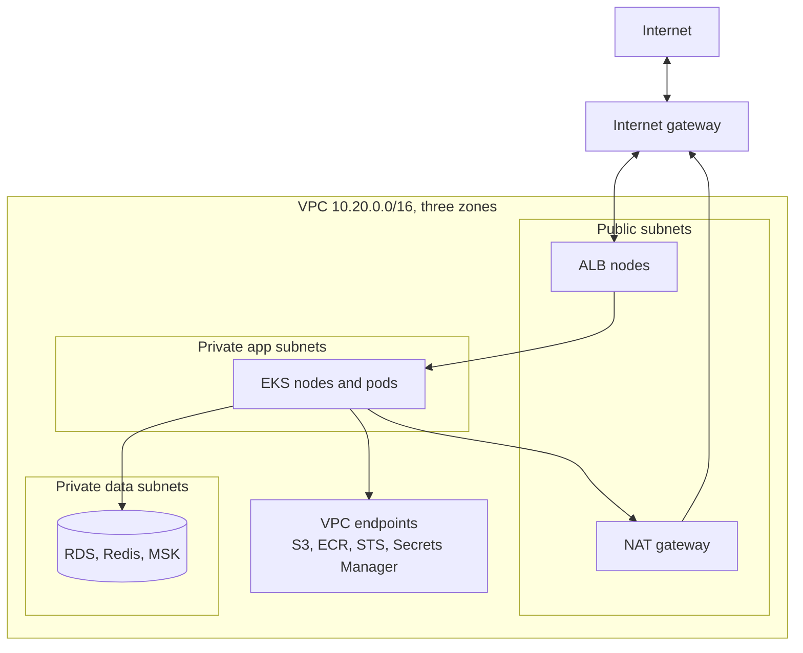

# AWS Networking — VPC, Subnets & Security Groups: The Gated Society Analogy

<!-- sdlc-stage:start -->
<div class="sdlc-stage">

📍 **SDLC stage: Deployment — infrastructure & runtime** · ShopNorth uses this in [Chapter 12 · Deploying on Kubernetes](/tutorials/journey-12-kubernetes)

</div>
<!-- sdlc-stage:end -->

## The Gated Society Analogy

Picture a large gated housing society:

- The society has its own **address plan**: Block A flats are 1-256, Block B 257-512. That's the **VPC** and its **CIDR range**.
- Some blocks face the main road and receive visitors — shops, the clubhouse. Others are deep inside, for residents only. Those are **public** and **private subnets**.
- There is exactly one **main gate** to the city road. That's the **internet gateway**.
- Residents in the inner blocks can order things from outside through the **courier desk**, which collects parcels and brings them in — but no stranger can walk in through the courier desk. That's a **NAT gateway**.
- Signboards at every junction say which road leads where. Those are **route tables**.
- Every building has a **guard with a list**: "delivery staff may enter the kitchen entrance; the plumber may enter the basement". The guard remembers who came in, so they can walk back out. That's a **security group** — stateful.
- At each block's entrance there's also a **checkpoint** that checks everyone in *and* out against a numbered list of rules, remembering nothing. That's a **network ACL** — stateless.
- A **private tunnel** leads directly to the bank branch next door, so residents never step onto the public road to reach it. That's a **VPC endpoint**.

## 1. The VPC and Its Address Plan

A **VPC** (Virtual Private Cloud) is your own isolated network in one AWS region, defined by a private IP range in CIDR notation. ShopNorth's production VPC is `10.20.0.0/16` — 65,536 addresses — spread over three availability zones:

| Subnet tier | Zone a | Zone b | Zone c | Holds |
|-------------|--------|--------|--------|-------|
| **Public** (`/24`, 256 addresses) | `10.20.0.0/24` | `10.20.1.0/24` | `10.20.2.0/24` | Load balancer nodes, NAT gateways |
| **Private app** (`/20`, 4,096 addresses) | `10.20.16.0/20` | `10.20.32.0/20` | `10.20.48.0/20` | EKS nodes and pods, VPC-attached Lambdas |
| **Private data** (`/24`) | `10.20.100.0/24` | `10.20.101.0/24` | `10.20.102.0/24` | RDS, ElastiCache, MSK, OpenSearch |

Design notes:

- **AWS reserves 5 addresses in every subnet** (network, router, DNS, a reserved one, broadcast), so a `/24` has 251 usable addresses.
- **App subnets are large on purpose.** On EKS, every pod gets a real VPC IP address, so a busy node can use dozens. Small subnets are the classic reason pods get stuck in `Pending` during a sale.
- **No overlapping ranges** across environments: staging is `10.10.0.0/16`. Overlaps make it impossible to connect the networks later (peering, VPN, Transit Gateway).

## 2. Public vs Private: It's All in the Route Table

A subnet isn't "public" because of a checkbox. It's public because its **route table** sends internet traffic to an **internet gateway**:

| Route table | Destination `10.20.0.0/16` | Destination `0.0.0.0/0` (everything else) |
|-------------|---------------------------|--------------------------------------------|
| Public subnets | `local` | Internet gateway |
| Private app subnets | `local` | NAT gateway (outbound only) |
| Private data subnets | `local` | *none* — no internet at all |



Customers reach only the load balancer. Pods can call out (payment provider, Auth0, Datadog) through the NAT gateway, but nothing on the internet can open a connection to a pod. Databases can't reach the internet in either direction.

## 3. NAT Gateways

A **NAT gateway** lets private resources start connections to the internet and receive the replies, while blocking connections started from outside.

| Point | Detail |
|-------|--------|
| Zonal NAT gateway (the classic) | Lives in one AZ — create **one per AZ** and route each private subnet to the NAT in its own zone, or a zone failure cuts the others off too |
| Regional NAT gateway (since November 2025) | One NAT gateway that spans the VPC's availability zones automatically, without a public subnet of its own |
| Cost | An hourly charge **plus a charge per GB processed** — this is the line that surprises people |
| Staging | One NAT gateway to save money; production uses one per zone |

## 4. VPC Endpoints: Reach AWS Services Privately

Without endpoints, a pod calling S3 or pulling images from ECR goes through the NAT gateway and pays per GB. **VPC endpoints** create private paths:

| Type | Services | How it works | Cost |
|------|----------|-------------|------|
| **Gateway endpoint** | S3, DynamoDB | An entry in the route table | Free |
| **Interface endpoint** (PrivateLink) | Most other services: ECR, STS, Secrets Manager, SQS, CloudWatch Logs… | Network interfaces in your subnets; private DNS makes the normal service name resolve to them | Hourly per AZ + per GB, but cheaper than NAT for heavy traffic |

ShopNorth runs a **gateway endpoint for S3** (image pulls from ECR also fetch layers from S3) and **interface endpoints for ECR, STS, and Secrets Manager**. The S3 endpoint has an **endpoint policy** that only allows ShopNorth's own buckets — so even a compromised pod can't upload data to an attacker's bucket through it.

## 5. Security Groups: The Developer's Main Tool

A **security group** is a stateful firewall attached to network interfaces (instances, load balancers, databases, Lambda ENIs).

| Property | What it means |
|----------|---------------|
| **Stateful** | If inbound traffic is allowed, the reply is automatically allowed out (and vice versa) |
| **Allow rules only** | There is no "deny" rule; anything not allowed is blocked |
| **Default** | No inbound allowed; all outbound allowed |
| **Can reference other security groups** | "Allow 5432 from members of `sg-eks-nodes`" — no IP addresses to maintain |

ShopNorth's chain, from the internet to the data:

| Security group | Inbound rule | From |
|----------------|-------------|------|
| `sg-alb` | TCP 443 | `0.0.0.0/0` (the internet) |
| `sg-eks-nodes` | TCP 8080 | `sg-alb` (load balancer to pods) |
| `sg-rds-orders` | TCP 5432 | `sg-eks-nodes` |
| `sg-redis` | TCP 6379 | `sg-eks-nodes` |
| `sg-msk` | TCP 9098 (Kafka with IAM auth) | `sg-eks-nodes` |
| `sg-opensearch` | TCP 443 | `sg-eks-nodes` |
| `sg-lambda-reports` | none | — (outbound to `sg-rds-orders` only) |

In Terraform, a security-group reference is one rule:

```hcl
resource "aws_vpc_security_group_ingress_rule" "orders_db_from_app" {
  security_group_id            = aws_security_group.rds_orders.id
  referenced_security_group_id = aws_security_group.eks_nodes.id   # members of this group, wherever they are
  from_port                    = 5432
  to_port                      = 5432
  ip_protocol                  = "tcp"
  description                  = "PostgreSQL from EKS nodes only"
}
```

<div class="callout-info">

**On EKS, pods use the node's security groups by default.** With the VPC CNI, a pod's IP is a secondary address on the node's network interface, so `sg-rds-orders` effectively trusts *every* pod on those nodes. Kubernetes NetworkPolicies (Chapter 12) narrow it inside the cluster. For stricter isolation — say, only the Payment service may reach a payments database — EKS **security groups for pods** give selected pods their own network interface and security group.

</div>

## 6. Network ACLs: The Stateless Backstop

| | Security group | Network ACL |
|---|---|---|
| Attached to | Network interfaces | Subnets |
| State | Stateful | **Stateless** — replies need their own rules |
| Rules | Allow only | Allow **and deny**, evaluated in number order |
| Typical use | Everyday access control | Coarse subnet-wide blocks, e.g., deny a malicious IP range |

Because NACLs are stateless, a custom NACL must also allow the **ephemeral ports** (1024-65535) that replies use. ShopNorth leaves the default NACLs (allow all) and does all real control with security groups — except during one bot attack, when Kabir added a temporary NACL deny for a hostile IP range. (WAF on the load balancer is the better tool for that today; see [CloudFront & Edge](/tutorials/aws-cloudfront).)

## 7. Connecting Networks

| Need | Service | Notes |
|------|---------|-------|
| Two VPCs talk directly | **VPC peering** | Simple and cheap; not transitive (A-B and B-C doesn't give A-C) |
| Many VPCs and accounts | **Transit Gateway** | A hub that routes between all attached networks |
| Expose one service privately to other VPCs or accounts | **PrivateLink** (endpoint service) | Consumers see only that service, not your whole network |
| Office or data center | **Site-to-Site VPN** or **Direct Connect** | VPN over the internet, or a dedicated private line |

## 8. DNS: Route 53

**Route 53** hosts ShopNorth's public zone `shopnorth.example`:

| Record | Type | Points to |
|--------|------|-----------|
| `www.shopnorth.example` | Alias (A/AAAA) | The CloudFront distribution |
| `api.shopnorth.example` | Alias (A/AAAA) | The Application Load Balancer |
| `status.shopnorth.example` | CNAME | The hosted status page provider |

- **Alias records** point to AWS resources by name, work at the zone apex (`shopnorth.example` itself, where CNAMEs aren't allowed), and queries to AWS targets are free.
- **TTLs** decide how long resolvers cache answers. Kabir lowers TTLs to 60 s a day before any migration, so a switch takes effect quickly.
- **Routing policies** — weighted (canary between two stacks), latency (nearest region), failover (to a DR site with health checks), geolocation — make DNS a traffic tool, not just a phone book.
- Inside the VPC, the **Route 53 Resolver** (at the VPC's `.2` address) answers internal names like the RDS endpoint, which is how failover to a new primary reaches the app.

## 9. Debugging "Connection Timed Out"

Walk the path in this order — most problems are found in the first four checks:

| # | Check | Tool |
|---|-------|------|
| 1 | Does the name resolve to the IP you expect? | `nslookup`, `dig` from inside the VPC |
| 2 | Does the source subnet's route table have a route to the destination? | VPC console, Reachability Analyzer |
| 3 | Does the **destination's security group** allow the port from the source? | Security group rules |
| 4 | Does the source's security group allow the traffic **out**? | Usually yes (default), unless tightened |
| 5 | Do the NACLs allow it in **both** directions, including ephemeral ports? | NACL rules |
| 6 | Is the service listening on that port and interface? | `ss -lntp`, app logs |

**VPC Reachability Analyzer** traces a path between two resources and tells you exactly which component blocks it. **VPC Flow Logs** record accepted and rejected connections. A rejected attempt from a pod to the database looks like this:

```
2 123456789012 eni-0a1b2c3d4e5f 10.20.17.24 10.20.100.15 49152 5432 6 10 840 1791100000 1791100060 REJECT OK
```

`REJECT` on port 5432 points straight at a security group or NACL; an `ACCEPT` with no response points at the application or the database itself.

## 🏢 Real-World Scenarios

<div class="callout-scenario">

**Scenario**: During a sale-day load test, new pods stayed `Pending` with the error "failed to assign an IP address". The cluster had plenty of CPU; the private subnets were `/24`s, and every pod consumed an IP address — the subnets ran out. **Decision**: Larger app subnets (`/20`), a secondary CIDR range for pods where address space is tight, VPC CNI prefix delegation (handing out blocks of addresses per node, which also raises the pods-per-node limit), and an alarm on available IPs per subnet.

</div>

<div class="callout-scenario">

**Scenario**: A team moved their Lambda function into the VPC so it could reach the database. It immediately started timing out on calls to S3 and to a partner API. Functions in a VPC only have the network access the VPC gives them, and their subnets had neither a NAT route nor endpoints. **Decision**: A gateway endpoint for S3, a NAT route for the partner API, and a rule of thumb: put Lambdas in a VPC only when they need private resources — functions that only use public AWS APIs run faster and simpler outside it.

</div>

## 🏋️ Practice Assignments

### 🟢 Low — Build the reflexes

**L1.** What makes a subnet public? And why can't the internet reach a pod in a private subnet even though the pod can reach the internet?

<details>
<summary>Show answer</summary>

A subnet is public when its route table sends `0.0.0.0/0` to an **internet gateway** (and its resources have public IPs or sit behind a public load balancer). A private subnet routes outbound traffic to a **NAT gateway**, which only translates connections *started from inside*; it keeps track of them and lets replies in, but drops any connection initiated from the internet. So pods can call the payment provider, but nothing outside can connect to a pod directly.

</details>

**L2.** Give three differences between security groups and network ACLs.

<details>
<summary>Show answer</summary>

(1) Security groups are **stateful** (replies are automatically allowed); NACLs are **stateless** (replies need explicit rules, including ephemeral ports). (2) Security groups have **allow rules only**; NACLs have **allow and deny** rules evaluated in number order. (3) Security groups attach to **network interfaces**; NACLs apply to **whole subnets**. Also: security groups can reference other security groups; NACLs work only with CIDR ranges.

</details>

### 🟡 Medium — Apply it

**M1.** The Order service can't connect to its RDS database after a Terraform change (`connection timed out`). Walk through your debugging steps.

<details>
<summary>Show answer</summary>

(1) From a pod, `nslookup` the RDS endpoint — does it resolve to a `10.20.100-102.x` address? (2) Check `sg-rds-orders` inbound: is TCP 5432 still allowed from `sg-eks-nodes`? A Terraform refactor that replaced a security group often drops references. (3) Check that the nodes still have `sg-eks-nodes` attached (launch template or Karpenter node class change). (4) Run **Reachability Analyzer** from a node's ENI to the RDS ENI on 5432 — it names the blocking component. (5) Check Flow Logs for `REJECT`s on 5432. A *timeout* (not "connection refused") almost always means a security group, NACL, or route problem, not the database.

</details>

**M2.** ShopNorth's NAT gateway bill doubled in a month. What do you check, and what do you change?

<details>
<summary>Show answer</summary>

Find what flows through it: VPC Flow Logs (top destinations by bytes), CloudWatch's `BytesOutToDestination` metrics on the NAT gateways, and Cost Explorer usage types (NAT data processing). Common culprits: container image pulls (ECR layers come from S3), calls to AWS APIs (S3, Secrets Manager, CloudWatch Logs), and a new job downloading large files. Fixes: an **S3 gateway endpoint** (free), **interface endpoints** for ECR and other heavy AWS APIs where the per-GB savings beat the hourly cost, image caching on nodes, and moving traffic that crosses zones to its own zone's NAT gateway.

</details>

### 🔴 High — Think like a senior

**H1.** A payment partner requires that requests to their API come from **two fixed IP addresses** they can allowlist. How do you design ShopNorth's egress?

<details>
<summary>Show answer</summary>

NAT gateways have Elastic IPs, so traffic from private subnets leaves with those fixed addresses. With zonal NAT gateways, there's one EIP per zone (three IPs); if the partner allows only two, either route the payment service's subnets through two designated NAT gateways, or create dedicated subnets for the payment egress with routes to two NAT gateways. A regional NAT gateway in manual IP mode, or an egress proxy (e.g., a small fleet in two zones with Elastic IPs), are other options. Keep HA: two IPs in two zones, a health check, and a runbook for failover. Document the IPs in the partner contract, and alarm if traffic to the partner ever leaves another way.

</details>

**H2.** ShopNorth's new analytics team wants to connect their own AWS account to the production database "with VPC peering, it's easy". What do you propose instead, and why?

<details>
<summary>Show answer</summary>

Peering connects whole networks: their account would gain a network path to everything in the production VPC that security groups allow, and the CIDRs must not overlap. Analytics shouldn't query the production primary at all. Instead: provide data through a **read replica or exports** — for example nightly anonymized exports to S3 shared via a cross-account role, or CDC into a warehouse. If live access is truly needed, expose one read-only endpoint through **PrivateLink** (an endpoint service in front of a read replica or an API), so the consumer sees one service, not the network. This limits blast radius, keeps production performance safe, and makes access auditable.

</details>

## 🛠️ Mini Project — Build a Three-Tier VPC

**Goal**: Build and debug a production-style network. 1 weekend (destroy it afterwards — NAT gateways cost money every hour).

**Build**

1. With Terraform (or the official `terraform-aws-modules/vpc` module), create a VPC across 2 AZs with public, private app, and private data subnets and their route tables.
2. Launch a tiny EC2 instance in a private app subnet with no public IP and connect to it using **Systems Manager Session Manager** (no SSH, no bastion).
3. Add a NAT gateway and prove the instance can `curl https://example.com`; remove the route and watch it fail.
4. Add an S3 gateway endpoint; use VPC Flow Logs to show S3 traffic no longer goes through the NAT.
5. Create a PostgreSQL RDS instance (smallest class, single-AZ) in the data subnets with a security group that allows 5432 only from the app instance's security group; connect from the instance, then from another instance outside the group (should fail).
6. Use **Reachability Analyzer** to explain the failing path.

**Acceptance criteria**: a diagram of your VPC, evidence of each allowed and blocked path, and `terraform destroy` completed.

## 🎯 Interview Corner

<div class="callout-interview">

**Q: "Describe a production VPC layout for a web application on AWS."**

One VPC per environment with a non-overlapping CIDR, spread across three availability zones. Public subnets hold only load balancers and NAT gateways. Private app subnets hold the instances, containers, or pods, with outbound internet through a NAT gateway per zone and VPC endpoints for S3, ECR, and other heavy AWS APIs. Private data subnets hold databases, caches, and brokers, with no internet route at all. Security groups form a chain that references groups rather than IPs: internet to the load balancer on 443, load balancer to the app port, app to the database port. People reach private hosts through Session Manager, not bastions, and Flow Logs are enabled for troubleshooting and security.

</div>

<div class="callout-interview">

**Q: "What's the difference between a security group and a network ACL?"**

A security group is a stateful firewall on network interfaces with allow-only rules, so replies to allowed traffic are automatically permitted, and rules can reference other security groups. A network ACL is a stateless filter on a whole subnet with numbered allow and deny rules, so return traffic, including ephemeral ports, must be allowed explicitly. In practice, security groups do almost all access control, and NACLs are a coarse backstop for things like blocking an IP range across a subnet.

</div>

<div class="callout-interview">

**Q: "Your service in a private subnet can't reach an external API. How do you troubleshoot?"**

I check the path step by step. Does the API's hostname resolve from inside the VPC? Does the subnet's route table send 0.0.0.0/0 to a NAT gateway, and is that NAT gateway in a public subnet with a route to the internet gateway? Does the instance's security group allow the outbound port, and do the NACLs allow both the outbound request and the inbound reply on ephemeral ports? Does the partner allowlist our NAT's Elastic IPs? Reachability Analyzer and Flow Logs show where packets stop. A timeout usually points to routing or firewalls, while connection refused or TLS errors point to the far end.

</div>

<div class="callout-interview">

**Q: "Why use VPC endpoints?"**

They let resources in private subnets reach AWS services without going through a NAT gateway or the internet. Gateway endpoints for S3 and DynamoDB are free route-table entries. Interface endpoints, built on PrivateLink, put network interfaces for services like ECR, STS, or Secrets Manager inside your subnets. The benefits are lower cost, because NAT data processing is per GB, a smaller attack surface, and control: endpoint policies can restrict which buckets or resources are reachable, which also helps against data exfiltration.

</div>

## Quick Reference

| Concept | Remember |
|---------|----------|
| VPC | Your isolated network in one region, a CIDR like `10.20.0.0/16` |
| Subnet | Lives in one AZ; AWS reserves 5 IPs |
| Public subnet | Route `0.0.0.0/0` → internet gateway |
| Private subnet | Route `0.0.0.0/0` → NAT gateway (outbound only) |
| Data subnet | No internet route at all |
| NAT gateway | Zonal (one per AZ) or regional; billed per GB |
| VPC endpoints | Gateway (S3, DynamoDB, free) / interface (most services) |
| Security group | Stateful, allow-only, reference other groups |
| NACL | Stateless, allow + deny, subnet-wide |
| Debug order | DNS → route → destination SG → source SG → NACL → listener |

> **Golden rule: give every resource the least reachable place in the network, and connect tiers by security-group references, not IP addresses.**

<!-- journey-link:start -->

<div class="callout-journey">

🛒 **ShopNorth Journey** — ShopNorth's production VPC spans three zones in Mumbai: only the load balancer is public, pods live in large private subnets, and databases sit in subnets with no internet route, reachable only from the app's security group. Chapter 12 deploys the services into it.

**Continue the story:** [Chapter 12 · Deploying on Kubernetes](/tutorials/journey-12-kubernetes) · **New here?** [Start the journey](/tutorials/journey-start)

</div>

<!-- journey-link:end -->
