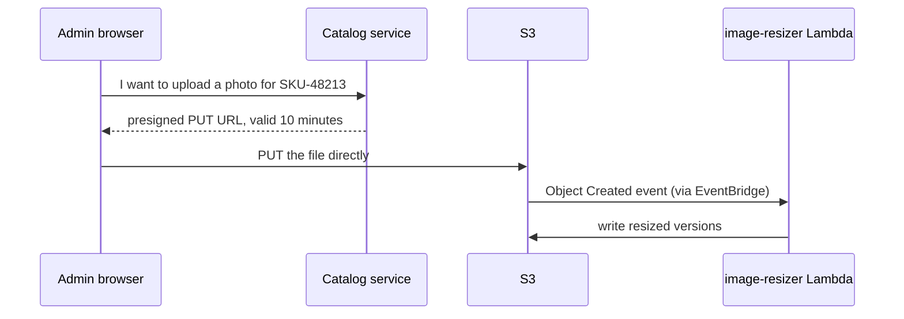

# Amazon S3 — Object Storage: The Self-Storage Warehouse Analogy

<!-- sdlc-stage:start -->
<div class="sdlc-stage">

📍 **SDLC stage: Design — architecture** · ShopNorth uses this in [Chapter 2 · System Design (HLD)](/tutorials/journey-02-system-design)

</div>
<!-- sdlc-stage:end -->

## The Self-Storage Warehouse Analogy

A self-storage company has warehouses in many cities and never runs out of space:

- Each customer rents a **named unit**, and the name is unique across the whole company. That's a **bucket**.
- Inside, every box has a **label** that's its full address: `invoices/2026/10/ORD-10492.pdf`. There are no real shelves or folders — just labels that happen to share beginnings. That's an **object** and its **key**.
- Boxes you rarely need can go to the **cheaper back room** (slower to fetch) or the **deep basement** (hours to fetch, very cheap). That's **storage classes**.
- A rule says "move boxes older than 90 days to the back room, throw away drafts after a year". That's a **lifecycle policy**.
- You can hand a courier a **one-time pass** valid for 10 minutes to drop off or collect *one* box, without giving them your key. That's a **presigned URL**.
- The unit can keep **every previous version** of a box, and some units are **locked** so nothing can be deleted for 7 years, not even by you. That's **versioning** and **Object Lock**.
- The warehouse can **text you** whenever a box arrives. That's an **event notification**.

## 1. The S3 Model

| Concept | Detail |
|---------|--------|
| **Bucket** | Globally unique name; lives in one region |
| **Object** | Data + metadata, addressed by a **key**; up to 50 TB per object (since December 2025; older material says 5 TB) |
| **Prefix** | The part of a key before the last `/` — a naming convention, not a folder |
| **Consistency** | Strong read-after-write for all operations (since December 2020) — a successful write is visible to the next read |
| **Durability** | Designed for 99.999999999% ("11 nines") by storing data across multiple availability zones |
| **Request rates** | At least 3,500 writes and 5,500 reads per second **per prefix**, scaling automatically; spread hot traffic across prefixes |

## 2. ShopNorth's Buckets

| Bucket | Holds | Access | Notable settings |
|--------|-------|--------|------------------|
| `shopnorth-web-prod` | The React storefront build | Only through CloudFront (Origin Access Control) | Versioning; hashed asset file names |
| `shopnorth-product-images-prod` | `originals/` uploads and `resized/` versions | Admin uploads via presigned URLs; reads only through CloudFront | EventBridge notifications ([Lambda resizer](/tutorials/aws-lambda)); replicated to Hyderabad |
| `shopnorth-invoices-prod` | Customer invoice PDFs | Private; customers download via short-lived presigned URLs | SSE-KMS; lifecycle to cheaper classes over time |
| `shopnorth-reports-prod` | Nightly sales CSVs | Ops staff via presigned links | Expire after 90 days |
| `shopnorth-events-archive` | Order events from MSK Connect | Analytics (Athena) | Parquet, partitioned by date |
| `shopnorth-datadog-log-archive` | Log archives (Chapter 13) | Datadog's role only | Lifecycle to Glacier |
| CloudTrail logs (in `log-archive`) | The audit trail | Almost nobody | **Object Lock** — nobody can delete or change them |

## 3. Secure by Default — and Keep It That Way

New buckets start locked down, and ShopNorth keeps it that way:

| Setting | Default for new buckets | ShopNorth |
|---------|------------------------|-----------|
| **Block Public Access** | On | On everywhere, also enforced at the account level |
| **Object Ownership** | Bucket owner enforced (ACLs disabled) | Kept — access is controlled only by policies |
| **Default encryption** | SSE-S3 | SSE-S3, or SSE-KMS with an S3 Bucket Key for sensitive data (invoices) |
| **TLS** | Allowed, not required | A bucket policy denies any request without TLS |

The storefront bucket's policy allows only ShopNorth's CloudFront distribution to read, and refuses unencrypted connections:

```json
{
  "Version": "2012-10-17",
  "Statement": [
    {
      "Sid": "AllowCloudFrontOriginAccessControl",
      "Effect": "Allow",
      "Principal": { "Service": "cloudfront.amazonaws.com" },
      "Action": "s3:GetObject",
      "Resource": "arn:aws:s3:::shopnorth-web-prod/*",
      "Condition": {
        "StringEquals": { "AWS:SourceArn": "arn:aws:cloudfront::123456789012:distribution/E2QWRUHEXAMPLE" }
      }
    },
    {
      "Sid": "DenyInsecureTransport",
      "Effect": "Deny",
      "Principal": "*",
      "Action": "s3:*",
      "Resource": ["arn:aws:s3:::shopnorth-web-prod", "arn:aws:s3:::shopnorth-web-prod/*"],
      "Condition": { "Bool": { "aws:SecureTransport": "false" } }
    }
  ]
}
```

<div class="callout-warn">

**Most S3 data leaks are configuration, not hacking.** Buckets made public "temporarily", overly broad bucket policies (`"Principal": "*"` with `Allow`), and access keys committed to Git cause the headlines. Keep Block Public Access on at the account level, serve public content through CloudFront, and review bucket policies in code review like any other code.

</div>

## 4. Presigned URLs: Let Clients Talk to S3 Directly

Product photos can be 10 MB each, and admins upload hundreds at a time. Sending them through the Catalog service would tie up its threads and memory. Instead, the Catalog service hands the browser a **presigned URL** — a URL signed with the service's own credentials that allows one specific upload for 10 minutes:

```java
@Service
class ImageUploadUrls {

    private final S3Presigner presigner = S3Presigner.builder().region(Region.AP_SOUTH_1).build();

    URL uploadUrlFor(String sku) {
        PutObjectRequest put = PutObjectRequest.builder()
                .bucket("shopnorth-product-images-prod")
                .key("originals/" + sku + "/" + UUID.randomUUID() + ".jpg")
                .contentType("image/jpeg")
                .build();

        PresignedPutObjectRequest presigned = presigner.presignPutObject(r -> r
                .signatureDuration(Duration.ofMinutes(10))
                .putObjectRequest(put));

        return presigned.url();      // the admin's browser PUTs the file straight to S3
    }
}
```



Invoices work the other way: the Order service returns a **presigned GET** URL valid for 15 minutes, so customers download their own invoice without the bucket ever being public.

| Presigned URL facts | |
|---------------------|---|
| Permissions | The URL can do only what the signer's credentials allow, and only the signed operation on the signed key |
| Lifetime | Your choice, but never longer than the signing credentials last (role sessions expire) |
| Size limits | A presigned PUT can't cap the file size — use a **presigned POST** with a `content-length-range` condition, or validate after upload (the resizer rejects files over 10 MB) |

## 5. Storage Classes and Lifecycle

| Storage class | Retrieval | Good for | ShopNorth |
|---------------|----------|----------|-----------|
| **S3 Standard** | Milliseconds | Frequently accessed data | Images, the web app |
| **S3 Intelligent-Tiering** | Milliseconds (optional archive tiers) | Unknown or changing access patterns | Event archive |
| **S3 Standard-IA** | Milliseconds, retrieval fee | Infrequent access, still instant | Invoices after 90 days |
| **S3 One Zone-IA** | Milliseconds | Re-creatable data (one AZ only) | `resized/` images could be regenerated — but they're served constantly, so Standard |
| **Glacier Instant Retrieval** | Milliseconds, higher retrieval fee | Rarely read archives that must be instant | Invoices after 1 year |
| **Glacier Flexible Retrieval / Deep Archive** | Minutes to hours / up to 12 hours | Long-term archives, compliance | Old log archives |
| **S3 Express One Zone** | Single-digit milliseconds | Very high-performance, single-AZ workloads | Not used |

A lifecycle configuration does the moving for you:

```json
{
  "Rules": [
    {
      "ID": "invoices-tiering",
      "Filter": { "Prefix": "invoices/" },
      "Status": "Enabled",
      "Transitions": [
        { "Days": 90, "StorageClass": "STANDARD_IA" },
        { "Days": 365, "StorageClass": "GLACIER_IR" }
      ],
      "NoncurrentVersionExpiration": { "NoncurrentDays": 30 },
      "AbortIncompleteMultipartUpload": { "DaysAfterInitiation": 7 }
    }
  ]
}
```

<div class="callout-tip">

**Always add `AbortIncompleteMultipartUpload`.** Failed large uploads leave invisible parts that you pay for forever — they don't show up in normal listings. This one line is a classic cost fix.

</div>

## 6. Versioning, Object Lock, and Replication

| Feature | Protects against | ShopNorth |
|---------|-----------------|-----------|
| **Versioning** | Accidental overwrites and deletes (a delete adds a "delete marker"; old versions remain) | On for web, images, invoices |
| **Object Lock** (governance or compliance mode) | Anyone deleting or changing data for a set period — even admins in compliance mode | CloudTrail logs and backup copies |
| **Cross-Region Replication** | Losing a region | Product images to Hyderabad (DR plan in [High Availability & DR](/tutorials/high-availability)) |
| **Same-Region Replication** | Copies in another account (e.g., log aggregation) | Not used |

Replication requires versioning on both buckets and copies new objects after it's enabled (existing objects need **Batch Replication**).

## 7. Performance and Events

- **Multipart upload** for large files: recommended above ~100 MB, and required for anything over 5 GB (the limit for a single PUT). Parts upload in parallel, and only failed parts are retried. The SDK's **S3 Transfer Manager** does this for you.
- **Byte-range GETs** download parts of a big file in parallel, or read just a header.
- **Spread hot keys across prefixes** if one prefix needs more than the per-prefix request rate.
- **Event notifications**: send events directly to SQS, SNS, or Lambda, or enable **EventBridge** delivery for content filtering and many targets — ShopNorth uses EventBridge for the image pipeline ([EventBridge](/tutorials/aws-eventbridge)).

## 8. What You Pay For

| Cost line | Driven by | Reduce it with |
|-----------|----------|----------------|
| Storage | GB-months per storage class | Lifecycle rules, deleting old versions |
| Requests | Number of PUT/GET/LIST calls | Fewer, larger objects; caching through CloudFront |
| Data transfer out | GB leaving AWS | CloudFront in front (cheaper and faster for public content) |
| Retrieval | GB read from IA and Glacier classes | Choose classes by real access patterns |

**S3 Storage Lens** and **S3 Inventory** show where the bytes and the money are, bucket by bucket and prefix by prefix.

## 🏢 Real-World Scenarios

<div class="callout-scenario">

**Scenario**: To let a vendor download product data quickly, an engineer made a bucket public and attached `"Principal": "*"` to `s3:GetObject`. The bucket also contained customer export files. A security researcher found it a week later through a scanner. **Decision**: Account-level Block Public Access (an SCP prevents disabling it), separate buckets for public and private data, and vendor sharing through presigned URLs or a cross-account role — never a public bucket.

</div>

<div class="callout-scenario">

**Scenario**: A team's S3 bill grew every month even though their visible data was stable. The cause: a nightly job uploaded multi-gigabyte files with multipart upload, and many uploads failed halfway; the orphaned parts accumulated — invisible in the console listing — for two years. **Decision**: A lifecycle rule to abort incomplete multipart uploads after 7 days on every bucket, Storage Lens dashboards reviewed monthly, and alarms on unexpected storage growth.

</div>

## 🏋️ Practice Assignments

### 🟢 Low — Build the reflexes

**L1.** Is this true or false: "S3 has folders, and renaming a folder is instant."

<details>
<summary>Show answer</summary>

**False.** S3 has a flat namespace of keys; "folders" are just shared key prefixes that the console displays as folders. "Renaming a folder" means copying every object to a new key and deleting the old ones — slow and costly for many objects. Design key names so you never need to rename them.

</details>

**L2.** Name three settings that keep an S3 bucket private and secure by default.

<details>
<summary>Show answer</summary>

(1) **Block Public Access** (bucket and account level). (2) **Object Ownership: bucket owner enforced**, which disables ACLs so only policies grant access. (3) **Default encryption** (SSE-S3 or SSE-KMS). Also: a bucket policy that denies non-TLS requests, versioning for recovery, and serving any public content only through CloudFront with Origin Access Control.

</details>

### 🟡 Medium — Apply it

**M1.** Design the customer invoice download for ShopNorth: invoices must never be public, links shouldn't work for other customers, and the bucket must survive accidental deletions.

<details>
<summary>Show answer</summary>

Invoices live in `shopnorth-invoices-prod` with Block Public Access, SSE-KMS, and **versioning**. The customer clicks "Download invoice"; the Order service checks that the order belongs to the authenticated customer (from the Auth0 token), then returns a **presigned GET URL** for that one key, valid for ~15 minutes, signed with the service's role (which has `s3:GetObject` on `invoices/*` and `kms:Decrypt` on the key). Keys contain unguessable IDs, but authorization is the ownership check, not secrecy of the key. Accidental deletes are recoverable from versions; a lifecycle rule moves old invoices to cheaper classes, and an SCP plus bucket policy prevent disabling versioning.

</details>

**M2.** Admins upload 2,000 product photos during catalog onboarding, and the Catalog service's memory spikes. What do you change?

<details>
<summary>Show answer</summary>

Stop routing file bytes through the service: return **presigned PUT (or POST) URLs** so browsers upload directly to S3, with keys under `originals/<sku>/<uuid>.jpg`. Enforce size and type with a presigned POST policy (`content-length-range`, content type) or validate in the resizer. Processing is asynchronous: S3 → EventBridge → the resizer Lambda writes `resized/` versions; the admin UI polls or receives a status update. The service now only signs URLs (milliseconds of work), and uploads scale with S3.

</details>

### 🔴 High — Think like a senior

**H1.** ShopNorth must keep invoices for 8 years for tax reasons, cheaply, and prove they were never altered. Design the storage.

<details>
<summary>Show answer</summary>

A dedicated bucket (or prefix with its own policy) with **versioning** and **Object Lock in compliance mode** with a default retention of 8 years — not even the root user can delete or change locked versions before then. Lifecycle: Standard for 90 days (frequent customer downloads), Standard-IA until 1 year, then **Glacier Instant Retrieval** (still retrievable in milliseconds when a customer or auditor asks) or Glacier Flexible Retrieval if minutes are acceptable. SSE-KMS with a customer managed key (key deletion protected), CloudTrail data events for access logging, and a replica in Hyderabad for DR (with Object Lock on the replica too). Test a restore and an audit retrieval yearly. Note the trade-off: compliance mode can't be shortened if requirements change, so confirm the retention period with finance and legal first.

</details>

**H2.** Your analytics job lists all objects in a bucket with 300 million objects every night, and it takes hours and costs money. Improve it.

<details>
<summary>Show answer</summary>

Stop listing. Enable **S3 Inventory** (daily or weekly CSV/Parquet reports of all objects and their metadata, delivered to a bucket) and query it with Athena. For change tracking, consume **event notifications** (via EventBridge or SQS) to maintain your own index of new and deleted objects. If you must list, list by prefix in parallel (keys designed with date or hash prefixes). For bulk operations on many objects (copy, tag, restore), use **S3 Batch Operations** driven by the inventory report.

</details>

## 🛠️ Mini Project — Direct-to-S3 Uploads, Done Securely

**Goal**: Build ShopNorth's image upload flow with presigned URLs and lifecycle rules. 1 weekend (free-tier friendly).

**Build**

1. Create a bucket with Block Public Access on, versioning, default encryption, and a policy that denies non-TLS requests.
2. In a Spring Boot app, add an endpoint that returns a presigned PUT URL for `originals/<sku>/<uuid>.jpg`, valid 10 minutes, with `image/jpeg` as the content type.
3. Build a tiny HTML page (or use `curl`) that uploads a file to that URL; confirm the object exists and that the same URL fails after 10 minutes.
4. Add a second endpoint that returns a presigned GET URL for a private object; prove the object can't be read without it.
5. Add a lifecycle configuration: transition `invoices/` to Standard-IA after 90 days, expire noncurrent versions after 30 days, abort incomplete multipart uploads after 7 days.
6. Delete an object and restore it from its previous version.

**Acceptance criteria**: uploads that never pass through your server, a private object readable only via a presigned URL, a lifecycle configuration in code, and a recovered "deleted" object.

## 🎯 Interview Corner

<div class="callout-interview">

**Q: "How would you let users upload large files to S3 from a web application?"**

With presigned URLs. The browser asks my backend for permission. The backend checks that the user may upload, then returns a presigned PUT, or a presigned POST if I need to cap the size and type, for one specific key, valid for a few minutes. The browser uploads directly to S3, so file bytes never pass through my servers. For very large files, I'd use multipart uploads with presigned part URLs, so failed parts can be retried. Processing happens asynchronously from an S3 event through EventBridge or SQS to a worker, and the key layout and lifecycle rules are designed up front.

</div>

<div class="callout-interview">

**Q: "How do you secure an S3 bucket?"**

Keep Block Public Access on at the account level and disable ACLs, so access comes only from IAM and bucket policies scoped to specific roles and actions. Encrypt by default, using SSE-KMS with a bucket key for sensitive data, and deny requests without TLS. Serve public content through CloudFront with Origin Access Control instead of a public bucket, and share private objects with presigned URLs or cross-account roles. Turn on versioning, plus Object Lock where data must be immutable. Then audit: CloudTrail data events for sensitive buckets, Access Analyzer for anything shared outside the account, and IAM policy changes reviewed like code.

</div>

<div class="callout-interview">

**Q: "What S3 storage classes would you use for logs that are read often for a week, sometimes for a month, and almost never after that, but must be kept for a year?"**

S3 Standard for the first week or so, transition to Standard-IA after 30 days, then to Glacier Flexible Retrieval or Deep Archive after about 90 days, and expire at 365 days, all in a lifecycle rule. I'd add a rule to abort incomplete multipart uploads. If the access pattern is unpredictable, Intelligent-Tiering moves objects automatically for a small monitoring fee. I'd also check the minimum storage durations and retrieval fees, so transitions actually save money for small objects.

</div>

## Quick Reference

| Concept | Remember |
|---------|----------|
| Object size | Up to 50 TB (since Dec 2025) |
| Consistency | Strong read-after-write |
| Durability | 11 nines; data spread across AZs |
| Prefixes | Not folders; ~3,500 writes and 5,500 reads/s per prefix |
| Security | Block Public Access, ACLs off, encryption, TLS-only policy |
| Public content | CloudFront + Origin Access Control |
| Direct uploads | Presigned PUT/POST; presigned GET for private downloads |
| Lifecycle | Transitions, expirations, abort incomplete multipart uploads |
| Protection | Versioning, Object Lock, replication |
| Events | Direct notifications or EventBridge |

> **Golden rule: keep every bucket private, let clients move bytes directly with presigned URLs, and let lifecycle rules — not people — decide where old data lives.**

<!-- journey-link:start -->

<div class="callout-journey">

🛒 **ShopNorth Journey** — ShopNorth keeps its storefront, product images, invoices, reports, and archives in private S3 buckets: admins upload photos with presigned URLs, CloudFront serves them, and lifecycle rules move old invoices to cheaper storage. Chapter 2 chose object storage + CDN for the 90 GB of images.

**Continue the story:** [Chapter 2 · System Design (HLD)](/tutorials/journey-02-system-design) · **New here?** [Start the journey](/tutorials/journey-start)

</div>

<!-- journey-link:end -->
