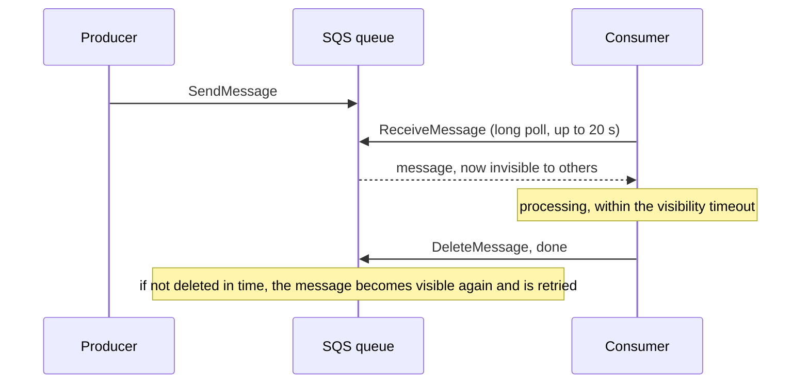
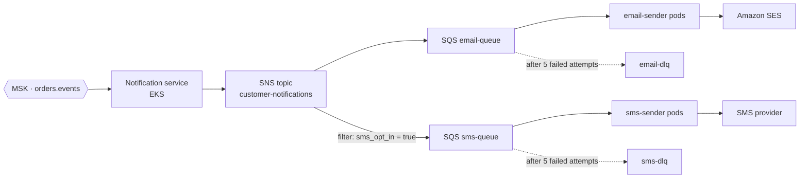

# SQS & SNS — Queues and Fan-Out: The Post Office Analogy

<!-- sdlc-stage:start -->
<div class="sdlc-stage">

📍 **SDLC stage: Development — services & events** · ShopNorth uses this in [Chapter 6 · Microservices & Events](/tutorials/journey-06-microservices)

</div>
<!-- sdlc-stage:end -->

## The Post Office Analogy

A post office offers two very different services:

- **A sorting room with a pile of parcels to deliver** — that's **SQS**. Couriers take parcels one at a time. While a courier has a parcel, it's marked "out for delivery" so nobody else takes it. If the courier doesn't confirm delivery by the end of the shift, the parcel goes back on the pile for someone else. A parcel that fails delivery five times goes to the **dead letter office** for a human to look at.
- **A newspaper subscription desk** — that's **SNS**. The newspaper is printed once, and every subscriber gets their own copy. Subscribers can choose sections: one wants only sports, another only business. That's **fan-out** with **filtering**.

Put them together and you get a classic pattern: announce something once, and let several independent sorting rooms handle their own copy at their own pace.

## 1. SQS: The Basics

A producer sends messages to a **queue**; consumers **poll** for messages, process them, and **delete** them. Nothing is pushed to consumers, so a slow or crashed consumer can't be overwhelmed — the messages simply wait.



| Setting | Range / default | What it controls |
|---------|----------------|------------------|
| Message size | Up to **1 MiB** (since August 2025; older material says 256 KB) | Bigger data goes to S3, with the key in the message |
| Retention | 1 minute to 14 days (default 4 days) | How long unprocessed messages survive a consumer outage |
| **Visibility timeout** | Default 30 s, up to 12 hours | How long a received message stays hidden before it's retried |
| Long polling | Wait up to 20 s for messages | Fewer empty receives, lower cost and latency |
| Batch size | Up to 10 messages per call | Throughput and cost |
| Delay | Up to 15 minutes | Hold new messages before they become visible |

### Standard vs FIFO queues

| | Standard | FIFO (name ends in `.fifo`) |
|---|---|---|
| Ordering | Best effort | Strict, **per message group ID** |
| Delivery | At least once (rare duplicates) | Exactly-once processing within a 5-minute deduplication window |
| Throughput | Nearly unlimited | Lower (high-throughput mode raises it a lot) |
| Use for | Most background work | When order matters per entity, e.g., all updates for one order |

<div class="callout-warn">

**At-least-once means your consumer must be idempotent.** A standard queue can deliver a message twice, and *any* queue redelivers a message whose processing outlived the visibility timeout. Record what you've processed (by message or business ID) in the same transaction as the work, or make the work naturally repeatable.

</div>

## 2. Dead-Letter Queues

A **redrive policy** moves a message to a **dead-letter queue (DLQ)** after it has been received `maxReceiveCount` times without being deleted. This stops one **poison message** (bad data, a bug) from being retried forever while blocking capacity.

| Practice | Why |
|----------|-----|
| Every queue has a DLQ | Failures become visible instead of looping or expiring silently |
| `maxReceiveCount` around 5 | Enough retries for transient errors, few enough to fail fast on bad data |
| Alarm when the DLQ has any message | Someone looks within hours, not weeks |
| DLQ retention at the maximum (14 days) | Time to investigate and fix |
| **Redrive** back to the source queue after a fix | The console or API moves messages back for reprocessing |

## 3. Consuming SQS from Spring Boot

Spring Cloud AWS turns a queue into a listener method. The message is deleted when the method returns normally; an exception leaves it in the queue to be retried after the visibility timeout:

```java
@Component
class EmailSender {

    private final EmailProvider emailProvider;     // wraps Amazon SES
    private final SentNotificationRepository sent;

    // constructor omitted

    @SqsListener(value = "email-queue", maxConcurrentMessages = "20", maxMessagesPerPoll = "10")
    void send(CustomerNotification notification) {
        if (sent.existsById(notification.id())) {
            return;                                 // duplicate delivery: already sent, just acknowledge
        }
        emailProvider.send(notification.email(), notification.template(), notification.variables());
        sent.save(new SentNotification(notification.id()));
    }
}
```

**Size the visibility timeout above the worst-case processing time** — including the email provider's timeout and retries. If processing takes 40 s and the visibility timeout is 30 s, every slow message gets processed twice.

## 4. SNS: Publish Once, Deliver to Many

An **SNS topic** pushes each published message to all its **subscriptions**: SQS queues, Lambda functions, HTTPS endpoints, email, SMS, and mobile push.

| Feature | What it does |
|---------|-------------|
| **Fan-out to SQS** | Each subscribed queue gets its own copy; consumers are fully independent |
| **Message filtering** | A subscription receives only messages matching its filter policy (on message attributes or the payload) |
| **FIFO topics** | Ordered fan-out to FIFO queues |
| **Delivery retries + subscription DLQ** | Undeliverable messages are kept, not lost |
| **Raw message delivery** | SQS receives your payload as-is, without SNS's JSON envelope |

A filter policy on ShopNorth's SMS queue subscription — only order updates, and only for customers who opted in:

```json
{
  "type": ["ORDER_CONFIRMED", "ORDER_SHIPPED"],
  "sms_opt_in": ["true"]
}
```

The SQS queue must allow the topic to send to it, scoped with a condition so no other topic can:

```json
{
  "Version": "2012-10-17",
  "Statement": [{
    "Effect": "Allow",
    "Principal": { "Service": "sns.amazonaws.com" },
    "Action": "sqs:SendMessage",
    "Resource": "arn:aws:sqs:ap-south-1:123456789012:sms-queue",
    "Condition": { "ArnEquals": { "aws:SourceArn": "arn:aws:sns:ap-south-1:123456789012:customer-notifications" } }
  }]
}
```

## 5. ShopNorth's Notification Pipeline

Chapter 2 made notifications asynchronous: the Notification service consumes `OrderPaid` events from Kafka and sends email and SMS. Here's how it's built on AWS:



**Why not send emails directly from the Kafka consumer?**

| Problem with sending inside the Kafka consumer | What SNS + SQS gives ShopNorth |
|---------------------------------------------|-------------------------------|
| One message that keeps failing blocks its whole partition (Kafka processes a partition in order) | Each message retries on its own; poison messages go to a DLQ |
| A slow SMS provider slows down email too | Separate queues and separate sender pods per channel |
| Parallelism is capped by the partition count (Chapter 14's 25-minute email delay) | Add sender pods any time; no partitions to plan |
| Provider rate limits need custom back-off code | Senders control their polling rate; the queue absorbs the backlog |
| A new channel (WhatsApp, push) means changing the consumer | Subscribe a new queue to the topic |

Kafka stays the system of record for business events; SNS and SQS handle the *delivery work* that follows.

## 6. Choosing a Messaging Service

| Need | Pick |
|------|------|
| A work queue: each job processed once by one of many workers, with retries | **SQS** |
| Push one message to several independent consumers | **SNS** (often → SQS) |
| Route events by their content between services, accounts, and SaaS apps; schedules | **EventBridge** |
| An ordered, replayable event stream many consumers read at their own pace | **Kafka (MSK)** or Kinesis |

The full comparison, with ShopNorth examples for each, is in [EventBridge](/tutorials/aws-eventbridge); Kafka on AWS is in [MSK](/tutorials/aws-msk).

## 7. Operating Queues

| Metric | Alarm when | Meaning |
|--------|-----------|---------|
| `ApproximateAgeOfOldestMessage` | > 5 minutes (email) | Consumers are falling behind — the most useful queue alarm |
| `ApproximateNumberOfMessagesVisible` | Growing for 10 minutes | Backlog; scale consumers |
| DLQ `ApproximateNumberOfMessagesVisible` | > 0 | Something is failing repeatedly |
| `NumberOfMessagesDeleted` vs `NumberOfMessagesReceived` | Big gap | Messages are being received but not completed (timeouts, errors) |

On EKS, ShopNorth scales the sender pods on queue backlog with **KEDA**'s SQS scaler — the number of pods follows the number of waiting messages, not CPU.

## 🏢 Real-World Scenarios

<div class="callout-scenario">

**Scenario**: Customers started receiving 2-3 copies of every invoice email. The sender's visibility timeout was 30 s, but generating the PDF and calling the email API sometimes took 45 s under load; the message became visible again while still being processed, and another pod sent it too. **Decision**: Visibility timeout raised to 3 minutes (above the worst case), the sender records sent notification IDs and skips duplicates, and a metric tracks duplicates suppressed so the team notices when it happens.

</div>

<div class="callout-scenario">

**Scenario**: A queue without a DLQ received a message with malformed JSON. The consumer threw an exception on every attempt; the message became visible every 30 seconds for 4 days until retention expired, using a worker thread the whole time — and the error logs drowned out real problems. **Decision**: Every queue gets a redrive policy (`maxReceiveCount` 5) and a DLQ with an alarm; consumers validate messages and send clearly invalid ones straight to a DLQ instead of retrying them.

</div>

## 🏋️ Practice Assignments

### 🟢 Low — Build the reflexes

**L1.** What happens to an SQS message if the consumer crashes after receiving it but before deleting it?

<details>
<summary>Show answer</summary>

Nothing is lost: the message stays in the queue, invisible until the **visibility timeout** expires, then becomes visible again and another consumer receives it. Its receive count goes up; after `maxReceiveCount` attempts, the redrive policy moves it to the DLQ. This is why SQS delivery is at-least-once and consumers must be idempotent.

</details>

**L2.** When would you use a FIFO queue instead of a standard queue? What's the role of the message group ID?

<details>
<summary>Show answer</summary>

Use FIFO when the **order of processing matters for the same entity** and duplicates must be avoided — for example, applying status updates for one order in sequence. The **message group ID** defines the ordering scope: messages with the same group ID (e.g., the order ID) are processed one at a time in order, while different groups are processed in parallel. Using a single group ID for everything kills parallelism.

</details>

### 🟡 Medium — Apply it

**M1.** ShopNorth's SMS provider allows 50 messages per second. On sale night, 300 SMS jobs per second arrive. Design the consumer side.

<details>
<summary>Show answer</summary>

Let the queue absorb the burst: `sms-queue` holds the backlog (retention covers far longer than the sale). The sender pods enforce a **global rate limit** of ~45/s (a little under the provider's limit) — e.g., a token bucket in Redis shared by all pods, or a fixed number of pods each limited to a share. Long polling with batches of 10. Expect the backlog to drain after the peak; tell Ananya the realistic delay (300/s for 20 minutes → about 1.5 hours to drain at 45/s, minus what drains during the peak) and prioritize: order confirmations before marketing messages (separate queues). Alarm on `ApproximateAgeOfOldestMessage`, and handle provider `429`s by not deleting the message (it retries after the visibility timeout) rather than failing it.

</details>

**M2.** Explain the SNS → SQS fan-out pattern and why it's better than the Notification service writing to two queues itself.

<details>
<summary>Show answer</summary>

The service publishes **once** to an SNS topic, and every subscribed queue gets its own copy. Benefits: the producer doesn't know or care how many consumers exist; adding a channel or an analytics consumer is a new subscription, not a code change; filter policies route messages per subscriber without logic in the producer; and each queue has its own retries, DLQ, and consumers, so channels fail independently. Writing to two queues directly couples the producer to every consumer and risks partial publishing (one write succeeds, the other fails).

</details>

### 🔴 High — Think like a senior

**H1.** An order's status messages (`PAID`, `PACKED`, `SHIPPED`) must reach the customer in order, with no duplicates, and the service handles 2,000 orders per minute at peak. Design it with SQS/SNS and justify your choices.

<details>
<summary>Show answer</summary>

Use an **SNS FIFO topic** → **SQS FIFO queues** with `MessageGroupId = orderId`: updates for the same order are delivered in order, while thousands of different orders proceed in parallel. Use a `MessageDeduplicationId` derived from `(orderId, status)` so retries within the 5-minute window are dropped. Throughput: 2,000 orders/minute × 3 statuses ≈ 100 messages/s, comfortably within FIFO limits (enable high-throughput mode if growth demands). Consumers still store the last status sent per order and ignore anything older (deduplication only covers 5 minutes, and redrives can replay). DLQs per queue — note a failed message blocks *its* group until it's handled, so alarm quickly. If ordering across services and replay are required, the source of truth stays in Kafka; FIFO SQS handles only delivery.

</details>

**H2.** Your team wants to replace Kafka with SNS + SQS entirely "to reduce costs". What would ShopNorth lose, and when would you agree?

<details>
<summary>Show answer</summary>

**Lost:** replay (SQS deletes messages after processing; Kafka keeps the log for days so new consumers or fixed bugs can reprocess history), strict ordering across a partition with high throughput, the outbox → Kafka pattern feeding search indexing and analytics from the same stream, consumer groups reading independently at their own offsets, and the existing exactly-once tooling inside Kafka. **Gained:** no cluster to size, pay per request, simpler operations. **Agree** for workflows that are really work queues or simple fan-out with no replay need (notifications, image processing, webhooks out). **Disagree** for the core business event stream (orders, payments, inventory), where replay and ordering are part of the design (Chapter 6). A hybrid — Kafka for events, SQS for delivery work — is what ShopNorth already does.

</details>

## 🛠️ Mini Project — A Resilient Notification Pipeline

**Goal**: Build ShopNorth's SNS → SQS fan-out with retries, DLQs, and idempotency. 1 weekend (free-tier friendly).

**Build**

1. Create an SNS topic `customer-notifications` and two SQS queues (`email-queue`, `sms-queue`) with DLQs (`maxReceiveCount` 5) and raw message delivery; add the filter policy to the SMS subscription.
2. Write a Spring Boot app with two `@SqsListener` methods (or two apps) that "send" email and SMS by logging, and record processed IDs in PostgreSQL or Redis.
3. Publish 1,000 test notifications with random `sms_opt_in` attributes; verify counts in each queue.
4. Inject failures: make the email sender throw for 1 in 50 messages, permanently for messages with a bad template — watch transient failures succeed on retry and permanent ones land in the DLQ.
5. Set the visibility timeout too low (5 s) and make processing take 8 s; count the duplicates your idempotency check prevented.
6. Create CloudWatch alarms on `ApproximateAgeOfOldestMessage` and DLQ depth; redrive the DLQ after "fixing" the template.

**Acceptance criteria**: no lost notifications, no duplicate sends, DLQ contents explained, and alarms that fired during the failure test.

## 🎯 Interview Corner

<div class="callout-interview">

**Q: "How does SQS guarantee that messages aren't lost, and what does at-least-once delivery mean for your code?"**

Messages are stored redundantly until a consumer explicitly deletes them. When a consumer receives a message, it becomes invisible for the visibility timeout. If the consumer crashes or doesn't delete it in time, the message reappears for another consumer, and after a set number of receives, the redrive policy moves it to a dead-letter queue instead of retrying forever. The trade-off is at-least-once delivery: duplicates can happen, from standard-queue behavior or from processing that outlives the visibility timeout. So consumers must be idempotent, for example by recording processed message or business IDs in the same transaction as the work, and the visibility timeout must exceed the worst-case processing time.

</div>

<div class="callout-interview">

**Q: "SQS, SNS, EventBridge, or Kafka — how do you decide?"**

SQS is a work queue: each message is processed once by one of many competing consumers, with retries and dead-letter queues. SNS is push fan-out: one message to many subscribers, usually SQS queues, with filtering. EventBridge is an event router: rules match events by content and send them to many kinds of targets, across accounts and from SaaS partners, and it also schedules. Kafka, or MSK, is a durable, ordered, replayable log where many consumer groups read at their own pace. For an order system, I'd use Kafka for the core business events and SNS plus SQS for delivery work like notifications.

</div>

<div class="callout-interview">

**Q: "What is a dead-letter queue, and how do you operate one?"**

It's a queue where messages go after failing processing a set number of times, so a poison message doesn't loop forever or block capacity. Every work queue should have one, with a max receive count around five, maximum retention, and an alarm when it's not empty. When it fires, someone inspects the messages, fixes the cause, whether that's a bug, bad data, or a downstream outage, and then redrives the messages back to the source queue. Consumers should also send clearly invalid messages directly to the DLQ instead of retrying them, so transient failures and permanent ones are handled differently.

</div>

## Quick Reference

| Concept | Remember |
|---------|----------|
| SQS delivery | At least once — consumers must be idempotent |
| Visibility timeout | > worst-case processing time (default 30 s, max 12 h) |
| Message size | Up to 1 MiB (since Aug 2025); big payloads in S3 |
| Long polling | `WaitTimeSeconds` up to 20 |
| FIFO | Order per message group ID; dedup within 5 minutes |
| DLQ | Redrive policy with `maxReceiveCount`; alarm on any message |
| SNS | Push fan-out; filter policies; FIFO topics |
| Fan-out | SNS → several SQS queues, each independent |
| Key alarm | `ApproximateAgeOfOldestMessage` |

> **Golden rule: queues turn "the downstream is slow" into "the work waits safely" — as long as every queue has a DLQ and every consumer is idempotent.**

<!-- journey-link:start -->

<div class="callout-journey">

🛒 **ShopNorth Journey** — ShopNorth's Notification service turns Kafka order events into SNS messages, fanned out to separate email and SMS queues with dead-letter queues — so a slow SMS provider on sale night never delays an email, and no message is lost. Chapter 6 designs the events behind it.

**Continue the story:** [Chapter 6 · Microservices & Events](/tutorials/journey-06-microservices) · **New here?** [Start the journey](/tutorials/journey-start)

</div>

<!-- journey-link:end -->
