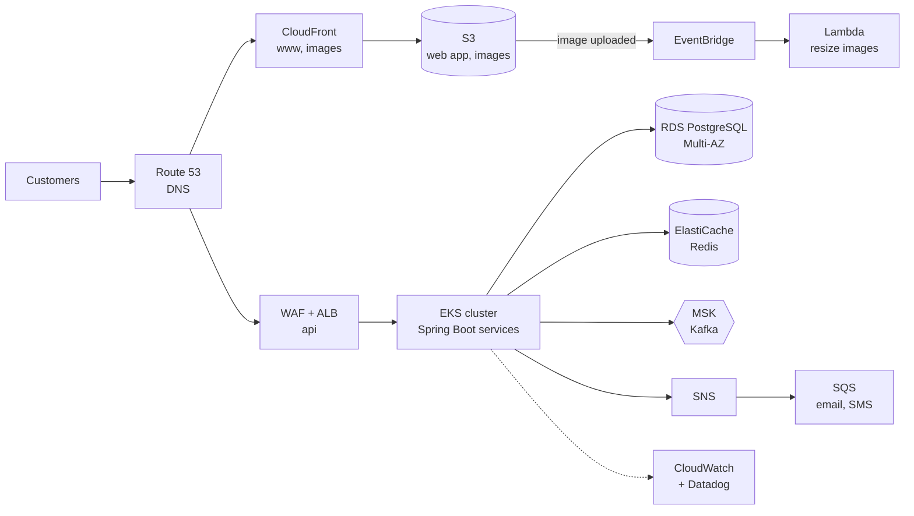

# AWS for Developers — Start Here: The Rented City Analogy

<!-- sdlc-stage:start -->
<div class="sdlc-stage">

📍 **SDLC stage: Design — architecture** · ShopNorth uses this in [Chapter 2 · System Design (HLD)](/tutorials/journey-02-system-design)

</div>
<!-- sdlc-stage:end -->

## The Rented City Analogy

Imagine you could build a business in a city where **everything is rentable by the minute**:

- **Apartments** of any size, rented by the hour — **EC2** virtual machines.
- **Workers you pay only while they're working**, called in when a parcel arrives — **Lambda** functions.
- **Warehouses** with unlimited shelves — **S3**.
- **A post office** with mailboxes that hold letters until someone collects them — **SQS**, plus a **loudspeaker** that announces news to every subscriber — **SNS**.
- **Roads, gates, and guards** deciding who may drive where — **VPC** networking and **security groups**.
- **ID cards and keys** for every person and machine — **IAM**.
- **Local pickup points** in every neighborhood, so customers don't travel downtown — **CloudFront**.
- **A city planning office** that builds whole districts from a blueprint — **CloudFormation**.
- **CCTV and alarms** on everything — **CloudWatch**.

The city is enormous — AWS has more than 200 services — but a backend developer uses a core set of about 20 every week. This section teaches that core set, the way you'll use it at work, through one example: **ShopNorth**, the fictional online store from the [ShopNorth Journey](/tutorials/journey-start).

## 1. How AWS Is Organized: Regions, Zones, and the Edge

| Level | What it is | Example | Why you care |
|-------|-----------|---------|--------------|
| **Region** | A geographic area with several data centers | `ap-south-1` (Mumbai), `ap-south-2` (Hyderabad) | Latency to users, data residency, prices, and which services exist |
| **Availability Zone (AZ)** | One or more data centers with independent power and networking, inside a region | `ap-south-1a`, `ap-south-1b`, `ap-south-1c` | Spread across 3 AZs to survive a data-center failure |
| **Edge location** | A small site close to users, used by CloudFront and Route 53 | Mumbai, Delhi, Chennai, Bengaluru, and other cities | Fast delivery of images and pages |

Services work at different scopes, and mixing them up causes real bugs:

| Scope | Services | Gotcha |
|-------|----------|--------|
| **Global** | IAM, Route 53, CloudFront, Organizations | Certificates for CloudFront must be created in `us-east-1` |
| **Regional** | S3 buckets, SQS, SNS, Lambda, EKS, RDS, DynamoDB, KMS | A resource created in Mumbai is invisible when the console is set to Virginia |
| **Zonal** | EC2 instances, EBS volumes, subnets | An EBS volume can only attach to an instance in the same AZ |

ShopNorth runs in **Mumbai** (close to its Indian customers, and customer data stays in India), keeps disaster recovery backups in **Hyderabad**, and touches **`us-east-1`** only for the CloudFront certificate and billing alarms.

## 2. Accounts: The Strongest Boundary

An **AWS account** is a container for resources, a security boundary, and a billing line. Companies use many accounts, grouped in **AWS Organizations**:

| ShopNorth account | Holds | Who has access |
|-------------------|-------|----------------|
| `management` | Billing, Organizations, IAM Identity Center | Founders and Kabir only |
| `shared` | ECR container registry, Terraform state, CI roles | The CI pipeline; read-only for engineers |
| `staging` | The full staging environment | Engineers can change things |
| `production` | The live store | Engineers read; changes only through the pipeline |
| `log-archive` | CloudTrail logs and backup copies | Almost nobody; write-once storage |

Separate accounts mean a mistake in staging can't delete production, a leaked staging credential can't read customer data, and every environment has its own bill.

<div class="callout-warn">

**Lock the root user away.** Every account has a root user that can do anything, including closing the account. Turn on MFA for it, never create access keys for it, and use it only for the few tasks that require it. Everyone signs in through **IAM Identity Center** (single sign-on) with roles instead. See [IAM](/tutorials/aws-iam).

</div>

## 3. The AWS Console: A Developer's Tour

The console is where you **look, learn, and debug**. ShopNorth's rule, which most mature teams share: *read in the console, change through code*.

| Console feature | What you use it for |
|----------------|---------------------|
| **Region selector** (top right) | The first thing to check when "my resources disappeared" |
| **Search bar** | Jump to any service, feature, or documentation page |
| **CloudShell** | A browser terminal with the AWS CLI already signed in as you |
| **Resource Groups & Tag Editor** | Find everything tagged `service=order-service` across services |
| **Billing and Cost Management** | Cost Explorer, Budgets, and the bill by service |
| **Service Quotas** | Check and raise limits *before* the sale, not during it |
| **AWS Health Dashboard** | Is AWS itself having a problem in my region? |
| **CloudTrail Event history** | "Who changed this security group yesterday?" |

<div class="callout-tip">

**Why "change through code"?** A change made by clicking ("ClickOps") isn't reviewed, isn't repeatable in another environment, and is silently overwritten — or causes drift — the next time Terraform or CloudFormation runs. Use the console to explore; then put the change in [infrastructure as code](/tutorials/aws-cloudformation).

</div>

## 4. The CLI and the SDKs

Every console action is an API call, and the **AWS CLI** and **SDKs** call the same APIs. With single sign-on, no long-lived keys ever touch your laptop:

```bash
aws configure sso                              # once: start URL, account, role → profile "shopnorth-staging"
aws sso login --profile shopnorth-staging      # opens the browser; short-lived credentials follow
aws sts get-caller-identity --profile shopnorth-staging   # always the first command: who am I, in which account?

aws s3 ls --profile shopnorth-staging
aws ecr describe-repositories --profile shopnorth-staging \
    --query 'repositories[].repositoryName' --output table    # --query uses JMESPath to filter JSON
```

Applications use an SDK. The Java SDK v2 finds credentials automatically through the **default credentials provider chain** — environment variables, your SSO profile on a laptop, the pod's role on EKS, the function's role in Lambda — so the same code runs everywhere without changes:

```java
S3Client s3 = S3Client.builder()
        .region(Region.AP_SOUTH_1)         // credentials come from the default provider chain
        .build();

s3.putObject(PutObjectRequest.builder()
                .bucket("shopnorth-invoices-prod")
                .key("invoices/2026/10/ORD-10492.pdf")
                .contentType("application/pdf")
                .build(),
        RequestBody.fromBytes(pdfBytes));
```

<div class="callout-info">

**Never put access keys in code, config files, or images.** On AWS compute, the code gets temporary credentials from its role: an instance profile on EC2, an execution role in Lambda, a task role in ECS, or EKS Pod Identity / IRSA in Kubernetes. Leaked long-lived keys are the most common cause of surprise AWS bills.

</div>

## 5. The Shared Responsibility Model

| AWS is responsible for | You are responsible for |
|-----------------------|-------------------------|
| Data centers, hardware, the network backbone | Who can access what (IAM) |
| The hypervisor and the internals of managed services | Your data: classification, encryption choices, backups you configure |
| Patching managed services (RDS engine minor versions, Lambda runtimes) | Security groups, network ACLs, public access settings |
| Availability of the service as per its SLA | Patching your EC2 operating systems and container images |
| | Your application code and its dependencies |

The more managed the service, the more AWS handles: with EC2 you patch the OS; with Lambda you don't even see one.

## 6. ShopNorth on AWS — The Map



This table is the heart of the AWS section: **what ShopNorth uses, why, and where to learn it.**

| AWS service | What ShopNorth uses it for | Why this service | Learn it | Story chapter |
|-------------|---------------------------|------------------|----------|---------------|
| **IAM, Identity Center, KMS, Secrets Manager** | People sign in with SSO; every pod and function has its own role; secrets rotate | No passwords or keys in code, least privilege everywhere | [IAM](/tutorials/aws-iam) | [Ch 7](/tutorials/journey-07-security) |
| **VPC, subnets, security groups, NAT** | Private network across 3 AZs; databases unreachable from the internet | Network isolation and controlled traffic | [Networking & VPC](/tutorials/aws-networking-vpc) | [Ch 12](/tutorials/journey-12-kubernetes) |
| **EC2, Auto Scaling, ELB** | Worker nodes for Kubernetes; the ALB in front of the API | Compute that scales with the sale | [EC2 & Auto Scaling](/tutorials/aws-ec2-autoscaling) | [Ch 12](/tutorials/journey-12-kubernetes) |
| **Lambda** | Image resizing, security alerts, nightly sales report | Event-driven, spiky, short tasks with no servers to run | [Lambda](/tutorials/aws-lambda) | [Ch 6](/tutorials/journey-06-microservices) |
| **ECR, EKS (and ECS for comparison)** | Container images and the Kubernetes clusters | Managed control plane, private registry close to the cluster | [Containers on AWS](/tutorials/aws-containers) | [Ch 12](/tutorials/journey-12-kubernetes) |
| **SQS, SNS** | Email and SMS jobs with retries and dead-letter queues; fan-out | Per-message retries and isolation from slow providers | [SQS & SNS](/tutorials/aws-sqs-sns) | [Ch 6](/tutorials/journey-06-microservices) |
| **EventBridge** | AWS and Auth0 events, image-upload events, scheduled jobs | Routing events by content without writing glue code | [EventBridge](/tutorials/aws-eventbridge) | [Ch 6](/tutorials/journey-06-microservices) |
| **MSK** | Kafka for order, payment, and inventory events | Ordered, replayable event streams without running Kafka yourself | [MSK](/tutorials/aws-msk) | [Ch 6](/tutorials/journey-06-microservices) |
| **S3** | Web app, product images, invoices, reports, log archives | Cheap, durable object storage with presigned access | [S3](/tutorials/aws-s3) | [Ch 2](/tutorials/journey-02-system-design) |
| **RDS, ElastiCache, (DynamoDB)** | PostgreSQL for orders, inventory, catalog; Redis for carts and caching | Managed failover, backups, and patching | [Databases on AWS](/tutorials/aws-databases) | [Ch 4](/tutorials/journey-04-data-sql) |
| **CloudFront, Route 53, ACM, WAF** | CDN for the storefront and images; DNS; TLS certificates; bot and rate protection | Speed near customers and protection at the edge | [CloudFront & Edge](/tutorials/aws-cloudfront) | [Ch 14](/tutorials/journey-14-launch-day) |
| **CloudFormation (and SAM, CDK)** | Serverless stacks and vendor integrations (the platform uses Terraform) | Repeatable, reviewable infrastructure | [CloudFormation](/tutorials/aws-cloudformation) | [Ch 11](/tutorials/journey-11-cicd) |
| **CloudWatch, CloudTrail** | AWS metrics, Lambda logs, backup alarms, audit trail | The data source for Datadog and the safety net if Datadog is down | [CloudWatch](/tutorials/aws-cloudwatch) | [Ch 13](/tutorials/journey-13-observability) |

## 7. Cost Basics Every Developer Should Know

AWS charges along a few dimensions: **time** (instance-hours), **requests** (per million), **storage** (GB-months), and **data transfer** (GB moved). The surprises are almost always the same:

| Surprise | Why it happens | Prevention |
|----------|---------------|-----------|
| NAT gateway data processing | Pods download images and call AWS APIs through the NAT | VPC endpoints for S3, ECR, and other heavy AWS APIs |
| Cross-AZ traffic | Chatty services in different zones, replicated data | Topology-aware routing; it's still worth paying for HA |
| CloudWatch Logs ingestion | DEBUG logs in production | Log levels, retention policies, sampling |
| Idle resources | Forgotten test instances, unattached volumes, old snapshots | Tags, budgets, cleanup automation |
| Scaling that never scaled down | Pre-scaled for a sale and forgotten | Scheduled scale-down in GitOps |

ShopNorth sets an **AWS Budget** with alerts per account, tags every resource with `service`, `env`, and `team`, and reviews Cost Explorer every Monday. After the Diwali sale, Kabir reviewed the bill on Sunday morning (Chapter 14).

## 8. The Well-Architected Lens

AWS's **Well-Architected Framework** reviews designs against six pillars. They make a useful checklist for any design discussion:

| Pillar | Question | Where it's covered here |
|--------|----------|------------------------|
| Operational excellence | Can we deploy, observe, and fix it safely? | [CloudFormation](/tutorials/aws-cloudformation), [CloudWatch](/tutorials/aws-cloudwatch) |
| Security | Least privilege, encryption, traceability? | [IAM](/tutorials/aws-iam), [Networking & VPC](/tutorials/aws-networking-vpc) |
| Reliability | What happens when a zone or dependency fails? | [High Availability & DR](/tutorials/high-availability) |
| Performance efficiency | The right service and size for the job? | [Scalability](/tutorials/scalability) |
| Cost optimization | Paying only for what creates value? | Section 7 above |
| Sustainability | Using no more resources than needed? | Right-sizing, autoscaling, managed services |

## 🏢 Real-World Scenarios

<div class="callout-scenario">

**Scenario**: A developer spent an hour convinced that the staging database had been deleted. The console showed no RDS instances at all. The console had switched to `us-east-1` after he followed a documentation link; the database was safe in Mumbai. **Decision**: Check the region and the account (`aws sts get-caller-identity`) first, every time. Teams also set the default region in each SSO profile and use separate browser profiles per account.

</div>

<div class="callout-scenario">

**Scenario**: A student pushed a side project to a public GitHub repository with an AWS access key in `application.properties`. Within minutes, automated scanners found it, and by the next morning the account was running dozens of large instances for cryptocurrency mining — a bill in the thousands of dollars. **Decision**: No long-lived access keys at all: SSO for people, roles for workloads, OIDC for CI. Enable a budget alert on day one, and secret scanning on every repository.

</div>

## 🏋️ Practice Assignments

### 🟢 Low — Build the reflexes

**L1.** Classify each as global, regional, or zonal: an IAM role, an S3 bucket, an EC2 instance, a CloudFront distribution, an SQS queue, an EBS volume.

<details>
<summary>Show answer</summary>

IAM role: **global**. S3 bucket: **regional** (the bucket name is globally unique, but the data lives in one region). EC2 instance: **zonal**. CloudFront distribution: **global**. SQS queue: **regional**. EBS volume: **zonal** — it can only attach to instances in its own availability zone.

</details>

**L2.** You open the console and can't find the `orders-prod` database. List the first three things you check.

<details>
<summary>Show answer</summary>

(1) The **region** selector — is it set to `ap-south-1`? (2) The **account** you're signed into — production or staging? (`aws sts get-caller-identity` from the CLI.) (3) Your **permissions** — a role without `rds:Describe*` may show an empty list or an error. Only after these would you check CloudTrail for a deletion event.

</details>

### 🟡 Medium — Apply it

**M1.** Explain how the same Java code that uploads invoices to S3 gets credentials on your laptop, in a Kubernetes pod on EKS, and in a Lambda function — without any code changes.

<details>
<summary>Show answer</summary>

The SDK's **default credentials provider chain** checks sources in order. On the laptop, it finds the SSO profile (via `AWS_PROFILE` or the default profile) and uses the short-lived credentials from `aws sso login`. In the EKS pod, EKS Pod Identity or IRSA provides credentials for the pod's IAM role through environment variables and a token file the SDK understands. In Lambda, the runtime sets environment variables with the execution role's temporary credentials. In every case, the code just calls `S3Client.builder().build()`, and permissions come from the role's policy.

</details>

**M2.** Design the AWS account structure for a team of 15 engineers with staging and production, and explain how an engineer gets read access to production logs.

<details>
<summary>Show answer</summary>

AWS Organizations with management (billing, Identity Center), shared services (registry, CI), staging, production, and log-archive/security accounts; Service Control Policies to block disallowed regions and protect CloudTrail. Engineers sign in through **IAM Identity Center** with groups mapped to **permission sets**: `Developer` (broad in staging), `ReadOnly` (production: describe resources, read CloudWatch logs and metrics), and a time-limited, approved `Admin` for incidents. To read production logs, an engineer picks the production account and the `ReadOnly` role in the SSO portal or with `aws sso login --profile prod-readonly` — no IAM users, no shared passwords.

</details>

### 🔴 High — Think like a senior

**H1.** ShopNorth's founders ask why the AWS bill rose 40% after the sale even though traffic returned to normal. How do you investigate, and what governance do you propose?

<details>
<summary>Show answer</summary>

**Investigate:** Cost Explorer by service, then by usage type and the `service`/`env` tags, comparing the week before and after. Typical findings: pre-scaled `minReplicas` and Karpenter node minimums never lowered; larger RDS instances kept after a temporary resize; CloudWatch Logs ingestion from DEBUG logging turned on during the incident; snapshots and log data with no retention; NAT gateway processing from a new image-heavy job. **Fix** each with owners and dates. **Govern:** budgets per account with alerts at 50/80/100%, AWS Cost Anomaly Detection, required tags enforced by policy, scheduled scale-down for staging, a "post-event cleanup" checklist item in the launch runbook, and a monthly cost review where each team explains its top three lines.

</details>

**H2.** A new engineer asks: "Why not just give everyone admin access in production? We're a small team and trust each other." Answer.

<details>
<summary>Show answer</summary>

Trust isn't the issue — accidents, compromised laptops, and phished credentials are. With admin everywhere, one mistyped command or one stolen session can delete the production database or leak customer data, and the audit trail can't distinguish intent. Least privilege shrinks the blast radius: read-only by default, changes through reviewed pipelines, and a time-limited, logged elevation path for real incidents (break-glass). It also builds the habits and the evidence that customers, payment partners, and auditors will ask for as the company grows. It costs almost nothing at the start and a lot to retrofit later.

</details>

## 🛠️ Mini Project — Set Up Your Own AWS Account Like a Pro

**Goal**: A personal AWS account that's safe to learn in and cheap to forget about. 1-2 evenings.

**Build**

1. Create an AWS account; enable MFA on the root user; delete any root access keys; check the current Free Tier terms.
2. Create an **AWS Budget** of a small monthly amount with email alerts at 50% and 100%.
3. Enable **IAM Identity Center**, create a user for yourself in an `Admins` group, and assign a permission set; from now on, sign in only through the SSO portal.
4. Configure the CLI with `aws configure sso`; run `aws sts get-caller-identity`.
5. Create an S3 bucket in `ap-south-1` (or your nearest region) with the CLI, upload a file with the Java SDK v2 using the default credentials chain, and tag the bucket `project=learning`.
6. Use **Tag Editor** to find all resources tagged `project=learning`, then delete them.

**Acceptance criteria**: no IAM users with access keys exist; a budget alert is active; your CLI works through SSO; you can show `get-caller-identity` output with a role, not a user.

## 🎯 Interview Corner

<div class="callout-interview">

**Q: "Explain AWS regions and availability zones, and how you use them for reliability."**

A region is a geographic area, like Mumbai, containing several availability zones. Each zone is one or more data centers with independent power and networking, close enough for fast synchronous replication. For reliability, I spread every tier across at least two, preferably three, zones: load balancers, application instances or pods, and managed databases with a standby in another zone. That way a data-center failure costs some capacity, not the service. Regions are for latency to users, data residency, and disaster recovery. A second region for DR, with backups or replicas there, protects against the rare region-wide event.

</div>

<div class="callout-interview">

**Q: "How should applications running on AWS get their credentials?"**

Through IAM roles, never long-lived access keys. EC2 uses an instance profile, Lambda its execution role, ECS a task role, and EKS pods use Pod Identity or IRSA. The SDK's default credential chain picks these up automatically and refreshes the temporary credentials. People sign in through IAM Identity Center with short-lived sessions, and CI systems like GitHub Actions use OIDC federation to assume a narrowly scoped role. Each role follows least privilege, so a compromised component can only do what that one role allows, and CloudTrail records who did what.

</div>

<div class="callout-interview">

**Q: "What is the shared responsibility model?"**

AWS secures the cloud itself: the data centers, hardware, network, hypervisor, and the internals of managed services. The customer secures what they put in the cloud: identities and permissions, data and its encryption settings, network configuration like security groups and public access, operating systems and patches on EC2, container images, and application code. The split moves with the service. With EC2, I patch the OS. With RDS, AWS patches the engine, but I choose backups, encryption, and who can connect. With Lambda, I only own the code, its dependencies, and its permissions.

</div>

<div class="callout-interview">

**Q: "Why do companies use multiple AWS accounts?"**

An account is the strongest isolation boundary AWS has, for security, blast radius, quotas, and billing. Separate accounts for production, staging, shared services, and logs mean a staging mistake or leaked staging credential can't touch production, service limits aren't shared, and costs are naturally separated. AWS Organizations ties them together with consolidated billing and service control policies, which act as guardrails, like allowed regions only, or nobody may disable CloudTrail. IAM Identity Center gives people one sign-in with different roles per account.

</div>

## Quick Reference

| Concept | Remember |
|---------|----------|
| Region / AZ / edge | Geography / independent data centers / CDN points of presence |
| First debugging step | Check the region and `aws sts get-caller-identity` |
| Credentials | Roles for workloads, SSO for people, OIDC for CI — no access keys |
| Accounts | Separate prod, staging, shared, logs; Organizations + SCPs |
| Console | Read and debug; change through infrastructure as code |
| Costs to watch | NAT processing, cross-AZ traffic, log ingestion, idle resources |
| Day-one setup | Root MFA, budget alert, SSO, tags |

> **Golden rule: on AWS, every resource lives in a region, belongs to an account, and is reached through a role — know all three before you touch anything.**

<!-- journey-link:start -->

<div class="callout-journey">

🛒 **ShopNorth Journey** — ShopNorth runs entirely on AWS in Mumbai, with DR backups in Hyderabad and five accounts. The map in section 6 shows every service it uses and links to the chapter where it appears; Chapter 2's architecture maps onto those services box by box.

**Continue the story:** [Chapter 2 · System Design (HLD)](/tutorials/journey-02-system-design) · **New here?** [Start the journey](/tutorials/journey-start)

</div>

<!-- journey-link:end -->
