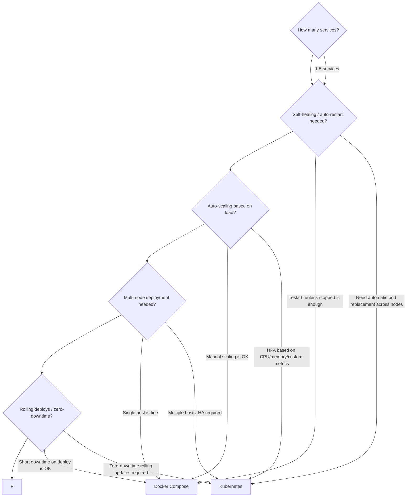

# Docker Compose — Multi-Container Apps

<!-- sdlc-stage:start -->
<div class="sdlc-stage">

📍 **SDLC stage: Deployment — packaging** · ShopNorth uses this in [Chapter 10 · Containerizing with Docker](/tutorials/journey-10-docker)

</div>
<!-- sdlc-stage:end -->

> A complete, practical guide to Docker Compose — from the basics of defining multi-service stacks to production-grade patterns with health checks, resource limits, secrets, override files, and the honest comparison of when Compose is enough vs when you need Kubernetes.

---

## Table of Contents

1. [What Docker Compose Solves](#1-what-docker-compose-solves)
2. [Compose File Structure — The Complete Reference](#2-compose-file-structure)
3. [Services, Networks, and Volumes](#3-services-networks-volumes)
4. [The Full Stack: Spring Boot + PostgreSQL + Redis](#4-full-stack-example)
5. [Startup Order — depends_on and Health Checks](#5-startup-order)
6. [Environment Variables and .env Files](#6-environment-variables)
7. [Named Volumes vs Bind Mounts in Compose](#7-volumes-in-compose)
8. [Override Files — dev, staging, CI](#8-override-files)
9. [Resource Limits — CPU and Memory](#9-resource-limits)
10. [Secrets in Compose](#10-secrets)
11. [Scaling Services](#11-scaling-services)
12. [Core Commands — Full Reference](#12-core-commands)
13. [Logging and Debugging](#13-logging-debugging)
14. [Real-World Compose Architectures](#14-real-world-architectures)
15. [Compose vs Kubernetes — The Honest Comparison](#15-compose-vs-kubernetes)
16. [Industry Challenges and Solutions](#16-industry-challenges)
17. [Interview Questions — With Model Answers](#17-interview-questions)

---

## 1. What Docker Compose Solves

Running one container with `docker run` is manageable. Running a real application stack is not:

```bash
# Without Compose: starting a Spring Boot app with its dependencies

# Step 1: create network
docker network create myapp-net

# Step 2: create volumes
docker volume create pgdata
docker volume create redisdata

# Step 3: start postgres
docker run -d \
  --name postgres \
  --network myapp-net \
  -e POSTGRES_DB=myapp \
  -e POSTGRES_USER=admin \
  -e POSTGRES_PASSWORD=secret \
  -v pgdata:/var/lib/postgresql/data \
  --health-cmd="pg_isready -U admin -d myapp" \
  --health-interval=10s \
  --health-timeout=5s \
  --health-retries=5 \
  postgres:15

# Step 4: start redis
docker run -d \
  --name redis \
  --network myapp-net \
  -v redisdata:/data \
  redis:7-alpine

# Step 5: wait for postgres to be healthy (manual loop or sleep)
until docker inspect postgres --format='{{.State.Health.Status}}' | grep -q healthy; do
  sleep 2
done

# Step 6: start app
docker run -d \
  --name myapp \
  --network myapp-net \
  -e DB_URL=jdbc:postgresql://postgres:5432/myapp \
  -e DB_USERNAME=admin \
  -e DB_PASSWORD=secret \
  -e SPRING_REDIS_HOST=redis \
  -p 8080:8080 \
  myapp:1.0

# To stop everything:
docker stop myapp redis postgres
docker rm myapp redis postgres
docker network rm myapp-net
# (don't forget the volumes if you want to clean those too)
```

This is 12 steps. Compose collapses it into one file and two commands:

```bash
docker compose up -d      # start everything
docker compose down       # stop and clean up
```

The entire stack — services, networks, volumes, environment, health checks, startup order, port mappings — lives in one version-controlled `docker-compose.yml`.

---

## 2. Compose File Structure — The Complete Reference

```yaml
# docker-compose.yml

# Compose file format version
# v3.8 is current and widely supported
# Omitting 'version' uses the latest (Compose V2 default)
version: "3.8"

# ─── Services ────────────────────────────────────────────────────
# Each service = one container (or group of identical containers)
services:

  myapp:
    # Image to use (from registry)
    image: myapp:1.0

    # OR: build from Dockerfile
    build:
      context: .                    # build context (directory with Dockerfile)
      dockerfile: Dockerfile        # optional: default is 'Dockerfile'
      target: runtime               # optional: build a specific stage
      args:
        APP_VERSION: "1.0.0"        # build-time arguments
      cache_from:
        - myapp:cache               # use this image for cache

    # Container name (optional — defaults to <project>_<service>_<n>)
    container_name: myapp-prod

    # Port mappings: host_port:container_port
    ports:
      - "8080:8080"
      - "127.0.0.1:9090:9090"      # bind to loopback only (more secure)

    # Environment variables
    environment:
      - SPRING_PROFILES_ACTIVE=local
      - DB_URL=jdbc:postgresql://postgres:5432/myapp
    # OR as map:
    environment:
      SPRING_PROFILES_ACTIVE: local
      DB_URL: jdbc:postgresql://postgres:5432/myapp

    # Load env vars from a file
    env_file:
      - .env
      - .env.local

    # Volume mounts
    volumes:
      - ./config:/app/config:ro       # bind mount, read-only
      - app-logs:/app/logs            # named volume
      - /tmp:/tmp:rw                  # host path

    # Networks this service joins
    networks:
      - backend
      - frontend

    # Startup dependency ordering
    depends_on:
      postgres:
        condition: service_healthy   # wait until postgres health check passes
      redis:
        condition: service_started   # wait until redis container is running (not necessarily healthy)

    # Health check for this service
    healthcheck:
      test: ["CMD", "curl", "-f", "http://localhost:8080/actuator/health/readiness"]
      interval: 30s
      timeout: 10s
      start_period: 90s
      retries: 3

    # Restart policy
    restart: unless-stopped
    # Options: no | always | on-failure | on-failure:3 | unless-stopped

    # Resource limits (requires deploy section in swarm, or resources in v3)
    deploy:
      resources:
        limits:
          cpus: "1.0"
          memory: 512M
        reservations:
          cpus: "0.25"
          memory: 256M

    # Logging configuration
    logging:
      driver: json-file
      options:
        max-size: "50m"
        max-file: "5"

    # Override the default command
    command: ["java", "-jar", "app.jar", "--spring.profiles.active=dev"]

    # Override the entrypoint
    entrypoint: ["/docker-entrypoint.sh"]

    # Labels
    labels:
      com.example.version: "1.0.0"
      com.example.team: "backend"

    # Expose ports to linked services only (not to host)
    expose:
      - "8080"

    # DNS servers
    dns:
      - 8.8.8.8

    # Extra hosts (add to /etc/hosts)
    extra_hosts:
      - "host.docker.internal:host-gateway"

    # Run as specific user
    user: "1000:1000"

    # Working directory
    working_dir: /app

    # Read-only root filesystem
    read_only: true
    tmpfs:
      - /tmp:size=128m,mode=1777

# ─── Networks ────────────────────────────────────────────────────
networks:
  backend:
    driver: bridge              # default driver
  frontend:
    driver: bridge
  external-network:
    external: true              # use an existing network (not managed by this compose)
    name: shared-services-net

# ─── Volumes ─────────────────────────────────────────────────────
volumes:
  pgdata:                       # named volume, Docker-managed
    driver: local
  redisdata:
    driver: local
  app-logs:
    external: true              # pre-existing volume (not created by compose)
    name: my-existing-logs
```

---

## 3. Services, Networks, and Volumes

### Services

Each service in Compose represents one containerized process. Compose creates one container per service by default (scale with `--scale` or `deploy.replicas`).

Services in the same Compose project can reach each other by **service name** — Compose's internal DNS automatically resolves `postgres` to the postgres container's IP.

```yaml
services:
  app:
    image: myapp
    environment:
      - DB_HOST=postgres          # 'postgres' = service name = DNS name

  postgres:
    image: postgres:15
```

### Networks

By default, all services in a Compose file are placed on a single auto-created network named `<project>_default`. Services can reach each other by service name on this network.

Create separate networks for **network segmentation** — e.g., your app talks to the database on a backend network, but only the app is on the frontend network exposed to users:

```yaml
services:
  nginx:
    networks: [frontend, backend]
  app:
    networks: [backend]
  postgres:
    networks: [backend]          # postgres not reachable from frontend!

networks:
  frontend:
  backend:
```

### Volumes

```yaml
volumes:
  pgdata:        # Docker-managed, persists between 'docker compose down' and 'up'

services:
  postgres:
    volumes:
      - pgdata:/var/lib/postgresql/data
```

`docker compose down` does NOT remove named volumes. Add `-v` to also remove them:
```bash
docker compose down          # keeps volumes
docker compose down -v       # removes volumes (data loss!)
docker compose down --rmi all -v   # removes volumes + images
```

---

## 4. The Full Stack: Spring Boot + PostgreSQL + Redis

This is a complete, production-quality Compose file for a Spring Boot application with a PostgreSQL database and Redis cache.

```yaml
# docker-compose.yml
version: "3.8"

services:

  # ── PostgreSQL ────────────────────────────────────────────────
  postgres:
    image: postgres:15.6-alpine
    container_name: myapp-postgres
    environment:
      POSTGRES_DB: myapp
      POSTGRES_USER: ${DB_USERNAME:-appuser}
      POSTGRES_PASSWORD: ${DB_PASSWORD:?DB_PASSWORD is required}
    volumes:
      - pgdata:/var/lib/postgresql/data
      - ./db/init:/docker-entrypoint-initdb.d:ro    # init scripts run on first start
    networks:
      - backend
    healthcheck:
      test: ["CMD-SHELL", "pg_isready -U ${DB_USERNAME:-appuser} -d myapp"]
      interval: 10s
      timeout: 5s
      start_period: 30s
      retries: 5
    restart: unless-stopped
    logging:
      driver: json-file
      options:
        max-size: "20m"
        max-file: "3"

  # ── Redis ─────────────────────────────────────────────────────
  redis:
    image: redis:7.2-alpine
    container_name: myapp-redis
    command: redis-server --requirepass ${REDIS_PASSWORD:-} --maxmemory 256mb --maxmemory-policy allkeys-lru
    volumes:
      - redisdata:/data
    networks:
      - backend
    healthcheck:
      test: ["CMD", "redis-cli", "--no-auth-warning", "-a", "${REDIS_PASSWORD:-}", "ping"]
      interval: 10s
      timeout: 5s
      start_period: 10s
      retries: 3
    restart: unless-stopped
    logging:
      driver: json-file
      options:
        max-size: "10m"
        max-file: "3"

  # ── Spring Boot Application ───────────────────────────────────
  app:
    image: ${APP_IMAGE:-myapp:latest}
    # OR build from source:
    build:
      context: .
      dockerfile: Dockerfile
      target: runtime
    container_name: myapp-app
    depends_on:
      postgres:
        condition: service_healthy     # wait until DB is ready
      redis:
        condition: service_healthy
    environment:
      SPRING_PROFILES_ACTIVE: ${SPRING_PROFILES_ACTIVE:-local}
      # Database
      SPRING_DATASOURCE_URL: jdbc:postgresql://postgres:5432/myapp
      SPRING_DATASOURCE_USERNAME: ${DB_USERNAME:-appuser}
      SPRING_DATASOURCE_PASSWORD: ${DB_PASSWORD:?DB_PASSWORD is required}
      # Redis
      SPRING_DATA_REDIS_HOST: redis
      SPRING_DATA_REDIS_PORT: 6379
      SPRING_DATA_REDIS_PASSWORD: ${REDIS_PASSWORD:-}
      # JVM
      JAVA_TOOL_OPTIONS: >-
        -XX:MaxRAMPercentage=65.0
        -XX:MaxMetaspaceSize=96m
        -Xlog:gc*:stdout:time
    ports:
      - "${APP_PORT:-8080}:8080"
    networks:
      - backend
      - frontend
    volumes:
      - app-logs:/app/logs
      - /tmp:/tmp:rw                   # tmpfs for Spring temp files
    healthcheck:
      test: ["CMD", "curl", "-f", "http://localhost:8080/actuator/health/readiness"]
      interval: 30s
      timeout: 10s
      start_period: 120s
      retries: 3
    restart: unless-stopped
    deploy:
      resources:
        limits:
          memory: 512M
          cpus: "1.0"
        reservations:
          memory: 256M
          cpus: "0.25"
    logging:
      driver: json-file
      options:
        max-size: "50m"
        max-file: "5"

# ── Networks ──────────────────────────────────────────────────
networks:
  backend:
    driver: bridge
  frontend:
    driver: bridge

# ── Volumes ───────────────────────────────────────────────────
volumes:
  pgdata:
    driver: local
  redisdata:
    driver: local
  app-logs:
    driver: local
```

The corresponding `.env` file:

```bash
# .env — local development defaults
# NEVER commit production secrets to .env — use secrets manager

DB_USERNAME=appuser
DB_PASSWORD=localpassword123
REDIS_PASSWORD=
APP_PORT=8080
SPRING_PROFILES_ACTIVE=local

# Override image (for CI/CD deployments)
APP_IMAGE=myapp:latest
```

```bash
# Start everything
docker compose up -d

# Watch logs
docker compose logs -f app

# Check health status of all services
docker compose ps

# Stop (keeps volumes)
docker compose down
```

---

## 5. Startup Order — depends_on and Health Checks

### The Problem: Depends_on Without Conditions

A common mistake:

```yaml
# WRONG: this only ensures postgres STARTS before app, not that it's READY
services:
  app:
    depends_on:
      - postgres   # only waits for container to be "started", not "healthy"
  postgres:
    image: postgres:15
```

PostgreSQL takes 5–10 seconds to initialize its data directory. If your app starts and tries to connect immediately, it gets `Connection refused`. The container is "started" (Docker's definition) but postgres isn't accepting connections yet.

### The Right Way: depends_on with condition

```yaml
services:
  app:
    depends_on:
      postgres:
        condition: service_healthy   # waits until postgres healthcheck passes
      redis:
        condition: service_healthy

  postgres:
    image: postgres:15
    healthcheck:
      test: ["CMD-SHELL", "pg_isready -U appuser -d myapp"]
      interval: 10s
      timeout: 5s
      retries: 5
      start_period: 30s   # don't start checking until 30s in (give postgres time to init)
```

Condition options:

| Condition | Meaning |
|-----------|---------|
| `service_started` | Container is running (default, no health check required) |
| `service_healthy` | Container's healthcheck returns exit code 0 |
| `service_completed_successfully` | Container has exited with code 0 (for init jobs) |

### Database Init Scripts

PostgreSQL auto-runs SQL/shell scripts placed in `/docker-entrypoint-initdb.d/` on first start (when the data volume is empty):

```bash
# db/init/01-schema.sql
CREATE TABLE IF NOT EXISTS users (
    id BIGSERIAL PRIMARY KEY,
    email VARCHAR(255) UNIQUE NOT NULL,
    created_at TIMESTAMP DEFAULT NOW()
);

# db/init/02-seed-data.sql
INSERT INTO users (email) VALUES
    ('admin@example.com'),
    ('test@example.com')
ON CONFLICT DO NOTHING;
```

```yaml
postgres:
  volumes:
    - pgdata:/var/lib/postgresql/data
    - ./db/init:/docker-entrypoint-initdb.d:ro   # scripts run on empty volume
```

Scripts run in alphabetical order. Use numeric prefixes (01-, 02-) to control order.

---

## 6. Environment Variables and .env Files

### Variable Substitution in Compose

Compose reads variables from:
1. Shell environment (highest priority)
2. `.env` file in the same directory as `docker-compose.yml`
3. Default values in the Compose file

```yaml
services:
  app:
    environment:
      # ${VAR:-default}       → use VAR, or 'default' if unset/empty
      # ${VAR:?error message} → use VAR, or FAIL with message if unset/empty
      # ${VAR}                → use VAR, empty string if unset

      APP_ENV: ${APP_ENV:-local}
      DB_PASSWORD: ${DB_PASSWORD:?DB_PASSWORD must be set}
      DEBUG: ${DEBUG:-false}
```

```bash
# Override a variable for a specific run:
DB_PASSWORD=prod_secret docker compose up -d

# Override multiple variables:
export DB_PASSWORD=prod_secret
export REDIS_PASSWORD=redis_secret
docker compose up -d
```

### Multiple .env Files

```yaml
services:
  app:
    env_file:
      - .env              # base variables (committed)
      - .env.local        # local overrides (gitignored)
      - .env.${APP_ENV}   # environment-specific (e.g., .env.production)
```

```
# .env (committed to git — non-sensitive defaults)
APP_PORT=8080
SPRING_PROFILES_ACTIVE=local
DB_USERNAME=appuser

# .env.local (gitignored — local developer secrets)
DB_PASSWORD=my-local-dev-password
REDIS_PASSWORD=

# .env.production (gitignored or in secrets manager — never commit)
DB_PASSWORD=super-secure-prod-password
```

### Printing Effective Configuration

```bash
# Show the resolved config (with variables substituted)
docker compose config

# Show environment variables that would be set for a service
docker compose run --rm app env
```

---

## 7. Volumes in Compose — Named vs Bind Mount

### Named Volumes (For Persistent State)

```yaml
volumes:
  pgdata:        # declare at top level
  redisdata:

services:
  postgres:
    volumes:
      - pgdata:/var/lib/postgresql/data    # name:container_path
```

Named volumes:
- Docker manages storage location (`/var/lib/docker/volumes/<project>_pgdata/_data`)
- Persist through `docker compose down` (NOT `docker compose down -v`)
- Portable — work identically on any Docker host
- Can be backed up via `docker run --rm -v pgdata:/source busybox tar ...`

### Bind Mounts (For Development Code Sync)

```yaml
services:
  app:
    volumes:
      - ./src:/app/src:rw           # sync source code (dev hot-reload)
      - ./config:/app/config:ro     # read-only config files
      - .:/app:rw                   # entire project root (use carefully)
```

Bind mounts:
- Direct reference to host filesystem
- Perfect for live development: edit code on host, app inside container sees it instantly
- Do NOT use for production (no portability)
- Performance can be slow on macOS/Windows (filesystem virtualization)

### Decision: Named Volume vs Bind Mount

| Need | Use |
|------|-----|
| Database data that must survive container restarts | Named volume |
| Uploaded files that must survive container restarts | Named volume |
| Source code sync for live dev reload | Bind mount |
| Config files loaded at startup | Bind mount (read-only) |
| Sensitive data in RAM, never on disk | tmpfs |

---

## 8. Override Files — Dev, CI, Production

Compose supports multiple compose files that are merged together. This lets you have a base file and environment-specific overrides.

### The Pattern

```
docker-compose.yml          ← base: service definitions, networks, volumes
docker-compose.override.yml ← auto-loaded: local dev overrides (gitignore this)
docker-compose.ci.yml       ← CI-specific: use pre-built images, no build
docker-compose.prod.yml     ← Production: resource limits, logging, real secrets
```

### Base File

```yaml
# docker-compose.yml — base (committed)
version: "3.8"

services:
  app:
    image: ${APP_IMAGE:-myapp:latest}
    networks: [backend]
    depends_on:
      postgres:
        condition: service_healthy

  postgres:
    image: postgres:15-alpine
    environment:
      POSTGRES_DB: myapp
      POSTGRES_USER: ${DB_USERNAME}
      POSTGRES_PASSWORD: ${DB_PASSWORD}
    volumes:
      - pgdata:/var/lib/postgresql/data
    networks: [backend]
    healthcheck:
      test: ["CMD-SHELL", "pg_isready -U ${DB_USERNAME} -d myapp"]
      interval: 10s
      timeout: 5s
      retries: 5

networks:
  backend:

volumes:
  pgdata:
```

### Developer Override

```yaml
# docker-compose.override.yml — auto-loaded, gitignored
version: "3.8"

services:
  app:
    build:
      context: .            # build from source in dev
    environment:
      SPRING_PROFILES_ACTIVE: local
      JAVA_TOOL_OPTIONS: "-XX:MaxRAMPercentage=65.0 -agentlib:jdwp=transport=dt_socket,server=y,suspend=n,address=*:5005"
    ports:
      - "8080:8080"
      - "5005:5005"       # remote debug port
    volumes:
      - ./src:/app/src     # live source sync

  postgres:
    ports:
      - "5432:5432"        # expose DB to host (for DB tools like DBeaver/DataGrip)
    environment:
      POSTGRES_PASSWORD: devpassword

  # Add pgAdmin only in local dev
  pgadmin:
    image: dpage/pgadmin4:latest
    environment:
      PGADMIN_DEFAULT_EMAIL: admin@example.com
      PGADMIN_DEFAULT_PASSWORD: admin
    ports:
      - "5050:80"
    networks: [backend]
    depends_on: [postgres]
```

```bash
# Local dev: base + override (auto-loaded)
docker compose up -d

# Explicit override:
docker compose -f docker-compose.yml -f docker-compose.override.yml up -d
```

### CI Pipeline Override

```yaml
# docker-compose.ci.yml — use pre-built images, no bind mounts, no debug ports
version: "3.8"

services:
  app:
    image: myapp:${GITHUB_SHA:-latest}   # use exact CI-built image
    build: null                          # don't build — use the image
    environment:
      SPRING_PROFILES_ACTIVE: test
    ports:
      - "8080:8080"

  postgres:
    environment:
      POSTGRES_PASSWORD: ci_test_password
```

```bash
# CI pipeline
docker compose -f docker-compose.yml -f docker-compose.ci.yml up -d --wait
# --wait: waits until all services are healthy before returning
```

### Production Compose

```yaml
# docker-compose.prod.yml
version: "3.8"

services:
  app:
    restart: always
    deploy:
      resources:
        limits:
          memory: 1G
          cpus: "2.0"
    logging:
      driver: awslogs                    # ship logs to CloudWatch
      options:
        awslogs-group: /myapp/production
        awslogs-region: us-east-1
        awslogs-stream-prefix: app

  postgres:
    restart: always
    deploy:
      resources:
        limits:
          memory: 2G

  # Add nginx reverse proxy for production
  nginx:
    image: nginx:1.25-alpine
    ports:
      - "80:80"
      - "443:443"
    volumes:
      - ./nginx/nginx.conf:/etc/nginx/nginx.conf:ro
      - ./certs:/etc/ssl/certs:ro
    networks: [backend, frontend]
    depends_on:
      app:
        condition: service_healthy
```

---

## 9. Resource Limits — CPU and Memory

Without resource limits, a misbehaving container can starve other containers on the same host.

```yaml
services:
  app:
    deploy:
      resources:
        limits:
          memory: 512M        # container OOM killed if exceeds this
          cpus: "1.0"         # can use at most 1 CPU core
        reservations:
          memory: 256M        # guaranteed minimum memory
          cpus: "0.25"        # guaranteed minimum CPU

  postgres:
    deploy:
      resources:
        limits:
          memory: 1G
          cpus: "2.0"
```

<div class="callout-warn">

**Compose V2 and resource limits**: In Compose V2 (standalone, not Swarm), `deploy.resources` are applied as container limits. In Compose V1 (legacy), `deploy` was Swarm-only. If using V2 (current default), `deploy.resources` works as expected for local Compose deployments.

</div>

### Verifying Resource Limits

```bash
# Live stats for all containers
docker compose stats

# Check limits via inspect
docker inspect myapp-app | python -m json.tool | grep -A 10 '"Memory"'
```

---

## 10. Secrets in Compose

### Docker Secrets (Compose with Swarm mode)

Docker secrets are encrypted, only accessible to services that explicitly need them, and never written to image layers or environment variables in plain text.

```yaml
# docker-compose.yml with Docker Secrets
version: "3.8"

services:
  app:
    image: myapp:latest
    secrets:
      - db_password              # mounts secret at /run/secrets/db_password
      - redis_password
    environment:
      # Spring Boot reads from file, not env var
      DB_PASSWORD_FILE: /run/secrets/db_password
      REDIS_PASSWORD_FILE: /run/secrets/redis_password

secrets:
  db_password:
    file: ./secrets/db_password.txt     # file on host, content = secret value
  redis_password:
    file: ./secrets/redis_password.txt
```

In Spring Boot, read the secret from the mounted file:

```java
@Configuration
public class SecretsConfig {

    @Value("${DB_PASSWORD_FILE:#{null}}")
    private String dbPasswordFile;

    @Bean
    public String dbPassword() throws IOException {
        if (dbPasswordFile != null) {
            // Read from Docker secret file
            return Files.readString(Path.of(dbPasswordFile)).trim();
        }
        // Fallback to env var for non-Docker deployments
        return System.getenv("DB_PASSWORD");
    }
}
```

Or use Spring Boot's file-based property support:

```yaml
# application.yml
spring:
  datasource:
    password: ${DB_PASSWORD:${DB_PASSWORD_FILE_CONTENT:}}
```

### For Local Dev (Simpler)

For local development, environment variables are fine — the concern is production secrets:

```bash
# .env.local (gitignored)
DB_PASSWORD=localdev123
REDIS_PASSWORD=
```

### Production Recommendation

For production, don't use Compose secrets files on disk. Use:
- AWS Secrets Manager + inject at container startup via entrypoint script
- HashiCorp Vault
- Kubernetes Secrets (if migrating to K8s)

```bash
# entrypoint.sh — fetch from AWS Secrets Manager
#!/bin/sh
export DB_PASSWORD=$(aws secretsmanager get-secret-value \
  --secret-id prod/myapp/db-password \
  --query SecretString \
  --output text)
exec "$@"
```

---

## 11. Scaling Services

### Scale Stateless Services

```bash
# Start 3 instances of the app
docker compose up -d --scale app=3

# Note: can't use container_name when scaling (name must be unique)
# Remove container_name from the service definition first
```

For scaled services you need a load balancer in front. Add nginx:

```yaml
services:
  nginx:
    image: nginx:1.25-alpine
    ports:
      - "80:80"
    volumes:
      - ./nginx.conf:/etc/nginx/nginx.conf:ro
    depends_on: [app]
    networks: [frontend]

  app:
    image: myapp:latest
    # No ports exposed directly to host when behind nginx
    expose:
      - "8080"
    networks: [frontend, backend]
    deploy:
      replicas: 3            # fixed replica count (used with 'docker compose up')
```

```nginx
# nginx.conf — round-robin load balancing
upstream app_backend {
    server app:8080;         # Docker DNS resolves 'app' to ALL container IPs
}

server {
    listen 80;
    location / {
        proxy_pass http://app_backend;
        proxy_set_header Host $host;
        proxy_set_header X-Real-IP $remote_addr;
    }
}
```

<div class="callout-tip">

**Docker DNS round-robin**: When you scale a service to 3 replicas, Docker's internal DNS returns all 3 IP addresses for the service name. nginx's upstream resolves `app` to all three and load-balances across them. This is simple and works well for small deployments.

</div>

---

## 12. Core Commands — Full Reference

```bash
# ── Starting and Stopping ──────────────────────────────────────

# Start all services (detached)
docker compose up -d

# Start and wait until all healthy
docker compose up -d --wait

# Start specific services only
docker compose up -d postgres redis

# Rebuild images before starting
docker compose up -d --build

# Force recreate containers (even if config hasn't changed)
docker compose up -d --force-recreate

# Stop services (keep containers and volumes)
docker compose stop

# Stop and remove containers, networks (keep volumes)
docker compose down

# Stop and remove everything including volumes
docker compose down -v

# Stop and remove everything including images and volumes
docker compose down -v --rmi all


# ── Building ───────────────────────────────────────────────────

# Build all services that have a 'build' section
docker compose build

# Build specific service
docker compose build app

# Build without cache
docker compose build --no-cache app

# Build and push to registry
docker compose push app


# ── Inspection ─────────────────────────────────────────────────

# Show running services with status and ports
docker compose ps

# Show all services (including stopped)
docker compose ps -a

# Show resource usage
docker compose stats

# Show running processes inside containers
docker compose top

# Validate compose file (check for syntax errors)
docker compose config

# Show effective config with variable substitution resolved
docker compose config --quiet && echo "Config is valid"


# ── Logs ──────────────────────────────────────────────────────

# Show logs for all services
docker compose logs

# Follow logs (tail -f)
docker compose logs -f

# Follow specific service
docker compose logs -f app

# Last 100 lines
docker compose logs --tail 100 app

# Logs with timestamps
docker compose logs -t app


# ── Executing Commands ────────────────────────────────────────

# Run a command in a RUNNING service container
docker compose exec app bash
docker compose exec app java -XX:+PrintFlagsFinal -version
docker compose exec postgres psql -U appuser -d myapp

# Run a NEW container (not the running one)
docker compose run --rm app java -jar app.jar --validate-config

# Run a one-off command and remove container
docker compose run --rm app mvn test


# ── Scaling ───────────────────────────────────────────────────

docker compose up -d --scale app=3
docker compose up -d --scale app=1    # scale back down


# ── Multiple Files ────────────────────────────────────────────

# Explicit file list (override is auto-loaded if no -f specified)
docker compose -f docker-compose.yml -f docker-compose.prod.yml up -d

# Use a different project name (default = directory name)
docker compose -p myproject up -d
```

---

## 13. Logging and Debugging

### Debugging Startup Failures

```bash
# Service won't start? Check logs immediately:
docker compose logs app

# Watch for health check status
watch docker compose ps

# Detailed event stream
docker compose events

# Get exit code of a failed service
docker compose ps -a
# Look for "Exit 1" or "Exit 137" in Status column
```

### Debugging Inside a Container

```bash
# Open shell in running container
docker compose exec app bash
docker compose exec app sh    # Alpine

# From inside, debug common issues:
# Can app reach postgres?
curl -v postgres:5432

# Is the environment correct?
env | sort

# Check open ports
ss -tlnp    # or netstat -tlnp

# Check disk space
df -h

# Check available memory
free -m

# Check Java flags
jcmd 1 VM.flags
```

### Remote Debugging Spring Boot

```yaml
# docker-compose.override.yml (dev only)
services:
  app:
    environment:
      JAVA_TOOL_OPTIONS: >-
        -agentlib:jdwp=transport=dt_socket,server=y,suspend=n,address=*:5005
    ports:
      - "5005:5005"    # expose debug port to host
```

Then connect IntelliJ IDEA / VS Code remote debugger to `localhost:5005`.

---

## 14. Real-World Compose Architectures

### Architecture 1: Full Backend Stack (Spring Boot + PostgreSQL + Redis + Kafka)

```yaml
version: "3.8"

services:

  zookeeper:
    image: confluentinc/cp-zookeeper:7.5.0
    environment:
      ZOOKEEPER_CLIENT_PORT: 2181
      ZOOKEEPER_TICK_TIME: 2000
    networks: [kafka-net]

  kafka:
    image: confluentinc/cp-kafka:7.5.0
    depends_on: [zookeeper]
    environment:
      KAFKA_BROKER_ID: 1
      KAFKA_ZOOKEEPER_CONNECT: zookeeper:2181
      KAFKA_ADVERTISED_LISTENERS: PLAINTEXT://kafka:9092
      KAFKA_OFFSETS_TOPIC_REPLICATION_FACTOR: 1
      KAFKA_AUTO_CREATE_TOPICS_ENABLE: "true"
    networks: [kafka-net, backend]
    healthcheck:
      test: ["CMD", "kafka-topics", "--bootstrap-server", "kafka:9092", "--list"]
      interval: 30s
      timeout: 10s
      retries: 5
      start_period: 30s

  postgres:
    image: postgres:15-alpine
    environment:
      POSTGRES_DB: myapp
      POSTGRES_USER: ${DB_USERNAME}
      POSTGRES_PASSWORD: ${DB_PASSWORD}
    volumes: [pgdata:/var/lib/postgresql/data]
    networks: [backend]
    healthcheck:
      test: ["CMD-SHELL", "pg_isready -U ${DB_USERNAME} -d myapp"]
      interval: 10s
      timeout: 5s
      retries: 5

  redis:
    image: redis:7-alpine
    command: redis-server --maxmemory 256mb --maxmemory-policy allkeys-lru
    volumes: [redisdata:/data]
    networks: [backend]
    healthcheck:
      test: ["CMD", "redis-cli", "ping"]
      interval: 10s
      timeout: 5s
      retries: 3

  app:
    build: .
    depends_on:
      postgres: { condition: service_healthy }
      redis: { condition: service_healthy }
      kafka: { condition: service_healthy }
    environment:
      SPRING_DATASOURCE_URL: jdbc:postgresql://postgres:5432/myapp
      SPRING_DATASOURCE_USERNAME: ${DB_USERNAME}
      SPRING_DATASOURCE_PASSWORD: ${DB_PASSWORD}
      SPRING_DATA_REDIS_HOST: redis
      SPRING_KAFKA_BOOTSTRAP_SERVERS: kafka:9092
      JAVA_TOOL_OPTIONS: "-XX:MaxRAMPercentage=65.0"
    ports: ["8080:8080"]
    networks: [backend]
    deploy:
      resources:
        limits: { memory: 512M, cpus: "1.0" }
    healthcheck:
      test: ["CMD", "curl", "-f", "http://localhost:8080/actuator/health/readiness"]
      interval: 30s
      timeout: 10s
      start_period: 120s
      retries: 3

networks:
  backend:
  kafka-net:

volumes:
  pgdata:
  redisdata:
```

### Architecture 2: Microservices Dev Environment

```yaml
version: "3.8"

# Infrastructure services shared by all microservices
services:
  postgres:
    image: postgres:15-alpine
    environment:
      POSTGRES_MULTIPLE_DATABASES: "users_db,orders_db,inventory_db"
      POSTGRES_USER: admin
      POSTGRES_PASSWORD: ${DB_PASSWORD}
    volumes:
      - pgdata:/var/lib/postgresql/data
      - ./db/create-multiple-databases.sh:/docker-entrypoint-initdb.d/create-multiple-databases.sh
    networks: [services-net]
    healthcheck:
      test: ["CMD-SHELL", "pg_isready -U admin"]
      interval: 10s
      retries: 5

  kafka:
    image: confluentinc/cp-kafka:7.5.0
    # ... (see above)
    networks: [services-net]

  # Users Microservice
  users-service:
    build: ./services/users
    environment:
      DB_URL: jdbc:postgresql://postgres:5432/users_db
      KAFKA_SERVERS: kafka:9092
    networks: [services-net]
    ports: ["8081:8080"]
    depends_on:
      postgres: { condition: service_healthy }

  # Orders Microservice
  orders-service:
    build: ./services/orders
    environment:
      DB_URL: jdbc:postgresql://postgres:5432/orders_db
      USERS_SERVICE_URL: http://users-service:8080
      KAFKA_SERVERS: kafka:9092
    networks: [services-net]
    ports: ["8082:8080"]
    depends_on:
      postgres: { condition: service_healthy }
      users-service:
        condition: service_healthy

  # API Gateway
  api-gateway:
    build: ./gateway
    ports: ["8080:8080"]
    environment:
      USERS_SERVICE_URL: http://users-service:8080
      ORDERS_SERVICE_URL: http://orders-service:8080
    networks: [services-net]
    depends_on:
      users-service: { condition: service_healthy }
      orders-service: { condition: service_healthy }

networks:
  services-net:

volumes:
  pgdata:
```

---

## 15. Compose vs Kubernetes — The Honest Comparison

Understanding when Compose is sufficient and when you genuinely need Kubernetes is a senior-level decision.



### Where Compose Wins

| Scenario | Why Compose |
|----------|-------------|
| Local development | Fast setup, everyone runs same stack |
| Small team, single server | Overkill to run K8s on one EC2 instance |
| Side projects / MVPs | Low complexity, low cost |
| CI/CD integration testing | Spin up full stack, run tests, tear down |
| Proof-of-concept deployments | Get something running fast |

### Where Kubernetes Wins

| Scenario | Why K8s |
|----------|---------|
| Production with > 3 nodes | Node scheduling, failure recovery |
| Horizontal autoscaling | HPA scales on CPU/memory metrics |
| Zero-downtime deployments | Rolling updates, canary, blue-green |
| Multi-tenant platforms | Namespaces, RBAC, network policies |
| Service mesh requirements | Istio, Linkerd for mTLS, observability |
| Stateful workloads at scale | StatefulSets with stable network identity |

### The Middle Ground: Docker Swarm

Docker Swarm is Docker's native orchestrator — more capable than plain Compose, simpler than Kubernetes. Compose files (with `deploy` sections) work directly with Swarm:

```bash
docker swarm init
docker stack deploy -c docker-compose.yml myapp

# K8s-like features Swarm gives you:
# ✅ Multi-node deployment
# ✅ Rolling updates
# ✅ Service auto-restart on failure
# ✅ Native Docker secrets
# ❌ No HPA, no Ingress controllers, limited ecosystem
```

Use Swarm for teams that want multi-node deployment without the Kubernetes learning curve.

---

## 16. Industry Challenges and Solutions

### Challenge 1: Services Start in Wrong Order Despite depends_on

**Problem**: App starts before database is ready for connections, even with `depends_on`.

**Root Cause**: `condition: service_started` (default) only checks that the container process started — not that the database inside is accepting connections.

```yaml
# Fix: use service_healthy + proper healthcheck
postgres:
  healthcheck:
    test: ["CMD-SHELL", "pg_isready -U ${DB_USERNAME} -d ${POSTGRES_DB}"]
    interval: 5s
    timeout: 5s
    start_period: 30s    # IMPORTANT: give postgres time to init data directory
    retries: 10

app:
  depends_on:
    postgres:
      condition: service_healthy
```

Also configure Spring Boot's Hikari to retry on startup:
```yaml
spring:
  datasource:
    hikari:
      initialization-fail-timeout: -1   # retry forever until container limit
```

### Challenge 2: docker compose up Takes Too Long (Slow Image Pulls)

**Problem**: First-time setup or CI environments pull multi-hundred-MB images on every run.

**Solutions**:
```bash
# 1. Pre-pull images in CI setup step
docker compose pull

# 2. Use Docker layer caching in CI (GitHub Actions example)
- uses: docker/build-push-action@v5
  with:
    cache-from: type=gha
    cache-to: type=gha,mode=max

# 3. Private registry mirror on your CI infrastructure
# Configure daemon.json:
{
  "registry-mirrors": ["https://your-internal-mirror.example.com"]
}

# 4. Keep base images pinned — if tag doesn't change, Docker uses local cache
FROM postgres:15.6-alpine   # specific patch version → stable cache
```

### Challenge 3: Database Migrations Fail or Run Multiple Times

**Problem**: Liquibase or Flyway migration runs on app startup, but if you scale to 3 app instances, all 3 try to migrate simultaneously — conflicts and failures.

**Solutions**:
```yaml
# Option 1: Run migration as a one-off init container before app starts
services:
  db-migrate:
    image: myapp:latest
    command: ["java", "-jar", "app.jar", "--spring.flyway.migrate-on-startup=true", "--server.port=0"]
    environment:
      # same DB vars as app
    depends_on:
      postgres: { condition: service_healthy }
    # This service exits after migration
    # restart: "no"   ← don't restart it

  app:
    depends_on:
      db-migrate:
        condition: service_completed_successfully  # wait until migration is done

# Option 2: Use Flyway/Liquibase's built-in distributed lock (recommended)
# Flyway 7+ uses a lock table — only one migration runs even with multiple instances
spring:
  flyway:
    table: flyway_schema_history   # default lock table
```

### Challenge 4: Port Conflicts When Running Multiple Projects

**Problem**: Two Compose projects both expose port 5432 → conflict on developer's machine.

**Solution**: Don't expose infrastructure ports to host unless you need them. Use Compose-internal networking:

```yaml
services:
  postgres:
    image: postgres:15
    # No 'ports' section — only accessible from within Compose network
    # expose: ["5432"]   ← documents port without publishing to host
    networks: [backend]

  app:
    environment:
      DB_URL: jdbc:postgresql://postgres:5432/myapp  # intra-Compose DNS
    ports:
      - "8080:8080"    # only expose app to host
    networks: [backend]
```

When you need DB access from your IDE, expose temporarily:
```bash
# Temporary: expose postgres to host on non-default port
docker compose exec postgres psql -U appuser -d myapp  # use exec instead
# OR
docker run --rm -it --network myapp_backend postgres:15 psql -h postgres -U appuser -d myapp
```

### Challenge 5: Compose Environment Variables Leaking Into Child Services

**Problem**: Shell environment variables from the host bleed into Compose services unexpectedly.

```bash
# You have DB_PASSWORD set in your shell for a different project
export DB_PASSWORD=wrong_password

# Compose picks this up and uses it instead of .env
docker compose up  # uses wrong_password!
```

**Fix**: Always use `.env` files and `env_file` rather than relying on shell environment:

```bash
# Force use .env file, ignore shell environment (CI/CD pattern)
docker compose --env-file .env.production up -d
```

Or prefix Compose variable names to avoid collision:
```yaml
services:
  app:
    environment:
      SPRING_DATASOURCE_PASSWORD: ${MYAPP_DB_PASSWORD:?Required}
# Use MYAPP_ prefix → less likely to conflict with shell
```

---

<!-- practice-pack -->

## 🏢 Real-World Scenarios

<div class="callout-scenario">

**Scenario**: New developers at a fintech take two days to get the system running locally: install PostgreSQL 15 (not 16), Redis, Kafka, a mock payment provider, and seed data, following a wiki page that's 8 months out of date. **Decision**: A Compose file in the repository becomes the executable onboarding document: `docker compose up` starts every dependency at the right versions, health checks gate startup order, an init container runs migrations and seeds data, and profiles (`--profile kafka`) keep optional pieces off by default. Onboarding drops to under an hour, and CI uses the same file for integration tests.

</div>

<div class="callout-scenario">

**Scenario**: A small company runs production on a single VM with Docker Compose. One night, the disk fills with container logs (json-file driver, no rotation), PostgreSQL can't write, and the site goes down. **Decision**: Compose can serve small production setups, but you must add what an orchestrator would otherwise provide: log rotation (`logging: options: max-size: "10m", max-file: "5"`), `restart: unless-stopped`, resource limits, health checks, disk and container monitoring with alerts, off-host database backups, and a documented deploy and rollback procedure. Know the ceiling: no multi-host failover, so the VM is a single point of failure.

</div>

## 🏋️ Practice Assignments

### 🟢 Low — Build the reflexes

**L1.** What's wrong with this snippet?

```yaml
services:
  app:
    image: myapp:1.4
    depends_on: [db]
    environment:
      SPRING_DATASOURCE_URL: jdbc:postgresql://localhost:5432/app
  db:
    image: postgres:16
```

<details>
<summary>Show answer</summary>

(1) `localhost` inside the `app` container is the app itself — use the service name: `jdbc:postgresql://db:5432/app`. (2) `depends_on` without a condition only waits for the container to *start*, not for PostgreSQL to accept connections — add a `healthcheck` to `db` (`pg_isready`) and `depends_on: db: condition: service_healthy`. (3) No volume for PostgreSQL data — `docker compose down` followed by `up` with a new container loses data (use a named volume on `/var/lib/postgresql/data`). (4) No `POSTGRES_PASSWORD` — the postgres image won't start without it (or an explicit trust setting).

</details>

**L2.** What's the difference between `docker compose down`, `down -v`, and `stop`?

<details>
<summary>Show answer</summary>

`stop` stops containers but keeps them (restart with `start`). `down` stops and removes containers and the default network, keeping named volumes (data survives). `down -v` also removes named volumes — your database data is gone. Treat `-v` as a destructive reset.

</details>

**L3.** How does Compose pick up variables from a `.env` file, and what should never go in it if it's committed?

<details>
<summary>Show answer</summary>

Compose reads `.env` in the project directory for variable substitution in the YAML (`${POSTGRES_VERSION}`), and `env_file:` passes variables into containers. Committed `.env` files should hold only non-secret defaults (versions, ports); real secrets go in an uncommitted `.env.local`, a secrets manager, or Compose `secrets:` — with `.env*` patterns in `.gitignore` except a checked-in `.env.example`.

</details>

### 🟡 Medium — Apply it

**M1.** Structure Compose files for dev (hot reload, debug port), CI (ephemeral, no volumes), and a demo environment.

<details>
<summary>Show answer</summary>

`compose.yaml` holds the shared base (services, networks, images). `compose.override.yaml` (auto-loaded locally) adds dev-only settings: bind-mounted source, debug ports (`5005`), dev profiles. `compose.ci.yaml` removes persistent volumes, adds test containers, and is used with `docker compose -f compose.yaml -f compose.ci.yaml up --abort-on-container-exit`. `compose.demo.yaml` pins image tags and adds seed data. Profiles cover optional services within any of them.

</details>

**M2.** Run database migrations reliably before the app starts.

<details>
<summary>Show answer</summary>

Add a one-shot `migrate` service (Flyway/Liquibase image or the app with a migration-only profile) that depends on `db: condition: service_healthy`, and make the app depend on `migrate: condition: service_completed_successfully`. Migrations then run once per `up`, failures stop the stack with a clear error, and multiple app replicas don't race to migrate.

</details>

**M3.** You run `docker compose up --scale worker=4` but get a port conflict. Why, and how do you fix it?

<details>
<summary>Show answer</summary>

The worker service publishes a fixed host port (`"8081:8081"`); only one container can bind it. Workers usually don't need published ports — remove `ports:` (other services reach them over the Compose network), or publish a range or let Docker assign random host ports (`"8081"`). For HTTP services that need load balancing, put a reverse proxy (NGINX/Traefik) in front and let it reach replicas through the service name.

</details>

### 🔴 High — Think like a senior

**H1.** When should a team move from Compose to Kubernetes, and what's a reasonable middle ground?

<details>
<summary>Show answer</summary>

Move when you need multi-host scheduling and failover, rolling deployments with automatic rollback, autoscaling, many services and teams with self-service deployment, or a cloud-native ecosystem (operators, service mesh) — and you have people to run it. Middle grounds: managed container services (ECS/Fargate, Cloud Run, Azure Container Apps) that accept container definitions without cluster management; Docker Swarm (Compose-compatible, simpler, but a smaller ecosystem). Keep Compose for local development regardless — most Kubernetes teams still use it on laptops.

</details>

**H2.** Design a Compose-based integration test environment that runs in CI in under 3 minutes.

<details>
<summary>Show answer</summary>

Use prebuilt, cached images (build the app image once per pipeline, pull dependencies from a registry mirror); tmpfs for database data (`tmpfs: /var/lib/postgresql/data`) for speed; health checks with short intervals so tests start as soon as dependencies are ready; seed data via SQL scripts mounted into `docker-entrypoint-initdb.d`; run tests in a container on the same network (`--exit-code-from tests`); collect logs as artifacts on failure; always `down -v` at the end. Alternatively, Testcontainers manages the same lifecycle from test code, which is often simpler for JVM projects.

</details>

## 🛠️ Mini Project — One-Command Local Platform

**Goal**: A Compose setup a new teammate can run in minutes. 2 evenings.

**Build**

1. `compose.yaml` for a Spring Boot API + PostgreSQL + Redis + Kafka (KRaft mode, behind a profile) + a React dev server, with health checks, named volumes, and a user-defined network.
2. A `migrate` one-shot service (Flyway) and a `seed` service; the app waits on both with `service_completed_successfully`.
3. `compose.override.yaml` for hot reload and the Java debug port; `compose.ci.yaml` for tmpfs databases and a test runner service.
4. Log rotation and resource limits on every service; `.env.example` with documented variables.
5. A `Makefile` or script: `make up`, `make test`, `make reset`.
6. Time a fresh clone → working app on a clean machine.

**Acceptance criteria**: fresh clone to running app in under 10 minutes with one command; CI integration tests pass with the same file; README with the architecture diagram.

---

## 🎯 Interview Corner

<div class="callout-interview">

**Q: "What does docker compose depend_on do, and what is its limitation?"**

depends_on controls the startup ORDER of containers — it ensures that a dependent container is started before the service that depends on it. The key limitation is the word 'started'. By default it only waits until the dependent container's process is running, not until the service inside is actually ready. For example, postgres:15 starts the container process immediately but takes 5–10 seconds to initialize its data directory before accepting connections. If my app container starts during that window and tries to connect, it fails. The fix is to use condition: service_healthy combined with a healthcheck definition on the dependency. This way Compose waits until the healthcheck passes (e.g., pg_isready returns exit 0) before starting the dependent service. I also configure Spring's HikariCP with initialization-fail-timeout=-1 as a second layer of defense, so the connection pool retries indefinitely during startup even if there's a brief window where the DB isn't ready.

</div>

<div class="callout-interview">

**Q: "What is the difference between environment and env_file in Compose?"**

Both inject environment variables into containers. environment inline in the Compose file is for a small number of non-sensitive variables — things like SPRING_PROFILES_ACTIVE or SERVER_PORT. env_file points to a file on disk containing key=value pairs, which is better for larger sets of variables or variables you don't want to hardcode in the Compose file. env_file is also good for having different files per environment — .env for defaults, .env.local for developer overrides, .env.production for production values. A critical security point: never commit .env files with production secrets to git. I use .env in version control for non-sensitive defaults with clear documentation that real secrets go in .env.local (gitignored) or come from secrets managers in production. Docker Compose also reads the .env file in the project directory automatically for variable substitution in the compose file itself, which is different from env_file in the service definition — that's a common source of confusion.

</div>

<div class="callout-interview">

**Q: "How do you ensure a Compose service doesn't start until its database is truly ready?"**

Three things working together. First, define a proper healthcheck on the postgres service using pg_isready — this is a PostgreSQL utility that checks if the server is ready to accept connections, not just if the process is running. Second, set condition: service_healthy in the depends_on of the app service. Third, set start_period in the healthcheck to give PostgreSQL time to initialize its data directory on first boot — if start_period is too short, the healthcheck fails before postgres even finishes setting up, and Compose marks it as unhealthy, which blocks dependent services. Even with this, there's a small timing window, so I also configure Hikari's initialization-fail-timeout=-1 in Spring so the connection pool keeps retrying. Defense in depth: orchestrator-level ordering plus application-level resilience.

</div>

<div class="callout-interview">

**Q: "When would you use a bind mount vs a named volume in Compose?"**

They serve different purposes. Named volumes are managed by Docker — I use them for data that needs to survive container restarts and potentially be backed up: PostgreSQL data directory, Redis AOF file, uploaded files. The path on the host doesn't matter; Docker manages it. Named volumes persist through docker compose down but are removed with docker compose down -v. Bind mounts reference a specific host directory — I use them for development workflows: mounting my source code directory so the container sees live code changes without rebuilding. I also mount config files as read-only bind mounts when I need environment-specific config. In production I use named volumes only — no bind mounts. Bind mounts have path dependencies on the host, which breaks portability, and can have performance issues on macOS/Windows due to filesystem virtualization.

</div>

<div class="callout-interview">

**Q: "How do you structure Compose files for multiple environments?"**

I use Docker Compose's merge capability. There's a base docker-compose.yml that defines the service skeleton — which services exist, their images, networks, volumes, and health checks. Then environment-specific override files. docker-compose.override.yml is auto-loaded in development — it adds build directives, exposes infrastructure ports to the host, adds a remote debug port, mounts source code as bind mounts. For CI there's a docker-compose.ci.yml that disables builds (uses pre-built images from the registry), sets CI-specific environment variables, and has tighter health check timeouts. For production there's a docker-compose.prod.yml with resource limits, production logging drivers (ship to CloudWatch), restart policies, and no bind mounts. This structure means the base file is a single source of truth for service topology, and environment differences are additive and explicit.

</div>

<div class="callout-interview">

**Q: "Compose vs Kubernetes — how do you decide?"**

I ask five questions. Does this need to run on multiple nodes? If yes, Kubernetes. Does it need automatic scaling based on load metrics? If yes, Kubernetes. Does it need zero-downtime rolling deployments? If yes, Kubernetes — Compose down/up has a brief gap. Does it need a service mesh (mTLS between services, distributed tracing, circuit breaking)? Kubernetes with Istio or Linkerd. Is this a production system serving external users with SLA requirements? Probably Kubernetes. If the answer to most of those is no — small team, single server, internal tooling, development environment, or a simple three-tier app where brief deploy downtime is acceptable — Compose is the right call. It's simpler to operate, requires no cluster to manage, and Docker Compose files are significantly easier to read and debug than Kubernetes manifests. I've seen teams adopt Kubernetes prematurely and spend months on cluster operations instead of building product. Compose on a single EC2 instance can handle thousands of requests per second.

</div>

<div class="callout-interview">

**🎯 The Compose knowledge that signals production experience:**

1. **depends_on with condition: service_healthy** — the candidate knows naive depends_on is insufficient
2. **Override files for multi-environment** — shows they've worked on real teams with dev/staging/prod
3. **Named volumes vs bind mounts** — shows they understand data persistence and portability
4. **Resource limits** — shows they've seen containers starve each other or OOM in production
5. **The Compose vs K8s answer** — the honest answer with real trade-offs shows architectural maturity

Anyone can write a simple compose file. These five topics separate people who've run Compose in production from those who've only used it for demos.

</div>

---

## Your Practice Checklist

- [ ] Write the full stack Compose file (Spring Boot + PostgreSQL + Redis) from scratch
- [ ] Break the healthcheck on postgres and observe what happens to the app startup — then fix it
- [ ] Create a base + dev override file pair and verify they merge correctly with `docker compose config`
- [ ] Scale the app to 3 instances, add nginx, verify load balancing works
- [ ] Test that named volume data survives `docker compose down` and `docker compose up`
- [ ] Add resource limits and use `docker compose stats` to verify they're applied
- [ ] Simulate a slow database startup — can your app recover? Tune HikariCP retry settings.
- [ ] Set up remote debugging with JVM debug port exposed through Compose

---

## Related Topics

- `docker-fundamentals` — Images, containers, volumes, networking — the building blocks
- `docker-spring-boot` — Production-grade Spring Boot Dockerfiles
- `kafka-deep-dive` — Adding Kafka to your Compose stack
- `microservices-patterns` — How multi-container dev environments map to production microservice deployment

---

<!-- journey-link:start -->

<div class="callout-journey">

🛒 **ShopNorth Journey** — ShopNorth's whole stack — PostgreSQL, Redis, Kafka, a mail catcher, a payment sandbox — starts with one Compose command.

**Continue the story:** [Chapter 10 · Containerizing with Docker](/tutorials/journey-10-docker) · **New here?** [Start the journey](/tutorials/journey-start)

</div>

<!-- journey-link:end -->
