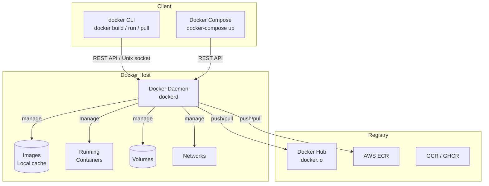
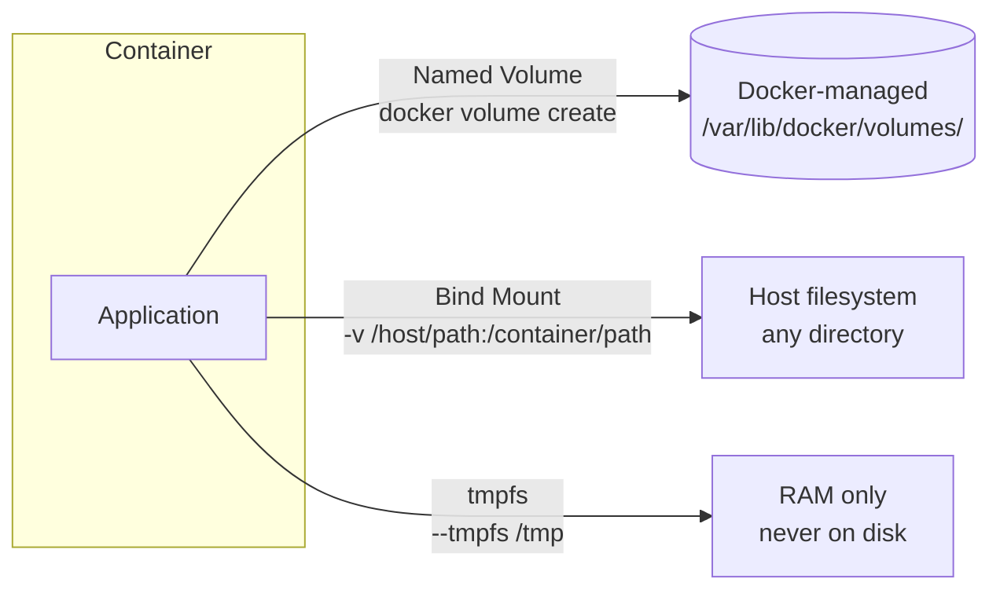
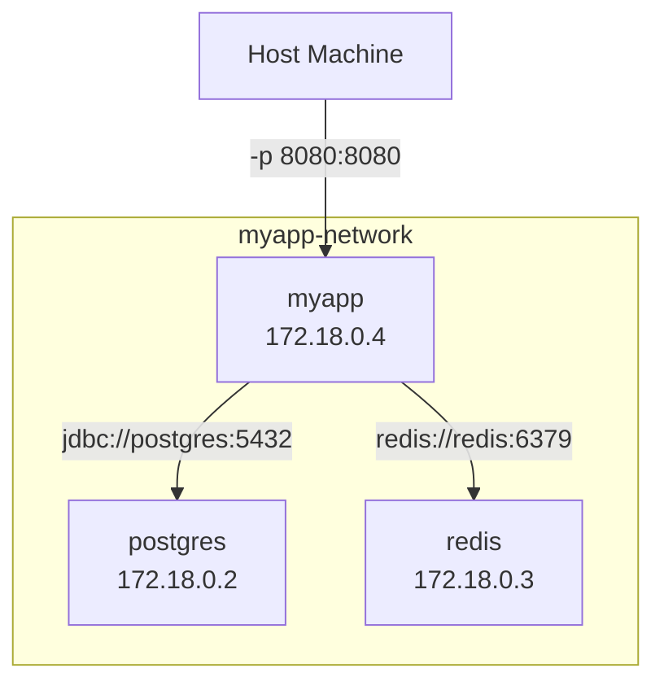

# Docker Fundamentals — Zero to Production Thinking

> A complete, ground-up guide to Docker. By the end you will understand how containers work internally, write production-quality Dockerfiles, manage data and networking, and confidently answer every Docker question asked at senior engineer interviews.

---

## Table of Contents

1. [The Problem Docker Solves](#1-the-problem-docker-solves)
2. [Container vs VM — The Real Difference](#2-container-vs-vm)
3. [Docker Architecture — How It All Fits](#3-docker-architecture)
4. [Images — The Blueprint](#4-images)
5. [The Image Layer System](#5-image-layer-system)
6. [Dockerfile — Every Instruction Explained](#6-dockerfile)
7. [Build Cache — How It Works and How to Exploit It](#7-build-cache)
8. [Volumes — Persistent Data](#8-volumes)
9. [Networking — How Containers Talk](#9-networking)
10. [Core Docker Commands — Full Reference](#10-core-commands)
11. [Docker Registry — Hub and Private Registries](#11-registry)
12. [Security Fundamentals](#12-security)
13. [Industry Challenges and How to Solve Them](#13-industry-challenges)
14. [Interview Questions — With Model Answers](#14-interview-questions)

---

## 1. The Problem Docker Solves

You've heard the phrase *"it works on my machine"*. Here is what that actually means:

```
Developer's machine:         Production server:
  Java 17                      Java 11
  PostgreSQL 15                PostgreSQL 13
  Redis 7.2                    Redis 6.0
  /tmp write permissions       /tmp read-only
  Ubuntu 22.04                 Amazon Linux 2
  Timezone: IST                Timezone: UTC
  JAVA_HOME=/usr/local/...     JAVA_HOME=/etc/alternatives/...

Result:
  → App works on dev machine
  → App crashes in production with cryptic errors
  → "But it worked on my machine!"
```

This is the **environment consistency problem**. Before Docker, solving it meant:
- VM images (VMware, VirtualBox) — gigabytes, minutes to start, wasteful on resources
- Configuration management (Chef, Ansible, Puppet) — describe how to set up an environment, but drift happens over time
- Manual runbooks — error-prone, "works if you follow 47 steps correctly"

**Docker's answer:** Package your application and *everything it needs to run* — OS libraries, runtime, config, dependencies — into a single portable unit called a **container image**. Run that same image on any machine that has Docker. Guaranteed identical environment.

```
What Docker ships:
┌─────────────────────────────────────────────────────┐
│  Your Application (JAR / executable / scripts)      │
│  Runtime (JDK 17 / Node 20 / Python 3.11)          │
│  OS libraries (glibc, openssl, etc.)                │
│  Filesystem layout (/app, /config, /tmp)            │
│  Environment variables                              │
│  Startup command                                    │
└─────────────────────────────────────────────────────┘
     ↕ Runs identically on ↕
  Dev laptop | CI server | Staging VM | Production K8s
```

---

## 2. Container vs VM

This is the most fundamental Docker concept and a guaranteed interview topic.

### Virtual Machines

A VM runs a full guest operating system on top of a hypervisor (VMware ESXi, KVM, VirtualBox). The hypervisor emulates hardware — virtual CPU, virtual RAM, virtual disk — and the guest OS thinks it's running on real hardware.

```
┌────────────────────────────────────────────┐
│              Physical Hardware             │
├────────────────────────────────────────────┤
│              Hypervisor (VMware/KVM)       │
├──────────────┬──────────────┬──────────────┤
│   VM 1       │   VM 2       │   VM 3       │
│  Guest OS    │  Guest OS    │  Guest OS    │
│  (Ubuntu)    │  (CentOS)    │  (Windows)   │
│  Libs        │  Libs        │  Libs        │
│  App A       │  App B       │  App C       │
└──────────────┴──────────────┴──────────────┘

Overhead per VM:
  Memory: 512MB–2GB just for the OS
  Disk: 10–40GB per VM
  Boot time: 30 seconds – 3 minutes
  Density: ~10-20 VMs per physical host
```

### Containers

Containers don't virtualize hardware. They share the host OS kernel and use Linux kernel features — **namespaces** and **cgroups** — to create isolated process environments.

```
┌────────────────────────────────────────────┐
│              Physical Hardware             │
├────────────────────────────────────────────┤
│              Host OS Kernel (Linux)        │
├──────────────┬──────────────┬──────────────┤
│ Container 1  │ Container 2  │ Container 3  │
│  Libs        │  Libs        │  Libs        │
│  App A       │  App B       │  App C       │
└──────────────┴──────────────┴──────────────┘

Overhead per container:
  Memory: Just what the app needs
  Disk: Only the layers not shared with other containers
  Start time: Milliseconds to 2 seconds
  Density: 100-1000 containers per physical host
```

### The Kernel Features That Make This Work

**Namespaces** — create isolated views of system resources:

| Namespace | What it isolates |
|-----------|-----------------|
| `pid` | Process IDs — container has its own PID 1, can't see host processes |
| `net` | Network interfaces, IP addresses, routing tables |
| `mnt` | Filesystem mounts — container has its own filesystem view |
| `uts` | Hostname and domain name |
| `ipc` | Inter-process communication (shared memory, semaphores) |
| `user` | User and group IDs (user namespace remapping) |

**cgroups (Control Groups)** — limit resource usage:

```
Container A: max 512MB RAM, max 0.5 CPU cores
Container B: max 2GB RAM, max 2 CPU cores
Container C: max 1GB RAM, max 1 CPU core

→ No container can starve another of resources
→ OOM killer operates per-container
```

### Side-by-Side Comparison

| Factor | VM | Container |
|--------|----|-----------|
| Isolation level | Full OS isolation | Process isolation (shared kernel) |
| Boot time | 30s – 3 min | Milliseconds |
| Memory overhead | 500MB–2GB per VM | ~MB per container |
| Disk size | 10–40 GB | 50MB–1GB |
| Performance | 5–15% overhead (hypervisor) | Near-native (~1% overhead) |
| Portability | VMware/KVM-specific | Runs anywhere with Docker |
| Security boundary | Stronger (full OS) | Weaker (shared kernel) |
| Use case | Different OS, legacy apps, strong isolation | Microservices, CI/CD, modern apps |

<div class="callout-tip">

**Interview precision**: When asked "how are containers lighter than VMs?", the exact answer is: containers don't include a guest OS kernel — they share the host kernel via Linux namespaces and cgroups. They only package the application + OS userland libraries needed to run it. This is fundamentally different from VMs which emulate full hardware.

</div>

<div class="callout-scenario">

**When to choose VM over container**: If you're running Windows workloads on a Linux host, need strong multi-tenant isolation (untrusted code), require different kernel versions per workload, or are running legacy apps that expect full OS semantics. Docker on Windows actually runs a lightweight Linux VM under the hood (via WSL2 or HyperV) to provide the Linux kernel that containers require.

</div>

---

## 3. Docker Architecture

Docker uses a client–server architecture.



**Docker Client (`docker` CLI)**: What you type commands into. Sends instructions to the daemon via REST API over a Unix socket (`/var/run/docker.sock`) or TCP.

**Docker Daemon (`dockerd`)**: The background service that does all the work — building images, starting containers, managing networks and volumes.

**Container Runtime**: The daemon uses `containerd` (and `runc` underneath) to actually create and run containers. This is the OCI (Open Container Initiative) layer — separates Docker's high-level API from the low-level runtime.

**Docker Registry**: Where images are stored remotely. Docker Hub (`docker.io`) is the default public registry. AWS ECR, Google GCR, and GitHub GHCR are common private/enterprise alternatives.

<div class="callout-tip">

**containerd vs Docker**: Kubernetes dropped Docker in favor of `containerd` directly in Kubernetes 1.24. This caused confusion — Docker images still work fine because they follow the OCI image spec. What Kubernetes removed was the Docker *daemon* as the runtime. Your Dockerfiles and images are unaffected.

</div>

---

## 4. Images

A Docker image is a **read-only template** — the blueprint for creating containers. An image contains:
- A filesystem snapshot (all the files your app needs)
- Metadata: default command to run, environment variables, exposed ports, labels

An image is **not** a running thing. It's like a class definition. A container is the running instance — like an object created from that class.

```
Image (read-only blueprint)          Container (running instance)
┌─────────────────────────┐          ┌─────────────────────────┐
│  ubuntu:22.04 layer     │          │  ubuntu:22.04 layer     │ (read-only)
│  JDK 17 layer           │  ─────►  │  JDK 17 layer           │ (read-only)
│  app.jar layer          │          │  app.jar layer          │ (read-only)
└─────────────────────────┘          │  Container Write Layer  │ ← writes go here
                                     └─────────────────────────┘
```

### Image Naming and Tagging

```
docker.io/library/ubuntu:22.04
│         │       │      │
│         │       │      └── Tag (version)
│         │       └── Image name
│         └── Namespace (library = official images)
└── Registry host

Shorthand:
  ubuntu:22.04         → docker.io/library/ubuntu:22.04
  nginx                → docker.io/library/nginx:latest
  mycompany/myapp:1.5  → docker.io/mycompany/myapp:1.5
  ghcr.io/org/app:sha  → GitHub Container Registry
```

**`latest` tag** — a common trap. `latest` is just a tag like any other. It doesn't automatically point to the newest version unless the image maintainer updates it. In production, always pin to a specific version:

```bash
# Bad — 'latest' changes, breaks reproducibility
FROM openjdk:latest

# Good — pinned version
FROM eclipse-temurin:17.0.11_9-jre-jammy
```

---

## 5. Image Layer System

This is Docker's most clever engineering decision. Images are built in **layers** — each Dockerfile instruction creates a new layer on top of the previous ones.

```
Image: my-spring-app:1.0
  ┌────────────────────────────────────────────┐  ← Layer 5: COPY app.jar (10MB)
  ├────────────────────────────────────────────┤  ← Layer 4: RUN adduser appuser (200KB)
  ├────────────────────────────────────────────┤  ← Layer 3: ENV JAVA_OPTS="-Xms512m" (0KB, metadata)
  ├────────────────────────────────────────────┤  ← Layer 2: RUN apt-get install curl (5MB)
  ├────────────────────────────────────────────┤  ← Layer 1: FROM eclipse-temurin:17-jre (200MB)
  └────────────────────────────────────────────┘

Total image size: ~215MB
Stored as 5 separate layers, each identified by SHA256 hash
```

### Why Layers Matter: Sharing and Caching

**Storage sharing**: If 10 images all start with `eclipse-temurin:17-jre`, Docker stores that base layer **once** on disk. The 10 images share it.

```
Disk usage without layers:     With layers (shared):
  app-v1: 215MB                  eclipse-temurin:17-jre: 200MB (shared)
  app-v2: 215MB                  app-v1 unique layers:     15MB
  app-v3: 215MB                  app-v2 unique layers:     15MB
  Total: 645MB                   app-v3 unique layers:     15MB
                                 Total: 245MB
```

**Pull optimization**: When you update your app and push a new image, only the changed layers are pushed/pulled. The base JDK layer (200MB) is already cached — only the 10MB app layer is transferred.

**Layer immutability**: Layers are content-addressed (SHA256 hash of content = layer ID). They're immutable — can never be changed, only replaced by creating a new layer on top.

### Union Filesystem (OverlayFS)

Docker uses OverlayFS (the Linux overlay filesystem driver) to present multiple read-only layers plus one writable layer as a single unified filesystem to the container:

```
Container view:  /app/application.jar    (reads from Layer 5)
                 /etc/passwd             (reads from Layer 1)
                 /tmp/upload.csv         (writes to Container Write Layer)

What actually happens with OverlayFS:
  Read /app/application.jar → find in Layer 5 → return it
  Read /etc/passwd → not in Layer 5, 4, 3, 2 → find in Layer 1 → return it
  Write /tmp/upload.csv → write to container's writable layer (copy-on-write)

When container is deleted: writable layer is destroyed. Read-only layers unchanged.
```

---

## 6. Dockerfile — Every Instruction Explained

A Dockerfile is a text file with instructions to build an image. Each instruction creates a new layer (or metadata entry).

### Complete Dockerfile Reference

```dockerfile
# ── FROM ──────────────────────────────────────────────────────────
# Base image. Must be the first instruction (after ARG).
# Always pin to a specific digest for reproducibility in production.
FROM eclipse-temurin:17.0.11_9-jre-jammy

# Multi-stage syntax: name this stage for reference later
FROM eclipse-temurin:17.0.11_9-jdk-jammy AS builder


# ── ARG ──────────────────────────────────────────────────────────
# Build-time variable. Not available at runtime (unlike ENV).
# Can be set with: docker build --build-arg APP_VERSION=1.5 .
ARG APP_VERSION=1.0.0
ARG JAR_FILE=target/app.jar


# ── ENV ──────────────────────────────────────────────────────────
# Environment variable. Available at both build time AND runtime.
# Persists in the image metadata — visible in docker inspect.
ENV JAVA_OPTS="-Xms256m -Xmx512m"
ENV APP_PORT=8080
ENV SPRING_PROFILES_ACTIVE=production


# ── WORKDIR ──────────────────────────────────────────────────────
# Sets the working directory for RUN, CMD, ENTRYPOINT, COPY, ADD.
# Creates the directory if it doesn't exist.
# Prefer over: RUN mkdir /app && cd /app (that's two layers + fragile)
WORKDIR /app


# ── COPY ─────────────────────────────────────────────────────────
# Copy files from build context (your machine) into the image.
# Syntax: COPY [--chown=user:group] <src> <dest>
COPY pom.xml .
COPY src ./src
COPY ${JAR_FILE} app.jar

# Copy from a named stage (multi-stage builds):
COPY --from=builder /app/target/app.jar app.jar

# --chown: set file ownership (avoids a separate RUN chown command = saves a layer)
COPY --chown=appuser:appgroup app.jar app.jar


# ── ADD ──────────────────────────────────────────────────────────
# Like COPY but with two superpowers:
#   1. Can fetch from URLs: ADD https://example.com/file.tar.gz /app/
#   2. Auto-extracts tar archives
# Recommendation: prefer COPY unless you need these features (COPY is explicit, ADD is magic)
ADD app.tar.gz /app/


# ── RUN ──────────────────────────────────────────────────────────
# Execute a command during BUILD time. Creates a new layer.
# Used for: installing packages, creating users, building code.

# Bad: three separate RUN = three layers, intermediate layers keep apt cache
RUN apt-get update
RUN apt-get install -y curl
RUN rm -rf /var/lib/apt/lists/*

# Good: chain with && — single layer, no cached package metadata in image
RUN apt-get update && \
    apt-get install -y --no-install-recommends curl && \
    rm -rf /var/lib/apt/lists/*

# Always clean up in the SAME RUN instruction
# (a separate RUN rm won't remove the cached files — they're in the previous layer)


# ── EXPOSE ───────────────────────────────────────────────────────
# Documents which port the container listens on.
# This is DOCUMENTATION ONLY — does not publish the port to the host.
# To actually publish: docker run -p 8080:8080
EXPOSE 8080


# ── USER ─────────────────────────────────────────────────────────
# Switch to a non-root user for all subsequent RUN, CMD, ENTRYPOINT.
# Critical for security — running as root in a container is dangerous.
RUN groupadd -r appgroup && useradd -r -g appgroup appuser
USER appuser


# ── VOLUME ───────────────────────────────────────────────────────
# Declares a mount point for external volumes.
# Creates an anonymous volume automatically if none is mounted.
# Prefer explicit volume mounts in docker run / compose over VOLUME instruction.
VOLUME ["/app/logs", "/app/data"]


# ── CMD ──────────────────────────────────────────────────────────
# Default command to run when container starts.
# Can be overridden at: docker run <image> <override_command>
# JSON array form (exec form) — preferred: no shell wrapping, signals work correctly
CMD ["java", "-jar", "app.jar"]

# Shell form (avoid): wraps in /bin/sh -c, so Java gets SIGTERM but not the process
# CMD java -jar app.jar


# ── ENTRYPOINT ───────────────────────────────────────────────────
# Like CMD, but cannot be overridden by docker run arguments.
# Arguments to docker run are APPENDED to ENTRYPOINT.
# Use when your container should always run a specific executable.
ENTRYPOINT ["java", "-jar", "app.jar"]

# Combined ENTRYPOINT + CMD pattern (best practice):
ENTRYPOINT ["java"]             # always runs java
CMD ["-jar", "app.jar"]         # default args — overridable
# docker run myapp -jar other.jar   ← overrides CMD portion only


# ── HEALTHCHECK ──────────────────────────────────────────────────
# Docker polls this command to determine if the container is healthy.
# Used by Docker Compose depends_on and Docker Swarm.
HEALTHCHECK --interval=30s --timeout=10s --start-period=60s --retries=3 \
    CMD curl -f http://localhost:8080/actuator/health || exit 1


# ── LABEL ────────────────────────────────────────────────────────
# Key-value metadata. Visible in docker inspect. Good for CI/CD traceability.
LABEL maintainer="team@example.com" \
      version="${APP_VERSION}" \
      git-commit="abc123def456"


# ── ONBUILD ──────────────────────────────────────────────────────
# Trigger: instruction runs when THIS image is used as a base image by another Dockerfile.
# Used for base image authors who want child images to do something automatically.
# Rarely needed in application Dockerfiles.
ONBUILD COPY . /app/src


# ── STOPSIGNAL ───────────────────────────────────────────────────
# The signal Docker sends to the container to stop it (default: SIGTERM).
# Change if your app handles a different signal for graceful shutdown.
STOPSIGNAL SIGTERM
```

### CMD vs ENTRYPOINT — The Definitive Explanation

```
Scenario: Container for a Java app

ENTRYPOINT ["java", "-jar"]
CMD ["app.jar"]

docker run myimage               → runs: java -jar app.jar
docker run myimage other.jar     → runs: java -jar other.jar   (CMD overridden)
docker run --entrypoint ls myimage /app  → runs: ls /app       (ENTRYPOINT overridden)

─────────────────────────────────────────────────────────────────

Scenario: Container that must always run one specific thing

ENTRYPOINT ["java", "-jar", "app.jar"]
# No CMD

docker run myimage               → runs: java -jar app.jar
docker run myimage --spring.profiles.active=dev
    → runs: java -jar app.jar --spring.profiles.active=dev   (args appended)

─────────────────────────────────────────────────────────────────

Scenario: CMD only (flexible, good for utility images)

CMD ["nginx", "-g", "daemon off;"]

docker run nginx                 → runs: nginx -g daemon off;
docker run nginx /bin/bash       → runs: /bin/bash   (CMD completely replaced)
```

<div class="callout-warn">

**Shell form vs exec form**: `CMD java -jar app.jar` uses shell form — Docker wraps it as `/bin/sh -c "java -jar app.jar"`. The shell (PID 1) gets SIGTERM. Java (PID 2) never receives the signal → your app can't shut down gracefully. Always use exec form: `CMD ["java", "-jar", "app.jar"]` — Java becomes PID 1 and gets SIGTERM directly.

</div>

---

## 7. Build Cache — How It Works and How to Exploit It

Understanding the build cache turns a 5-minute build into a 10-second build.

### Cache Invalidation Rules

Docker checks each instruction in order. As soon as one layer is invalidated, all subsequent layers are also invalidated (rebuilt from scratch).

A layer is invalidated when:
- The instruction itself changes (`RUN apt-get install curl` → `RUN apt-get install wget`)
- For `COPY`/`ADD`: any file in the source changes (Docker checksums all files)
- Parent layer was invalidated

### The Order Problem

```dockerfile
# BAD: copies source code before installing dependencies
COPY . .                         # Source changes on every commit → cache MISS
RUN mvn dependency:resolve       # Always re-downloads all dependencies (slow!)
RUN mvn package -DskipTests

# GOOD: copy dependency manifest first, then source
COPY pom.xml .                   # pom.xml rarely changes → cache HIT most of the time
RUN mvn dependency:resolve       # Only re-runs when pom.xml changes (fast!)
COPY src ./src                   # Source changes → only rebuilds from here
RUN mvn package -DskipTests
```

### Cache Impact in Practice

```
Scenario: you change one Java class and rebuild

BAD ordering:
  FROM (cache hit)           0.01s
  COPY . . (cache MISS)      0.5s
  RUN mvn resolve (MISS)     4m 30s  ← downloads 150MB of dependencies every time
  RUN mvn package (MISS)     45s
  Total: ~5m 15s

GOOD ordering:
  FROM (cache hit)           0.01s
  COPY pom.xml (cache hit)   0.01s
  RUN mvn resolve (HIT)      0.01s   ← already cached, skipped!
  COPY src (cache MISS)      0.1s
  RUN mvn package (MISS)     45s
  Total: ~46s
```

### Multi-Stage Builds — The Gold Standard

Multi-stage builds let you use a heavy build image to compile, then copy only the artifact into a lean runtime image:

```dockerfile
# ── Stage 1: Build ────────────────────────────────────────────────
FROM eclipse-temurin:17.0.11_9-jdk-jammy AS builder
WORKDIR /app

# Cache dependencies first
COPY pom.xml .
RUN mvn dependency:resolve -q

# Build
COPY src ./src
RUN mvn package -DskipTests -q

# ── Stage 2: Runtime ──────────────────────────────────────────────
FROM eclipse-temurin:17.0.11_9-jre-jammy
WORKDIR /app

# Only copy the artifact from build stage — nothing else
COPY --from=builder /app/target/app.jar app.jar

RUN groupadd -r appgroup && useradd -r -g appgroup appuser
USER appuser

EXPOSE 8080
CMD ["java", "-jar", "app.jar"]
```

```
Without multi-stage:       With multi-stage:
  JDK 17 + Maven: 600MB     JRE 17 only:    200MB
  Source code:    20MB       app.jar only:    20MB
  .class files:   15MB       Total:          220MB
  target/:        50MB
  Total:          685MB
                             ← 3x smaller, much less attack surface
```

---

## 8. Volumes — Persistent Data

By default, all writes inside a container go to its **writable layer** — which is destroyed when the container is removed. Volumes solve this.

### Three Types of Storage



### Named Volumes (Recommended for Production)

Docker manages the storage location. You reference volumes by name, not path.

```bash
# Create a named volume
docker volume create pgdata

# Use it when running a container
docker run -d \
  --name postgres \
  -v pgdata:/var/lib/postgresql/data \    # named_volume:container_path
  -e POSTGRES_PASSWORD=secret \
  postgres:15

# List volumes
docker volume ls

# Inspect: find out where data is actually stored on host
docker volume inspect pgdata
# → /var/lib/docker/volumes/pgdata/_data

# Remove volume (data destroyed!)
docker volume rm pgdata
```

Named volumes persist across container restarts and removals. If you `docker rm postgres` and later `docker run ... -v pgdata:/var/lib/postgresql/data`, the data is still there.

### Bind Mounts (Development — Live Code Reload)

Mount a specific host directory into the container. Changes on either side (host or container) are immediately visible to both.

```bash
docker run -d \
  --name myapp-dev \
  -v $(pwd)/src:/app/src \    # host_path:container_path
  -v $(pwd)/config:/app/config \
  -p 8080:8080 \
  myapp:dev

# Now: edit files in ./src on your host → container sees changes immediately
# Perfect for development hot-reload (Spring DevTools, Nodemon, etc.)
```

<div class="callout-warn">

**Bind mount performance on Docker Desktop (Mac/Windows)**: The host filesystem is on the Mac/Windows side, the Docker container is in a Linux VM. Every file access crosses the VM boundary — this is notoriously slow for heavy file I/O like a Maven build. Use named volumes for dependency caches, or use Dev Containers with WSL2 on Windows for better performance.

</div>

### tmpfs Mounts (Sensitive/Temporary Data)

Stored in host RAM only — never written to disk. Use for secrets, session data, or very high-speed temp files.

```bash
docker run --tmpfs /tmp:rw,noexec,nosuid,size=256m myapp
```

### Volume Backup and Restore

```bash
# Backup: run a utility container, tar the volume, pipe to host
docker run --rm \
  -v pgdata:/source:ro \
  -v $(pwd):/backup \
  busybox \
  tar czf /backup/pgdata-backup.tar.gz -C /source .

# Restore:
docker run --rm \
  -v pgdata:/target \
  -v $(pwd):/backup \
  busybox \
  tar xzf /backup/pgdata-backup.tar.gz -C /target
```

---

## 9. Networking — How Containers Talk

### Default Networks

Docker creates three networks on installation:

```bash
docker network ls
# NETWORK ID   NAME      DRIVER    SCOPE
# abc123       bridge    bridge    local   ← default for standalone containers
# def456       host      host      local   ← container shares host network
# ghi789       none      null      local   ← no network access
```

### Bridge Network (Default)

When you `docker run` without specifying a network, the container joins the default `bridge` network. Containers on the default bridge network can reach each other by IP address, but NOT by container name (no DNS resolution).

```
Default bridge network:
  Container A: 172.17.0.2
  Container B: 172.17.0.3
  Gateway:     172.17.0.1  (host)

Container A can ping 172.17.0.3 (works)
Container A cannot ping "container-b" (doesn't work — no DNS)
```

**Custom bridge networks** fix the DNS problem — containers can reach each other by container name:

```bash
# Create a custom network
docker network create myapp-network

# Run containers on that network
docker run -d --name postgres --network myapp-network postgres:15
docker run -d --name redis    --network myapp-network redis:7

# Now your app container can reach them by name:
docker run -d --name myapp --network myapp-network myapp:1.0
# Inside myapp: jdbc:postgresql://postgres:5432/mydb  ← "postgres" resolves!
#               redis://redis:6379                    ← "redis" resolves!
```



### Host Network

Container shares the host's network namespace — no port mapping needed, container listens directly on host ports. Higher performance (no NAT), but no isolation.

```bash
docker run --network host nginx
# Nginx listens on host's port 80 directly
# Cannot run two containers binding the same port in host mode
```

Use for: high-performance networking (gaming, high-frequency trading), legacy apps that expect specific network interfaces.

### Publishing Ports

```bash
# -p host_port:container_port
docker run -p 8080:8080 myapp          # map host:8080 → container:8080
docker run -p 9090:8080 myapp          # map host:9090 → container:8080
docker run -p 127.0.0.1:8080:8080 myapp  # bind only on loopback (more secure)
docker run -p 8080-8090:8080-8090 myapp  # map a range
docker run -P myapp                    # auto-map all EXPOSED ports to random host ports

# Inspect what ports are mapped:
docker port myapp
# 8080/tcp → 0.0.0.0:8080
```

### Container DNS

Docker's embedded DNS server (`127.0.0.11`) resolves container names within custom networks. It also provides service discovery for Docker Compose (service name = DNS name).

---

## 10. Core Docker Commands — Full Reference

### Images

```bash
# Pull an image from registry
docker pull eclipse-temurin:17-jre

# List local images
docker images
docker image ls

# Build an image from Dockerfile in current directory
docker build -t myapp:1.0 .
docker build -t myapp:1.0 -f docker/Dockerfile.prod .   # custom Dockerfile path
docker build --build-arg APP_VERSION=2.0 -t myapp:2.0 .

# Tag an image (create an alias)
docker tag myapp:1.0 registry.example.com/team/myapp:1.0

# Push to registry
docker push registry.example.com/team/myapp:1.0

# Remove an image
docker rmi myapp:1.0
docker image rm myapp:1.0

# Remove all dangling images (untagged, from failed/replaced builds)
docker image prune

# Show image history (all layers + sizes)
docker history myapp:1.0

# Inspect image metadata (full JSON)
docker image inspect myapp:1.0

# Save image to tar (for air-gapped environments)
docker save myapp:1.0 | gzip > myapp-1.0.tar.gz
docker load < myapp-1.0.tar.gz
```

### Containers

```bash
# Run a container
docker run myapp:1.0                                  # foreground, blocking
docker run -d myapp:1.0                               # detached (background)
docker run -d --name myapp-prod myapp:1.0             # with name
docker run -d -p 8080:8080 myapp:1.0                  # with port mapping
docker run -d -e SPRING_PROFILES_ACTIVE=prod myapp:1.0  # with env var
docker run -d --restart unless-stopped myapp:1.0      # auto-restart policy
docker run --rm myapp:1.0                             # auto-remove when exits
docker run -it ubuntu:22.04 bash                      # interactive terminal

# List containers
docker ps                    # running only
docker ps -a                 # all (including stopped)
docker ps --format "table {{.Names}}\t{{.Status}}\t{{.Ports}}"

# Stop / start / restart
docker stop myapp-prod       # sends SIGTERM, waits 10s, then SIGKILL
docker stop -t 30 myapp-prod # give 30s for graceful shutdown
docker start myapp-prod
docker restart myapp-prod

# Remove container
docker rm myapp-prod         # must be stopped first
docker rm -f myapp-prod      # force-removes even if running

# Execute a command in a RUNNING container
docker exec -it myapp-prod bash                    # interactive shell
docker exec myapp-prod cat /app/application.yml   # one-off command
docker exec -u root myapp-prod bash                # as root (debugging only)

# View logs
docker logs myapp-prod                   # all logs
docker logs -f myapp-prod               # follow (tail -f)
docker logs --tail 100 myapp-prod       # last 100 lines
docker logs --since 10m myapp-prod      # last 10 minutes
docker logs --timestamps myapp-prod     # with timestamps

# Inspect container (full JSON metadata)
docker inspect myapp-prod

# Resource usage stats (live)
docker stats
docker stats myapp-prod

# Copy files in/out of container
docker cp myapp-prod:/app/logs/app.log ./app.log
docker cp ./newconfig.yml myapp-prod:/app/config.yml

# View processes inside container
docker top myapp-prod
```

### System Cleanup

```bash
# Remove everything unused (containers, images, networks, build cache)
docker system prune           # stopped containers + dangling images + unused networks
docker system prune -a        # also removes unused images (not just dangling)
docker system prune --volumes # also removes unused volumes (CAREFUL — data loss!)

# Check disk usage
docker system df

# Prune specific resources
docker container prune   # remove all stopped containers
docker image prune -a    # remove all unused images
docker volume prune      # remove all unused volumes
docker network prune     # remove all unused networks
```

---

## 11. Docker Registry — Hub and Private Registries

### Docker Hub

```bash
# Login
docker login                    # prompts for username + password
docker login -u myuser          # specify username

# Search for images
docker search nginx

# Pull specific versions
docker pull nginx:1.25-alpine   # always prefer specific tag over 'latest'

# Rate limits (as of 2024):
#   Anonymous:          100 pulls / 6 hours
#   Free account:       200 pulls / 6 hours
#   Pro/Team/Business:  Unlimited
# → CI/CD pipelines must authenticate to avoid rate limits
```

### Private Registries

```bash
# AWS ECR
aws ecr get-login-password --region us-east-1 | \
  docker login --username AWS --password-stdin 123456789.dkr.ecr.us-east-1.amazonaws.com

docker tag myapp:1.0 123456789.dkr.ecr.us-east-1.amazonaws.com/myapp:1.0
docker push      123456789.dkr.ecr.us-east-1.amazonaws.com/myapp:1.0

# GitHub Container Registry (GHCR)
echo $GITHUB_TOKEN | docker login ghcr.io -u USERNAME --password-stdin
docker tag myapp:1.0 ghcr.io/myorg/myapp:1.0
docker push ghcr.io/myorg/myapp:1.0
```

### Image Digest — True Immutability

Tags are mutable (`:latest` can change). Digests are immutable (SHA256 of the image content):

```bash
docker pull nginx@sha256:abc123def456...
# This exact image never changes, even if :latest is updated
```

In production Kubernetes, always reference images by digest for true reproducibility.

---

## 12. Security Fundamentals

### 1. Never Run as Root

```dockerfile
# BAD: root user (default)
FROM eclipse-temurin:17-jre
COPY app.jar .
CMD ["java", "-jar", "app.jar"]   # runs as root!

# GOOD: non-root user
FROM eclipse-temurin:17-jre
RUN groupadd -r appgroup && \
    useradd -r -g appgroup -d /app -s /bin/false appuser
WORKDIR /app
COPY --chown=appuser:appgroup app.jar .
USER appuser
CMD ["java", "-jar", "app.jar"]
```

If an attacker exploits your app inside the container and it's running as root, they have root inside the container. With kernel exploits (privilege escalation), this can become root on the host. Non-root containment limits the blast radius.

### 2. Use Official / Minimal Base Images

```
Attack surface comparison:
  ubuntu:22.04       → 77 installed packages → 77+ potential vulnerabilities
  eclipse-temurin:17 → ~50 packages
  eclipse-temurin:17-jre-alpine → ~20 packages (Alpine Linux is minimal)
  distroless/java17  → Only JRE + app, no shell, no package manager → minimal surface

Recommendation order (smallest attack surface first):
  1. Google Distroless (gcr.io/distroless/java17-debian12)
  2. Alpine-based images (:17-alpine)
  3. Debian Slim images (:17-jre-slim)
  4. Full Debian/Ubuntu images (use as last resort)
```

### 3. Scan Images for Vulnerabilities

```bash
# Docker Scout (built into Docker Desktop)
docker scout cves myapp:1.0

# Trivy (open-source, excellent)
docker run --rm -v /var/run/docker.sock:/var/run/docker.sock \
  aquasec/trivy image myapp:1.0

# Snyk (free tier available)
snyk container test myapp:1.0
```

Integrate into CI/CD: fail the pipeline if HIGH or CRITICAL vulnerabilities are found.

### 4. Don't Store Secrets in Images

```dockerfile
# BAD: secret baked into image, visible in docker history
ENV DB_PASSWORD=supersecret123
RUN curl -H "Authorization: Bearer $API_KEY" https://api.example.com/data

# GOOD: pass secrets at runtime
docker run -e DB_PASSWORD=$DB_PASSWORD myapp:1.0

# BETTER: use Docker secrets or Kubernetes secrets
# (secrets are never written to the image layer or environment in plaintext)
```

### 5. Read-Only Filesystem

```bash
docker run --read-only \
  --tmpfs /tmp:rw,noexec,nosuid \
  --tmpfs /app/logs:rw \
  myapp:1.0

# Container filesystem is read-only → attacker can't write malware
# Only explicitly declared tmpfs paths are writable
```

---

## 13. Industry Challenges and How to Solve Them

### Challenge 1: Image Size Bloat

**Problem**: Teams copy entire project directories, use heavy base images, and end up with 2GB+ images that are slow to push, pull, and start.

**Solution Stack**:
```dockerfile
# 1. Multi-stage build (don't ship build tools)
FROM maven:3.9-eclipse-temurin-17 AS builder
WORKDIR /app
COPY pom.xml .
RUN mvn dependency:go-offline -q
COPY src ./src
RUN mvn package -DskipTests -q

# 2. Minimal runtime image
FROM eclipse-temurin:17.0.11_9-jre-jammy
# NOT eclipse-temurin:17-jdk — JDK is 3x larger, you only need JRE to run

# 3. No unnecessary files
COPY --from=builder /app/target/app.jar /app/app.jar
# NOT COPY --from=builder /app /app  ← copies everything including source!

# Result: 220MB vs 1.2GB
```

Also use `.dockerignore` to prevent large directories from being sent to the daemon:
```
# .dockerignore
.git
.gitignore
target/
*.log
*.md
.idea/
*.iml
node_modules/
```

### Challenge 2: Long Build Times in CI/CD

**Problem**: Every CI pipeline run rebuilds from scratch because the cache is not shared between ephemeral CI agents.

**Solutions**:
```yaml
# GitHub Actions: use registry cache
- name: Build and push
  uses: docker/build-push-action@v5
  with:
    context: .
    cache-from: type=registry,ref=ghcr.io/myorg/myapp:cache
    cache-to: type=registry,ref=ghcr.io/myorg/myapp:cache,mode=max
    tags: ghcr.io/myorg/myapp:${{ github.sha }}

# BuildKit inline cache (simpler, less optimal)
docker buildx build --cache-to type=inline --push -t myapp:latest .
```

Also: optimize Dockerfile layer order (copy dependency manifests before source code).

### Challenge 3: Container Exits Unexpectedly

**Problem**: Container stops with exit code 137 (OOM killed) or 1 (app crash), and it's hard to debug after the fact.

**Solutions**:
```bash
# 1. Check exit code
docker inspect myapp --format='{{.State.ExitCode}}'
# 137 = OOM killed, 1 = app error, 139 = segfault, 0 = clean exit

# 2. Check logs before exit (journald or file logging)
docker logs --tail 200 myapp

# 3. Set memory limits AND configure JVM memory within them
docker run -m 512m \                    # container memory limit
  -e JAVA_OPTS="-Xms128m -Xmx384m" \   # JVM heap within container limit
  myapp:1.0
  # Leave ~128MB for JVM overhead (metaspace, threads, off-heap)

# 4. Use --restart policy
docker run --restart unless-stopped myapp:1.0
# on-failure:5 = restart up to 5 times on non-zero exit
```

### Challenge 4: Containers Can't Reach Each Other

**Problem**: App container can't connect to database container.

**Diagnosis**:
```bash
# Check both are on same network
docker inspect myapp    | grep -A 20 Networks
docker inspect postgres | grep -A 20 Networks

# Test DNS resolution from inside the app container
docker exec myapp nslookup postgres
docker exec myapp ping postgres

# Test connection
docker exec myapp curl -v postgres:5432
```

**Fix**:
```bash
# Always use custom networks (default bridge has no DNS)
docker network create myapp-net
docker run -d --name postgres --network myapp-net postgres:15
docker run -d --name myapp    --network myapp-net myapp:1.0
# Now myapp can reach postgres:5432 by name
```

### Challenge 5: Data Loss on Container Restart

**Problem**: Database or uploaded files disappear when container restarts.

**Solution**: Always mount volumes for stateful data:
```bash
docker run -d \
  --name postgres \
  -v postgres-data:/var/lib/postgresql/data \   # named volume persists data
  postgres:15

# Verify data survives container restart:
docker restart postgres   # data still there
docker rm postgres
docker run -d --name postgres \
  -v postgres-data:/var/lib/postgresql/data \   # same volume name → same data
  postgres:15
```

### Challenge 6: Container Logs Filling Up Disk

**Problem**: Long-running containers accumulate hundreds of MB of logs in Docker's log driver.

**Solution**:
```bash
# Set log rotation per container
docker run \
  --log-opt max-size=50m \
  --log-opt max-file=5 \
  myapp:1.0
# Keeps 5 × 50MB = 250MB max per container

# Or configure globally in /etc/docker/daemon.json:
{
  "log-driver": "json-file",
  "log-opts": {
    "max-size": "50m",
    "max-file": "5"
  }
}
```

For production at scale: ship logs to a centralized system (ELK, Datadog, CloudWatch) rather than relying on Docker's local log driver.

---

<!-- practice-pack -->

## 🏢 More Real-World Scenarios

<div class="callout-scenario">

**Scenario**: A CI pipeline takes 14 minutes per build because every commit re-downloads all dependencies inside `docker build`. The Dockerfile copies the whole source tree first (`COPY . .`) and then runs the dependency install, so any file change invalidates the cache for every layer after it. **Decision**: Order instructions from least to most frequently changed: copy only the dependency manifests (`pom.xml`, `package.json` + lock file), install dependencies, *then* copy source. Add a `.dockerignore` (exclude `.git`, `target/`, `node_modules/`), and use BuildKit cache mounts (`RUN --mount=type=cache,target=/root/.m2 ...`) plus registry-backed build caches in CI. Builds drop to 2-3 minutes.

</div>

## 🏋️ Practice Assignments

### 🟢 Low — Build the reflexes

**L1.** What does each command do? (a) `docker run -d -p 8080:80 --name web nginx:1.27`, (b) `docker exec -it web sh`, (c) `docker logs -f --tail 100 web`, (d) `docker system df`.

<details>
<summary>Show answer</summary>

(a) Starts an NGINX 1.27 container in the background named `web`, mapping host port 8080 to container port 80. (b) Opens an interactive shell inside the running container. (c) Follows the container's logs, starting with the last 100 lines. (d) Shows disk usage by images, containers, volumes, and build cache (follow with `docker system prune` carefully).

</details>

**L2.** Why does this Dockerfile rebuild `npm install` on every code change, and how do you fix it?

```dockerfile
FROM node:22-alpine
WORKDIR /app
COPY . .
RUN npm ci
CMD ["node", "server.js"]
```

<details>
<summary>Show answer</summary>

`COPY . .` copies all source files; any change alters that layer and invalidates every later layer, including `npm ci`. Fix: `COPY package.json package-lock.json ./` → `RUN npm ci` → `COPY . .`. Dependencies are then cached until the lock file changes. Add `.dockerignore` with `node_modules` and `.git`.

</details>

**L3.** Named volume, bind mount, or tmpfs: (a) PostgreSQL data in local development, (b) live-reloading source code during development, (c) sensitive scratch files that must never touch disk?

<details>
<summary>Show answer</summary>

(a) Named volume (managed by Docker, survives container removal). (b) Bind mount of the source directory. (c) tmpfs mount (in memory only).

</details>

### 🟡 Medium — Apply it

**M1.** Two containers on the same host can't reach each other by name. Diagnose.

<details>
<summary>Show answer</summary>

Containers on the **default bridge** network don't get DNS-based name resolution; only user-defined networks do. Create a network (`docker network create app-net`) and run both containers with `--network app-net`, then use the container name as hostname. Also check the target listens on `0.0.0.0` (not `127.0.0.1` inside its container) and that you're using the container port, not the host-mapped port.

</details>

**M2.** Shrink a 1.2 GB Python image to under 200 MB.

<details>
<summary>Show answer</summary>

Use a slim base (`python:3.12-slim` instead of the full image), a multi-stage build (compile wheels in a builder stage with build tools, copy only the installed packages into the final stage), `pip install --no-cache-dir`, remove build dependencies, avoid copying tests/data via `.dockerignore`, and combine cleanup in the same `RUN` layer as installation (files deleted in a later layer still occupy space in earlier layers). Inspect with `docker history` or `dive`.

</details>

**M3.** Your container runs as root. Why is that a problem, and how do you fix it?

<details>
<summary>Show answer</summary>

If an attacker exploits the application, they're root inside the container, which makes container escapes via kernel or runtime vulnerabilities and misconfigurations (mounted Docker socket, privileged mode, writable host paths) far more dangerous. Fix: create a user in the Dockerfile (`RUN addgroup -S app && adduser -S app -G app` → `USER app`), make app files read-only for that user, run with `--read-only` root filesystem and `--cap-drop ALL` where possible, and never mount `/var/run/docker.sock` into application containers.

</details>

### 🔴 High — Think like a senior

**H1.** Design the container image supply chain for a company with 100 services.

<details>
<summary>Show answer</summary>

Approved, minimal base images (distroless/slim/Chainguard-like) maintained by a platform team and rebuilt on CVE fixes; Dockerfiles built in CI only (no laptop pushes to production registries); vulnerability scanning (Trivy/Grype) blocking critical issues; SBOM generation; image signing (Sigstore cosign) and verification at deploy time (admission policy in Kubernetes); immutable tags with digests (`image@sha256:...`) in deployment manifests; a private registry with retention policies; and automated base-image update PRs (Renovate/Dependabot).

</details>

**H2.** A container is killed with exit code 137 repeatedly in production. Investigate.

<details>
<summary>Show answer</summary>

137 = 128 + 9 (SIGKILL), most often the **OOM killer**: the process exceeded the container's memory limit. Check `docker inspect` (`OOMKilled: true`) or Kubernetes events, memory metrics leading up to the kill, and whether the runtime respects container limits (JVM: `-XX:MaxRAMPercentage`; Node: `--max-old-space-size`). Account for non-heap memory (threads, metaspace, buffers, native libraries). Fix the leak or tune memory, then set limits with headroom. If not OOM, something else sent SIGKILL (e.g., a failing liveness probe or `docker stop` timeout after SIGTERM was ignored).

</details>

## 🛠️ Mini Project — Optimize and Harden a Real Image

**Goal**: Apply every fundamentals lesson to one image with measurable results. 1-2 evenings.

**Build**

1. Start from a naive Dockerfile for any app you have (Node, Python, or Java): record image size, build time, cold and warm (cached) rebuild time, and Trivy vulnerability count.
2. Apply: `.dockerignore`, layer ordering, multi-stage build, slim or distroless base, BuildKit cache mounts, non-root user, `HEALTHCHECK`, pinned base image digest.
3. Run with `--read-only`, `--cap-drop ALL`, a memory limit, and a tmpfs for temp files; fix whatever breaks.
4. Create a user-defined network with a database container and connect by name.
5. Push to a registry (GitHub Container Registry) from GitHub Actions with build caching.

**Acceptance criteria**: a before/after table (size, build times, CVEs) in the README; the container runs as non-root with a read-only filesystem.

---

## 🎯 Interview Corner

<div class="callout-interview">

**Q: "What is the difference between a Docker image and a container?"**

An image is an immutable, read-only template — the blueprint. It contains a filesystem snapshot with all the files, libraries, and config your app needs, plus metadata like the startup command and exposed ports. A container is a running instance created from an image. When you start a container, Docker adds a thin writable layer on top of the read-only image layers — this is where the container writes files at runtime. Multiple containers can run from the same image simultaneously, each with their own independent writable layer. When the container is stopped and removed, the writable layer is gone. The image itself is unchanged. Think of it like a Java class (image) and object instances (containers).

</div>

<div class="callout-interview">

**Q: "How does Docker achieve isolation without a separate OS?"**

Docker uses two Linux kernel features. First, **namespaces** — each container gets its own isolated view of resources: its own process tree (PID namespace), network interfaces (net namespace), filesystem (mnt namespace), hostname (uts namespace), and user IDs (user namespace). A process in one container literally cannot see or interact with processes in another container. Second, **cgroups** (control groups) — they enforce resource quotas: how much CPU, RAM, and I/O each container can use. Together, namespaces give isolation, cgroups give resource control. The host kernel is shared but the isolation is strong enough for most use cases. It's not as strong as a VM (where the guest kernel is fully separate), but it's massively more efficient.

</div>

<div class="callout-interview">

**Q: "What is a multi-stage build and why do you use it?"**

A multi-stage build uses multiple FROM instructions in one Dockerfile, each starting a new stage. In the build stage I use a full JDK + Maven to compile and package the application. In the runtime stage I start from a minimal JRE image and only COPY the compiled JAR from the build stage. Nothing else transfers — not the Maven binary, not the .m2 cache, not the source code, not the .class files. This reduces the final image size by 3–5x and dramatically reduces attack surface because the runtime image contains only what's needed to run the app. At my previous company we went from 850MB images to 220MB by adopting multi-stage builds — smaller images pull faster and our deployment time dropped significantly.

</div>

<div class="callout-interview">

**Q: "Explain Docker's image layer system and how caching works."**

Every Dockerfile instruction creates a layer — a diff on top of the previous layers. Layers are content-addressed: each layer has a SHA256 hash of its contents. When Docker builds an image, it checks whether a cached layer exists for each instruction. If the instruction hasn't changed AND the files it touches haven't changed AND the parent layer hasn't changed — it reuses the cached layer. If any of those conditions fail, that layer and all subsequent layers are rebuilt from scratch. This is why instruction order matters enormously. You should always copy dependency manifests (pom.xml, package.json) and install dependencies BEFORE copying your source code. Dependencies rarely change; source code changes on every commit. Putting dependencies first means that big slow download step hits the cache 90% of the time.

</div>

<div class="callout-interview">

**Q: "What is the difference between CMD and ENTRYPOINT?"**

Both define what runs when the container starts, but they behave differently when you add arguments to `docker run`. CMD sets the default command — it's completely replaced if you pass arguments to `docker run`. ENTRYPOINT sets the executable that always runs — arguments from `docker run` are appended to it, not used to replace it. The idiomatic pattern is to combine them: ENTRYPOINT for the fixed executable, CMD for the default arguments that can be overridden. For example: `ENTRYPOINT ["java"]` and `CMD ["-jar", "app.jar"]` — `docker run myimage -jar other.jar` would run `java -jar other.jar`. One critical detail: always use exec form (JSON array) not shell form for both instructions. Shell form wraps the command in /bin/sh -c, which means the shell becomes PID 1 and won't forward signals like SIGTERM to your app — breaking graceful shutdown.

</div>

<div class="callout-interview">

**Q: "What are Docker volumes and when would you use each type?"**

There are three types. Named volumes are managed by Docker — you reference them by name and Docker handles where they're stored on the host. These are for production data that must persist: database data, uploaded files. Bind mounts point directly at a specific host directory — perfect for development because changes on the host are immediately reflected in the container. I use these for live code reload during development. tmpfs mounts are stored in host RAM only — never persisted to disk. I use these for sensitive temporary data like secrets or high-speed temp files that shouldn't be written to disk. The key rule: never rely on the container's writable layer for data that must survive a container restart — always use a named volume.

</div>

<div class="callout-interview">

**Q: "A container is running but the app inside is unresponsive. How do you debug it?"**

My debug sequence: First, check logs — `docker logs --tail 200 container_name`. That usually reveals an exception or OOM error. If not, check the exit code: `docker inspect container_name --format='{{.State.ExitCode}}'` — 137 means OOM killed, which means the container hit its memory limit. If it's still running but unresponsive, check resource usage: `docker stats container_name` to see if it's CPU-bound or memory-constrained. Then I'd exec into the container and inspect: `docker exec -it container_name bash` and check the process list with `ps aux`, network connections with `netstat`, and disk space with `df -h`. If the container won't let me exec (crashed), I'd start a new container from the same image and investigate the filesystem or reproduce the issue. In production I'd also check the healthcheck status: `docker inspect --format='{{.State.Health}}' container_name`.

</div>

<div class="callout-interview">

**Q: "How do you handle secrets in Docker — what NOT to do?"**

The cardinal rule: never bake secrets into the image. ENV variables in a Dockerfile are baked in permanently — they're visible in `docker inspect`, `docker history`, and in the image layers which can be extracted. Anyone who can pull your image from the registry has your database password. The correct approaches: pass secrets as environment variables at runtime (`docker run -e DB_PASSWORD=$DB_PASSWORD`), mount a secrets file (`docker run -v /run/secrets/db-password:/run/secrets/db-password:ro`), or use Docker secrets in Swarm mode or Kubernetes secrets. In a Spring Boot app I'd read the secret from an environment variable (`${DB_PASSWORD}`) or a mounted file. In production I'd use AWS Secrets Manager or HashiCorp Vault and inject at startup — the container itself never has the secret in its image.

</div>

<div class="callout-interview">

**🎯 Three diagrams to master for Docker interviews:**

1. **Container vs VM stack** — Physical hardware → Hypervisor → Guest OS → App (VM) vs Physical hardware → Host OS + kernel → Container runtime → Containers sharing kernel

2. **Image layer stack** — Base OS layer → runtime layer → deps layer → app layer → container writable layer on top

3. **Custom bridge network** — multiple containers communicating by name within a user-defined network, only the app container's port exposed to the host

Draw these while explaining. It signals deep understanding, not just memorized facts.

</div>

---

## Your Practice Checklist

- [ ] Run `docker run -it ubuntu:22.04 bash` and explore the isolated filesystem
- [ ] Write a Dockerfile from scratch for a Java or Node app without looking at examples
- [ ] Intentionally break cache ordering and measure the rebuild time difference
- [ ] Build the same app with and without multi-stage — compare image sizes with `docker images`
- [ ] Create a named volume, run a PostgreSQL container, insert data, remove the container, recreate it, verify data survives
- [ ] Create two containers on a custom network and verify they can reach each other by name
- [ ] Scan an image with Trivy and read the vulnerability report
- [ ] Draw the container vs VM architecture from memory, then cross-check with this guide

---

## Related Topics

- `docker-spring-boot` — Applying all of this to a real Spring Boot application
- `docker-compose` — Orchestrating multiple containers for local dev and small deployments
- `microservices-patterns` — How Docker enables microservice deployment patterns

---

<!-- journey-link:start -->

<div class="callout-journey">

🛒 **ShopNorth Journey** — ShopNorth's images use layer caching, a non-root user, and Trivy scanning — the fundamentals applied.

**Continue the story:** [Chapter 10 · Containerizing with Docker](/tutorials/journey-10-docker) · **New here?** [Start the journey](/tutorials/journey-start)

</div>

<!-- journey-link:end -->
