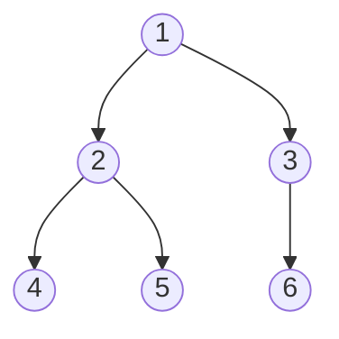

# BFS & DFS — Traversing Trees and Graphs Without Getting Lost

> Almost every tree or graph question is BFS or DFS plus one extra idea. Learn the two templates cold and the rest is variation. All code is Java.

---

## Table of Contents

1. The Ripple vs the Explorer Analogy
2. BFS vs DFS — When to Use Which
3. Graph Representations
4. Tree Traversals — DFS (Pre/In/Post) and BFS (Level Order)
5. Graph BFS — Shortest Path in Unweighted Graphs
6. Graph DFS — Connected Components, Flood Fill
7. Grids Are Graphs — Number of Islands, Rotting Oranges
8. Cycle Detection & Topological Sort
9. Beyond BFS: Dijkstra in One Page
10. Graphs in Real Systems
11. Practice Assignments (Low / Medium / High)
12. Mini Project — Microservice Dependency Analyzer
13. Interview Corner
14. Quick Reference

---

## 1. The Ripple vs the Explorer Analogy

Drop a stone in a pond. The ripple reaches everything **1 meter away first**, then 2 meters, then 3. That's **BFS (Breadth-First Search)**: explore in **layers** by distance. The first time the ripple touches something, it has found the **shortest** route to it.

Now picture an explorer in a cave system. They take a tunnel and follow it **as deep as it goes**; at a dead end, they walk back to the last fork and try the next tunnel. That's **DFS (Depth-First Search)**: go deep first, then **backtrack**.

- BFS uses a **queue** (first in, first out: nearest first).
- DFS uses a **stack** — either an explicit `Deque` or the **call stack** via recursion.

---

## 2. BFS vs DFS — When to Use Which

| Question type | Use | Why |
|---------------|-----|-----|
| Shortest path / fewest steps in an **unweighted** graph | **BFS** | Layers = distance; first visit is the shortest |
| Level-by-level output (tree "level order", "right side view") | **BFS** | Natural layering |
| "Minimum time for X to spread" (rotting oranges, fire, virus) | **Multi-source BFS** | All sources start in layer 0 |
| Does a path exist? Connected components? | Either (DFS is shorter to write) | Just need reachability |
| Explore all paths / backtracking | **DFS** | Path is on the stack |
| Cycle detection in directed graphs, topological order | **DFS** (3 colors) or **BFS** (Kahn's) | — |
| Tree height, subtree sums, validating a BST | **DFS** | Answers come from children (post-order) |
| Very deep structure (100K+ depth) | BFS or iterative DFS | Recursion would overflow the stack |

| | BFS | DFS |
|--|-----|-----|
| Data structure | Queue (`ArrayDeque`) | Stack / recursion |
| Memory | O(width) — can be large for wide graphs | O(depth) |
| Finds shortest path (unweighted) | ✅ | ❌ |
| Time | O(V + E) | O(V + E) |

---

## 3. Graph Representations

```java
// Adjacency list — the default for interviews and sparse real-world graphs
Map<Integer, List<Integer>> graph = new HashMap<>();
void addEdge(int u, int v) {
    graph.computeIfAbsent(u, k -> new ArrayList<>()).add(v);
    graph.computeIfAbsent(v, k -> new ArrayList<>()).add(u);   // omit this line for directed graphs
}

// Or, when nodes are 0..n-1:
List<List<Integer>> adj = new ArrayList<>();
for (int i = 0; i < n; i++) adj.add(new ArrayList<>());
for (int[] e : edges) { adj.get(e[0]).add(e[1]); adj.get(e[1]).add(e[0]); }
```

| Representation | Space | Check edge (u,v) | Iterate neighbors | Use when |
|----------------|-------|------------------|-------------------|----------|
| Adjacency list | O(V + E) | O(degree) | O(degree) | Sparse graphs (almost always) |
| Adjacency matrix | O(V²) | **O(1)** | O(V) | Dense graphs, small V |
| Edge list | O(E) | O(E) | O(E) | Input format; Kruskal's MST |
| Implicit (grid) | none | compute | 4 or 8 directions | Mazes, images, maps |

---

## 4. Tree Traversals

```java
class TreeNode { int val; TreeNode left, right; }
```



| Order | Visit sequence for the tree above | Typical use |
|-------|------------------------------------|-------------|
| Pre-order (node, left, right) | 1, 2, 4, 5, 3, 6 | Copy/serialize a tree |
| In-order (left, node, right) | 4, 2, 5, 1, 6, 3 | **BST → sorted order** |
| Post-order (left, right, node) | 4, 5, 2, 6, 3, 1 | Compute from children: height, size, delete tree |
| Level order (BFS) | [1], [2, 3], [4, 5, 6] | Per-level answers |

### DFS — recursive (all three orders differ by one line's position)

```java
void inorder(TreeNode n, List<Integer> out) {
    if (n == null) return;
    inorder(n.left, out);
    out.add(n.val);          // move this line up for pre-order, down for post-order
    inorder(n.right, out);
}
```

### DFS — iterative in-order (the version asked when recursion is "not allowed")

```java
List<Integer> inorderIterative(TreeNode root) {
    List<Integer> out = new ArrayList<>();
    Deque<TreeNode> stack = new ArrayDeque<>();
    TreeNode cur = root;
    while (cur != null || !stack.isEmpty()) {
        while (cur != null) { stack.push(cur); cur = cur.left; }   // go as far left as possible
        cur = stack.pop();
        out.add(cur.val);
        cur = cur.right;
    }
    return out;
}
```

### BFS — level order (LeetCode 102)

```java
List<List<Integer>> levelOrder(TreeNode root) {
    List<List<Integer>> res = new ArrayList<>();
    if (root == null) return res;
    Deque<TreeNode> q = new ArrayDeque<>();
    q.offer(root);
    while (!q.isEmpty()) {
        int size = q.size();                         // ← freeze the current level's size
        List<Integer> level = new ArrayList<>(size);
        for (int i = 0; i < size; i++) {
            TreeNode n = q.poll();
            level.add(n.val);
            if (n.left != null) q.offer(n.left);
            if (n.right != null) q.offer(n.right);
        }
        res.add(level);
    }
    return res;
}
```

The `int size = q.size()` snapshot is the whole trick: it separates one layer from the next. Variations — right side view (last node of each level), zigzag order, level averages, minimum depth — are one-line changes.

### Validate a BST (LeetCode 98) — pass bounds down

```java
boolean isValidBST(TreeNode root) { return valid(root, Long.MIN_VALUE, Long.MAX_VALUE); }
boolean valid(TreeNode n, long lo, long hi) {
    if (n == null) return true;
    if (n.val <= lo || n.val >= hi) return false;
    return valid(n.left, lo, n.val) && valid(n.right, n.val, hi);
}
```

<div class="callout-warn">

**The classic BST bug**: checking only `left.val < node.val < right.val` at each node. A node deep in the **left** subtree must be less than **every** ancestor it sits left of, not just its parent. Pass `(lo, hi)` bounds down — and use `long` so `Integer.MIN_VALUE`/`MAX_VALUE` node values don't break the comparison.

</div>

---

## 5. Graph BFS — Shortest Path in Unweighted Graphs

```java
int shortestPath(Map<Integer, List<Integer>> graph, int start, int target) {
    Deque<Integer> q = new ArrayDeque<>();
    Set<Integer> visited = new HashSet<>();
    q.offer(start);
    visited.add(start);                              // mark when ENQUEUED, not when dequeued
    int steps = 0;
    while (!q.isEmpty()) {
        int size = q.size();
        for (int i = 0; i < size; i++) {
            int node = q.poll();
            if (node == target) return steps;
            for (int next : graph.getOrDefault(node, List.of())) {
                if (visited.add(next)) q.offer(next);   // Set.add returns false if already present
            }
        }
        steps++;
    }
    return -1;                                       // unreachable
}
```

<div class="callout-info">

**Mark visited on enqueue, not dequeue.** If you mark on dequeue, the same node can be enqueued many times by different neighbors before it's processed — correct answers, but exponential blow-up on dense graphs. This is one of the most common BFS performance bugs.

</div>

### Word Ladder (LeetCode 127) — BFS where the graph is implicit

"hit" → "cog" changing one letter at a time, each intermediate must be a dictionary word. Nodes are words; edges connect words differing by one letter.

```java
int ladderLength(String begin, String end, List<String> wordList) {
    Set<String> dict = new HashSet<>(wordList);
    if (!dict.contains(end)) return 0;
    Deque<String> q = new ArrayDeque<>(List.of(begin));
    dict.remove(begin);
    int steps = 1;
    while (!q.isEmpty()) {
        for (int size = q.size(); size > 0; size--) {
            char[] w = q.poll().toCharArray();
            for (int i = 0; i < w.length; i++) {
                char orig = w[i];
                for (char c = 'a'; c <= 'z'; c++) {
                    w[i] = c;
                    String next = new String(w);
                    if (next.equals(end)) return steps + 1;
                    if (dict.remove(next)) q.offer(next);   // remove = mark visited
                }
                w[i] = orig;
            }
        }
        steps++;
    }
    return 0;
}
```

Generating neighbors (26 × L per word) beats comparing against every dictionary word (N per word) when N is large. Bidirectional BFS (search from both ends, expand the smaller frontier) cuts the explored space further.

---

## 6. Graph DFS — Connected Components, Flood Fill

```java
// Number of connected components in an undirected graph (n nodes, 0..n-1)
int countComponents(int n, int[][] edges) {
    List<List<Integer>> adj = new ArrayList<>();
    for (int i = 0; i < n; i++) adj.add(new ArrayList<>());
    for (int[] e : edges) { adj.get(e[0]).add(e[1]); adj.get(e[1]).add(e[0]); }

    boolean[] seen = new boolean[n];
    int components = 0;
    for (int i = 0; i < n; i++) {
        if (!seen[i]) { components++; dfs(i, adj, seen); }
    }
    return components;
}
void dfs(int u, List<List<Integer>> adj, boolean[] seen) {
    seen[u] = true;
    for (int v : adj.get(u)) if (!seen[v]) dfs(v, adj, seen);
}
```

<div class="callout-tip">

**Applying this** — "Connected components" is how you'd find **clusters of linked accounts** in fraud detection (accounts sharing a device, card, or address form a component), or group duplicate customer records that transitively match. At scale, **Union-Find (Disjoint Set Union)** does the same in near-O(1) per edge and works incrementally as edges stream in.

</div>

---

## 7. Grids Are Graphs — Number of Islands, Rotting Oranges

Each cell is a node; neighbors are up/down/left/right.

```java
private static final int[][] DIRS = {{1, 0}, {-1, 0}, {0, 1}, {0, -1}};
```

### Number of Islands (LeetCode 200) — DFS flood fill

```java
int numIslands(char[][] grid) {
    int count = 0;
    for (int r = 0; r < grid.length; r++)
        for (int c = 0; c < grid[0].length; c++)
            if (grid[r][c] == '1') { count++; sink(grid, r, c); }
    return count;
}
void sink(char[][] g, int r, int c) {
    if (r < 0 || c < 0 || r >= g.length || c >= g[0].length || g[r][c] != '1') return;
    g[r][c] = '0';                                 // mark visited by sinking the land
    for (int[] d : DIRS) sink(g, r + d[0], c + d[1]);
}
// O(rows × cols). Ask first: may I modify the input? If not, use a boolean[][] visited.
```

### Rotting Oranges (LeetCode 994) — multi-source BFS

All rotten oranges start in the queue together (layer 0); each BFS layer is one minute.

```java
int orangesRotting(int[][] grid) {
    int rows = grid.length, cols = grid[0].length, fresh = 0;
    Deque<int[]> q = new ArrayDeque<>();
    for (int r = 0; r < rows; r++)
        for (int c = 0; c < cols; c++) {
            if (grid[r][c] == 2) q.offer(new int[]{r, c});
            else if (grid[r][c] == 1) fresh++;
        }
    int minutes = 0;
    while (!q.isEmpty() && fresh > 0) {
        for (int size = q.size(); size > 0; size--) {
            int[] cell = q.poll();
            for (int[] d : DIRS) {
                int nr = cell[0] + d[0], nc = cell[1] + d[1];
                if (nr >= 0 && nc >= 0 && nr < rows && nc < cols && grid[nr][nc] == 1) {
                    grid[nr][nc] = 2;
                    fresh--;
                    q.offer(new int[]{nr, nc});
                }
            }
        }
        minutes++;
    }
    return fresh == 0 ? minutes : -1;
}
```

<div class="callout-scenario">

**Scenario**: A delivery app needs, for every address on a city grid, the distance to the **nearest** dark store (there are 40 stores). Running BFS from each address is O(addresses × grid). **Decision**: Run **one multi-source BFS** starting from all 40 stores at once. Each cell is visited exactly once, and the layer at which it's reached is its distance to the nearest store: O(grid) total. It's the same algorithm as Rotting Oranges (and LeetCode 542, "01 Matrix").

</div>

---

## 8. Cycle Detection & Topological Sort

### Course Schedule (LeetCode 207/210): can you finish all courses given prerequisites?

This is: "does the directed graph have a cycle?" — and if not, "give a valid order" (a **topological sort**).

#### Kahn's algorithm (BFS on in-degrees)

```java
int[] findOrder(int n, int[][] prereqs) {
    List<List<Integer>> adj = new ArrayList<>();
    for (int i = 0; i < n; i++) adj.add(new ArrayList<>());
    int[] indegree = new int[n];
    for (int[] p : prereqs) { adj.get(p[1]).add(p[0]); indegree[p[0]]++; }   // p[1] → p[0]

    Deque<Integer> q = new ArrayDeque<>();
    for (int i = 0; i < n; i++) if (indegree[i] == 0) q.offer(i);   // no prerequisites

    int[] order = new int[n];
    int idx = 0;
    while (!q.isEmpty()) {
        int u = q.poll();
        order[idx++] = u;
        for (int v : adj.get(u)) if (--indegree[v] == 0) q.offer(v);
    }
    return idx == n ? order : new int[0];     // fewer than n processed → a cycle exists
}
```

#### DFS with three colors

```java
// 0 = unvisited, 1 = visiting (on the current path), 2 = done
boolean hasCycle(int u, List<List<Integer>> adj, int[] state) {
    state[u] = 1;
    for (int v : adj.get(u)) {
        if (state[v] == 1) return true;                         // back edge → cycle
        if (state[v] == 0 && hasCycle(v, adj, state)) return true;
    }
    state[u] = 2;
    return false;
}
```

<div class="callout-interview">

**Q: "Why does cycle detection in a directed graph need three states instead of a visited boolean?"**

A node can be reached twice without a cycle — through two different paths, like a diamond A→B→D and A→C→D. "Visited" alone would wrongly report a cycle at D. The three states separate "currently on my recursion path" (gray) from "fully explored" (black). Only reaching a gray node means a back edge, which is a real cycle. In undirected graphs, a visited flag plus ignoring the parent edge is enough.

</div>

---

## 9. Beyond BFS: Dijkstra in One Page

BFS gives shortest paths only when every edge costs the same. With **non-negative weights** (road distances, latencies), swap the queue for a **priority queue** ordered by distance so far.

```java
int[] dijkstra(List<List<int[]>> adj, int src) {        // adj.get(u) = list of {v, weight}
    int[] dist = new int[adj.size()];
    Arrays.fill(dist, Integer.MAX_VALUE);
    dist[src] = 0;
    PriorityQueue<int[]> pq = new PriorityQueue<>(Comparator.comparingInt(a -> a[1]));
    pq.offer(new int[]{src, 0});
    while (!pq.isEmpty()) {
        int[] cur = pq.poll();
        int u = cur[0], d = cur[1];
        if (d > dist[u]) continue;                       // stale entry: a shorter path was already found
        for (int[] e : adj.get(u)) {
            int v = e[0], nd = d + e[1];
            if (nd < dist[v]) { dist[v] = nd; pq.offer(new int[]{v, nd}); }
        }
    }
    return dist;
}
// O((V + E) log V)
```

| Edge weights | Algorithm |
|--------------|-----------|
| All equal | BFS — O(V + E) |
| 0 or 1 | 0-1 BFS with a deque — O(V + E) |
| Non-negative | Dijkstra — O((V + E) log V) |
| Can be negative | Bellman-Ford — O(V·E); detects negative cycles |
| All pairs, small V | Floyd-Warshall — O(V³) |

---

## 10. Graphs in Real Systems

| System | Graph algorithm |
|--------|-----------------|
| Build tools (Maven, Gradle), Spring bean creation order | Topological sort; cycle detection → "circular dependency" errors |
| Kubernetes / Terraform dependency ordering | DAG + topological sort |
| Social networks: "people you may know" | BFS to depth 2 (friends of friends) |
| Maps / ride-hailing ETA | Dijkstra / A* / contraction hierarchies |
| Web crawlers | BFS over links with a visited set (see `design-web-crawler`) |
| Garbage collection (mark phase) | Graph traversal from GC roots |
| Fraud rings | Connected components / Union-Find |
| Microservice call graphs | Cycle detection, critical path |

---

## 11. 🏋️ Practice Assignments

### 🟢 Low — Build the reflexes

**L1.** Maximum depth of a binary tree — write it both recursively (DFS) and with BFS.

<details>
<summary>Show answer</summary>

```java
int maxDepthDfs(TreeNode n) {
    return n == null ? 0 : 1 + Math.max(maxDepthDfs(n.left), maxDepthDfs(n.right));
}

int maxDepthBfs(TreeNode root) {
    if (root == null) return 0;
    Deque<TreeNode> q = new ArrayDeque<>(List.of(root));
    int depth = 0;
    while (!q.isEmpty()) {
        for (int size = q.size(); size > 0; size--) {
            TreeNode n = q.poll();
            if (n.left != null) q.offer(n.left);
            if (n.right != null) q.offer(n.right);
        }
        depth++;
    }
    return depth;
}
```

</details>

**L2.** Binary tree right side view (LeetCode 199): the values visible when looking from the right.

<details>
<summary>Show answer</summary>

Level-order BFS; record the **last** node of each level.

```java
List<Integer> rightSideView(TreeNode root) {
    List<Integer> res = new ArrayList<>();
    if (root == null) return res;
    Deque<TreeNode> q = new ArrayDeque<>(List.of(root));
    while (!q.isEmpty()) {
        int size = q.size();
        for (int i = 0; i < size; i++) {
            TreeNode n = q.poll();
            if (i == size - 1) res.add(n.val);
            if (n.left != null) q.offer(n.left);
            if (n.right != null) q.offer(n.right);
        }
    }
    return res;
}
```

</details>

**L3.** Flood fill (LeetCode 733): recolor the connected region containing `(sr, sc)`. What's the infinite-loop trap?

<details>
<summary>Show answer</summary>

```java
int[][] floodFill(int[][] img, int sr, int sc, int color) {
    int old = img[sr][sc];
    if (old != color) fill(img, sr, sc, old, color);   // the trap: old == color → infinite recursion
    return img;
}
void fill(int[][] img, int r, int c, int old, int color) {
    if (r < 0 || c < 0 || r >= img.length || c >= img[0].length || img[r][c] != old) return;
    img[r][c] = color;
    fill(img, r + 1, c, old, color); fill(img, r - 1, c, old, color);
    fill(img, r, c + 1, old, color); fill(img, r, c - 1, old, color);
}
```

If the new color equals the old one, recolored cells still look "unvisited", so the recursion never ends.

</details>

### 🟡 Medium — Apply the patterns

**M1.** Clone an undirected graph (LeetCode 133).

<details>
<summary>Show answer</summary>

DFS with a map from original to copy — the map doubles as the visited set and handles cycles:

```java
Map<Node, Node> copies = new HashMap<>();

Node cloneGraph(Node node) {
    if (node == null) return null;
    if (copies.containsKey(node)) return copies.get(node);
    Node copy = new Node(node.val);
    copies.put(node, copy);                      // register BEFORE recursing (cycles!)
    for (Node nb : node.neighbors) copy.neighbors.add(cloneGraph(nb));
    return copy;
}
```

</details>

**M2.** Lowest Common Ancestor of a binary tree (LeetCode 236).

<details>
<summary>Show answer</summary>

Post-order DFS: each call returns `p`, `q`, the LCA, or null.

```java
TreeNode lca(TreeNode root, TreeNode p, TreeNode q) {
    if (root == null || root == p || root == q) return root;
    TreeNode left = lca(root.left, p, q);
    TreeNode right = lca(root.right, p, q);
    if (left != null && right != null) return root;   // p and q are on different sides
    return left != null ? left : right;
}
```

O(n). For a **BST**, walk down from the root: go left if both values are smaller, right if both are larger, otherwise the current node is the LCA — O(height).

</details>

**M3.** Shortest path in a binary matrix (LeetCode 1091): from top-left to bottom-right through 0-cells, 8-directional moves.

<details>
<summary>Show answer</summary>

BFS with 8 directions, counting path length in cells:

```java
int shortestPathBinaryMatrix(int[][] g) {
    int n = g.length;
    if (g[0][0] == 1 || g[n - 1][n - 1] == 1) return -1;
    Deque<int[]> q = new ArrayDeque<>();
    q.offer(new int[]{0, 0});
    g[0][0] = 1;                                           // mark visited
    for (int len = 1; !q.isEmpty(); len++) {
        for (int size = q.size(); size > 0; size--) {
            int[] c = q.poll();
            if (c[0] == n - 1 && c[1] == n - 1) return len;
            for (int dr = -1; dr <= 1; dr++)
                for (int dc = -1; dc <= 1; dc++) {
                    int r = c[0] + dr, col = c[1] + dc;
                    if (r >= 0 && col >= 0 && r < n && col < n && g[r][col] == 0) {
                        g[r][col] = 1;
                        q.offer(new int[]{r, col});
                    }
                }
        }
    }
    return -1;
}
```

</details>

### 🔴 High — Think like a senior

**H1.** Serialize and deserialize a binary tree (LeetCode 297). Design a format and justify it.

<details>
<summary>Show answer</summary>

Pre-order DFS with explicit null markers — unambiguous and easy to parse recursively:

```java
String serialize(TreeNode root) {
    StringBuilder sb = new StringBuilder();
    ser(root, sb);
    return sb.toString();
}
void ser(TreeNode n, StringBuilder sb) {
    if (n == null) { sb.append("#,"); return; }
    sb.append(n.val).append(',');
    ser(n.left, sb);
    ser(n.right, sb);
}

TreeNode deserialize(String data) {
    Deque<String> tokens = new ArrayDeque<>(Arrays.asList(data.split(",")));
    return de(tokens);
}
TreeNode de(Deque<String> t) {
    String v = t.poll();
    if (v.equals("#")) return null;
    TreeNode n = new TreeNode(Integer.parseInt(v));
    n.left = de(t);
    n.right = de(t);
    return n;
}
```

Why null markers: pre-order alone can't tell `[1, 2]` as a left child from a right child. Trade-offs: the recursive version overflows the stack on a degenerate 100K-deep tree — use an iterative BFS (level-order) format for arbitrary trees. In real systems you'd use JSON or Protobuf with an explicit schema, plus a depth limit.

</details>

**H2.** You have 300 microservices and a list of `(caller → callee)` edges from tracing data. Find (a) every dependency cycle, (b) a safe deployment order for a breaking API change, and (c) the services whose failure would impact the most other services.

<details>
<summary>Show answer</summary>

(a) **Cycles**: three-color DFS finds whether cycles exist. To list them properly, compute **strongly connected components** with Tarjan's or Kosaraju's algorithm in O(V + E): every SCC with more than one node (or with a self-loop) is a cyclic cluster.

(b) **Deploy order**: for a breaking change in a callee's API, deploy **callees first** (with backward compatibility), then callers. Condense each SCC into one node to get a DAG and run Kahn's algorithm on the reversed edges. SCCs must be deployed together or be made backward compatible first — flag them.

(c) **Blast radius**: for each service, count how many services can **reach** it (reverse-graph BFS/DFS from each node: O(V·(V + E)), fine for 300 nodes). Rank by that count, weighted by traffic. Also look at articulation points / bridges in the undirected view for single points of failure.

Deliverable: a report and a graph visualization (Graphviz), refreshed from traces weekly. This is exactly the mini project below.

</details>

---

## 12. 🛠️ Mini Project — Microservice Dependency Analyzer

**Goal**: A Java CLI that reads a service dependency list and answers real architecture questions with BFS/DFS. 2 evenings.

**Input** (`deps.csv`):

```text
caller,callee,rpm
api-gateway,order-service,12000
order-service,payment-service,3000
order-service,inventory-service,5000
payment-service,fraud-service,3000
fraud-service,order-service,200
notification-service,user-service,800
```

**Commands**

1. `path A B` — shortest call path from A to B (BFS), printed as `A → X → B`.
2. `cycles` — all cyclic clusters (Tarjan's SCC), e.g., `[order-service, payment-service, fraud-service]`.
3. `deploy-order` — a topological order of the condensed DAG (Kahn's), callees first.
4. `impact S` — every service that transitively depends on S (reverse-graph BFS) and their total RPM.
5. `components` — independent groups of services (undirected connected components).
6. `dot` — output a Graphviz DOT file with cycles highlighted in red.

**Acceptance criteria**

- All traversals iterative or depth-safe (test with a 10,000-node chain).
- Unit tests: a diamond (no false cycle), a self-loop, a disconnected graph, an empty file.
- The README explains each algorithm and its complexity.

**Stretch**: accept Zipkin/Jaeger JSON export as input and weight the edges by error rate to find the "most fragile" paths.

---

## 🎯 Interview Corner

<div class="callout-interview">

**Q: "When would you use BFS over DFS?"**

BFS explores in layers of increasing distance, so it's the right choice for shortest paths in unweighted graphs, minimum steps, level-by-level tree problems, and spreading processes like rotting oranges, where a multi-source BFS starts from all sources at once. DFS goes deep first and uses the call stack, so it's natural for reachability, connected components, cycle detection, topological sort, and anything that computes answers from children, like tree height or subtree sums, and for backtracking. Both are O(V + E). The practical differences are memory — BFS holds a whole frontier, DFS holds a path — and that recursive DFS can overflow the stack on very deep inputs, where I'd switch to iteration.

</div>

<div class="callout-interview">

**Q: "Count the number of islands in a grid. Then: what if the grid is 100,000 × 100,000 and doesn't fit in memory?"**

For the in-memory version, I scan every cell, and when I find unvisited land I increment the count and flood-fill the whole island with DFS or BFS, marking cells visited. That's O(rows × cols) time. I'd use iterative BFS or Union-Find for big grids to avoid stack overflow. When the grid doesn't fit in memory, I process it in row strips: within each strip, label islands with Union-Find, and keep only the boundary row's labels. When the next strip loads, I union labels that touch across the boundary. Memory stays at about one strip plus the label table. The same idea parallelizes: split the grid into tiles, solve each independently, then merge labels along the tile edges.

**Follow-up trap**: "Can you modify the input?" → Ask first. Sinking land by overwriting it is a side effect that's unacceptable if the caller reuses the grid, so use a separate visited array.

</div>

<div class="callout-interview">

**Q: "Given course prerequisites, return a valid order to take all courses, or report that it's impossible."**

This is topological sorting of a directed graph, and "impossible" means there's a cycle. I use Kahn's algorithm: build the adjacency list and in-degree counts, queue every course with in-degree zero, and repeatedly take one, append it to the order, and decrement the in-degree of the courses that depend on it, queueing any that reach zero. If the order ends up shorter than the course count, the leftover courses are in a cycle. It's O(V + E). The same algorithm resolves build dependencies, Spring's bean creation order, and database migration ordering, and a cycle there is exactly the "circular dependency" error those tools report.

</div>

---

## Quick Reference

| Need | Tool | Complexity |
|------|------|------------|
| Tree level-by-level | BFS + `size` snapshot | O(n) |
| Tree height, subtree info, LCA | Post-order DFS | O(n) |
| BST sorted order | In-order DFS | O(n) |
| Validate BST | DFS with `(lo, hi)` bounds as `long` | O(n) |
| Shortest path, unweighted | BFS (mark visited on enqueue) | O(V + E) |
| Nearest of many sources | Multi-source BFS | O(V + E) |
| Components, flood fill | DFS / BFS / Union-Find | O(V + E) |
| Directed cycle | DFS 3-color / Kahn's leftover | O(V + E) |
| Dependency order | Topological sort (Kahn's) | O(V + E) |
| Weighted shortest path (non-negative) | Dijkstra with a `PriorityQueue` | O((V+E) log V) |
| Cyclic clusters | Tarjan / Kosaraju SCC | O(V + E) |

---

## Related Topics

- `dsa-recursion` — DFS is recursion plus a visited set
- `design-web-crawler` — BFS at internet scale
- `spring-beans-di` — circular dependency detection is graph cycle detection

> **BFS asks "what's closest?"; DFS asks "how deep does this go?". Pick the question first, and the queue or the stack picks itself.**

---

<!-- journey-link:start -->

<div class="callout-journey">

🛒 **ShopNorth Journey** — A 'customers also bought' graph, explored breadth-first, is a classic first recommendation feature — a natural next step after Chapter 15.

**Continue the story:** [Chapter 15 · Evolving with AI](/tutorials/journey-15-ai) · **New here?** [Start the journey](/tutorials/journey-start)

</div>

<!-- journey-link:end -->
