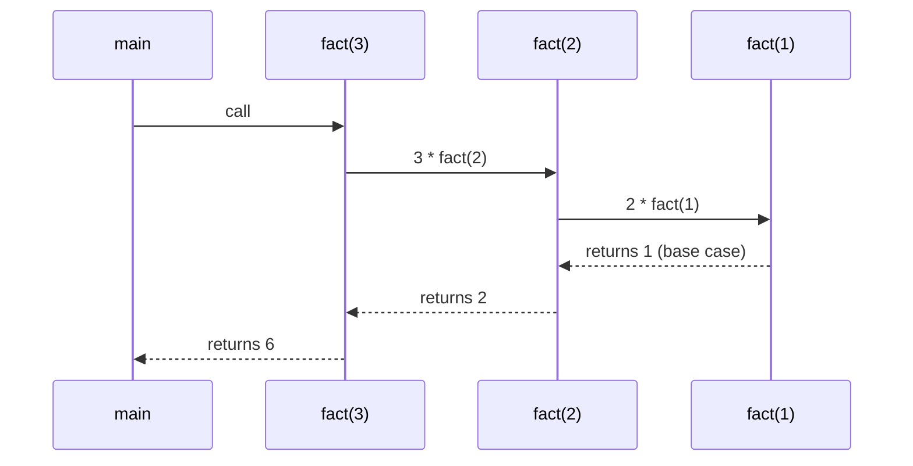
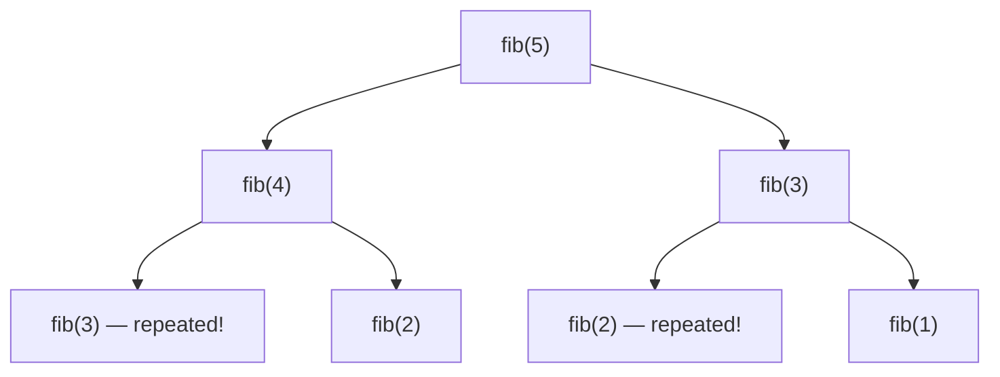
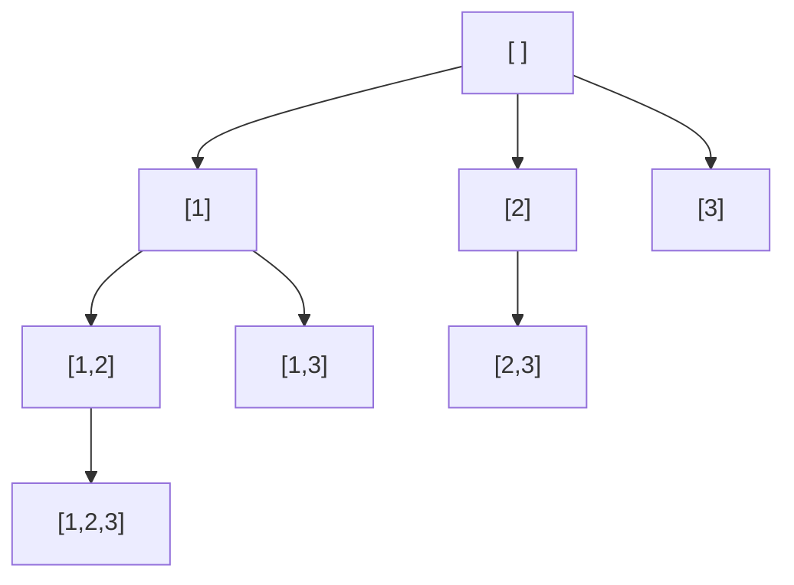

# Recursion & Backtracking — Trust the Function, Then Explore Every Choice

<!-- sdlc-stage:start -->
<div class="sdlc-stage">

📍 **SDLC stage: Design — data model** · ShopNorth uses this in [Chapter 4 · Data Model & SQL](/tutorials/journey-04-data-sql)

</div>
<!-- sdlc-stage:end -->

> Recursion feels hard until you stop tracing it in your head. This page gives you one mental model and one template that cover subsets, permutations, combinations, and N-Queens. All code is Java.

---

## Table of Contents

1. The Russian Dolls & the Maze Analogy
2. The Recursion Mental Model — The "Leap of Faith"
3. Anatomy: Base Case, Recursive Case, Call Stack
4. Recursion → Memoization (A First Taste of DP)
5. Backtracking — The Universal Template
6. Subsets, Permutations, Combinations
7. Constraint Problems: N-Queens, Word Search, Sudoku
8. Pruning & Complexity
9. Recursion in Production Code
10. Practice Assignments (Low / Medium / High)
11. Mini Project — Team Scheduler / Sudoku Solver
12. Interview Corner
13. Quick Reference

---

## 1. The Russian Dolls & the Maze Analogy

**Recursion = Russian dolls.** To count the dolls, you open the outer doll and ask: "1 + however many dolls are inside this smaller one?" You don't need to know how the smaller doll counts its insides — it does the same thing. Eventually you reach the **smallest doll that doesn't open**: that's the **base case**.

**Backtracking = exploring a maze with chalk.** At each junction you pick a path and mark it. If you hit a dead end, you **walk back** to the last junction, **erase the mark**, and try the next path. You systematically explore every possibility, but you abandon a path the moment it can't lead anywhere (**pruning**).

---

## 2. The Recursion Mental Model — The "Leap of Faith"

The mistake: trying to trace every recursive call in your head. The correct method has three steps:

1. **Define** what the function returns, in one sentence. *"`sum(n)` returns 1 + 2 + … + n."*
2. **Trust** that it works for smaller inputs. *"Assume `sum(n − 1)` is correct."*
3. **Use** the smaller answer to build this one, and handle the **smallest** case directly.

```java
int sum(int n) {
    if (n == 0) return 0;          // base case: smallest input, answered directly
    return n + sum(n - 1);         // leap of faith: sum(n-1) is correct
}
```

This is **mathematical induction**, written as code. If the base case is right and each step is right, the whole thing is right.

### Tree depth — the classic example

```java
// "maxDepth(node) returns the number of nodes on the longest root-to-leaf path"
int maxDepth(TreeNode node) {
    if (node == null) return 0;                                         // empty tree
    return 1 + Math.max(maxDepth(node.left), maxDepth(node.right));    // trust both subtrees
}
```

You never think about *how* the left subtree computes its depth. Trees are naturally recursive: a tree is a node plus two smaller trees.

---

## 3. Anatomy: Base Case, Recursive Case, Call Stack



Each call gets its own **stack frame** (parameters, locals, return address). Frames pile up until the base case, then unwind.

| Pitfall | Symptom | Fix |
|---------|---------|-----|
| Missing / unreachable base case | `StackOverflowError` | Check the smallest input first; make sure every call makes progress toward it |
| Too deep (e.g., a 100,000-node linked list) | `StackOverflowError` even with correct code | Iterate, or use an explicit `Deque` as the stack; JVM default stack ≈ 512 KB-1 MB (`-Xss`) |
| Re-solving the same subproblem | Exponential time (naive Fibonacci) | Memoize (section 4) |
| Mutating shared state without undoing it | Wrong answers in backtracking | "Choose → explore → **un-choose**" |

<div class="callout-warn">

**Java has no tail-call optimization.** Even `return helper(n - 1, acc)` (a tail call) consumes a stack frame. Unlike Scala (`@tailrec`) or some functional languages, a deep recursion in Java will overflow. For linear recursion over big inputs, convert to a loop.

</div>

---

## 4. Recursion → Memoization (A First Taste of DP)

```java
// ❌ O(2^n): fib(40) makes ~330 million calls
int fib(int n) {
    if (n <= 1) return n;
    return fib(n - 1) + fib(n - 2);
}
```



```java
// ✅ O(n): cache each answer the first time it's computed
long fib(int n, long[] memo) {
    if (n <= 1) return n;
    if (memo[n] != 0) return memo[n];
    return memo[n] = fib(n - 1, memo) + fib(n - 2, memo);
}
```

**When to memoize?** When the recursion tree has **overlapping subproblems** (the same arguments appear more than once). Backtracking problems (subsets, permutations) usually *don't* overlap — each path is unique — so memoization doesn't help there.

### Climbing stairs (LeetCode 70) — memoize, then go bottom-up

```java
// ways(n) = ways(n-1) + ways(n-2): the last step was either 1 or 2
int climbStairs(int n) {
    int a = 1, b = 1;                 // ways(0), ways(1)
    for (int i = 2; i <= n; i++) { int c = a + b; a = b; b = c; }
    return b;
}
```

---

## 5. Backtracking — The Universal Template

Backtracking builds a solution **one choice at a time**, recursing after each choice and **undoing** it afterward so the next choice starts from a clean state.

```java
void backtrack(State state, List<Result> results) {
    if (isComplete(state)) {                  // 1. goal reached → record a COPY
        results.add(copyOf(state));
        return;
    }
    for (Choice c : candidates(state)) {      // 2. try every option at this step
        if (!isValid(state, c)) continue;     // 3. prune early
        apply(state, c);                      // 4. choose
        backtrack(state, results);            // 5. explore
        undo(state, c);                       // 6. un-choose  ← the step everyone forgets
    }
}
```



*The decision tree for subsets of `[1,2,3]` — every node is a valid subset; backtracking is a depth-first walk of this tree.*

<div class="callout-warn">

**Record a copy, not the reference.** `results.add(path)` adds the **same** list object every time; when you later undo choices, every "result" empties out, and you get `[[], [], [], ...]`. Always `results.add(new ArrayList<>(path))`.

</div>

---

## 6. Subsets, Permutations, Combinations

### 6.1 Subsets (LeetCode 78) — every node is an answer

```java
List<List<Integer>> subsets(int[] nums) {
    List<List<Integer>> res = new ArrayList<>();
    backtrack(nums, 0, new ArrayList<>(), res);
    return res;
}
void backtrack(int[] nums, int start, List<Integer> path, List<List<Integer>> res) {
    res.add(new ArrayList<>(path));                 // every partial path is a subset
    for (int i = start; i < nums.length; i++) {
        path.add(nums[i]);                          // choose
        backtrack(nums, i + 1, path, res);          // explore: only later elements → no duplicates
        path.remove(path.size() - 1);               // un-choose
    }
}
// [1,2,3] → [], [1], [1,2], [1,2,3], [1,3], [2], [2,3], [3]   — 2^n subsets, O(n · 2^n)
```

**Subsets with duplicates** (LeetCode 90): sort first, and skip `nums[i] == nums[i-1]` when `i > start` (same value at the same tree level).

### 6.2 Permutations (LeetCode 46) — order matters, use a `used[]` array

```java
List<List<Integer>> permute(int[] nums) {
    List<List<Integer>> res = new ArrayList<>();
    backtrack(nums, new boolean[nums.length], new ArrayList<>(), res);
    return res;
}
void backtrack(int[] nums, boolean[] used, List<Integer> path, List<List<Integer>> res) {
    if (path.size() == nums.length) { res.add(new ArrayList<>(path)); return; }
    for (int i = 0; i < nums.length; i++) {         // start from 0 every time: any unused element
        if (used[i]) continue;
        used[i] = true;  path.add(nums[i]);
        backtrack(nums, used, path, res);
        used[i] = false; path.remove(path.size() - 1);
    }
}
// n! permutations, O(n · n!)
```

### 6.3 Combination Sum (LeetCode 39) — reuse allowed, prune on the target

```java
List<List<Integer>> combinationSum(int[] candidates, int target) {
    Arrays.sort(candidates);                         // sorting enables the "break" prune
    List<List<Integer>> res = new ArrayList<>();
    backtrack(candidates, target, 0, new ArrayList<>(), res);
    return res;
}
void backtrack(int[] c, int remaining, int start, List<Integer> path, List<List<Integer>> res) {
    if (remaining == 0) { res.add(new ArrayList<>(path)); return; }
    for (int i = start; i < c.length; i++) {
        if (c[i] > remaining) break;                 // sorted → every later candidate is too big
        path.add(c[i]);
        backtrack(c, remaining - c[i], i, path, res);   // i, not i+1: the same number can repeat
        path.remove(path.size() - 1);
    }
}
// candidates=[2,3,6,7], target=7 → [[2,2,3],[7]]
```

### The comparison that answers most interview questions

| Problem | Loop starts at | Next call gets | Record when | Count |
|---------|----------------|----------------|-------------|-------|
| Subsets | `start` | `i + 1` | Every node | 2ⁿ |
| Combinations (choose k) | `start` | `i + 1` | `path.size() == k` | C(n, k) |
| Combination sum (reuse) | `start` | `i` | `remaining == 0` | — |
| Permutations | `0` (+ `used[]`) | — | `path.size() == n` | n! |

<div class="callout-interview">

**Q: "What's the difference between the subsets and permutations code?"**

In subsets and combinations, order doesn't matter, so each level only considers elements after the current index (`start = i + 1`), which prevents `[1,2]` and `[2,1]` from both appearing. In permutations, order matters, so every level considers all elements from index 0, and a `used` array prevents picking the same element twice in one path.

</div>

---

## 7. Constraint Problems: N-Queens, Word Search, Sudoku

### N-Queens (LeetCode 51)

Place n queens so none attack each other. Go **row by row** (one queen per row), and track attacked columns and diagonals in sets for O(1) validity checks.

```java
List<List<String>> solveNQueens(int n) {
    List<List<String>> res = new ArrayList<>();
    int[] queenCol = new int[n];                    // queenCol[row] = column of that row's queen
    boolean[] cols = new boolean[n], diag = new boolean[2 * n], anti = new boolean[2 * n];
    place(0, n, queenCol, cols, diag, anti, res);
    return res;
}
void place(int row, int n, int[] qc, boolean[] cols, boolean[] diag, boolean[] anti,
           List<List<String>> res) {
    if (row == n) { res.add(render(qc, n)); return; }
    for (int c = 0; c < n; c++) {
        int d = row - c + n, a = row + c;          // cells on one diagonal share row-c (or row+c)
        if (cols[c] || diag[d] || anti[a]) continue;       // prune: attacked
        cols[c] = diag[d] = anti[a] = true; qc[row] = c;   // choose
        place(row + 1, n, qc, cols, diag, anti, res);      // explore
        cols[c] = diag[d] = anti[a] = false;                // un-choose
    }
}
List<String> render(int[] qc, int n) {
    List<String> board = new ArrayList<>();
    for (int r = 0; r < n; r++) {
        char[] row = new char[n];
        Arrays.fill(row, '.');
        row[qc[r]] = 'Q';
        board.add(new String(row));
    }
    return board;
}
// n = 8 → 92 solutions
```

### Word Search (LeetCode 79) — backtracking on a grid

```java
boolean exist(char[][] board, String word) {
    for (int r = 0; r < board.length; r++)
        for (int c = 0; c < board[0].length; c++)
            if (dfs(board, word, 0, r, c)) return true;
    return false;
}
boolean dfs(char[][] b, String w, int i, int r, int c) {
    if (i == w.length()) return true;
    if (r < 0 || c < 0 || r >= b.length || c >= b[0].length || b[r][c] != w.charAt(i)) return false;
    char saved = b[r][c];
    b[r][c] = '#';                                  // mark visited (choose)
    boolean found = dfs(b, w, i + 1, r + 1, c) || dfs(b, w, i + 1, r - 1, c)
                 || dfs(b, w, i + 1, r, c + 1) || dfs(b, w, i + 1, r, c - 1);
    b[r][c] = saved;                                // restore (un-choose)
    return found;
}
```

<div class="callout-scenario">

**Scenario**: A shift-planning feature must assign 12 nurses to 21 shifts per week with rules: max 5 shifts each, no night shift followed by a morning shift, at least 2 senior nurses per night. Brute force is 12²¹ combinations. **Decision**: This is a constraint-satisfaction problem. Backtracking with strong pruning (check each rule the moment a shift is assigned, fill the most constrained shifts first) works for small instances and makes a great prototype. For production-size rosters, use a solver such as **Timefold (formerly OptaPlanner)** or Google OR-Tools, which add heuristics and local search on top of the same idea.

</div>

---

## 8. Pruning & Complexity

| Problem | Search space | With pruning |
|---------|--------------|--------------|
| Subsets | 2ⁿ | None possible — every subset is output |
| Permutations | n! | None (all are outputs) |
| N-Queens | nⁿ naive placements | Far fewer: row-by-row + column/diagonal sets cut most branches (finding all 92 solutions for 8 queens takes roughly 15,000 placements instead of 16.7M full boards) |
| Combination sum | Exponential | Sort + `break` when a candidate exceeds the remainder |
| Sudoku | 9⁸¹ | Constraint checks + "most constrained cell first" → milliseconds |

**Pruning techniques**:

1. **Validate early**: check constraints when you *make* a choice, not when the solution is complete.
2. **Sort to enable `break`** instead of `continue`.
3. **Order choices**: try the most constrained variable first (fail-first heuristic).
4. **Bound**: in optimization problems, abandon a branch if it can't beat the best answer found so far (branch and bound).

<div class="callout-tip">

**Applying this** — Complexity for backtracking = (number of nodes in the decision tree) × (work per node). For output-sized problems like subsets and permutations, you can't beat the output size, so say so: "It's O(n · 2ⁿ) because there are 2ⁿ subsets and copying each is O(n) — that's optimal, since we must output them all."

</div>

---

## 9. Recursion in Production Code

| Use case | Recursive? | Notes |
|----------|------------|-------|
| Walking a category tree / org chart | ✅ Often | Or a recursive CTE in SQL (see `sql-subqueries-cte`) |
| Parsing JSON / expressions | ✅ Recursive-descent parsers | Guard depth against malicious nesting (Jackson's `StreamReadConstraints` has a max nesting depth) |
| File system traversal | ⚠️ | Use `Files.walk` / `Files.walkFileTree` (iterative, handles symlink cycles) |
| Very deep linked data | ❌ | Iterative with an explicit stack |
| Permissions: "does role X inherit permission Y?" | ✅ With a visited set | Role graphs can have cycles |

<div class="callout-warn">

**Recursion + untrusted input = denial-of-service risk.** A JSON body nested 100,000 levels deep can overflow a naive recursive parser's stack and crash the request thread. Always cap the depth when recursing over user-controlled structures.

</div>

---

## 10. 🏋️ Practice Assignments

### 🟢 Low — Build the reflexes

**L1.** Write `power(x, n)` recursively in O(log n) (LeetCode 50), handling negative `n`.

<details>
<summary>Show answer</summary>

```java
double myPow(double x, int n) {
    long N = n;                              // -2^31 negated overflows int
    if (N < 0) { x = 1 / x; N = -N; }
    return pow(x, N);
}
double pow(double x, long n) {
    if (n == 0) return 1;
    double half = pow(x, n / 2);             // compute once, not twice
    return (n % 2 == 0) ? half * half : half * half * x;
}
```

O(log n) calls. Calling `pow(x, n/2)` twice would make it O(n).

</details>

**L2.** Reverse a singly linked list recursively, and explain the leap of faith.

<details>
<summary>Show answer</summary>

```java
ListNode reverse(ListNode head) {
    if (head == null || head.next == null) return head;   // 0 or 1 node: already reversed
    ListNode newHead = reverse(head.next);                // trust: the rest is reversed
    head.next.next = head;                                // the old next now points back to us
    head.next = null;
    return newHead;
}
```

Leap of faith: `reverse(head.next)` returns the reversed remainder, and `head.next` is now its **tail**, so attaching `head` after it finishes the job. O(n) time, O(n) stack; the iterative version is O(1) space.

</details>

**L3.** Generate all binary strings of length n. How many are there?

<details>
<summary>Show answer</summary>

```java
void gen(int n, StringBuilder sb, List<String> out) {
    if (sb.length() == n) { out.add(sb.toString()); return; }
    for (char c : new char[]{'0', '1'}) {
        sb.append(c);
        gen(n, sb, out);
        sb.deleteCharAt(sb.length() - 1);
    }
}
```

2ⁿ strings; O(n · 2ⁿ) total.

</details>

### 🟡 Medium — Apply the template

**M1.** Generate all valid combinations of n pairs of parentheses (LeetCode 22).

<details>
<summary>Show answer</summary>

Prune: you may add `(` if `open < n`, and `)` if `close < open`.

```java
List<String> generateParenthesis(int n) {
    List<String> res = new ArrayList<>();
    build(n, 0, 0, new StringBuilder(), res);
    return res;
}
void build(int n, int open, int close, StringBuilder sb, List<String> res) {
    if (sb.length() == 2 * n) { res.add(sb.toString()); return; }
    if (open < n)     { sb.append('('); build(n, open + 1, close, sb, res); sb.deleteCharAt(sb.length() - 1); }
    if (close < open) { sb.append(')'); build(n, open, close + 1, sb, res); sb.deleteCharAt(sb.length() - 1); }
}
// n=3 → ((())), (()()), (())(), ()(()), ()()()
```

The count is the n-th Catalan number. Pruning means invalid strings are never generated.

</details>

**M2.** Letter combinations of a phone number (LeetCode 17): `"23"` → `["ad","ae","af","bd",...]`.

<details>
<summary>Show answer</summary>

```java
private static final String[] KEYS = {"", "", "abc", "def", "ghi", "jkl", "mno", "pqrs", "tuv", "wxyz"};

List<String> letterCombinations(String digits) {
    List<String> res = new ArrayList<>();
    if (!digits.isEmpty()) build(digits, 0, new StringBuilder(), res);
    return res;
}
void build(String d, int i, StringBuilder sb, List<String> res) {
    if (i == d.length()) { res.add(sb.toString()); return; }
    for (char c : KEYS[d.charAt(i) - '0'].toCharArray()) {
        sb.append(c);
        build(d, i + 1, sb, res);
        sb.deleteCharAt(sb.length() - 1);
    }
}
```

O(4ⁿ · n) in the worst case (7 and 9 have 4 letters).

</details>

**M3.** Palindrome partitioning (LeetCode 131): split `"aab"` into all lists of palindromic substrings.

<details>
<summary>Show answer</summary>

```java
List<List<String>> partition(String s) {
    List<List<String>> res = new ArrayList<>();
    backtrack(s, 0, new ArrayList<>(), res);
    return res;
}
void backtrack(String s, int start, List<String> path, List<List<String>> res) {
    if (start == s.length()) { res.add(new ArrayList<>(path)); return; }
    for (int end = start + 1; end <= s.length(); end++) {
        if (!isPal(s, start, end - 1)) continue;           // prune
        path.add(s.substring(start, end));
        backtrack(s, end, path, res);
        path.remove(path.size() - 1);
    }
}
boolean isPal(String s, int l, int r) { while (l < r) if (s.charAt(l++) != s.charAt(r--)) return false; return true; }
// "aab" → [[a,a,b],[aa,b]]
```

Optimization: precompute a `boolean[][] isPal` DP table so each check is O(1).

</details>

### 🔴 High — Think like a senior

**H1.** Write a Sudoku solver (LeetCode 37), and make it fast.

<details>
<summary>Show answer</summary>

```java
boolean[][] rows = new boolean[9][10], cols = new boolean[9][10], boxes = new boolean[9][10];

void solveSudoku(char[][] b) {
    for (int r = 0; r < 9; r++) for (int c = 0; c < 9; c++)
        if (b[r][c] != '.') mark(r, c, b[r][c] - '0', true);
    solve(b, 0);
}
boolean solve(char[][] b, int cell) {
    if (cell == 81) return true;
    int r = cell / 9, c = cell % 9;
    if (b[r][c] != '.') return solve(b, cell + 1);
    for (int d = 1; d <= 9; d++) {
        if (rows[r][d] || cols[c][d] || boxes[(r / 3) * 3 + c / 3][d]) continue;   // O(1) check
        b[r][c] = (char) ('0' + d); mark(r, c, d, true);
        if (solve(b, cell + 1)) return true;           // stop at the first solution
        b[r][c] = '.'; mark(r, c, d, false);
    }
    return false;
}
void mark(int r, int c, int d, boolean v) { rows[r][d] = cols[c][d] = boxes[(r / 3) * 3 + c / 3][d] = v; }
```

To make it faster: (1) O(1) constraint checks with the three boolean tables (done above); (2) **most-constrained cell first** — pick the empty cell with the fewest legal digits instead of scanning in order, which cuts the tree dramatically for hard puzzles; (3) bitmasks instead of boolean arrays (`Integer.bitCount` of the free digits); (4) constraint propagation (naked singles) before recursing. Knuth's Dancing Links (Algorithm X) is the classic exact-cover approach.

</details>

**H2.** A product catalog stores categories as `(id, parentId)` rows; there are ~50K categories and some bad data creates cycles. Write the function that returns all descendant category ids of a given category, safely.

<details>
<summary>Show answer</summary>

Build an adjacency map once, then traverse **iteratively** with a visited set (cycle-safe and stack-safe):

```java
Set<Long> descendants(long rootId, Map<Long, List<Long>> childrenByParent) {
    Set<Long> visited = new LinkedHashSet<>();
    Deque<Long> stack = new ArrayDeque<>(List.of(rootId));
    while (!stack.isEmpty()) {
        long id = stack.pop();
        for (long child : childrenByParent.getOrDefault(id, List.of())) {
            if (child == rootId || !visited.add(child)) {
                log.warn("Cycle or duplicate edge at category {}", child);   // report bad data
                continue;
            }
            stack.push(child);
        }
    }
    return visited;
}
```

Why iterative: a degenerate chain 50K deep would overflow the recursion stack. Why a visited set: cycles would loop forever. In SQL, the equivalent is a recursive CTE with a cycle guard (PostgreSQL 14+ `CYCLE` clause, or tracking the path array). Also fix the data: add a check (or a trigger) preventing a category from becoming its own ancestor.

</details>

---

## 11. 🛠️ Mini Project — Team Scheduler / Sudoku Solver

Pick **one** (or do both). Each takes 1-2 evenings.

### Option A — Interview Panel Scheduler

**Problem**: Schedule 6 candidates into interview slots across 4 interviewers over one day. Constraints: each candidate needs 3 interviews with **different** interviewers; an interviewer does at most 4 interviews and needs a break after 2 consecutive slots; some interviewers are unavailable for some slots; senior candidates need at least one "staff" interviewer.

**Build**

1. Model: `Candidate`, `Interviewer`, `Slot`, `Assignment` (records).
2. A backtracking solver: assign `(candidate, round) → (interviewer, slot)`, checking every constraint **at assignment time**.
3. Heuristic: order candidates by fewest feasible options first.
4. Output: a timetable printed as a grid, or "no solution" plus the constraint that failed most often.
5. Count explored nodes with and without the heuristic; print both.

### Option B — Sudoku Solver with Visualization

1. Solve from a text file of puzzles (easy → "hardest known" puzzles).
2. Implement the naive in-order solver, then the most-constrained-cell version (H1).
3. Print the node count and time for each puzzle with both strategies.
4. Optional: a small Swing/JavaFX or web UI animating the backtracking steps.

**Acceptance criteria (both)**

- Unit tests for the constraint checks.
- A README table: puzzle/instance → nodes explored → time, for naive vs heuristic.
- Clear evidence that pruning changes the result by orders of magnitude.

---

## 🎯 Interview Corner

<div class="callout-interview">

**Q: "How do you approach a recursion problem you've never seen?"**

I write down, in one sentence, what the function returns for a given input — that's the contract. I identify the smallest input I can answer directly, which is the base case. Then I assume the function already works on smaller inputs and ask how to combine those answers into this one, without tracing the whole call tree in my head. It's induction. Then I check progress toward the base case, state the time complexity as the number of calls times the work per call, and state the stack depth. If subproblems repeat, I add memoization, and if the depth could be huge, I convert to an iterative version with an explicit stack.

</div>

<div class="callout-interview">

**Q: "Generate all subsets of an array. Walk me through the complexity."**

I use backtracking with a start index. At each call I record a copy of the current path as a subset, then for each index from `start` onward I add that element, recurse with `i + 1`, and remove it again. Moving forward only means each combination appears once, in increasing index order. There are 2ⁿ subsets, and copying each costs up to O(n), so it's O(n · 2ⁿ) time, plus O(n) recursion depth. That's optimal, since the output itself is that big. An alternative is iterating over bitmasks from 0 to 2ⁿ − 1.

**Follow-up trap**: "What if the input has duplicates?" → Sort it first, then skip an element when it equals the previous one at the same recursion level (`i > start`), so duplicate subsets are never generated.

</div>

<div class="callout-interview">

**Q: "Your recursive function works in tests but throws StackOverflowError in production. What happened and what do you do?"**

Production data was deeper than the test data: a long linked chain, a deeply nested category tree, a malicious or corrupted payload, or a cycle causing infinite recursion. Java has no tail-call optimization, and each thread's stack is typically 512 KB to 1 MB, so depth in the tens of thousands can overflow. First I check for a cycle and add a visited set if the data is a graph. Then I convert to iteration with an explicit `ArrayDeque`, which keeps the state on the heap, and cap the depth for untrusted input. Increasing `-Xss` is a band-aid that raises memory per thread for every thread.

</div>

---

## Quick Reference

| Concept | One-Liner |
|---------|-----------|
| Leap of faith | Define the contract, trust smaller calls, solve the base case |
| Base case | Smallest input answered directly; every call must progress toward it |
| Stack depth | Java has no TCO; deep → iterate with `ArrayDeque` |
| Memoization | Cache results when subproblems overlap → recursion becomes DP |
| Backtracking | Choose → explore → un-choose |
| Record results | Add a **copy** of the path |
| Subsets / combos | Loop from `start`, recurse with `i + 1` |
| Permutations | Loop from 0 with `used[]` |
| Reuse allowed | Recurse with `i` |
| Duplicates | Sort + skip `nums[i] == nums[i-1]` when `i > start` |
| Pruning | Validate at choice time, sort + `break`, most-constrained first |
| Complexity | (# nodes in the decision tree) × (work per node) |

---

## Related Topics

- `dsa-bfs-dfs` — DFS is recursion over graphs and trees
- `sql-subqueries-cte` — recursive CTEs for hierarchical data
- `lld-chess`, `design-tic-tac-toe` — game-state search uses the same ideas

> **Recursion is trusting that the smaller problem is already solved. Backtracking is having the discipline to undo every choice you make — and the good sense to stop exploring a path that can't win.**

---

<!-- journey-link:start -->

<div class="callout-journey">

🛒 **ShopNorth Journey** — ShopNorth's category tree ('everything under Electronics') is recursion — expressed as a recursive SQL query.

**Continue the story:** [Chapter 4 · Data Model & SQL](/tutorials/journey-04-data-sql) · **New here?** [Start the journey](/tutorials/journey-start)

</div>

<!-- journey-link:end -->
