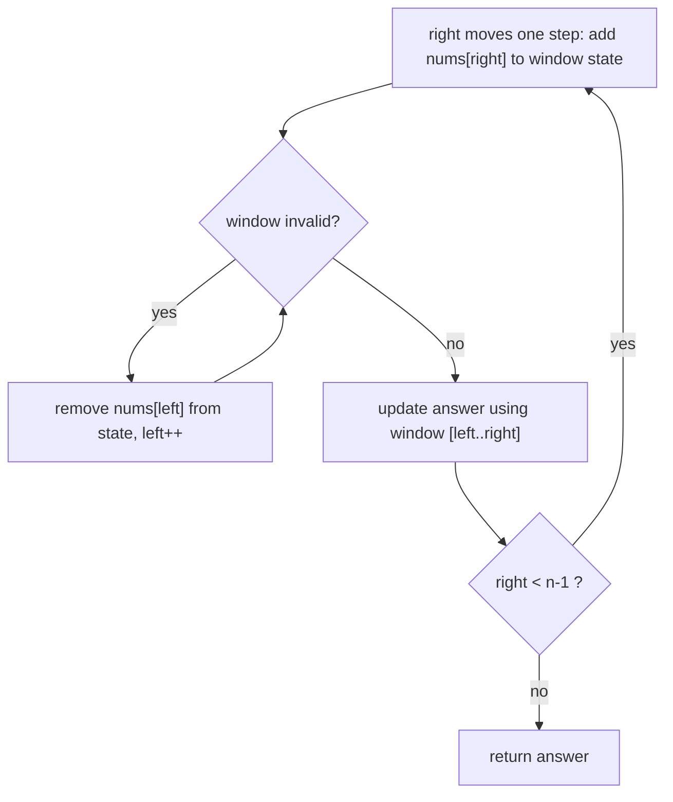

# Sliding Window — Contiguous Subarray & Substring Problems in O(n)

> If a problem says "contiguous subarray" or "substring" and asks for a longest/shortest/maximum, think sliding window first. All code is Java.

---

## Table of Contents

1. The Train Window Analogy
2. Recognizing the Pattern
3. Fixed-Size Windows
4. Variable-Size Windows — The Universal Template
5. Worked Problems: Longest Substring Without Repeating, Minimum Window Substring, Anagram Search
6. Window + Monotonic Deque (Sliding Window Maximum)
7. When Sliding Window Does NOT Work
8. Sliding Windows in Real Systems
9. Practice Assignments (Low / Medium / High)
10. Mini Project — Real-Time Rate Monitor
11. Interview Corner
12. Quick Reference

---

## 1. The Train Window Analogy

You're on a train looking out of a window that shows exactly **3 houses** at a time. You want to know when you've seen the most red houses.

- **Naive**: at every position, recount all 3 houses in the window.
- **Smart**: when the train moves one house forward, **one house leaves** the window on the left and **one enters** on the right. Update your count by −(the leaving house) +(the entering house).

That's a **fixed-size** sliding window: O(1) work per move instead of O(k).

Now imagine a **stretchable** window: you widen it to the right while the view is "valid" (say, no two houses of the same color), and shrink it from the left when it becomes invalid. That's a **variable-size** window, and it solves "longest / shortest contiguous X" problems.

---

## 2. Recognizing the Pattern

| Signal | Window type |
|--------|-------------|
| "Subarray/substring **of size k**" | Fixed |
| "**Longest** subarray/substring such that..." | Variable — expand, shrink when invalid |
| "**Shortest / minimum** subarray/substring such that..." | Variable — expand until valid, then shrink while still valid |
| "**Contains all** characters of T" / "anagram of P" | Variable or fixed + frequency map |
| "At most K distinct / K replacements / K zeros flipped" | Variable with a counter constraint |
| "Max/min **in every** window of size k" | Fixed + monotonic deque |

<div class="callout-warn">

**The hidden requirement: monotonicity.** Sliding window works when **shrinking a valid window keeps it valid** (or expanding an invalid one keeps it invalid). "Sum ≥ target with all positive numbers" works. "Sum == target with **negative** numbers" does **not** — adding an element can decrease the sum, so you can't decide which way to move. Use prefix sums + a HashMap there (section 7).

</div>

---

## 3. Fixed-Size Windows

### Maximum sum of any subarray of size k

```java
int maxSumOfSizeK(int[] nums, int k) {
    int windowSum = 0;
    for (int i = 0; i < k; i++) windowSum += nums[i];     // first window
    int best = windowSum;
    for (int right = k; right < nums.length; right++) {
        windowSum += nums[right] - nums[right - k];       // add entering, drop leaving
        best = Math.max(best, windowSum);
    }
    return best;
}
// nums=[2,1,5,1,3,2], k=3 → windows 8, 7, 9, 6 → 9.   O(n) vs O(n·k) brute force.
```

### Find all anagrams of `p` in `s` (LeetCode 438)

The window size is `p.length()`; compare **character counts**, not sorted strings.

```java
List<Integer> findAnagrams(String s, String p) {
    List<Integer> res = new ArrayList<>();
    if (p.length() > s.length()) return res;
    int[] need = new int[26], have = new int[26];
    for (char c : p.toCharArray()) need[c - 'a']++;
    int k = p.length();
    for (int i = 0; i < s.length(); i++) {
        have[s.charAt(i) - 'a']++;                            // enter
        if (i >= k) have[s.charAt(i - k) - 'a']--;             // leave
        if (i >= k - 1 && Arrays.equals(need, have)) res.add(i - k + 1);
    }
    return res;
}
// Arrays.equals on 26 ints is O(26) = O(1) → O(n) overall.
```

<div class="callout-tip">

**Applying this** — A fixed-size window over time buckets is how "requests in the last 60 seconds" metrics work: keep one counter per second in a circular array of 60, add the new second, subtract the expired one. Micrometer's and Resilience4j's sliding-window circuit breakers use exactly this idea.

</div>

---

## 4. Variable-Size Windows — The Universal Template



### Template for "longest valid window"

```java
int left = 0, best = 0;
// state: counts / sum / distinct count ...
for (int right = 0; right < n; right++) {
    add(arr[right]);                     // 1. expand
    while (windowIsInvalid()) {          // 2. shrink until valid again
        remove(arr[left]);
        left++;
    }
    best = Math.max(best, right - left + 1);   // 3. window is valid → record
}
```

### Template for "shortest valid window"

```java
int left = 0, best = Integer.MAX_VALUE;
for (int right = 0; right < n; right++) {
    add(arr[right]);
    while (windowIsValid()) {                  // shrink WHILE still valid, recording each time
        best = Math.min(best, right - left + 1);
        remove(arr[left]);
        left++;
    }
}
return best == Integer.MAX_VALUE ? 0 : best;
```

**Why O(n)?** Each element is added once (when `right` passes it) and removed at most once (when `left` passes it). The inner `while` looks nested, but its total work across the whole run is ≤ n — that's **amortized** O(n). Say this in interviews; it's the question they always ask.

### Minimum size subarray with sum ≥ target (LeetCode 209, positives only)

```java
int minSubArrayLen(int target, int[] nums) {
    int left = 0, sum = 0, best = Integer.MAX_VALUE;
    for (int right = 0; right < nums.length; right++) {
        sum += nums[right];
        while (sum >= target) {
            best = Math.min(best, right - left + 1);
            sum -= nums[left++];
        }
    }
    return best == Integer.MAX_VALUE ? 0 : best;
}
```

---

## 5. Worked Problems

### 5.1 Longest Substring Without Repeating Characters (LeetCode 3)

```java
int lengthOfLongestSubstring(String s) {
    Map<Character, Integer> lastSeen = new HashMap<>();
    int left = 0, best = 0;
    for (int right = 0; right < s.length(); right++) {
        char c = s.charAt(right);
        if (lastSeen.containsKey(c) && lastSeen.get(c) >= left) {
            left = lastSeen.get(c) + 1;           // jump left past the previous occurrence
        }
        lastSeen.put(c, right);
        best = Math.max(best, right - left + 1);
    }
    return best;
}
// "abcabcbb" → 3 ("abc"), "pwwkew" → 3 ("wke"), "" → 0
```

The `>= left` check matters: a character seen **before** the current window (e.g., the first `a` in `"abba"`) must not drag `left` backwards.

Trace for `"abba"`:

| right | char | lastSeen before | left | window | best |
|-------|------|-----------------|------|--------|------|
| 0 | a | {} | 0 | a | 1 |
| 1 | b | {a:0} | 0 | ab | 2 |
| 2 | b | {a:0,b:1} | 2 | b | 2 |
| 3 | a | {a:0,b:2} | 2 (a@0 < left, ignored) | ba | 2 |

### 5.2 Longest Repeating Character Replacement (LeetCode 424)

"You can replace at most k characters. Longest substring of one repeated letter?"

The window is valid if `windowLength - maxFreqInWindow <= k` (the characters that aren't the majority letter can all be replaced).

```java
int characterReplacement(String s, int k) {
    int[] count = new int[26];
    int left = 0, maxFreq = 0, best = 0;
    for (int right = 0; right < s.length(); right++) {
        maxFreq = Math.max(maxFreq, ++count[s.charAt(right) - 'A']);
        while ((right - left + 1) - maxFreq > k) {
            count[s.charAt(left++) - 'A']--;
        }
        best = Math.max(best, right - left + 1);
    }
    return best;
}
```

<div class="callout-info">

**A subtle, famous detail**: `maxFreq` is never decreased when shrinking, so it can be stale (too high). That's fine: the answer only improves when a *new* larger `maxFreq` appears, so a stale value never produces a wrong larger answer. Being able to explain this is a strong senior signal — and if you're unsure in an interview, recomputing the max over 26 counts is still O(26n) = O(n).

</div>

### 5.3 Minimum Window Substring (LeetCode 76) — the boss fight

Smallest substring of `s` containing all characters of `t` (with multiplicity).

```java
String minWindow(String s, String t) {
    if (t.isEmpty() || s.length() < t.length()) return "";
    int[] need = new int[128];
    for (char c : t.toCharArray()) need[c]++;
    int required = t.length();        // characters still missing (counting multiplicity)
    int left = 0, bestLen = Integer.MAX_VALUE, bestStart = 0;

    for (int right = 0; right < s.length(); right++) {
        if (need[s.charAt(right)]-- > 0) required--;      // this char was actually needed
        while (required == 0) {                            // window is valid → shrink
            if (right - left + 1 < bestLen) { bestLen = right - left + 1; bestStart = left; }
            if (++need[s.charAt(left)] > 0) required++;    // removing a needed char breaks validity
            left++;
        }
    }
    return bestLen == Integer.MAX_VALUE ? "" : s.substring(bestStart, bestStart + bestLen);
}
// s="ADOBECODEBANC", t="ABC" → "BANC"
```

The trick: `need[c]` goes **negative** for surplus characters. A character is "required" only while `need[c] > 0`. One counter (`required`) replaces comparing two whole maps on every step.

<div class="callout-interview">

**Q: "Your sliding window has a while loop inside a for loop — isn't that O(n²)?"**

No. The `left` pointer only moves forward and never passes `right`, so across the whole run the inner loop executes at most n times in total. Each element enters the window once and leaves at most once: 2n operations, amortized O(n).

</div>

---

## 6. Window + Monotonic Deque (Sliding Window Maximum)

"Max of every window of size k" (LeetCode 239). A heap gives O(n log k). A **monotonic deque** gives O(n): store **indices** whose values are in decreasing order; the front is always the current max.

```java
int[] maxSlidingWindow(int[] nums, int k) {
    int[] res = new int[nums.length - k + 1];
    Deque<Integer> dq = new ArrayDeque<>();          // indices, values decreasing front→back
    for (int i = 0; i < nums.length; i++) {
        if (!dq.isEmpty() && dq.peekFirst() <= i - k) dq.pollFirst();        // out of window
        while (!dq.isEmpty() && nums[dq.peekLast()] <= nums[i]) dq.pollLast(); // can never be max again
        dq.offerLast(i);
        if (i >= k - 1) res[i - k + 1] = nums[dq.peekFirst()];
    }
    return res;
}
// [1,3,-1,-3,5,3,6,7], k=3 → [3,3,5,5,6,7]
```

Why pop smaller values from the back? If `nums[j] <= nums[i]` and `j < i`, then `j` leaves the window *before* `i` and is never bigger than it, so `j` can never be a window maximum again. Every index is pushed and popped at most once → O(n).

<div class="callout-scenario">

**Scenario**: An SRE dashboard needs "max p99 latency over the last 5 minutes", refreshed every second, for 20,000 service/endpoint pairs. **Decision**: Keep a monotonic deque of `(timestamp, value)` per series: O(1) amortized per new sample and O(1) max queries, with far less memory than storing every sample in a sorted structure. (Prometheus's `max_over_time` achieves this with a scan over stored samples; the in-app version is the streaming equivalent.)

</div>

---

## 7. When Sliding Window Does NOT Work

**Subarray sum equals K with negative numbers** (LeetCode 560): expanding can decrease the sum, so neither expanding nor shrinking is guaranteed to help. Use **prefix sums + a HashMap**:

```java
int subarraySum(int[] nums, int k) {
    Map<Integer, Integer> prefixCount = new HashMap<>();
    prefixCount.put(0, 1);                    // the empty prefix
    int sum = 0, count = 0;
    for (int x : nums) {
        sum += x;
        count += prefixCount.getOrDefault(sum - k, 0);   // earlier prefixes that make a window sum to k
        prefixCount.merge(sum, 1, Integer::sum);
    }
    return count;
}
```

| Problem | Window? | Use instead |
|---------|---------|-------------|
| Sum == k, positives only | ✅ | — |
| Sum == k, with negatives | ❌ | Prefix sum + HashMap |
| Max subarray sum (any length) | ❌ | Kadane's algorithm |
| Non-contiguous ("subsequence") | ❌ | DP / greedy |
| Longest with at most K distinct | ✅ | — |

---

## 8. Sliding Windows in Real Systems

| System | Window use |
|--------|------------|
| Rate limiting | Sliding log / sliding window counter (see `rate-limiter`) |
| TCP | Sliding window flow control (receive window) |
| Kafka Streams / Flink | Tumbling, hopping, and sliding windows over event time |
| Circuit breakers (Resilience4j) | Count-based or time-based sliding window of call outcomes |
| Fraud detection | "More than 5 transactions from this card in 10 minutes" |
| Monitoring | Moving averages, `rate()` over a range vector |

---

## 9. 🏋️ Practice Assignments

### 🟢 Low — Build the reflexes

**L1.** Return the average of every contiguous subarray of size k. `[1,3,2,6,-1,4,1,8,2], k=5` → `[2.2, 2.8, 2.4, 3.6, 2.8]`.

<details>
<summary>Show answer</summary>

```java
double[] averages(int[] a, int k) {
    double[] res = new double[a.length - k + 1];
    double sum = 0;
    for (int i = 0; i < a.length; i++) {
        sum += a[i];
        if (i >= k) sum -= a[i - k];
        if (i >= k - 1) res[i - k + 1] = sum / k;
    }
    return res;
}
```

</details>

**L2.** Max number of vowels in any substring of length k (LeetCode 1456).

<details>
<summary>Show answer</summary>

```java
int maxVowels(String s, int k) {
    int count = 0, best = 0;
    for (int i = 0; i < s.length(); i++) {
        if ("aeiou".indexOf(s.charAt(i)) >= 0) count++;
        if (i >= k && "aeiou".indexOf(s.charAt(i - k)) >= 0) count--;
        best = Math.max(best, count);
    }
    return best;
}
```

</details>

**L3.** Why doesn't the sliding window work for "longest subarray with sum exactly k" when the array has negative numbers? Give a counterexample.

<details>
<summary>Show answer</summary>

`[1, -1, 5, -2, 3]`, k = 3. The longest answer is `[1, -1, 5, -2]` (sum 3, length 4). A window scan reaches `[1, -1, 5]` with sum 5 > 3 and shrinks from the left, dropping the `1` — permanently losing the start of the correct answer, which only becomes valid once `-2` arrives. When the window's sum exceeds k you'd shrink from the left, but removing a negative *increases* the sum, and a later negative could bring it back down. The window's validity isn't monotonic, so you can't safely discard the left side. Use prefix sums: store the **first** index of each prefix sum, and for each position look up `sum − k`.

</details>

### 🟡 Medium — Apply the pattern

**M1.** Longest substring with at most K distinct characters. `"eceba", k=2` → 3 (`"ece"`).

<details>
<summary>Show answer</summary>

```java
int longestKDistinct(String s, int k) {
    Map<Character, Integer> freq = new HashMap<>();
    int left = 0, best = 0;
    for (int right = 0; right < s.length(); right++) {
        freq.merge(s.charAt(right), 1, Integer::sum);
        while (freq.size() > k) {
            char c = s.charAt(left++);
            if (freq.merge(c, -1, Integer::sum) == 0) freq.remove(c);
        }
        best = Math.max(best, right - left + 1);
    }
    return best;
}
```

`merge` returns the new value; removing the key at zero keeps `size()` equal to the distinct count.

</details>

**M2.** Max consecutive 1s if you can flip at most k zeros (LeetCode 1004).

<details>
<summary>Show answer</summary>

```java
int longestOnes(int[] a, int k) {
    int left = 0, zeros = 0, best = 0;
    for (int right = 0; right < a.length; right++) {
        if (a[right] == 0) zeros++;
        while (zeros > k) if (a[left++] == 0) zeros--;
        best = Math.max(best, right - left + 1);
    }
    return best;
}
```

Reframe: the "longest window containing at most k zeros".

</details>

**M3.** Permutation in String (LeetCode 567): does `s2` contain a permutation of `s1`?

<details>
<summary>Show answer</summary>

A fixed window of `s1.length()` with count arrays — the anagram-search code from section 3, returning `true` on the first match. To avoid `Arrays.equals` each step, track `matches` = the number of the 26 letters whose counts agree, and update it in O(1) per enter/leave. Return true when `matches == 26`.

</details>

### 🔴 High — Think like a senior

**H1.** Implement a fraud rule: "flag a card if it makes more than 5 transactions in any 10-minute window, or spends more than ₹50,000 in any 10-minute window". Transactions arrive in timestamp order per card. Design for 10M cards.

<details>
<summary>Show answer</summary>

Per card, keep a `Deque<Txn>` of transactions in the last 10 minutes plus a running `sum`:

```java
void onTxn(Txn t) {
    CardWindow w = windows.computeIfAbsent(t.card(), c -> new CardWindow());
    w.q.addLast(t); w.sum += t.amount();
    while (w.q.peekFirst().ts() <= t.ts() - 600_000) w.sum -= w.q.pollFirst().amount();
    if (w.q.size() > 5 || w.sum > 50_000) flag(t);
}
```

O(1) amortized per transaction. Scaling: 10M cards × a deque is a lot of heap, so evict idle cards (Caffeine `expireAfterAccess(10m)`, or check the last timestamp). Partition by card id (Kafka key = card) so each card's window lives on one consumer instance and ordering holds. Use Kafka Streams / Flink **sliding windows** with state stores (RocksDB) and changelog topics for fault tolerance. Handle out-of-order events with event time + a grace period. Keep amounts in `long` paise, not `double`.

</details>

**H2.** Minimum Window Substring, but `s` is a 50 GB log file and `t` is a set of 5 required error codes. Adapt the algorithm.

<details>
<summary>Show answer</summary>

Tokenize the stream into error codes with positions (line numbers or byte offsets). Only tokens in `t` matter, so filter everything else. Keep a deque of `(code, position)` of relevant tokens inside the window plus the per-code counts and `required` counter — memory is bounded by the window's relevant tokens, not the file. Expand as tokens stream in; when `required == 0`, shrink from the deque's front and record the best `(start, end)` positions. Output byte offsets, then seek to extract the text. Single pass, O(N) time, memory proportional to the window's relevant tokens. Parallelize by splitting the file into chunks with overlap, handling cross-chunk windows at the boundaries (or accept a single-threaded pass bounded by disk I/O).

</details>

---

## 10. 🛠️ Mini Project — Real-Time Rate Monitor

**Goal**: A small Spring Boot (or plain Java) service applying three window techniques to live traffic. 2 evenings.

**Build**

1. A `/ingest` endpoint (or an in-process generator) receiving events `{userId, endpoint, latencyMs, timestamp}` at ~5K/sec.
2. **Per-user sliding-log rate limiter**: reject a user above 100 requests in any 60 seconds (`Deque<Long>` of timestamps per user, `ConcurrentHashMap` + per-user synchronization).
3. **Per-endpoint fixed-bucket counter**: requests per second over the last 60 seconds in a circular `long[60]` array → `/stats/{endpoint}/rps`.
4. **Per-endpoint rolling max latency** over the last 30 seconds using a monotonic deque of `(timestamp, latency)` → `/stats/{endpoint}/max-latency`.
5. **Idle eviction**: users with no events in 5 minutes are removed (scheduled sweep).

**Acceptance criteria**

- Unit tests with a fake `Clock` (inject `java.time.Clock` — never call `System.currentTimeMillis()` directly in window logic).
- A JMH or simple load test shows O(1) amortized cost: throughput doesn't degrade as the window fills.
- A README comparing sliding log vs fixed buckets vs sliding-window counter (memory vs accuracy).

**Stretch**: move the rate limiter to Redis with a Lua script over a sorted set (`ZREMRANGEBYSCORE` + `ZCARD` + `ZADD` atomically) so it works across multiple instances.

---

## 🎯 Interview Corner

<div class="callout-interview">

**Q: "Find the length of the longest substring without repeating characters."**

I use a variable sliding window with a map from character to its last index. I extend the right end one character at a time. If the character was last seen inside the current window, I move the left end to one past that index — only forward, never back, which is why I check that the last-seen index is at least `left`. After each step the window has no duplicates, so I update the best length. Each character is processed once, so it's O(n) time and O(min(n, alphabet)) space. With ASCII input I'd use an `int[128]` instead of a HashMap for speed.

**Follow-up trap**: "What about `abba`?" → When the second `a` arrives, its last index (0) is before `left` (2), so it must be ignored. Without the `>= left` check, `left` would jump backward and the answer would be wrong.

</div>

<div class="callout-interview">

**Q: "How do you decide between sliding window, prefix sums, and dynamic programming?"**

Sliding window needs a contiguous range plus a monotonic validity condition: shrinking a valid window keeps it valid, like all-positive sums or at-most-K-distinct constraints. Then each element enters and leaves once, giving O(n). If validity isn't monotonic, for example exact sums with negative numbers, I use prefix sums with a hash map, looking up `prefix − k` for O(n). If the problem is about subsequences rather than contiguous ranges, or the optimal choice depends on earlier choices in non-local ways, it's usually dynamic programming. The key question I ask is whether I can safely discard the left side of the window.

</div>

<div class="callout-interview">

**Q: "Design the data structure for 'maximum value in the last 5 minutes' over a live metric stream."**

A monotonic deque of `(timestamp, value)` kept in decreasing value order. On each new sample, I pop from the back every entry with value ≤ the new one, since they can never be the maximum again, then push the new sample. I pop from the front any entry older than five minutes. The front is always the current maximum, giving O(1) amortized updates and O(1) queries, with memory bounded by the number of samples in the window. A heap would be O(log n) per operation and needs lazy deletion for expired entries. For a distributed version I'd compute per-partition maxima and combine them, since max is associative.

</div>

---

## Quick Reference

| Variant | Loop shape | Examples |
|---------|------------|----------|
| Fixed size k | add `right`, drop `right−k` | Max sum size k, anagram search, averages |
| Longest valid | expand; `while invalid` shrink; record | No-repeat substring, K distinct, flip K zeros |
| Shortest valid | expand; `while valid` record + shrink | Min window substring, min subarray ≥ target |
| Frequency window | `int[26]`/`int[128]` + a "matches/required" counter | Anagrams, min window |
| Monotonic deque | pop smaller from back, expired from front | Window maximum/minimum |
| Not a window | prefix sum + HashMap / Kadane / DP | Sum = k with negatives, max subarray |

---

## Related Topics

- `dsa-two-pointers` — the same-direction pointer idea
- `dsa-strings` — frequency maps for anagrams
- `rate-limiter`, `design-rate-limiter-distributed` — sliding windows at system scale

> **A sliding window never looks back. If you can prove that the elements it forgets can't matter anymore, you've turned a quadratic search into a single pass.**

---

<!-- journey-link:start -->

<div class="callout-journey">

🛒 **ShopNorth Journey** — ShopNorth's gateway rate limiter counts each customer's requests over time windows during the sale.

**Continue the story:** [Chapter 14 · Launch Day & Incidents](/tutorials/journey-14-launch-day) · **New here?** [Start the journey](/tutorials/journey-start)

</div>

<!-- journey-link:end -->
