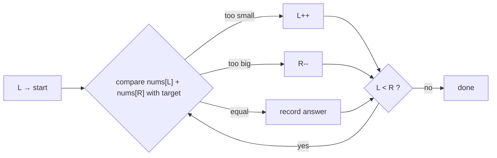

# Two Pointers — Turn O(n²) Pair Searches Into One Pass

> This is the first DSA pattern because it's the most reusable: it shows up in arrays, strings, linked lists, and merges. All code is Java.

---

## Table of Contents

1. The Bookshelf Analogy
2. How to Recognize a Two-Pointer Problem
3. Pattern 1 — Opposite Ends (Converging)
4. Pattern 2 — Same Direction (Fast/Slow, Read/Write)
5. Pattern 3 — Two Sequences (Merge-Style)
6. Worked Problems: Pair Sum, 3Sum, Container With Most Water, Trapping Rain Water
7. Linked Lists — Fast & Slow Pointers
8. How to Talk Through It in an Interview
9. Practice Assignments (Low / Medium / High)
10. Mini Project — Dedupe & Merge Engine for Transaction Feeds
11. Interview Corner
12. Quick Reference

---

## 1. The Bookshelf Analogy

You have a shelf of books **sorted by price**, and you need two books that together cost exactly ₹1,000.

- **Brute force**: pick every book, and for each one check every other book. With 1,000 books, that's ~500,000 checks.
- **Two pointers**: put your left hand on the **cheapest** book and your right hand on the **most expensive**.
  - Total too high? Move your **right** hand one book left (cheaper).
  - Total too low? Move your **left** hand one book right (pricier).
  - Exactly ₹1,000? Done.

Each step rules out a whole row of possibilities, and your hands only ever move toward each other, so it takes **at most 1,000 steps**. That's the entire idea: **use order to discard options without checking them.**

---

## 2. How to Recognize a Two-Pointer Problem

| Signal in the problem | Likely variant |
|-----------------------|----------------|
| "Sorted array" + "pair / triplet summing to X" | Opposite ends |
| "In-place", "O(1) extra space", "remove duplicates / move zeros" | Same direction (read/write) |
| "Palindrome", "reverse" | Opposite ends |
| "Merge two sorted arrays/lists", "intersection" | Two sequences |
| Linked list: "cycle", "middle", "k-th from end" | Fast & slow |
| "Maximize area / width between two lines" | Opposite ends with a greedy move |

<div class="callout-info">

**Complexity target**: brute force for pairs is O(n²). Two pointers gives **O(n)** time and **O(1)** space on sorted input. If the input isn't sorted, sorting first costs O(n log n) — often still a big win, unless you need original indices (then a HashMap is usually better).

</div>

---

## 3. Pattern 1 — Opposite Ends (Converging)



### Template

```java
int left = 0, right = arr.length - 1;
while (left < right) {
    // examine arr[left], arr[right]
    if (/* need bigger */) left++;
    else if (/* need smaller */) right--;
    else { /* found: record, then move one or both pointers */ }
}
```

### Valid palindrome (ignore non-alphanumerics)

```java
boolean isPalindrome(String s) {
    int l = 0, r = s.length() - 1;
    while (l < r) {
        while (l < r && !Character.isLetterOrDigit(s.charAt(l))) l++;
        while (l < r && !Character.isLetterOrDigit(s.charAt(r))) r--;
        if (Character.toLowerCase(s.charAt(l)) != Character.toLowerCase(s.charAt(r))) return false;
        l++; r--;
    }
    return true;
}
// "A man, a plan, a canal: Panama" → true.  O(n) time, O(1) space.
```

---

## 4. Pattern 2 — Same Direction (Fast/Slow, Read/Write)

One pointer **reads** every element; the other marks where the next **kept** element should be **written**.

### Remove duplicates from a sorted array, in place

```java
// Input: [1,1,2,3,3,3,4] → first 4 slots become [1,2,3,4], return 4
int removeDuplicates(int[] nums) {
    if (nums.length == 0) return 0;
    int write = 1;                                   // nums[0] is always kept
    for (int read = 1; read < nums.length; read++) {
        if (nums[read] != nums[write - 1]) {         // new value → keep it
            nums[write++] = nums[read];
        }
    }
    return write;
}
```

Trace for `[1,1,2,3,3,3,4]`:

| read | nums[read] | nums[write-1] | action | write after |
|------|-----------|---------------|--------|-------------|
| 1 | 1 | 1 | skip | 1 |
| 2 | 2 | 1 | write at 1 | 2 |
| 3 | 3 | 2 | write at 2 | 3 |
| 4 | 3 | 3 | skip | 3 |
| 5 | 3 | 3 | skip | 3 |
| 6 | 4 | 3 | write at 3 | 4 |

### Move zeros to the end (stable)

```java
void moveZeroes(int[] nums) {
    int write = 0;
    for (int read = 0; read < nums.length; read++) {
        if (nums[read] != 0) {
            int tmp = nums[write]; nums[write] = nums[read]; nums[read] = tmp;   // swap
            write++;
        }
    }
}
// [0,1,0,3,12] → [1,3,12,0,0]
```

<div class="callout-tip">

**Applying this** — The read/write pattern is exactly how you'd compact a large buffer in place: removing tombstoned entries from an in-memory log, filtering invalid rows from a `byte[]` batch before sending it to Kafka, or deduplicating a sorted export file line by line with O(1) memory.

</div>

---

## 5. Pattern 3 — Two Sequences (Merge-Style)

One pointer per input; always advance the one with the "smaller" current element.

```java
// Merge two sorted arrays into a new one — the heart of merge sort
int[] merge(int[] a, int[] b) {
    int[] out = new int[a.length + b.length];
    int i = 0, j = 0, k = 0;
    while (i < a.length && j < b.length) {
        out[k++] = (a[i] <= b[j]) ? a[i++] : b[j++];   // <= keeps it stable
    }
    while (i < a.length) out[k++] = a[i++];
    while (j < b.length) out[k++] = b[j++];
    return out;
}
```

### Merge in place from the back (LeetCode 88)

`nums1` has extra space at the end. Fill from the **back** so you never overwrite unread values:

```java
void merge(int[] nums1, int m, int[] nums2, int n) {
    int i = m - 1, j = n - 1, k = m + n - 1;
    while (j >= 0) {
        if (i >= 0 && nums1[i] > nums2[j]) nums1[k--] = nums1[i--];
        else nums1[k--] = nums2[j--];
    }
}
```

<div class="callout-scenario">

**Scenario**: Two services each export millions of transaction IDs, already sorted, and you need the IDs present in both (reconciliation). **Decision**: Stream both files with two pointers — advance whichever ID is smaller, emit when equal. O(n + m) time and **O(1) memory**, versus loading one side into a `HashSet` (O(n) memory, which may not fit). This is the same algorithm as a database **merge join**.

</div>

---

## 6. Worked Problems

### 6.1 Two Sum II — sorted input (LeetCode 167)

```java
int[] twoSum(int[] numbers, int target) {
    int l = 0, r = numbers.length - 1;
    while (l < r) {
        int sum = numbers[l] + numbers[r];
        if (sum == target) return new int[]{l + 1, r + 1};   // 1-indexed per the problem
        if (sum < target) l++; else r--;
    }
    return new int[0];
}
```

**Why is it correct?** If `numbers[l] + numbers[r] < target`, then `numbers[l]` paired with *anything* at or left of `r` is also too small (the array is sorted), so `l` can never be part of the answer — discard it. The symmetric argument discards `r`. Being able to say this out loud is what interviewers are listening for.

### 6.2 3Sum (LeetCode 15) — sort + fix one + two pointers

Find all **unique** triplets summing to 0.

```java
List<List<Integer>> threeSum(int[] nums) {
    Arrays.sort(nums);
    List<List<Integer>> res = new ArrayList<>();
    for (int i = 0; i < nums.length - 2; i++) {
        if (nums[i] > 0) break;                              // smallest is positive → no more zeros
        if (i > 0 && nums[i] == nums[i - 1]) continue;       // skip duplicate anchors
        int l = i + 1, r = nums.length - 1;
        while (l < r) {
            int sum = nums[i] + nums[l] + nums[r];
            if (sum < 0) l++;
            else if (sum > 0) r--;
            else {
                res.add(List.of(nums[i], nums[l], nums[r]));
                while (l < r && nums[l] == nums[l + 1]) l++;   // skip duplicate lefts
                while (l < r && nums[r] == nums[r - 1]) r--;   // skip duplicate rights
                l++; r--;
            }
        }
    }
    return res;
}
// O(n²) time (vs O(n³) brute force), O(1) extra space besides the output / sort
```

<div class="callout-warn">

**The duplicate-skipping lines are where most candidates fail.** Test mentally with `[-2, 0, 0, 2, 2]`: without the skips you'd output `[-2, 0, 2]` twice. Always ask yourself "what if there are duplicates?" before saying you're done.

</div>

### 6.3 Container With Most Water (LeetCode 11)

Heights `h[i]`; pick two lines to hold the most water: `min(h[l], h[r]) * (r - l)`.

```java
int maxArea(int[] h) {
    int l = 0, r = h.length - 1, best = 0;
    while (l < r) {
        best = Math.max(best, Math.min(h[l], h[r]) * (r - l));
        if (h[l] < h[r]) l++; else r--;      // move the SHORTER line
    }
    return best;
}
```

**Why move the shorter line?** The area is capped by the shorter line. Moving the taller one inward can only shrink the width while the cap stays the same or gets lower, so it can never improve. Moving the shorter one is the only move that *might* find a taller partner.

### 6.4 Trapping Rain Water (LeetCode 42) — the "hard" one

Water above bar `i` = `min(maxLeft, maxRight) - h[i]`.

```java
int trap(int[] h) {
    int l = 0, r = h.length - 1, leftMax = 0, rightMax = 0, water = 0;
    while (l < r) {
        if (h[l] < h[r]) {
            leftMax = Math.max(leftMax, h[l]);
            water += leftMax - h[l];          // right side has a bar ≥ h[l], so leftMax is the limit
            l++;
        } else {
            rightMax = Math.max(rightMax, h[r]);
            water += rightMax - h[r];
            r--;
        }
    }
    return water;
}
// [0,1,0,2,1,0,1,3,2,1,2,1] → 6.  O(n) time, O(1) space.
```

<div class="callout-interview">

**Q: "Why does trapping rain water work with two pointers?"**

Water at a bar is bounded by the smaller of the tallest bar to its left and right. If `h[l] < h[r]`, we know there's a bar on the right at least as tall as `h[l]`, so the right boundary can't be the limit for position `l` — only `leftMax` is. We can finalize `l` using `leftMax` alone and move on, which turns an O(n)-space prefix-max approach into O(1) space.

</div>

---

## 7. Linked Lists — Fast & Slow Pointers

```java
// Middle node: slow moves 1, fast moves 2 → when fast ends, slow is at the middle
ListNode middle(ListNode head) {
    ListNode slow = head, fast = head;
    while (fast != null && fast.next != null) { slow = slow.next; fast = fast.next.next; }
    return slow;
}

// Cycle detection (Floyd's tortoise and hare)
boolean hasCycle(ListNode head) {
    ListNode slow = head, fast = head;
    while (fast != null && fast.next != null) {
        slow = slow.next; fast = fast.next.next;
        if (slow == fast) return true;       // fast lapped slow inside a cycle
    }
    return false;
}

// Remove the n-th node from the end in one pass: fast gets an n-step head start
ListNode removeNthFromEnd(ListNode head, int n) {
    ListNode dummy = new ListNode(0, head), fast = dummy, slow = dummy;
    for (int i = 0; i <= n; i++) fast = fast.next;
    while (fast != null) { fast = fast.next; slow = slow.next; }
    slow.next = slow.next.next;
    return dummy.next;
}
```

| Problem | Trick |
|---------|-------|
| Middle | fast = 2× speed |
| Cycle exists | fast meets slow |
| Cycle start | after meeting, reset one pointer to head, move both 1 step → they meet at the start |
| k-th from end | fast gets a k-step lead |

---

## 8. How to Talk Through It in an Interview

1. **Clarify**: sorted? duplicates? return indices or values? negatives? empty input?
2. **Brute force first, out loud**: "Nested loops give O(n²). Since the array is sorted, I can do better."
3. **State the invariant**: "Everything left of `l` and right of `r` has been ruled out."
4. **Code the template**, then walk through a tiny example by hand.
5. **Edge cases**: empty, one element, all duplicates, no answer, integer overflow on sums (use `long`).
6. **Complexity**: time and space, including the sort if you added one.

<div class="callout-tip">

**Applying this** — Interviewers score the *reasoning* (invariant + why a pointer can move) as much as the code. A correct solution you can't justify reads as memorized; a slightly buggy one with a clear invariant that you then fix reads as senior.

</div>

---

## 9. 🏋️ Practice Assignments

### 🟢 Low — Build the reflexes

**L1.** Reverse a `char[]` in place.

<details>
<summary>Show answer</summary>

```java
void reverse(char[] s) {
    for (int l = 0, r = s.length - 1; l < r; l++, r--) {
        char t = s[l]; s[l] = s[r]; s[r] = t;
    }
}
```

O(n) time, O(1) space.

</details>

**L2.** Given a sorted array, return the squares of each number, sorted. `[-4,-1,0,3,10]` → `[0,1,9,16,100]`, in O(n).

<details>
<summary>Show answer</summary>

The largest squares sit at the **ends** (big negatives or big positives), so fill the output from the back:

```java
int[] sortedSquares(int[] a) {
    int n = a.length, l = 0, r = n - 1;
    int[] out = new int[n];
    for (int k = n - 1; k >= 0; k--) {
        if (Math.abs(a[l]) > Math.abs(a[r])) { out[k] = a[l] * a[l]; l++; }
        else { out[k] = a[r] * a[r]; r--; }
    }
    return out;
}
```

</details>

**L3.** Is `"race a car"` a valid palindrome (ignoring non-alphanumerics and case)? Trace your code from section 3.

<details>
<summary>Show answer</summary>

No. After cleanup it's `"raceacar"`: r=r, a=a, c=c, then `e` vs `a` → mismatch → `false`.

</details>

### 🟡 Medium — Apply the pattern

**M1.** Sort an array containing only 0s, 1s, and 2s in one pass (Dutch National Flag, LeetCode 75).

<details>
<summary>Show answer</summary>

Three pointers: `low` (next slot for 0), `mid` (scanner), `high` (next slot for 2).

```java
void sortColors(int[] a) {
    int low = 0, mid = 0, high = a.length - 1;
    while (mid <= high) {
        if (a[mid] == 0) swap(a, low++, mid++);
        else if (a[mid] == 1) mid++;
        else swap(a, mid, high--);      // don't advance mid: the swapped-in value is unexamined
    }
}
```

O(n), one pass, O(1) space. The "don't advance mid" line is the classic bug.

</details>

**M2.** 3Sum Closest: return the sum of the triplet closest to `target`.

<details>
<summary>Show answer</summary>

```java
int threeSumClosest(int[] nums, int target) {
    Arrays.sort(nums);
    int best = nums[0] + nums[1] + nums[2];
    for (int i = 0; i < nums.length - 2; i++) {
        int l = i + 1, r = nums.length - 1;
        while (l < r) {
            int sum = nums[i] + nums[l] + nums[r];
            if (Math.abs(sum - target) < Math.abs(best - target)) best = sum;
            if (sum < target) l++;
            else if (sum > target) r--;
            else return sum;            // can't beat exact
        }
    }
    return best;
}
```

O(n²).

</details>

**M3.** Find the start of a cycle in a linked list, and explain *why* the reset trick works.

<details>
<summary>Show answer</summary>

```java
ListNode detectCycle(ListNode head) {
    ListNode slow = head, fast = head;
    while (fast != null && fast.next != null) {
        slow = slow.next; fast = fast.next.next;
        if (slow == fast) {
            ListNode p = head;
            while (p != slow) { p = p.next; slow = slow.next; }
            return p;
        }
    }
    return null;
}
```

Why: let `a` = distance from the head to the cycle start, `b` = from the start to the meeting point, `c` = cycle length. Slow walked `a + b`, fast walked `2(a + b)`, and fast's extra distance is a multiple of the cycle: `a + b = k·c`. So `a = k·c − b`: walking `a` more steps from the meeting point lands exactly on the cycle start — the same place a pointer from the head reaches after `a` steps.

</details>

### 🔴 High — Think like a senior

**H1.** 4Sum (LeetCode 18): all unique quadruplets summing to `target`, where values go up to ±10⁹. Give the solution and the trap.

<details>
<summary>Show answer</summary>

Sort, two nested anchors `i`, `j`, then two pointers — O(n³). Skip duplicates at **every** level.

```java
List<List<Integer>> fourSum(int[] nums, int target) {
    Arrays.sort(nums);
    List<List<Integer>> res = new ArrayList<>();
    int n = nums.length;
    for (int i = 0; i < n - 3; i++) {
        if (i > 0 && nums[i] == nums[i - 1]) continue;
        for (int j = i + 1; j < n - 2; j++) {
            if (j > i + 1 && nums[j] == nums[j - 1]) continue;
            int l = j + 1, r = n - 1;
            while (l < r) {
                long sum = (long) nums[i] + nums[j] + nums[l] + nums[r];   // overflow trap!
                if (sum < target) l++;
                else if (sum > target) r--;
                else {
                    res.add(List.of(nums[i], nums[j], nums[l], nums[r]));
                    while (l < r && nums[l] == nums[l + 1]) l++;
                    while (l < r && nums[r] == nums[r - 1]) r--;
                    l++; r--;
                }
            }
        }
    }
    return res;
}
```

The trap: four values of 10⁹ overflow `int`, so accumulate in `long`. Generalization: k-Sum reduces recursively to 2-Sum, O(n^(k−1)).

</details>

**H2.** You have two sorted **streams** of events (by timestamp) from two data centers, each too large for memory. Output a single sorted stream with exact duplicates (same event id) removed. Then generalize to K streams.

<details>
<summary>Show answer</summary>

Two streams: the merge pattern with iterators, peeking the head of each. Emit the smaller timestamp; on a tie, compare ids — emit once and advance both if the ids are equal. To catch duplicates that aren't adjacent across streams, keep a small `Set` of ids seen **at the current timestamp** (cleared when the timestamp advances). O(n + m) time, O(1) memory (plus the tie window).

K streams: a `PriorityQueue` of the current head of each stream (a min-heap by timestamp, then id). Poll the min, emit it unless it's the same id as the last emitted, then push that stream's next element. O(N log K) — this is the K-way merge used in external sorting, LSM-tree compaction (Cassandra, RocksDB), and merging sorted Kafka partitions.

</details>

---

## 10. 🛠️ Mini Project — Dedupe & Merge Engine for Transaction Feeds

**Goal**: A small Java CLI that applies two-pointer techniques to a realistic data problem. 1-2 evenings.

**Scenario**: A payment company gets daily settlement files from two acquirers. Both are CSVs sorted by `txnId`: `txnId,amount,currency,status`.

**Tasks**

1. Generate two files of 1M rows each, with ~90% overlap, some amount mismatches, and some rows present on only one side.
2. **Reconcile** with a streaming two-pointer merge (`BufferedReader` on each file — don't load them into memory) and write:
   - `matched.csv` — same id, same amount,
   - `mismatched.csv` — same id, different amount,
   - `only_in_a.csv`, `only_in_b.csv`.
3. **Deduplicate** each input in a single pass (the read/write idea: skip a line if its id equals the previous line's id).
4. Print a summary: counts per category and total amount at risk in mismatches.
5. Compare against a naive version that loads side B into a `HashMap`. Measure memory (`-Xmx64m` should break the naive one) and time.

**Acceptance criteria**

- Runs with `-Xmx64m` on 2M total rows.
- Unit tests: empty files, one side empty, all duplicates, identical files.
- A README explaining why the streaming approach is O(n + m) time and O(1) memory.

**Stretch**: extend to K acquirer files with a `PriorityQueue` K-way merge (H2).

---

## 🎯 Interview Corner

<div class="callout-interview">

**Q: "Given a sorted array, find two numbers that add up to a target. Optimize it."**

Brute force checks every pair in O(n²). Because the array is sorted, I put one pointer at each end. If the sum is too small, I move the left pointer right — the left value paired with anything at or left of `r` is also too small, so it can't be in any answer. If the sum is too large, I move the right pointer left by the symmetric argument. Each step discards one element, so it's O(n) time and O(1) space. If the array weren't sorted and I needed original indices, I'd use a HashMap of value to index in one pass: O(n) time, O(n) space.

**Follow-up trap**: "What if there are many valid pairs, including duplicates?" → After recording a match, skip over equal values on both sides before moving on, or you'll report the same pair twice.

</div>

<div class="callout-interview">

**Q: "Solve 3Sum. What's the complexity, and can you do better?"**

Sort the array, then for each index `i` treat `nums[i]` as the anchor and run the two-pointer pair search for `-nums[i]` on the rest. Skip duplicate anchors, and after each match skip duplicate left and right values to keep triplets unique. That's O(n²) time after an O(n log n) sort, with O(1) extra space. There's no known general algorithm that's significantly better — 3Sum is conjectured to need roughly quadratic time, and it's used as a hardness baseline in complexity theory. A hash-set approach is also O(n²), but makes deduplication messier.

</div>

<div class="callout-interview">

**Q: "When would you choose two pointers over a HashMap?"**

Two pointers needs order: a sorted input, or a structure where moving a pointer provably discards candidates. It gives O(1) extra space and streams well, which matters for huge inputs or merges of sorted files. A HashMap works on unsorted data in O(n) time but costs O(n) memory, and it's natural when I need original indices. If the data is already sorted or arrives sorted from a database index, two pointers is strictly better. If it's unsorted and small, a HashMap avoids the O(n log n) sort. In a real system this is the same trade-off a database planner makes between a merge join and a hash join.

</div>

---

## Quick Reference

| Variant | Pointers | Classic problems | Complexity |
|---------|----------|------------------|------------|
| Opposite ends | `l=0, r=n-1`, converge | Two Sum II, palindrome, container, trapping water | O(n) |
| Anchor + two pointers | fix `i`, converge the rest | 3Sum, 3Sum Closest, 4Sum | O(n²), O(n³) |
| Read / write | both from the left | Remove duplicates, move zeros, remove element | O(n), O(1) space |
| Two sequences | one per input | Merge sorted, intersection, reconciliation | O(n + m) |
| Fast / slow | 1× and 2× speed | Middle, cycle, cycle start, k-th from end | O(n) |
| Three pointers | low / mid / high | Dutch flag | O(n) |

---

## Related Topics

- `dsa-sliding-window` — two pointers that define a range instead of a pair
- `dsa-strings` — palindromes and reversal problems
- `sql-joins` — merge join is two pointers inside your database

> **Two pointers is not a trick; it's a proof. Every time a pointer moves, you should be able to say which answers you just ruled out — and why none of them could be right.**

---

<!-- journey-link:start -->

<div class="callout-journey">

🛒 **ShopNorth Journey** — Merging two ranked result lists — keyword and vector search — is the idea behind ShopNorth's hybrid search ranking.

**Continue the story:** [Chapter 15 · Evolving with AI](/tutorials/journey-15-ai) · **New here?** [Start the journey](/tutorials/journey-start)

</div>

<!-- journey-link:end -->
