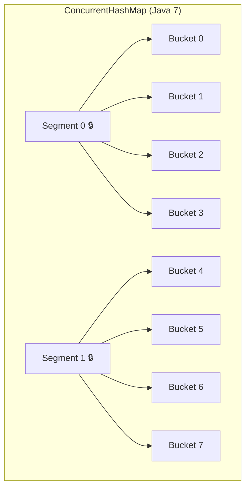
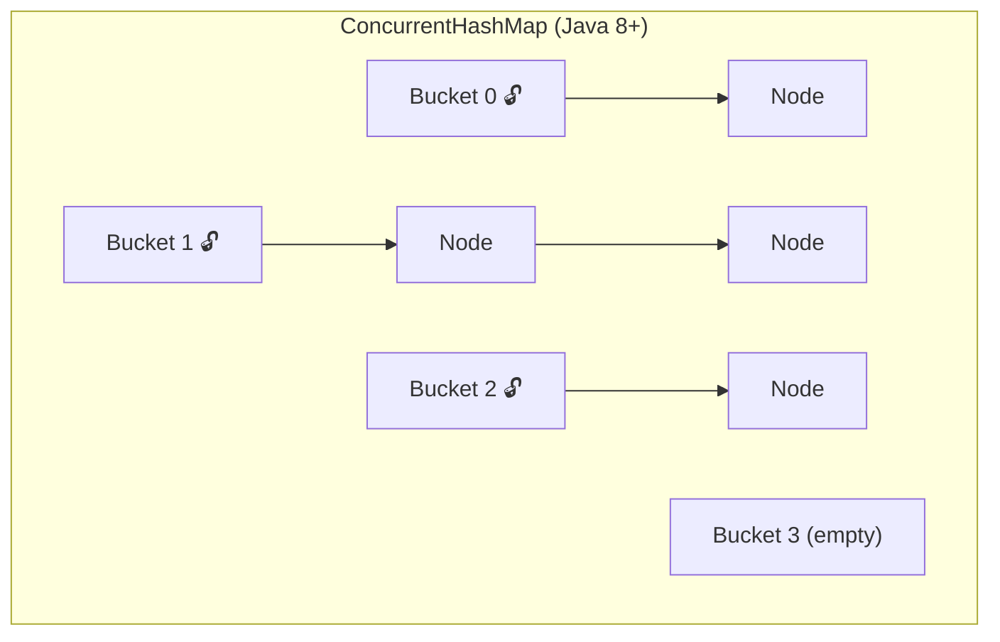

# ConcurrentHashMap Deep Dive

## Why Not Just Use synchronized HashMap?

Imagine a **library** again. A `synchronized HashMap` is like having **one door** — only one person can enter or leave at a time. Even if 100 people just want to *read* different books, they all queue at the same door.

`ConcurrentHashMap` is like having **multiple doors** — readers can enter simultaneously, and writers only block the section they're modifying.

---

## 1. The Evolution

### Java 7: Segment-Based Locking



- Map divided into **16 segments** (default)
- Each segment has its own lock
- 16 threads can write simultaneously (to different segments)
- **Problem**: Fixed number of segments, wasted memory

### Java 8+: Node-Level CAS + synchronized



- No segments — locks at **individual bucket level**
- Uses **CAS (Compare-And-Swap)** for inserts into empty buckets
- Uses **synchronized** on the first node of a bucket for updates
- Much finer granularity = much better concurrency

---

## 2. How put() Works in Java 8+

```java
map.put("key", "value");
```

### Step by step:

1. **Hash the key** → find bucket index
2. **If bucket is empty** → use CAS to insert (no lock needed!)
3. **If bucket has nodes** → `synchronized` on the first node of that bucket
4. **Walk the chain** → if key exists, update value; if not, append
5. **If chain length ≥ 8** → convert to Red-Black Tree (same as HashMap)

```java
// Simplified internal logic
if (bucket[index] == null) {
    // CAS — atomic, lock-free
    casTabAt(index, null, new Node(hash, key, value));
} else {
    synchronized (bucket[index]) {  // lock ONLY this bucket
        // insert or update within this bucket
    }
}
```

> **Key insight**: Empty bucket inserts are **lock-free** (CAS). Only collisions need synchronization, and only on that specific bucket.

---

## 3. How get() Works — No Locking At All!

```java
String value = map.get("key");  // ZERO locks, ZERO blocking
```

The `Node.val` and `Node.next` fields are **volatile**, so reads always see the latest value without any lock.

---

## 4. ConcurrentHashMap vs Alternatives

| Feature | HashMap | Collections.synchronizedMap | ConcurrentHashMap |
|---------|---------|---------------------------|-------------------|
| Thread-safe | ❌ | ✅ (single lock) | ✅ (fine-grained) |
| Read concurrency | N/A | 1 reader at a time | Unlimited readers |
| Write concurrency | N/A | 1 writer at a time | Per-bucket locking |
| Null keys/values | ✅ | ✅ | ❌ |
| Iterator | Fail-fast | Fail-fast | **Weakly consistent** |
| Performance | Fastest (single thread) | Slowest (contention) | Best (multi-thread) |

---

## 5. Atomic Operations — The Killer Feature

### Scenario: Word counter (the classic problem)

```java
// ❌ BROKEN — race condition even with ConcurrentHashMap!
ConcurrentHashMap<String, Integer> wordCount = new ConcurrentHashMap<>();

// Thread A and B both read count=5, both write 6. Lost update!
wordCount.put(word, wordCount.getOrDefault(word, 0) + 1);
```

```java
// ✅ CORRECT — atomic operations
// merge: if key exists, apply function; if not, use the value
wordCount.merge(word, 1, Integer::sum);

// compute: calculate new value atomically
wordCount.compute(word, (key, val) -> val == null ? 1 : val + 1);

// computeIfAbsent: set default if missing (great for caches)
map.computeIfAbsent(userId, id -> expensiveLookup(id));

// computeIfPresent: update only if exists
map.computeIfPresent(userId, (id, user) -> user.withLastLogin(now));
```

### Scenario: Thread-safe cache with lazy loading

```java
ConcurrentHashMap<String, UserProfile> cache = new ConcurrentHashMap<>();

public UserProfile getProfile(String userId) {
    // Only ONE thread computes the value, others wait and get the result
    return cache.computeIfAbsent(userId, id -> {
        return userService.loadProfile(id);  // expensive call, happens only once per key
    });
}
```

---

## 6. Bulk Operations (Java 8+)

```java
ConcurrentHashMap<String, Integer> scores = new ConcurrentHashMap<>();

// forEach — parallel iteration
scores.forEach(2, (name, score) -> {  // parallelism threshold = 2
    System.out.println(name + ": " + score);
});

// search — find first match (parallel)
String topScorer = scores.search(1, (name, score) -> {
    return score > 90 ? name : null;  // return non-null to stop
});

// reduce — aggregate (parallel)
int total = scores.reduce(1,
    (name, score) -> score,       // transform
    Integer::sum                   // combine
);
```

---

## 7. Common Pitfalls

### Pitfall 1: Check-then-act is NOT atomic

```java
// ❌ BROKEN — another thread can insert between check and put
if (!map.containsKey(key)) {
    map.put(key, value);
}

// ✅ CORRECT — atomic
map.putIfAbsent(key, value);
```

### Pitfall 2: Iterators are weakly consistent

```java
// Iterator reflects state at some point during or after creation
// It will NOT throw ConcurrentModificationException
// But it might not see the very latest updates
for (Map.Entry<String, Integer> entry : map.entrySet()) {
    // safe to iterate while other threads modify the map
    // but you might see stale data
}
```

### Pitfall 3: size() is an estimate

```java
// In a concurrent environment, size() is approximate
int size = map.size();  // might not be exact at this instant

// Use mappingCount() for long return type (avoids overflow)
long count = map.mappingCount();
```

---

## 8. When to Use What

| Scenario | Use |
|----------|-----|
| Single-threaded | `HashMap` |
| Multi-threaded, mostly reads | `ConcurrentHashMap` |
| Multi-threaded, need sorted | `ConcurrentSkipListMap` |
| Need all-or-nothing batch ops | `synchronized` block on HashMap |
| Simple thread-safe wrapper | `Collections.synchronizedMap()` |

---

---

<!-- practice-pack -->

## 🏢 Real-World Scenarios

<div class="callout-scenario">

**Scenario**: A rate limiter counts requests per API key with `map.put(key, map.getOrDefault(key, 0) + 1)` on a `ConcurrentHashMap`. Under load, counts are consistently lower than the real traffic and abusive clients slip through. **Decision**: Each call is thread-safe, but the **check-then-act sequence** (get, add, put) is not atomic — concurrent increments overwrite each other. Use atomic compound operations: `map.merge(key, 1, Integer::sum)`, or `computeIfAbsent(key, k -> new LongAdder()).increment()` for hot keys.

</div>

<div class="callout-scenario">

**Scenario**: `computeIfAbsent(userId, id -> userClient.fetchProfile(id))` is used as a cache. During a slow downstream incident, request threads pile up and throughput collapses — even for users whose profiles are unrelated. **Decision**: The mapping function runs while holding the lock for that bin, so a slow remote call inside `compute*` blocks other writers to the same bin (and the function must never call back into the same map). Keep mapping functions short and side-effect free. For loading caches from slow sources, use Caffeine (async loading, per-key single-flight, timeouts, expiry) instead.

</div>

## 🏋️ Practice Assignments

### 🟢 Low — Build the reflexes

**L1.** Is this thread-safe? `if (!map.containsKey(k)) map.put(k, v);`

<details>
<summary>Show answer</summary>

No. Two threads can both see "absent" and both put — the second overwrites the first. Use `map.putIfAbsent(k, v)` (atomic) or `computeIfAbsent`.

</details>

**L2.** Why does `ConcurrentHashMap.get()` not need a lock?

<details>
<summary>Show answer</summary>

Bins are read via volatile reads of the table array, and node values/next pointers are volatile (or safely published), so readers see a consistent, recently written state without locking. Writers lock only the specific bin (the first node, via `synchronized`) or use CAS for empty bins.

</details>

**L3.** Which method counts words concurrently in one line?

<details>
<summary>Show answer</summary>

`counts.merge(word, 1L, Long::sum);` — atomic per key. For very hot keys, `counts.computeIfAbsent(word, w -> new LongAdder()).increment()` reduces contention further.

</details>

### 🟡 Medium — Apply it

**M1.** Implement a thread-safe "first request wins" deduplicator: the first thread to process an idempotency key gets `true`; any concurrent or later thread with the same key gets `false`. Keys expire after 10 minutes.

<details>
<summary>Show answer</summary>

Without expiry: `return seen.putIfAbsent(key, Boolean.TRUE) == null;` on a `ConcurrentHashMap<String, Boolean>`. With expiry, a raw CHM grows forever; use Caffeine: `Cache<String, Boolean> seen = Caffeine.newBuilder().expireAfterWrite(Duration.ofMinutes(10)).maximumSize(1_000_000).build();` and `return seen.asMap().putIfAbsent(key, Boolean.TRUE) == null;` (atomic). Across multiple instances, this must move to Redis (`SET key 1 NX EX 600`) or a DB unique constraint.

</details>

**M2.** What's wrong with iterating a `ConcurrentHashMap` to compute a total while other threads update it, and when is it acceptable?

<details>
<summary>Show answer</summary>

Iterators are **weakly consistent**: they never throw `ConcurrentModificationException`, but they may or may not reflect updates made during iteration, so the total is not a point-in-time snapshot. Acceptable for monitoring/approximate metrics; not for exact accounting. For exact snapshots, pause writers, or maintain the aggregate atomically alongside updates (e.g., a `LongAdder` total), or copy under a lock you control.

</details>

**M3.** Replace `Collections.synchronizedMap(new HashMap<>())` in a hot path used by 64 threads and explain the expected improvement.

<details>
<summary>Show answer</summary>

`synchronizedMap` wraps every operation in one global lock: all 64 threads serialize, even readers. `ConcurrentHashMap` allows lock-free reads and per-bin locking for writes, so throughput scales with threads unless many writes hit the same key. Also fix compound operations to use `compute/merge/putIfAbsent` — `synchronizedMap` users often relied on external `synchronized(map)` blocks for check-then-act, which must be translated to atomic CHM methods.

</details>

### 🔴 High — Think like a senior

**H1.** Design an in-memory, thread-safe "top 10 products by views in the last 5 minutes" component for a single service instance handling 20K view events/second.

<details>
<summary>Show answer</summary>

Time-bucketed counting: a ring of 5 one-minute buckets, each a `ConcurrentHashMap<String, LongAdder>`. Views increment the current bucket (`computeIfAbsent(...).increment()`), which is lock-free and contention-friendly. A scheduled task every minute rotates buckets (the oldest is cleared and reused via an `AtomicReferenceArray`). A second scheduled task every few seconds merges the 5 buckets into totals and computes the top 10 with a min-heap of size 10, publishing an immutable result list via a `volatile` field, so readers never compute anything. Memory is bounded by distinct products per 5 minutes; add a cap (ignore long-tail keys beyond N or use a Count-Min Sketch + heap) if cardinality is huge. Across instances, aggregate in Redis sorted sets or Kafka Streams instead.

</details>

**H2.** A colleague uses `ConcurrentHashMap<String, List<Order>>` and does `map.get(customer).add(order)` from many threads. What breaks, and what are the fixes?

<details>
<summary>Show answer</summary>

The map is thread-safe, but the **values** aren't: many threads calling `add` on the same `ArrayList` race (lost elements, `ArrayIndexOutOfBoundsException`, corrupted size). Also `get` may return null for new customers. Fixes: `map.computeIfAbsent(customer, c -> new CopyOnWriteArrayList<>()).add(order)` for read-mostly lists; or `ConcurrentLinkedQueue` values; or do the whole update atomically: `map.compute(customer, (c, list) -> { var l = list == null ? new ArrayList<Order>() : new ArrayList<>(list); l.add(order); return List.copyOf(l); })` (immutable values, copy-on-write per key). Choose by read/write ratio.

</details>

## 🛠️ Mini Project — Concurrent Word-Frequency Service

**Goal**: See the difference between "thread-safe map" and "thread-safe logic". 1 evening.

**Build**

1. A tool that reads 100 large text files with a fixed thread pool and counts word frequencies into a shared map.
2. Implement four versions: (a) `HashMap` (broken), (b) `ConcurrentHashMap` with `get` + `put` (still broken), (c) `ConcurrentHashMap.merge`, (d) `ConcurrentHashMap<String, LongAdder>`.
3. A test comparing each version's totals to a single-threaded reference over 20 runs — record how often each is wrong.
4. JMH benchmark (c) vs (d) vs `synchronizedMap` + `synchronized` blocks at 1, 4, 16, 64 threads.
5. Add a "top 20 words" computation that runs while counting continues, and document why its result is approximate.

**Acceptance criteria**: README table of correctness (wrong runs out of 20) and throughput per version and thread count, with explanations.

---

## 🎯 Interview Corner

<div class="callout-interview">

**Q: "What's the difference between HashMap, synchronizedMap, and ConcurrentHashMap?"**

HashMap is not thread-safe — two threads writing simultaneously can corrupt the internal array. Collections.synchronizedMap wraps every method with a single lock — safe but slow because even readers block each other. ConcurrentHashMap uses fine-grained locking: in Java 8+, it locks only the individual bucket being written to, and reads are completely lock-free using volatile fields. So 100 threads can read simultaneously, and writers only block each other if they hit the same bucket.

</div>

<div class="callout-interview">

**Q: "How does ConcurrentHashMap achieve thread safety without locking the entire map?"**

Two mechanisms. For inserts into empty buckets, it uses CAS (Compare-And-Swap) — an atomic CPU instruction that sets the value only if the current value matches the expected value. No lock needed. For inserts into non-empty buckets (collisions), it uses synchronized on the first node of that specific bucket. So the lock granularity is per-bucket, not per-map. This means N threads writing to N different buckets have zero contention.

</div>

<div class="callout-interview">

**Q: "Can you use ConcurrentHashMap to implement a thread-safe check-then-act operation?"**

Not with separate get() and put() calls — another thread can modify the map between your check and your act. That's why ConcurrentHashMap provides atomic compound operations: putIfAbsent() for "insert if missing", compute() and merge() for "read-modify-write" atomically, and computeIfAbsent() for lazy initialization. For example, a thread-safe word counter uses `map.merge(word, 1, Integer::sum)` — the entire read-increment-write happens atomically.

**Follow-up trap**: "Is `map.get(key) == null ? map.put(key, val) : map.get(key)` safe?" → No. Use putIfAbsent(). The check and put are two separate operations — another thread can insert between them.

</div>

<div class="callout-interview">

**Q: "Why doesn't ConcurrentHashMap allow null keys or values?"**

Because null creates ambiguity in concurrent contexts. If `map.get(key)` returns null, you can't tell whether the key is absent or the value is null. In HashMap you can call containsKey() to disambiguate, but in ConcurrentHashMap the state can change between get() and containsKey() — another thread might insert or remove the key. So null is banned to eliminate this ambiguity entirely.

</div>

<div class="callout-tip">

**Applying this** — In production, use ConcurrentHashMap for shared caches, rate limiters, and connection pools. Use computeIfAbsent() for lazy-loading caches — it guarantees the computation runs exactly once per key even under concurrent access. But watch out: if the computation inside computeIfAbsent() is slow (like a DB call), other threads waiting for the same key will block. For expensive computations, consider Caffeine cache instead.

</div>

---

> **Remember**: ConcurrentHashMap is not about making HashMap thread-safe — it's about making concurrent access **fast**. The magic is in the granularity: lock only what you need, for as short as possible, and prefer lock-free operations (CAS) when you can.

---

<!-- journey-link:start -->

<div class="callout-journey">

🛒 **ShopNorth Journey** — Coverity flags a data race on a HashMap in a ShopNorth singleton bean; the fix is a ConcurrentHashMap or no shared mutable state.

**Continue the story:** [Chapter 9 · Code Quality — SonarQube & Coverity](/tutorials/journey-09-code-quality) · **New here?** [Start the journey](/tutorials/journey-start)

</div>

<!-- journey-link:end -->
