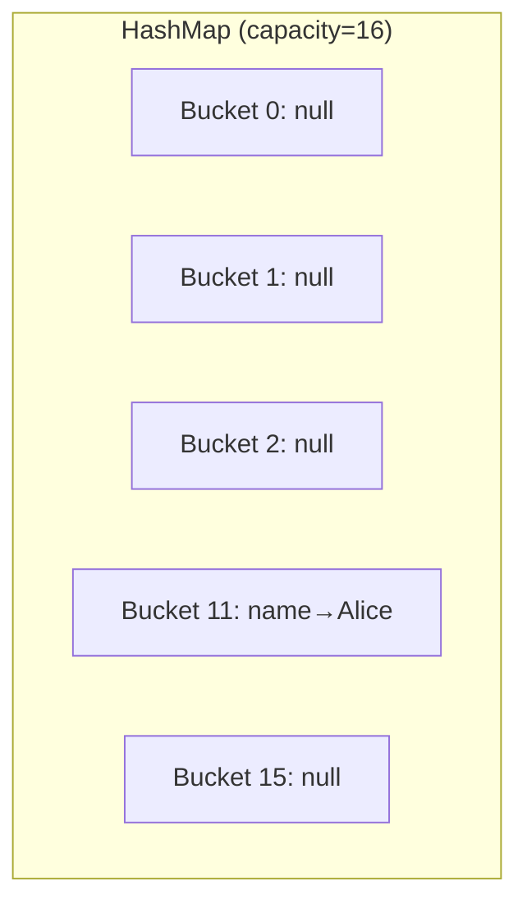
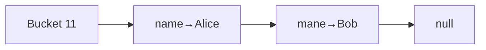
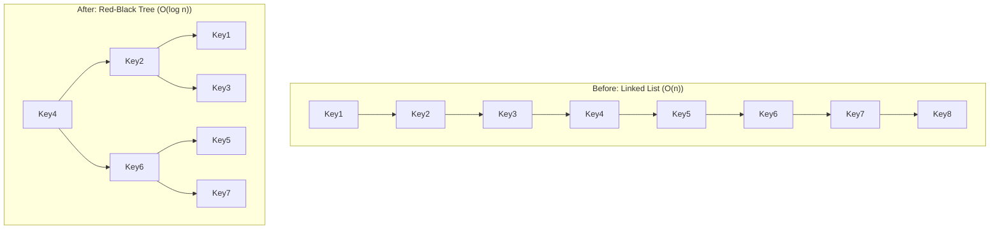

# HashMap Internals — How It Really Works

<!-- sdlc-stage:start -->
<div class="sdlc-stage">

📍 **SDLC stage: Development** · ShopNorth uses this in [Chapter 5 · Building with Spring Boot](/tutorials/journey-05-spring-boot)

</div>
<!-- sdlc-stage:end -->

## The Real-World Analogy

Imagine a **library** with 16 shelves. When a new book arrives, the librarian doesn't just put it anywhere — she looks at the book's title, does a quick calculation, and says *"This goes on shelf 7."*

That's exactly what HashMap does. The "calculation" is **hashing**, the "shelves" are **buckets**, and the "books" are your key-value pairs.

---

## 1. What Happens When You Do `map.put("name", "Alice")`?

Let's trace through step by step:

```java
HashMap<String, String> map = new HashMap<>();
map.put("name", "Alice");
```

### Step 1: Calculate the hash

```java
int hash = key.hashCode();  // "name".hashCode() → some integer like 3373707
```

### Step 2: Find the bucket index

```java
int index = hash & (capacity - 1);  // 3373707 & 15 = 11 (for default capacity 16)
```

> **Why `& (capacity - 1)` instead of `% capacity`?** Bitwise AND is much faster than modulo. This only works because capacity is always a power of 2.

### Step 3: Place it in the bucket

The entry goes into bucket 11. If bucket 11 is empty, done. If not — we have a **collision**.



---

## 2. Collisions — The Interesting Part

### Scenario: Two keys land in the same bucket

```java
map.put("name", "Alice");   // bucket 11
map.put("mane", "Bob");     // also bucket 11! (different key, same bucket)
```

When this happens, HashMap creates a **linked list** in that bucket:



### What happens during `get("mane")`?

1. Calculate hash → bucket 11
2. Go to bucket 11, find first node: key is `"name"` — not a match
3. Follow the link to next node: key is `"mane"` — **match!** Return `"Bob"`

> **This is why `equals()` and `hashCode()` contract matters.** HashMap uses `hashCode()` to find the bucket, then `equals()` to find the exact key within that bucket.

---

## 3. Tree-ification (Java 8+) — When Linked Lists Get Too Long

### The Problem

If many keys hash to the same bucket, the linked list grows long. Searching a linked list is **O(n)** — terrible for a data structure that promises O(1).

### The Solution

When a single bucket has **8 or more entries**, Java converts the linked list into a **Red-Black Tree**. Now lookup in that bucket is **O(log n)** instead of O(n).



### When does it convert back?

When the count drops to **6 or fewer**, it converts back to a linked list. The gap (8 to treeify, 6 to untreeify) prevents constant back-and-forth conversion.

---

## 4. Resizing — When the Map Gets Full

### Load Factor

Default load factor is **0.75**. This means: when 75% of buckets are occupied, **resize**.

```
Default capacity: 16
Threshold: 16 × 0.75 = 12
```

When you add the 13th entry → HashMap **doubles** its capacity to 32 and **rehashes** every entry.

### Why rehashing is expensive

```java
// Every single entry must be recalculated
for each entry:
    newIndex = entry.hash & (newCapacity - 1);  // different result now!
```

### Scenario: You know you'll store 1000 items

```java
// BAD — will resize multiple times: 16→32→64→128→256→512→1024→2048
HashMap<String, String> map = new HashMap<>();

// GOOD — no resizing needed (1000/0.75 = 1334, next power of 2 = 2048)
HashMap<String, String> map = new HashMap<>(2048);
```

<div class="callout-tip">

**Applying this**: When building any service that loads data into a HashMap (e.g., config cache, lookup table), always pre-size it. `new HashMap<>(expectedSize * 4 / 3 + 1)` avoids all resizing.

</div>

<div class="callout-interview">

🎯 **Interview Ready**: "If you know the size upfront, always set initial capacity to avoid expensive resize operations. The formula is `expectedSize / loadFactor + 1`, rounded to next power of 2."

</div>

---

## 5. The hashCode() and equals() Contract

### The Golden Rules

1. If `a.equals(b)` is true → `a.hashCode() == b.hashCode()` **must** be true
2. If `a.hashCode() == b.hashCode()` → `a.equals(b)` **may or may not** be true (collision)
3. If `a.equals(b)` is false → hashCodes **can** be same or different

### Scenario: Breaking the contract

```java
class Employee {
    String name;
    int id;

    // BROKEN: Override equals but NOT hashCode
    @Override
    public boolean equals(Object o) {
        if (this == o) return true;
        if (!(o instanceof Employee)) return false;
        return this.id == ((Employee) o).id;
    }
    // hashCode() not overridden — uses default Object.hashCode() (memory address)
}

Employee e1 = new Employee("Alice", 1);
Employee e2 = new Employee("Alice", 1);

map.put(e1, "Engineer");
map.get(e2);  // Returns NULL! Even though e1.equals(e2) is true!
```

**Why?** `e1` and `e2` have different `hashCode()` (different memory addresses), so they land in different buckets. HashMap never even checks `equals()`.

### The Fix

```java
@Override
public int hashCode() {
    return Objects.hash(id);  // Now e1 and e2 hash to the same bucket
}
```

---

## 6. Internal Structure — What's Really Inside

```java
// Simplified version of HashMap's internal Node
static class Node<K,V> {
    final int hash;      // cached hash of the key
    final K key;
    V value;
    Node<K,V> next;      // link to next node (for collisions)
}

// The bucket array
transient Node<K,V>[] table;  // default size 16
```

### Key fields

| Field | Default | Purpose |
|-------|---------|---------|
| `table` | `Node[16]` | The bucket array |
| `size` | 0 | Number of key-value pairs |
| `threshold` | 12 | When to resize (capacity × loadFactor) |
| `loadFactor` | 0.75 | How full before resize |

---

## 7. Real-World Decision Scenarios

### Scenario 1: Multi-threaded access

HashMap is **not thread-safe**. Two threads can cause **data loss** (Java 8+) or **infinite loops** (Java 7).

<div class="callout-scenario">

**Decision**: Building a shared cache accessed by multiple request threads? Use `ConcurrentHashMap`. Need a simple thread-safe wrapper with low contention? `Collections.synchronizedMap()`. Single-threaded hot path? Plain `HashMap` is fastest.

</div>

### Scenario 2: Null keys

HashMap allows **one null key** (stored in bucket 0). `ConcurrentHashMap` does NOT allow null keys.

### Scenario 3: Capacity is always a power of 2

`hash & (capacity - 1)` only works as modulo when capacity is power of 2. HashMap auto-rounds up.

```java
new HashMap<>(10);  // actual capacity = 16
new HashMap<>(17);  // actual capacity = 32
```

<div class="callout-interview">

🎯 **Interview Ready**: Common questions — (1) "Why is HashMap not thread-safe?" → Two threads can corrupt the bucket array during resize or simultaneous writes. (2) "Difference between HashMap and ConcurrentHashMap?" → HashMap: no locks, allows null key. CHM: segment/node-level locking, no null keys. (3) "Why power of 2 capacity?" → Enables fast `hash & (n-1)` instead of slow `hash % n`.

</div>

---

## 8. Performance Summary

| Operation | Average | Worst (many collisions) |
|-----------|---------|------------------------|
| `put()` | O(1) | O(log n) — tree, O(n) — list |
| `get()` | O(1) | O(log n) — tree, O(n) — list |
| `remove()` | O(1) | O(log n) — tree, O(n) — list |
| `containsKey()` | O(1) | O(log n) |
| `resize` | O(n) | O(n) |

---

## 9. Quick Cheat Sheet

```
HashMap<K,V>
├── Default capacity: 16
├── Load factor: 0.75
├── Resize at: capacity × 0.75
├── Resize to: capacity × 2
├── Collision handling: LinkedList → Red-Black Tree (at 8)
├── Null keys: 1 allowed (bucket 0)
├── Null values: unlimited
├── Thread-safe: NO
└── Iteration order: NOT guaranteed
```

> **Remember**: HashMap is like a smart librarian — fast at finding books (O(1)), but if too many books share the same shelf (collisions), things slow down. The librarian's solution? Reorganize the shelves (treeify) or get a bigger library (resize).

---

<!-- practice-pack -->

## 🏢 Real-World Scenarios

<div class="callout-scenario">

**Scenario**: A service caches user sessions in a `HashMap<SessionKey, Session>`. Memory grows steadily and lookups sometimes miss. `SessionKey` has a mutable `lastSeen` field included in `equals`/`hashCode`, updated on every request. **Decision**: Mutating a key's hash-relevant fields after insertion strands the entry in the wrong bucket — it can't be found or removed (a leak). Keys must be immutable (a `record SessionKey(String tenantId, String sessionId)`), and mutable data belongs in the value. In production, use a cache with expiry (Caffeine) instead of a raw map.

</div>

<div class="callout-scenario">

**Scenario**: An API receives JSON bodies whose keys are put into a `HashMap`. An attacker sends payloads with thousands of keys crafted to collide, and CPU spikes. **Decision**: This is a hash-flooding denial-of-service. Since Java 8, heavily collided buckets become red-black trees (for `Comparable` keys like `String`), limiting worst-case lookups to O(log n) instead of O(n). Still enforce request size and key-count limits at the edge (Jackson's `StreamReadConstraints`, gateway body limits) — defense in depth.

</div>

## 🏋️ Practice Assignments

### 🟢 Low — Build the reflexes

**L1.** A `HashMap` created with the default constructor receives 13 entries. How many resizes happen, and what's the final capacity?

<details>
<summary>Show answer</summary>

Default capacity 16, load factor 0.75 → threshold 12. The 13th insertion exceeds the threshold → **one resize** to capacity **32** (threshold 24). (The table is allocated lazily on the first `put`.)

</details>

**L2.** How does `HashMap` pick a bucket index from a key's `hashCode()`?

<details>
<summary>Show answer</summary>

It "spreads" the hash — `h ^ (h >>> 16)` — so high bits influence the index, then computes `index = (n - 1) & hash` where `n` is the table size (a power of two). The bitwise AND is a fast modulo that only works because `n` is a power of two.

</details>

**L3.** When does a bucket turn into a tree?

<details>
<summary>Show answer</summary>

When a bucket's chain exceeds **8** nodes (`TREEIFY_THRESHOLD`) **and** the table has at least **64** buckets (`MIN_TREEIFY_CAPACITY`); with a smaller table, the map resizes instead. A tree converts back to a list when it shrinks to **6** nodes (`UNTREEIFY_THRESHOLD`) during resize splits.

</details>

### 🟡 Medium — Apply it

**M1.** You're loading 1,000,000 known entries into a `HashMap` at startup. How do you avoid repeated resizing?

<details>
<summary>Show answer</summary>

Pre-size it: capacity must be ≥ expected / load factor → `new HashMap<>((int) Math.ceil(1_000_000 / 0.75))`, or on Java 19+ `HashMap.newHashMap(1_000_000)`, which does this calculation for you. Without it, the map resizes ~17 times, each resize rehashing all existing entries.

</details>

**M2.** Explain why iteration order of a `HashMap` can change after adding one element, and what to use if order matters.

<details>
<summary>Show answer</summary>

Iteration walks the bucket array; a resize doubles the array and redistributes entries (each entry either stays at index `i` or moves to `i + oldCap`), changing the order. `HashMap` makes no ordering promise at all. Use `LinkedHashMap` for insertion (or access) order, `TreeMap` for sorted order. Never write tests or logic that depend on `HashMap` order.

</details>

**M3.** Why can't `Hashtable`/`ConcurrentHashMap` store null keys or values, while `HashMap` can?

<details>
<summary>Show answer</summary>

In a concurrent map, `get(key) == null` is ambiguous — "absent" or "mapped to null" — and you can't follow up with `containsKey` atomically because another thread may change the map in between. Disallowing nulls removes that ambiguity. `HashMap` (single-threaded use) allows one null key (stored in bucket 0) and null values.

</details>

### 🔴 High — Think like a senior

**H1.** Implement a minimal `SimpleHashMap<K, V>` with `put`, `get`, `remove`, and resizing. What design choices do you make?

<details>
<summary>Show answer</summary>

```java
public class SimpleHashMap<K, V> {
    private static final class Node<K, V> {
        final int hash; final K key; V value; Node<K, V> next;
        Node(int hash, K key, V value, Node<K, V> next) { this.hash = hash; this.key = key; this.value = value; this.next = next; }
    }
    private Node<K, V>[] table = newTable(16);
    private int size;

    @SuppressWarnings("unchecked")
    private static <K, V> Node<K, V>[] newTable(int n) { return (Node<K, V>[]) new Node[n]; }
    private static int hash(Object key) { int h = key == null ? 0 : key.hashCode(); return h ^ (h >>> 16); }

    public V get(K key) {
        int h = hash(key);
        for (Node<K, V> n = table[(table.length - 1) & h]; n != null; n = n.next)
            if (n.hash == h && Objects.equals(n.key, key)) return n.value;
        return null;
    }

    public V put(K key, V value) {
        int h = hash(key), i = (table.length - 1) & h;
        for (Node<K, V> n = table[i]; n != null; n = n.next)
            if (n.hash == h && Objects.equals(n.key, key)) { V old = n.value; n.value = value; return old; }
        table[i] = new Node<>(h, key, value, table[i]);
        if (++size > table.length * 3 / 4) resize();
        return null;
    }

    public V remove(K key) {
        int h = hash(key), i = (table.length - 1) & h;
        for (Node<K, V> prev = null, n = table[i]; n != null; prev = n, n = n.next) {
            if (n.hash == h && Objects.equals(n.key, key)) {
                if (prev == null) table[i] = n.next; else prev.next = n.next;
                size--;
                return n.value;
            }
        }
        return null;
    }

    private void resize() {
        Node<K, V>[] old = table;
        table = newTable(old.length * 2);
        for (Node<K, V> head : old)
            for (Node<K, V> n = head; n != null; ) {
                Node<K, V> next = n.next;
                int i = (table.length - 1) & n.hash;          // reuse the stored hash — no recomputation
                n.next = table[i]; table[i] = n;
                n = next;
            }
    }
}
```

Choices to explain: power-of-two capacity for masking; cached hash in each node; compare hashes before `equals` (cheap filter); separate chaining; 0.75 load factor as the time/space trade-off; no treeification (mention it as the JDK's protection against collisions); not thread-safe by design.

</details>

**H2.** A service shows high GC pressure; a heap histogram shows millions of `HashMap$Node` objects in per-request maps that hold 3-5 entries each. What do you do?

<details>
<summary>Show answer</summary>

Each small `HashMap` costs a table array plus a node object per entry — heavy for tiny maps created per request. Options: use records/classes with fields instead of maps for fixed structures (the best fix — also type-safe); `Map.of(...)` for small immutable maps (compact implementations without nodes); `EnumMap` when keys are enums (array-backed); avoid converting DTOs to maps for logging/serialization. Measure allocation rate with JFR before and after.

</details>

## 🛠️ Mini Project — Build and Benchmark Your Own Map

**Goal**: Understand HashMap by building one and measuring it. 1-2 evenings.

**Build**

1. Implement `SimpleHashMap` (H1) with `put/get/remove/size/resize` and an iterator.
2. Property tests comparing it with `java.util.HashMap` on 100,000 random operations (same results for every `get` and `size`).
3. A deliberately bad key class whose `hashCode()` returns a constant; measure `get` time at 10K entries in your map vs `HashMap` (with `String` keys, JDK treeification kicks in; with a non-`Comparable` key, it can't order the tree as well).
4. JMH benchmarks: pre-sized vs default-sized maps for 1M inserts; `HashMap` vs `TreeMap` vs `LinkedHashMap` for get/put/iterate.

**Acceptance criteria**: property tests pass; a README table with benchmark results and a paragraph explaining each result using the concepts on this page.

## 🎯 Interview Corner

<div class="callout-interview">

**Q: "Explain how HashMap works internally."**

It's an array of buckets whose size is a power of two. On `put`, the key's `hashCode` is spread by XOR-ing in its high bits, and the index is computed as `(n - 1) & hash`. The entry goes into that bucket's chain, and if a node with an equal key exists — same hash and `equals` true — its value is replaced. `get` computes the same index and walks the bucket comparing hash first, then `equals`. When the size exceeds capacity times the load factor, 0.75 by default, the table doubles and entries are redistributed, each either staying at its index or moving by the old capacity. Since Java 8, a bucket with more than 8 nodes in a table of at least 64 becomes a red-black tree, bounding worst-case lookups to O(log n).

**Follow-up trap**: "Is HashMap thread-safe?" → No. Concurrent writes can lose updates or corrupt the structure, and reads may not see writes. Use `ConcurrentHashMap` or immutable snapshots.

</div>

<div class="callout-interview">

**Q: "What happens if two keys have the same hashCode?"**

They land in the same bucket — a collision — and are stored together: in a linked list, or in a tree once the bucket grows past the treeify threshold. Lookups still work, because after matching the hash the map uses `equals` to find the exact key. Correctness depends on the contract that equal objects have equal hash codes, but performance depends on hash quality: many collisions degrade lookups from O(1) toward O(log n) with trees, or O(n) with long chains. That's why a good `hashCode` distributes values well, and why mutable keys are dangerous.

</div>

<div class="callout-interview">

**Q: "Why is the HashMap capacity always a power of two?"**

So the bucket index can be computed with a fast bitwise AND, `(n - 1) & hash`, instead of a slower modulo. It also makes resizing efficient: when the table doubles, each entry either stays at the same index or moves exactly `oldCapacity` positions, depending on one extra bit of its hash, so entries don't need full rehashing. The downside is that only the low bits of the hash choose the bucket, which is why HashMap spreads the hash by XOR-ing the high 16 bits into the low bits.

</div>

---

<!-- journey-link:start -->

<div class="callout-journey">

🛒 **ShopNorth Journey** — ShopNorth's checkout works with maps of SKU to current price; Chapter 9 shows why a plain HashMap shared across threads is a bug.

**Continue the story:** [Chapter 5 · Building with Spring Boot](/tutorials/journey-05-spring-boot) · **New here?** [Start the journey](/tutorials/journey-start)

</div>

<!-- journey-link:end -->
