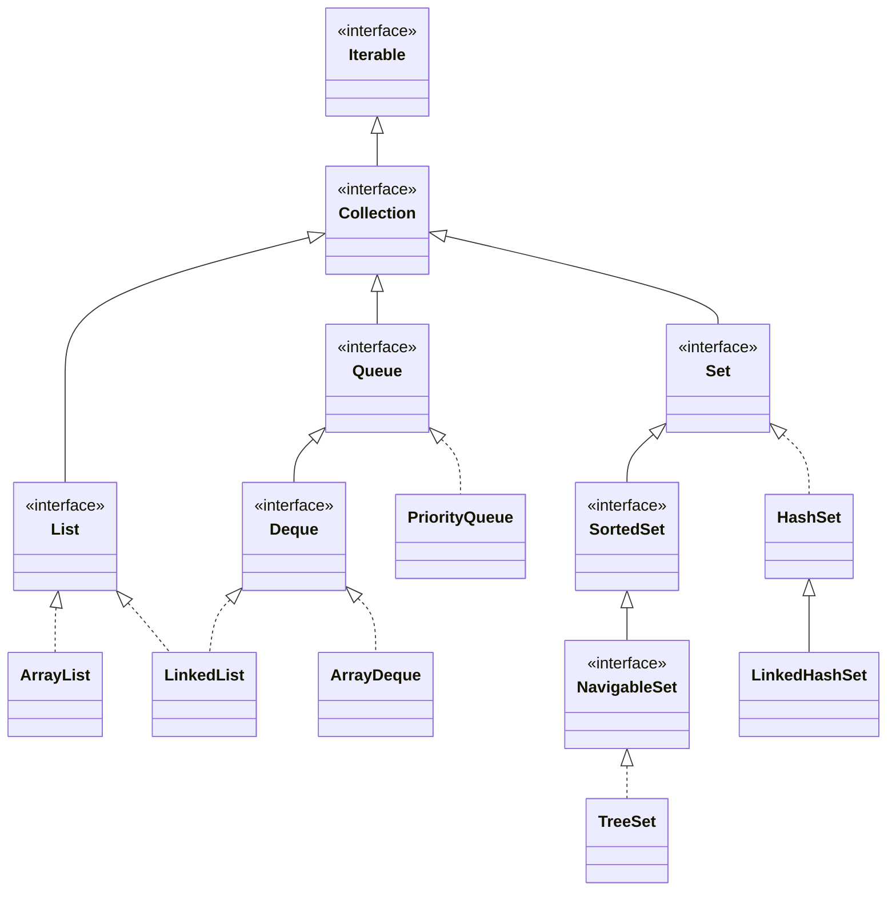

# Collections — List, Queue, Set: Picking the Right One Under Pressure

> `HashMap` has its own deep dive (`hashmap-internals`); this page covers everything else you reach for daily.

---

## Table of Contents

1. The Warehouse Analogy
2. The Collections Map (Hierarchy)
3. List — ArrayList vs LinkedList
4. Queue & Deque — ArrayDeque, PriorityQueue
5. Set — HashSet, LinkedHashSet, TreeSet
6. Comparable vs Comparator
7. Iteration, Fail-Fast, and Removal
8. Immutable & Unmodifiable Collections
9. Concurrent Collections — When Threads Get Involved
10. Practice Assignments (Low / Medium / High)
11. Mini Project — Order Book & Task Scheduler
12. Interview Corner
13. Quick Reference

---

## 1. The Warehouse Analogy

A warehouse stores goods in different ways depending on what workers need to do:

- **Numbered shelves in a row** — grab item #4,512 instantly, but inserting a new shelf in the middle means shifting everything after it. → `ArrayList`
- **Items tied together with string**, each pointing to the next — easy to splice one in *if you're already standing there*, but finding #4,512 means following 4,512 strings. → `LinkedList`
- **A conveyor belt** — items go in one end, come out the other. → `Queue` / `ArrayDeque`
- **An emergency triage desk** — the most urgent item always comes out first, regardless of arrival order. → `PriorityQueue`
- **A registry that refuses duplicates** — "we already have this one". → `Set`
- **A registry that also keeps everything alphabetized.** → `TreeSet`

The interview skill isn't memorizing APIs; it's matching the **access pattern** to the structure.

---

## 2. The Collections Map



`Map` is **not** a `Collection` — it's a separate hierarchy (`HashMap`, `LinkedHashMap`, `TreeMap`). Java 21 added `SequencedCollection` / `SequencedSet` / `SequencedMap` with `getFirst()`, `getLast()`, `reversed()` across ordered collections.

---

## 3. List — ArrayList vs LinkedList

### Big-O table (know this cold)

| Operation | `ArrayList` | `LinkedList` |
|-----------|-------------|--------------|
| `get(i)` | **O(1)** | O(n) — walks from the nearer end |
| `add(e)` at end | **O(1) amortized** | O(1) |
| `add(0, e)` at start | O(n) — shifts everything | **O(1)** |
| `add(i, e)` in middle | O(n) shift | O(n) to *find* i, then O(1) link |
| `remove(i)` | O(n) shift | O(n) find + O(1) unlink |
| `contains(e)` | O(n) | O(n) |
| Memory per element | ~4-8 bytes (a reference in an array) | ~24-40 bytes (node object + prev + next refs) |
| CPU cache | ✅ Contiguous → prefetch-friendly | ❌ Pointer-chasing across the heap |

### How ArrayList grows

```java
List<Order> orders = new ArrayList<>();      // lazily allocates capacity 10 on first add
// when full: newCapacity = old + old/2  (1.5x) → Arrays.copyOf → old array becomes garbage
```

If you know the size, pre-size it: `new ArrayList<>(expectedSize)`. It avoids ~log₁.₅(n) copies.

<div class="callout-scenario">

**Scenario**: A teammate chose `LinkedList` for a 50,000-element list of trades "because we insert a lot". Profiling shows most time in `get(i)` inside a `for (int i...)` loop — O(n²) overall. **Decision**: Switch to `ArrayList`. In practice `ArrayList` beats `LinkedList` even for many middle insertions because `System.arraycopy` is a single fast memory move, while `LinkedList` must first *walk* to the position. Use `ArrayDeque` if you need cheap insertion at both ends.

</div>

<div class="callout-interview">

**Q: "When would you actually use LinkedList?"**

Almost never in modern Java. Its theoretical O(1) insert only holds if you already hold a `ListIterator` at the position; otherwise you pay O(n) to get there, and poor cache locality makes it slower than `ArrayList` in benchmarks. For queue or stack behavior I use `ArrayDeque`. Unlike `ArrayDeque`, `LinkedList` does allow `null` elements, which is rarely a good reason.

</div>

### `List.remove` overload trap

```java
List<Integer> ids = new ArrayList<>(List.of(10, 20, 30));
ids.remove(1);                    // removes INDEX 1 → [10, 30]
ids.remove(Integer.valueOf(10));  // removes VALUE 10 → [30]
```

---

## 4. Queue & Deque — ArrayDeque, PriorityQueue

### The method pairs — throw vs return special value

| | Throws exception | Returns null / false |
|--|------------------|----------------------|
| Insert | `add(e)` | `offer(e)` |
| Remove head | `remove()` | `poll()` |
| Peek head | `element()` | `peek()` |

For bounded queues (like `ArrayBlockingQueue`), `offer` returning `false` is how you detect "full" without exceptions.

### ArrayDeque — your default stack AND queue

```java
Deque<String> stack = new ArrayDeque<>();
stack.push("page1"); stack.push("page2");
stack.pop();                         // "page2"  — LIFO (browser back button)

Queue<String> queue = new ArrayDeque<>();
queue.offer("job1"); queue.offer("job2");
queue.poll();                        // "job1"   — FIFO
```

<div class="callout-warn">

**Don't use `java.util.Stack`.** It extends `Vector` (every method `synchronized`, legacy) and lets you `add`/`get` by index, which breaks the stack abstraction. The Javadoc itself recommends `Deque<T> stack = new ArrayDeque<>()`. Note that `ArrayDeque` rejects `null` elements.

</div>

### PriorityQueue — a binary min-heap

| Operation | Cost |
|-----------|------|
| `offer` | O(log n) — sift up |
| `poll` | O(log n) — sift down |
| `peek` | O(1) |
| `contains` / `remove(Object)` | O(n) |
| Iteration order | ❌ **Not sorted!** Only `poll()` order is sorted |

```java
record Ticket(String id, int severity, Instant createdAt) {}

// Highest severity first; ties → oldest first
PriorityQueue<Ticket> triage = new PriorityQueue<>(
    Comparator.comparingInt(Ticket::severity).reversed()
              .thenComparing(Ticket::createdAt));

triage.offer(new Ticket("T1", 2, t0));
triage.offer(new Ticket("T2", 5, t1));
triage.poll();   // T2
```

### Top-K pattern (classic interview + real use)

"Find the 10 highest-value orders out of 10 million" — don't sort everything (O(n log n)). Keep a **min-heap of size K**:

```java
PriorityQueue<Order> top = new PriorityQueue<>(Comparator.comparing(Order::amount)); // min-heap
for (Order o : orders) {
    top.offer(o);
    if (top.size() > 10) top.poll();   // evict the smallest
}
// O(n log k) time, O(k) memory — works on a stream too
```

<div class="callout-tip">

**Applying this** — The Top-K heap is how you'd build a "top 10 products in the last hour" widget from a Kafka stream without holding every event in memory. The same idea powers leaderboards and "k nearest" searches.

</div>

---

## 5. Set — HashSet, LinkedHashSet, TreeSet

| | `HashSet` | `LinkedHashSet` | `TreeSet` |
|--|-----------|-----------------|-----------|
| Backed by | `HashMap` (values are a dummy object) | `LinkedHashMap` | `TreeMap` (red-black tree) |
| Order | None (can change on resize) | **Insertion order** | **Sorted** (natural or `Comparator`) |
| add / contains / remove | O(1) average | O(1) average | O(log n) |
| Uniqueness decided by | `hashCode` + `equals` | `hashCode` + `equals` | **`compareTo` / `compare`** — `equals` is ignored! |
| `null` | One allowed | One allowed | ❌ NPE (with natural ordering) |
| Extra powers | — | Predictable iteration | `first`, `last`, `floor`, `ceiling`, `headSet`, `tailSet`, `subSet` |

### The TreeSet uniqueness trap

```java
record Employee(String name, int salary) {}

Set<Employee> bySalary = new TreeSet<>(Comparator.comparingInt(Employee::salary));
bySalary.add(new Employee("Asha", 90_000));
bySalary.add(new Employee("Ravi", 90_000));   // compare == 0 → treated as DUPLICATE, silently dropped
System.out.println(bySalary.size());            // 1 😱
```

**Fix**: make the comparator consistent with equals by adding a tie-breaker: `.thenComparing(Employee::name)`.

### NavigableSet — underused superpower

```java
TreeSet<LocalTime> slots = new TreeSet<>(List.of(
    LocalTime.of(9, 0), LocalTime.of(10, 30), LocalTime.of(14, 0), LocalTime.of(16, 0)));

slots.ceiling(LocalTime.of(10, 0));   // 10:30 — next available slot at/after 10:00
slots.floor(LocalTime.of(15, 0));     // 14:00 — latest slot at/before 15:00
slots.headSet(LocalTime.of(12, 0));   // [09:00, 10:30] — morning slots
```

<div class="callout-scenario">

**Scenario**: You're building a meeting-room booking service and need "the next free slot after time T" thousands of times a second. **Answer**: A `TreeSet<LocalTime>` (or a `TreeMap<LocalTime, Booking>`) per room gives `ceiling()` in O(log n). A sorted `ArrayList` + binary search also works for read-heavy, rarely-changing data, but any insert costs O(n).

</div>

---

## 6. Comparable vs Comparator

| | `Comparable<T>` | `Comparator<T>` |
|--|-----------------|-----------------|
| Package | `java.lang` | `java.util` |
| Method | `compareTo(T other)` | `compare(T a, T b)` |
| Where defined | **Inside** the class | **Outside** — a separate object or lambda |
| How many | One: the "natural order" | As many as you like |
| Used by | `Collections.sort(list)`, `TreeSet<>()` with no args | `list.sort(cmp)`, `new TreeSet<>(cmp)`, streams |
| Examples | `String`, `Integer`, `LocalDate`, `BigDecimal` | "by price", "by rating desc then name" |

```java
public record Product(String sku, String name, BigDecimal price, double rating)
        implements Comparable<Product> {
    @Override public int compareTo(Product o) { return sku.compareTo(o.sku); }  // natural: by SKU
}

// Comparator composition — read it like English
Comparator<Product> forListingPage =
    Comparator.comparingDouble(Product::rating).reversed()
              .thenComparing(Product::price)
              .thenComparing(Product::name, String.CASE_INSENSITIVE_ORDER);

products.sort(forListingPage);
```

❌ The subtraction trick:

```java
Comparator<Order> bad = (a, b) -> a.quantity() - b.quantity();   // overflows for large/negative values
Comparator<Order> good = Comparator.comparingInt(Order::quantity); // uses Integer.compare
```

`Integer.MIN_VALUE - 1` overflows to a large positive number → wrong order, and sometimes `IllegalArgumentException: Comparison method violates its general contract!` from TimSort.

<div class="callout-interview">

**Q: "Comparable vs Comparator?"**

`Comparable` defines a class's one natural ordering inside the class via `compareTo`. `Comparator` is an external strategy, so you can have many orderings without touching the class, which is useful for sorting by different fields or for classes you don't own. I keep natural ordering consistent with `equals`, and use `Comparator.comparing(...).thenComparing(...)` rather than hand-written subtraction, which can overflow.

</div>

---

## 7. Iteration, Fail-Fast, and Removal

```java
List<Order> orders = new ArrayList<>(loadOrders());

// ❌ ConcurrentModificationException
for (Order o : orders) {
    if (o.isCancelled()) orders.remove(o);
}
```

The enhanced `for` uses an `Iterator`. `ArrayList` keeps a `modCount`; the iterator remembers the value it expects, and a structural change not made through the iterator makes `next()` throw. This is **fail-fast** (best-effort — a bug detector, not a thread-safety mechanism).

✅ Correct ways:

```java
orders.removeIf(Order::isCancelled);                       // best: clear and efficient

Iterator<Order> it = orders.iterator();                    // classic
while (it.hasNext()) if (it.next().isCancelled()) it.remove();

List<Order> active = orders.stream().filter(o -> !o.isCancelled()).toList();  // new list
```

| Iterator type | Collections | Behavior on concurrent change |
|---------------|-------------|-------------------------------|
| Fail-fast | `ArrayList`, `HashMap`, `HashSet`, `TreeMap` | Throws `ConcurrentModificationException` |
| Weakly consistent | `ConcurrentHashMap`, `ConcurrentLinkedQueue` | Never throws; may or may not see recent changes |
| Snapshot | `CopyOnWriteArrayList` | Iterates the array as it was when the iterator was created |

---

## 8. Immutable & Unmodifiable Collections

| Creation | Mutable? | Nulls? | Notes |
|----------|----------|--------|-------|
| `List.of(a, b)` / `Set.of` / `Map.of` (Java 9) | ❌ Immutable | ❌ NPE | `Set.of` rejects duplicates with an exception; iteration order unspecified |
| `List.copyOf(coll)` (Java 10) | ❌ Immutable copy | ❌ | Returns the same instance if already immutable |
| `Collections.unmodifiableList(list)` | ❌ through this reference | ✅ | A **view** — changes to the backing list show through! |
| `Arrays.asList(arr)` | ⚠️ Fixed-size: `set` ✅, `add/remove` ❌ | ✅ | Backed by the array |
| `stream.toList()` (Java 16) | ❌ Unmodifiable | ✅ | vs `collect(Collectors.toList())` → mutable `ArrayList` in practice |

```java
List<String> base = new ArrayList<>(List.of("a"));
List<String> view = Collections.unmodifiableList(base);
base.add("b");
System.out.println(view);   // [a, b] — the "unmodifiable" list changed
```

---

## 9. Concurrent Collections — When Threads Get Involved

| Need | Use | Avoid |
|------|-----|-------|
| Thread-safe map | `ConcurrentHashMap` | `Hashtable`, `Collections.synchronizedMap` (single lock) |
| Read-mostly list (listeners, config) | `CopyOnWriteArrayList` — copies the array on every write | Using it for write-heavy lists |
| Producer/consumer | `ArrayBlockingQueue` (bounded) / `LinkedBlockingQueue` | Unbounded queues without backpressure |
| Non-blocking queue | `ConcurrentLinkedQueue` / `ConcurrentLinkedDeque` | — |
| Sorted + concurrent | `ConcurrentSkipListMap` / `ConcurrentSkipListSet` | `synchronized` `TreeMap` |
| Delayed tasks | `DelayQueue`, or better `ScheduledExecutorService` | — |

```java
BlockingQueue<Email> outbox = new ArrayBlockingQueue<>(1_000);  // bounded = backpressure

// producer (request thread)
if (!outbox.offer(email, 50, TimeUnit.MILLISECONDS)) {
    metrics.increment("email.dropped");    // queue full: shed load instead of OOM
}

// consumer (worker thread)
while (running) {
    Email e = outbox.take();               // blocks while empty
    smtp.send(e);
}
```

<div class="callout-tip">

**Applying this** — Every in-memory queue between threads in production should be **bounded**. An unbounded `LinkedBlockingQueue` (the default in `Executors.newFixedThreadPool`!) turns a slow downstream into an `OutOfMemoryError`. Build `ThreadPoolExecutor` explicitly with a bounded queue and a rejection policy.

</div>

---

## 10. 🏋️ Practice Assignments

### 🟢 Low — Build the reflexes

**L1.** Pick the collection: (a) browser back/forward history, (b) unique visitor IDs today, (c) leaderboard always sorted by score, (d) FIFO print jobs, (e) remember insertion order of unique tags.

<details>
<summary>Show answer</summary>

(a) Two `ArrayDeque` stacks (back and forward). (b) `HashSet<String>` (or HyperLogLog at massive scale). (c) `TreeSet` with a comparator (score desc, then id — a tie-breaker is required!) or `TreeMap<Score, ...>`; `PriorityQueue` if you only need the top. (d) `ArrayDeque` as a `Queue` (or a `BlockingQueue` across threads). (e) `LinkedHashSet`.

</details>

**L2.** What prints?

```java
List<Integer> list = new ArrayList<>(List.of(5, 10, 15));
list.remove(1);
list.remove(Integer.valueOf(5));
System.out.println(list);
```

<details>
<summary>Show answer</summary>

`[15]`. `remove(1)` removes index 1 (the value 10) → `[5, 15]`. `remove(Integer.valueOf(5))` removes the value 5 → `[15]`.

</details>

**L3.** Why does `PriorityQueue` print in a "weird" order with `System.out.println(pq)`?

<details>
<summary>Show answer</summary>

`toString` and iteration walk the underlying **heap array**, which is only partially ordered (each parent ≤ its children). Only repeated `poll()` returns elements in sorted order.

</details>

### 🟡 Medium — Apply it

**M1.** Implement an LRU cache with capacity N using only JDK collections, in under 10 lines.

<details>
<summary>Show answer</summary>

```java
class LruCache<K, V> extends LinkedHashMap<K, V> {
    private final int capacity;
    LruCache(int capacity) {
        super(16, 0.75f, true);   // accessOrder = true: get() moves the entry to the end
        this.capacity = capacity;
    }
    @Override protected boolean removeEldestEntry(Map.Entry<K, V> eldest) {
        return size() > capacity;
    }
}
```

O(1) `get`/`put`. Not thread-safe; in production use Caffeine.

</details>

**M2.** Given a list of transactions, return the distinct merchant names sorted case-insensitively, keeping the first-seen original casing.

<details>
<summary>Show answer</summary>

```java
Map<String, String> firstSeen = new LinkedHashMap<>();
for (Transaction t : txns) {
    firstSeen.putIfAbsent(t.merchant().toLowerCase(Locale.ROOT), t.merchant());
}
List<String> result = firstSeen.values().stream()
    .sorted(String.CASE_INSENSITIVE_ORDER)
    .toList();
```

(A `TreeSet<>(String.CASE_INSENSITIVE_ORDER)` also dedupes case-insensitively and keeps the first-inserted casing, since `add` doesn't replace an existing "equal" element.)

</details>

**M3.** Find the k most frequent words in a document in O(n log k).

<details>
<summary>Show answer</summary>

```java
Map<String, Integer> freq = new HashMap<>();
for (String w : words) freq.merge(w, 1, Integer::sum);

PriorityQueue<Map.Entry<String, Integer>> heap = new PriorityQueue<>(
    Map.Entry.<String, Integer>comparingByValue()
        .thenComparing(Map.Entry.<String, Integer>comparingByKey(Comparator.reverseOrder())));

for (var e : freq.entrySet()) {
    heap.offer(e);
    if (heap.size() > k) heap.poll();          // evict the least frequent
}
List<String> top = new ArrayList<>();
while (!heap.isEmpty()) top.add(heap.poll().getKey());
Collections.reverse(top);                      // most frequent first
```

Counting O(n); heap O(m log k) for m distinct words. The reverse-key tie-breaker makes the final result alphabetical on ties.

</details>

### 🔴 High — Think like a senior

**H1.** A notification service keeps `List<Listener> listeners` in an `ArrayList`. Listeners register at startup and occasionally at runtime, and each event iterates the list from 50 request threads. Users report sporadic `ConcurrentModificationException` and, rarely, a missed listener. Diagnose and fix, with trade-offs.

<details>
<summary>Show answer</summary>

`ArrayList` isn't thread-safe: concurrent `add` during iteration triggers the fail-fast CME, and unsynchronized adds can be lost (two threads write the same slot) or be invisible to other threads (no happens-before). The workload is read-mostly, so use `CopyOnWriteArrayList`: iteration is lock-free over a snapshot and never throws; each write copies the array, which is fine for rare registration. Alternatives: `Collections.synchronizedList` (you must still hold the lock while iterating — slow for 50 readers), or an immutable `List` in a `volatile` field replaced on registration (the same idea, done manually). Mention that a listener added mid-dispatch won't see that event (snapshot semantics), which is usually acceptable.

</details>

**H2.** Design an in-memory rate limiter for "max 100 requests per user per sliding 60 seconds" and pick the data structures.

<details>
<summary>Show answer</summary>

`ConcurrentHashMap<String, Deque<Long>>` — per user, a deque of request timestamps. On each request: under a per-user lock (`compute` or synchronizing on the deque), pop from the head while `head < now - 60_000`; if `size() >= 100` reject, else `addLast(now)`. That's O(1) amortized per request and O(limit) memory per active user. Add eviction of idle users (a scheduled sweep, or use Caffeine with `expireAfterAccess`) or the map grows forever. At scale, switch to a sliding-window **counter** (two buckets weighted) to cut memory from 100 longs to 2 ints per user, and to Redis (`ZSET` or Lua script) once you run more than one instance.

</details>

---

## 11. 🛠️ Mini Project — Order Book & Task Scheduler

**Goal**: Two small console programs that force you to pick collections deliberately. 2 evenings.

### Part A — Stock Order Book (TreeMap + ArrayDeque)

- Buy orders: `TreeMap<BigDecimal, Deque<Order>>` sorted **descending** by price (highest bid first).
- Sell orders: `TreeMap<BigDecimal, Deque<Order>>` sorted **ascending** (lowest ask first).
- Within one price level: FIFO via `ArrayDeque` (price-time priority).
- `submit(order)`: match against the opposite book while prices cross (`bid >= ask`), filling partially if needed; rest the remainder in its book.
- Print the top 5 levels of each side after each submission (`descendingMap()`, `firstEntry()`, `pollFirstEntry()`).

### Part B — Task Scheduler (PriorityQueue + HashMap)

- `schedule(taskId, runAt, priority)`, `cancel(taskId)`, `nextDue(now)`.
- `PriorityQueue<Task>` ordered by `runAt`, then priority desc, then `taskId`.
- Cancel in O(1) using **lazy deletion**: keep `Map<String, Task> active`; on cancel, remove from the map only; when polling, skip tasks no longer in `active`.

**Acceptance criteria**

- Unit tests for partial fills, same-price FIFO, and cancel-then-poll.
- A short `README` explaining *why* each collection was chosen, with Big-O for each operation.
- A 1M-order benchmark (JMH, or at least `System.nanoTime`) for matching throughput.

**Stretch**: make the scheduler thread-safe with a `DelayQueue` or `ReentrantLock` + `Condition`, with a worker thread that sleeps until the next task is due.

---

## 🎯 Interview Corner

<div class="callout-interview">

**Q: "ArrayList vs LinkedList — which would you use and why?"**

`ArrayList` in almost every case. It gives O(1) random access, amortized O(1) appends, and contiguous memory that CPU caches love. `LinkedList` only wins in theory, for insertions and removals at a position you already hold an iterator to. In practice, walking to that position is O(n) pointer-chasing, and each node costs roughly 24-40 bytes of overhead versus one reference slot. For queue or stack semantics I use `ArrayDeque`, which is faster than `LinkedList` at both ends. If I know the size up front, I pre-size the `ArrayList` to avoid repeated grow-and-copy.

**Follow-up trap**: "But inserting in the middle of an ArrayList is O(n)!" → Yes, but it's one `System.arraycopy`, a very fast bulk memory move. LinkedList is also O(n) to *reach* the middle, and slower per step.

</div>

<div class="callout-interview">

**Q: "How does a HashSet guarantee uniqueness, and how is that different from a TreeSet?"**

A `HashSet` is backed by a `HashMap` whose keys are the elements. On `add`, it hashes the element to a bucket and uses `equals` to check for an existing match, so uniqueness depends on a correct `hashCode`/`equals` pair. A `TreeSet` is backed by a red-black tree and uses `compareTo` or the supplied `Comparator`: if the comparison returns 0, the element counts as a duplicate even when `equals` says false. So a `TreeSet` sorted by salary alone silently drops employees with equal salaries. The comparator must be consistent with equals, usually by adding a tie-breaker.

</div>

<div class="callout-interview">

**Q: "You get ConcurrentModificationException in production. What are the possible causes?"**

There are two families. The single-threaded one is modifying a collection while iterating it with a for-each loop, for example calling `list.remove()` inside the loop. The fix is `removeIf`, `Iterator.remove()`, or building a new list. The multi-threaded one is another thread structurally modifying a non-thread-safe collection during iteration. CME is only a best-effort signal there; the deeper issue is a data race that can also lose writes silently. The fix is a concurrent collection that matches the access pattern: `CopyOnWriteArrayList` for read-mostly data, `ConcurrentHashMap`, or proper locking — or better, avoid shared mutable state.

**Follow-up trap**: "So wrapping it in Collections.synchronizedList fixes it?" → Only if you also synchronize on the list during iteration, because iteration is a compound operation made of many calls.

</div>

<div class="callout-interview">

**Q: "Design the data structure behind a 'recently viewed products' feature: last 20 items, no duplicates, most recent first."**

In-process, a `LinkedHashSet` per user works: on view, remove the product and re-add it so it moves to the end, then drop the eldest if size exceeds 20. Or use a `LinkedHashMap` in access order with `removeEldestEntry` — the LRU pattern — which gives O(1) operations. Across a fleet of stateless services, I'd store it in Redis: `LREM` + `LPUSH` + `LTRIM 0 19` in a pipeline, or a sorted set scored by timestamp with `ZREMRANGEBYRANK`. The key design points are dedupe-and-move-to-front, a bounded size, and O(1) updates on every page view.

</div>

---

## Quick Reference

| Need | Pick | Key cost |
|------|------|----------|
| Indexed list | `ArrayList` | `get` O(1), mid-insert O(n) |
| Stack / queue / both ends | `ArrayDeque` | O(1) ends, no nulls |
| Always get min/max | `PriorityQueue` | O(log n) offer/poll, iteration unsorted |
| Unique, fast | `HashSet` | O(1), needs good equals/hashCode |
| Unique, insertion order | `LinkedHashSet` | O(1) |
| Unique, sorted, range queries | `TreeSet` | O(log n), uses compareTo for uniqueness |
| LRU | `LinkedHashMap(accessOrder=true)` | O(1) |
| Read-mostly, threads | `CopyOnWriteArrayList` | Write = full copy |
| Producer/consumer | `ArrayBlockingQueue` | Bounded = backpressure |
| Safe removal while iterating | `removeIf` / `Iterator.remove` | — |
| Immutable | `List.of` / `List.copyOf` / `stream.toList()` | No nulls (except `toList`) |

---

## Related Topics

- `hashmap-internals` — the engine under HashSet
- `concurrent-hashmap` — lock striping and CAS in depth
- `java-equals-hashcode` — why Set uniqueness depends on it
- `dsa-two-pointers`, `dsa-sliding-window` — these collections in algorithm problems

> **Choose a collection by how you'll read it, not by how you'll write it — reads usually outnumber writes a hundred to one.**

---

<!-- journey-link:start -->

<div class="callout-journey">

🛒 **ShopNorth Journey** — ShopNorth's order service uses defensive unmodifiable copies (List.copyOf) and maps of SKU to price throughout checkout.

**Continue the story:** [Chapter 5 · Building with Spring Boot](/tutorials/journey-05-spring-boot) · **New here?** [Start the journey](/tutorials/journey-start)

</div>

<!-- journey-link:end -->
