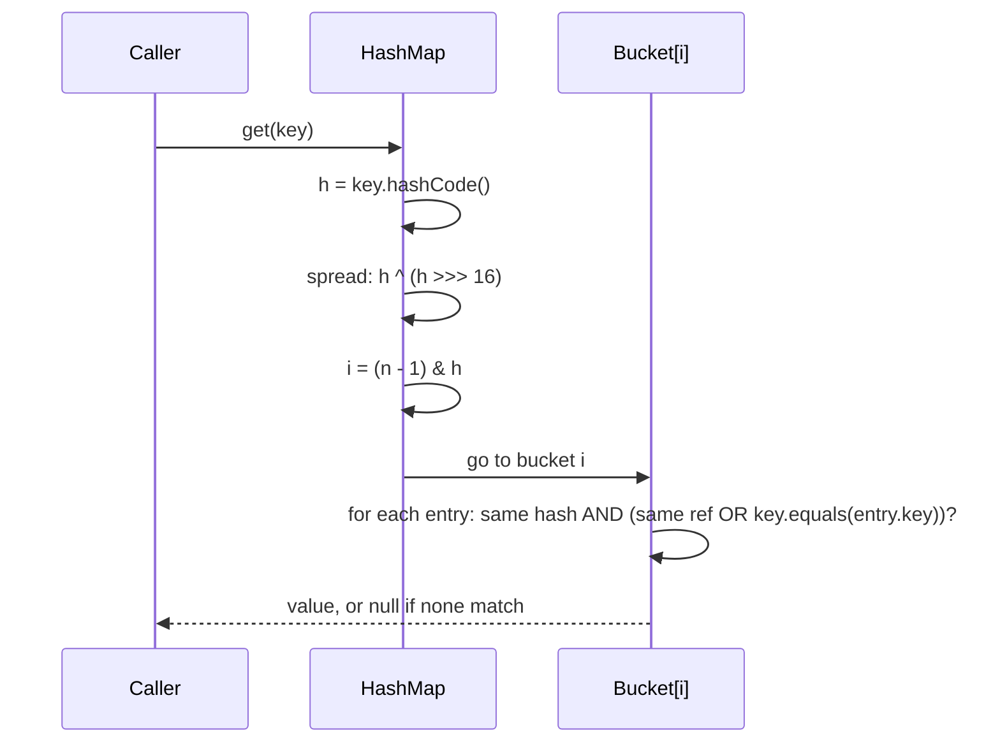

# equals(), hashCode() & Immutability — The Contract That Keeps HashMap Honest

<!-- sdlc-stage:start -->
<div class="sdlc-stage">

📍 **SDLC stage: Design — low-level design** · ShopNorth uses this in [Chapter 3 · Low-Level Design](/tutorials/journey-03-low-level-design)

</div>
<!-- sdlc-stage:end -->

> This topic shows up in nearly every Java interview, usually disguised as a "why is my HashMap returning null?" bug.

---

## Table of Contents

1. The Coat-Check Analogy
2. `==` vs `.equals()`
3. The equals() Contract
4. The hashCode() Contract — and Why It Exists
5. Breaking the Contract — Real Bugs
6. Writing equals/hashCode Correctly (and Records)
7. JPA Entities — The Special Case
8. Immutability — Designing Immutable Classes
9. Practice Assignments (Low / Medium / High)
10. Mini Project — Money & Cache-Key Library
11. Interview Corner
12. Quick Reference

---

## 1. The Coat-Check Analogy

You hand your coat at a theatre coat check. The attendant hangs it on **rack 7** (based on, say, the first letter of your surname) and gives you a ticket.

Later you come back. The attendant:

1. Computes your rack number again → goes to **rack 7** (that's `hashCode()`).
2. Looks through the few coats on rack 7 and compares tickets to find **yours** (that's `equals()`).

Now imagine two problems:

- The attendant computes a **different rack** today than yesterday (your surname "changed") → they look on the wrong rack and say "no such coat". That's a **mutable key** or a **broken hashCode**.
- Two identical tickets map to **different racks** → the attendant never finds the match. That's **equals without hashCode**.

`HashMap`, `HashSet`, and `ConcurrentHashMap` all work exactly like this coat check.

---

## 2. `==` vs `.equals()`

| | `==` | `.equals()` |
|--|------|-------------|
| For primitives | Compares values | N/A |
| For objects | Compares **references** (same object in memory?) | Compares **logical equality** — whatever the class defines |
| Default in `Object` | — | Same as `==` (identity) until you override it |
| Null-safe | Yes | No — `null.equals(x)` throws NPE; use `Objects.equals(a, b)` |

```java
String a = new String("order-42");
String b = new String("order-42");

a == b;        // false — two different objects
a.equals(b);   // true  — same characters

Integer x = 127, y = 127;
x == y;        // true  — Integer cache (-128..127)
Integer p = 128, q = 128;
p == q;        // false — outside the cache, different objects!
p.equals(q);   // true
```

<div class="callout-warn">

**The Integer cache bug is real in production**: comparing two `Long` IDs from JPA entities with `==` works in dev (small IDs, cached) and fails in prod when IDs exceed 127. Always use `.equals()` or `Objects.equals()` for wrapper types.

</div>

---

## 3. The equals() Contract

From the `Object.equals` Javadoc — you should be able to list these five:

| Property | Meaning | How it breaks in practice |
|----------|---------|---------------------------|
| **Reflexive** | `x.equals(x)` is `true` | Rare; comparing a field that's `NaN` with `==` |
| **Symmetric** | `x.equals(y)` ⇔ `y.equals(x)` | Comparing with a different type ("case-insensitive string" equal to a `String`) |
| **Transitive** | `x=y` and `y=z` ⇒ `x=z` | Subclass adds a field and tries to stay equal to the parent |
| **Consistent** | Same result every call if nothing changed | equals depends on a mutable field or external resource (`java.net.URL` does DNS lookups!) |
| **Non-null** | `x.equals(null)` is `false` | Forgetting the null check → NPE |

### Symmetry violation — the classic

```java
public final class CaseInsensitiveString {
    private final String s;
    public CaseInsensitiveString(String s) { this.s = s; }

    @Override public boolean equals(Object o) {
        if (o instanceof CaseInsensitiveString cis) return s.equalsIgnoreCase(cis.s);
        if (o instanceof String str) return s.equalsIgnoreCase(str);   // ❌ one-way street
        return false;
    }
}

var cis = new CaseInsensitiveString("Polish");
"polish".equals(cis);   // false — String knows nothing about our class
cis.equals("polish");   // true   → symmetry broken
```

Put both in a `List` and `list.contains(...)` gives different answers depending on which side the JDK compares from. **Fix**: only compare with your own type.

### Transitivity violation — subclass with extra state

```java
class Point { int x, y; /* equals compares x, y */ }
class ColorPoint extends Point { Color color; /* equals compares x, y, color */ }
```

There is **no way** to extend an instantiable class with a new value field and keep the `equals` contract (Effective Java, Item 10). Prefer composition: `ColorPoint` *has a* `Point`.

---

## 4. The hashCode() Contract — and Why It Exists

1. **If `a.equals(b)` then `a.hashCode() == b.hashCode()`** — mandatory.
2. Same object, unchanged → same hash across calls (within one JVM run).
3. Unequal objects **may** share a hash (a collision) — legal, but too many collisions hurt performance.

### How HashMap uses both



If equal objects had different hash codes, `get()` would look in the **wrong bucket** and never even call `equals()`.

<div class="callout-info">

**Why 31?** `Objects.hash()` and `String.hashCode()` use `31 * result + field`. 31 is an odd prime (fewer collisions from multiplication patterns), and `31 * i == (i << 5) - i`, which the JIT optimizes to a shift and subtract.

</div>

---

## 5. Breaking the Contract — Real Bugs

### Bug 1: equals without hashCode

```java
class OrderKey {
    final String orderId;
    OrderKey(String id) { this.orderId = id; }
    @Override public boolean equals(Object o) {
        return o instanceof OrderKey k && orderId.equals(k.orderId);
    }
    // ❌ no hashCode → uses identity hash from Object
}

Map<OrderKey, String> status = new HashMap<>();
status.put(new OrderKey("ORD-1"), "SHIPPED");
status.get(new OrderKey("ORD-1"));   // null — different identity hash → different bucket
```

### Bug 2: mutable key mutated after insertion

```java
class Customer {
    String email;
    // equals/hashCode based on email
}

Set<Customer> vip = new HashSet<>();
Customer c = new Customer("ravi@shop.com");
vip.add(c);
c.email = "ravi.k@shop.com";      // hash changes, but it's still in the OLD bucket

vip.contains(c);                  // false!
vip.remove(c);                    // false — you can't even remove it → memory leak
vip.size();                       // 1
```

<div class="callout-scenario">

**Scenario**: A session cache `Map<UserContext, Permissions>` grows forever in production and permission lookups randomly miss. `UserContext` has a `lastAccessed` field included in `equals/hashCode`, and a filter updates it on every request. **Decision**: Keys must be based on immutable identity (`userId`, `tenantId`) only. Make the key a `record UserKey(String tenantId, String userId)` and keep mutable data in the value.

</div>

### Bug 3: hashCode that's legal but terrible

```java
@Override public int hashCode() { return 42; }   // legal! every key collides
```

Every entry lands in one bucket. Java 8+ turns a bucket with > 8 entries into a red-black tree (if the table has ≥ 64 buckets), so lookups degrade to `O(log n)` instead of `O(n)` — but only if the keys are `Comparable`; otherwise it's still slow.

---

## 6. Writing equals/hashCode Correctly (and Records)

### The manual recipe

```java
public final class Sku {
    private final String productCode;
    private final String size;

    public Sku(String productCode, String size) {
        this.productCode = Objects.requireNonNull(productCode);
        this.size = Objects.requireNonNull(size);
    }

    @Override public boolean equals(Object o) {
        if (this == o) return true;                        // fast path
        if (!(o instanceof Sku other)) return false;       // null + type check in one
        return productCode.equals(other.productCode) && size.equals(other.size);
    }

    @Override public int hashCode() {
        return Objects.hash(productCode, size);            // same fields as equals
    }
}
```

<div class="callout-info">

**`instanceof` vs `getClass()`**: `instanceof` allows subclasses to be equal to the parent (fine when the class is `final`, which it should be for value types). `getClass() != o.getClass()` is stricter and safer for non-final classes, but breaks Hibernate proxies (see section 7).

</div>

### Just use a record (Java 16+)

```java
public record Sku(String productCode, String size) {
    public Sku {                                           // compact constructor
        Objects.requireNonNull(productCode);
        Objects.requireNonNull(size);
    }
}
```

Records auto-generate `equals`, `hashCode`, and `toString` from **all** components, and the fields are `final`. For value objects and map keys, records should be your default.

<div class="callout-warn">

**Records are shallowly immutable**: `record Order(List<Item> items)` — the reference is final, but the list can still be mutated, which changes the hash. Defensive-copy in the compact constructor: `items = List.copyOf(items);`.

</div>

<div class="callout-interview">

**Q: "What happens if you override equals but not hashCode?"**

Two logically equal objects get different identity hash codes, so hash-based collections put them in different buckets. `map.get(equalKey)` returns null, and a `HashSet` happily stores "duplicates". The contract says equal objects must have equal hash codes, so both methods must be overridden together, using the same fields.

</div>

---

## 7. JPA Entities — The Special Case

Entities are mutable, get their ID assigned **after** `persist`, and Hibernate may hand you a **proxy subclass**. Naive equals/hashCode break all three ways.

| Approach | Problem |
|----------|---------|
| Default (identity) | Two loads of the same row in different sessions aren't equal; mostly OK within one persistence context |
| All fields (Lombok `@Data`) | ❌ Lazy collections trigger loading or `LazyInitializationException`; hash changes when fields change |
| Generated `id` only, `Objects.hash(id)` | ❌ Hash changes from `hash(null)` to `hash(42)` after persist → entity "lost" in a `HashSet` it was added to before saving |
| Natural business key (`isbn`, `email`) | ✅ If it's truly immutable and unique |
| `id`-based equals + **constant** hashCode | ✅ The commonly recommended pattern (Vlad Mihalcea) |

```java
@Entity
public class Book {
    @Id @GeneratedValue
    private Long id;

    @Override public boolean equals(Object o) {
        if (this == o) return true;
        if (!(o instanceof Book other)) return false;   // instanceof works with Hibernate proxies
        return id != null && id.equals(other.getId());  // use getter: proxy fields may be empty
    }

    @Override public int hashCode() {
        return getClass().hashCode();   // constant per class: stable across persist
    }
}
```

<div class="callout-tip">

**Applying this** — Never put Lombok `@Data` or `@EqualsAndHashCode` (without `onlyExplicitlyIncluded`) on JPA entities. Besides the hashCode drift, a bidirectional `@OneToMany` with generated `equals/hashCode/toString` gives you `StackOverflowError`. Use `@Getter`/`@Setter` and hand-write equals/hashCode as above.

</div>

---

## 8. Immutability — Designing Immutable Classes

An immutable object's state can't change after construction. `String`, `Integer`, `BigDecimal`, `LocalDate`, `UUID`, and records are the familiar examples.

### Why bother?

| Benefit | Why |
|---------|-----|
| Thread-safe for free | No state changes → no data races, no locks; safe publication via `final` fields |
| Safe hash keys | Hash can't change after insertion |
| Cacheable / shareable | `Integer.valueOf` caching, `String` pool |
| Easy reasoning | Validate once in the constructor; the object is valid forever |
| Failure atomicity | Operations return new objects; a failure never leaves half-updated state |

### The recipe (be able to recite this)

1. Declare the class `final` (or use private constructors + factories) so no subclass adds mutability.
2. Make all fields `private final`.
3. No setters; "modifier" methods return a **new** instance (`withX`).
4. **Defensive copy** mutable inputs in the constructor.
5. **Defensive copy** (or return unmodifiable views of) mutable fields in getters.
6. Don't let `this` escape during construction.

```java
public final class Itinerary {
    private final String bookingRef;
    private final List<String> flightNumbers;
    private final LocalDate travelDate;          // LocalDate is already immutable

    public Itinerary(String bookingRef, List<String> flights, LocalDate date) {
        this.bookingRef = Objects.requireNonNull(bookingRef);
        this.flightNumbers = List.copyOf(flights);   // copy in (also rejects nulls)
        this.travelDate = Objects.requireNonNull(date);
    }

    public List<String> flightNumbers() { return flightNumbers; }  // List.copyOf is unmodifiable

    public Itinerary withTravelDate(LocalDate newDate) {           // "wither": new object
        return new Itinerary(bookingRef, flightNumbers, newDate);
    }
}
```

❌ The trap: `this.flightNumbers = Collections.unmodifiableList(flights);` — that's a **view**; if the caller still holds `flights` and modifies it, your "immutable" object changes. `List.copyOf` copies.

<div class="callout-scenario">

**Scenario**: A pricing service shares a `PriceConfig` object across 200 request threads, and a config reload thread occasionally updates fields one by one; some requests see half-old, half-new prices. **Decision**: Make `PriceConfig` immutable and hold it in an `AtomicReference<PriceConfig>` (or a `volatile` field). Reloading builds a complete new object and swaps the reference atomically, so readers see either the old config or the new one, never a mix, without taking locks.

</div>

<div class="callout-interview">

**Q: "Why is String immutable in Java?"**

Security (class names, file paths, and DB URLs can't be changed after validation), the string pool (sharing literals is only safe if no one can mutate them), thread-safety, and hash-code caching: `String` caches its hash in a field, which makes it an ideal `HashMap` key.

</div>

---

## 9. 🏋️ Practice Assignments

### 🟢 Low — Build the reflexes

**L1.** What prints, and why?

```java
Long a = 127L, b = 127L, c = 1000L, d = 1000L;
System.out.println((a == b) + " " + (c == d) + " " + c.equals(d));
```

<details>
<summary>Show answer</summary>

`true false true`. `Long.valueOf` caches -128..127, so `a` and `b` are the same object. 1000 is outside the cache → two different objects → `==` is false. `.equals` compares values → true.

</details>

**L2.** Write `equals` and `hashCode` for `class GeoPoint { final double lat; final double lng; }`. What's special about doubles?

<details>
<summary>Show answer</summary>

```java
@Override public boolean equals(Object o) {
    if (this == o) return true;
    if (!(o instanceof GeoPoint p)) return false;
    return Double.compare(lat, p.lat) == 0 && Double.compare(lng, p.lng) == 0;
}
@Override public int hashCode() { return Objects.hash(lat, lng); }
```

Use `Double.compare`, not `==`: with `==`, `NaN != NaN` (breaks reflexivity) and `0.0 == -0.0` (while their hash codes differ → contract broken). Or simply `record GeoPoint(double lat, double lng)`, which uses the right comparison.

</details>

**L3.** True or false: "If two objects have the same hashCode, they are equal."

<details>
<summary>Show answer</summary>

False. The contract only goes one way: equal ⇒ same hash. Collisions are allowed: `"Aa".hashCode() == "BB".hashCode()` (both 2112).

</details>

### 🟡 Medium — Find the bug

**M1.** Why does this set grow to 2?

```java
record Tag(String name, List<String> aliases) {}
var aliases = new ArrayList<>(List.of("k8s"));
Set<Tag> tags = new HashSet<>();
tags.add(new Tag("kubernetes", aliases));
aliases.add("kube");
tags.add(new Tag("kubernetes", aliases));
System.out.println(tags.size());
```

<details>
<summary>Show answer</summary>

Both records share the **same mutable list**. After `aliases.add("kube")` the first record's hash changes but it stays in its old bucket; the second record hashes to a new bucket, finds no equal entry there, and gets added. Size = 2, and the first element is now unreachable by `contains`. Fix: `public Tag { aliases = List.copyOf(aliases); }`.

</details>

**M2.** Make this class properly immutable:

```java
public class Schedule {
    private Date start;
    private List<String> stops;
    public Schedule(Date start, List<String> stops) { this.start = start; this.stops = stops; }
    public Date getStart() { return start; }
    public List<String> getStops() { return stops; }
}
```

<details>
<summary>Show answer</summary>

```java
public final class Schedule {
    private final Instant start;               // prefer java.time over mutable Date
    private final List<String> stops;

    public Schedule(Instant start, List<String> stops) {
        this.start = Objects.requireNonNull(start);
        this.stops = List.copyOf(stops);
    }
    public Instant start() { return start; }
    public List<String> stops() { return stops; }
}
```

If you must keep `Date`: copy in (`new Date(start.getTime())`) **and** copy out in the getter, because `Date` is mutable.

</details>

**M3.** A `HashSet<Book>` of JPA entities: you add a new, unsaved `Book`, then `repository.save(book)`, then `set.contains(book)` returns false. Why, and how do you fix it?

<details>
<summary>Show answer</summary>

`hashCode` is based on the generated `id`: it was computed with `id == null` when added, and `save` assigned an id, so the hash changed and the entry sits in the wrong bucket. Fix: id-based `equals` with a constant `hashCode()` (`getClass().hashCode()`), or base both on an immutable natural key (ISBN) or an application-assigned UUID set in the constructor.

</details>

### 🔴 High — Think like a senior

**H1.** You're designing a cache key for a pricing API: `(customerId, productId, currency, quantityBucket, requestTime)`. Requests arrive every few ms. Design the key and justify every field choice.

<details>
<summary>Show answer</summary>

```java
public record PriceKey(long customerId, long productId, Currency currency, int quantityBucket) {}
```

- **Drop `requestTime`**: it would make every key unique → 0% hit rate. Handle freshness with cache TTL (Caffeine `expireAfterWrite`), not with the key.
- **Bucket the quantity** (1, 2-9, 10-99, 100+) so price tiers share entries.
- **Primitive `long`s**: cheaper hashing, no `==` Long-cache bugs.
- **Record**: correct equals/hashCode for free, immutable → hash can't drift.
- If customers share price lists, key on `priceListId` instead of `customerId` → far fewer entries. Mention the cache-key-explosion risk and measure the hit rate.

</details>

**H2.** Explain why `BigDecimal` is a dangerous `HashMap` key and what you'd do about it.

<details>
<summary>Show answer</summary>

`BigDecimal.equals` compares value **and scale**: `new BigDecimal("2.0").equals(new BigDecimal("2.00"))` is **false** (while `compareTo` is 0). So a `HashMap<BigDecimal, X>` treats 2.0 and 2.00 as different keys, but a `TreeMap` (which uses `compareTo`) treats them as the same key — so switching the map type silently changes behavior. Fix: normalize before using as a key (`stripTrailingZeros()` or a fixed `setScale(2, RoundingMode.HALF_EVEN)`), or wrap money in a `Money` value object with a defined scale.

</details>

---

## 10. 🛠️ Mini Project — Money & Cache-Key Library

**Goal**: A tiny, well-tested library of value objects you could actually drop into a Spring Boot service. One evening.

**Build**

1. `Money` (final class, not a record — practice the manual recipe): `BigDecimal amount` normalized to the currency's scale (`Currency.getDefaultFractionDigits()`), `Currency currency`; `plus`, `minus`, `times(int)`, `allocate(int parts)` (split ₹100 into 3 → 33.34, 33.33, 33.33 without losing a paisa). Equal only when currency matches and the normalized amount matches.
2. `EmailAddress` record — lowercases and trims in the compact constructor so `"Ravi@Shop.com "` equals `"ravi@shop.com"`.
3. `DateRange` record — rejects `end < start`, has `overlaps(DateRange)` and `contains(LocalDate)`.
4. A contract test helper `assertEqualsContract(x, yEqualToX, zEqualToY, different)` that checks reflexive, symmetric, transitive, non-null, and hashCode consistency. Use it on every class.

**Acceptance criteria**

- `new Money("2.0", INR).equals(new Money("2.00", INR))` is `true` and the hash codes match.
- Using each type as a `HashMap` key and a `HashSet` element works in tests.
- Mutating anything you passed into a constructor never changes the object (test it).
- Bonus: add EqualsVerifier (`nl.jqno.equalsverifier`) to the tests and fix whatever it complains about.

---

## 🎯 Interview Corner

<div class="callout-interview">

**Q: "Explain the equals and hashCode contract, and what breaks if you violate it."**

`equals` must be reflexive, symmetric, transitive, consistent, and return false for null. `hashCode` must return the same value for equal objects and stay stable while the object is unchanged; unequal objects may collide. Hash-based collections rely on both: they use the hash to pick the bucket, then `equals` to find the entry inside it. If equal objects hash differently, `HashMap.get` looks in the wrong bucket and returns null, and `HashSet` stores duplicates. I've seen this as a production bug where a key class overrode only `equals`, so a cache never hit and memory kept growing.

**Follow-up trap**: "Can two unequal objects have the same hashCode?" → Yes, collisions are legal. They only cost performance, and since Java 8 a heavily collided bucket becomes a tree for `Comparable` keys.

</div>

<div class="callout-interview">

**Q: "Why shouldn't you use a mutable object as a HashMap key?"**

The entry is stored in a bucket chosen from the key's hash at insertion time. If you mutate a field that participates in `hashCode`, the key now hashes to a different bucket, but the entry stays where it was. Lookups with that same key, or with an equal new key, go to the new bucket and miss, and you can't even `remove` it, so it's effectively a memory leak. Use immutable keys: records with immutable components, `String`, or IDs. If a key must carry mutable data, exclude those fields from `equals` and `hashCode`.

</div>

<div class="callout-interview">

**Q: "How do you implement equals and hashCode for a JPA entity?"**

Not with all fields, and not with Lombok `@Data`: lazy associations can trigger queries or exceptions, and the hash would change as fields change. Not with a plain id-based hash either, because the generated id is null until persist, so the hash changes after save and the entity gets lost in a `HashSet`. I use an immutable natural key if one exists, like an ISBN. Otherwise I compare ids in `equals`, treating a null id as not equal, and return a constant per-class `hashCode`. I use `instanceof` and getters rather than `getClass()` and direct field access so Hibernate proxies compare correctly.

**Follow-up trap**: "A constant hashCode makes HashSet O(n)!" → Only for sets of entities of the same class, and entity collections are small in practice. Correctness beats a micro-optimization, and application-assigned UUIDs avoid the trade-off.

</div>

<div class="callout-interview">

**Q: "How would you design an immutable class, and what are the common mistakes?"**

Make the class final, all fields private final, provide no setters, and validate everything in the constructor. Defensively copy mutable inputs on the way in and mutable fields on the way out, and have "modifiers" return new instances. The common mistakes are wrapping a caller's list with `Collections.unmodifiableList` (a view the caller can still mutate) instead of `List.copyOf`; exposing a mutable `Date` field; and records with mutable components, which are only shallowly immutable. Immutability pays off in concurrent code: safely published and shareable without locks.

</div>

---

## Quick Reference

| Concept | One-Liner |
|---------|-----------|
| `==` | Reference equality (values for primitives) |
| `.equals` | Logical equality; default = identity |
| Wrapper cache | `Integer`/`Long` -128..127 → `==` works by accident |
| Contract | Equal ⇒ same hash; same hash ⇏ equal |
| Always together | Override `equals` and `hashCode` with the same fields |
| Mutable key | Hash drifts → lost entry → leak |
| Doubles | `Double.compare`, not `==` |
| BigDecimal | `equals` includes scale; `compareTo` doesn't |
| Records | Auto equals/hashCode/toString; shallowly immutable |
| JPA entity | id-based equals + constant hashCode, or natural key; no `@Data` |
| Immutable recipe | final class, private final fields, copy in, copy out, withers |

---

## Related Topics

- `hashmap-internals` — buckets, resizing, and treeification in depth
- `java-strings` — why String immutability enables the string pool
- `java-collections-list` — `HashSet` vs `TreeSet`: equals vs compareTo

> **The hash code decides where to look; equals decides what you found. If they ever disagree, the collection will lie to you — silently.**

---

<!-- journey-link:start -->

<div class="callout-journey">

🛒 **ShopNorth Journey** — ShopNorth's Money is an immutable value object compared by value — exactly what this tutorial teaches.

**Continue the story:** [Chapter 3 · Low-Level Design](/tutorials/journey-03-low-level-design) · **New here?** [Start the journey](/tutorials/journey-start)

</div>

<!-- journey-link:end -->
