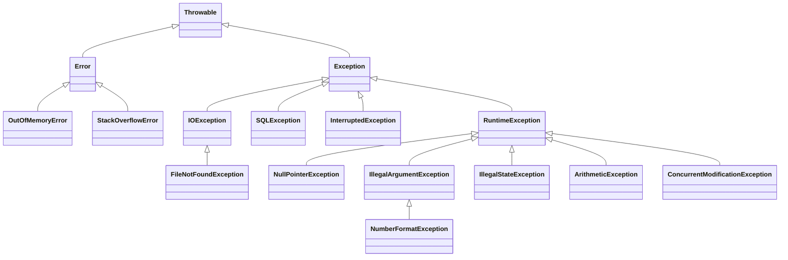
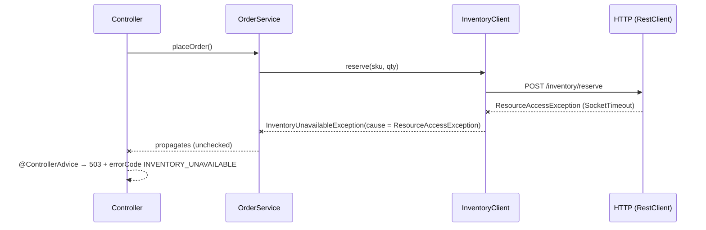

# Exceptions — Checked, Unchecked, try-with-resources, and Production-Grade Error Handling

> Exception handling is where "it works on my machine" code and production-grade code differ most visibly.

---

## Table of Contents

1. The Airline Incident Analogy
2. The Exception Hierarchy
3. Checked vs Unchecked — The Real Debate
4. try / catch / finally — Semantics and Traps
5. try-with-resources & AutoCloseable
6. Custom Exceptions — Designing a Domain Error Model
7. Exception Chaining & Translation Across Layers
8. Spring Boot: @ControllerAdvice, ProblemDetail, and @Transactional
9. Anti-Patterns You'll See in Code Reviews
10. Practice Assignments (Low / Medium / High)
11. Mini Project — Resilient Order API Error Model
12. Interview Corner
13. Quick Reference

---

## 1. The Airline Incident Analogy

Imagine an airline:

- **A passenger forgets their passport** — expected, recoverable. The airline has a documented procedure: rebook, notify, refund. That's a **checked exception** — the system *forces* you to plan for it.
- **A gate agent types the wrong seat number into the system** — a bug in the process. You don't write a recovery plan for every typo; you fix the process. That's an **unchecked (runtime) exception** — a programming error.
- **The airport loses power** — nothing the gate agent can do. Evacuate and let the people above handle it. That's an **Error** (`OutOfMemoryError`, `StackOverflowError`) — don't try to catch it.

And one rule every airline follows: **when an incident is escalated, the report includes the original incident**, not just "something went wrong". That's **exception chaining**.

---

## 2. The Exception Hierarchy



| Branch | Checked? | Meaning | Should you catch it? |
|--------|----------|---------|----------------------|
| `Error` | Unchecked | JVM-level failure | ❌ Almost never (maybe log at the very top, then die) |
| `Exception` (not Runtime) | ✅ **Checked** — compiler enforces catch or `throws` | Expected, external failure conditions | ✅ Where you can recover or translate |
| `RuntimeException` | Unchecked | Programming errors, violated preconditions, or deliberately unchecked domain errors | Usually only at boundaries (global handler) |

<div class="callout-info">

"Checked" is purely a **compiler** concept. At the bytecode level the JVM doesn't distinguish them, which is why Kotlin and Scala (also JVM languages) have no checked exceptions at all, and why a `Lombok @SneakyThrows` trick is even possible.

</div>

---

## 3. Checked vs Unchecked — The Real Debate

| | Checked | Unchecked |
|--|---------|-----------|
| Compiler | Must catch or declare `throws` | No requirement |
| Intended for | Recoverable conditions outside the program's control (file missing, network down) | Bugs and contract violations (null argument, bad state) |
| Examples | `IOException`, `SQLException`, `InterruptedException`, `TimeoutException` | `NullPointerException`, `IllegalArgumentException`, `IllegalStateException` |
| Pros | Forces callers to think about failure; part of the API contract | No boilerplate; plays well with lambdas and streams |
| Cons | Leaks implementation details up the stack (`throws SQLException` in a service?), doesn't work with `Function`/`Stream` | Easy to forget to handle something important |

### What modern Java codebases actually do

Spring, Hibernate, and most modern libraries chose **unchecked**: `DataAccessException`, `HttpClientErrorException`, `PersistenceException` are all `RuntimeException`s. The reasoning: most callers **can't** meaningfully recover from a DB failure mid-request; they want it to propagate to one central handler.

```java
// ❌ Checked exception leaking through every layer
public interface OrderRepository {
    Order find(long id) throws SQLException;          // now every service method must deal with SQL
}

// ✅ Translate at the boundary into an unchecked, domain-meaningful type
public interface OrderRepository {
    Optional<Order> find(long id);                    // absence is a normal result, not an exception
}
```

### Checked exceptions + lambdas = pain

```java
List<Path> files = ...;
files.stream().map(Files::readString).toList();      // ❌ won't compile: readString throws IOException

files.stream().map(p -> {
    try { return Files.readString(p); }
    catch (IOException e) { throw new UncheckedIOException(e); }   // ✅ JDK's own wrapper
}).toList();
```

<div class="callout-interview">

**Q: "Checked or unchecked for your custom exceptions?"**

In application code I default to unchecked, with a domain hierarchy like `OrderNotFoundException extends BusinessException extends RuntimeException`. Most failures can't be recovered at the call site; they should reach one global handler that maps them to HTTP responses. Checked exceptions leak implementation details through layers and don't compose with lambdas. I use checked exceptions only in library APIs where the caller genuinely must decide, such as a parser or a retryable client call.

</div>

---

## 4. try / catch / finally — Semantics and Traps

### Order of catch blocks

```java
try {
    processPayment();
} catch (FileNotFoundException e) {   // most specific first
    ...
} catch (IOException e) {             // then broader
    ...
}
// Reversing them is a compile error: the second catch would be unreachable.
```

### Multi-catch (Java 7)

```java
catch (TimeoutException | ConnectException e) {   // same handling for both
    retryQueue.add(request);
}
```

The types in a multi-catch can't be subclasses of each other, and `e` is effectively final.

### finally always runs... almost

`finally` runs whether the `try` completes normally, returns, or throws. It does **not** run if the JVM exits (`System.exit`), the thread is killed, or the process crashes.

### The return-in-finally trap

```java
static int getCount() {
    try {
        return 1;
    } finally {
        return 2;           // ❌ overrides the try's return — and SWALLOWS any exception
    }
}
getCount();   // 2

static int tricky() {
    int x = 10;
    try {
        return x;           // the value 10 is saved as the return value NOW
    } finally {
        x = 20;             // modifies the local, not the saved return value
    }
}
tricky();     // 10
```

<div class="callout-warn">

**Never `return` or `throw` from `finally`.** It silently discards the in-flight exception. A `NullPointerException` in the `try` disappears, and you debug the wrong thing for hours. Most static analyzers (SonarQube, Error Prone) flag it.

</div>

---

## 5. try-with-resources & AutoCloseable

Before Java 7, closing resources correctly took a nested try/finally that almost nobody wrote correctly. try-with-resources (TWR) closes anything implementing `AutoCloseable`, **in reverse order of declaration**, even when exceptions occur.

```java
// ❌ Pre-Java 7 style: leaks the statement if prepareStatement throws, and close() can mask the real error
Connection c = null;
try {
    c = dataSource.getConnection();
    PreparedStatement ps = c.prepareStatement(SQL);
    ...
} finally {
    if (c != null) c.close();
}

// ✅ Java 7+
try (Connection c = dataSource.getConnection();
     PreparedStatement ps = c.prepareStatement(SQL);
     ResultSet rs = ps.executeQuery()) {
    while (rs.next()) { ... }
}   // closes rs, then ps, then c — automatically
```

### Suppressed exceptions

If the body throws exception **A** and then `close()` throws **B**, Java throws **A** and attaches **B** as a *suppressed* exception, so the root cause isn't lost:

```java
catch (SQLException e) {
    for (Throwable s : e.getSuppressed()) log.warn("Also failed during close", s);
}
```

### Your own resource

```java
public final class DistributedLock implements AutoCloseable {
    private final RedisClient redis;
    private final String key;

    private DistributedLock(RedisClient redis, String key) { this.redis = redis; this.key = key; }

    public static DistributedLock acquire(RedisClient redis, String key, Duration ttl) {
        if (!redis.setIfAbsent(key, "1", ttl)) throw new LockNotAcquiredException(key);
        return new DistributedLock(redis, key);
    }

    @Override public void close() { redis.delete(key); }   // no checked exception: callers stay clean
}

try (var lock = DistributedLock.acquire(redis, "settlement:2026-03-15", Duration.ofMinutes(5))) {
    runSettlement();
}   // lock released even if runSettlement throws
```

<div class="callout-tip">

**Applying this** — Declare `close()` without `throws Exception` when you can: `AutoCloseable.close()` is declared `throws Exception`, but an override may narrow it, so callers aren't forced into a catch. Java 9 also lets you use an existing effectively-final variable directly: `try (existingStream) { ... }`.

</div>

---

## 6. Custom Exceptions — Designing a Domain Error Model

### Scenario: an e-commerce order service

You want errors that (1) mean something to the business, (2) map cleanly to HTTP status codes, (3) carry machine-readable codes for clients, and (4) never leak internals.

```java
public abstract class BusinessException extends RuntimeException {
    private final String errorCode;

    protected BusinessException(String errorCode, String message) {
        super(message);
        this.errorCode = errorCode;
    }
    protected BusinessException(String errorCode, String message, Throwable cause) {
        super(message, cause);                         // ALWAYS offer a cause constructor
        this.errorCode = errorCode;
    }
    public String errorCode() { return errorCode; }
}

public class OrderNotFoundException extends BusinessException {
    public OrderNotFoundException(String orderId) {
        super("ORDER_NOT_FOUND", "Order " + orderId + " does not exist");
    }
}

public class InsufficientStockException extends BusinessException {
    private final String sku;
    private final int requested, available;

    public InsufficientStockException(String sku, int requested, int available) {
        super("INSUFFICIENT_STOCK",
              "SKU %s: requested %d, available %d".formatted(sku, requested, available));
        this.sku = sku; this.requested = requested; this.available = available;
    }
    // getters... → the handler can put these fields in the response for the UI
}
```

### Design rules

| Rule | Why |
|------|-----|
| Name it for **what went wrong**, not where (`PaymentDeclinedException`, not `PaymentServiceException`) | The name should explain the problem in a stack trace |
| Include **context** in the message (ids, values) | "Invalid input" is useless at 3 AM |
| Always provide a **cause** constructor | Preserves the root stack trace |
| Keep the hierarchy **shallow** (2-3 levels) | Deep trees are never caught at the middle levels |
| Don't put **PII or secrets** in messages | Messages end up in logs, APM, and sometimes responses |
| Prefer `Optional` / result types for **expected absence** | Exceptions are for exceptional paths and cost a stack trace |

<div class="callout-scenario">

**Scenario**: Your payment client throws exceptions for declined cards, and at Black Friday peak 30% of payments are declined. The CPU profile shows `Throwable.fillInStackTrace` at 12%. **Decision**: A declined card is an *expected business outcome*, not an exceptional event, so return a `PaymentResult` sealed type (`Approved | Declined(reason) | Error`). Keep exceptions for infrastructure failures. If you must use exceptions on a hot path, the `RuntimeException(message, cause, enableSuppression, writableStackTrace)` constructor can disable stack-trace capture, but that's a last resort.

</div>

---

## 7. Exception Chaining & Translation Across Layers

Each layer should throw exceptions that make sense **at that layer's abstraction**, wrapping the lower-level cause.



```java
public void reserve(String sku, int qty) {
    try {
        restClient.post().uri("/inventory/reserve").body(new ReserveRequest(sku, qty))
                  .retrieve().toBodilessEntity();
    } catch (HttpClientErrorException.Conflict e) {
        throw new InsufficientStockException(sku, qty, parseAvailable(e));   // business meaning
    } catch (RestClientException e) {
        throw new InventoryUnavailableException(sku, e);                      // keep the cause!
    }
}
```

❌ The cardinal sin — losing the cause:

```java
catch (SQLException e) {
    throw new RepositoryException("DB error");   // original stack trace GONE
}
```

<div class="callout-interview">

**Q: "What is exception translation?"**

Catching a low-level exception at a layer boundary and rethrowing one that fits that layer's abstraction, with the original as the cause. A service shouldn't know about `SQLException` or a socket timeout; it should see `OrderPersistenceException` or `InventoryUnavailableException`. Spring does this for you with `@Repository` beans: `PersistenceExceptionTranslationPostProcessor` converts vendor exceptions into the `DataAccessException` hierarchy.

</div>

---

## 8. Spring Boot: @ControllerAdvice, ProblemDetail, and @Transactional

### One global handler, RFC 9457 responses

Spring Boot 3 supports `ProblemDetail` (RFC 9457, which replaced RFC 7807): a standard JSON error format.

```java
@RestControllerAdvice
public class GlobalExceptionHandler {

    private static final Logger log = LoggerFactory.getLogger(GlobalExceptionHandler.class);

    @ExceptionHandler(OrderNotFoundException.class)
    ProblemDetail notFound(OrderNotFoundException ex) {
        var pd = ProblemDetail.forStatusAndDetail(HttpStatus.NOT_FOUND, ex.getMessage());
        pd.setProperty("errorCode", ex.errorCode());
        return pd;
    }

    @ExceptionHandler(InsufficientStockException.class)
    ProblemDetail conflict(InsufficientStockException ex) {
        var pd = ProblemDetail.forStatusAndDetail(HttpStatus.CONFLICT, ex.getMessage());
        pd.setProperty("errorCode", ex.errorCode());
        return pd;
    }

    @ExceptionHandler(Exception.class)                 // last resort: never leak internals
    ProblemDetail unexpected(Exception ex) {
        String errorId = UUID.randomUUID().toString();
        log.error("Unhandled error id={}", errorId, ex);   // full stack trace in logs only
        var pd = ProblemDetail.forStatusAndDetail(HttpStatus.INTERNAL_SERVER_ERROR,
                "Unexpected error. Reference: " + errorId);
        pd.setProperty("errorCode", "INTERNAL_ERROR");
        return pd;
    }
}
```

Response:

```json
{
  "type": "about:blank",
  "title": "Conflict",
  "status": 409,
  "detail": "SKU TSHIRT-M: requested 5, available 2",
  "instance": "/api/orders",
  "errorCode": "INSUFFICIENT_STOCK"
}
```

### The @Transactional rollback rule — a famous trap

By default, Spring rolls back **only on unchecked exceptions** (`RuntimeException` and `Error`). A **checked** exception thrown from a `@Transactional` method **commits** the transaction!

```java
@Transactional
public void transfer(long from, long to, BigDecimal amt) throws InsufficientFundsCheckedException {
    debit(from, amt);                                     // written
    if (!valid) throw new InsufficientFundsCheckedException();   // ❌ checked → COMMIT → money vanished
    credit(to, amt);
}

@Transactional(rollbackFor = Exception.class)             // ✅ explicit
public void transferSafe(...) throws InsufficientFundsCheckedException { ... }
```

<div class="callout-warn">

**Catching inside `@Transactional` doesn't un-mark a rollback.** If an inner `@Transactional` method (propagation `REQUIRED`) throws a runtime exception, the shared transaction is marked rollback-only. Catching it in the outer method and continuing leads to `UnexpectedRollbackException` at commit. See `spring-transactional` for the full story.

</div>

---

## 9. Anti-Patterns You'll See in Code Reviews

| Anti-pattern | Why it's bad | Do instead |
|--------------|--------------|------------|
| `catch (Exception e) {}` | Swallows everything, including bugs | Catch specific types; at minimum log and rethrow |
| `catch (Exception e) { e.printStackTrace(); }` | Goes to stderr, not your log pipeline, with no context | `log.error("Failed to X for order {}", id, e)` |
| Log **and** rethrow at every layer | Same stack trace logged 5 times; noisy alerts | Log once, where you handle it (usually the global handler) |
| `throw new RuntimeException(e.getMessage())` | Loses the type and stack trace | `throw new DomainException("context", e)` |
| Exceptions for control flow | Slow (stack capture), hides intent | `Optional`, result types, validation methods |
| `catch (Throwable t)` | Catches `OutOfMemoryError` and then keeps running in a broken state | Catch `Exception` at most (top-level only) |
| Catching `InterruptedException` and ignoring it | Breaks thread cancellation (executor shutdown hangs) | `Thread.currentThread().interrupt();` then exit or rethrow |
| Returning `null` on error | Pushes an NPE somewhere far away | Throw, or return `Optional` |

```java
// ✅ The correct InterruptedException handling
try {
    queue.take();
} catch (InterruptedException e) {
    Thread.currentThread().interrupt();   // restore the flag so callers/executors can see it
    throw new TaskCancelledException("Worker interrupted", e);
}
```

---

## 10. 🏋️ Practice Assignments

### 🟢 Low — Build the reflexes

**L1.** Classify as checked or unchecked: `IOException`, `NullPointerException`, `SQLException`, `NumberFormatException`, `InterruptedException`, `IllegalStateException`, `FileNotFoundException`, `DataAccessException` (Spring).

<details>
<summary>Show answer</summary>

Checked: `IOException`, `SQLException`, `InterruptedException`, `FileNotFoundException` (a subclass of `IOException`). Unchecked: `NullPointerException`, `NumberFormatException` (a subclass of `IllegalArgumentException`), `IllegalStateException`, `DataAccessException` (Spring made its whole hierarchy unchecked on purpose).

</details>

**L2.** What does this return?

```java
static String test() {
    StringBuilder sb = new StringBuilder("A");
    try {
        return sb.append("B").toString();
    } finally {
        sb.append("C");
    }
}
```

<details>
<summary>Show answer</summary>

`"AB"`. The return expression is evaluated (building the String `"AB"`) before `finally` runs. `finally` mutates the builder, but the returned `String` was already created. (If the method returned `sb` itself — the builder — the caller would see `"ABC"`.)

</details>

**L3.** Rewrite using try-with-resources:

```java
BufferedReader br = new BufferedReader(new FileReader(path));
String first = br.readLine();
br.close();
```

<details>
<summary>Show answer</summary>

```java
try (BufferedReader br = Files.newBufferedReader(Path.of(path), StandardCharsets.UTF_8)) {
    String first = br.readLine();
}
```

The original leaks the reader if `readLine` throws. `Files.newBufferedReader` also makes the charset explicit.

</details>

### 🟡 Medium — Apply it

**M1.** Design an exception hierarchy for a **flight booking** service with these failures: flight not found, seat already taken, payment declined, payment gateway down, invalid passenger data. Map each to an HTTP status.

<details>
<summary>Show answer</summary>

```text
BusinessException (abstract, unchecked, has errorCode)
 ├─ NotFoundException              → 404
 │   └─ FlightNotFoundException
 ├─ ConflictException              → 409
 │   └─ SeatUnavailableException
 ├─ ValidationException            → 400 / 422 (with field errors)
 │   └─ InvalidPassengerException
 └─ PaymentDeclinedException       → 402 (or 422)
InfrastructureException (unchecked)
 └─ PaymentGatewayUnavailableException → 503 (+ Retry-After), with cause
```

The `@RestControllerAdvice` maps on the **base** types (`NotFoundException` → 404), so new leaf exceptions need no handler changes. Payment declined is arguably better modeled as a result type (see the section 6 scenario), but an exception works if it's rare.

</details>

**M2.** Find three problems:

```java
public Order load(long id) {
    try {
        return repo.findById(id).get();
    } catch (Exception e) {
        log.error(e.getMessage());
        return null;
    }
}
```

<details>
<summary>Show answer</summary>

1. `Optional.get()` on an empty result throws `NoSuchElementException` — using exceptions for the normal "not found" case.
2. `catch (Exception e)` swallows everything (including DB outages), and `log.error(e.getMessage())` loses the stack trace and has no context.
3. Returning `null` moves the failure to a random NPE later.

Fix:

```java
public Order load(long id) {
    return repo.findById(id).orElseThrow(() -> new OrderNotFoundException(id));
}
```

Let infrastructure exceptions propagate to the global handler, which logs them once, with the stack trace.

</details>

**M3.** A `@Transactional` method throws `IOException` after inserting rows. Do the rows stay? How do you make them roll back?

<details>
<summary>Show answer</summary>

They stay: `IOException` is checked, and Spring's default rule rolls back only on `RuntimeException`/`Error`. Fix: `@Transactional(rollbackFor = Exception.class)`, or translate the `IOException` into an unchecked domain exception inside the method (often cleaner, and consistent with the rest of the codebase).

</details>

### 🔴 High — Think like a senior

**H1.** Your microservice calls 3 downstream services. Today every failure returns HTTP 500 with a Java stack trace in the body. Design the error-handling strategy end to end: exception model, HTTP mapping, logging, retries, and what clients see.

<details>
<summary>Show answer</summary>

- **Model**: `BusinessException` (4xx, the client can fix it) vs `InfrastructureException` (5xx, retryable?), each with a stable `errorCode`.
- **Translation**: each downstream client adapter translates `RestClientException`/timeouts into `XxxUnavailableException(cause)` and maps 4xx responses from downstream into business exceptions **when they're meaningful to your client**; otherwise treats them as a 502 (bad gateway), because a downstream 400 means *your* request was bad.
- **HTTP**: `@RestControllerAdvice` returns `ProblemDetail` with `errorCode` and a `traceId` (from Micrometer Tracing), **never** a stack trace (`server.error.include-stacktrace=never`, the default in Boot 3). 503 with `Retry-After` for transient failures.
- **Logging**: log once at the handler — `WARN` for 4xx (no stack), `ERROR` with stack for 5xx — with the traceId in the MDC so logs join up with traces.
- **Resilience**: Resilience4j retry only on idempotent calls and only for retryable exception types, with a circuit breaker per downstream and timeouts on every client. Metrics are tagged by `errorCode` so dashboards show "INVENTORY_UNAVAILABLE spiking", not just "5xx up".
- **Contract**: document the error codes in the OpenAPI spec so clients branch on `errorCode`, not on message text.

</details>

**H2.** A batch job processes 1M records. Currently one bad record throws and kills the whole job at record 600K. Redesign it.

<details>
<summary>Show answer</summary>

Separate **record-level** failures from **job-level** failures. Per record: validate first, catch the specific business/parsing exceptions, write the record plus reason to a **dead-letter** table or file, increment a metric, and continue. Infrastructure failures (DB down) shouldn't be skipped — retry with backoff, and if that fails, stop the job. Add a **skip limit** (e.g., abort if more than 1% of records fail, which means the data or code is broken). Commit in chunks (e.g., 1,000 records) with a checkpoint, so a restart resumes from the last committed chunk instead of record 0. Spring Batch provides all of this: `faultTolerant().skip(ParseException.class).skipLimit(10_000).retry(TransientDataAccessException.class).retryLimit(3)`, plus restartability from `JobRepository`. Finish with a summary report (processed / skipped / failed).

</details>

---

## 11. 🛠️ Mini Project — Resilient Order API Error Model

**Goal**: A Spring Boot 3 API that demonstrates production-grade error handling. 2 evenings.

**Build**

1. Endpoints: `POST /orders`, `GET /orders/{id}`, `POST /orders/{id}/cancel`.
2. A domain exception hierarchy (as in section 6) with `errorCode`s: `ORDER_NOT_FOUND`, `INSUFFICIENT_STOCK`, `ORDER_ALREADY_SHIPPED`, `INVENTORY_UNAVAILABLE`.
3. A fake `InventoryClient` that randomly throws a timeout (use WireMock or a simple stub with a configurable failure rate).
4. `@RestControllerAdvice` returning `ProblemDetail` for: domain exceptions, `MethodArgumentNotValidException` (Bean Validation → list of field errors), `HttpMessageNotReadableException` (malformed JSON → 400), and a catch-all with an error reference id.
5. A `@Transactional` cancel flow that writes an audit row and then fails — prove with a test that it rolls back, then break it with a checked exception and prove it commits (and fix it).
6. A `DistributedLock implements AutoCloseable` (an in-memory map is fine) used with try-with-resources around cancel.

**Acceptance criteria**

- No response body ever contains a stack trace or a class name.
- `@WebMvcTest` tests assert status code + `errorCode` for every error type.
- Every error log line includes the order id and trace id; each exception is logged exactly once.

**Stretch**: add Resilience4j `@Retry` + `@CircuitBreaker` on `InventoryClient` and show in a test that `INVENTORY_UNAVAILABLE` is returned once the circuit opens.

---

## 🎯 Interview Corner

<div class="callout-interview">

**Q: "What's the difference between checked and unchecked exceptions, and which do you prefer?"**

Checked exceptions extend `Exception` but not `RuntimeException`, and the compiler forces you to catch or declare them. They're meant for recoverable conditions outside the program's control, like I/O failures. Unchecked exceptions extend `RuntimeException`, carry no compiler obligation, and traditionally signal programming errors. In application code I prefer unchecked for domain errors: most callers can't recover mid-request and should let a global handler turn the error into a proper HTTP response. Checked exceptions leak implementation details across layers and don't work with lambdas. Spring and Hibernate made the same choice with `DataAccessException`.

**Follow-up trap**: "Doesn't unchecked mean people forget to handle errors?" → That's the trade-off. I mitigate it with a small, documented hierarchy, a global handler, and tests for every error path. For truly expected outcomes, like a declined payment, I use a result type rather than any exception.

</div>

<div class="callout-interview">

**Q: "How does try-with-resources work, and what are suppressed exceptions?"**

Any `AutoCloseable` declared in the try header is closed automatically when the block exits, normally or exceptionally, in reverse order of declaration. The compiler generates the finally logic that people used to get wrong. If the body throws and then `close()` also throws, the body's exception is the one propagated, and the close failure is attached via `addSuppressed`, retrievable with `getSuppressed()`. So the root cause isn't masked by a secondary failure, which was a common bug with hand-written finally blocks.

</div>

<div class="callout-interview">

**Q: "A @Transactional method threw an exception but the data was still saved. Why?"**

The most common cause: the exception was checked, and Spring's default only rolls back on `RuntimeException` and `Error`, so a checked exception commits. The fix is `rollbackFor = Exception.class`, or translating to an unchecked exception. Other causes: the method was called via self-invocation, so it bypassed the proxy and no transaction existed; the exception was caught inside the method and never escaped; the method wasn't public in older Spring versions; or a `REQUIRES_NEW` inner transaction had already committed independently. I'd check the logs with `org.springframework.transaction` at DEBUG to see whether a transaction was even opened.

</div>

<div class="callout-interview">

**Q: "How do you design error handling so it's useful in production at 3 AM?"**

Four things. Meaningful exception types with context — ids and values, never PII — and the original cause always chained. Log exactly once, at the place where the exception is handled, with the stack trace for 5xx and a trace id in the MDC so I can jump from an alert to a distributed trace. Clients get stable, documented error codes in `ProblemDetail` format, never stack traces. And metrics are tagged by error code, so alerting distinguishes "payment gateway down" from "users typing bad card numbers". The goal is that one log line tells you what failed, for which entity, and where to look next.

</div>

---

## Quick Reference

| Concept | One-Liner |
|---------|-----------|
| `Error` | JVM trouble — don't catch |
| Checked | Compiler-enforced; external, recoverable conditions |
| Unchecked | `RuntimeException`; bugs + most app-level domain errors |
| Catch order | Specific before general |
| `finally` | Always runs (except JVM exit); never `return`/`throw` in it |
| TWR | Closes `AutoCloseable`s in reverse order; suppressed exceptions preserved |
| Chaining | Always pass the cause: `new X("context", e)` |
| Translation | Convert low-level exceptions at layer boundaries |
| Spring rollback | Default: unchecked only → use `rollbackFor` |
| Global handling | `@RestControllerAdvice` + `ProblemDetail` (RFC 9457) |
| InterruptedException | Restore the flag: `Thread.currentThread().interrupt()` |
| Log once | At the handler, with the stack trace and a trace id |

---

## Related Topics

- `spring-transactional` — rollback rules and propagation in depth
- `microservices-patterns` — circuit breakers and retries for remote failures
- `java-coding-standards` — team conventions for errors and logging

> **An exception is a message to a future engineer at 3 AM. Make sure it says what broke, for whom, and why — and never throw away the original.**

---

<!-- journey-link:start -->

<div class="callout-journey">

🛒 **ShopNorth Journey** — ShopNorth's order service maps domain exceptions like OutOfStockException to clean ProblemDetail errors, and Chapter 9 fixes a resource leak with try-with-resources.

**Continue the story:** [Chapter 5 · Building with Spring Boot](/tutorials/journey-05-spring-boot) · **New here?** [Start the journey](/tutorials/journey-start)

</div>

<!-- journey-link:end -->
