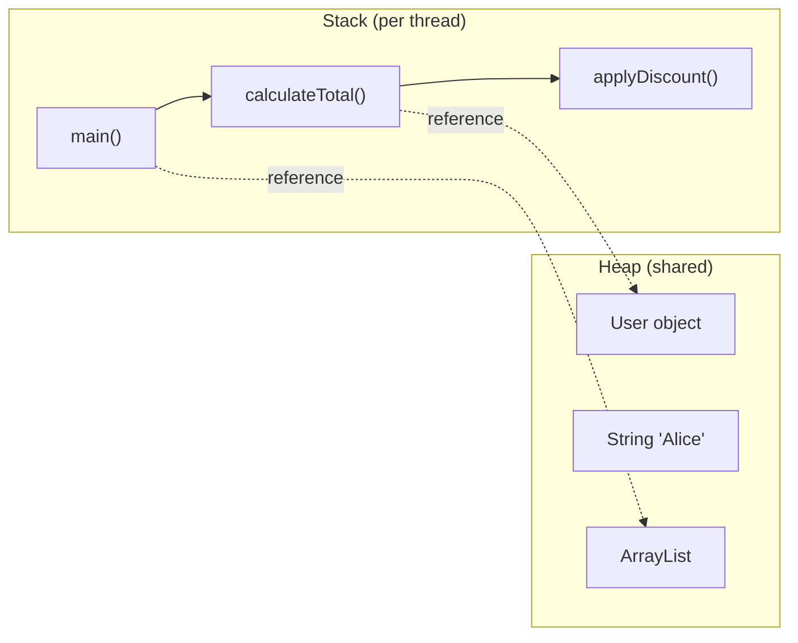
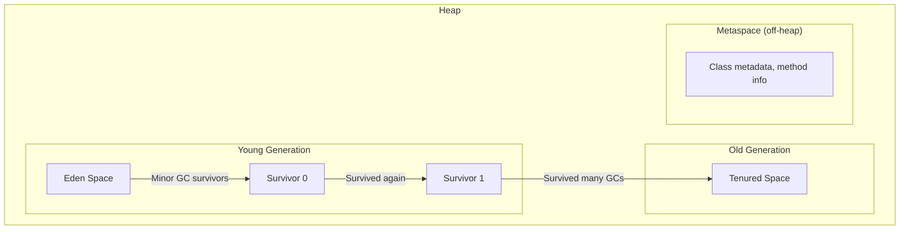

# Java Memory Model — Where Your Objects Live and Die

## The Apartment Building Analogy

Think of JVM memory as an apartment building:
- **Stack** = Each person's desk in their own room (private, small, fast)
- **Heap** = The shared warehouse in the basement (big, shared, needs management)
- **Garbage Collector** = The janitor who cleans up stuff nobody uses anymore

---

## 1. Stack vs Heap



### What goes where?

```java
public void processOrder() {
    int quantity = 5;                    // Stack — primitive
    double price = 29.99;               // Stack — primitive
    String name = "Alice";              // Stack: reference, Heap: String object
    Order order = new Order(name, 5);   // Stack: reference, Heap: Order object
    List<Item> items = new ArrayList<>(); // Stack: reference, Heap: ArrayList object
}
// When processOrder() returns → all stack variables are gone instantly
// Heap objects remain until GC collects them
```

| | Stack | Heap |
|---|-------|------|
| Stores | Primitives, references, method frames | Objects, arrays |
| Scope | Per thread (private) | Shared across threads |
| Speed | Very fast (LIFO) | Slower (needs GC) |
| Size | Small (~512KB-1MB per thread) | Large (configurable, GBs) |
| Cleanup | Automatic on method return | Garbage Collector |
| Error | `StackOverflowError` | `OutOfMemoryError` |

---

## 2. Heap Structure



### Object lifecycle

1. **New object** → created in **Eden**
2. **Minor GC** → surviving objects move to **Survivor** space
3. **After N minor GCs** (default 15) → promoted to **Old Generation**
4. **Major GC / Full GC** → cleans Old Generation (expensive, stop-the-world)

### Scenario: Why your app pauses

```
Your app creates millions of short-lived objects (e.g., in a loop).
Eden fills up fast → frequent Minor GCs (usually fast, ~10ms).
Some objects accidentally survive (held by a reference) → promoted to Old Gen.
Old Gen fills up → Full GC → STOP THE WORLD → 200ms-2s pause! 💥
```

---

## 3. Garbage Collection Algorithms

### How does GC know what to collect?

**Reachability analysis**: Start from "GC roots" (stack variables, static fields, thread objects). Anything reachable from roots is alive. Everything else is garbage.

```java
Object a = new Object();  // a is a GC root → Object is reachable
a = null;                  // no more reference → Object is garbage
```

### GC Types

| GC | Best For | Pause Behavior |
|----|----------|---------------|
| **Serial GC** | Small apps, single CPU | Stop-the-world, single thread |
| **Parallel GC** | Throughput (batch jobs) | Stop-the-world, multi-thread |
| **G1 GC** (default Java 9+) | Balanced latency/throughput | Mostly concurrent, short pauses |
| **ZGC** (Java 15+) | Ultra-low latency | < 1ms pauses, even with TB heaps |
| **Shenandoah** | Low latency | Concurrent compaction |

### JVM flags

```bash
# Set heap size
java -Xms512m -Xmx2g MyApp    # min 512MB, max 2GB

# Choose GC
java -XX:+UseG1GC MyApp        # G1 (default)
java -XX:+UseZGC MyApp          # ZGC (low latency)

# GC logging
java -Xlog:gc* MyApp            # see what GC is doing
```

---

## 4. Memory Leaks in Java — Yes, They Exist!

### Scenario 1: Forgotten collection references

```java
class Cache {
    private static final Map<String, Object> cache = new HashMap<>();

    public void add(String key, Object value) {
        cache.put(key, value);  // objects NEVER get removed → memory grows forever
    }
    // Fix: use WeakHashMap, or add eviction logic, or use Caffeine/Guava cache
}
```

### Scenario 2: Unclosed resources

```java
// ❌ Connection never closed → connection pool exhausted
public void query() {
    Connection conn = dataSource.getConnection();
    // ... use conn
    // forgot conn.close()!
}

// ✅ try-with-resources
public void query() {
    try (Connection conn = dataSource.getConnection()) {
        // ... use conn
    }  // auto-closed here
}
```

### Scenario 3: Inner class holding outer reference

```java
class Outer {
    private byte[] largeData = new byte[10_000_000];  // 10MB

    class Inner {
        // Inner implicitly holds reference to Outer
        // Even if Outer is "done", it can't be GC'd while Inner exists
    }

    // Fix: use static inner class
    static class StaticInner {
        // no reference to Outer
    }
}
```

### Scenario 4: ThreadLocal not cleaned up

```java
// ❌ In a thread pool, threads are reused — ThreadLocal values persist!
private static ThreadLocal<UserContext> context = new ThreadLocal<>();

public void handleRequest() {
    context.set(new UserContext(currentUser));
    // ... process request
    // forgot context.remove()! → memory leak in thread pools
}

// ✅ Always clean up
public void handleRequest() {
    try {
        context.set(new UserContext(currentUser));
        // ... process request
    } finally {
        context.remove();  // ALWAYS
    }
}
```

---

## 5. String Pool — Special Memory Area

```java
String s1 = "hello";           // goes to String Pool (in heap, special area)
String s2 = "hello";           // reuses same object from pool
String s3 = new String("hello"); // creates NEW object in heap (not pooled)

s1 == s2;      // true  (same reference from pool)
s1 == s3;      // false (different objects)
s1.equals(s3); // true  (same content)

s3.intern();   // returns the pooled version
s1 == s3.intern(); // true
```

---

## 6. Diagnosing Memory Issues

### Tools

| Tool | Purpose |
|------|---------|
| `jmap -heap <pid>` | Heap summary |
| `jmap -histo <pid>` | Object histogram |
| `jstat -gc <pid>` | GC statistics |
| `jvisualvm` | Visual profiler |
| `Eclipse MAT` | Heap dump analyzer |
| `-XX:+HeapDumpOnOutOfMemoryError` | Auto dump on OOM |

### Scenario: Finding a memory leak

```bash
# 1. Take heap dump
jmap -dump:format=b,file=heap.hprof <pid>

# 2. Open in Eclipse MAT
# 3. Look at "Leak Suspects" report
# 4. Check "Dominator Tree" — who's holding the most memory?
# 5. Find the reference chain keeping objects alive
```

---

## 7. Quick Reference

```
JVM Memory Layout
├── Stack (per thread)
│   ├── Method frames
│   ├── Local primitives (int, double, boolean)
│   └── Object references (pointers to heap)
├── Heap (shared)
│   ├── Young Generation
│   │   ├── Eden (new objects born here)
│   │   ├── Survivor 0
│   │   └── Survivor 1
│   ├── Old Generation (long-lived objects)
│   └── String Pool
├── Metaspace (off-heap, since Java 8)
│   ├── Class metadata
│   ├── Method bytecode
│   └── Constant pool
└── Native Memory
    ├── Thread stacks
    ├── Direct ByteBuffers
    └── JNI allocations
```

---

---

<!-- practice-pack -->

## 🏢 Real-World Scenarios

<div class="callout-scenario">

**Scenario**: A Spring Boot service's pod is OOM-killed every few days; heap graphs look healthy, but the old generation slowly rises after each full GC. A heap dump shows a `static Map<String, ReportCache>` holding millions of entries. **Decision**: A classic leak — a static collection used as a cache with no eviction. Objects referenced from GC roots (statics) are never collected. Replace it with a bounded cache (Caffeine with `maximumSize`/`expireAfterWrite`), and add alerts on "old gen after GC" trending upward, not just on current heap usage.

</div>

<div class="callout-scenario">

**Scenario**: p99 latency spikes to 2 seconds every few minutes on an API with a 16 GB heap; GC logs show long pauses. **Decision**: Check the collector and allocation rate: G1 (the default) targets pause goals but can still pause long with huge heaps and high allocation; ZGC (generational in Java 21+) keeps pauses to around a millisecond regardless of heap size, at some throughput and memory cost. Also reduce allocation (avoid building huge intermediate collections, reuse buffers, stream results), then re-measure with GC logs (`-Xlog:gc*`) and JFR.

</div>

## 🏋️ Practice Assignments

### 🟢 Low — Build the reflexes

**L1.** Where does each live — stack or heap? (a) a local `int count`, (b) the `Order` object created with `new`, (c) the local reference variable `order` pointing to it, (d) a static field `Map cache`'s map object.

<details>
<summary>Show answer</summary>

(a) Stack (in the method's frame). (b) Heap (escape analysis may optimize some allocations, but conceptually heap). (c) Stack (the reference). (d) Heap — the static *reference* is part of the class's static data (in the heap since Java 8 for the class mirror), and the map object itself is on the heap, reachable from a GC root.

</details>

**L2.** `StackOverflowError` vs `OutOfMemoryError: Java heap space` — typical causes?

<details>
<summary>Show answer</summary>

`StackOverflowError`: very deep or infinite recursion (each call adds a frame to the thread's stack). `OutOfMemoryError: Java heap space`: live objects exceed the heap — a leak (unbounded caches, listeners never removed), or a legitimately large workload (loading huge result sets into memory).

</details>

**L3.** Name three GC roots.

<details>
<summary>Show answer</summary>

Local variables and parameters on thread stacks, static fields of loaded classes, active threads, JNI references, and synchronization monitors. Anything reachable from a root is live and won't be collected.

</details>

### 🟡 Medium — Apply it

**M1.** A container has a 2 GiB memory limit. How do you size the JVM heap, and what else consumes memory?

<details>
<summary>Show answer</summary>

Use `-XX:MaxRAMPercentage=75` (≈1.5 GiB heap) rather than hard-coding `-Xmx` equal to the limit. The rest is needed for metaspace (class metadata), thread stacks (~1 MB × thread count), code cache (JIT-compiled code), direct/off-heap buffers (Netty, NIO), GC data structures, and native libraries. If the process exceeds the container limit, the kernel kills it (`OOMKilled`, exit code 137) — often without any Java `OutOfMemoryError`. See `k8s-spring-boot`.

</details>

**M2.** You suspect a memory leak in production. List the steps to confirm and find it.

<details>
<summary>Show answer</summary>

(1) Confirm the pattern: old-gen usage *after* each full GC keeps rising (GC logs or Micrometer `jvm.memory.used` after GC). (2) Capture a heap dump (`jcmd <pid> GC.heap_dump /tmp/heap.hprof`, or `-XX:+HeapDumpOnOutOfMemoryError` configured in advance) — in a controlled way, since dumps pause the JVM and contain sensitive data. (3) Analyze with Eclipse MAT: the dominator tree and "leak suspects" show which objects retain the most memory and the GC root path keeping them alive. (4) Compare two dumps taken hours apart to see what grows. (5) Fix the retention (eviction, removing listeners, closing resources) and verify the trend flattens.

</details>

**M3.** What's wrong with this code in a web application?

```java
private static final ThreadLocal<UserContext> CTX = new ThreadLocal<>();
public void handle(Request r) { CTX.set(load(r)); process(r); }
```

<details>
<summary>Show answer</summary>

It never calls `CTX.remove()`. Server threads are pooled and reused, so the context **leaks** into the next request handled by that thread (a security bug: user B may see user A's context) and retains memory. Always `try { CTX.set(...); ... } finally { CTX.remove(); }`. In Spring, prefer request-scoped beans or the security context mechanisms, which clean up for you; with virtual threads, prefer passing context explicitly (or `ScopedValue` on newer JDKs).

</details>

### 🔴 High — Think like a senior

**H1.** A service must keep p99 latency under 50 ms with a 24 GB heap of cached reference data. Choose and justify a GC and tuning approach.

<details>
<summary>Show answer</summary>

Pause time is the constraint, and the heap is large → **ZGC** (generational ZGC in Java 21+) or Shenandoah, which do most work concurrently with pauses typically under a millisecond independent of heap size; accept some extra CPU and memory headroom. Alternatively, move the 24 GB of reference data **off-heap** or out of process (e.g., a memory-mapped file, Chronicle Map, or Redis) so the heap stays small and G1 suffices. Validate with production-like load: GC logs, JFR, and latency percentiles; tune only a few flags (heap size, `-XX:+UseZGC`), and alert on allocation stalls.

</details>

**H2.** Explain the Java Memory Model's happens-before relationship with an example where a program is incorrect without it.

<details>
<summary>Show answer</summary>

Without synchronization, the JVM and CPU may reorder writes and cache values per core, so one thread may never see, or see out of order, another thread's writes. Example: thread A sets `config = new Config(...)` then `ready = true`; thread B loops `while (!ready) {}` then reads `config`. If `ready` isn't volatile, B may loop forever (never sees `true`) or see `ready == true` but a partially constructed/old `config`. Declaring `ready` as `volatile` creates a happens-before edge: everything A wrote before the volatile write is visible to B after it reads `ready == true`. Other happens-before sources: unlocking/locking the same monitor, `Thread.start()`/`join()`, and final fields after constructor completion (safe publication of immutable objects).

</details>

## 🛠️ Mini Project — Memory Leak Hunt

**Goal**: Cause, detect, and fix real leaks with real tools. 1-2 evenings.

**Build a small Spring Boot app with three planted leaks behind feature flags:**

1. A static `HashMap` cache with no eviction, filled on each request.
2. A `ThreadLocal` that's set but never removed, holding a 1 MB byte array.
3. Event listeners registered per request and never unregistered.

**Tasks**

1. Load test each leak (k6) with `-Xmx256m`; watch heap-after-GC trends via Micrometer + Grafana or VisualVM.
2. Capture heap dumps and find each leak's GC root path in Eclipse MAT; screenshot the dominator tree.
3. Fix each leak; show the flattened memory trend.
4. Bonus: run the app with G1 and then ZGC under the same load; compare p99 latency and CPU from GC logs and JFR.

**Acceptance criteria**: a README "incident report" per leak — symptom, evidence (MAT screenshot), root cause, fix, and verification graph.

---

## 🎯 Interview Corner

<div class="callout-interview">

**Q: "Explain the difference between stack and heap memory. What goes where?"**

Stack stores method frames, local primitives (int, boolean, double), and object references (pointers). Each thread gets its own stack (~512KB-1MB). When a method returns, its entire frame is popped instantly — no GC needed. Heap stores all objects and arrays, shared across threads. When you write `User user = new User()`, the reference `user` is on the stack, the actual User object is on the heap. Heap is managed by the garbage collector. Stack overflow happens from deep recursion (too many frames). OutOfMemoryError happens when the heap is full and GC can't free enough space.

</div>

<div class="callout-interview">

**Q: "How does garbage collection work in Java? Walk me through the generational model."**

The heap is divided into Young Generation (Eden + two Survivor spaces) and Old Generation. New objects are born in Eden. When Eden fills up, a Minor GC runs — it copies surviving objects to a Survivor space and clears Eden. Objects that survive multiple Minor GCs (default 15) get promoted to Old Generation. When Old Gen fills up, a Major/Full GC runs, which is much more expensive and causes stop-the-world pauses. The generational hypothesis is that most objects die young — so Minor GCs are frequent but fast (only scanning young objects), while Major GCs are rare. G1 GC (default since Java 9) divides the heap into regions and collects the regions with the most garbage first, giving predictable pause times.

**Follow-up trap**: "When would you choose ZGC over G1?" → ZGC guarantees sub-millisecond pauses even with terabyte heaps. Use it for latency-sensitive applications like trading systems or real-time APIs where even a 50ms GC pause is unacceptable. G1 is better for general-purpose workloads where throughput matters more than worst-case latency.

</div>

<div class="callout-interview">

**Q: "How do you identify and fix a memory leak in a Java application?"**

First, monitor heap usage over time — if it keeps growing and Full GCs can't reclaim space, you have a leak. Take a heap dump: `jmap -dump:format=b,file=heap.hprof <pid>` or use `-XX:+HeapDumpOnOutOfMemoryError` to auto-capture. Open it in Eclipse MAT, check the Leak Suspects report and Dominator Tree to find which objects hold the most memory. Follow the reference chain to find what's keeping them alive. Common culprits: static collections that grow forever (use bounded caches like Caffeine), unclosed resources (connections, streams — use try-with-resources), ThreadLocal not cleaned up in thread pools, and inner classes holding references to outer class instances (use static inner classes).

</div>

<div class="callout-interview">

**Q: "Your production app has frequent Full GC pauses of 2-3 seconds. How do you fix it?"**

First, enable GC logging (`-Xlog:gc*`) to understand what's happening. Check if Old Gen is filling up because objects are being promoted too quickly — this means either your Young Gen is too small (increase with `-Xmn`) or objects are living just long enough to get promoted but dying shortly after (increase tenuring threshold). If the heap is genuinely full, either you have a memory leak (heap dump analysis) or you need more heap (`-Xmx`). If the heap is large and pauses are the problem, switch from G1 to ZGC (`-XX:+UseZGC`) for sub-ms pauses. Also check for object allocation hotspots — creating millions of short-lived objects in a loop puts pressure on GC. Reuse objects or use primitives where possible.

</div>

<div class="callout-tip">

**Applying this** — In production, always set `-XX:+HeapDumpOnOutOfMemoryError -XX:HeapDumpPath=/var/dumps/` so you get a heap dump when things go wrong. Monitor GC metrics (pause time, frequency, heap usage) via Micrometer → Prometheus → Grafana. Set alerts on Old Gen usage > 80% and GC pause time > 500ms. For most Spring Boot services, start with `-Xms512m -Xmx2g -XX:+UseG1GC` and tune from there based on actual behavior.

</div>

---

> **The one thing to remember**: In Java, you don't manage memory — but you must **respect** it. Close your resources, limit your caches, clean your ThreadLocals, and let the GC do its job. The best memory management is writing code that doesn't fight the garbage collector.

---

<!-- journey-link:start -->

<div class="callout-journey">

🛒 **ShopNorth Journey** — The data race Coverity finds in Chapter 9 is a memory-model problem: shared mutable state without safe publication.

**Continue the story:** [Chapter 9 · Code Quality — SonarQube & Coverity](/tutorials/journey-09-code-quality) · **New here?** [Start the journey](/tutorials/journey-start)

</div>

<!-- journey-link:end -->
