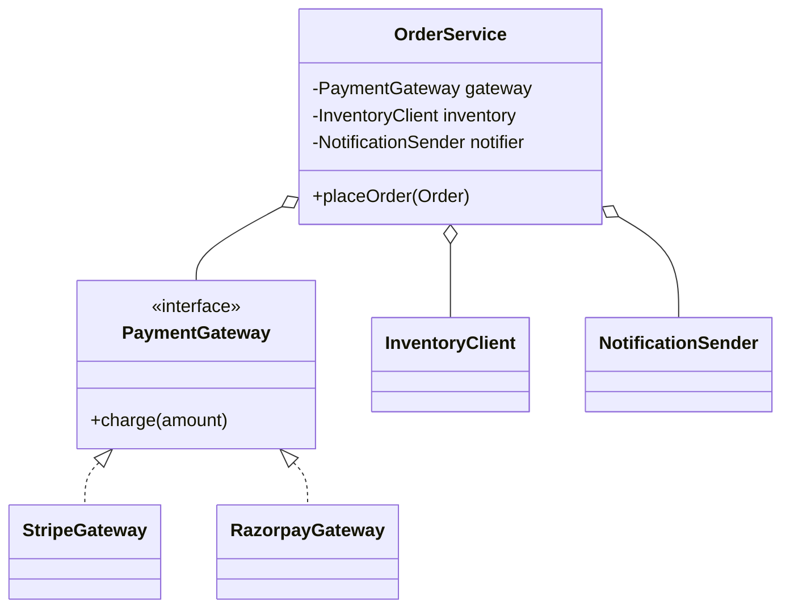

# Java OOP — The Four Pillars, Explained Through Real Code

> You've used OOP for years; this page is about *saying it crisply* and spotting the design traps interviewers probe.

---

## Table of Contents

1. The Restaurant Analogy
2. Encapsulation — Protect Your Invariants
3. Inheritance — IS-A, and Why It's Overused
4. Polymorphism — Overloading vs Overriding
5. Abstraction — Abstract Class vs Interface
6. Composition Over Inheritance
7. SOLID — Where Each Pillar Leads
8. Practice Assignments (Low / Medium / High)
9. Mini Project — Pluggable Payment Processor
10. Interview Corner
11. Quick Reference

---

## 1. The Restaurant Analogy

Think of a restaurant:

- **Encapsulation** — Customers never walk into the kitchen and adjust the stove. They interact through the menu and the waiter. The kitchen protects its own rules (food safety, order of cooking).
- **Abstraction** — The menu says "Margherita Pizza". You don't need to know the dough hydration or the oven temperature. You see *what*, not *how*.
- **Inheritance** — A "Pizza Chef" **is a** "Chef". Everything a chef does (wash hands, follow hygiene rules), a pizza chef also does — plus more.
- **Polymorphism** — The head chef shouts "Start cooking!" and the pizza chef, pastry chef, and grill chef each do something different in response to the **same** instruction.

Keep this picture in your head; every OOP interview question maps back to it.

---

## 2. Encapsulation — Protect Your Invariants

Encapsulation isn't "make fields private and generate getters/setters". That's the syntax. The *point* is: **an object guarantees its own rules (invariants) can never be broken from outside.**

### Scenario: a bank account balance

❌ **Wrong — a data bag with setters:**

```java
public class Account {
    private BigDecimal balance;

    public BigDecimal getBalance() { return balance; }
    public void setBalance(BigDecimal balance) { this.balance = balance; } // anyone can set -500
}

// Somewhere in a service, far away:
account.setBalance(account.getBalance().subtract(amount)); // no overdraft check, not atomic
```

Every caller must remember the business rule. One forgets → negative balance in production.

✅ **Right — behavior lives with the data:**

```java
public class Account {
    private final String id;
    private BigDecimal balance;

    public Account(String id, BigDecimal openingBalance) {
        if (openingBalance.signum() < 0) throw new IllegalArgumentException("Opening balance < 0");
        this.id = id;
        this.balance = openingBalance;
    }

    public void withdraw(BigDecimal amount) {
        if (amount.signum() <= 0) throw new IllegalArgumentException("Amount must be positive");
        if (balance.compareTo(amount) < 0) throw new InsufficientFundsException(id, amount);
        balance = balance.subtract(amount);
    }

    public void deposit(BigDecimal amount) {
        if (amount.signum() <= 0) throw new IllegalArgumentException("Amount must be positive");
        balance = balance.add(amount);
    }

    public BigDecimal balance() { return balance; }  // read-only view; BigDecimal is immutable
}
```

Now the invariant "balance never goes negative" is enforced in **one place**.

<div class="callout-warn">

**Leaky getters**: returning a mutable internal collection breaks encapsulation even if the field is private. `public List<LineItem> getItems() { return items; }` lets callers do `order.getItems().clear()`. Return `List.copyOf(items)` or `Collections.unmodifiableList(items)`.

</div>

### Access modifiers — quick table

| Modifier | Same class | Same package | Subclass (other pkg) | Everywhere |
|----------|:---:|:---:|:---:|:---:|
| `private` | ✅ | ❌ | ❌ | ❌ |
| *(package-private, no keyword)* | ✅ | ✅ | ❌ | ❌ |
| `protected` | ✅ | ✅ | ✅ | ❌ |
| `public` | ✅ | ✅ | ✅ | ✅ |

<div class="callout-tip">

**Applying this** — In Spring Boot apps, package-private is underused. Put a feature's controller, service, and repository in one package and make only the service's public API `public`. It's the cheapest modularity boundary you'll ever get, and tools like ArchUnit or Spring Modulith can enforce it.

</div>

---

## 3. Inheritance — IS-A, and Why It's Overused

Inheritance lets a subclass reuse and extend a parent's behavior. Use it only when the subclass truly **is a** specialized version of the parent **and can be used anywhere the parent is expected**.

```java
public abstract class Notification {
    protected final String recipient;
    protected Notification(String recipient) { this.recipient = recipient; }

    public final void send() {           // template method: fixed skeleton
        validate();
        deliver();
        audit();
    }
    protected void validate() { if (recipient == null) throw new IllegalStateException(); }
    protected abstract void deliver();   // subclasses fill in the variable part
    private void audit() { System.out.println("Sent to " + recipient); }
}

public class EmailNotification extends Notification {
    public EmailNotification(String email) { super(email); }       // super() must be first
    @Override protected void deliver() { /* SMTP call */ }
}

public class SmsNotification extends Notification {
    public SmsNotification(String phone) { super(phone); }
    @Override protected void validate() {
        super.validate();                                         // reuse parent logic
        if (!recipient.startsWith("+")) throw new IllegalArgumentException("E.164 required");
    }
    @Override protected void deliver() { /* SMS gateway call */ }
}
```

### Rules worth knowing cold

- Java has **single inheritance of classes**, multiple inheritance of **interfaces** (types).
- Constructors are **not** inherited. `super(...)` must be the first statement (Java 22+ relaxes this slightly with statements before `super` in preview/finalized in 25, but interviewers expect the classic rule).
- `private` methods aren't inherited/overridable; `static` methods are **hidden**, not overridden; `final` methods can't be overridden; `final` classes can't be extended (`String`, `Integer`).
- Java 17 `sealed` classes let you restrict *who* may extend: `public sealed class Shape permits Circle, Square {}`.

### The classic trap — Square extends Rectangle

```java
class Rectangle {
    protected int w, h;
    void setWidth(int w)  { this.w = w; }
    void setHeight(int h) { this.h = h; }
    int area() { return w * h; }
}
class Square extends Rectangle {
    @Override void setWidth(int w)  { this.w = w; this.h = w; }
    @Override void setHeight(int h) { this.w = h; this.h = h; }
}

void resize(Rectangle r) {
    r.setWidth(5);
    r.setHeight(4);
    assert r.area() == 20;   // 💥 fails for Square: area is 16
}
```

Mathematically a square *is a* rectangle, but **behaviorally** it isn't substitutable. This is the **Liskov Substitution Principle** violation interviewers love.

<div class="callout-scenario">

**Scenario**: Your team wants `PremiumCustomer extends Customer` to add discounts, then `CorporateCustomer extends Customer`, and now a customer can be both premium *and* corporate. **Decision**: Stop inheriting. Model `Customer` with a `List<DiscountPolicy>` or a `CustomerTier` + `CustomerType` composition. Inheritance hierarchies explode combinatorially when a concept has more than one independent axis of variation.

</div>

---

## 4. Polymorphism — Overloading vs Overriding

| | Overloading (compile-time / static) | Overriding (runtime / dynamic) |
|--|---|---|
| Where | Same class (or subclass) | Subclass redefines parent method |
| Signature | **Different** parameter lists | **Same** signature |
| Return type | Can differ | Same or covariant (subtype) |
| Resolved | By compiler, from **declared** (static) types | By JVM, from **actual** object type (virtual dispatch via vtable) |
| Access | Any | Can't be more restrictive |
| Exceptions | Any | Can't throw broader checked exceptions |

### Runtime polymorphism in action

```java
List<Notification> batch = List.of(
    new EmailNotification("a@shop.com"),
    new SmsNotification("+919800000000"));

for (Notification n : batch) n.send();   // each calls its own deliver()
```

The loop never checks types. Adding `PushNotification` requires **zero** changes here — that's the real value (Open/Closed Principle).

### The overloading trap interviewers use

```java
class Printer {
    void print(Object o) { System.out.println("Object"); }
    void print(String s) { System.out.println("String"); }
}

Object o = "hello";
new Printer().print(o);      // prints "Object" — overloads are chosen by DECLARED type
new Printer().print("hi");   // prints "String"
new Printer().print(null);   // prints "String" — most specific applicable overload
```

<div class="callout-interview">

**Q: "Is overloading polymorphism?"**

It's compile-time (static) polymorphism: the compiler picks the method from the declared argument types. Overriding is runtime polymorphism: the JVM dispatches on the actual object's class. Only overriding gives you "one call site, many behaviors" at runtime, which is what makes Strategy, Template Method, and Spring's proxies work.

</div>

### Modern Java: pattern matching (Java 17-21)

Sometimes you *want* to switch on types — e.g., over a closed set of domain events. With sealed types, the compiler checks exhaustiveness:

```java
sealed interface PaymentResult permits Approved, Declined, Pending {}
record Approved(String txnId) implements PaymentResult {}
record Declined(String reason) implements PaymentResult {}
record Pending(Duration retryAfter) implements PaymentResult {}

String message(PaymentResult r) {
    return switch (r) {                              // Java 21: no default needed
        case Approved a  -> "Paid: " + a.txnId();
        case Declined d  -> "Declined: " + d.reason();
        case Pending p   -> "Retry in " + p.retryAfter().toSeconds() + "s";
    };
}
```

Add a fourth result type and every non-exhaustive `switch` fails to **compile**. That's safer than a forgotten `instanceof` branch.

---

## 5. Abstraction — Abstract Class vs Interface

Abstraction = exposing *what* something does and hiding *how*. Java gives you two tools.

| | Abstract class | Interface |
|--|---|---|
| State (instance fields) | ✅ Yes | ❌ Only `static final` constants |
| Constructors | ✅ Yes | ❌ No |
| Method bodies | ✅ Any | `default`, `static`, `private` (Java 9+) |
| Multiple inheritance | ❌ Extend one | ✅ Implement many |
| Access modifiers on methods | Any | Implicitly `public` (except `private` helpers) |
| Relationship | "**is a** kind of" (shared identity + state) | "**can do**" (capability / contract) |
| Typical use | Template Method, shared base with fields | Ports, strategies, Spring beans, lambdas (functional interfaces) |

```java
// Capability: anything that can calculate a fee
public interface FeeCalculator {
    BigDecimal feeFor(BigDecimal amount);

    default BigDecimal totalWithFee(BigDecimal amount) {   // Java 8 default method
        return amount.add(feeFor(amount));
    }
}

// Shared state + skeleton: all card processors have a merchant id and retry policy
public abstract class CardProcessor implements FeeCalculator {
    protected final String merchantId;
    protected CardProcessor(String merchantId) { this.merchantId = merchantId; }
    public abstract ChargeResult charge(Card card, BigDecimal amount);
}
```

<div class="callout-info">

**Diamond with default methods**: if a class implements two interfaces that both provide `default void log()`, it **must** override `log()` and can pick one explicitly: `A.super.log();`. Class methods always win over interface defaults ("class wins" rule).

</div>

<div class="callout-scenario">

**Scenario**: You're designing a `ReportExporter` for PDF, CSV and Excel. They share file naming, audit logging, and a temp-directory field. **Answer**: Define an `interface ReportExporter` as the public contract (so Spring can inject `List<ReportExporter>`), plus an `abstract class AbstractReportExporter implements ReportExporter` holding the shared state and template method. Callers depend on the interface; implementations reuse the base class. This "interface + skeletal implementation" pattern is exactly what `List` / `AbstractList` do in the JDK.

</div>

---

## 6. Composition Over Inheritance

Inheritance is a **compile-time, permanent, tight** coupling. Composition is **runtime, swappable, loose**.



❌ `class OrderService extends StripePaymentService` — now every order is stuck with Stripe, and you can't test without it.

✅ `OrderService` **has a** `PaymentGateway` injected via the constructor. Swap providers by configuration, mock it in tests.

<div class="callout-tip">

**Applying this** — Spring's whole model is composition: constructor-injected interfaces. When you feel like writing `extends BaseService` to share a helper method, extract that helper into its own bean and inject it instead. Inheritance in Spring apps is best kept for framework hooks (`OncePerRequestFilter`, `AbstractHealthIndicator`).

</div>

---

## 7. SOLID — Where Each Pillar Leads

| Principle | One-liner | OOP pillar it builds on | Smell when violated |
|-----------|-----------|--------------------------|---------------------|
| **S**ingle Responsibility | One reason to change | Encapsulation | `OrderService` with 2,000 lines doing pricing, email, PDF |
| **O**pen/Closed | Extend without modifying | Polymorphism | `if (type == "STRIPE") ... else if ("RAZORPAY")` scattered everywhere |
| **L**iskov Substitution | Subtypes usable as their parent | Inheritance | Subclass throws `UnsupportedOperationException` or changes meaning |
| **I**nterface Segregation | Small, focused interfaces | Abstraction | `Worker` interface forces `Robot` to implement `eat()` |
| **D**ependency Inversion | Depend on abstractions | Abstraction + composition | Service does `new MySqlOrderRepository()` |

### OCP by example — killing the if-else chain

❌ Before:

```java
BigDecimal shippingCost(Order o) {
    if (o.type().equals("STANDARD")) return new BigDecimal("50");
    else if (o.type().equals("EXPRESS")) return new BigDecimal("150");
    else if (o.type().equals("SAME_DAY")) return new BigDecimal("300");
    throw new IllegalArgumentException();
}
```

✅ After — a strategy per type, discovered by Spring:

```java
public interface ShippingStrategy {
    ShippingType type();
    BigDecimal cost(Order order);
}

@Component class ExpressShipping implements ShippingStrategy {
    public ShippingType type() { return ShippingType.EXPRESS; }
    public BigDecimal cost(Order o) { return new BigDecimal("150"); }
}

@Service
public class ShippingCalculator {
    private final Map<ShippingType, ShippingStrategy> byType;

    public ShippingCalculator(List<ShippingStrategy> strategies) {
        this.byType = strategies.stream()
            .collect(Collectors.toMap(ShippingStrategy::type, s -> s));
    }
    public BigDecimal cost(Order o) { return byType.get(o.shippingType()).cost(o); }
}
```

New shipping type = one new class. `ShippingCalculator` never changes.

<div class="callout-interview">

**Q: "Give me a real example of the Liskov Substitution Principle being violated."**

`Collections.unmodifiableList` returns a `List` whose `add()` throws `UnsupportedOperationException` — code written against `List` can break at runtime. In domain code: a `ReadOnlyAccount extends Account` that throws on `withdraw()`. The fix is to separate the capabilities into different interfaces (`ReadableAccount`, `WithdrawableAccount`) so the type system tells the truth.

</div>

---

## 8. 🏋️ Practice Assignments

### 🟢 Low — Build the reflexes

**L1.** What prints?

```java
class Animal { String sound() { return "..."; } static String kind() { return "animal"; } }
class Dog extends Animal { String sound() { return "Woof"; } static String kind() { return "dog"; } }

Animal a = new Dog();
System.out.println(a.sound() + " " + a.kind());
```

<details>
<summary>Show answer</summary>

`Woof animal`. `sound()` is an instance method → overridden → runtime dispatch to `Dog`. `kind()` is `static` → **hidden**, not overridden → resolved by the declared type `Animal`. (Calling static methods via an instance is legal but a warning; always call `Animal.kind()`.)

</details>

**L2.** Fix the encapsulation leak:

```java
public class Cart {
    private final List<Item> items = new ArrayList<>();
    public List<Item> getItems() { return items; }
}
```

<details>
<summary>Show answer</summary>

```java
public class Cart {
    private final List<Item> items = new ArrayList<>();

    public void add(Item item) {
        Objects.requireNonNull(item);
        items.add(item);
    }
    public List<Item> items() { return List.copyOf(items); }   // immutable snapshot
    public BigDecimal total() {
        return items.stream().map(Item::price).reduce(BigDecimal.ZERO, BigDecimal::add);
    }
}
```

Mutations go through methods that can enforce rules (max items, no nulls); readers get a copy they can't use to corrupt state.

</details>

**L3.** Can an interface have a constructor? Can an abstract class? Can you instantiate either?

<details>
<summary>Show answer</summary>

Interface: no constructor, can't be instantiated (but you can create an anonymous class or lambda that implements it). Abstract class: **has** constructors (called via `super()` from subclasses to initialize its fields), but can't be instantiated directly with `new`.

</details>

### 🟡 Medium — Design decisions

**M1.** Refactor this to follow OCP so adding "UPI" requires no edits to `PaymentService`:

```java
public class PaymentService {
    public void pay(String method, BigDecimal amt) {
        switch (method) {
            case "CARD" -> chargeCard(amt);
            case "WALLET" -> debitWallet(amt);
            default -> throw new IllegalArgumentException(method);
        }
    }
}
```

<details>
<summary>Show answer</summary>

```java
public interface PaymentMethodHandler {
    String method();
    void pay(BigDecimal amount);
}

@Component class CardHandler implements PaymentMethodHandler {
    public String method() { return "CARD"; }
    public void pay(BigDecimal amount) { /* card logic */ }
}

@Service
public class PaymentService {
    private final Map<String, PaymentMethodHandler> handlers;
    public PaymentService(List<PaymentMethodHandler> list) {
        handlers = list.stream().collect(Collectors.toMap(PaymentMethodHandler::method, h -> h));
    }
    public void pay(String method, BigDecimal amt) {
        var h = handlers.get(method);
        if (h == null) throw new IllegalArgumentException("Unsupported: " + method);
        h.pay(amt);
    }
}
```

Adding UPI = new `@Component UpiHandler`. `Collectors.toMap` also fails fast at startup if two handlers claim the same method.

</details>

**M2.** An `Employee` hierarchy: `Manager extends Employee`, `Engineer extends Employee`. Now some engineers become managers-of-engineers, and contractors appear who are engineers but get no benefits. What's wrong, and how do you model it?

<details>
<summary>Show answer</summary>

Two independent axes — **role** (engineer/manager) and **employment type** (full-time/contractor) — are being forced into one inheritance tree, which explodes into `ContractorEngineerManager`. Use composition: `Employee` has a `Set<Role>` (or `Role` strategy objects for role-specific behavior) and an `EmploymentType` (enum or `BenefitsPolicy` strategy). Roles can change at runtime without changing the object's class — something inheritance can't do.

</details>

**M3.** Why does this compile but misbehave? How would `@Override` have helped?

```java
class Money {
    private final long cents;
    Money(long c) { cents = c; }
    public boolean equals(Money other) { return other != null && cents == other.cents; }
}
Set<Money> set = new HashSet<>(List.of(new Money(100)));
System.out.println(set.contains(new Money(100)));   // false
```

<details>
<summary>Show answer</summary>

`equals(Money)` **overloads** `Object.equals(Object)` instead of overriding it; collections call `equals(Object)`, which is still identity-based. (And `hashCode` isn't overridden either.) Adding `@Override` makes the compiler reject `equals(Money)` because it doesn't override anything. Fix: `@Override public boolean equals(Object o)` plus a matching `hashCode()` — or just make it a `record Money(long cents)`.

</details>

### 🔴 High — Think like a senior

**H1.** Design the domain model for a ride-hailing fare engine: base fare varies by vehicle type (Auto, Mini, Sedan, SUV), surge applies in some zones, promo codes give percentage or flat discounts, and some corporate accounts get fixed-price rides. Sketch interfaces/classes and explain which OOP principle each choice serves.

<details>
<summary>Show answer</summary>

```java
public interface FareRule {                    // one step in a pricing pipeline
    Money apply(Money current, RideContext ctx);
}

public record VehicleBaseFare(Map<VehicleType, Rate> rates) implements FareRule { ... }
public record SurgeRule(SurgeProvider surge) implements FareRule { ... }
public sealed interface Promo extends FareRule permits PercentOff, FlatOff {}
public record CorporateFixedPrice(Money price) implements FareRule {
    public Money apply(Money current, RideContext c) { return price; }   // overrides everything
}

public final class FareEngine {
    private final List<FareRule> pipeline;      // ordered, assembled per ride
    public Money quote(RideContext ctx) {
        Money m = Money.ZERO;
        for (FareRule r : pipeline) m = r.apply(m, ctx);
        return m;
    }
}
```

- **Abstraction / ISP**: one tiny `FareRule` interface.
- **Polymorphism / OCP**: new rule types (tolls, airport fee) = new classes; engine unchanged.
- **Composition**: the pipeline is assembled at runtime from the account type, zone, and promo, instead of `CorporateSurgeSedanFare` subclasses.
- **Encapsulation**: `Money` is an immutable value object with currency and rounding rules inside it.
- **Sealed promos**: exhaustive handling where you *do* need to switch (e.g., rendering the receipt).

Trade-off to mention: the rule order matters (discount before or after surge?), so make ordering explicit and test it.

</details>

**H2.** A colleague argues "interfaces with one implementation are pointless ceremony in Spring apps". When do you agree and when not?

<details>
<summary>Show answer</summary>

Agree for internal services with one implementation and no boundary — `OrderServiceImpl implements OrderService` adds indirection with no benefit; Spring can proxy classes (CGLIB) and Mockito can mock classes. Disagree at **architectural boundaries (ports)**: repositories, payment gateways, message publishers, clock/ID generators, external API clients. There the interface is the seam that lets the domain stay independent of infrastructure (DIP / hexagonal architecture) and lets you swap or fake the adapter. The rule: introduce an interface when there's a boundary or a realistic second implementation (including a test fake), not by reflex.

</details>

---

## 9. 🛠️ Mini Project — Pluggable Payment Processor

**Goal**: A small, plain-Java (no Spring needed) console app that demonstrates all four pillars plus OCP and DIP. 1-2 evenings.

**Requirements**

1. `Money` value object — immutable, currency-aware, rejects mixing currencies, `add`/`subtract`/`multiply(percent)`.
2. `PaymentMethod` sealed interface with `Card`, `Upi`, `Wallet` records, each with its own validation (Luhn check for card numbers, VPA format `name@bank` for UPI, balance check for wallet).
3. `PaymentProcessor` interface: `PaymentResult process(PaymentRequest req)`. Implementations: `CardProcessor`, `UpiProcessor`, `WalletProcessor`.
4. `AbstractPaymentProcessor` implementing a template method: `validate → applyFee → execute → audit`. Subclasses implement only `execute` and `feeFor`.
5. `PaymentRouter` receives a `List<PaymentProcessor>` in its constructor and routes by payment method type — **no `if/else` on types** in the router.
6. `PaymentResult` sealed: `Success`, `Failure(reason)`, `RequiresOtp(txnId)`; print receipts with an exhaustive `switch`.

**Suggested structure**

```text
payment/
 ├─ domain/      Money, PaymentMethod (+records), PaymentRequest, PaymentResult
 ├─ processor/   PaymentProcessor, AbstractPaymentProcessor, Card/Upi/WalletProcessor
 ├─ routing/     PaymentRouter
 └─ App.java     wires processors, runs 6 sample payments
```

**Acceptance criteria**

- Adding a `NetBankingProcessor` touches **only** new files (+1 line of wiring in `App`).
- JUnit tests: `Money` rules, each validation, router picks the right processor, a fake processor proves the router depends only on the interface.
- No public setters anywhere.

**Stretch**: add a decorator `RetryingPaymentProcessor implements PaymentProcessor` that wraps any processor and retries `Failure` results marked retryable — composition in action.

---

## 🎯 Interview Corner

<div class="callout-interview">

**Q: "Explain the four pillars of OOP with an example from a system you've built."**

Encapsulation: our `Account` domain object exposes `withdraw()` and `deposit()` instead of `setBalance()`, so the no-overdraft rule lives in one place and can't be bypassed. Abstraction: services depend on a `PaymentGateway` interface and never see Stripe's SDK. Inheritance: we used it sparingly, for a template-method base class for scheduled jobs that handles locking and metrics while subclasses implement `execute()`. Polymorphism: Spring injects all `PaymentGateway` implementations and we route by method, so a new provider is a new class, not an edited switch statement. The pillars that pay off the most in practice are encapsulation and polymorphism through interfaces.

**Follow-up trap**: "So inheritance is bad?" → No, it's a strong coupling that should be reserved for genuine IS-A relationships with substitutable behavior. Framework extension points and template methods are good uses; sharing utility code isn't.

</div>

<div class="callout-interview">

**Q: "Abstract class or interface — how do you decide?"**

If I'm defining a capability or a contract that unrelated classes can fulfil, or a boundary I want to mock or swap, I use an interface: it supports multiple implementation, works with lambdas if it's functional, and it's what Spring injection is built around. If implementations share state — fields, constructor logic — or a fixed algorithm skeleton, I add an abstract class, usually *behind* an interface, the way `AbstractList` implements `List`. Since Java 8, default methods cover simple shared behavior in interfaces, so an abstract class really comes down to needing state or constructors.

**Follow-up trap**: "Can default methods replace abstract classes entirely?" → No. Interfaces can't hold instance state or constructors, and default methods can't be `protected` or `final`, so you can't lock a template method.

</div>

<div class="callout-interview">

**Q: "What's the difference between method overloading and overriding, and how does the JVM resolve each?"**

Overloading means the same name with different parameter lists; the compiler picks the method at compile time using the declared static types of the arguments, choosing the most specific applicable overload. Overriding means a subclass provides a new implementation of the same signature; the JVM chooses at runtime based on the actual object's class, through `invokevirtual` and the class's method table. So `Object o = "x"; print(o)` calls `print(Object)` even though `o` is a String. Static, private, and final methods aren't dispatched virtually, so static methods are hidden, not overridden.

</div>

<div class="callout-interview">

**Q: "Your codebase has a 3,000-line OrderService. How would you break it up using OOP principles?"**

First I'd map its responsibilities — pricing, inventory reservation, payment, notifications, PDF invoices — and the reasons each one changes, which is SRP. Each becomes its own collaborator behind a small interface, injected into a now-thin `OrderService` that orchestrates. Scattered type-switches become strategies (OCP), and rules that manipulate order state move *into* the `Order` aggregate as methods, which is encapsulation, instead of living in the service. I'd do it incrementally behind characterization tests: extract one responsibility per PR so behavior never changes in the same PR as the structure.

</div>

---

## Quick Reference

| Concept | One-Liner |
|---------|-----------|
| Encapsulation | Object enforces its own invariants; no setters for business state |
| Abstraction | Expose *what*, hide *how*; depend on interfaces at boundaries |
| Inheritance | IS-A + substitutable; single class inheritance in Java |
| Polymorphism | Overload = compile-time by declared type; override = runtime by actual type |
| Static methods | Hidden, not overridden |
| Abstract class | State + constructors + template methods |
| Interface | Capability/contract; multiple; `default`/`static`/`private` methods |
| Composition | Has-a, injected, swappable — prefer it over inheritance |
| LSP smell | Subclass throws `UnsupportedOperationException` or changes meaning |
| Java 17+ | `sealed` + `record` + pattern `switch` = exhaustive, compiler-checked type hierarchies |

---

## Related Topics

- `java-equals-hashcode` — overriding `equals` correctly is where OOP meets collections
- `lld-thinking-framework` — applying these principles to full LLD problems
- `spring-beans-di` — composition and DIP, the Spring way

> **Inheritance answers "what is it?"; composition answers "what can it do?". Most real systems care about the second question.**

---

<!-- journey-link:start -->

<div class="callout-journey">

🛒 **ShopNorth Journey** — ShopNorth's Order has no setters: encapsulation keeps the status rules inside the class, and polymorphic pricing rules keep checkout closed for modification.

**Continue the story:** [Chapter 3 · Low-Level Design](/tutorials/journey-03-low-level-design) · **New here?** [Start the journey](/tutorials/journey-start)

</div>

<!-- journey-link:end -->
