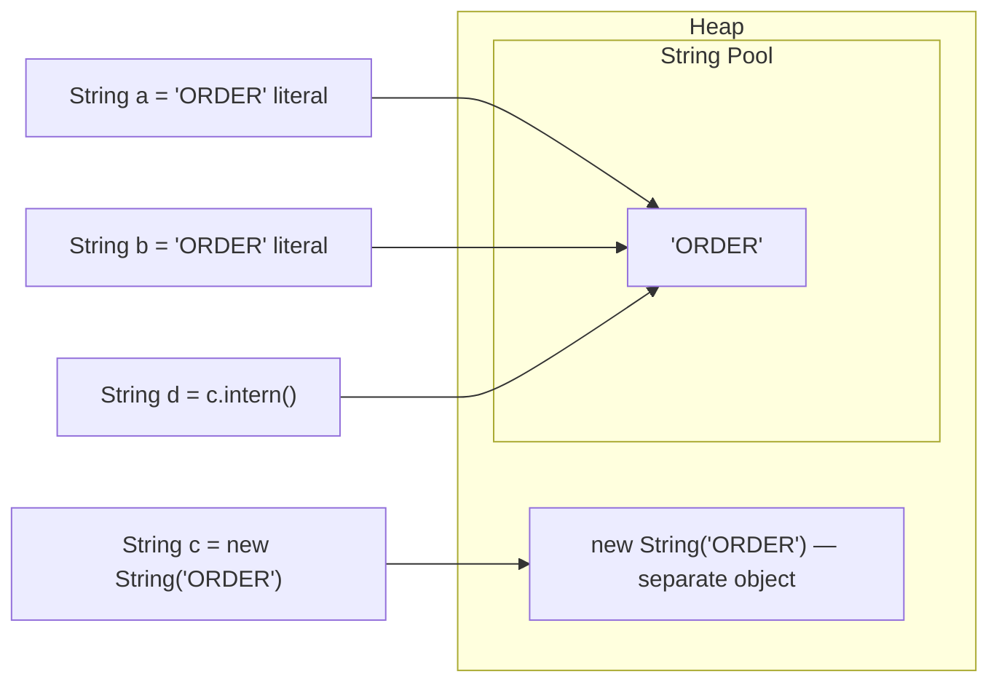

# Strings — Pool, Builder, Buffer, and the Traps Interviewers Love

<!-- sdlc-stage:start -->
<div class="sdlc-stage">

📍 **SDLC stage: Testing — code quality & review** · ShopNorth uses this in [Chapter 9 · Code Quality — SonarQube & Coverity](/tutorials/journey-09-code-quality)

</div>
<!-- sdlc-stage:end -->

> Strings are the most-used type in any Java service and the most common source of "what does this print?" questions.

---

## Table of Contents

1. The Printed Poster Analogy
2. Immutability — What It Really Means
3. The String Pool and `intern()`
4. `==` vs `equals()` — The Output Questions
5. Concatenation: `+`, StringBuilder, StringBuffer
6. Memory Internals — Compact Strings & Encoding
7. Everyday APIs Worth Knowing (Java 11-21)
8. Strings in Production — Performance & Security
9. Practice Assignments (Low / Medium / High)
10. Mini Project — Log Line Parser & Masker
11. Interview Corner
12. Quick Reference

---

## 1. The Printed Poster Analogy

A `String` is like a **printed poster**. Once printed, you can't change a letter on it. If you want "SALE 50%" instead of "SALE 40%", you print a **new** poster. The old one is still on the wall until the cleaners (the garbage collector) take it down.

- Because posters never change, a city can **reuse** the same poster in many places — that's the **String pool**.
- A `StringBuilder` is a **whiteboard**: you can erase and rewrite freely, then "print" the final version with `toString()`.
- A `StringBuffer` is a whiteboard with a **lock on the marker** — only one person writes at a time. Safe, but slower, and rarely needed.

---

## 2. Immutability — What It Really Means

```java
String status = "PENDING";
status.toLowerCase();            // returns a NEW string; result discarded
System.out.println(status);      // PENDING — unchanged

status = status.toLowerCase();   // reassign the REFERENCE to the new object
System.out.println(status);      // pending
```

The **object** never changes; the **variable** can point somewhere else. Every method that looks like it modifies (`replace`, `trim`, `substring`, `concat`, `toUpperCase`) returns a new `String`.

### Why Java made String immutable

| Reason | What would break otherwise |
|--------|----------------------------|
| **String pool** | If literals were shared and mutable, changing one would change "every" `"admin"` in the JVM |
| **Security** | A file path or DB URL could be changed *after* a permission check (time-of-check/time-of-use) |
| **Hash caching** | `String` caches its `hashCode` in a field → fast `HashMap` keys; mutation would corrupt maps |
| **Thread safety** | Share freely across threads with no synchronization |
| **Class loading** | Class names are strings; a mutable one could load the wrong class |

<div class="callout-info">

`String` is `final`, its internal `byte[] value` is `private final`, and no method writes into that array after construction. (Reflection or `Unsafe` could technically poke it, but that's out of bounds; strong encapsulation since Java 17 blocks it by default.)

</div>

---

## 3. The String Pool and `intern()`

The **string pool** (string constant pool) is a JVM-wide table of unique string instances. Since **Java 7** it lives on the **heap** (it was in PermGen before), so pooled strings can be garbage-collected.



| Code | Objects created (at most) |
|------|---------------------------|
| `String a = "ORDER";` | 0 or 1 (the pooled literal, created once when the class's constants are resolved) |
| `String c = new String("ORDER");` | 1 new heap object **every time** + the literal in the pool if not already there |
| `c.intern()` | 0 — returns the pooled instance (adds `c`'s value to the pool if absent) |

### Compile-time constants are pooled too

```java
final String prefix = "ORD";
String a = prefix + "-1";   // compile-time constant (prefix is final + literal) → pooled "ORD-1"
String b = "ORD-1";
a == b;                     // true

String p2 = "ORD";          // not final
String c = p2 + "-1";       // computed at runtime → new object
c == b;                     // false
```

<div class="callout-warn">

**Don't sprinkle `intern()` for "memory savings".** Interning millions of unique values (user IDs, request IDs) fills the pool's hash table and costs CPU on every call. The JVM already offers **G1 string deduplication** (`-XX:+UseStringDeduplication`), which dedupes the backing arrays of long-lived strings automatically, with no code changes. Consider `intern()` only for a small, known set of highly repeated values (country codes, enum-like strings parsed from files).

</div>

---

## 4. `==` vs `equals()` — The Output Questions

```java
String s1 = "java";
String s2 = "java";
String s3 = new String("java");
String s4 = s3.intern();
String s5 = "ja" + "va";         // constant-folded at compile time
String part = "ja";
String s6 = part + "va";         // runtime concatenation

System.out.println(s1 == s2);        // true  — same pooled literal
System.out.println(s1 == s3);        // false — new object
System.out.println(s1 == s4);        // true  — intern returns the pooled one
System.out.println(s1 == s5);        // true  — compile-time constant
System.out.println(s1 == s6);        // false — built at runtime
System.out.println(s1.equals(s6));   // true  — same content
```

<div class="callout-interview">

🎯 **Interview Ready** — "How many objects does `new String("hello")` create?" → Up to two: the literal `"hello"` in the string pool, created when the class's constant is first resolved if it isn't already pooled, and one new `String` object on the heap from `new`, created every time that line runs. On JDK 9+ the two can share the same backing byte array.

</div>

### Comparing safely

```java
"ACTIVE".equals(status)                // null-safe: literal first (Yoda style)
Objects.equals(a, b)                   // null-safe for two variables
status.equalsIgnoreCase("active")      // case-insensitive
a.compareTo(b)                         // lexicographic ordering (for sorting)
```

---

## 5. Concatenation: `+`, StringBuilder, StringBuffer

| | `String` + | `StringBuilder` | `StringBuffer` |
|--|-----------|-----------------|----------------|
| Mutable | ❌ | ✅ | ✅ |
| Thread-safe | ✅ (immutable) | ❌ | ✅ (`synchronized` methods) |
| Speed | Fine for one expression; terrible in loops | Fastest | Slower (lock overhead, though the JIT may elide it) |
| Since | 1.0 | 1.5 | 1.0 (legacy) |
| Use when | Single-line concatenation | Building strings in loops / methods | Almost never — sharing a mutable builder across threads is itself a design smell |

### The loop trap

```java
// ❌ O(n²): each += creates a new String and copies all previous characters
String csv = "";
for (Order o : orders) {
    csv += o.id() + ",";
}

// ✅ O(n): one growing buffer
StringBuilder sb = new StringBuilder(orders.size() * 12);   // pre-size if you can estimate
for (Order o : orders) {
    sb.append(o.id()).append(',');
}
String csv2 = sb.toString();

// ✅ Even better — clearer, handles separators
String csv3 = orders.stream().map(Order::id).collect(Collectors.joining(","));
String csv4 = String.join(",", listOfIds);
```

With 10,000 orders, the `+=` loop copies roughly 50 million characters; the builder copies ~120,000.

### What does the compiler do with `+`?

- **Java 8**: `a + b + c` compiles to `new StringBuilder().append(a).append(b).append(c).toString()`.
- **Java 9+** (JEP 280): compiles to an `invokedynamic` call to `StringConcatFactory`, which picks an optimized strategy at runtime (exact-size allocation, no intermediate builder).

So **single-expression `+` is fine**, and often faster than a hand-written builder on modern JDKs. The problem is only `+=` inside a **loop**, because each iteration is a separate expression.

<div class="callout-tip">

**Applying this** — For logging, never build messages eagerly: `log.debug("Order " + order + " failed")` builds the string even when DEBUG is off. Use placeholders: `log.debug("Order {} failed", order.id())`. SLF4J formats only if the level is enabled.

</div>

### StringBuilder capacity growth

Default capacity is 16. When full it grows to `(old * 2) + 2` and copies. A builder reused in a loop can be reset with `sb.setLength(0)` (keeps its capacity).

---

## 6. Memory Internals — Compact Strings & Encoding

| Version | Internal storage |
|---------|------------------|
| Java 8 | `char[] value` — **2 bytes per char**, always (UTF-16) |
| Java 9+ | `byte[] value` + `byte coder` — **Compact Strings** (JEP 254): LATIN-1 (1 byte/char) if every char fits, else UTF-16 |

For typical English/ASCII-heavy data (IDs, JSON keys, log lines), Java 9+ roughly **halves** string memory. A single non-Latin-1 character (say `"₹"` or `"नमस्ते"`) switches that string to UTF-16.

### Encoding — always be explicit

```java
byte[] bytes = text.getBytes();                          // ❌ platform default (was OS-dependent before Java 18)
byte[] utf8  = text.getBytes(StandardCharsets.UTF_8);    // ✅
String back  = new String(utf8, StandardCharsets.UTF_8); // ✅
```

Java 18 (JEP 400) made UTF-8 the default charset, but explicit charsets keep code correct on older JVMs and make intent obvious.

<div class="callout-warn">

**`length()` is not "number of characters a human sees".** `"😀".length()` is **2** (a surrogate pair in UTF-16). Use `codePointCount` or `codePoints()` for user-facing limits ("max 280 characters"), and never `substring` through the middle of a surrogate pair — you'll produce garbage.

</div>

---

## 7. Everyday APIs Worth Knowing (Java 11-21)

| API | Since | Example |
|-----|-------|---------|
| `isBlank()` | 11 | `"  ".isBlank()` → true (whitespace-aware; `isEmpty()` → false) |
| `strip()` / `stripLeading()` / `stripTrailing()` | 11 | Unicode-aware version of `trim()` |
| `lines()` | 11 | `text.lines().filter(l -> l.contains("ERROR")).count()` |
| `repeat(n)` | 11 | `"-".repeat(40)` |
| Text blocks `"""` | 15 | Multi-line SQL/JSON without escaping |
| `formatted(...)` | 15 | `"Order %s total %.2f".formatted(id, amt)` |
| `chars()` / `codePoints()` | 8 / 8 | Streams of characters |
| `String.join` / `Collectors.joining` | 8 | Join with delimiter, prefix, suffix |
| `indent(n)`, `transform(fn)` | 12 | Formatting helpers |

```java
String sql = """
    SELECT o.id, o.total
    FROM orders o
    WHERE o.customer_id = ?
      AND o.status = 'PAID'
    """;
```

<div class="callout-warn">

**`split` takes a regex.** `"a.b.c".split(".")` returns an **empty array** (`.` matches everything). Use `split("\\.")` or `Pattern.quote(".")`. Also, trailing empty strings are dropped: `"a,b,,".split(",")` → `[a, b]`; use `split(",", -1)` to keep them — this matters when parsing CSV.

</div>

---

## 8. Strings in Production — Performance & Security

### Precompile regexes

```java
// ❌ Compiles the regex on every call (String.matches / replaceAll / split with regex)
boolean ok = email.matches("^[\\w.+-]+@[\\w-]+\\.[\\w.]+$");

// ✅ Compile once
private static final Pattern EMAIL = Pattern.compile("^[\\w.+-]+@[\\w-]+\\.[\\w.]+$");
boolean ok2 = EMAIL.matcher(email).matches();
```

(`String.split` has a fast path for single-character non-regex-metachar delimiters, so `split(",")` doesn't compile a regex.)

### Passwords in `char[]`, not `String`

A `String` password stays in memory (and possibly in the pool or heap dumps) until GC, and you can't wipe it. A `char[]` can be zeroed with `Arrays.fill(pw, '\0')` right after use. That's why `JPasswordField.getPassword()` and `Console.readPassword()` return `char[]`.

<div class="callout-scenario">

**Scenario**: A support engineer attaches a production heap dump to a ticket, and it contains customer card numbers and JWTs in plain text. **Decision**: Heap dumps are sensitive data — treat them like a database backup. In code: never `toString()` sensitive DTOs (override `toString` to mask, or use a `Secret` wrapper type), mask values in logs (`**** **** **** 4242`), and hold short-lived secrets in `char[]`/`byte[]` that you clear after use.

</div>

### Injection is a string problem

```java
// ❌ SQL injection
String q = "SELECT * FROM users WHERE email = '" + email + "'";

// ✅ Parameterized
jdbcTemplate.query("SELECT * FROM users WHERE email = ?", mapper, email);
```

The same rule applies to log injection (strip `\r\n` from user input written to logs), HTML (escape on output), and shell commands (never build them from user strings).

---

## 9. 🏋️ Practice Assignments

### 🟢 Low — Build the reflexes

**L1.** What prints?

```java
String a = "hello";
String b = "hel" + "lo";
String c = new String("hello");
String d = c;
System.out.println((a == b) + " " + (a == c) + " " + (c == d) + " " + a.equals(c));
```

<details>
<summary>Show answer</summary>

`true false true true`. `"hel" + "lo"` is folded at compile time into the pooled `"hello"`. `c` is a new heap object. `d` is the same reference as `c`. `equals` compares content.

</details>

**L2.** What's the output, and why?

```java
String s = "  Order-42  ";
s.trim();
s.toUpperCase();
System.out.println("[" + s + "]");
```

<details>
<summary>Show answer</summary>

`[  Order-42  ]` — unchanged. Both methods return new strings that are thrown away. Fix: `s = s.trim().toUpperCase();` (or `strip()` for Unicode-aware trimming).

</details>

**L3.** What does `"2026-03-15".split("-").length` return? And `"a|b|c".split("|").length`?

<details>
<summary>Show answer</summary>

3 — `-` isn't a regex metacharacter outside brackets. The second returns **5**: `|` is regex alternation of two empty patterns, which matches the empty string between characters, so you get `[a, |, b, |, c]`. Use `split("\\|")` to get 3.

</details>

### 🟡 Medium — Apply it

**M1.** Write `mask(String cardNumber)` → keeps only the last 4 digits (`"4111111111111111"` → `"************1111"`), handles null and strings shorter than 4.

<details>
<summary>Show answer</summary>

```java
static String mask(String card) {
    if (card == null) return null;
    String digits = card.replaceAll("\\D", "");           // drop spaces/dashes
    if (digits.length() <= 4) return "*".repeat(digits.length());
    return "*".repeat(digits.length() - 4) + digits.substring(digits.length() - 4);
}
```

For hot paths, precompile `\\D` as a `Pattern`. Never log the unmasked value, even at DEBUG.

</details>

**M2.** Reverse the words in a sentence, collapsing multiple spaces: `"  order   service  down "` → `"down service order"`.

<details>
<summary>Show answer</summary>

```java
static String reverseWords(String s) {
    String[] words = s.strip().split("\\s+");
    Collections.reverse(Arrays.asList(words));   // Arrays.asList is a view over the array
    return String.join(" ", words);
}
```

Edge case: an all-blank input gives `[""]` after `strip().split`, and the result is `""`, which is correct. See `dsa-strings` for the in-place `char[]` version interviewers sometimes ask for.

</details>

**M3.** A method builds a 5 MB CSV export using `+=` in a loop and takes 40 seconds. Rewrite it, and explain the complexity difference.

<details>
<summary>Show answer</summary>

```java
StringBuilder sb = new StringBuilder(5 * 1024 * 1024);
sb.append("id,customer,amount\n");
for (Order o : orders) {
    sb.append(o.id()).append(',')
      .append(csvEscape(o.customer())).append(',')
      .append(o.amount().toPlainString()).append('\n');
}
return sb.toString();
```

`+=` in a loop is O(n²) in total characters copied (each iteration copies everything so far); the builder is amortized O(n). Better still for exports: **stream** straight to the `HttpServletResponse` `Writer` (or `StreamingResponseBody`) so you never hold 5 MB in memory. And don't forget CSV escaping of commas and quotes.

</details>

### 🔴 High — Think like a senior

**H1.** A service parses 20,000 JSON events/sec. Profiling shows 30% of the heap is `String` objects with only ~50 distinct values of `eventType` and `country`. What are your options?

<details>
<summary>Show answer</summary>

1. **Map to enums** at the parsing boundary (`EventType.valueOf`, or a custom Jackson deserializer) — the best fix: type safety and zero duplicate strings.
2. If the values are open-ended but low-cardinality: a small canonicalizing cache (`ConcurrentHashMap<String,String>.computeIfAbsent(s, k -> k)`) or `intern()` for those two fields only. Jackson already interns field **names** by default (`JsonFactory.Feature.INTERN_FIELD_NAMES`).
3. Enable **G1 string deduplication** (`-XX:+UseStringDeduplication`) for long-lived duplicates, with no code change — though it doesn't help short-lived garbage.
4. Check the real problem: if the events are short-lived, duplicates are cheap young-gen garbage; the issue may be retention (events queued too long) rather than duplication. Measure with JFR / a heap histogram before and after.

</details>

**H2.** Implement a `truncateForSms(String text, int maxChars)` that never breaks an emoji or other supplementary character, and appends `"…"` when truncated.

<details>
<summary>Show answer</summary>

```java
static String truncateForSms(String text, int maxChars) {
    if (text.codePointCount(0, text.length()) <= maxChars) return text;
    int endIndex = text.offsetByCodePoints(0, maxChars - 1);   // leave room for the ellipsis
    return text.substring(0, endIndex) + "…";
}
```

`offsetByCodePoints` converts a count of **code points** into a UTF-16 index, so the cut never lands inside a surrogate pair. For full correctness with combined emoji (family emoji, skin-tone modifiers, flags), iterate **grapheme clusters** with `java.text.BreakIterator.getCharacterInstance()` instead. Also mention that real SMS limits depend on encoding (GSM-7 = 160 chars, UCS-2 = 70).

</details>

---

## 10. 🛠️ Mini Project — Log Line Parser & Masker

**Goal**: A plain-Java CLI that reads a large application log, extracts structure, masks PII, and prints a summary. It exercises builders, regex, splitting, encoding, and performance. 1-2 evenings.

**Input** (generate 1M lines with a small script):

```text
2026-03-15T10:15:30.123Z INFO  [order-svc] orderId=ORD-9912 user=ravi@shop.com card=4111111111111111 amount=1499.00 status=PAID
2026-03-15T10:15:30.456Z ERROR [payment-svc] orderId=ORD-9913 user=asha@shop.com msg="Gateway timeout after 3000ms"
```

**Requirements**

1. Read with `Files.lines(path, StandardCharsets.UTF_8)` — stream the file, don't load it all.
2. Parse `key=value` pairs (values may be quoted and contain spaces) with one precompiled `Pattern`.
3. Mask emails (`r***@shop.com`) and card numbers (last 4 only); write the masked log to a new file with a `BufferedWriter`.
4. Summary: count by level, top 5 services by ERROR count, the p95 of `amount`.
5. Build each output line with a single reused `StringBuilder` (`setLength(0)`).

**Acceptance criteria**

- Processes 1M lines in under ~3 seconds on a laptop.
- No unmasked card number or email in the output (verify with a regex test).
- Unit tests for quoted values, missing keys, and non-ASCII names (`user=नेहा@shop.in`).

**Stretch**: compare throughput of `String.split` + `indexOf` parsing against the regex approach with JMH, and write down which you'd ship and why.

---

## 🎯 Interview Corner

<div class="callout-interview">

**Q: "Why are Strings immutable in Java, and what does that buy you?"**

Immutability lets the JVM share instances safely through the string pool. It makes strings thread-safe without synchronization. It lets `String` cache its hash code, which makes it an excellent `HashMap` key. And it closes security holes: a validated file path, class name, or connection URL can't be changed after the check. The cost is that every "modification" allocates a new object, which is why we use `StringBuilder` when building strings incrementally. In practice immutability also makes code easier to reason about, because a string you pass to a method can't be changed behind your back.

**Follow-up trap**: "Can you change a String using reflection?" → On old JDKs you could modify the private `value` array via reflection, which corrupts the pool. Since Java 17's strong encapsulation of JDK internals that's blocked by default, and it was never legitimate.

</div>

<div class="callout-interview">

**Q: "StringBuilder vs StringBuffer vs + — when do you use each?"**

For a single expression like `"Order " + id + " failed"`, I use `+`. Since Java 9 it compiles to an `invokedynamic` concat that is already optimal. Inside loops or when building a string across several method calls, I use `StringBuilder`: it's mutable and unsynchronized, so appends are amortized O(1), whereas `+=` in a loop is O(n²). `StringBuffer` is the legacy synchronized version. I essentially never use it, because sharing one mutable buffer across threads is a design problem to begin with. For joining collections I prefer `String.join` or `Collectors.joining`.

</div>

<div class="callout-interview">

**Q: "Explain the String pool. Where does it live, and should you call intern()?"**

The pool is a JVM-wide table of canonical string instances. Literals and compile-time constant expressions are pooled automatically, so identical literals share one object. Since Java 7 it lives on the regular heap rather than PermGen, so pooled strings can be garbage-collected, and the table size is tunable with `-XX:StringTableSize`. `intern()` returns the pooled copy, adding it if absent. I rarely call it: interning high-cardinality values bloats the table and costs CPU. For duplicate strings I'd convert to enums at the boundary or enable G1 string deduplication.

**Follow-up trap**: "Does `new String("x") == "x"`?" → No. `new` always creates a distinct heap object, so `==` is false while `equals` is true.

</div>

<div class="callout-interview">

**Q: "Your service's memory usage jumped after a release, and a heap histogram shows `byte[]` and `String` at the top. How do you investigate?"**

I'd take a heap dump (in a safe environment, since dumps contain PII) and use Eclipse MAT's dominator tree and "duplicate strings" report to find who retains the strings and how many are duplicates. Common culprits are caches without eviction keyed by strings, eager log-message building, huge JSON payloads held as strings instead of streamed, and `substring` of big documents kept alive. The fix depends on the finding: bound the cache, stream the parsing, use log placeholders, map repeated values to enums. Then I verify by comparing heap histograms and GC logs before and after.

</div>

---

## Quick Reference

| Concept | One-Liner |
|---------|-----------|
| Immutable | Methods return new strings; reassign the reference |
| Pool | Literals + compile-time constants shared; on heap since Java 7 |
| `new String("x")` | Always a new object (+ pooled literal) |
| `intern()` | Returns the pooled instance; don't use on high-cardinality data |
| `==` | Reference comparison — never for content |
| `+` in one expression | Fine (invokedynamic since Java 9) |
| `+=` in a loop | O(n²) — use `StringBuilder` |
| `StringBuffer` | Synchronized legacy; almost never needed |
| Compact Strings | Java 9+: LATIN-1 = 1 byte/char |
| `split` | Takes a regex; drops trailing empties unless `limit = -1` |
| `length()` | UTF-16 units, not user-visible characters |
| Secrets | `char[]`, cleared after use; mask in logs and `toString` |

---

## Related Topics

- `java-equals-hashcode` — why String makes a perfect map key
- `dsa-strings` — algorithmic string problems (anagrams, palindromes)
- `java-memory-model` — heap, GC, and where the pool lives

> **Strings are cheap to create and expensive to create a million times. Know which of those two situations your code is in.**

---

<!-- journey-link:start -->

<div class="callout-journey">

🛒 **ShopNorth Journey** — Chapter 9 shows a SonarQube finding where SQL was built by string concatenation in ShopNorth's admin search — and the parameterized fix.

**Continue the story:** [Chapter 9 · Code Quality — SonarQube & Coverity](/tutorials/journey-09-code-quality) · **New here?** [Start the journey](/tutorials/journey-start)

</div>

<!-- journey-link:end -->
