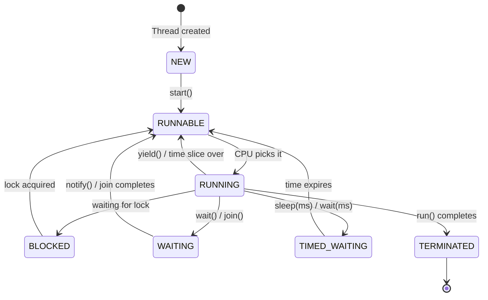

# Multithreading & Concurrency — Scenario-Based Guide

<!-- sdlc-stage:start -->
<div class="sdlc-stage">

📍 **SDLC stage: Development** · ShopNorth uses this in [Chapter 5 · Building with Spring Boot](/tutorials/journey-05-spring-boot)

</div>
<!-- sdlc-stage:end -->

## The Restaurant Analogy

Imagine a restaurant:
- **Single-threaded** = 1 waiter serving all tables. Customers wait forever.
- **Multi-threaded** = 5 waiters serving tables in parallel. Fast service.
- **Concurrency issue** = 2 waiters grab the last plate at the same time. Someone gets nothing.

That's multithreading in a nutshell — **speed through parallelism**, but **chaos without coordination**.

---

## 1. Creating Threads — 3 Ways

### Way 1: Extend Thread

```java
class MyThread extends Thread {
    @Override
    public void run() {
        System.out.println("Running in: " + Thread.currentThread().getName());
    }
}

new MyThread().start();  // start(), NOT run()!
```

### Way 2: Implement Runnable (Preferred)

```java
Runnable task = () -> System.out.println("Running in: " + Thread.currentThread().getName());
new Thread(task).start();
```

### Way 3: Implement Callable (Returns a result)

```java
Callable<Integer> task = () -> {
    Thread.sleep(1000);
    return 42;
};

ExecutorService executor = Executors.newSingleThreadExecutor();
Future<Integer> future = executor.submit(task);
System.out.println(future.get());  // blocks until result is ready → 42
executor.shutdown();
```

> **Rule**: Never extend Thread. Always use Runnable/Callable. Why? Java doesn't support multiple inheritance — if you extend Thread, you can't extend anything else.

---

## 2. Thread Lifecycle



---

## 3. synchronized — The Lock

### Scenario: Bank account with race condition

```java
class BankAccount {
    private int balance = 1000;

    // WITHOUT synchronized — BROKEN
    public void withdraw(int amount) {
        if (balance >= amount) {
            // Thread A checks: balance=1000, amount=800 ✓
            // Thread B checks: balance=1000, amount=800 ✓ (hasn't been deducted yet!)
            balance -= amount;
            // Thread A: balance = 200
            // Thread B: balance = -600 💥 NEGATIVE BALANCE!
        }
    }

    // WITH synchronized — SAFE
    public synchronized void withdrawSafe(int amount) {
        if (balance >= amount) {
            balance -= amount;  // only one thread at a time
        }
    }
}
```

### synchronized block (finer control)

```java
public void transfer(BankAccount from, BankAccount to, int amount) {
    synchronized (from) {
        synchronized (to) {
            from.withdraw(amount);
            to.deposit(amount);
        }
    }
}
```

> ⚠️ **Deadlock danger!** If Thread A locks `from` then waits for `to`, and Thread B locks `to` then waits for `from` — both wait forever. Solution: always lock in the same order.

---

## 4. volatile — Visibility Guarantee

### Scenario: Stop flag not working

```java
class Worker implements Runnable {
    private boolean running = true;  // NOT volatile — might never stop!

    public void run() {
        while (running) {  // Thread may cache 'running' and never see the update
            doWork();
        }
    }

    public void stop() {
        running = false;  // Main thread sets this, but worker might not see it
    }
}
```

### The Fix

```java
private volatile boolean running = true;
// volatile = "always read from main memory, never cache"
```

### What volatile does NOT do

```java
private volatile int counter = 0;

// This is STILL NOT thread-safe:
counter++;  // This is actually: read → increment → write (3 steps, not atomic)

// Use AtomicInteger instead:
private AtomicInteger counter = new AtomicInteger(0);
counter.incrementAndGet();  // atomic operation
```

---

## 5. ExecutorService — Thread Pool

### Why not create threads manually?

Creating a thread is expensive (~1MB stack memory). If you need 1000 tasks, don't create 1000 threads.

```java
// Thread pool with 4 threads — reuses them for all tasks
ExecutorService pool = Executors.newFixedThreadPool(4);

for (int i = 0; i < 100; i++) {
    final int taskId = i;
    pool.submit(() -> {
        System.out.println("Task " + taskId + " on " + Thread.currentThread().getName());
    });
}

pool.shutdown();  // no new tasks, finish existing ones
pool.awaitTermination(10, TimeUnit.SECONDS);  // wait for completion
```

### Types of Thread Pools

| Pool | Use Case |
|------|----------|
| `newFixedThreadPool(n)` | Known number of concurrent tasks |
| `newCachedThreadPool()` | Many short-lived tasks (creates threads as needed) |
| `newSingleThreadExecutor()` | Tasks must run sequentially |
| `newScheduledThreadPool(n)` | Delayed or periodic tasks |

### Scenario: Parallel API calls

```java
ExecutorService pool = Executors.newFixedThreadPool(3);

Future<User> userFuture = pool.submit(() -> fetchUser(userId));
Future<List<Order>> ordersFuture = pool.submit(() -> fetchOrders(userId));
Future<Profile> profileFuture = pool.submit(() -> fetchProfile(userId));

// All 3 calls run in parallel — total time = max(individual times)
User user = userFuture.get();
List<Order> orders = ordersFuture.get();
Profile profile = profileFuture.get();

pool.shutdown();
```

---

## 6. Locks — More Control Than synchronized

```java
import java.util.concurrent.locks.ReentrantLock;

class SafeCounter {
    private int count = 0;
    private final ReentrantLock lock = new ReentrantLock();

    public void increment() {
        lock.lock();
        try {
            count++;
        } finally {
            lock.unlock();  // ALWAYS unlock in finally!
        }
    }

    // tryLock — don't wait forever
    public boolean tryIncrement() {
        if (lock.tryLock()) {
            try {
                count++;
                return true;
            } finally {
                lock.unlock();
            }
        }
        return false;  // couldn't get lock, do something else
    }
}
```

### ReadWriteLock — Multiple readers, single writer

```java
ReadWriteLock rwLock = new ReentrantReadWriteLock();

// Multiple threads can read simultaneously
public String read() {
    rwLock.readLock().lock();
    try {
        return data;
    } finally {
        rwLock.readLock().unlock();
    }
}

// Only one thread can write (and no readers during write)
public void write(String newData) {
    rwLock.writeLock().lock();
    try {
        data = newData;
    } finally {
        rwLock.writeLock().unlock();
    }
}
```

---

## 7. wait(), notify(), notifyAll()

### Scenario: Producer-Consumer

```java
class SharedQueue {
    private final Queue<Integer> queue = new LinkedList<>();
    private final int capacity = 5;

    public synchronized void produce(int item) throws InterruptedException {
        while (queue.size() == capacity) {
            wait();  // queue full — wait for consumer
        }
        queue.add(item);
        System.out.println("Produced: " + item);
        notifyAll();  // wake up consumers
    }

    public synchronized int consume() throws InterruptedException {
        while (queue.isEmpty()) {
            wait();  // queue empty — wait for producer
        }
        int item = queue.poll();
        System.out.println("Consumed: " + item);
        notifyAll();  // wake up producers
        return item;
    }
}
```

> **Always use `while` with `wait()`, never `if`.** A thread can be woken up spuriously — the condition might still be false.

---

## 8. Atomic Classes — Lock-Free Thread Safety

```java
AtomicInteger counter = new AtomicInteger(0);

counter.incrementAndGet();     // ++counter (atomic)
counter.getAndIncrement();     // counter++ (atomic)
counter.compareAndSet(5, 10);  // if value==5, set to 10 (CAS operation)
counter.addAndGet(5);          // counter += 5 (atomic)

// Also available:
AtomicLong, AtomicBoolean, AtomicReference<T>
```

### Scenario: Thread-safe ID generator

```java
class IdGenerator {
    private static final AtomicLong counter = new AtomicLong(0);

    public static long nextId() {
        return counter.incrementAndGet();  // guaranteed unique across threads
    }
}
```

---

## 9. CountDownLatch & CyclicBarrier

### CountDownLatch — "Wait for N things to finish"

```java
// Scenario: Start the app only after all services are ready
CountDownLatch latch = new CountDownLatch(3);

executor.submit(() -> { initDatabase(); latch.countDown(); });
executor.submit(() -> { initCache(); latch.countDown(); });
executor.submit(() -> { initMessageQueue(); latch.countDown(); });

latch.await();  // blocks until count reaches 0
System.out.println("All services ready — starting app!");
```

### CyclicBarrier — "Everyone wait until all arrive"

```java
// Scenario: Parallel computation — merge results after all threads finish a phase
CyclicBarrier barrier = new CyclicBarrier(3, () -> {
    System.out.println("All threads reached barrier — merging results");
});

for (int i = 0; i < 3; i++) {
    executor.submit(() -> {
        computePartialResult();
        barrier.await();  // wait for others
        // continue to next phase
    });
}
```

---

## 10. Common Pitfalls Cheat Sheet

| Pitfall | Symptom | Fix |
|---------|---------|-----|
| Race condition | Inconsistent data | `synchronized` or `Atomic*` |
| Deadlock | App hangs forever | Lock ordering, `tryLock` with timeout |
| Starvation | One thread never runs | Fair locks: `new ReentrantLock(true)` |
| Livelock | Threads active but no progress | Add randomness to retry |
| Memory visibility | Stale values | `volatile` or `synchronized` |
| Thread leak | OOM over time | Always `shutdown()` ExecutorService |

---

---

<!-- practice-pack -->

## 🏢 Real-World Scenarios

<div class="callout-scenario">

**Scenario**: A Spring service uses `Executors.newFixedThreadPool(20)` to send emails asynchronously. During an SMTP outage, memory climbs until the pod is OOM-killed. **Decision**: `newFixedThreadPool` uses an **unbounded** `LinkedBlockingQueue`; when workers are stuck, tasks pile up forever. Build the pool explicitly with a bounded queue and a rejection policy, add timeouts to the SMTP client, and move durable work (emails that must be sent) to a message queue instead of an in-memory executor.

```java
ThreadPoolExecutor emailPool = new ThreadPoolExecutor(
    10, 20, 60, TimeUnit.SECONDS,
    new ArrayBlockingQueue<>(1_000),                          // bounded: backpressure
    Thread.ofPlatform().name("email-", 0).factory(),
    new ThreadPoolExecutor.CallerRunsPolicy());               // slow the producer instead of dropping silently
```

</div>

<div class="callout-scenario">

**Scenario**: Two services transfer money between accounts. Under load the application freezes; a thread dump shows threads `BLOCKED` waiting for each other's monitors. **Decision**: Classic deadlock — thread 1 locks account A then B, thread 2 locks B then A. Fix by acquiring locks in a **consistent global order** (e.g., by account ID), using `tryLock` with a timeout, or better, letting the database handle it with ordered row locks (see `spring-transactional`). Take thread dumps (`jstack`, `jcmd Thread.print`) during incidents — the JVM reports detected deadlocks explicitly.

</div>

## 🏋️ Practice Assignments

### 🟢 Low — Build the reflexes

**L1.** What does `volatile` guarantee, and what doesn't it guarantee?

<details>
<summary>Show answer</summary>

It guarantees **visibility** (a write is seen by subsequent reads in other threads) and ordering around the variable (happens-before). It does **not** make compound actions atomic: `count++` on a volatile `int` is still a read-modify-write race. Use `AtomicInteger`/`LongAdder` or locks for that.

</details>

**L2.** Name the thread states and one cause for each of `BLOCKED` and `WAITING`.

<details>
<summary>Show answer</summary>

NEW, RUNNABLE, BLOCKED, WAITING, TIMED_WAITING, TERMINATED. `BLOCKED`: waiting to enter a `synchronized` block held by another thread. `WAITING`: `Object.wait()`, `Thread.join()`, or `LockSupport.park()` without a timeout (e.g., waiting on a `ReentrantLock` or a queue's `take()`).

</details>

**L3.** Why prefer `ExecutorService` over creating `new Thread(...)` per task?

<details>
<summary>Show answer</summary>

Thread creation is expensive (for platform threads), unbounded creation can exhaust memory/OS limits, and raw threads give no queueing, lifecycle management, or result handling. Executors reuse threads, bound concurrency, queue work, and return `Future`s. (With Java 21 virtual threads, creating a thread per task is cheap — `Executors.newVirtualThreadPerTaskExecutor()` — but you still need to limit concurrency toward shared resources.)

</details>

### 🟡 Medium — Apply it

**M1.** Implement a bounded producer-consumer pipeline: 1 producer reads order IDs from a file, 4 consumers call an API for each, and the program exits cleanly when done.

<details>
<summary>Show answer</summary>

```java
BlockingQueue<String> queue = new ArrayBlockingQueue<>(500);
String POISON = "__END__";
ExecutorService consumers = Executors.newFixedThreadPool(4);

for (int i = 0; i < 4; i++) {
    consumers.submit(() -> {
        try {
            while (true) {
                String id = queue.take();
                if (POISON.equals(id)) return null;
                api.process(id);
            }
        } catch (InterruptedException e) {
            Thread.currentThread().interrupt();
            return null;
        }
    });
}
try (var lines = Files.lines(Path.of("orders.txt"))) {
    for (String id : (Iterable<String>) lines::iterator) queue.put(id);   // blocks when full = backpressure
}
for (int i = 0; i < 4; i++) queue.put(POISON);                            // one poison pill per consumer
consumers.shutdown();
consumers.awaitTermination(10, TimeUnit.MINUTES);
```

</details>

**M2.** Find the bug:

```java
class Counter {
    private int count;
    public synchronized void increment() { count++; }
    public int get() { return count; }
}
```

<details>
<summary>Show answer</summary>

`get()` isn't synchronized, so a reading thread may see a stale value (no happens-before with the writer's unlock). Make `get()` synchronized too, make `count` volatile (safe here because writes happen under the lock), or use `AtomicInteger`. Rule: all accesses to shared mutable state need the same synchronization.

</details>

**M3.** Your pool of 50 threads handles HTTP calls that take 200 ms each. What throughput can it reach, and how would you raise it?

<details>
<summary>Show answer</summary>

Little's Law: throughput ≈ concurrency / latency = 50 / 0.2 s = **250 requests/second**. To raise it: more concurrency (bigger pool, or virtual threads, since the threads mostly wait on I/O), lower latency (connection pooling, keep-alive, caching), or batching — while respecting the downstream's capacity with an explicit concurrency limit.

</details>

### 🔴 High — Think like a senior

**H1.** Production is slow; CPU is low, requests time out, and the Tomcat thread pool is exhausted. Describe your investigation.

<details>
<summary>Show answer</summary>

Low CPU + exhausted threads = threads are **waiting**, not working. Take 3 thread dumps ~5 seconds apart (`jcmd <pid> Thread.print` or the Actuator `threaddump` endpoint on an internal port) and group stack traces: common culprits are threads waiting on a DB connection pool (Hikari `getConnection` → pool too small or connections held during slow remote calls), on a remote HTTP call without timeouts, on a `synchronized` lock held by one slow thread, or on `Future.get()` without a timeout. Correlate with metrics (Hikari pending connections, HTTP client latency). Fix the root cause (timeouts, pool sizing, removing I/O from transactions/locks), and add bulkheads so one slow dependency can't consume every request thread.

</details>

**H2.** Should your team migrate a thread-pool-heavy Spring Boot service to virtual threads (Java 21)? What do you check first?

<details>
<summary>Show answer</summary>

Virtual threads help **blocking-I/O-bound** services: many concurrent requests waiting on DBs/HTTP without large platform-thread pools (`spring.threads.virtual.enabled=true` in Boot 3.2+). Check: (1) the workload is I/O-bound, not CPU-bound (CPU-bound gains nothing); (2) pinning — on Java 21, blocking inside `synchronized` blocks pins the carrier thread (JDK 24 removed most of this limitation); find hot `synchronized` sections in your code and libraries; (3) downstream limits — virtual threads remove the natural throttle of a small pool, so a DB pool of 20 connections now faces 10,000 concurrent requests; add explicit limits (semaphores/bulkheads) and timeouts; (4) `ThreadLocal`-heavy code (memory per thread multiplies); (5) observability — thread dumps and metrics look different. Roll out behind a flag, load test, compare latency and error rates.

</details>

## 🛠️ Mini Project — Concurrency Lab: Bugs You Can Reproduce

**Goal**: Reproduce classic concurrency bugs on purpose, then fix them with the right tool. 2 evenings.

**Build a small Java project with one class per experiment, each with a "broken" and "fixed" version and a test:**

1. **Lost update**: 8 threads × 1M increments on an `int` → wrong total; fix with `AtomicLong`, `LongAdder`, `synchronized`; benchmark them.
2. **Visibility**: a worker loops on a non-volatile `running` flag and never stops; fix with `volatile`.
3. **Deadlock**: two transfer threads locking accounts in opposite order; detect it with `ThreadMXBean.findDeadlockedThreads()`; fix with ordered locking and `tryLock` timeouts.
4. **Unbounded pool**: `newFixedThreadPool` + slow tasks → growing queue (observe heap); fix with a bounded `ThreadPoolExecutor` + rejection policy + metrics.
5. **Producer-consumer**: M1 with graceful shutdown and interruption handling.
6. **Virtual threads**: 10,000 simulated 100 ms I/O calls with a 200-thread platform pool vs virtual threads; measure total time and memory, then add a `Semaphore(100)` limit.

**Acceptance criteria**: each broken test fails reliably (or detects the problem), each fixed test passes 100 runs; a README table of results and one-line lessons.

---

## 🎯 Interview Corner

<div class="callout-interview">

**Q: "Explain the difference between synchronized, volatile, and Atomic classes. When would you use each?"**

synchronized gives you mutual exclusion — only one thread enters the block at a time. Use it when you have a sequence of operations that must be atomic (check-then-act, read-modify-write on multiple variables). volatile gives you visibility — changes by one thread are immediately visible to others. Use it for simple flags like a stop boolean. But volatile doesn't make compound operations atomic — `counter++` is still broken with volatile because it's read-increment-write (3 steps). Atomic classes like AtomicInteger use CAS (Compare-And-Swap) for lock-free atomic operations on a single variable. Use them for counters, sequence generators, and simple accumulators where you need both atomicity and performance.

</div>

<div class="callout-interview">

**Q: "How would you design a thread pool for a service that makes both CPU-intensive calculations and I/O calls to external APIs?"**

I'd use two separate thread pools. For CPU-bound work, a fixed pool sized to the number of CPU cores (Runtime.getRuntime().availableProcessors()) — more threads than cores just adds context-switching overhead. For I/O-bound work, a larger pool because threads spend most of their time waiting. The size depends on the I/O wait ratio: if threads wait 90% of the time, you can have 10x more threads than cores. Keeping them separate prevents a slow API call from starving CPU work. In Spring, you'd configure separate TaskExecutors with @Async annotations specifying which pool to use.

**Follow-up trap**: "Why not just use a CachedThreadPool for everything?" → CachedThreadPool creates unlimited threads. If 10,000 requests arrive and each makes a slow API call, you get 10,000 threads — each consuming ~1MB stack memory. That's 10GB just for thread stacks. You'll hit OOM. Always bound your pools.

</div>

<div class="callout-interview">

**Q: "What causes a deadlock and how do you prevent it?"**

Deadlock needs 4 conditions simultaneously: mutual exclusion (resource can't be shared), hold-and-wait (thread holds one lock while waiting for another), no preemption (locks can't be forcibly taken), and circular wait (A waits for B, B waits for A). Remove any one condition and deadlock is impossible. The most practical prevention is eliminating circular wait: always acquire locks in a consistent global order. If you need locks on Account A and Account B, always lock the one with the lower ID first. Alternatively, use tryLock() with a timeout — if you can't get the second lock within 500ms, release the first and retry.

</div>

<div class="callout-interview">

**Q: "Your production service is hanging intermittently. How do you diagnose if it's a threading issue?"**

First, take a thread dump: `jstack <pid>` or `kill -3 <pid>`. Look for threads in BLOCKED state — they're waiting for a lock. If two threads are each BLOCKED waiting for a lock the other holds, that's a deadlock (JVM actually reports this). If many threads are WAITING on the same lock, that's contention — one thread is holding a lock too long (maybe doing I/O inside a synchronized block). For intermittent issues, take 3-4 thread dumps 5 seconds apart and compare — threads stuck in the same place across dumps indicate the problem. In production, tools like Async Profiler or JFR (Java Flight Recorder) can capture this continuously without significant overhead.

</div>

<div class="callout-tip">

**Applying this** — In real projects, prefer higher-level concurrency utilities over raw threads and locks. Use ExecutorService for thread management, CompletableFuture for async composition, ConcurrentHashMap for shared state, and BlockingQueue for producer-consumer. If you find yourself writing synchronized blocks, ask: "Can I avoid shared mutable state entirely?" Immutable objects, thread-local variables, and message passing eliminate entire categories of concurrency bugs.

</div>

---

> **Golden rule of concurrency**: If you can avoid shared mutable state, do it. Use immutable objects, thread-local variables, or message passing. The best lock is the one you don't need.

---

<!-- journey-link:start -->

<div class="callout-journey">

🛒 **ShopNorth Journey** — ShopNorth gives every remote call a timeout so a slow dependency can't exhaust the request thread pool — and tests races with executors in Chapter 8.

**Continue the story:** [Chapter 5 · Building with Spring Boot](/tutorials/journey-05-spring-boot) · **New here?** [Start the journey](/tutorials/journey-start)

</div>

<!-- journey-link:end -->
