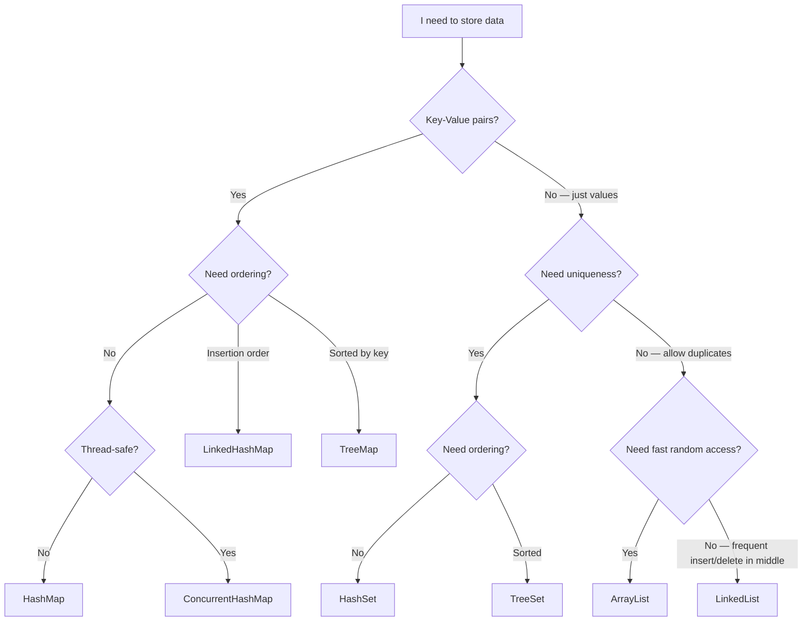
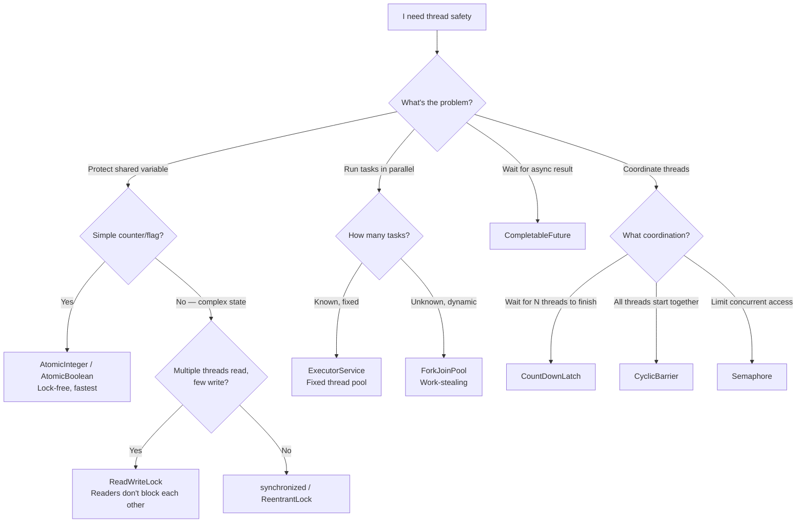
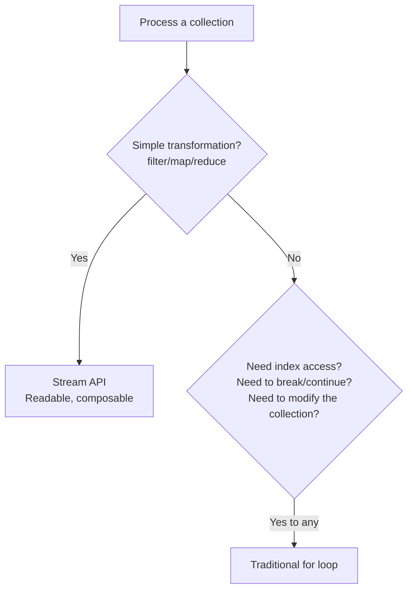
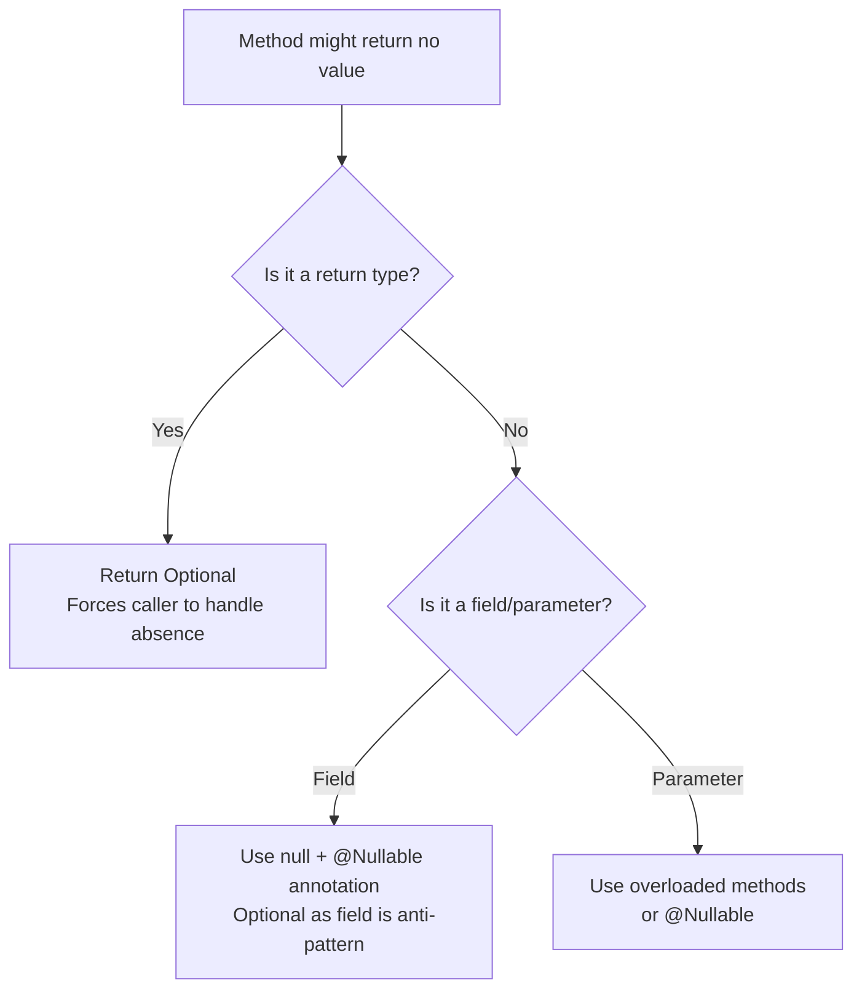
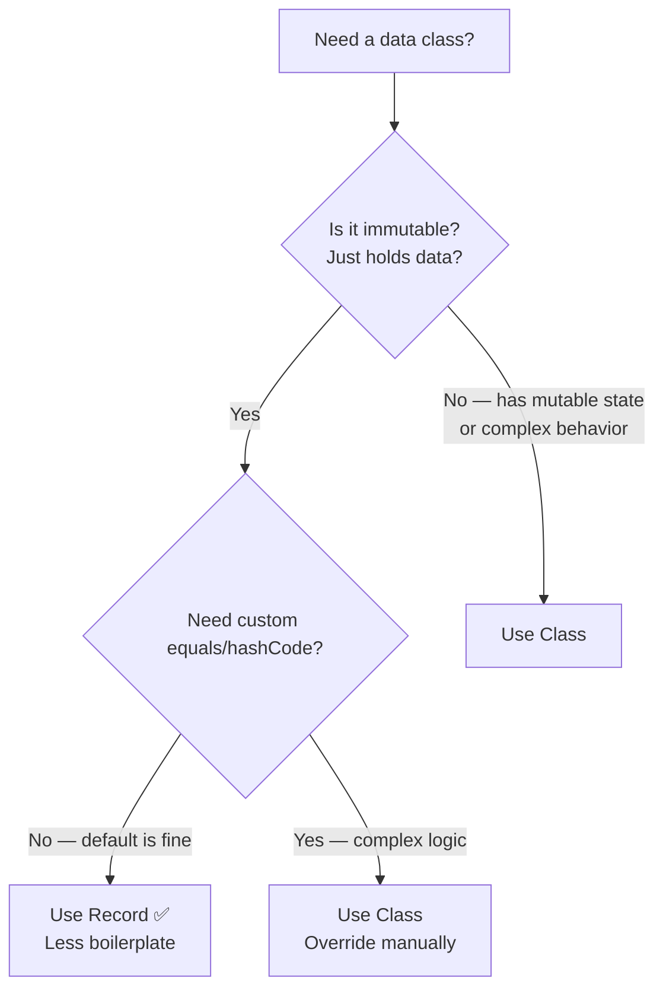

# How to Think in Java — Picking the Right Tool for the Right Job

## Why This Tutorial Exists

Java has 50+ collection types, 10+ concurrency tools, and features spanning Java 8 to 21. Most developers memorize "use HashMap for key-value" without understanding WHEN HashMap is wrong. This tutorial teaches you the **decision-making process** — so you can pick the right tool for ANY problem, even ones you haven't seen before.

---

## Framework 1: Choosing the Right Collection

Don't memorize all collections. Learn to ask the right questions:



### The Decision Table

| I need... | Use | Why NOT the alternative |
|-----------|-----|----------------------|
| Fast lookup by key | **HashMap** | TreeMap is O(log n) vs HashMap's O(1) |
| Sorted keys | **TreeMap** | HashMap doesn't maintain order |
| Preserve insertion order | **LinkedHashMap** | HashMap doesn't guarantee order |
| Thread-safe map | **ConcurrentHashMap** | Collections.synchronizedMap locks the ENTIRE map |
| Unique elements, fast lookup | **HashSet** | ArrayList.contains() is O(n) |
| Sorted unique elements | **TreeSet** | HashSet doesn't sort |
| Fast index access | **ArrayList** | LinkedList is O(n) for get(i) |
| Frequent add/remove at head | **LinkedList/ArrayDeque** | ArrayList shifts all elements on add(0) |
| FIFO queue | **ArrayDeque** | LinkedList has higher memory overhead |
| Thread-safe queue | **ConcurrentLinkedQueue** | ArrayDeque is not thread-safe |
| Priority-based processing | **PriorityQueue** | Regular queue is FIFO only |

<div class="callout-scenario">

**Scenario**: You need to cache the last 100 API responses. When the 101st arrives, the oldest should be evicted. Which collection?

**Thinking process**: Need key-value (URL → response) ✅. Need ordering (to know which is oldest) ✅. Need size limit with auto-eviction ✅. **Answer**: `LinkedHashMap` with `removeEldestEntry()` overridden — it maintains insertion order and can auto-evict when size exceeds limit. This is literally how you build an LRU cache in Java.

```java
Map<String, Response> cache = new LinkedHashMap<>(100, 0.75f, true) {
    @Override
    protected boolean removeEldestEntry(Map.Entry eldest) {
        return size() > 100;
    }
};
```

</div>

---

## Framework 2: Choosing the Right Concurrency Tool



### When to Use What — The Concurrency Cheat Sheet

| Problem | Tool | Why THIS tool, not that one |
|---------|------|---------------------------|
| Increment a counter from 10 threads | `AtomicInteger` | `synchronized` works but is 10x slower for simple operations |
| Cache that's read 99%, written 1% | `ReadWriteLock` | `synchronized` blocks ALL access during reads — wasteful |
| Call 3 APIs in parallel, combine results | `CompletableFuture.allOf()` | Manual thread management is error-prone |
| Process 1M items in parallel | `parallelStream()` | Simple, uses ForkJoinPool internally |
| Rate limit to 10 concurrent DB connections | `Semaphore(10)` | Thread pool works too, but Semaphore is more explicit |
| Wait for 5 worker threads to finish | `CountDownLatch(5)` | `Thread.join()` works but doesn't compose well |

<div class="callout-warn">

**Warning — The #1 Concurrency Mistake**: Using `synchronized` everywhere "just to be safe." Synchronization has a cost — thread contention, context switching, reduced throughput. Ask: "Do I ACTUALLY have shared mutable state?" If the data is read-only, or each thread has its own copy, you don't need synchronization at all. The fastest lock is the one you don't need.

</div>

<div class="callout-tip">

**Applying this** — Before adding any synchronization, ask three questions: (1) Is this data shared between threads? If no → no sync needed. (2) Is this data mutable? If no (immutable/final) → no sync needed. (3) Is the operation already atomic? (AtomicInteger, ConcurrentHashMap) If yes → no additional sync needed. Only if all three are "yes, it's shared, mutable, and not atomic" do you need explicit synchronization.

</div>

---

## Framework 3: Choosing the Right Java Feature

### Streams vs Loops — When to Use Which



```java
// ✅ Stream — clean for filter + transform + collect
List<String> names = users.stream()
    .filter(u -> u.getAge() > 18)
    .map(User::getName)
    .sorted()
    .collect(Collectors.toList());

// ✅ Loop — when you need index or early exit
for (int i = 0; i < items.size(); i++) {
    if (items.get(i).isInvalid()) {
        log.warn("Invalid item at index " + i);
        break; // can't do this cleanly with streams
    }
}
```

### Optional vs Null — The Decision



```java
// ✅ Good — Optional as return type
public Optional<User> findByEmail(String email) {
    return Optional.ofNullable(userMap.get(email));
}

// ❌ Bad — Optional as field (memory overhead, serialization issues)
class User {
    private Optional<String> middleName; // DON'T do this
}

// ✅ Good — nullable field with annotation
class User {
    @Nullable private String middleName; // clear intent
}
```

### Records vs Classes — When to Use Records



---

## Framework 4: The "Why Not" Thinking

For every Java decision, train yourself to ask "Why NOT the alternative?"

| You chose | Ask yourself | If the answer is... |
|-----------|-------------|-------------------|
| HashMap | Why not TreeMap? | "I don't need sorted keys" → HashMap is correct |
| ArrayList | Why not LinkedList? | "I need random access by index" → ArrayList is correct |
| synchronized | Why not AtomicInteger? | "It's just a counter" → switch to AtomicInteger |
| Stream | Why not loop? | "I need to break early" → switch to loop |
| CompletableFuture | Why not parallel stream? | "I need to combine results from different sources" → CF is correct |

<div class="callout-interview">

**Q: "Why did you use HashMap here?"**

Don't just say "for fast lookup." Say: "I chose HashMap over TreeMap because I don't need sorted keys — I only need O(1) lookup by user ID. If the requirement changes to 'show users sorted by name,' I'd switch to TreeMap which gives O(log n) sorted access. The trade-off is HashMap uses more memory (hash table overhead) but gives constant-time access."

</div>

---

<!-- practice-pack -->

## 🏢 Real-World Scenarios

<div class="callout-scenario">

**Scenario**: A pricing service keeps the latest price per SKU in a `HashMap` updated by a Kafka consumer thread and read by 200 request threads. Under load, some reads return prices from hours ago and one day the service hangs at 100% CPU. **Decision**: The map is shared mutable state without synchronization — reads may not see writes (visibility), and concurrent structural modification of a `HashMap` can corrupt it (older JDKs could even loop forever during resize). Use `ConcurrentHashMap`, or better, build an immutable `Map` snapshot and publish it through a `volatile` field / `AtomicReference` on each batch of updates — readers get consistent snapshots with no locking.

</div>

<div class="callout-scenario">

**Scenario**: A report job uses `parallelStream()` to call a slow external tax API for 50,000 invoices, and suddenly every other parallel stream in the application (including request handling code) becomes slow. **Decision**: Parallel streams share the common `ForkJoinPool`, which is sized for CPU-bound work; blocking I/O inside it starves everyone else. Use a dedicated bounded executor (or virtual threads on Java 21) for I/O fan-out, with a concurrency limit that respects the external API's rate limits.

</div>

## 🏋️ Practice Assignments

### 🟢 Low — Build the reflexes

**L1.** Pick the collection: (a) unique order IDs processed today, needing fast lookup, (b) the last 50 events for a debug screen, oldest dropped first, (c) products sorted by price with "find the cheapest above ₹500", (d) a queue of jobs shared by 8 worker threads.

<details>
<summary>Show answer</summary>

(a) `HashSet<String>` (or `ConcurrentHashMap.newKeySet()` if shared across threads). (b) `ArrayDeque` capped at 50 (`addLast` + `pollFirst` when full). (c) `TreeMap<Money, List<Product>>` or `TreeSet` with a comparator including a tie-breaker; `ceilingKey(500)`. (d) `ArrayBlockingQueue` (bounded → backpressure) or an `ExecutorService` with a bounded queue.

</details>

**L2.** Which concurrency tool fits: (a) wait until 3 microservice calls finish, then combine results, (b) allow at most 10 concurrent calls to a partner API, (c) a counter incremented by many threads, (d) run a cleanup every 5 minutes?

<details>
<summary>Show answer</summary>

(a) `CompletableFuture.allOf(...)` (or structured concurrency on newer Java). (b) `Semaphore(10)` (or a bulkhead in Resilience4j). (c) `LongAdder` (high contention) or `AtomicLong`. (d) `ScheduledExecutorService.scheduleAtFixedRate` (or Spring `@Scheduled`).

</details>

**L3.** When is a `record` the wrong choice for a class?

<details>
<summary>Show answer</summary>

When the object must be mutable (e.g., a JPA entity with lifecycle and lazy loading), needs inheritance from another class, needs to hide some fields from `equals/hashCode/toString` (e.g., passwords), or its identity isn't defined by all of its fields. Records are ideal for immutable value carriers: DTOs, events, keys, results.

</details>

### 🟡 Medium — Apply it

**M1.** A cache of exchange rates is read 5,000 times per second and refreshed every 10 minutes from a remote API. Design the data structure and the refresh, with no locking on the read path.

<details>
<summary>Show answer</summary>

```java
private final AtomicReference<Map<String, BigDecimal>> rates = new AtomicReference<>(Map.of());

@Scheduled(fixedRate = 600_000)
void refresh() {
    Map<String, BigDecimal> fresh = Map.copyOf(ratesClient.fetchAll());   // build fully off to the side
    rates.set(fresh);                                                      // atomic publish
}

BigDecimal rate(String currency) { return rates.get().get(currency); }    // lock-free read
```

Readers always see a complete, immutable snapshot; the refresh never blocks readers. Add a fallback (keep the old map) if the fetch fails, and a metric for the rates' age.

</details>

**M2.** Refactor this for clarity and safety using modern Java features:

```java
String describe(Object payment) {
    if (payment instanceof Card) { Card c = (Card) payment; return "Card ending " + c.last4; }
    else if (payment instanceof Upi) { Upi u = (Upi) payment; return "UPI " + u.vpa; }
    else return "Unknown";
}
```

<details>
<summary>Show answer</summary>

```java
sealed interface Payment permits Card, Upi, Wallet {}
record Card(String last4) implements Payment {}
record Upi(String vpa) implements Payment {}
record Wallet(String provider) implements Payment {}

String describe(Payment payment) {
    return switch (payment) {
        case Card c   -> "Card ending " + c.last4();
        case Upi u    -> "UPI " + u.vpa();
        case Wallet w -> "Wallet " + w.provider();
    };                                   // exhaustive: a new Payment type fails compilation here
}
```

The "Unknown" branch disappears because the compiler proves all cases are handled.

</details>

**M3.** Your team debates `synchronized` vs `ReentrantLock` vs `ConcurrentHashMap.compute` for "increment a per-user counter". Decide and justify.

<details>
<summary>Show answer</summary>

`ConcurrentHashMap<String, LongAdder>` with `computeIfAbsent(user, k -> new LongAdder()).increment()` — per-key, lock-free increments, no global lock. `synchronized` on a shared `HashMap` serializes all users; `ReentrantLock` adds features (tryLock, fairness) you don't need here. If counters must also expire, use Caffeine with atomic `asMap().merge(...)`, or Redis if shared across instances.

</details>

### 🔴 High — Think like a senior

**H1.** A code review shows a service that uses `CompletableFuture.supplyAsync` without an executor for DB calls, `parallelStream` for HTTP calls, and a `newCachedThreadPool` for Kafka processing. Write the review comments and the target design.

<details>
<summary>Show answer</summary>

Comments: (1) `supplyAsync` without an executor runs blocking JDBC calls on the common `ForkJoinPool` → starvation of unrelated code; (2) `parallelStream` for HTTP has the same problem plus no concurrency control against the remote service; (3) `newCachedThreadPool` has an unbounded thread count → under a burst it can create thousands of threads and exhaust memory. Target: named, bounded executors per workload (`ThreadPoolExecutor` with bounded queues and a rejection policy, instrumented with Micrometer), or virtual threads (Java 21, `Executors.newVirtualThreadPerTaskExecutor()`) for blocking I/O **combined with** explicit concurrency limits (semaphores/bulkheads) toward each downstream; timeouts on every remote call; Kafka processing with the listener container's concurrency settings rather than ad-hoc pools.

</details>

**H2.** You're asked to choose the Java version and core libraries for a new service fleet in 2026. What do you decide and why?

<details>
<summary>Show answer</summary>

Latest LTS supported by your framework (Java 21 or 25) — records, sealed types, pattern matching, virtual threads, and GC improvements, with a long support window; Spring Boot 3.x/4.x aligned with it. Standardize: `java.time` only (no `Date`), immutable collections by default, records for DTOs/events, SLF4J logging with structured JSON, Micrometer for metrics, Resilience4j for resilience, Testcontainers for integration tests. Document the choices as an ADR, enforce with a parent POM/BOM, ArchUnit rules, and static analysis (Error Prone/SpotBugs/Sonar), and plan the next LTS upgrade cadence (e.g., within 12 months of each LTS).

</details>

## 🛠️ Mini Project — "Right Tool" Refactoring Kata

**Goal**: Practice the decision frameworks on realistic legacy code. 1-2 evenings.

**Setup**: Write (or ask a colleague to write) a deliberately poor 300-line `OrderAnalytics` class that: uses `Vector` and `Hashtable`, iterates with index loops on `LinkedList`, removes from lists inside for-each loops, shares a `HashMap` between threads, uses `Date`/`SimpleDateFormat` as static fields, uses `parallelStream` for HTTP calls, and returns `null` for "not found".

**Tasks**

1. Write characterization tests capturing current behavior (including a concurrency test that exposes the shared-map bug).
2. Refactor step by step, one decision per commit, each commit message naming the framework rule applied ("Collections: LinkedList→ArrayList, random access dominates").
3. Replace thread-unsafe pieces (`ConcurrentHashMap`/immutable snapshots, `DateTimeFormatter`), introduce records and sealed result types, and a bounded executor for I/O.
4. Benchmark before/after with JMH for the hot method.

**Acceptance criteria**: all tests green, the concurrency test passes 100 runs in a row, and a README table listing each change, the rule behind it, and the measured effect.

---

## 🎯 Interview Corner

<div class="callout-interview">

**Q: "HashMap vs ConcurrentHashMap — when would you use each?"**

HashMap when there's no concurrent access — single-threaded code, or data that's built once and then only read (effectively immutable). ConcurrentHashMap when multiple threads read AND write simultaneously. The key difference isn't just "thread safety" — it's HOW they achieve it. HashMap with `Collections.synchronizedMap()` locks the ENTIRE map on every operation. ConcurrentHashMap locks only the affected bucket (or uses CAS). So with 16 threads accessing different keys, synchronizedMap has 15 threads waiting while ConcurrentHashMap has all 16 running in parallel. I'd never use synchronizedMap in production — if I need thread safety, ConcurrentHashMap is always better.

**Follow-up trap**: "What about Hashtable?" → Legacy class from Java 1.0. Synchronized on every method (like synchronizedMap). No reason to use it in modern Java. ConcurrentHashMap replaced it entirely.

</div>

<div class="callout-interview">

**Q: "When would you use parallelStream() vs CompletableFuture?"**

parallelStream for CPU-bound work on a single collection — processing 1M items where each item needs computation. It uses ForkJoinPool internally and splits the collection across cores. CompletableFuture for I/O-bound work or combining results from DIFFERENT sources — calling 3 APIs in parallel, then combining results. The mistake is using parallelStream for I/O (API calls) — it blocks ForkJoinPool threads, which are shared across the entire JVM. For I/O, use CompletableFuture with a custom executor that has enough threads for the expected concurrency.

</div>

<div class="callout-interview">

**Q: "When would you use virtual threads instead of a traditional thread pool?"**

Virtual threads (Java 21+) fit I/O-bound, thread-per-request code: a service that calls a database and two APIs per request can run tens of thousands of concurrent requests with simple blocking code, because a blocked virtual thread releases its carrier OS thread. In Spring Boot 3.2+ it's one property: `spring.threads.virtual.enabled=true`. They don't help CPU-bound work, where you're limited by cores and a fixed pool sized to the CPU count is still right. Two things change in how I design. First, I don't pool virtual threads; I create one per task. Second, I limit access to scarce resources with a semaphore or the connection pool size, because "unlimited threads" can now overwhelm the database instead of the thread pool.

**Follow-up trap**: "Any pitfalls?" → Before Java 24, blocking inside a `synchronized` block pinned the carrier thread. The fix was `ReentrantLock`, and JDK 24 removed most of that pinning. `ThreadLocal`-heavy code can also use a lot of memory with millions of threads, so prefer scoped values or pass context explicitly.

</div>

---

## Quick Reference

| Decision | Ask this question | Answer guides you to |
|----------|------------------|---------------------|
| Which collection? | Key-value? Ordered? Thread-safe? Unique? | See collection flowchart |
| Which concurrency tool? | Shared state? Counter? Parallel tasks? Coordination? | See concurrency flowchart |
| Stream vs Loop? | Simple transform? Need index/break? | Stream for transform, loop for control flow |
| Optional vs Null? | Return type? Field? Parameter? | Optional for returns, null+annotation for fields |
| synchronized vs Atomic? | Simple counter or complex state? | Atomic for simple, synchronized for complex |

---

> **Java mastery isn't knowing every API. It's knowing which API to reach for when you see a problem. The expert doesn't have more tools — they pick the right tool faster.**

---

<!-- journey-link:start -->

<div class="callout-journey">

🛒 **ShopNorth Journey** — Building ShopNorth's order service means choosing Java tools deliberately: records for DTOs, Optional for lookups, thread pools with timeouts.

**Continue the story:** [Chapter 5 · Building with Spring Boot](/tutorials/journey-05-spring-boot) · **New here?** [Start the journey](/tutorials/journey-start)

</div>

<!-- journey-link:end -->
