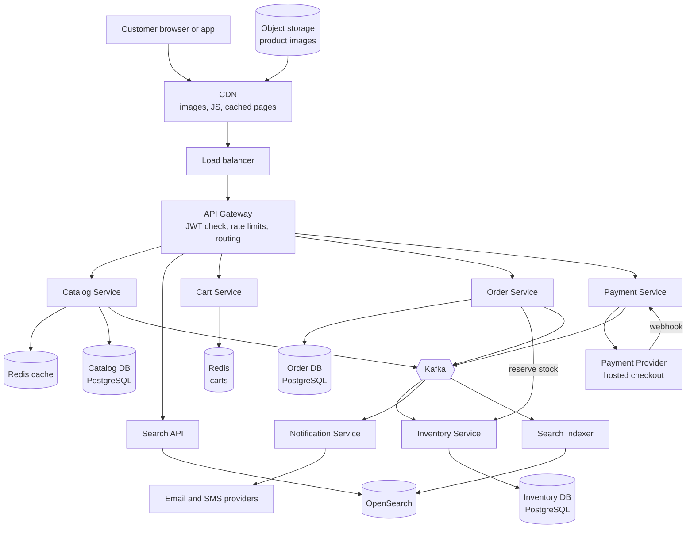
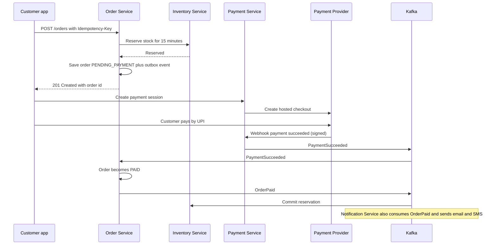

# Chapter 2 · System Design (HLD)

🛒 **The ShopNorth Journey** · Chapter 2 of 15 · Phase: **Plan & Design** · SDLC stage: **Design — architecture**

**Previously:** The team wrote user stories, acceptance criteria, and NFRs with numbers: 3,000 requests/s and 150 orders/s at the sale peak, no overselling, no double charges, 99.9% availability ([Chapter 1](/tutorials/journey-01-requirements)).

**In this chapter:** Priya runs the architecture session. You'll decide the services, data stores, caching, search, and payment flow — and write down *why* for each choice.

## The Situation

Wednesday of Sprint 1. Priya draws two boxes on the whiteboard: "customers" and "money". "Everything in between is our job. Let's start from the traffic, not from technologies."

She splits the requirements into flows and looks at each one's character:

| Flow | Share of traffic | Character | What matters most |
|------|------------------|-----------|-------------------|
| Browse & product pages | ~85% | Read-heavy, cacheable | Latency, cost at scale |
| Search | ~10% | Read-heavy, text matching | Relevance, < 200 ms |
| Cart | ~4% | Small writes per user | Saved across devices, fast |
| Checkout & payment | < 1% | Writes, money, concurrency | Correctness above all |
| Order tracking | < 1% | Reads of own data | Consistency with checkout |
| Admin | tiny | Writes to catalog and stock | Auditability |

"Look at that table," Priya says. "85% of our traffic needs speed and caching. Less than 1% needs strict correctness — and that 1% is where the money is. We'll design those two parts very differently."

## Step 1 — How Many Services?

The team debates. Arjun wants one Spring Boot application ("we're six people"). Kabir worries that a sale-day spike in browsing would starve checkout of resources if everything runs in one process.

Priya writes **ADR-001**:

> **Decision:** Start with five services split by domain and by *different scaling and reliability needs* — Catalog (+ Search indexing), Cart, Order, Inventory, Payment — plus an asynchronous Notification service. Shared libraries for logging, security, and error handling.
> **Why:** Browsing must scale independently from checkout; payment code has the strictest security and change control; the team has Kubernetes and CI experience.
> **Rejected:** One modular monolith (simpler, but sale-day browse spikes and checkout share fate); 20+ fine-grained microservices (too much operational load for six people).
> **Revisit if:** the team shrinks, or most changes start needing coordinated deploys across services.

**There is no universally right number of services.** For two engineers, a modular monolith is usually the better call. What makes ADR-001 good isn't the answer; it's that the reasons, the rejected options, and the trigger to revisit are written down.

## Step 2 — The Architecture

Each box exists because of a requirement. Let's walk through the important ones.

## Step 3 — The Main APIs

| Endpoint | Service | Notes |
|----------|---------|-------|
| `GET /products?category=&page=` | Catalog | Cached; paginated |
| `GET /products/{sku}` | Catalog | Cached; price shown here is *display* price |
| `GET /search?q=&filters=` | Search | Autocomplete via `GET /search/suggest?q=` |
| `PUT /cart/items/{sku}` · `DELETE …` · `GET /cart` | Cart | Keyed by customer ID from the JWT |
| `POST /orders` (header `Idempotency-Key`) | Order | Validates prices, reserves stock, creates order |
| `GET /orders/{id}` · `GET /orders?mine` | Order | Customer sees only their own orders |
| `POST /payments/sessions` | Payment | Creates a provider checkout session for an order |
| `POST /payments/webhooks/provider` | Payment | Signed callbacks from the provider |
| `PUT /admin/products/{sku}` · `PUT /admin/stock/{sku}` | Catalog, Inventory | Admin role only; audited |

## Step 4 — Data Stores: One Owner Per Piece of Data

| Data | Store | Why |
|------|-------|-----|
| Products, categories, prices | PostgreSQL (Catalog DB) | Relational, consistent, the source of truth |
| Search index | OpenSearch | Full-text relevance, typo tolerance, facets — fed from catalog events |
| Product page cache | Redis | 95% hit ratio target keeps DB load tiny |
| Carts | Redis (hash per customer, 30-day TTL, persistence on) | Small, frequent writes; fast; losing a cart is annoying, not catastrophic |
| Orders, order items, payments | PostgreSQL (Order DB) | ACID transactions, constraints, money |
| Stock and reservations | PostgreSQL (Inventory DB) | Atomic conditional updates prevent overselling |
| Images | Object storage + CDN | 90 GB, served millions of times (Ch 1 estimate) |
| Events | Kafka | Decouples services; replayable |

**Rule:** each service owns its data, and no service reads another service's database. If Order needs a price, it asks Catalog through an API (or keeps its own copy updated from events).

## Step 5 — The Read Path: Making 85% of Traffic Cheap

A product page request goes:

1. **CDN** serves images and static JavaScript. Product page HTML is cacheable too (the personalized header loads separately).
2. **Catalog service** checks **Redis** first (cache-aside). On a miss, it reads PostgreSQL and stores the result with a 5-minute TTL.
3. When ops change a price, Catalog publishes `ProductUpdated`; a listener **evicts** that product's cache entry immediately, so the TTL is only a safety net.

The math from Chapter 1: 3,000 requests/s × ~85% browse ≈ 2,550/s. With a 95% cache hit ratio, PostgreSQL sees ~130 reads/s. One modest database instance handles that easily; without the cache, it would need much more capacity and still risk slow pages at the peak.

**Never charge a cached price.** The product page may show a price that's a few seconds old — fine for display. At checkout, the Order service re-reads prices from Catalog's source of truth. Otherwise a price change during the sale means charging the wrong amount.

## Step 6 — The Write Path: Checkout Without Overselling or Double Charging

Three design choices come straight from Chapter 1's acceptance criteria:

- **Reserve, then pay.** Stock is reserved before payment and released automatically if payment doesn't happen in 15 minutes. That's the "item sells out during checkout" scenario.
- **Idempotency key.** The app sends a unique key per checkout attempt; a double click or retry returns the same order. That's the "double-click" scenario.
- **Asynchronous after payment.** Notifications and stock commits happen through events. If the email provider is slow, checkout doesn't slow down.

The detailed mechanics (state machine, outbox, saga) come in Chapters 3, 5, and 6.

## Step 7 — Search

Customers type "noise cancel…" and expect suggestions instantly. Search runs on **OpenSearch**: an indexer consumes `ProductUpdated` events and updates the index within seconds. Autocomplete uses a prefix/edge n-gram field; typo tolerance uses fuzzy matching. If search is down, the site falls back to category browsing — degraded, not broken.

## Step 8 — Capacity Check

| Component | Peak load | Plan |
|-----------|-----------|------|
| API gateway + stateless services | 3,000 req/s | Horizontal scaling (Kubernetes autoscaling, Ch 12) |
| Catalog DB | ~130 reads/s after cache | Single primary + 1 read replica |
| Order + Inventory DBs | 150 orders/s × ~5 writes ≈ 750 writes/s | Single primary each, tuned connection pools |
| Redis | ~2,500 ops/s cache + carts | Managed Redis, replica for failover |
| Kafka | ~1,000 events/s | Small managed cluster, 3 brokers |

Nothing needs sharding. That's an important result: **the estimate told the team which complexity to *avoid***.

## Step 9 — What Happens When Things Fail?

| Failure | Impact | Design response |
|---------|--------|-----------------|
| Redis down | Cache misses, carts unavailable | Catalog reads DB with a concurrency limit; cart shows "temporarily unavailable" |
| Payment provider slow or down | Customers can't pay | Timeouts + retries; show "try another method"; a second provider behind a feature flag (Ch 14) |
| Kafka down | Events can't be published | Outbox table buffers events in the order DB; relay publishes when Kafka recovers (Ch 6) |
| Search down | No search results | Fall back to category browse |
| One service instance crashes | Some requests fail | Multiple instances, health checks, retries at the gateway for safe (GET) requests |

<!-- aws-section:start -->

## ☁️ ShopNorth on AWS — Every Box Gets a Service

Priya's diagram is cloud-neutral on purpose: first decide *what* the system needs, then *which service* provides it. On AWS, the boxes become:

| Box in the design | AWS service | Why this one | Learn it |
|-------------------|-------------|--------------|----------|
| CDN | CloudFront | Edge locations in Indian cities; private S3 origins | [CloudFront & Edge](/tutorials/aws-cloudfront) |
| Object storage for images | S3 | Cheap, durable, presigned uploads | [S3](/tutorials/aws-s3) |
| Load balancer | Application Load Balancer + WAF | HTTP routing, health checks, rate rules | [EC2, Load Balancers & Auto Scaling](/tutorials/aws-ec2-autoscaling) |
| Services | EKS (Kubernetes) on EC2 nodes | The team knows Kubernetes; GitOps and canaries (Chapters 11-12) | [Containers on AWS](/tutorials/aws-containers) |
| PostgreSQL | RDS for PostgreSQL, Multi-AZ | Managed failover, backups, and patching | [Databases on AWS](/tutorials/aws-databases) |
| Redis | ElastiCache | Managed Redis with a replica in another zone | [Databases on AWS](/tutorials/aws-databases) |
| Kafka | MSK | Kafka without running brokers | [MSK](/tutorials/aws-msk) |
| Search | OpenSearch Service | A managed search cluster | [Databases on AWS](/tutorials/aws-databases) |
| Email and SMS providers | Amazon SES for email, an SMS provider, and SNS + SQS in between | Retries and isolation per channel | [SQS & SNS](/tutorials/aws-sqs-sns) |

Three principles from this chapter map straight onto AWS features: scale stateless services horizontally ([Scalability](/tutorials/scalability)), keep stock and money strongly consistent while browsing is eventually consistent ([CAP Theorem & Consistency](/tutorials/cap-theorem)), and remove every single point of failure ([High Availability & DR](/tutorials/high-availability)). [AWS for Developers](/tutorials/aws-start-here) has the full map.

<!-- aws-section:end -->

## 🏢 Real-World Scenarios

**Scenario**: An online retailer sent order confirmation emails synchronously inside the checkout request. During a sale, the email provider slowed to 8-second responses; checkout threads piled up waiting on it, and the whole order API stopped responding — customers couldn't pay because an *email* was slow. **Decision**: Anything that isn't required to confirm the order happens asynchronously via events (emails, SMS, analytics, search updates). The checkout request does only what must be atomic: validate, reserve, record.

**Scenario**: A team stored the product price inside each cart item when it was added. A flash-deal price expired, but customers with older carts were still charged the lower price for hours, and finance had to absorb the difference. **Decision**: The cart stores SKU and quantity only. Prices are looked up live for display and re-validated from the source of truth when the order is placed; if a price changed, the customer sees the new total before paying.

## 🔗 Go Deeper — Topic Tutorials

| Topic | What you'll learn | How ShopNorth used it here |
|-------|-------------------|----------------------------|
| [How to Think in System Design](/tutorials/thinking-system-design) | The full HLD framework | Flows → numbers → components → failures |
| [Load Balancing](/tutorials/load-balancing) | L4 vs L7, health checks, algorithms | Load balancer + gateway in front of services |
| [CDN Deep Dive](/tutorials/cdn-deep-dive) | Edge caching, invalidation | Images and static pages |
| [Distributed Cache](/tutorials/cache-system) · [Caching Strategy](/tutorials/caching-strategy) | Cache-aside, TTLs, invalidation | Product page cache with event-driven eviction |
| [Design Typeahead](/tutorials/design-typeahead) | Autocomplete design | Search suggestions |
| [Payment Gateway](/tutorials/payment-gateway) | Idempotency, webhooks, reconciliation | The payment flow |
| [Notification System](/tutorials/notification-system) | Async multi-channel delivery | Email + SMS confirmations |
| [Database Decisions](/tutorials/database-decisions) · [Messaging Decisions](/tutorials/messaging-decisions) | Picking stores and brokers | The data store table and Kafka |
| [Scalability](/tutorials/scalability) | Vertical vs horizontal, the read ladder, back-pressure | Stateless services, caching, events for everything that can wait |
| [High Availability & DR](/tutorials/high-availability) | Availability math, failover, RPO and RTO | Three zones, Multi-AZ data, a degradation plan per dependency |
| [CAP Theorem & Consistency](/tutorials/cap-theorem) | CP vs AP, PACELC, consistency models | Strong for stock and payments, eventual for catalog and search |
| [AWS for Developers](/tutorials/aws-start-here) | The AWS service behind each box | The map from this design to AWS |

## 📚 Extra Case Studies

See the same patterns at different scales: [Design Netflix](/tutorials/design-netflix) (CDN-heavy delivery), [Design Facebook Newsfeed](/tutorials/design-newsfeed) (read-heavy fan-out), [Design Google Drive / Dropbox](/tutorials/design-cloud-storage) (object storage), and [URL Shortener](/tutorials/url-shortener) (a compact HLD walkthrough).

## 🛠️ Mini Project — Build ShopNorth, Step 2: Write the Architecture

**Goal**: A `docs/architecture.md` a new teammate could understand in 15 minutes. 1-2 evenings.

**Build**

1. Draw your architecture (Mermaid is fine) for a smaller ShopNorth: catalog, cart, and orders are enough.
2. List your APIs (method, path, owner, notes) and your data stores with a "why" column.
3. Write three ADRs in `docs/decisions.md`: number of services, cart storage, and "reserve stock before payment" — each with rejected options and a revisit trigger.
4. Add a failure table: for each dependency, what the customer sees and what the system does.
5. Do the capacity check using your Chapter 1 numbers.

**Acceptance criteria**: every component traces to a requirement or a number; every dependency has a failure row.

## 🏋️ Practice Assignments

### 🟢 Low — Build the reflexes

**L1.** Why are product images stored in object storage behind a CDN instead of in PostgreSQL?

Show answer

Images are large (90 GB), immutable, and requested millions of times. Object storage is far cheaper per GB and scales without effort; a CDN serves them from locations near customers, so they load fast and never touch ShopNorth's servers. Storing them in PostgreSQL would bloat backups, waste expensive database I/O and memory, and make every image request a database query.

**L2.** Label each flow read-heavy or write-heavy and name one caching decision: product page, cart, place order, order history.

Show answer

Product page: read-heavy → cache in Redis and at the CDN. Cart: write-heavy per user, small → *is* stored in Redis (no separate cache needed). Place order: write-heavy, correctness-critical → no caching of anything that affects the charge. Order history: read-mostly, per-user, must reflect the latest status → short-lived or no caching; read from the order DB (or a replica with read-your-writes handling).

### 🟡 Medium — Apply it

**M1.** Ops change the price of a hot product during the sale. Describe exactly how the product page cache, the search index, and checkout each pick up the new price.

Show answer

Catalog updates PostgreSQL and writes a `ProductUpdated` event (via the outbox). A cache listener evicts that product's Redis entry, so the next page view loads the new price (worst case: the TTL, if the event is delayed). The search indexer consumes the same event and updates the document in OpenSearch within seconds. Checkout never relies on either: Order re-reads the price from Catalog's source of truth when the order is placed, and if it differs from what the customer saw, it returns the new total for confirmation.

**M2.** For each step of checkout, decide synchronous or asynchronous: price validation, stock reservation, payment session creation, payment confirmation, stock commit, confirmation email, analytics event.

Show answer

Synchronous (the customer needs the answer now): price validation, stock reservation, payment session creation. Asynchronous: payment confirmation arrives via the provider's webhook (inherently async), stock commit (reacts to `OrderPaid`), confirmation email, analytics. Rule of thumb: synchronous only for what the current request can't complete without; everything else through events, so slow downstream systems can't slow down checkout.

### 🔴 High — Think like a senior

**H1.** The marketing team wants a "first 1,000 customers get 70% off" flash deal at exactly 8 PM. What changes in the design?

Show answer

This creates an extreme hot spot: thousands of requests for one SKU in seconds. Protect the system and keep it fair: (1) a **waiting room / queue** in front of the deal page that admits customers at a controlled rate; (2) stock for the deal held as a counter in Redis with atomic decrement (fast first filter), with the inventory DB still doing the authoritative reservation; (3) per-customer limits (one unit) enforced at reservation; (4) rate limiting at the gateway per user and IP to stop bots; (5) pre-warmed caches and pre-scaled services; (6) a load test of exactly this pattern before the sale. Chapter 14 covers how ShopNorth runs it.

**H2.** When should ShopNorth consider a second region? Argue both sides.

Show answer

**For:** a full regional cloud outage on sale day would cost the most important revenue of the year; customers outside the region would get lower latency. **Against:** active-active multi-region needs cross-region data replication with conflict handling for orders and stock (hard to get right), doubles infrastructure, and adds operational load for a six-person team; 99.9% is achievable in one region across multiple availability zones. **Senior answer:** stay single-region multi-AZ for launch, keep tested backups and infrastructure-as-code so a recovery region can be brought up within hours (a documented disaster recovery plan), and revisit when revenue at risk justifies the cost.

## 🎯 Interview Corner

**Q: "Design the high-level architecture of an e-commerce site that must survive a big sale."**

I start from traffic shape: about 85% is browsing, which is read-heavy and cacheable, and under 1% is checkout, which is write-heavy and correctness-critical. So I put a CDN and a Redis cache in front of a catalog service with PostgreSQL as the source of truth, and OpenSearch for search, fed by events. For checkout, an order service creates the order and reserves stock in an inventory service with atomic updates and a time limit. Payments go through a provider's hosted checkout with signed webhooks. Kafka carries events to notifications, search indexing, and stock commits. Then I check capacity against the numbers: with a 95% cache hit ratio the database sees only a few hundred queries per second, so no sharding is needed.

**Q: "How do you keep cached data consistent when prices change?"**

I combine TTLs with event-driven invalidation. The catalog writes the change and publishes an event; a listener evicts the affected cache keys immediately, and the TTL bounds staleness if an event is delayed. More importantly, I make sure stale data can't cause harm: cached prices are only for display, and checkout re-validates prices from the source of truth before charging. Consistency requirements differ per use, so the design decides where stale is acceptable and where it never is.

**Q: "Why would you give each microservice its own database? Isn't that harder?"**

It is harder in some ways: there are no cross-service joins, and you need events or APIs to share data. But a shared database couples services tightly. A schema change in one breaks others, one service's heavy query slows everyone, and you can't scale or secure them independently. With one owner per piece of data, the order service can evolve its schema freely, and inventory can be tuned for its write pattern. The cost is accepting eventual consistency between services, which I handle with events and idempotent consumers.

> **Golden rule: design each part of the system for its own traffic shape — cheap and cached where reads dominate, careful and transactional where money moves.**

➡️ **Next: [Chapter 3 · Low-Level Design](/tutorials/journey-03-low-level-design)** — The boxes are drawn. Now you zoom into the Order service: how do you model an order, its states, the cart, discounts, and stock reservations as clean, testable Java classes?

