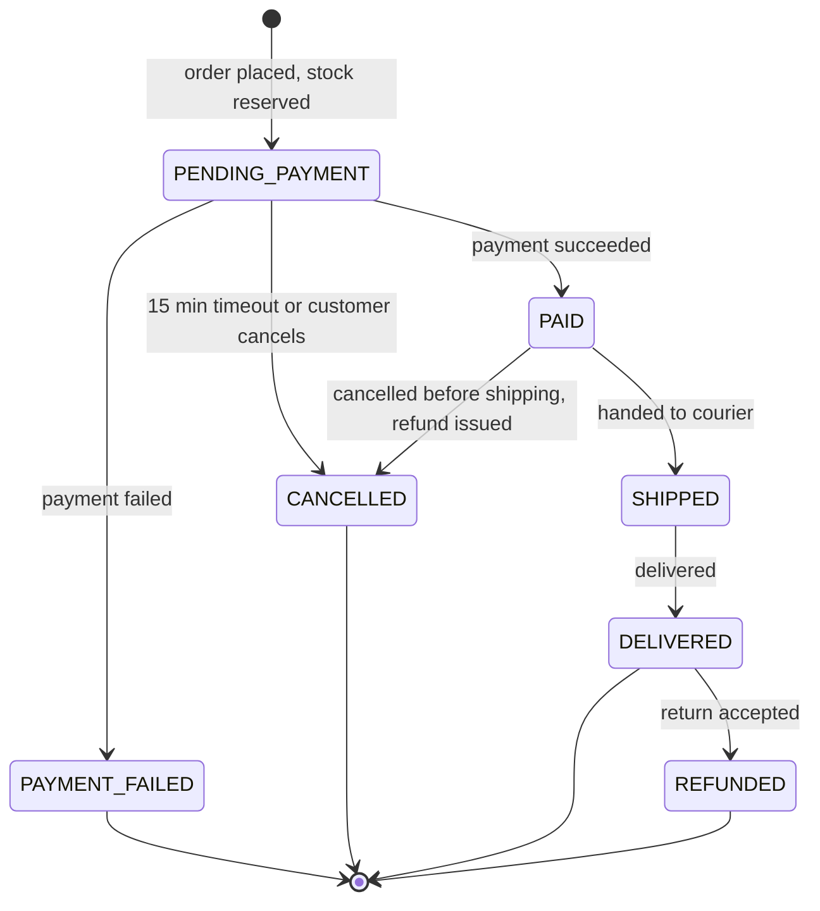
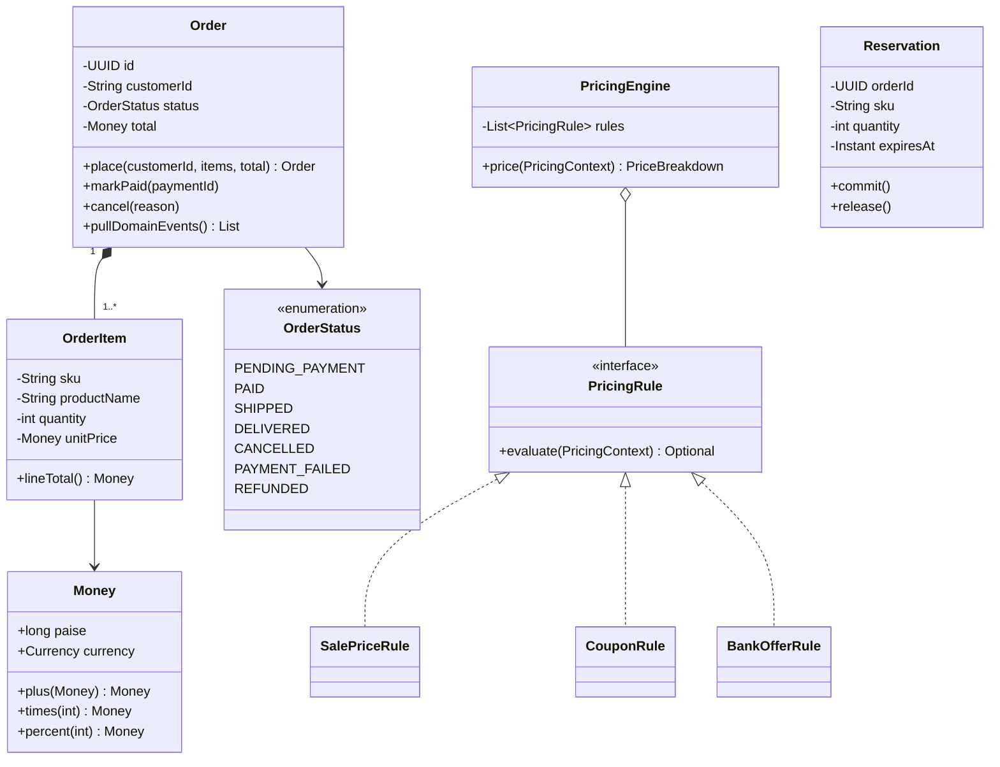

# Chapter 3 · Low-Level Design

<div class="callout-journey">

🛒 **The ShopNorth Journey** · Chapter 3 of 15 · Phase: **Plan & Design**

**Previously:** Priya's architecture split ShopNorth into Catalog, Cart, Order, Inventory, Payment, and Notification services, with checkout as "reserve stock → create order → pay → confirm via events" ([Chapter 2](/tutorials/journey-02-system-design)).

**In this chapter:** You and Arjun design the inside of the Order service: money, order states, pricing rules, and stock reservations — as Java classes that make the business rules hard to break.

</div>

## The Situation

Thursday of Sprint 1. Priya reviews your first sketch: an `Order` class with a `String status` field and a `double total`.

"Two production incidents waiting to happen," she says. "A string status lets anyone set `"SHIPED"` or ship a cancelled order. A `double` will be off by a paisa somewhere, and finance will spend a day finding it. Design so the rules are *impossible to break*, not just checked in a few places."

## Step 1 — Nouns and Verbs From the Stories

Using the noun/verb technique on Chapter 1's stories:

| Nouns → candidate classes | Verbs → behavior |
|---------------------------|------------------|
| Customer, Cart, CartLine, Product (SKU) | add item, remove item, update quantity |
| Order, OrderItem, OrderStatus | place, pay, cancel, ship, deliver, refund |
| Money | add, multiply, apply percentage |
| Coupon, Sale price, Bank offer | calculate discount |
| Reservation | reserve, commit, release, expire |

Two things stand out: **money** appears everywhere, and **order status** has rules about which changes are allowed. Those get the most careful design.

## Step 2 — Money Is a Value Object, Not a `double`

```java
public record Money(long paise, Currency currency) {

    public static final Currency INR = Currency.getInstance("INR");

    public Money {
        Objects.requireNonNull(currency, "currency");
        if (paise < 0) throw new IllegalArgumentException("Money cannot be negative: " + paise);
    }

    public static Money inr(long paise)      { return new Money(paise, INR); }
    public static Money rupees(long rupees)  { return inr(Math.multiplyExact(rupees, 100)); }
    public static Money zero()               { return inr(0); }

    public Money plus(Money other)  { requireSameCurrency(other); return new Money(Math.addExact(paise, other.paise), currency); }
    public Money minus(Money other) { requireSameCurrency(other); return new Money(Math.subtractExact(paise, other.paise), currency); }
    public Money times(int quantity) { return new Money(Math.multiplyExact(paise, quantity), currency); }

    /** Rounding policy agreed with finance: percentage discounts round down to the paisa. */
    public Money percent(int pct) { return new Money(Math.multiplyExact(paise, pct) / 100, currency); }

    public boolean isGreaterThan(Money other) { requireSameCurrency(other); return paise > other.paise; }

    private void requireSameCurrency(Money other) {
        if (!currency.equals(other.currency)) throw new IllegalArgumentException("Currency mismatch");
    }
}
```

Why this shape:

- **`long` paise, not `double` rupees.** `0.1 + 0.2` is not `0.3` in floating point. Integers in the smallest unit are exact. (`BigDecimal` also works; integers are simpler and faster when amounts never need fractions of a paisa.)
- **Immutable record.** Arithmetic returns new values, so a `Money` can be shared safely between threads and never changes behind your back.
- **Validation in the constructor.** A negative amount or mixed currencies fail immediately, at the line that caused them.
- **`equals`/`hashCode` for free.** Records compare by value — two ₹500 amounts are equal, which is exactly what you want in tests.

## Step 3 — Order Status as a State Machine



The allowed transitions live in **one place**:

```java
public enum OrderStatus {
    PENDING_PAYMENT, PAID, SHIPPED, DELIVERED, CANCELLED, PAYMENT_FAILED, REFUNDED;

    private static final Map<OrderStatus, Set<OrderStatus>> ALLOWED = new EnumMap<>(OrderStatus.class);
    static {
        ALLOWED.put(PENDING_PAYMENT, EnumSet.of(PAID, PAYMENT_FAILED, CANCELLED));
        ALLOWED.put(PAID,            EnumSet.of(SHIPPED, CANCELLED));
        ALLOWED.put(SHIPPED,         EnumSet.of(DELIVERED));
        ALLOWED.put(DELIVERED,       EnumSet.of(REFUNDED));
        ALLOWED.put(CANCELLED,       EnumSet.noneOf(OrderStatus.class));
        ALLOWED.put(PAYMENT_FAILED,  EnumSet.noneOf(OrderStatus.class));
        ALLOWED.put(REFUNDED,        EnumSet.noneOf(OrderStatus.class));
    }

    public boolean canMoveTo(OrderStatus next) { return ALLOWED.get(this).contains(next); }
    public boolean isTerminal()                { return ALLOWED.get(this).isEmpty(); }
}
```

And the `Order` class only changes state through **named business methods**:

```java
public class Order {
    private final UUID id;
    private final String customerId;
    private final List<OrderItem> items;
    private final Money total;
    private OrderStatus status;
    private String paymentId;
    private final List<Object> domainEvents = new ArrayList<>();

    private Order(UUID id, String customerId, List<OrderItem> items, Money total) {
        if (items.isEmpty()) throw new IllegalArgumentException("An order needs at least one item");
        this.id = id;
        this.customerId = customerId;
        this.items = List.copyOf(items);          // defensive, unmodifiable copy
        this.total = total;
        this.status = OrderStatus.PENDING_PAYMENT;
    }

    public static Order place(String customerId, List<OrderItem> items, Money total) {
        Order order = new Order(UUID.randomUUID(), customerId, items, total);
        order.domainEvents.add(new OrderPlaced(order.id, customerId, total));
        return order;
    }

    public void markPaid(String paymentId) {
        moveTo(OrderStatus.PAID);
        this.paymentId = paymentId;
        domainEvents.add(new OrderPaid(id, paymentId));
    }

    public void cancel(String reason) {
        boolean wasPaid = status == OrderStatus.PAID;
        moveTo(OrderStatus.CANCELLED);
        domainEvents.add(new OrderCancelled(id, reason, wasPaid));   // wasPaid → refund needed
    }

    private void moveTo(OrderStatus next) {
        if (!status.canMoveTo(next)) {
            throw new IllegalOrderTransitionException(id, status, next);
        }
        status = next;
    }

    public List<Object> pullDomainEvents() {
        List<Object> events = List.copyOf(domainEvents);
        domainEvents.clear();
        return events;
    }

    public OrderStatus status() { return status; }
    public Money total()        { return total; }
    public UUID id()            { return id; }
}
```

Nobody can write `order.setStatus("SHIPPED")` — there's no setter. Shipping a cancelled order throws an exception at the exact line that tried. The **domain events** (`OrderPlaced`, `OrderPaid`, `OrderCancelled`) are collected by the aggregate and published later through the outbox (Chapter 6).

<div class="callout-info">

**Why an enum map instead of the full State pattern?** The State pattern (one class per state) shines when each state has very different *behavior*, like a vending machine. ShopNorth's states mostly differ in *which transitions are allowed*, so a transition table is simpler and just as safe. If states later gain rich behavior, refactoring to the State pattern is straightforward.

</div>

## Step 4 — Pricing Rules: Strategy + an Ordered Pipeline

Ananya's sale plans include sale prices, coupons, and bank offers ("10% instant discount with XYZ Bank cards, up to ₹1,500"). Marketing will invent new rules every month. Hard-coding them in `if` statements means editing checkout code before every campaign.

```java
public record Adjustment(String type, String description, Money amount) {}

public record PricingContext(List<CartLine> lines, Money subtotal,
                             String couponCode, String paymentMethod, Instant now) {}

public interface PricingRule {
    Optional<Adjustment> evaluate(PricingContext ctx);
}

public final class CouponRule implements PricingRule {
    private final CouponRepository coupons;

    public CouponRule(CouponRepository coupons) { this.coupons = coupons; }

    @Override
    public Optional<Adjustment> evaluate(PricingContext ctx) {
        if (ctx.couponCode() == null) return Optional.empty();
        return coupons.findActive(ctx.couponCode(), ctx.now())
                .filter(c -> !c.minimumOrder().isGreaterThan(ctx.subtotal()))
                .map(c -> new Adjustment("COUPON", c.code(), c.discountFor(ctx.subtotal())));
    }
}

public final class PricingEngine {
    private final List<PricingRule> rules;   // order matters: sale price → coupon → bank offer

    public PricingEngine(List<PricingRule> rules) { this.rules = List.copyOf(rules); }

    public PriceBreakdown price(PricingContext ctx) {
        List<Adjustment> applied = new ArrayList<>();
        Money discount = Money.zero();
        for (PricingRule rule : rules) {
            Optional<Adjustment> adjustment = rule.evaluate(ctx);
            if (adjustment.isPresent()) {
                applied.add(adjustment.get());
                discount = discount.plus(adjustment.get().amount());
            }
        }
        Money capped = discount.isGreaterThan(ctx.subtotal()) ? ctx.subtotal() : discount;
        return new PriceBreakdown(ctx.subtotal(), applied, capped, ctx.subtotal().minus(capped));
    }
}
```

A new campaign is a **new class** implementing `PricingRule`, registered in configuration — checkout code doesn't change (Open/Closed principle). Each rule can be unit-tested alone, and the `PriceBreakdown` shows the customer exactly which discounts applied.

## Step 5 — Inventory Reservations

The Inventory service owns stock. A reservation is a small object with a lifecycle of its own:

```java
public class Reservation {
    public enum Status { RESERVED, COMMITTED, RELEASED }

    private final UUID orderId;
    private final String sku;
    private final int quantity;
    private final Instant expiresAt;
    private Status status = Status.RESERVED;

    public Reservation(UUID orderId, String sku, int quantity, Instant expiresAt) {
        if (quantity <= 0) throw new IllegalArgumentException("Quantity must be positive");
        this.orderId = orderId;
        this.sku = sku;
        this.quantity = quantity;
        this.expiresAt = expiresAt;
    }

    public void commit()                 { requireStatus(Status.RESERVED); status = Status.COMMITTED; }
    public void release()                { requireStatus(Status.RESERVED); status = Status.RELEASED; }
    public boolean isExpired(Instant now) { return status == Status.RESERVED && now.isAfter(expiresAt); }

    private void requireStatus(Status expected) {
        if (status != expected) throw new IllegalStateException(sku + " reservation is " + status);
    }
}
```

The *rule* "never reserve more than is available" can't be enforced by a Java object alone, because two servers may reserve the same SKU at the same moment. That rule is enforced in the database with an atomic update — Chapter 4.

## Step 6 — The Class Diagram



## Step 7 — Ports: Depend on Interfaces, Not on Infrastructure

The domain classes don't know about Spring, PostgreSQL, or HTTP. The order use case depends on small interfaces:

```java
public interface OrderRepository   { void save(Order order); Optional<Order> findById(UUID id); }
public interface InventoryPort     { ReservationResult reserve(UUID orderId, List<OrderItem> items, Duration hold); }
public interface CatalogPort       { Map<String, Money> currentPrices(Set<String> skus); }
public interface IdempotencyStore  { Optional<UUID> findOrder(String key); void remember(String key, UUID orderId); }
```

In Chapter 5, Spring provides real implementations (JPA repository, HTTP clients). In Chapter 8, tests provide fakes. This is **Dependency Inversion** — and it's why ShopNorth's most important rules can be tested in milliseconds without starting a database.

## SOLID Check

| Principle | Where ShopNorth applies it |
|-----------|----------------------------|
| Single Responsibility | `PricingEngine` prices; `Order` guards state; `Reservation` tracks one hold |
| Open/Closed | New discount = new `PricingRule`; no edits to checkout |
| Liskov Substitution | Any `PricingRule` can replace another in the pipeline without surprises |
| Interface Segregation | Small ports (`CatalogPort`, `InventoryPort`) instead of one giant client |
| Dependency Inversion | The domain depends on ports; Spring adapters plug in from outside |

## 🏢 Real-World Scenarios

<div class="callout-scenario">

**Scenario**: A retailer stored order status as a string, updated from five different places in the code. A delayed "payment succeeded" message arrived after an order had been cancelled for timeout; the handler set status to `PAID`, and the warehouse shipped an order whose stock had already been released and resold. **Decision**: One transition table, enforced inside the aggregate. A late `PaymentSucceeded` for a cancelled order now throws `IllegalOrderTransitionException`, which the handler catches and turns into an automatic **refund** — the money goes back, nothing ships, and the event is logged for review.

</div>

<div class="callout-scenario">

**Scenario**: Finance found a ₹0.01 mismatch between invoices and payment settlements on thousands of orders. The cause: prices stored as `double`, with percentage discounts computed in floating point and rounded differently in two services. **Decision**: Money as integer paise in one shared `Money` type, with a single, documented rounding rule (discounts round down to the paisa). Both services use the same library, so totals match to the paisa.

</div>

## 🔗 Go Deeper — Topic Tutorials

| Topic | What you'll learn | How ShopNorth used it here |
|-------|-------------------|----------------------------|
| [How to Think in LLD](/tutorials/lld-thinking-framework) | The 7-step LLD framework | Nouns/verbs, patterns, SOLID check |
| [OOP — The Four Pillars](/tutorials/java-oop) | Encapsulation, polymorphism, composition | No setters on `Order`; rules as polymorphic classes |
| [equals(), hashCode() & Immutability](/tutorials/java-equals-hashcode) | Value objects, immutability | `Money` as an immutable record |
| [Java 17 — All Features](/tutorials/java17-features) | Records, sealed types, switch patterns | Records for `Money`, `Adjustment`, `PricingContext` |
| [Exceptions](/tutorials/java-exceptions) | Checked vs unchecked, domain exceptions | `IllegalOrderTransitionException` |
| [Design Vending Machine](/tutorials/lld-vending-machine) | State machines in LLD | The order lifecycle |
| [Design BookMyShow](/tutorials/lld-bookmyshow) | Temporary holds with expiry | Stock reservations with a 15-minute hold |

## 📚 Extra Case Studies

The same patterns elsewhere: [Design Parking Lot](/tutorials/design-parking-lot) (pricing as composable strategies), [Design Splitwise](/tutorials/lld-splitwise) (money and rounding), [Design Elevator](/tutorials/lld-elevator) and [Design ATM](/tutorials/design-atm) (state machines with safety rules).

## 🛠️ Mini Project — Build ShopNorth, Step 3: The Domain Module

**Goal**: A plain Java module (no frameworks) that holds ShopNorth's business rules. 2-3 evenings.

**Build**

1. Create a Maven or Gradle project `shopnorth-domain` (Java 21).
2. Implement `Money`, `OrderStatus` with its transition table, `Order`, `OrderItem`, `Reservation`, and `PricingEngine` with `SalePriceRule` and `CouponRule`.
3. Define the ports: `OrderRepository`, `CatalogPort`, `InventoryPort`, `IdempotencyStore`.
4. Write JUnit 5 tests: every allowed and forbidden transition, money arithmetic and rounding, discount capping, reservation commit/release/expiry.
5. Add one new pricing rule (e.g., "free item when buying 3") *without editing* `PricingEngine` — prove Open/Closed works.

**Acceptance criteria**: no framework dependencies in the domain module; 100% of status transitions covered by tests; the new rule added by creating one class.

## 🏋️ Practice Assignments

### 🟢 Low — Build the reflexes

**L1.** Why does `Order` expose `markPaid()` and `cancel()` instead of `setStatus()`?

<details>
<summary>Show answer</summary>

Named business methods keep the rules inside the class: each one checks the transition is allowed, updates related fields (payment ID, cancellation reason), and records the right domain event. A public setter would let any code jump to any status, skipping all of that — the root cause of "shipped a cancelled order" bugs. This is encapsulation applied to business rules, not just to fields.

</details>

**L2.** A product costs ₹1,299.99 and a 15% discount applies. Compute the discount using ShopNorth's `Money` rules.

<details>
<summary>Show answer</summary>

₹1,299.99 = 129,999 paise. 129,999 × 15 = 1,949,985; ÷ 100 = 19,499.85 → integer division gives **19,499 paise = ₹194.99** (discounts round down to the paisa). The customer pays 129,999 − 19,499 = 110,500 paise = **₹1,105.00**. With `double` arithmetic, two services might compute ₹194.99 and ₹195.00 — exactly the mismatch the shared `Money` type prevents.

</details>

### 🟡 Medium — Apply it

**M1.** Add cash on delivery (COD) to the state machine. Which states and transitions change?

<details>
<summary>Show answer</summary>

COD orders skip online payment: `[*] → CONFIRMED_COD` (stock committed, not just reserved — there's no 15-minute payment window), `CONFIRMED_COD → SHIPPED → DELIVERED`, with collection modeled separately (`PaymentStatus: PENDING → COLLECTED` on delivery) or a `DELIVERED_PAID` step. Also `CONFIRMED_COD → CANCELLED` (customer cancels) and `SHIPPED → RETURNED_UNDELIVERED` (customer refuses — very common for COD), which releases stock back. Add these to the transition table; existing transitions don't change, which is the benefit of keeping rules in one place.

</details>

**M2.** Marketing wants "coupons don't stack with bank offers — the customer gets whichever is larger". How do you implement it without breaking the pipeline design?

<details>
<summary>Show answer</summary>

Introduce a **composite rule**: `BestOfRule(CouponRule, BankOfferRule)` implements `PricingRule`, evaluates both, and returns the larger adjustment (or empty if neither applies). Register it in place of the two individual rules. The engine and all other rules stay unchanged; stacking policies become composable objects (`BestOf`, `AllOf`, `CappedAt(₹1,500)`). Test it with cases where each rule wins, both tie, and neither applies.

</details>

### 🔴 High — Think like a senior

**H1.** ShopNorth starts shipping one order in multiple packages (items from different warehouses). How does the model change?

<details>
<summary>Show answer</summary>

Status moves from the order level to a new `Shipment` entity: `Order 1 → * Shipment`, each with its own items, tracking ID, and status (`CREATED → SHIPPED → DELIVERED`). The order's status becomes **derived**: `PARTIALLY_SHIPPED` when some shipments are out, `SHIPPED` when all are, `DELIVERED` when all are delivered. Cancellation and returns become per-item or per-shipment, which changes refunds (partial refunds of specific lines). Keep invariants in the aggregate: an item belongs to exactly one shipment; shipment quantities sum to ordered quantities.

</details>

**H2.** A `PaymentSucceeded` event arrives for an order that was already cancelled by the 15-minute timeout. Design the correct behavior end to end.

<details>
<summary>Show answer</summary>

The `Order` aggregate rejects `CANCELLED → PAID` with `IllegalOrderTransitionException`. The event handler catches this specific case and does **not** fail or retry forever (the event is valid, the state just moved on). Instead it publishes `RefundRequested(orderId, paymentId, amount)`; the Payment service issues a refund through the provider idempotently (keyed by payment ID), and Notification tells the customer "your payment was refunded because the order timed out". Log and count these cases: a rising number means the 15-minute window or the payment provider latency needs attention. Optionally, if stock is still available, offer to re-create the order instead.

</details>

## 🎯 Interview Corner

<div class="callout-interview">

**Q: "How would you model an order's lifecycle in code?"**

As a state machine with the allowed transitions defined in one place, such as an enum with a transition table, and an aggregate that changes state only through business methods like markPaid, cancel, and ship. Each method checks the transition is legal, updates related data, and records a domain event. There are no public setters for status. Illegal transitions fail loudly, and the cases that happen legitimately, like a payment arriving after a timeout cancellation, are handled explicitly, for example by issuing a refund.

</div>

<div class="callout-interview">

**Q: "How do you represent money in Java?"**

Never as float or double, because binary floating point can't represent most decimal amounts exactly, and errors accumulate across calculations and services. I use either a long in the smallest currency unit, like paise or cents, or BigDecimal with an explicit scale and rounding mode. I wrap it in an immutable value object with the currency. All arithmetic goes through that type, with one documented rounding policy, so every service computes the same totals to the paisa.

**Follow-up trap**: "What about currencies with no minor unit, or three decimals?" → Store the minor-unit exponent per currency (`Currency.getDefaultFractionDigits()`), or use `BigDecimal` with currency-aware scale. Never assume two decimals.

</div>

<div class="callout-interview">

**Q: "Marketing invents new discount types every month. How do you design for that?"**

I'd make each discount a strategy implementing a common interface, evaluated by a pricing engine as an ordered pipeline. Stacking policies, like best-of or caps, are composable rules too. Adding a campaign means adding one class and a configuration entry, and the checkout code doesn't change. Each rule is unit-tested in isolation, and the engine returns a breakdown of which adjustments applied, which helps customer support and audits. If campaigns become very frequent, the next step is defining rules as data, edited in an admin tool, with the same engine evaluating them.

</div>

> **Golden rule: put each business rule in exactly one place, inside the object that owns the data — then make it impossible to go around it.**

<div class="callout-journey">

➡️ **Next: [Chapter 4 · Data Model & SQL](/tutorials/journey-04-data-sql)** — Java objects can't stop two servers from selling the last unit twice. The database can. You'll design ShopNorth's tables, constraints, indexes, and the queries the business runs every morning.

</div>
