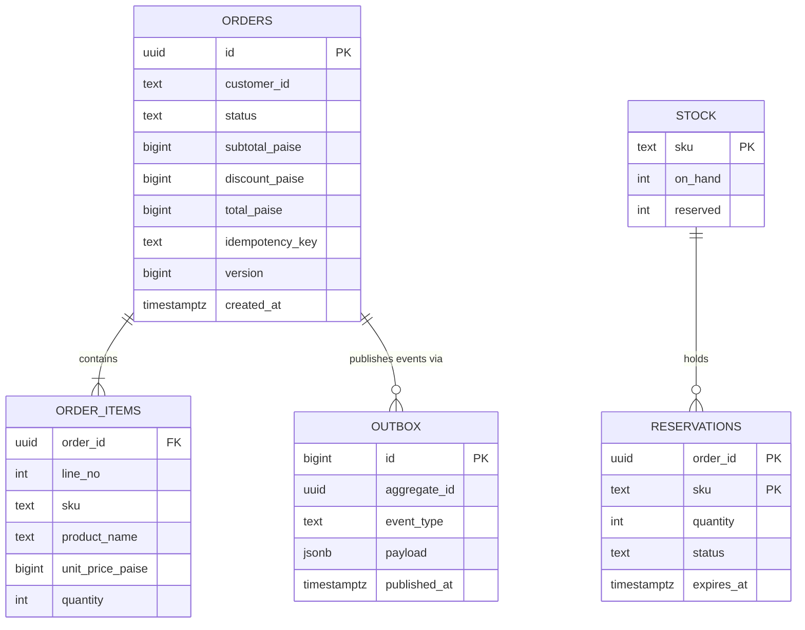

# Chapter 4 · Data Model & SQL

<div class="callout-journey">

🛒 **The ShopNorth Journey** · Chapter 4 of 15 · Phase: **Plan & Design** · SDLC stage: **Design — data model**

**Previously:** You modeled orders, money, pricing rules, and reservations as Java classes that guard the business rules ([Chapter 3](/tutorials/journey-03-low-level-design)).

**In this chapter:** You design the PostgreSQL tables behind them. The database becomes the final line of defense: it guarantees no overselling and no duplicate orders even when two servers race — and it answers the questions the business asks every morning.

</div>

## The Situation

Friday of Sprint 1. Meera (QA) reads Chapter 1's acceptance criteria aloud: "Riya double-clicks *Place order*. Two requests hit two different servers at the same millisecond. Which line of code stops the second order?"

Arjun points at the Java `Order` class. Priya shakes her head: "Each server has its own copy of the objects in memory. Only one thing is shared by both servers: the database. That's where the guarantee has to live."

## Step 1 — The Entities

Each service owns its own database (Chapter 2). The two that carry the hardest rules:



`ORDERS`, `ORDER_ITEMS`, and `OUTBOX` live in the **Order DB**; `STOCK` and `RESERVATIONS` live in the **Inventory DB**. The relationship between them crosses a service boundary, so there's no foreign key — they're linked by `order_id` and kept consistent by events (Chapter 6).

## Step 2 — The Order Tables, With Rules Built In

The schema is created by **Flyway** migrations, versioned in Git next to the code:

```sql
-- V1__create_orders.sql
CREATE TABLE orders (
    id               UUID        PRIMARY KEY,
    customer_id      TEXT        NOT NULL,
    status           TEXT        NOT NULL CHECK (status IN
                       ('PENDING_PAYMENT','PAID','SHIPPED','DELIVERED','CANCELLED','PAYMENT_FAILED','REFUNDED')),
    currency         CHAR(3)     NOT NULL DEFAULT 'INR',
    subtotal_paise   BIGINT      NOT NULL CHECK (subtotal_paise >= 0),
    discount_paise   BIGINT      NOT NULL DEFAULT 0 CHECK (discount_paise >= 0),
    total_paise      BIGINT      NOT NULL CHECK (total_paise >= 0),
    idempotency_key  TEXT        NOT NULL,
    payment_id       TEXT,
    version          BIGINT      NOT NULL DEFAULT 0,
    created_at       TIMESTAMPTZ NOT NULL DEFAULT now(),
    updated_at       TIMESTAMPTZ NOT NULL DEFAULT now(),
    CONSTRAINT uq_orders_idempotency UNIQUE (customer_id, idempotency_key),
    CONSTRAINT chk_orders_total CHECK (total_paise = subtotal_paise - discount_paise)
);

CREATE TABLE order_items (
    order_id          UUID   NOT NULL REFERENCES orders (id),
    line_no           INT    NOT NULL,
    sku               TEXT   NOT NULL,
    product_name      TEXT   NOT NULL,      -- copied at order time: the catalog may change later
    unit_price_paise  BIGINT NOT NULL CHECK (unit_price_paise >= 0),
    quantity          INT    NOT NULL CHECK (quantity > 0),
    PRIMARY KEY (order_id, line_no)
);

-- "My orders" page: newest first for one customer
CREATE INDEX idx_orders_customer_created ON orders (customer_id, created_at DESC);
-- Timeout job: only pending orders, so the index stays tiny
CREATE INDEX idx_orders_pending ON orders (created_at) WHERE status = 'PENDING_PAYMENT';
```

Look at what the constraints do for free:

- **`UNIQUE (customer_id, idempotency_key)`** — the double-click scenario. If two requests with the same key race, the database accepts exactly one insert and rejects the other with a unique-violation error, which the app turns into "return the existing order" (Chapter 5). No Java code can do this across servers.
- **`CHECK (total_paise = subtotal_paise - discount_paise)`** — a bug that miscalculates the total can't be saved.
- **`CHECK (status IN …)`** — mirrors the Java enum, so even a manual SQL fix can't invent a status.
- **Product name and price copied into `order_items`** — the order is a historical record. If the product is renamed or repriced next month, last month's invoice must not change.

## Step 3 — Inventory: Never Oversell

```sql
-- V1__create_stock.sql (Inventory DB)
CREATE TABLE stock (
    sku       TEXT PRIMARY KEY,
    on_hand   INT  NOT NULL CHECK (on_hand >= 0),
    reserved  INT  NOT NULL DEFAULT 0 CHECK (reserved >= 0),
    CONSTRAINT chk_reserved_le_on_hand CHECK (reserved <= on_hand)
);

CREATE TABLE reservations (
    order_id    UUID        NOT NULL,
    sku         TEXT        NOT NULL REFERENCES stock (sku),
    quantity    INT         NOT NULL CHECK (quantity > 0),
    status      TEXT        NOT NULL CHECK (status IN ('RESERVED','COMMITTED','RELEASED')),
    expires_at  TIMESTAMPTZ NOT NULL,
    PRIMARY KEY (order_id, sku)
);

CREATE INDEX idx_reservations_expiry ON reservations (expires_at) WHERE status = 'RESERVED';
```

The heart of "never oversell" is **one conditional update** — check and change in a single statement:

```sql
UPDATE stock
SET    reserved = reserved + :qty
WHERE  sku = :sku
AND    on_hand - reserved >= :qty;
-- 1 row updated → reserved.  0 rows updated → not enough stock.
```

Why this is safe under concurrency: when two transactions try to update the same row, PostgreSQL makes the second one wait for the first to finish, then **re-checks the `WHERE` condition against the updated row** (that's how `READ COMMITTED` handles concurrent updates). If the first took the last unit, the second sees `on_hand - reserved = 0` and updates zero rows. No locks to manage in Java, no race.

The full reservation for an order runs in one transaction — and updates SKUs **in sorted order**:

```sql
BEGIN;
-- for each line, sorted by SKU:
UPDATE stock SET reserved = reserved + 1 WHERE sku = 'HEADPHONE-NC-01' AND on_hand - reserved >= 1;
UPDATE stock SET reserved = reserved + 2 WHERE sku = 'USB-C-CABLE-2M'  AND on_hand - reserved >= 2;
-- if any update returned 0 rows → ROLLBACK and tell the customer which item sold out
INSERT INTO reservations (order_id, sku, quantity, status, expires_at) VALUES
  ('7d3c…', 'HEADPHONE-NC-01', 1, 'RESERVED', now() + interval '15 minutes'),
  ('7d3c…', 'USB-C-CABLE-2M',  2, 'RESERVED', now() + interval '15 minutes');
COMMIT;
```

<div class="callout-warn">

**Lock ordering prevents deadlocks.** If order A updates `HEADPHONE` then `CABLE` while order B updates `CABLE` then `HEADPHONE`, each can end up waiting for the other's lock — a deadlock, which PostgreSQL resolves by aborting one of them. Always touching rows in the same order (sorted by SKU) makes that cycle impossible.

</div>

**Commit and release** are equally small:

```sql
-- Payment succeeded: stock leaves the warehouse count
UPDATE stock SET on_hand = on_hand - :qty, reserved = reserved - :qty WHERE sku = :sku;
UPDATE reservations SET status = 'COMMITTED' WHERE order_id = :orderId AND sku = :sku AND status = 'RESERVED';

-- Expired holds: a background job runs every minute
WITH expired AS (
    UPDATE reservations
    SET    status = 'RELEASED'
    WHERE  status = 'RESERVED' AND expires_at < now()
    RETURNING sku, quantity
)
UPDATE stock s
SET    reserved = s.reserved - e.total
FROM  (SELECT sku, SUM(quantity) AS total FROM expired GROUP BY sku) e
WHERE  s.sku = e.sku;
```

The `AND status = 'RESERVED'` condition makes commit and release **idempotent**: if an event is delivered twice, the second update finds nothing to change.

## Step 4 — Queries the Business Runs

Ananya opens a dashboard every morning. These queries power it (they run on a **read replica**, so reports never slow down checkout):

```sql
-- Revenue per day for the last 7 days (India time)
SELECT date_trunc('day', created_at AT TIME ZONE 'Asia/Kolkata') AS day,
       COUNT(*)                         AS orders,
       SUM(total_paise) / 100.0         AS revenue_inr,
       ROUND(AVG(total_paise) / 100.0, 2) AS avg_order_inr
FROM   orders
WHERE  status IN ('PAID','SHIPPED','DELIVERED')
AND    created_at >= now() - interval '7 days'
GROUP  BY 1
ORDER  BY 1;

-- Top 10 products by revenue this month, with their rank
SELECT sku, product_name, units, revenue_inr,
       RANK() OVER (ORDER BY revenue_inr DESC) AS rank
FROM (
    SELECT oi.sku, oi.product_name,
           SUM(oi.quantity) AS units,
           SUM(oi.quantity * oi.unit_price_paise) / 100.0 AS revenue_inr
    FROM   order_items oi
    JOIN   orders o ON o.id = oi.order_id
    WHERE  o.status IN ('PAID','SHIPPED','DELIVERED')
    AND    o.created_at >= date_trunc('month', now())
    GROUP  BY oi.sku, oi.product_name
) t
ORDER BY rank
LIMIT 10;

-- How many checkouts time out without payment, per hour (a payment-friction signal)
SELECT date_trunc('hour', created_at) AS hour,
       COUNT(*) FILTER (WHERE status = 'CANCELLED')      AS timed_out_or_cancelled,
       COUNT(*)                                          AS started,
       ROUND(100.0 * COUNT(*) FILTER (WHERE status = 'CANCELLED') / COUNT(*), 1) AS pct
FROM   orders
WHERE  created_at >= now() - interval '1 day'
GROUP  BY 1
ORDER  BY 1;
```

And in the **Catalog DB**, "everything under Electronics, including sub-categories" is a recursive query over a category tree:

```sql
WITH RECURSIVE tree AS (
    SELECT id FROM categories WHERE slug = 'electronics'
    UNION ALL
    SELECT c.id FROM categories c JOIN tree t ON c.parent_id = t.id
)
SELECT p.sku, p.name, p.price_paise
FROM   products p
WHERE  p.category_id IN (SELECT id FROM tree) AND p.active
ORDER  BY p.name
LIMIT  50;
```

## Step 5 — Indexes Come From Queries

Every index exists because a specific query needs it — and each one costs write speed and storage. ShopNorth's rule: no index without a named query, and check the plan with `EXPLAIN (ANALYZE, BUFFERS)`.

| Query | Index | Why that shape |
|-------|-------|----------------|
| Customer's latest orders | `(customer_id, created_at DESC)` | Equality first, then the sort column — no sort step needed |
| Timeout job | partial `(created_at) WHERE status = 'PENDING_PAYMENT'` | Only a few thousand pending rows out of millions |
| Reservation expiry | partial `(expires_at) WHERE status = 'RESERVED'` | Same idea for the sweeper |
| Revenue reports | none on the primary — they run on the replica, scanning recent rows | Don't slow down checkout writes for a daily report |

## Step 6 — Changing the Schema Without Downtime

ShopNorth deploys several times a week with **rolling updates** (Chapter 12): for a few minutes, old and new versions of the app run at the same time against the same database. So every migration must work with **both** versions:

1. **Expand** — add the new column (nullable) or table; deploy code that writes both old and new.
2. **Migrate** — backfill in small batches.
3. **Contract** — once nothing reads the old column, drop it in a later release.

And never lock a busy table: create indexes with `CREATE INDEX CONCURRENTLY` (in its own migration, outside a transaction), and never edit a migration that has already run anywhere — add a new one.

## Step 7 — Planning for Growth and Recovery

- **Growth:** at ~26 million orders after three years (Chapter 1), the `orders` table gets **monthly range partitioning** on `created_at`. Recent partitions stay hot and small; old ones can be archived or detached.
- **Recovery:** the managed PostgreSQL runs **Multi-AZ** with a synchronous standby (RPO 0 for orders) and **point-in-time recovery** for human mistakes ("restore to 10:41, just before the bad script"). Kabir runs a restore drill every quarter — a backup you've never restored is only a hope.

<!-- aws-section:start -->

## ☁️ ShopNorth on AWS — Where the Schema Lives

The schema runs on **Amazon RDS for PostgreSQL**, one instance per service database (catalog, orders, inventory):

| Setting | Value | Why |
|---------|-------|-----|
| Deployment | Multi-AZ instance — a synchronous standby in another zone | Failover in 1-2 minutes without losing committed orders |
| Reports | A read replica of `orders` | Admin sales reports never slow down checkout |
| Backups | Automated, 14 days, point-in-time recovery, replicated to Hyderabad | Undo a bad migration; survive a regional disaster |
| Major upgrades | RDS Blue/Green Deployments | A switchover of about a minute instead of hours of downtime |

What happens when one primary isn't enough is in [Replication & Sharding](/tutorials/replication-partitioning); the RDS details are in [Databases on AWS](/tutorials/aws-databases).

<!-- aws-section:end -->

## 🏢 Real-World Scenarios

<div class="callout-scenario">

**Scenario**: A store's inventory code did `SELECT available FROM stock WHERE sku = ?`, checked `available >= qty` in Java, then ran `UPDATE stock SET available = available - qty`. It passed every test. During a flash sale, 40 customers bought the last 10 units: many requests read "10 available" before any of them wrote. **Decision**: Replace read-then-write with a single conditional `UPDATE … WHERE available >= qty` and check the affected row count; add a `CHECK (reserved <= on_hand)` constraint as a backstop; and add a concurrency test (Chapter 8) that fires 100 parallel reservations at 10 units and asserts exactly 10 succeed.

</div>

<div class="callout-scenario">

**Scenario**: A deployment added an index to a 40-million-row orders table with a plain `CREATE INDEX`. The table was locked against writes for 11 minutes; checkout failed for every customer until it finished. **Decision**: Migrations are reviewed like code. Index creation uses `CONCURRENTLY`; risky migrations are rehearsed on a production-sized copy first; and the pipeline flags statements known to take heavy locks before they reach production.

</div>

## 🔗 Go Deeper — Topic Tutorials

| Topic | What you'll learn | How ShopNorth used it here |
|-------|-------------------|----------------------------|
| [SQL Basics](/tutorials/sql-basics) · [Joins](/tutorials/sql-joins) · [Aggregates](/tutorials/sql-aggregates) | Core query skills | Every report in Step 4 |
| [Subqueries & CTEs](/tutorials/sql-subqueries-cte) | CTEs, recursive queries, data-modifying CTEs | Category tree; the reservation sweeper |
| [Window Functions](/tutorials/sql-window-functions) | `RANK`, `LAG`, running totals | Top products ranking |
| [Indexing & Query Optimization](/tutorials/sql-indexing) | Composite and partial indexes, `EXPLAIN` | The index table in Step 5 |
| [Database Decisions](/tutorials/database-decisions) | Schema design, partitioning, replicas | Constraints, partitioning plan, read replica for reports |
| [@Transactional — Propagation & Isolation](/tutorials/spring-transactional) | Isolation levels, locking | Why `READ COMMITTED` + conditional updates is enough |
| [Recursion & Backtracking](/tutorials/dsa-recursion) | Thinking recursively | The category tree query is recursion in SQL |
| [Replication & Sharding](/tutorials/replication-partitioning) | Replicas, lag, partition keys, resharding | Why one primary is enough for years, and the plan when it isn't |
| [Databases on AWS](/tutorials/aws-databases) | RDS, Aurora, DynamoDB, ElastiCache | Multi-AZ, the reports replica, backups, Blue/Green upgrades |

## 📚 Extra Case Studies

The same data problems in other domains: [Stock Trading Platform](/tutorials/stock-trading-platform) (concurrency and ledgers), [Design BookMyShow](/tutorials/lld-bookmyshow) (seat holds), and [Payment Gateway](/tutorials/payment-gateway) (idempotency keys and reconciliation).

## 🛠️ Mini Project — Build ShopNorth, Step 4: The Database

**Goal**: A schema that enforces the rules, and proof that it does. 2 evenings.

**Build**

1. Run PostgreSQL locally (any way you like — Chapter 10 will containerize it).
2. Write Flyway migrations for `orders`, `order_items`, `outbox`, `stock`, and `reservations` with the constraints and indexes from this chapter.
3. Write the reserve, commit, release, and sweeper SQL; wrap reserve in a function or a small Java/JDBC method that returns which SKU failed.
4. Concurrency proof: seed one SKU with 10 units, then fire 100 parallel reservations (a small Java program with an `ExecutorService`, or `pgbench` with a custom script). Assert exactly 10 succeed and `reserved = 10`.
5. Load 100,000 fake orders and run the three reports with `EXPLAIN (ANALYZE, BUFFERS)`; add or remove indexes and record the timings.

**Acceptance criteria**: zero oversells in the concurrency test; inserting two orders with the same `(customer_id, idempotency_key)` fails; a README table of query timings before and after indexing.

## 🏋️ Practice Assignments

### 🟢 Low — Build the reflexes

**L1.** Write the query for a customer's 10 most recent orders, and say which index serves it.

<details>
<summary>Show answer</summary>

```sql
-- postgres (ShopNorth schema)
SELECT id, status, total_paise, created_at
FROM   orders
WHERE  customer_id = 'cust_123'
ORDER  BY created_at DESC
LIMIT  10;
```

The composite index `(customer_id, created_at DESC)` serves it: PostgreSQL jumps to the customer's entries, which are already sorted newest-first, and reads only 10 — no full scan, no sort step.

</details>

**L2.** Why is the unique constraint on `(customer_id, idempotency_key)` instead of just `(idempotency_key)`?

<details>
<summary>Show answer</summary>

Idempotency keys are generated by clients, so they're only guaranteed unique per client. Scoping by customer prevents two different customers' keys from colliding (which would wrongly return one customer's order to another) and stops anyone from probing other customers' keys. It also matches the lookup the API does: "has *this customer* already sent *this key*?"

</details>

### 🟡 Medium — Apply it

**M1.** Write a query for the top 3 products per category by units sold in the last 30 days. Assume `order_items` can be joined to a `product_categories(sku, category)` table.

<details>
<summary>Show answer</summary>

```sql
-- postgres (ShopNorth schema)
WITH sales AS (
    SELECT pc.category, oi.sku, SUM(oi.quantity) AS units
    FROM   order_items oi
    JOIN   orders o              ON o.id = oi.order_id
    JOIN   product_categories pc ON pc.sku = oi.sku
    WHERE  o.status IN ('PAID','SHIPPED','DELIVERED')
    AND    o.created_at >= now() - interval '30 days'
    GROUP  BY pc.category, oi.sku
),
ranked AS (
    SELECT category, sku, units,
           ROW_NUMBER() OVER (PARTITION BY category ORDER BY units DESC) AS rn
    FROM   sales
)
SELECT category, sku, units
FROM   ranked
WHERE  rn <= 3
ORDER  BY category, rn;
```

`ROW_NUMBER` gives exactly 3 per category; use `RANK` or `DENSE_RANK` if ties should all be included.

</details>

**M2.** Two orders deadlock while reserving stock. Explain how it happened and two ways to prevent it.

<details>
<summary>Show answer</summary>

Order A locked row `SKU-A` and then wanted `SKU-B`; order B had locked `SKU-B` and then wanted `SKU-A`. Each waits for the other forever, so PostgreSQL detects the cycle and aborts one with a deadlock error. Prevention: (1) **lock ordering** — always update SKUs in sorted order, so no cycle can form; (2) **reserve in one statement** (e.g., `UPDATE stock … FROM (VALUES …)` over all lines) so the rows are locked together, still ideally in a consistent order. Also make the aborted transaction **retryable**: catch the deadlock/serialization error and retry once or twice with a short jittered delay.

</details>

### 🔴 High — Think like a senior

**H1.** You must add a `channel` column (`WEB`, `APP`) that is required for new orders, on a table with 20 million rows, with zero downtime. Write the migration plan.

<details>
<summary>Show answer</summary>

1. **Expand:** `ALTER TABLE orders ADD COLUMN channel TEXT;` (nullable, no default rewrite — instant). Deploy app version N+1 that writes `channel` for every new order.
2. **Backfill** existing rows in batches, e.g., 10,000 at a time with a short pause, filling a sensible value (`'WEB'`, or derived from another field), watching replication lag.
3. **Enforce without a long lock:** `ALTER TABLE orders ADD CONSTRAINT chk_channel_not_null CHECK (channel IS NOT NULL) NOT VALID;` then `ALTER TABLE orders VALIDATE CONSTRAINT chk_channel_not_null;` (validation scans without blocking writes). On recent PostgreSQL versions, `SET NOT NULL` can then use the validated constraint and skip its own full scan.
4. **Contract:** after all app versions write it, optionally add the `IN ('WEB','APP')` check the same way.

Each step is backward compatible with the app version running alongside it during rolling deploys.

</details>

**H2.** Design monthly partitioning for `orders`. What changes for keys, indexes, and queries?

<details>
<summary>Show answer</summary>

`CREATE TABLE orders (…) PARTITION BY RANGE (created_at);` with one partition per month, created ahead of time by a scheduled job (or `pg_partman`). Unique constraints on a partitioned table must include the partition key, so the primary key becomes `(id, created_at)` and the idempotency constraint becomes `(customer_id, idempotency_key, created_at)` — which weakens it across months, so keep a small separate `idempotency_keys` table (with a TTL cleanup) as the real guard. Indexes are created per partition (declared on the parent). Queries should filter on `created_at` so the planner prunes partitions — "my recent orders" naturally does. Old partitions can be detached and archived to cheap storage. `order_items` either gets the same partitioning (with `created_at` copied in) or references orders without a foreign key.

</details>

## 🎯 Interview Corner

<div class="callout-interview">

**Q: "How do you prevent overselling when many customers buy the last few items at once?"**

I make the check and the change one atomic database operation: an update that reserves stock only if enough is available, with the condition in the WHERE clause, and I check how many rows were updated. In PostgreSQL, concurrent updates to the same row are serialized and the condition is re-checked after waiting, so the second buyer simply gets zero rows. I back it with a CHECK constraint that reserved stock can't exceed on-hand stock, lock rows in a consistent order to avoid deadlocks, and prove it with a concurrency test that fires many parallel reservations at a small stock level. Read-then-write in application code is the classic bug here.

</div>

<div class="callout-interview">

**Q: "How do you make order creation idempotent?"**

The client sends an idempotency key per checkout attempt, and the database enforces uniqueness on customer ID plus that key. When a duplicate request arrives, whether from a double click or a retry after a timeout, the insert hits the unique constraint. The service catches that specific error and returns the order that already exists, with the same response as the first time. The guarantee lives in the database because it's the only thing shared by all application instances. Application-level checks alone can race.

</div>

<div class="callout-interview">

**Q: "How do you change a database schema without downtime?"**

I use expand and contract. First, add new structures in a backward-compatible way: nullable columns or new tables, and indexes created concurrently. Then deploy code that writes both the old and new shapes, and backfill existing data in small batches. Once nothing reads the old shape, remove it in a later release. Every migration has to work with both the old and the new app version, because rolling deployments run them side by side. Heavy operations are rehearsed on production-sized data first.

</div>

> **Golden rule: application code can check a rule; only the database can guarantee it across every server. Put the guarantees where the shared truth lives.**

<div class="callout-journey">

➡️ **Next: [Chapter 5 · Building with Spring Boot](/tutorials/journey-05-spring-boot)** — The design is done. Sprint 2 starts, and you write the Order service: REST endpoints, validation, transactions, the idempotency key, and calls to Inventory that survive slow networks.

</div>
