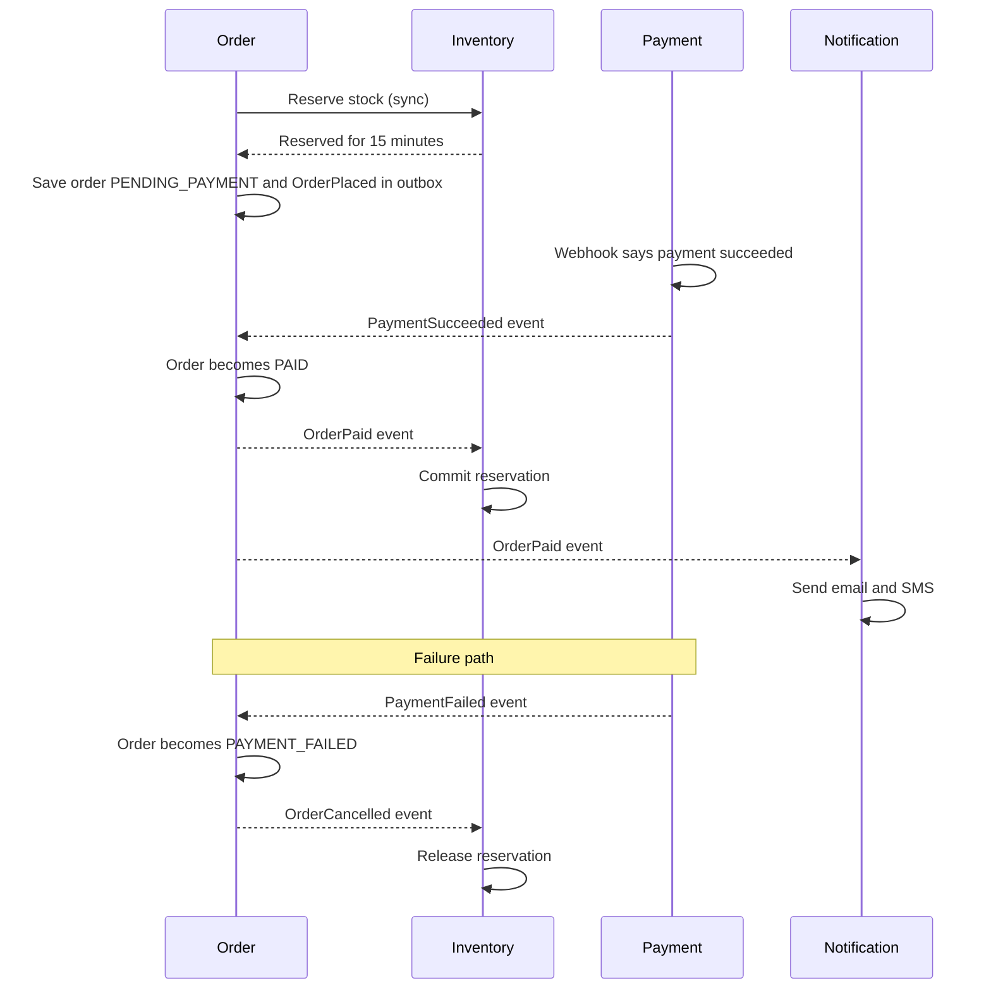

# Chapter 6 · Microservices & Events

<div class="callout-journey">

🛒 **The ShopNorth Journey** · Chapter 6 of 15 · Phase: **Build** · SDLC stage: **Development — services & events**

**Previously:** You built the Order service: `POST /orders` with idempotency, short transactions, resilient calls to Inventory, and an outbox row written with every order ([Chapter 5](/tutorials/journey-05-spring-boot)).

**In this chapter:** ShopNorth's services start working together. One gateway in front, Kafka events between them, and a checkout *saga* that stays consistent when payments fail, messages repeat, or Kafka itself goes down.

</div>

## The Situation

Sprint 3. Rohan (frontend) has a problem: "My React app talks to five services on five URLs, each with its own CORS settings. And where do I send the login token?" Meanwhile Ananya asks: "If the email provider is down, does the customer still get their order?"

Priya answers both with the same principle: "One door in from the outside. Inside, services tell each other what *happened*, instead of calling each other for everything."

## Step 1 — Service Boundaries

| Service | Owns (data) | Sync API (examples) | Publishes | Consumes |
|---------|-------------|---------------------|-----------|----------|
| **Catalog** | Products, categories, prices | `GET /products/{sku}`, prices for Order | `ProductUpdated` | — |
| **Cart** | Carts (Redis) | `PUT /cart/items/{sku}` | — | `OrderPlaced` (clear cart) |
| **Order** | Orders, order items | `POST /orders`, `GET /orders/{id}` | `OrderPlaced`, `OrderPaid`, `OrderCancelled` | `PaymentSucceeded`, `PaymentFailed` |
| **Inventory** | Stock, reservations | `PUT /reservations/{orderId}` | `StockLow` | `OrderPaid` (commit), `OrderCancelled` (release) |
| **Payment** | Payments, provider webhooks | `POST /payments/sessions` | `PaymentSucceeded`, `PaymentFailed`, `RefundCompleted` | `OrderCancelled` (refund if paid) |
| **Notification** | Templates, delivery log | — | — | `OrderPaid`, `OrderCancelled`, `OrderShipped` |
| **Search indexer** | Search index | — | — | `ProductUpdated` |

Each boundary follows a business capability and has **one owner team** — at ShopNorth's size, "team" is one or two people per service. A good test: can you change one service's database schema without coordinating with anyone? At ShopNorth, yes.

## Step 2 — One Door In: The API Gateway

The gateway is the only thing exposed to the internet. It handles cross-cutting concerns and **no business logic**:

```yaml
# Spring Cloud Gateway (recent versions use the prefix spring.cloud.gateway.server.webflux)
spring:
  cloud:
    gateway:
      routes:
        - id: catalog
          uri: http://catalog-service          # Kubernetes service DNS name (Chapter 12)
          predicates:
            - Path=/api/products/**,/api/categories/**
          filters:
            - StripPrefix=1
        - id: cart
          uri: http://cart-service
          predicates:
            - Path=/api/cart/**
          filters:
            - StripPrefix=1
        - id: orders
          uri: http://order-service
          predicates:
            - Path=/api/orders/**
          filters:
            - StripPrefix=1
        - id: payments
          uri: http://payment-service
          predicates:
            - Path=/api/payments/**
          filters:
            - StripPrefix=1
```

| Gateway does | Gateway doesn't |
|--------------|-----------------|
| Routing, TLS, CORS | Pricing, stock checks, order rules |
| Validate the login token (Chapter 7) | Call several services and merge results (that's a BFF if you need it) |
| Rate limiting per customer and IP (Chapter 14) | Store data |
| Add a request ID / trace headers (Chapter 13) | Retry non-idempotent calls |

## Step 3 — Sync or Async?

| Interaction | Style | Why |
|-------------|-------|-----|
| Order → Catalog (current prices) | Sync HTTP | Needed to answer *this* request |
| Order → Inventory (reserve) | Sync HTTP | The customer must know now if it's in stock |
| Payment → Order (payment result) | **Event** | Arrives later via webhook; Order reacts when it can |
| Order → Inventory (commit / release) | **Event** | Doesn't need to block anyone |
| Order → Notification (emails, SMS) | **Event** | Must never slow down or break checkout |
| Catalog → Search (index updates) | **Event** | Seconds of delay is fine |

The rule from Chapter 2, now concrete: **sync only for what the current request can't finish without; events for everything that reacts to a fact**.

## Step 4 — Designing the Events

Every event uses the same envelope:

```json
{
  "eventId": "0f8e6a52-5d0b-4b4e-9a4e-3f7c1a2b9d10",
  "type": "OrderPaid",
  "version": 1,
  "occurredAt": "2026-10-24T20:00:03.120Z",
  "aggregateId": "7d3c9b1e-2f4a-4c55-8e0e-6a1d2c3b4f5a",
  "data": {
    "orderId": "7d3c9b1e-2f4a-4c55-8e0e-6a1d2c3b4f5a",
    "paymentId": "pay_9Q2x",
    "totalPaise": 249900,
    "items": [{ "sku": "HEADPHONE-NC-01", "quantity": 1 }]
  }
}
```

| Topic | Key | Why that key |
|-------|-----|--------------|
| `orders.events` | `orderId` | All events for one order land in one partition → processed **in order** |
| `payments.events` | `orderId` | Same: the Order service sees one order's payment events in order |
| `catalog.events` | `sku` | Updates to one product stay in order |

Rules the team agrees on:

- **Events are facts in the past tense** (`OrderPaid`, not `PayOrder`). A fact can't be rejected; a command can.
- **Evolve by adding fields.** Consumers ignore fields they don't know; renaming or removing a field means a new `version` (and a period when both are published).
- **Carry enough data** for typical consumers (the items, the total), so Notification doesn't have to call Order back for every email.

## Step 5 — The Outbox Pattern: Never Lose an Event

Here's the bug the outbox prevents. After saving an order, the obvious code is:

```java
orders.save(order);                        // 1. database commit succeeds
kafka.send("orders.events", orderPlaced);  // 2. ...and Kafka is unreachable → event lost forever
```

The database and Kafka can't share one transaction, so any "save, then publish" (or "publish, then save") can leave them disagreeing. This is the **dual-write problem**.

The fix you already started in Chapter 5: write the event into an **outbox table in the same database transaction** as the order. A separate **relay** publishes outbox rows to Kafka and marks them done:

```java
@Component
class OutboxRelay {

    private final OutboxJpaRepository outbox;
    private final KafkaTemplate<String, String> kafka;
    private final Clock clock;

    // constructor omitted

    @Scheduled(fixedDelayString = "PT0.5S")
    @SchedulerLock(name = "outbox-relay")     // ShedLock: one active relay → per-order event order is preserved
    @Transactional
    public void publishBatch() throws Exception {
        // SELECT * FROM outbox WHERE published_at IS NULL ORDER BY id LIMIT 200 FOR UPDATE
        for (OutboxEntity row : outbox.lockNextUnpublished(200)) {
            kafka.send(row.topic(), row.aggregateId().toString(), row.payload())
                 .get(5, TimeUnit.SECONDS);    // wait for the broker's acknowledgement
            row.markPublished(clock.instant());
        }
    }
}
```

If Kafka is down, rows simply wait in the outbox and the relay catches up later — **orders keep working**. If the relay crashes after sending but before marking a row, that row is sent again: delivery is **at-least-once**, so consumers must handle duplicates (Step 6).

<div class="callout-info">

**Yes, the relay makes network calls inside a transaction** — the thing Chapter 5 warned about. Here it's a deliberate trade-off: it's a background job (not a customer request), batches are small, every send has a 5-second limit, and it uses its own small connection pool. As ShopNorth grows, the team plans to replace the polling relay with **Debezium** (change data capture), which reads the outbox from PostgreSQL's write-ahead log with no polling and no locks.

</div>

## Step 6 — Consumers That Tolerate Duplicates

Kafka redelivers messages after rebalances, crashes, or relay retries. Every consumer must be **idempotent**: processing the same event twice must have the same effect as once.

```java
@Component
class PaymentEventsListener {

    private final ProcessedEvents processed;       // table processed_events(event_id PRIMARY KEY, processed_at)
    private final OrderCommands orders;

    // constructor omitted

    @KafkaListener(topics = "payments.events", groupId = "order-service")
    @Transactional
    public void on(PaymentEvent event) {
        // INSERT INTO processed_events (event_id) VALUES (?) ON CONFLICT DO NOTHING → false if already seen
        if (!processed.markIfNew(event.eventId())) {
            return;                                 // duplicate delivery: already applied
        }
        switch (event.type()) {
            case "PaymentSucceeded" -> orders.markPaid(event.orderId(), event.paymentId());
            case "PaymentFailed"    -> orders.markPaymentFailed(event.orderId(), event.reason());
            default -> { }                           // unknown types are ignored: forward compatible
        }
    }
}
```

Marking the event as processed and updating the order happen in **one database transaction**. If the service crashes after the commit but before Kafka records the offset, the event is redelivered, `markIfNew` returns false, and nothing happens twice.

Messages that keep failing (a bug, bad data) must not block the partition forever:

```java
@Bean
DefaultErrorHandler kafkaErrorHandler(KafkaTemplate<Object, Object> template) {
    var toDeadLetter = new DeadLetterPublishingRecoverer(template);   // sends to <topic>.DLT by default
    var backOff = new ExponentialBackOffWithMaxRetries(3);
    backOff.setInitialInterval(500);
    backOff.setMultiplier(2.0);
    return new DefaultErrorHandler(toDeadLetter, backOff);
}
```

After three retries, the message moves to a dead-letter topic, the partition keeps flowing, and Kabir's alert on dead-letter volume (Chapter 13) tells the team to look.

## Step 7 — The Checkout Saga

A database transaction can't span four services. Checkout is instead a **saga**: a sequence of local transactions, each publishing an event that triggers the next, with **compensating actions** when something fails. ShopNorth uses **choreography** — no central coordinator; each service reacts to events.



| Step | Local transaction | If a later step fails → compensation |
|------|-------------------|--------------------------------------|
| Reserve stock | Inventory: `reserved += qty` | Release reservation (on `OrderCancelled` or expiry) |
| Create order | Order: insert `PENDING_PAYMENT` | Cancel order (timeout job or payment failure) |
| Payment | Payment provider charges | Refund (on `OrderCancelled` after payment, see Chapter 3) |
| Commit stock | Inventory: `on_hand -= qty` | Return to stock if the order is later refunded |

<div class="callout-tip">

**Choreography vs orchestration.** Choreography (events only) suits ShopNorth's short, mostly linear checkout. If the flow grows — fraud checks, split shipments, loyalty points, partial refunds — it gets hard to see the whole process in one place. That's the signal to introduce an **orchestrator** (a dedicated checkout process manager, or a workflow engine such as Temporal) that tells each service what to do and tracks the saga's state.

</div>

## Step 8 — Finding Each Other

On Kubernetes (Chapter 12), each service gets a stable DNS name (`http://order-service` inside the namespace), and the platform load-balances across healthy pods. ShopNorth doesn't need a separate service registry like Eureka. Configuration lives in Kubernetes ConfigMaps and Secrets, not in a config server.

<!-- aws-section:start -->

## ☁️ ShopNorth on AWS — The Event Plumbing

| Need | AWS service | How ShopNorth uses it | Learn it |
|------|-------------|----------------------|----------|
| Business events (orders, payments, inventory, catalog) | **MSK** (managed Kafka) | 3 brokers across 3 zones, IAM auth per service, `acks=all` | [MSK](/tutorials/aws-msk) |
| Email and SMS delivery with retries | **SNS → SQS** | The Notification service publishes once; separate email and SMS queues with dead-letter queues | [SQS & SNS](/tutorials/aws-sqs-sns) |
| AWS and SaaS events, schedules | **EventBridge** | Image uploads, Auth0 security events, AWS findings, the nightly report | [EventBridge](/tutorials/aws-eventbridge) |
| Small event-driven jobs | **Lambda** | Image resizing, security alerts, the sales report | [Lambda](/tutorials/aws-lambda) |

The outbox relay's ShedLock is one example of coordination between pods. [Consensus & Coordination](/tutorials/consensus-coordination) explains when you need a single active instance, when `SKIP LOCKED` is enough, and why a lock never replaces the database's conditional update.

<!-- aws-section:end -->

## 🏢 Real-World Scenarios

<div class="callout-scenario">

**Scenario**: An e-commerce team saved the order and then published `OrderPlaced` to Kafka in the next line of code. During a 6-minute Kafka broker restart, about 2,000 orders were saved without events: no confirmation emails, no stock commits, and warehouse picking lists missing those orders. Support learned about it from angry customers the next day. **Decision**: Adopt the transactional outbox. The order and its event are committed together; the relay publishes whenever Kafka is available; an alert fires if the oldest unpublished outbox row is older than 2 minutes.

</div>

<div class="callout-scenario">

**Scenario**: After a consumer-group rebalance during a deployment, the notification service reprocessed a few hundred messages and customers received duplicate "Order confirmed" SMS messages — and the inventory consumer, which did `on_hand = on_hand - qty` without a guard, committed stock twice. **Decision**: Every consumer became idempotent: a `processed_events` table checked in the same transaction as the side effect, and state-based updates (`… WHERE status = 'RESERVED'`) so a repeat changes nothing. Duplicate delivery is now a non-event.

</div>

## 🔗 Go Deeper — Topic Tutorials

| Topic | What you'll learn | How ShopNorth used it here |
|-------|-------------------|----------------------------|
| [How to Think in Microservices](/tutorials/thinking-microservices) | When to split, and how | Service boundaries by capability and ownership |
| [Microservices Patterns](/tutorials/microservices-patterns) | Saga, outbox, CQRS, circuit breaker | The checkout saga and the outbox |
| [Service Communication](/tutorials/service-communication) | Sync vs async, REST vs events | The sync-or-async table |
| [API Gateway Pattern](/tutorials/api-gateway-pattern) | Gateway responsibilities and pitfalls | One door in, no business logic |
| [Distributed Transactions](/tutorials/distributed-transactions) | 2PC vs sagas, compensation | Compensating actions per step |
| [Apache Kafka Deep Dive](/tutorials/kafka-deep-dive) | Topics, partitions, consumer groups, delivery semantics | Keys, ordering, retries, dead-letter topics |
| [Messaging & Event Systems](/tutorials/messaging-decisions) | Choosing brokers and patterns | Why Kafka for ShopNorth's events |
| [Service Discovery & Config](/tutorials/service-discovery) | Registries vs platform DNS | Kubernetes DNS instead of Eureka |
| [MSK](/tutorials/aws-msk) | Kafka on AWS: IAM auth, partitions, operations | The cluster behind every event in this chapter |
| [SQS & SNS](/tutorials/aws-sqs-sns) | Queues, DLQs, fan-out | Email and SMS delivery for the Notification service |
| [EventBridge](/tutorials/aws-eventbridge) | Event routing, Scheduler, SQS vs SNS vs Kafka | AWS and Auth0 events, scheduled jobs |
| [Lambda](/tutorials/aws-lambda) | Serverless functions | Image resizing, security alerts, the sales report |
| [Consensus & Coordination](/tutorials/consensus-coordination) | Leader election, leases, fencing tokens | ShedLock for the outbox relay; `SKIP LOCKED` for jobs |

## 📚 Extra Case Studies

Events and sagas in other domains: [Payment Gateway](/tutorials/payment-gateway) (webhooks and reconciliation), [Notification System](/tutorials/notification-system) (fan-out to channels), [Design WhatsApp / Messenger](/tutorials/design-chat-system) (delivery guarantees), and [Data Ingestion Platform](/tutorials/data-ingestion-platform) (asynchronous pipelines with retries and dead-letter queues).

## 🛠️ Mini Project — Build ShopNorth, Step 6: Events and the Saga

**Goal**: Two more services and a saga that survives failures. 1 week of evenings.

**Build**

1. Run Kafka locally (a single-node container is fine — Chapter 10 puts it into Docker Compose).
2. Add the outbox relay to your order service (`@Scheduled` + ShedLock, or Debezium if you're adventurous).
3. Create `payment-simulator`: an endpoint that publishes `PaymentSucceeded` or `PaymentFailed` for an order (you choose, to test both paths).
4. Create `notification-service`: consumes `OrderPaid` and logs "email sent", with a `processed_events` table for idempotency and a dead-letter topic.
5. Make your inventory fake consume `OrderPaid` / `OrderCancelled` and commit or release.
6. Chaos checks: stop Kafka for 2 minutes while placing orders (orders still succeed; events flow after restart); publish the same `PaymentSucceeded` twice (one email, one stock commit).

**Acceptance criteria**: no lost events with Kafka down; no duplicate side effects on redelivery; a failed payment releases stock.

## 🏋️ Practice Assignments

### 🟢 Low — Build the reflexes

**L1.** Why is `orders.events` keyed by `orderId` and not by `customerId`?

<details>
<summary>Show answer</summary>

Kafka only guarantees order *within a partition*, and the key decides the partition. What must stay in order is each order's lifecycle (`OrderPlaced` → `OrderPaid` → `OrderShipped`), so the key is the order ID. Keying by customer would also keep one order's events together, but a customer who places many orders during the sale would create a hot partition, and nothing actually needs ordering *across* a customer's orders.

</details>

**L2.** What does "at-least-once delivery" mean, and what must every consumer do because of it?

<details>
<summary>Show answer</summary>

Every event is delivered **one or more times** — never lost, but sometimes repeated (after crashes, rebalances, or relay retries). So every consumer must be **idempotent**: record processed event IDs (in the same transaction as the side effect) or make updates conditional on the current state, so that processing a duplicate changes nothing.

</details>

### 🟡 Medium — Apply it

**M1.** The Notification team wants to add the customer's first name to emails. `OrderPaid` doesn't contain it. What are the options, and which do you pick?

<details>
<summary>Show answer</summary>

(1) Notification calls a Customer API for each email — simple, but adds a synchronous dependency, and email sending fails when Customer is down. (2) Add `customerFirstName` to `OrderPaid` — but Order doesn't own that data, and it may be stale. (3) Notification keeps its own small copy of customer contact data, updated from `CustomerUpdated` events — resilient and fast, at the cost of eventual consistency. For emails, (3) is usually best, with (1) as a fallback when the local copy is missing. Avoid stuffing other services' data into events "just in case".

</details>

**M2.** You need to rename `totalPaise` to `amountPaise` in `OrderPaid`. Plan the change without breaking consumers.

<details>
<summary>Show answer</summary>

Treat it as a contract change. (1) Publish **both** fields in version 1 for a transition period (or publish `OrderPaid` v2 alongside v1). (2) Ask each consumer team to switch to `amountPaise`, tracked in a checklist. (3) Confirm with consumer metrics or logs that nobody reads `totalPaise`. (4) Remove it in a later release, or stop publishing v1. Contract tests (Chapter 8) between producer and consumers catch anyone who missed the change before it reaches production.

</details>

### 🔴 High — Think like a senior

**H1.** The search index got corrupted by a bug. How do you rebuild it using events, without stopping the site?

<details>
<summary>Show answer</summary>

Build a **new** index rather than repairing the old one: create `products_v2`, run a fresh consumer group that reads `catalog.events` from the beginning (only possible if the topic retains full history — use a **compacted topic** keyed by SKU so the latest state of every product is always kept), or bulk-load from Catalog's database and then switch to consuming events from a recorded position. When `products_v2` has caught up, switch the **alias** that the search API queries from v1 to v2 atomically, then delete v1. The site keeps serving searches from the old index throughout.

</details>

**H2.** Kafka is unavailable for 20 minutes during the sale. Walk through what each part of ShopNorth does.

<details>
<summary>Show answer</summary>

**Checkout keeps working:** orders are saved with outbox rows; the relay can't publish, so the outbox grows. **Payments** still succeed at the provider; the Payment service stores webhooks and its own outbox rows. **Effects are delayed:** orders stay `PENDING_PAYMENT` from ShopNorth's point of view, so the **timeout job must not cancel them**. It should pause when the outbox backlog or payment-event lag is high, or check payment status with the provider before cancelling, or customers who paid get cancelled. Emails and stock commits wait. **Recovery:** when Kafka returns, the relays drain the backlog in order; consumers process the burst, and idempotency absorbs any duplicates. **Operationally:** alerts on outbox age and consumer lag fire, the status page says "order confirmations are delayed", and the runbook says which jobs to pause. This is why the "what happens when Kafka is down" row existed in Chapter 2.

</details>

## 🎯 Interview Corner

<div class="callout-interview">

**Q: "What is the transactional outbox pattern, and why do you need it?"**

It solves the dual-write problem: you can't atomically write to your database and publish to a message broker, so one can succeed while the other fails, and events get lost or invented. With an outbox, the service writes the event to an outbox table in the same local transaction as the business change. A relay, either a polling publisher or change data capture like Debezium, reads the outbox and publishes to Kafka, marking rows as sent. If the broker is down, events wait in the table. Delivery becomes at-least-once, so consumers must be idempotent.

</div>

<div class="callout-interview">

**Q: "Can you get exactly-once processing with Kafka?"**

Kafka can give exactly-once semantics inside Kafka, using transactions and idempotent producers for read-process-write between topics. But end-to-end with external side effects, like updating a database or sending an SMS, you design for effectively-once: accept at-least-once delivery and make the side effect idempotent. In practice, I record processed event IDs in the same database transaction as the change, or make updates conditional on current state. The goal is that a duplicate delivery changes nothing.

**Follow-up trap**: "Why not just commit the offset before processing?" → That's at-most-once: a crash after committing loses the event. For orders and payments, losing events is worse than handling duplicates.

</div>

<div class="callout-interview">

**Q: "How did you decide where to draw service boundaries?"**

By business capability and data ownership, checked against how we actually work. Each service owns its data, and no other service touches its tables. Things that change together stay together. Things with very different scaling, security, or reliability needs are separated: browsing scales differently from checkout, and payment code has stricter controls. I also keep the number of services proportional to the team, so six engineers had six deployables, not thirty. The test I use: can a team change a service's schema and deploy it without coordinating with anyone? If not, the boundary is probably wrong.

</div>

> **Golden rule: between services, publish facts reliably (outbox) and consume them safely (idempotency) — then a slow or failing piece delays the story instead of breaking it.**

<div class="callout-journey">

➡️ **Next: [Chapter 7 · Security & Login](/tutorials/journey-07-security)** — Everything works — for anyone. Next, customers log in with Auth0, admins get roles, the gateway and services verify tokens, payment webhooks prove they're real, and secrets leave the code for good.

</div>
