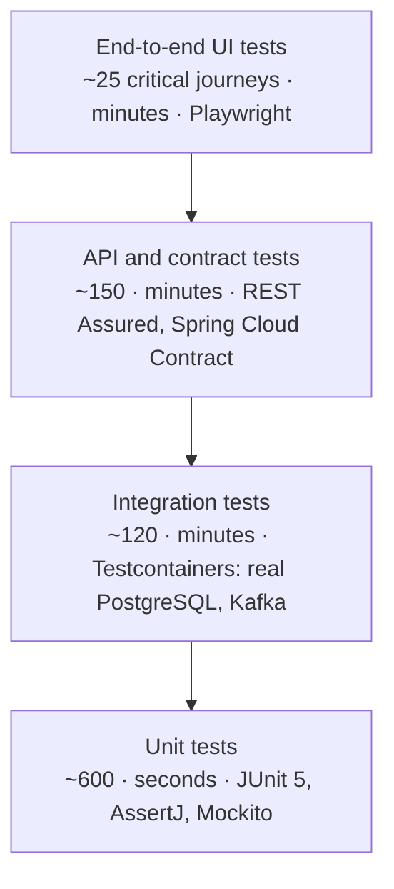

# Chapter 8 · Testing — Unit to Regression

<div class="callout-journey">

🛒 **The ShopNorth Journey** · Chapter 8 of 15 · Phase: **Quality**

**Previously:** ShopNorth is built and secured: services, events, the checkout saga, login, authorization, and verified payment webhooks ([Chapter 7](/tutorials/journey-07-security)).

**In this chapter:** Meera (QA/SDET) turns "it works on my machine" into proof. You'll write every kind of test ShopNorth needs — unit, integration, contract, end-to-end, smoke, regression, and load — and learn exactly what each one catches and when it runs.

</div>

## The Situation

Sprint 4, Monday stand-up. Meera shares a bug report: a refactor of the pricing code last week removed the cap on stacked discounts. In staging, a ₹2,000 cart with a coupon *and* a bank offer came out at ₹0. Nobody noticed for two days.

"We have tests," Arjun says. "Some," Meera replies. "We don't have a **strategy**. Today we fix that — and every bug we find gets a test so it can never come back."

## Step 1 — The Test Strategy at a Glance



Lots of fast, focused tests at the bottom; a few slow, broad ones at the top. Each layer catches different bugs, and each runs at a different moment.

| Test type | Question it answers | ShopNorth example | Runs when |
|-----------|---------------------|-------------------|-----------|
| **Unit** | Does this class follow its rules? | A cancelled order can't be paid | Every commit and pull request |
| **Integration** | Does it work with the real database, Kafka, HTTP? | Duplicate idempotency key → one order in PostgreSQL | Every pull request |
| **Contract** | Do two services still agree on their API? | Order's reserve call matches what Inventory accepts | Pull requests in either service |
| **API / component** | Does a deployed service behave correctly? | `POST /orders` returns 409 with sold-out SKUs | After deploying to staging |
| **End-to-end (E2E)** | Can a customer complete a journey across everything? | Search → cart → pay (sandbox) → "Order confirmed" | After deploying to staging; nightly |
| **Smoke** | Is this deployment alive and wired up? | Health, a product page, search, add-to-cart | Immediately after every deployment (staging *and* production) |
| **Sanity** | Does the specific thing we just fixed work? | The coupon cap is back | After a hotfix, before wider testing |
| **Regression** | Did this change break anything that used to work? | The full automated pack: unit + integration + contract + API + E2E | Every merge (core), nightly (full), before every release |
| **Performance** (load, stress, soak, spike) | Does it meet the NFRs under load? | 3,000 req/s, 150 orders/s, p95 < 800 ms | Before the sale; weekly on staging |
| **Exploratory** | What did nobody think to automate? | Meera tries odd coupon + payment combinations | Each sprint, on new features |
| **UAT** | Does it do what the business wanted? | Ananya walks through the checkout | Before release |

## Step 2 — Unit Tests: Fast Proof of Business Rules

The Chapter 3 domain has no Spring, no database — so its tests run in milliseconds:

```java
class OrderTest {

    @Test
    void cancelledOrderCannotBePaid() {
        Order order = TestOrders.pendingOrder();
        order.cancel("Payment not completed within 15 minutes");

        assertThatThrownBy(() -> order.markPaid("pay_123"))
                .isInstanceOf(IllegalOrderTransitionException.class);
    }

    @ParameterizedTest(name = "{0} → {1} allowed: {2}")
    @CsvSource({
            "PENDING_PAYMENT, PAID,           true",
            "PENDING_PAYMENT, SHIPPED,        false",
            "PAID,            SHIPPED,        true",
            "PAID,            CANCELLED,      true",
            "SHIPPED,         CANCELLED,      false",
            "CANCELLED,       PAID,           false"
    })
    void transitionTable(OrderStatus from, OrderStatus to, boolean allowed) {
        assertThat(from.canMoveTo(to)).isEqualTo(allowed);
    }
}

class PricingEngineTest {

    @Test
    void stackedDiscountsNeverExceedTheSubtotal() {                 // the bug from this chapter's opening
        PricingEngine engine = new PricingEngine(List.of(
                fixedDiscount(Money.rupees(1_500)),
                fixedDiscount(Money.rupees(1_000))));

        PriceBreakdown price = engine.price(contextWithSubtotal(Money.rupees(2_000)));

        assertThat(price.totalDiscount()).isEqualTo(Money.rupees(2_000));
        assertThat(price.total()).isEqualTo(Money.zero());
    }
}
```

For the `PlaceOrderService` use case, Mockito replaces the ports so you can test decisions without a network:

```java
@ExtendWith(MockitoExtension.class)
class PlaceOrderServiceTest {

    @Mock CatalogPort catalog;
    @Mock InventoryPort inventory;
    @Mock OrderStore store;
    PlaceOrderService service;

    @BeforeEach
    void setUp() {
        service = new PlaceOrderService(catalog, inventory, TestPricing.noDiscounts(), store, TestClocks.fixed());
    }

    @Test
    void doesNotSaveTheOrderWhenStockIsUnavailable() {
        when(store.findByIdempotencyKey("cust-1", "key-1")).thenReturn(Optional.empty());
        when(catalog.currentPrices(Set.of("SKU-1"))).thenReturn(Map.of("SKU-1", Money.rupees(999)));
        when(inventory.reserve(any(), any(), any())).thenReturn(ReservationResult.unavailable(List.of("SKU-1")));

        assertThatThrownBy(() -> service.place("cust-1", "key-1", TestRequests.oneOf("SKU-1")))
                .isInstanceOf(OutOfStockException.class);
        verify(store, never()).saveNewOrder(any(), any(), any());
    }
}
```

<div class="callout-tip">

**Test behavior, not implementation.** Assert outcomes ("no order saved", "exception names the SKU"), not which private methods were called. Tests tied to implementation details break on every refactor and teach the team to ignore failures.

</div>

## Step 3 — Integration Tests: The Real Database, in a Container

Mocks can't tell you whether your SQL, constraints, or transactions actually work. **Testcontainers** starts a real PostgreSQL in Docker for the test run, and Spring Boot's `@ServiceConnection` wires the datasource to it automatically:

```java
@SpringBootTest
@Testcontainers
class PlaceOrderIntegrationTest {

    @Container
    @ServiceConnection
    static PostgreSQLContainer<?> postgres = new PostgreSQLContainer<>("postgres:16-alpine");

    @RegisterExtension
    static WireMockExtension inventory = WireMockExtension.newInstance()
            .options(wireMockConfig().dynamicPort()).build();

    @RegisterExtension
    static WireMockExtension catalog = WireMockExtension.newInstance()
            .options(wireMockConfig().dynamicPort()).build();

    @DynamicPropertySource
    static void dependencies(DynamicPropertyRegistry registry) {
        registry.add("shopnorth.inventory.base-url", inventory::baseUrl);
        registry.add("shopnorth.catalog.base-url", catalog::baseUrl);
    }

    @Autowired PlaceOrderService placeOrder;
    @Autowired JdbcTemplate jdbc;

    @BeforeEach
    void stubDependencies() {
        catalog.stubFor(post(urlPathEqualTo("/prices")).willReturn(okJson("""
                {"SKU-1": {"paise": 99900, "currency": "INR"}}""")));
        inventory.stubFor(put(urlPathMatching("/reservations/.*")).willReturn(okJson("""
                {"success": true, "unavailableSkus": []}""")));
    }

    @Test
    void twentyParallelDuplicatesCreateExactlyOneOrder() throws Exception {   // Chapter 1's double-click scenario
        String key = UUID.randomUUID().toString();

        Set<UUID> orderIds = ConcurrentHashMap.newKeySet();
        try (ExecutorService pool = Executors.newFixedThreadPool(20)) {
            List<Future<Boolean>> calls = IntStream.range(0, 20)
                    .mapToObj(i -> pool.submit(() ->
                            orderIds.add(placeOrder.place("cust-1", key, TestRequests.oneOf("SKU-1")).order().id())))
                    .toList();
            for (Future<Boolean> call : calls) call.get(30, TimeUnit.SECONDS);
        }

        assertThat(orderIds).hasSize(1);
        assertThat(jdbc.queryForObject(
                "SELECT count(*) FROM orders WHERE customer_id = 'cust-1' AND idempotency_key = ?", Long.class, key))
                .isEqualTo(1L);
    }
}
```

That single test proves a Chapter 1 acceptance criterion, the Chapter 4 unique constraint, and the Chapter 5 race handling — together. The Inventory service has the twin test: 100 parallel reservations against 10 units must succeed exactly 10 times.

Kafka consumers get the same treatment with a Kafka container: publish `PaymentSucceeded` twice and assert the order is `PAID` with exactly one `OrderPaid` in the outbox.

## Step 4 — Contract Tests: Services Keep Their Promises

Order calls Inventory's `PUT /reservations/{orderId}`. If the Inventory team renames a field, both services' own tests still pass — and production breaks. A **contract** pins down what the consumer relies on, and the provider's build verifies it:

```yaml
# inventory-service/src/test/resources/contracts/order/reserve_stock.yml (Spring Cloud Contract)
request:
  method: PUT
  urlPath: /reservations/7d3c9b1e-2f4a-4c55-8e0e-6a1d2c3b4f5a
  headers:
    Content-Type: application/json
  body:
    holdMinutes: 15
    items:
      - sku: HEADPHONE-NC-01
        quantity: 1
response:
  status: 200
  headers:
    Content-Type: application/json
  body:
    success: true
    unavailableSkus: []
```

The Inventory build generates a test from this file and fails if its API no longer matches. The same contract produces a **stub** that the Order service uses in its own tests, so both sides test against the same agreement. (Pact is a popular alternative where the consumer publishes contracts to a broker and the provider verifies them.)

## Step 5 — End-to-End Tests: A Real Customer Journey

E2E tests drive a real browser against staging. They're slow and can be flaky, so ShopNorth keeps them to **~25 journeys that make money**:

```typescript
import { test, expect } from '@playwright/test';

test('shopper buys headphones with UPI (payment sandbox)', async ({ page }) => {
  await page.goto('/');
  await page.getByPlaceholder('Search products').fill('noise cancelling headphones');
  await page.getByRole('link', { name: /Noise-cancelling headphones/ }).first().click();
  await page.getByRole('button', { name: 'Add to cart' }).click();

  await page.getByRole('link', { name: 'Cart' }).click();
  await page.getByRole('button', { name: 'Place order' }).click();

  // The payment provider's sandbox page
  await page.getByRole('button', { name: 'Pay with test UPI' }).click();

  await expect(page.getByText('Order confirmed')).toBeVisible({ timeout: 30_000 });
});
```

Good E2E habits: select elements by role and visible text (what users see), not CSS classes; use dedicated test accounts and seeded test products; never sleep for fixed times — wait for conditions.

## Step 6 — Smoke Tests: "Is This Deployment Alive?"

A smoke test is a **small, fast check run right after every deployment**, answering one question: did this deploy basically work? It isn't thorough — it's quick, so a broken release is caught within minutes and rolled back automatically (Chapter 11).

```bash
#!/usr/bin/env bash
# smoke.sh — run after each deploy: ./smoke.sh https://staging.shopnorth.example
set -euo pipefail
BASE_URL="$1"

check() {
  local path="$1" expected="$2"
  local body
  body=$(curl -fsS --max-time 5 "$BASE_URL$path") || { echo "FAIL $path (HTTP error)"; exit 1; }
  grep -q "$expected" <<< "$body" || { echo "FAIL $path (missing '$expected')"; exit 1; }
  echo "ok   $path"
}

check "/api/products?category=electronics&page=0" '"sku"'
check "/api/products/SMOKE-TEST-SKU"               '"price'
check "/api/search?q=headphones"                    '"results"'
echo "Smoke tests passed"
```

| | Smoke test | Regression suite |
|--|-----------|------------------|
| **Purpose** | Is the deployment alive and wired up? | Did anything that used to work break? |
| **Size** | 5-10 checks | Hundreds to thousands of tests |
| **Time** | < 2 minutes | 15-60 minutes |
| **Runs** | After *every* deploy, including production | Every merge (core set), nightly (full), before releases |
| **On failure** | Roll back the deployment immediately | Block the release; fix the regression |

In production, smoke checks run continuously as **synthetic tests** in Datadog every minute, from several cities, using a test account and a test product that's never shipped (Chapter 13).

## Step 7 — The Regression Suite: Protecting Everything That Already Works

A **regression** is a bug in something that used to work — like the discount cap from this chapter's opening. Regression testing means re-running a broad set of tests after changes to catch them. At ShopNorth:

1. **Every escaped bug gets a test first.** The fix's pull request includes a test that fails without the fix. The discount-cap test in Step 2 is exactly that. Over time, the regression suite becomes a record of every mistake the team won't repeat.
2. **Tests are tagged** so the pipeline can choose what to run:

```java
@Tag("regression")
@Tag("checkout")
class CheckoutRegressionTest { /* … */ }
```

```xml
<!-- pom.xml: let the pipeline pick tag groups, e.g. mvn verify -Dtest.groups=regression -->
<plugin>
  <groupId>org.apache.maven.plugins</groupId>
  <artifactId>maven-failsafe-plugin</artifactId>
  <configuration>
    <groups>${test.groups}</groups>
  </configuration>
</plugin>
```

3. **Different depths at different moments:**

| When | What runs | Time budget |
|------|-----------|-------------|
| Every pull request | All unit + integration + contract tests of the changed service | < 10 min |
| Every merge to `main` (staging deploy) | Smoke + core regression (API tests + top 10 E2E journeys) | < 20 min |
| Nightly | Full regression: all API tests, all 25 E2E journeys, longer scenarios (timeouts, refunds) | < 60 min |
| Before a release / code freeze | Full regression + exploratory testing of new features + UAT | 1-2 days |

4. **The suite must stay trustworthy.** A flaky test (passes and fails without code changes) is quarantined within a day, fixed within a week, or deleted. A suite that's "always a bit red" stops being read — and real regressions slip through.

## Step 8 — Performance Tests: Proving the NFRs

The Chapter 1 numbers become a **k6** script with thresholds — the test *fails* if an NFR isn't met:

```javascript
import http from 'k6/http';
import { check } from 'k6';
import { uuidv4 } from 'https://jslib.k6.io/k6-utils/1.4.0/index.js';

const BASE = __ENV.BASE_URL;

export const options = {
  scenarios: {
    browse: {
      executor: 'constant-arrival-rate', exec: 'browse',
      rate: 2500, timeUnit: '1s', duration: '30m',
      preAllocatedVUs: 500, maxVUs: 3000,
    },
    checkout: {
      executor: 'ramping-arrival-rate', exec: 'checkout',
      startRate: 10, timeUnit: '1s', preAllocatedVUs: 200, maxVUs: 1500,
      stages: [
        { target: 150, duration: '5m' },   // ramp to the sale-peak order rate
        { target: 150, duration: '20m' },  // hold it
        { target: 0, duration: '5m' },
      ],
    },
  },
  thresholds: {
    http_req_failed: ['rate<0.005'],                              // < 0.5% errors
    'http_req_duration{scenario:browse}': ['p(95)<300'],          // NFR: product page p95 < 300 ms
    'http_req_duration{scenario:checkout}': ['p(95)<800'],        // NFR: place order p95 < 800 ms
  },
};

export function browse() {
  const res = http.get(`${BASE}/api/products?category=electronics&page=${Math.floor(Math.random() * 20)}`);
  check(res, { 'browse 200': (r) => r.status === 200 });
}

export function checkout() {
  const res = http.post(`${BASE}/api/orders`,
    JSON.stringify({ lines: [{ sku: 'LOADTEST-SKU-1', quantity: 1 }] }),
    { headers: { 'Content-Type': 'application/json', 'Idempotency-Key': uuidv4(),
                 Authorization: `Bearer ${__ENV.LOADTEST_TOKEN}` } });
  check(res, { 'order created': (r) => r.status === 201 });
}
```

| Kind | Shape | Finds |
|------|-------|-------|
| **Load** | Expected peak, held | Whether NFRs are met at the planned load |
| **Stress** | Increase until it breaks | The real limit and *how* it fails (gracefully?) |
| **Spike** | 0 → peak in seconds | Autoscaling lag, cold caches, connection storms (the 8 PM sale start) |
| **Soak** | Normal load for hours | Memory leaks, connection leaks, growing queues |

## Step 9 — Test Data and Environments

- **No production personal data in test environments.** Staging uses generated customers and a seeded catalog (including `SMOKE-TEST-SKU` and `LOADTEST-SKU-*`, which are hidden from real shoppers and never shipped).
- **Payments use the provider's sandbox** in every non-production environment; production smoke tests stop before payment.
- **Each integration test starts from a known state** (fresh containers, or each test cleans up what it created), so tests don't depend on run order.

## 🏢 Real-World Scenarios

<div class="callout-scenario">

**Scenario**: A retailer's E2E suite had 300 UI tests, took 3 hours, and failed randomly about 15% of the time. The team got used to "rerun until green" and stopped reading failures. A real regression in the payment page was rerun into green three times and shipped. **Decision**: Push most checks down the pyramid into fast API and integration tests, keep E2E for ~25 money-making journeys, and quarantine flaky tests within a day. A failing pipeline must always mean something. With that rule, a red run is investigated, not retried.

</div>

<div class="callout-scenario">

**Scenario**: A team's load tests showed great numbers. On sale day, checkout failed at a fraction of the tested load. The load test had used one product, one customer account, and a warm cache, so it never exercised stock contention on hot items, per-customer data, or cold-cache database load. **Decision**: Make performance tests realistic: many accounts, realistic product popularity (a few very hot SKUs), cache-cold starts, the real arrival pattern (a spike at 8 PM), and the same infrastructure size as production. Then compare the results with production metrics after the event.

</div>

## 🔗 Go Deeper — Topic Tutorials

| Topic | What you'll learn | How ShopNorth used it here |
|-------|-------------------|----------------------------|
| [Spring Boot Fundamentals](/tutorials/spring-boot-fundamentals) | Test slices, `@SpringBootTest` | Integration test setup |
| [Docker Compose](/tutorials/docker-compose) | Multi-container environments | Local and CI environments for API tests |
| [Service Communication](/tutorials/service-communication) | API contracts between services | Contract tests for Order ↔ Inventory |
| [Apache Kafka Deep Dive](/tutorials/kafka-deep-dive) | Consumers, offsets, redelivery | Testing duplicate event delivery |
| [Multithreading](/tutorials/multithreading) · [ConcurrentHashMap](/tutorials/concurrent-hashmap) | Executors, thread-safe collections | The parallel duplicate-order test |
| [AI-SDLC](/tutorials/ai-sdlc) | AI-generated tests with human review | Drafting test cases from acceptance criteria |

## 📚 Extra Case Studies

Testing hard problems elsewhere: [Payment Gateway](/tutorials/payment-gateway) (testing money flows and webhooks), [Design Distributed Rate Limiter](/tutorials/design-rate-limiter-distributed) (proving no over-admission under concurrency), and [Stock Trading Platform](/tutorials/stock-trading-platform) (deterministic replay for testing).

## 🛠️ Mini Project — Build ShopNorth, Step 8: The Test Suite

**Goal**: A test suite you'd trust to guard a release. 1 week of evenings.

**Build**

1. Unit tests for the domain: every transition, pricing caps, money rounding (aim for > 90% coverage of `domain/`).
2. Integration tests with Testcontainers PostgreSQL and WireMock: the 20-parallel-duplicates test, and an out-of-stock test.
3. A contract (Spring Cloud Contract or Pact) for the reserve call between your order service and your inventory fake.
4. A `smoke.sh` for your service and a k6 script with NFR thresholds (scale the numbers down for a laptop).
5. Tag tests (`unit`, `integration`, `regression`) and run each group separately from the command line.
6. Re-introduce the "discount cap" bug on purpose and confirm the regression test catches it; then remove the bug.

**Acceptance criteria**: `mvn verify` runs everything green in under 10 minutes; the deliberate regression is caught; k6 fails when you add a 1-second sleep to checkout.

## 🏋️ Practice Assignments

### 🟢 Low — Build the reflexes

**L1.** Name the test type for each: (a) checking `Money.percent()` rounding; (b) checking the reservation SQL against a real PostgreSQL; (c) running five checks right after a production deploy; (d) re-running the whole automated suite before a release; (e) holding 150 orders/s for 20 minutes.

<details>
<summary>Show answer</summary>

(a) Unit test. (b) Integration test. (c) Smoke test. (d) Regression testing (full regression run). (e) Load test (a performance test held at the expected peak).

</details>

**L2.** What's the difference between a smoke test and a sanity test?

<details>
<summary>Show answer</summary>

A **smoke test** is broad and shallow: right after a deployment, check that the main parts are alive and connected (health, a page, search, cart). A **sanity test** is narrow and focused: after a specific fix or small change, check that *that thing* now works (e.g., "the discount cap is back") before spending time on wider testing. Both are quick; they answer different questions.

</details>

### 🟡 Medium — Apply it

**M1.** A hotfix for a payment webhook bug must go out during the sale. Which tests do you run, and which do you skip?

<details>
<summary>Show answer</summary>

Run: the new test that reproduces the bug (sanity), all unit + integration + contract tests for the Payment service (minutes), the payment- and checkout-related regression subset (tagged `checkout`, `payments`) against staging, and smoke tests after each deploy, then a production **canary** with close monitoring (Chapter 11). Skip, or run afterwards: the full nightly regression and unrelated E2E journeys. The principle is risk-based selection: test the blast radius of the change thoroughly, rely on canary + monitoring for the rest, and schedule the full regression right after.

</details>

**M2.** Your E2E suite fails randomly 10% of the time. What's your policy?

<details>
<summary>Show answer</summary>

(1) **Measure** flakiness per test (track pass/fail history). (2) **Quarantine** a flaky test within a day: it keeps running and reporting, but doesn't block merges, and a ticket is opened with an owner. (3) **Fix the cause:** usually fixed sleeps instead of waiting for conditions, shared test data between tests, order dependence, or real race conditions in the app (sometimes the flake is a real bug!). (4) **Delete** what can't be stabilized within a week if a lower-level test covers the same risk. (5) Never allow "rerun until green" as a habit; track the rerun rate as a team metric.

</details>

### 🔴 High — Think like a senior

**H1.** How do you test the payment webhook flow thoroughly without moving real money?

<details>
<summary>Show answer</summary>

Use layers. **Unit:** signature verification with known test vectors (valid, tampered body, wrong secret, old timestamp). **Integration:** post signed webhook payloads (generated in the test with the test secret) to the Payment service running with Testcontainers; assert idempotency on duplicates, rejection of forgeries, amount mismatch handling, and the resulting events. **Provider sandbox:** E2E journeys in staging use the provider's test mode, test UPI handles, and test cards, including failure and delayed-confirmation cases; most providers can replay webhooks. **Out-of-order and late cases:** simulate a webhook arriving before the order commit, after cancellation (refund path), and duplicate deliveries. **Reconciliation:** a test that runs the daily reconciliation job against a fake settlement report with deliberate mismatches.

</details>

**H2.** "Testing in production" sounds dangerous. How can ShopNorth do it safely, and why would it want to?

<details>
<summary>Show answer</summary>

Some problems only exist in production: real traffic patterns, real data volumes, real third-party behavior. Safe techniques: **synthetic monitoring** (scripted journeys every minute with test accounts and a hidden test product, never paying); **canary releases** (a new version gets a few percent of real traffic with automatic rollback on bad metrics); **feature flags** (new features on for employees or 1% of users first); **dark launches / shadow traffic** (new code processes copies of real requests without affecting responses). Guardrails: test data clearly marked and excluded from analytics, finance, and fulfillment; no real payments; kill switches; and observability good enough to see impact within minutes. It complements pre-production testing; it doesn't replace it.

</details>

## 🎯 Interview Corner

<div class="callout-interview">

**Q: "Describe your testing strategy for a microservice."**

I follow the test pyramid, with each layer aimed at a specific risk. Many fast unit tests cover domain rules like order state transitions and pricing. Integration tests use Testcontainers to exercise real SQL, constraints, transactions, and Kafka consumers, including concurrency tests such as parallel duplicate requests. Contract tests make sure services agree on their APIs. A small set of end-to-end tests covers the journeys that make money. After every deployment, smoke tests confirm the release is alive, with automatic rollback if they fail. A tagged regression suite runs at different depths per merge, nightly, and before releases. Performance tests turn the NFRs into pass/fail thresholds. Every escaped bug gets a test first.

</div>

<div class="callout-interview">

**Q: "What's the difference between smoke testing and regression testing?"**

Smoke testing is a quick, shallow check right after a deployment: is the system alive and are its main paths connected? It takes a couple of minutes, runs after every deploy including production, and a failure means roll back immediately. Regression testing is broad and deep: re-running the automated suite to confirm that changes didn't break existing behavior. It can take much longer, so we run different subsets at different moments, and a failure blocks the release until it's fixed. Smoke asks "did this deploy work?" Regression asks "did this change break anything that used to work?"

</div>

<div class="callout-interview">

**Q: "How do you test for race conditions, like two users buying the last item?"**

With concurrency tests against real infrastructure, not mocks, because the guarantee lives in the database. I seed a SKU with a small stock, say 10 units, then fire many parallel reservation requests, say 100, through the real code path, using an executor. Then I assert exactly 10 succeed and the stock counters are consistent. I do the same for idempotency: 20 parallel requests with the same key must create one order. These tests run in CI with Testcontainers, so a refactor that reintroduces a read-then-write race fails the build instead of a flash sale.

</div>

> **Golden rule: a test strategy isn't "more tests" — it's the right test at the right moment, so every kind of mistake has a cheap place to be caught.**

<div class="callout-journey">

➡️ **Next: [Chapter 9 · Code Quality — SonarQube & Coverity](/tutorials/journey-09-code-quality)** — Tests prove the code works; they don't prove it's maintainable, secure, or free of the defects tests never exercise. Next: code review, SonarQube quality gates, Coverity static analysis, and dependency and secret scanning.

</div>
