# Chapter 11 · CI/CD Pipeline

<div class="callout-journey">

🛒 **The ShopNorth Journey** · Chapter 11 of 15 · Phase: **Ship** · SDLC stage: **Deployment — CI/CD**

**Previously:** Every service is a small, scanned, SHA-tagged Docker image, and the whole stack starts with one Compose command ([Chapter 10](/tutorials/journey-10-docker)).

**In this chapter:** Kabir connects everything from Chapters 8-10 into one pipeline: a pull request is checked automatically, the merged commit becomes one image, that image flows through staging (smoke + regression tests) to production via an approval and a canary release — and can be rolled back in minutes.

</div>

## The Situation

Week 9. Deployments still happen from Kabir's laptop: `mvn package`, `docker build`, `kubectl apply`. Last Friday a deploy went out with a local change that was never committed; staging broke, and nobody could tell which code was running.

"Seven weeks to the sale," Kabir says. "From today, nothing reaches staging or production except through the pipeline. Not even from me."

## Step 1 — The Whole Path

```mermaid
flowchart LR
    PR["Pull request"] --> CI["PR checks<br/>build, tests, coverage,<br/>SonarQube gate, scans"]
    CI --> REV["Code review<br/>CODEOWNERS"]
    REV --> MERGE["Merge to main"]
    MERGE --> IMG["Build image once<br/>Trivy scan, SBOM, sign, push"]
    IMG --> STG["Deploy to staging<br/>via GitOps"]
    STG --> SMK["Smoke tests"]
    SMK --> REG["Core regression suite"]
    REG --> APP["Manual approval<br/>production environment"]
    APP --> CAN["Canary 10% then 50%<br/>automated metric analysis"]
    CAN --> FULL["100% rollout"]
    FULL --> SYN["Production smoke<br/>Datadog synthetics"]
    SMK -->|"fail"| RB["Automatic rollback"]
    CAN -->|"bad metrics"| RB
```



Each stage is a gate, ordered so that **cheap, fast checks fail first**: a formatting error should cost 30 seconds of a developer's time, not a staging deployment.

## Step 2 — How the Team Works With Git

- **Trunk-based development:** short-lived branches (a day or two), merged to `main` through pull requests. `main` is always deployable.
- **Feature flags** hide unfinished work. The coupon feature can merge in pieces, switched off in production until it's complete — no long-lived feature branches that rot.
- **Protected `main`:** no direct pushes; merging requires green checks and approvals (CODEOWNERS from Chapter 9).
- **Versioning:** every build is identified by its commit SHA; human-friendly release tags (`v1.14.0`) are added for releases that matter to the business, like "the Diwali sale release".

## Step 3 — Pull Request Checks

```yaml
# .github/workflows/pr.yml
name: pr-checks
on:
  pull_request:
    branches: [main]

permissions:
  contents: read

jobs:
  build-test-analyze:
    runs-on: ubuntu-latest
    timeout-minutes: 20
    steps:
      - uses: actions/checkout@v4
        with:
          fetch-depth: 0                       # SonarQube needs history to find "new code"

      - uses: actions/setup-java@v4
        with:
          distribution: temurin
          java-version: '21'
          cache: maven

      - name: Format check
        run: ./mvnw -B spotless:check

      - name: Unit + integration tests, coverage, SonarQube quality gate
        run: >
          ./mvnw -B verify
          org.sonarsource.scanner.maven:sonar-maven-plugin:sonar
          -Dsonar.projectKey=shopnorth-order-service
          -Dsonar.qualitygate.wait=true
        env:
          SONAR_TOKEN: ${{ secrets.SONAR_TOKEN }}
          SONAR_HOST_URL: ${{ vars.SONAR_HOST_URL }}

      - name: Block new high-severity vulnerable dependencies
        uses: actions/dependency-review-action@v4
        with:
          fail-on-severity: high

      - name: Secret scan
        uses: gitleaks/gitleaks-action@v2       # organization accounts need a (free) license key
        env:
          GITHUB_TOKEN: ${{ secrets.GITHUB_TOKEN }}
```

Testcontainers works on GitHub-hosted Linux runners because they have Docker, so the integration tests from Chapter 8 run here unchanged.

## Step 4 — From Merge to Staging: Build Once

```yaml
# .github/workflows/main.yml
name: main
on:
  push:
    branches: [main]

permissions:
  contents: read
  id-token: write                               # OIDC: short-lived AWS credentials, no stored keys

concurrency:
  group: deploy-order-service                   # one deployment pipeline at a time
  cancel-in-progress: false

jobs:
  image:
    runs-on: ubuntu-latest
    outputs:
      tag: ${{ steps.meta.outputs.tag }}
    steps:
      - uses: actions/checkout@v4
      - id: meta
        run: echo "tag=${GITHUB_SHA::12}" >> "$GITHUB_OUTPUT"

      - uses: aws-actions/configure-aws-credentials@v4
        with:
          role-to-assume: ${{ vars.AWS_CI_ROLE_ARN }}
          aws-region: ap-south-1

      - id: ecr
        uses: aws-actions/amazon-ecr-login@v2

      - name: Build image
        run: docker build -t "${{ steps.ecr.outputs.registry }}/order-service:${{ steps.meta.outputs.tag }}" .

      - name: Scan image (fail on fixable HIGH/CRITICAL)
        uses: aquasecurity/trivy-action@0.28.0
        with:
          image-ref: ${{ steps.ecr.outputs.registry }}/order-service:${{ steps.meta.outputs.tag }}
          severity: HIGH,CRITICAL
          ignore-unfixed: true
          exit-code: '1'

      - name: Push image
        run: docker push "${{ steps.ecr.outputs.registry }}/order-service:${{ steps.meta.outputs.tag }}"

  staging:
    needs: image
    runs-on: ubuntu-latest
    environment: staging
    steps:
      - uses: actions/checkout@v4
      - name: Point staging at the new image (commit to the GitOps repo)
        run: ./ci/bump-image.sh staging order-service "${{ needs.image.outputs.tag }}"
        env:
          DEPLOY_REPO_TOKEN: ${{ secrets.DEPLOY_REPO_TOKEN }}
      - name: Wait until Argo CD reports the new version healthy
        run: ./ci/wait-for-rollout.sh staging order-service "${{ needs.image.outputs.tag }}"
      - name: Smoke tests
        run: ./ci/smoke.sh https://staging.shopnorth.example
      - name: Core regression suite against staging
        run: ./mvnw -B -pl api-tests verify -Dtest.groups=regression -Dbase.url=https://staging.shopnorth.example
```

Notice what *doesn't* happen in the staging job: no `docker build`. Staging runs the image built and scanned in the `image` job; production will run the very same image. (Chapter 10: build once, deploy many.)

**GitOps:** the pipeline never runs `kubectl` against the clusters. It commits the new image tag to a separate `shopnorth-deploy` repository (Helm values per environment). **Argo CD**, running inside each cluster, notices the commit and makes the cluster match Git. Git history becomes the deployment history: who changed what, when, approved by whom — and a rollback is a `git revert`.

## Step 5 — Production: Approval, Then a Canary

```yaml
  production:
    needs: [image, staging]
    runs-on: ubuntu-latest
    environment: production                     # GitHub requires an approval from the release reviewers
    steps:
      - uses: actions/checkout@v4
      - name: Promote the same image to production
        run: ./ci/bump-image.sh production order-service "${{ needs.image.outputs.tag }}"
        env:
          DEPLOY_REPO_TOKEN: ${{ secrets.DEPLOY_REPO_TOKEN }}
      - name: Wait for the canary analysis and full rollout
        run: ./ci/wait-for-rollout.sh production order-service "${{ needs.image.outputs.tag }}" --timeout 45m
```

The `production` environment in GitHub requires a reviewer to approve: during normal weeks, any senior engineer; during the sale week, Priya or Kabir. The approval screen shows the commits, the test results, and the staging regression report.

In production, **Argo Rollouts** releases the new version as a **canary**: 10% of traffic first, then 50%, then 100%, pausing at each step while an automated analysis compares the canary's error rate and latency (from Datadog) with the stable version. Bad numbers → automatic rollback. The Rollout and analysis definitions are in [Chapter 12](/tutorials/journey-12-kubernetes) and [Chapter 13](/tutorials/journey-13-observability).

| Strategy | How it works | Good for | Cost |
|----------|-------------|----------|------|
| **Rolling update** | Replace pods a few at a time | Default for most changes | Bad versions reach everyone gradually, with no automatic check |
| **Blue-green** | Run the full new version beside the old, switch all traffic at once | Fast, all-or-nothing switch and instant switch-back | Double capacity during the switch |
| **Canary** | Send a small share of traffic to the new version, check metrics, increase | Catching problems on real traffic with a small blast radius | Needs good metrics and traffic splitting |

ShopNorth uses rolling updates in staging and canaries in production.

## Step 6 — Rolling Back

| What went wrong | How ShopNorth recovers | Time |
|-----------------|------------------------|------|
| Smoke test fails after a staging or production deploy | Pipeline reverts the GitOps commit; Argo CD redeploys the previous image | ~3 min |
| Canary metrics are bad | Argo Rollouts aborts automatically; traffic returns to the stable version | ~1 min |
| A problem appears hours later | `git revert` in the deploy repo (or redeploy the previous tag); same pipeline | ~10 min |
| A new feature misbehaves, code is fine | Turn the **feature flag** off — no deployment at all | seconds |

Rollbacks only work if **database migrations are backward compatible** (Chapter 4's expand/contract): the previous app version must still run against the migrated schema. A release that drops a column the old version reads can't be rolled back; that's why removal happens in a *later* release.

<div class="callout-warn">

**Pipeline security is production security.** Whoever can change the pipeline can ship anything. ShopNorth: OIDC instead of long-lived cloud keys; a CI role that can only push images and write to the deploy repo; third-party actions pinned to commit SHAs (a tag can be moved by an attacker, a SHA can't); `.github/workflows/` owned by Kabir in CODEOWNERS; images signed in CI and verified by the cluster before running.

</div>

## Step 7 — Environments

| Environment | Purpose | Data | Deploys |
|-------------|---------|------|---------|
| **Local** | Develop and debug | Seeded test data (Compose) | Developer's machine |
| **Staging** | Production-like verification: smoke, regression, load tests, UAT | Synthetic customers; payment sandbox | Automatically on every merge |
| **Production** | Real customers | Real | After approval, by canary |

Staging matches production's *shape* (same Kubernetes setup, same managed services, same configuration keys) at a smaller *size*. Differences between staging and production are where surprises come from, so each difference is written down and justified.

## Step 8 — Measuring Delivery: DORA Metrics

| Metric | Before the pipeline (Week 8) | After (Week 12) |
|--------|------------------------------|-----------------|
| Deployment frequency | ~2 per week, manual | Several per day |
| Lead time for changes (merge → production) | ~2 days | ~45 minutes |
| Change failure rate | Unknown (not tracked) | ~5% (caught mostly by canary) |
| Time to restore service | Hours ("who deployed what?") | Minutes (revert / automatic rollback) |

These four metrics, from the DORA research program, measure both **speed** and **stability**. ShopNorth's team discovered what that research found: going faster with small, automated, reversible changes also made production *more* stable.

**Before the sale:** a code freeze starts five days before Diwali — only fixes, each approved by the tech lead. Fixes still go through the *same pipeline*. Skipping the pipeline "because it's urgent" is exactly how urgent situations become outages.

<!-- aws-section:start -->

## ☁️ ShopNorth on AWS — The Pipeline's Keys to the Cloud

- **No stored AWS keys.** GitHub Actions gets short-lived credentials through **OIDC**; each role's trust policy accepts only the `main` branch of one repository, and each role does one job — for example, pushing to one ECR repository ([IAM, Secrets & Encryption](/tutorials/aws-iam)).
- **Infrastructure deploys like code.** Terraform changes show a `plan` on the pull request; the Lambda functions are **SAM** stacks deployed through CloudFormation change sets, with alarms as rollback triggers ([CloudFormation, SAM & CDK](/tutorials/aws-cloudformation)).
- **Humans don't click in production.** Engineers have read-only access there, so every production change flows through this pipeline or GitOps.

<!-- aws-section:end -->

## 🏢 Real-World Scenarios

<div class="callout-scenario">

**Scenario**: At a growing startup, engineers deployed from their laptops with a script. Production slowly drifted from Git: hotfixes applied directly, local changes never committed, and environment variables edited by hand. During an incident, nobody could say which code was running, and the "previous version" to roll back to didn't exist anywhere. **Decision**: GitOps. The cluster's desired state lives in a Git repository, Argo CD continuously makes the cluster match it, and humans and pipelines change production only by committing to that repo. Drift is detected and reported automatically.

</div>

<div class="callout-scenario">

**Scenario**: A release renamed a database column and changed the code in the same deploy. The new version had a bug, so the team rolled back — and the old version crashed immediately, because the column it expected no longer existed. Checkout was down for 50 minutes while the team wrote a reverse migration under pressure. **Decision**: The pipeline's release checklist requires migrations to be backward compatible with the previous app version (expand/contract), and the staging pipeline tests it by deploying the *previous* image against the *new* schema before production.

</div>

## 🔗 Go Deeper — Topic Tutorials

| Topic | What you'll learn | How ShopNorth used it here |
|-------|-------------------|----------------------------|
| [Dockerizing a Spring Boot App](/tutorials/docker-spring-boot) | Building and pushing images in CI | The `image` job |
| [Kubernetes in Production](/tutorials/k8s-production) | GitOps with Argo CD, safe rollouts | Deploy repo + Argo CD + canaries |
| [Workloads](/tutorials/k8s-workloads) | Deployments and rollout strategies | Rolling vs canary |
| [Cloud & Infrastructure Decisions](/tutorials/cloud-infra-decisions) | IAM, OIDC, environments | Keyless AWS access from CI |
| [Database Decisions](/tutorials/database-decisions) | Online migrations | Rollback-safe releases |
| [AI-SDLC](/tutorials/ai-sdlc) | DORA metrics, AI in the delivery process | Measuring delivery |
| [IAM, Secrets & Encryption](/tutorials/aws-iam) | OIDC federation, least privilege | Keyless AWS access from GitHub Actions |
| [CloudFormation, SAM & CDK](/tutorials/aws-cloudformation) | Infrastructure as code, change sets | SAM deploys and Terraform plans in the pipeline |

## 📚 Extra Case Studies

Release safety at scale: [Design Netflix](/tutorials/design-netflix) (deploying to a huge fleet), [Live Streaming Platform](/tutorials/live-streaming-platform) (releasing safely before a big live event), and [Payment Gateway](/tutorials/payment-gateway) (change control for money-moving code).

## 🛠️ Mini Project — Build ShopNorth, Step 11: Your Pipeline

**Goal**: A pipeline that takes your mini ShopNorth from pull request to a "staging" environment automatically. 2-3 evenings.

**Build**

1. `pr.yml`: format check, tests (with Testcontainers), coverage, SonarCloud quality gate, dependency review, secret scan.
2. `main.yml`: build the image once, scan with Trivy, push to GitHub Container Registry with the SHA tag.
3. A `staging` job that starts your Compose stack *on the runner* using the new image, waits for health, then runs `smoke.sh` and your `regression`-tagged API tests.
4. A `production` job protected by a GitHub Environment with a required reviewer (it can just print "deploying <tag>" for now — Chapter 12 makes it real).
5. Pin third-party actions to commit SHAs, and set minimal `permissions:` for each workflow.

**Acceptance criteria**: a PR with a failing test or a red quality gate can't merge; a merged commit produces exactly one image, used by every later stage; production waits for an approval.

## 🏋️ Practice Assignments

### 🟢 Low — Build the reflexes

**L1.** Define continuous integration, continuous delivery, and continuous deployment, and say which one ShopNorth practices.

<details>
<summary>Show answer</summary>

**Continuous integration:** every change is merged to the main branch frequently and verified automatically (build + tests). **Continuous delivery:** every change that passes the pipeline is *ready* to release to production, and releasing is a button press (or an approval). **Continuous deployment:** every change that passes is released to production automatically, with no human approval. ShopNorth practices continuous **delivery**: everything is automated up to an approval before production, with an automated canary after it.

</details>

**L2.** Why does the pipeline run the format check and unit tests before building and scanning the image?

<details>
<summary>Show answer</summary>

To **fail fast and cheap**: format and unit tests finish in seconds to minutes and catch the most common problems; building, scanning, and deploying take longer and use shared environments. Ordering stages from cheapest to most expensive gives developers the quickest feedback and keeps staging free of builds that were never going to pass.

</details>

### 🟡 Medium — Apply it

**M1.** A release includes a migration that adds a nullable `channel` column and code that writes it. The canary shows errors and rolls back. Is the rollback safe? What if the migration had dropped the old `source` column instead?

<details>
<summary>Show answer</summary>

**Adding a nullable column is safe:** the previous version ignores a column it doesn't know, so it runs fine against the new schema; the new column simply stops being written. **Dropping `source` is not safe:** the previous version still reads or writes `source` and fails immediately after rollback. That's why ShopNorth splits it across releases — expand (add new, write both), migrate, then contract (drop the old column) only after no running version uses it. The staging pipeline can enforce this by running the previous image against the new schema.

</details>

**M2.** Three teams merge to `main` within the same 10 minutes. How should the deployment pipeline behave?

<details>
<summary>Show answer</summary>

Each merge builds its own image (builds can run in parallel), but deployments to an environment must be **serialized** so they don't trample each other — GitHub's `concurrency` group does this. Options for queued deploys: deploy each in order (simple, more deployments), or let a newer commit supersede older queued ones for staging (faster, and the newest includes the earlier changes since `main` is linear). Production promotions should be explicit about which SHA they deploy, and the approval screen should list every commit included since the last production release.

</details>

### 🔴 High — Think like a senior

**H1.** The pipeline takes 45 minutes from merge to staging-verified. Developers batch changes to avoid waiting, so each release is bigger and riskier. Get it under 15 minutes.

<details>
<summary>Show answer</summary>

Measure each stage first. Typical fixes: **cache aggressively** (Maven dependencies, Docker layers with a registry cache); **don't repeat work** (main builds the image from the already-tested commit instead of re-running every test the PR already ran — or reuse the PR build artifact); **parallelize** (unit and integration tests in separate jobs, test sharding, building several services at once); **slim the slow suites** (move most E2E checks down to API tests, keep only critical journeys in the staging gate, move the full regression to nightly); **faster environments** (keep staging warm; deploy only changed services); **bigger runners** for CPU-heavy steps. Track lead time as a DORA metric so it doesn't creep back up.

</details>

**H2.** An auditor asks: "How do you know every production change was reviewed and tested?" How does ShopNorth's pipeline answer, without adding manual paperwork?

<details>
<summary>Show answer</summary>

The evidence is produced automatically: branch protection proves no direct pushes to `main`; each merged PR records its approvals (with CODEOWNERS for sensitive paths) and its passing checks (tests, quality gate, scans); each image is tagged with the commit SHA, has an SBOM, and is signed in CI; the GitOps repository's history shows every production change with its commit, author, and the GitHub Environment approval; Argo CD records sync events; and the cluster only runs signed images from the trusted registry. An audit query can trace any running pod → image SHA → commit → PR → reviewers and test results. The trick is that the compliant path is also the fastest path, so nobody has a reason to go around it.

</details>

## 🎯 Interview Corner

<div class="callout-interview">

**Q: "Walk me through your CI/CD pipeline."**

On a pull request, we run a format check, unit and integration tests with Testcontainers, coverage, a SonarQube quality gate on new code, dependency review, and secret scanning, followed by code review with CODEOWNERS. On merge to main, we build the Docker image once, scan it with Trivy, and push it tagged with the commit SHA. Then we commit the tag to a GitOps repository, and Argo CD deploys it to staging. Smoke tests and a core regression suite run against staging automatically. Production needs an approval in a protected environment. Then Argo Rollouts runs a canary at 10% and then 50%, with automated analysis of error rate and latency, and rolls back on its own if the metrics degrade. Production smoke checks run continuously as synthetic tests.

</div>

<div class="callout-interview">

**Q: "How do you roll back a bad release safely?"**

It depends on what's wrong. A canary with bad metrics aborts automatically, and traffic returns to the stable version within a minute. If a problem shows up later, I revert the GitOps commit, and Argo CD redeploys the previous image, which is still in the registry under its SHA tag. If the code is fine but a feature misbehaves, I turn off its feature flag without deploying at all. The precondition for all of this is backward-compatible database migrations, using expand and contract, so the previous version can run against the current schema. We test that in staging.

</div>

<div class="callout-interview">

**Q: "Rolling, blue-green, or canary — how do you choose?"**

A rolling update is the default: pods are replaced gradually, it's cheap, and it suits low-risk changes. But it doesn't check business metrics before the change reaches everyone. Blue-green runs the complete new version alongside the old one and switches all traffic at once, so switching back is instant; the cost is double capacity during the switch, and every user is affected the moment you switch. A canary sends a small share of real traffic to the new version and increases it only if metrics stay healthy, which gives the smallest blast radius. It needs good observability and traffic splitting. For customer-facing services with money involved, I prefer canaries with automated analysis.

</div>

> **Golden rule: make the safe path the easiest path. When the pipeline is the fastest way to production, nobody is tempted to go around it.**

<div class="callout-journey">

➡️ **Next: [Chapter 12 · Deploying on Kubernetes](/tutorials/journey-12-kubernetes)** — The pipeline commits image tags; now see what they deploy into: Kubernetes deployments with probes and resource limits, secrets from AWS, autoscaling for the sale, ingress, and the canary Rollout that protects production.

</div>
