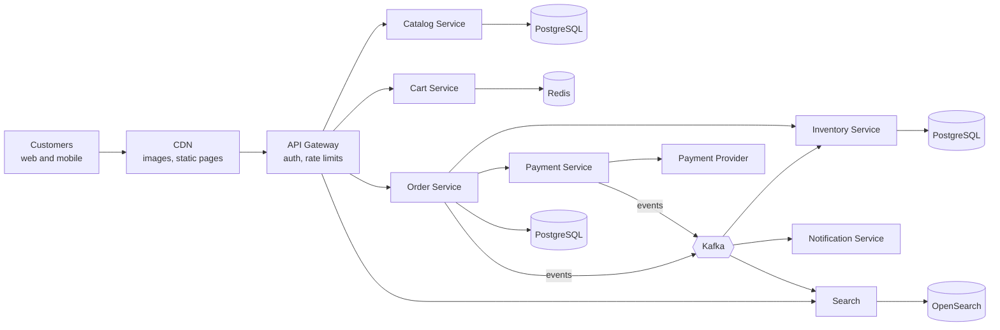
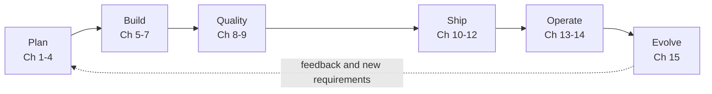

# Start Here — The ShopNorth Story

🛒 **The ShopNorth Journey** · Start Here

Every other topic on this site teaches one skill in depth. This journey shows how those skills fit together in a real project: you follow **one product**, an online store called **ShopNorth**, from the first meeting to a busy sale day in production. Each chapter is one stage of the software development lifecycle (SDLC), and each one links to the detailed tutorials for that stage.

## The Situation

You've just joined **ShopNorth** as a backend engineer. ShopNorth is a *fictional* Indian online store selling electronics and home & kitchen products. Until now it sold through marketplaces. The founders want their own website and app, and they've set a hard deadline: **the Diwali sale, 12 weeks from today**.

The team is small, which means everyone sees the whole lifecycle. That's lucky for you.

| Person | Role | What you'll see them do |
|--------|------|-------------------------|
| **Ananya** | Product Manager | Writes the product brief, prioritizes the backlog, decides what "done" means |
| **Priya** | Tech Lead | Owns the architecture, writes the ADRs, reviews the risky pull requests |
| **Arjun** | Backend Engineer | Builds the order and inventory services with you |
| **Rohan** | Frontend Engineer | Builds the React storefront and admin pages |
| **Meera** | QA / SDET | Designs the test strategy and automates the regression suite |
| **Kabir** | DevOps / SRE | Owns CI/CD, Kubernetes, Datadog, and the on-call rotation |
| **You** | Backend Engineer | Joins every stage — and builds your own mini ShopNorth alongside |

## What ShopNorth Will Look Like at the End

This is the system you'll have built by Chapter 14. Don't worry about the details yet; each box gets its own explanation later.

Around it sit the things that make it a *production* system: Auth0 for login, GitHub Actions for CI/CD, SonarQube and Coverity for code quality, Docker and Kubernetes for running it, and Datadog for knowing whether it's healthy.

## The Map — 15 Chapters, One SDLC

| Phase | Chapter | What happens to ShopNorth | Deep-dive topics |
|-------|---------|---------------------------|------------------|
| **Plan & Design** | [Ch 1 · Requirements & Planning](/tutorials/journey-01-requirements) | The idea becomes user stories, numbers, and a 12-week plan | How to Think in System Design, AI-SDLC |
| | [Ch 2 · System Design (HLD)](/tutorials/journey-02-system-design) | Services, data stores, caching, search, payments | System Design, Architecture Decisions |
| | [Ch 3 · Low-Level Design](/tutorials/journey-03-low-level-design) | Orders, carts, pricing, and reservations as Java classes | Low-Level Design, Java OOP |
| | [Ch 4 · Data Model & SQL](/tutorials/journey-04-data-sql) | PostgreSQL schema, indexes, migrations, reports | SQL |
| **Build** | [Ch 5 · Building with Spring Boot](/tutorials/journey-05-spring-boot) | The order service: API, transactions, idempotency | Spring Boot, Java |
| | [Ch 6 · Microservices & Events](/tutorials/journey-06-microservices) | A few services, Kafka, the checkout saga | Microservices |
| | [Ch 7 · Security & Login](/tutorials/journey-07-security) | Auth0, authorization, webhooks, secrets | Auth0, Security Decisions |
| **Quality** | [Ch 8 · Testing — Unit to Regression](/tutorials/journey-08-testing) | Unit, integration, contract, E2E, smoke, regression, load | — (covered in the chapter) |
| | [Ch 9 · Code Quality — SonarQube & Coverity](/tutorials/journey-09-code-quality) | Reviews, quality gates, static analysis, scanning | Java Coding Standards |
| **Ship** | [Ch 10 · Containerizing with Docker](/tutorials/journey-10-docker) | Images and a one-command local stack | Docker |
| | [Ch 11 · CI/CD Pipeline](/tutorials/journey-11-cicd) | Pull request to production, automatically and safely | Docker, Kubernetes in Production |
| | [Ch 12 · Deploying on Kubernetes](/tutorials/journey-12-kubernetes) | Deployments, probes, autoscaling, rollouts | Kubernetes |
| **Operate & Evolve** | [Ch 13 · Observability with Datadog](/tutorials/journey-13-observability) | Dashboards, monitors, SLOs, synthetic checks | Kubernetes in Production |
| | [Ch 14 · Launch Day & Incidents](/tutorials/journey-14-launch-day) | The Diwali sale, an incident, and the postmortem | Rate Limiting, Caching, Payments |
| | [Ch 15 · Evolving with AI](/tutorials/journey-15-ai) | AI search, a support assistant, AI across the SDLC | AI Engineering |

The dotted arrow matters. Real SDLC is a loop: what you learn in production (Chapters 13-15) becomes the next set of requirements.

## How to Use This Journey

**Three ways to read it — pick one:**

1. **Story only (about 6-8 hours).** Read the chapters in order. You'll understand how a real product is built, end to end. Great before interviews, when you need to explain the "big picture".
2. **Story + deep dives (4-6 weeks).** After each chapter, open the linked topic tutorials and do their practice assignments. This is the most complete path.
3. **Build along (6-10 weeks).** Every chapter ends with a *Mini Project* step. Together they build your own small ShopNorth: one service that grows from a domain model to a containerized, tested, monitored app on Kubernetes. You finish with a portfolio project you can talk about in interviews.

**How the site connects back to the story:** every topic tutorial on this site ends with an orange **🛒 ShopNorth Journey** box like the one at the top of this page. It tells you how ShopNorth uses that topic and which chapter to read next. The other examples in those tutorials (Netflix, Uber, payment gateways, and so on) are *extra case studies* — read them to see the same idea in different industries.

**Callout colors in this journey:** 🟧 **orange** = the main ShopNorth story and where to go next · 🟪 purple = a real-world scenario (often something going wrong) · 🟩 green = a practical tip · 🟨 yellow = a warning · 🟥 red = an interview question.

## Why a Story Instead of Separate Topics?

Interviewers rarely ask "what is Kafka?". They ask "walk me through how you'd build and ship an order system" — and then they dig into whichever part you mention. Engineers who've only learned topics in isolation struggle to connect them: *why* does the database design affect the API? *Where* do smoke tests run? *Who* sees a Datadog alert at 2 AM, and what do they do?

ShopNorth gives you one consistent example for all of it. By the end you'll be able to tell a complete, honest story: requirements → design → code → tests → quality gates → containers → pipeline → Kubernetes → monitoring → incidents → improvements.

**Scenario**: In a senior backend interview, the candidate is asked "Tell me about the lifecycle of a feature from idea to production in your team." One candidate lists tools: "Jira, Git, Jenkins, Docker, Kubernetes." Another walks through a concrete feature: how the requirement was clarified, which non-functional requirement drove the design, which tests caught which bug, what the pipeline's quality gate blocked, how the canary release protected users, and what the dashboards showed after launch. **Decision**: The second answer wins because it shows *judgment at each stage*, not tool names. The ShopNorth journey trains exactly that answer.

## 🏋️ Practice Assignments

### 🟢 Low — Build the reflexes

**L1.** Put these SDLC activities in order: deploy to staging, write user stories, code review, design the database, production canary release, smoke test, unit tests, load test before a big sale.

Show answer

Write user stories → design the database → unit tests (written alongside the code) → code review → deploy to staging → smoke test → load test before the sale → production canary release. In practice, several of these overlap and repeat every sprint, but the dependency order holds: you can't smoke-test something that hasn't been deployed, and you shouldn't design a database before you know the requirements.

**L2.** Name one thing that can go wrong if each phase is skipped: (a) requirements, (b) testing, (c) observability.

Show answer

(a) The team builds the wrong thing, or the right thing for the wrong scale (a store that can't survive its first sale). (b) Bugs reach customers, such as charging twice for one order. (c) The store is down or slow and nobody knows until customers complain on social media.

### 🟡 Medium — Apply it

**M1.** ShopNorth has 12 weeks and 6 people. Which SDLC model fits — waterfall or iterative (Scrum/Kanban)? Justify it.

Show answer

Iterative, with 2-week sprints. The scope will change as the team learns (payment provider details, real traffic patterns), and the founders need to see working software early to make decisions. Some things still need up-front thinking: the core architecture and data model are expensive to change, so Chapter 2 and 4 happen early. A good answer mixes both: plan the hard-to-reverse decisions up front, iterate on everything else.

**M2.** Which roles from the ShopNorth team would you involve in deciding "what happens if the payment provider is down during the sale"? Why each?

Show answer

Ananya (product: is a delayed order confirmation acceptable to customers?), Priya (architecture: fallback provider, retries, order states), Arjun/you (implementation: idempotency, timeouts), Meera (how to test the failure path), Kabir (how to detect it, alert, and run the runbook). Failure handling is a cross-role decision — that's why it shows up in requirements, design, testing, and operations chapters.

### 🔴 High — Think like a senior

**H1.** A founder asks: "Why do we need staging, quality gates, and canary releases? Can't we just deploy to production carefully?" Answer in a way a non-engineer understands.

Show answer

Each step catches a different kind of mistake at the cheapest point. Quality gates catch code problems in minutes, before anyone else is affected. Staging catches integration problems (wrong configuration, a broken dependency) without real customers. A canary release exposes a new version to a small slice of real traffic, so if something slipped through, 5% of customers see it for five minutes instead of 100% for an hour. "Careful" doesn't scale when the team ships many times a week; automated safety nets do. The cost is some pipeline time; the saving is avoiding a broken checkout during the Diwali sale.

**H2.** You join a team with no tests, manual deployments, and no monitoring. You can fix one SDLC stage this month. Which one, and why?

Show answer

Usually **observability** first: you can't improve what you can't see, and it shortens every incident immediately (detect, diagnose, confirm the fix). Then a minimal **automated pipeline with smoke tests**, because manual deployments are a frequent source of outages. Then grow **tests** around the riskiest flows (checkout, payments). The reasoning matters more than the exact order: start where the biggest current risk to customers is, and pick changes that make the next improvements easier.

## 🛠️ Mini Project — Build ShopNorth, Step 0: Set Up Your Build-Along Repo

**Goal**: A home for the small ShopNorth you'll build across the journey. 1 evening.

**Build**

1. Create a GitHub repository `mini-shopnorth` with a `README.md` describing the product in 5 lines (what it sells, who uses it, the "Diwali sale in 12 weeks" deadline).
2. Add a `docs/` folder with three empty files you'll fill in later: `requirements.md` (Ch 1), `architecture.md` (Ch 2), `decisions.md` (ADRs).
3. Create a GitHub Project board with columns *Backlog → Ready → In Progress → In Review → Done*.
4. Add one issue per chapter (15 issues) and link them to the board.
5. Write down in the README which reading path you chose (story only, story + deep dives, or build along) and your weekly time budget.

**Acceptance criteria**: a public or private repo with the README, the `docs/` skeleton, and a board with 15 issues — your journey tracker.

## 🎯 Interview Corner

**Q: "Walk me through the lifecycle of a feature in your team, from idea to production."**

I'd use a concrete feature, for example checkout for an online store. It starts with requirements: a user story with acceptance criteria, plus the non-functional targets, such as handling 150 orders per second at the sale peak. Then design: the API, the data model, and decisions like reserving inventory before payment. During build, I write unit tests alongside the code, and integration tests use real dependencies in containers. A pull request runs the pipeline: tests, coverage, a SonarQube quality gate, and security scans, followed by code review. After merge, the same image goes to staging, where smoke and regression suites run, then to production as a canary watched by dashboards and SLO monitors. After launch, we look at metrics and incidents, and those findings become the next requirements.

**Q: "What is the SDLC, and which model have you worked with?"**

The SDLC is the set of stages software goes through: requirements, design, implementation, testing, deployment, and operations and maintenance. Models differ in how these stages repeat. Waterfall runs each stage once for the whole project; iterative models like Scrum run all stages in small slices every sprint, so working software ships early and feedback shapes the next slice. Most teams I've seen use Scrum or Kanban with continuous delivery, and still do up-front design for decisions that are expensive to reverse, like the data model.

**Q: "How do you decide what goes into an MVP when the deadline is fixed?"**

Start from the outcome the deadline is for. For a store launching before a big sale, that's "customers can find a product, pay, and get it". Everything on that path is in scope and must be reliable. Things that improve the experience but aren't on the path, like wishlists, reviews, and recommendations, go after launch. I also keep non-functional must-haves in the MVP, because a checkout that fails under sale traffic is worse than no wishlist. Then I make the trade-offs visible to product owners, so cutting scope is a shared decision rather than a surprise.

> **Golden rule: tools change every few years; the lifecycle doesn't. Learn each stage by asking what it protects the customer from.**

➡️ **Next: [Chapter 1 · Requirements & Planning](/tutorials/journey-01-requirements)** — Ananya hands you the product brief. Before anyone writes code, you'll turn "we want an online store" into user stories, numbers, and a plan.

