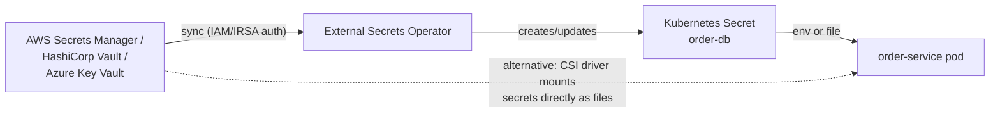
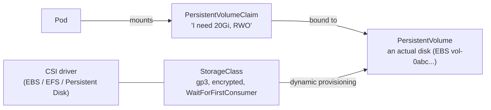

# Config, Secrets & Storage — Keeping Images Generic and Data Safe

<!-- sdlc-stage:start -->
<div class="sdlc-stage">

📍 **SDLC stage: Deployment — infrastructure & runtime** · ShopNorth uses this in [Chapter 12 · Deploying on Kubernetes](/tutorials/journey-12-kubernetes)

</div>
<!-- sdlc-stage:end -->

> **Kubernetes · Networking & Config** — One image, many environments: configuration must come from outside the container. And pods are disposable, so anything worth keeping must live somewhere a pod restart can't erase it.

---

## Table of Contents

1. The Hotel Room Analogy
2. The 12-Factor Rule: Config Outside the Image
3. ConfigMaps — Env Vars and Files
4. Secrets — And Why They Aren't Secret by Default
5. External Secret Managers (Vault, AWS Secrets Manager)
6. Volumes — Ephemeral vs Persistent
7. PersistentVolumes, Claims & StorageClasses
8. Stateful Data: Backups, Snapshots, and "Should This Even Be in the Cluster?"
9. Practice Assignments (Low / Medium / High)
10. Mini Project — Config-Driven Service with Secrets from a Manager and Persistent Uploads
11. Interview Corner
12. Quick Reference

---

## 1. The Hotel Room Analogy

Every room in a hotel chain is built from the same blueprint (the **image**). What changes per guest:

- The **welcome card** on the desk with the Wi-Fi name and checkout time — printed per hotel. → **ConfigMap**
- The **key card and safe code** — handed over privately, never printed on the welcome card. → **Secret**
- The **minibar and bathroom supplies** — refreshed every stay; nobody expects them to persist. → **ephemeral volume** (`emptyDir`)
- Your **luggage in the hotel storage room** — survives changing rooms, tagged with your name. → **PersistentVolumeClaim**

If a hotel printed Wi-Fi passwords into the blueprint, every hotel would share them and you'd need a new blueprint to change them. That's what baking config into images does.

---

## 2. The 12-Factor Rule: Config Outside the Image

> "Store config in the environment." — The Twelve-Factor App

| In the image | Outside the image |
|--------------|-------------------|
| Code, dependencies, default config (`application.yml` with safe defaults) | Environment-specific values: URLs, feature flags, log levels, pool sizes |
| Nothing secret, ever | Credentials: DB passwords, API keys, TLS private keys |

The payoff: **the exact artifact tested in QA is the one that runs in production** — only its configuration differs.

---

## 3. ConfigMaps — Env Vars and Files

```yaml
apiVersion: v1
kind: ConfigMap
metadata:
  name: order-service-config
data:
  SPRING_PROFILES_ACTIVE: "prod"
  PAYMENT_GATEWAY_BASE_URL: "https://api.gateway.example"
  application-k8s.yml: |              # a whole file as one key
    server:
      shutdown: graceful
    order:
      max-items-per-order: 50
```

### Three ways to consume it

```yaml
spec:
  containers:
    - name: app
      image: ghcr.io/shop/order-service:1.5
      # 1. Every key as an env var
      envFrom:
        - configMapRef: { name: order-service-config }
      # 2. One specific key as an env var
      env:
        - name: MAX_ITEMS
          valueFrom:
            configMapKeyRef: { name: order-service-config, key: max-items }
      # 3. Keys as files in a directory
      volumeMounts:
        - name: config
          mountPath: /config
          readOnly: true
  volumes:
    - name: config
      configMap:
        name: order-service-config
        items:
          - { key: application-k8s.yml, path: application-k8s.yml }
```

Spring Boot picks up the file with `SPRING_CONFIG_ADDITIONAL_LOCATION=/config/` (or `spring.config.import=optional:file:/config/`).

| Consumption | Updates when the ConfigMap changes? |
|-------------|-------------------------------------|
| Env vars (`env`, `envFrom`) | ❌ Only at container start |
| Mounted volume (whole ConfigMap) | ✅ Files update eventually (kubelet sync, ~up to a minute) — but your app must re-read them |
| Mounted with `subPath` | ❌ Never updates |

<div class="callout-tip">

**Applying this** — Prefer **restart-on-change** over hot reload: add a hash of the config to the pod template annotations (Helm: `checksum/config: {{ include (print $.Template.BasePath "/configmap.yaml") . | sha256sum }}`), so every config change triggers a normal rolling update with readiness checks. Hot reload means a bad config can hit every pod at the same moment, with no rollout to stop it.

</div>

<div class="callout-info">

**Limits**: a ConfigMap is capped at **1 MiB** (it lives in etcd). Not for large files or data. Mark stable configs `immutable: true` — it protects against accidental edits and reduces API server watch load in big clusters.

</div>

---

## 4. Secrets — And Why They Aren't Secret by Default

```yaml
apiVersion: v1
kind: Secret
metadata:
  name: order-db
type: Opaque
stringData:                        # plain input; stored base64-encoded in .data
  username: orders_app
  password: "s3cr3t-Pa55"
```

```yaml
env:
  - name: SPRING_DATASOURCE_PASSWORD
    valueFrom:
      secretKeyRef: { name: order-db, key: password }
```

### The uncomfortable truth

| Myth | Reality |
|------|---------|
| "Secrets are encrypted" | Values are **base64-encoded** — `echo czNjcjN0 \| base64 -d`. Anyone who can `get secrets` in the namespace can read them. |
| "etcd protects them" | Stored in etcd **unencrypted by default**, unless encryption at rest is configured (managed clusters usually offer KMS envelope encryption — turn it on). |
| "It's fine to commit the YAML" | A Secret manifest in Git is a leaked credential. |

### Hardening checklist

1. **Encryption at rest** for Secrets (EKS: KMS envelope encryption; GKE/AKS equivalents).
2. **RBAC**: very few people/service accounts can `get`/`list` Secrets; `list` on secrets in a namespace = read all of them.
3. **Mount as files** rather than env vars where practical — env vars leak into crash dumps, `/proc`, debug endpoints (`/actuator/env` — sanitize it!), and child processes.
4. **Never in Git** in plain form — use an external manager (next section) or encrypted-in-Git tooling (Sealed Secrets, SOPS).
5. **Rotate**: design apps to pick up rotated credentials (restart via rollout, or short-lived dynamic credentials).

<div class="callout-warn">

**`kubectl get secret -o yaml` in a screen-share or a support ticket leaks the secret.** Base64 is an encoding, not encryption. Treat Secret YAML exactly like the plaintext password.

</div>

---

## 5. External Secret Managers (Vault, AWS Secrets Manager)

The industry pattern: the **source of truth** is a secret manager; Kubernetes gets a synchronized copy (or the app fetches directly).



```yaml
apiVersion: external-secrets.io/v1
kind: ExternalSecret
metadata:
  name: order-db
spec:
  refreshInterval: 1h
  secretStoreRef: { name: aws-secrets-manager, kind: ClusterSecretStore }
  target:
    name: order-db                      # the Kubernetes Secret to create
  data:
    - secretKey: password
      remoteRef: { key: prod/order-service/db, property: password }
```

| Option | How | Good for |
|--------|-----|----------|
| **External Secrets Operator** | Syncs manager → K8s Secret | Most teams; apps stay unaware |
| **Secrets Store CSI Driver** | Mounts secrets as files directly from the manager | Avoiding K8s Secret objects entirely |
| **Vault Agent sidecar / dynamic secrets** | Short-lived DB credentials generated per pod | High-security environments |
| **Sealed Secrets / SOPS** | Encrypted secrets stored in Git, decrypted in-cluster | GitOps without an external manager |
| **App reads the manager directly** (Spring Cloud AWS / Vault) | `spring.config.import=aws-secretsmanager:...` | Spring-heavy stacks |

<div class="callout-scenario">

**Scenario**: Security requires DB passwords to rotate every 30 days with no downtime. **Decision**: Store the credential in AWS Secrets Manager with its rotation Lambda (which uses the **alternating-users** strategy, so the old credential stays valid while the new one rolls out). External Secrets Operator syncs the new value; a config-hash annotation (or Reloader) triggers a rolling restart, so pods move to the new password gradually. Better still: IAM database authentication or Vault dynamic credentials, where short-lived credentials make rotation continuous.

</div>

---

## 6. Volumes — Ephemeral vs Persistent

| Volume type | Lifetime | Use |
|-------------|----------|-----|
| `emptyDir` | Pod's lifetime (survives container restarts, not pod deletion) | Scratch space, sharing files between containers in a pod, caches. `medium: Memory` = tmpfs |
| `configMap` / `secret` / `projected` | Pod's lifetime, content from the API | Config and credentials as files |
| `hostPath` | The node's disk | Node agents (DaemonSets) only — dangerous for apps (security + pod tied to node) |
| **`persistentVolumeClaim`** | **Independent of the pod** | Databases, uploads, anything that must survive |
| Ephemeral CSI / generic ephemeral volumes | Pod's lifetime, but provisioned storage | Large scratch space with a storage class |

```yaml
volumes:
  - name: tmp
    emptyDir: { sizeLimit: 1Gi }     # bound it, or a runaway process fills the node disk
```

<div class="callout-tip">

**Applying this** — With `readOnlyRootFilesystem: true` (a security best practice), Spring Boot still needs a writable `/tmp` for Tomcat's work dir and multipart uploads. Mount an `emptyDir` at `/tmp` with a `sizeLimit`.

</div>

---

## 7. PersistentVolumes, Claims & StorageClasses



- **PVC** — the app's *request*: size, access mode, storage class. Namespaced.
- **PV** — the actual piece of storage. Cluster-scoped. Usually created **dynamically** by the CSI driver when a PVC appears.
- **StorageClass** — the *type* of storage and its provisioning policy.

```yaml
apiVersion: storage.k8s.io/v1
kind: StorageClass
metadata:
  name: gp3-encrypted
provisioner: ebs.csi.aws.com
parameters:
  type: gp3
  encrypted: "true"
reclaimPolicy: Retain                       # keep the disk if the PVC is deleted
volumeBindingMode: WaitForFirstConsumer     # create the disk in the zone where the pod lands
allowVolumeExpansion: true
---
apiVersion: v1
kind: PersistentVolumeClaim
metadata:
  name: uploads
spec:
  accessModes: [ReadWriteOnce]
  storageClassName: gp3-encrypted
  resources:
    requests: { storage: 20Gi }
```

### Access modes

| Mode | Meaning | Typical backend |
|------|---------|-----------------|
| `ReadWriteOnce` (RWO) | Mounted read-write by **one node** | Block storage: EBS, Persistent Disk, Azure Disk |
| `ReadWriteOncePod` | Exactly one **pod** | Same, stricter |
| `ReadOnlyMany` (ROX) | Many nodes, read-only | Shared datasets |
| `ReadWriteMany` (RWX) | Many nodes read-write | File storage: EFS, Filestore, Azure Files, NFS |

<div class="callout-warn">

**RWO + a Deployment with several replicas = trouble.** Only pods on the one node that attached the disk can mount it; others stay `ContainerCreating` with "Multi-Attach error". And during a rolling update, the new pod on another node can't attach until the old pod releases it. For shared files use RWX (EFS) — or better, **object storage (S3)** accessed through the API; for per-replica disks use a StatefulSet.

</div>

### Reclaim policies

| Policy | When the PVC is deleted |
|--------|-------------------------|
| `Delete` (default for most dynamic classes) | The disk is **deleted** — data gone |
| `Retain` | The disk stays; an admin must clean up or re-bind it |

---

## 8. Stateful Data: Backups, Snapshots, and "Should This Even Be in the Cluster?"

| Question | Guidance |
|----------|----------|
| User uploads, images, reports | **Object storage (S3/GCS)**, not volumes: durable, cheap, accessible from every replica, no attach limits |
| Relational DB for production | **Managed service** (RDS/Aurora, Cloud SQL) unless you have strong reasons + an operator (CloudNativePG) |
| Caches (Redis) | In-cluster is common (it's rebuildable); managed (ElastiCache) for production-critical |
| Kafka | Operator (Strimzi) or managed (MSK, Confluent) |
| Anything on a PV | **VolumeSnapshots** (CSI) on a schedule + **Velero** for cluster-level backup/restore, and *tested* restores |

<div class="callout-scenario">

**Scenario**: A team runs PostgreSQL as a single-replica StatefulSet with a `Delete` reclaim policy. During a cleanup, someone runs `helm uninstall` on the release. **Answer**: The StatefulSet is removed; depending on the chart and the PVC retention policy, the PVC and — with `Delete` — the underlying disk may be deleted too: total data loss. Prevention: `reclaimPolicy: Retain` for important data, `persistentVolumeClaimRetentionPolicy` on StatefulSets, scheduled snapshots, RBAC limiting who can uninstall in production, deletion protection — and for production databases, a managed service with point-in-time recovery.

</div>

---

## 9. 🏋️ Practice Assignments

### 🟢 Low — Build the reflexes

**L1.** Decode this Secret value: `cGF5bWVudHMtcHJvZA==`. What does that tell you about Secret security?

<details>
<summary>Show answer</summary>

`echo cGF5bWVudHMtcHJvZA== | base64 -d` → `payments-prod`. Base64 is an encoding, not encryption; protection comes from RBAC, encryption at rest in etcd, and keeping secrets out of Git.

</details>

**L2.** You changed a ConfigMap consumed via `envFrom`. Pods still show old values. Why, and what's the cleanest fix?

<details>
<summary>Show answer</summary>

Env vars are resolved only when a container starts. Cleanest fix: a config checksum annotation on the pod template (so config changes trigger a rolling update), or `kubectl rollout restart deployment/<name>` as a manual step.

</details>

**L3.** Which access mode and backend for: (a) a Postgres data directory, (b) a shared folder of ML models read by 20 pods on different nodes, (c) user profile pictures?

<details>
<summary>Show answer</summary>

(a) `ReadWriteOnce` (or `ReadWriteOncePod`) block storage like EBS gp3, one PVC per instance via a StatefulSet — or a managed DB. (b) `ReadOnlyMany`/`ReadWriteMany` file storage (EFS), or bake the models into an image / download from S3 at startup. (c) Object storage (S3) — not a volume at all.

</details>

### 🟡 Medium — Apply it

**M1.** Configure a Spring Boot pod so that (a) non-secret settings come from a ConfigMap file `application-k8s.yml`, (b) the DB password comes from a Secret mounted as a file, and (c) the root filesystem is read-only.

<details>
<summary>Show answer</summary>

```yaml
spec:
  securityContext: { runAsNonRoot: true }
  containers:
    - name: app
      image: ghcr.io/shop/order-service:1.5
      env:
        - name: SPRING_CONFIG_ADDITIONAL_LOCATION
          value: /config/
        - name: SPRING_CONFIG_IMPORT
          value: "optional:configtree:/secrets/"     # each file becomes a property
      securityContext:
        readOnlyRootFilesystem: true
        allowPrivilegeEscalation: false
      volumeMounts:
        - { name: config,  mountPath: /config,  readOnly: true }
        - { name: secrets, mountPath: /secrets, readOnly: true }
        - { name: tmp,     mountPath: /tmp }
  volumes:
    - name: config
      configMap: { name: order-service-config }
    - name: secrets
      secret:
        secretName: order-db
        items: [{ key: password, path: spring.datasource.password }]
    - name: tmp
      emptyDir: { sizeLimit: 512Mi }
```

Spring Boot's `configtree:` import turns each file name into a property name and its content into the value — so the password never appears in env vars.

</details>

**M2.** A Deployment with 3 replicas mounts one RWO PVC for uploads. Two pods are stuck `ContainerCreating`. Diagnose and redesign.

<details>
<summary>Show answer</summary>

RWO block volumes attach to one node; pods on other nodes hit "Multi-Attach error for volume". Redesign: store uploads in **S3** (presigned URLs let clients upload directly, reducing load on the service), or use RWX file storage (EFS) if a POSIX filesystem is truly needed. A single-writer design (one replica) would kill availability and break rolling updates.

</details>

**M3.** Write an `ExternalSecret` that syncs `prod/payments/stripe` (JSON with keys `apiKey` and `webhookSecret`) into a Kubernetes Secret `stripe`, refreshing every 15 minutes.

<details>
<summary>Show answer</summary>

```yaml
apiVersion: external-secrets.io/v1
kind: ExternalSecret
metadata: { name: stripe, namespace: payments }
spec:
  refreshInterval: 15m
  secretStoreRef: { name: aws-secrets-manager, kind: ClusterSecretStore }
  target: { name: stripe }
  data:
    - secretKey: apiKey
      remoteRef: { key: prod/payments/stripe, property: apiKey }
    - secretKey: webhookSecret
      remoteRef: { key: prod/payments/stripe, property: webhookSecret }
```

The operator authenticates to AWS through IRSA / EKS Pod Identity (an IAM role bound to its service account), scoped to `prod/payments/*` only.

</details>

### 🔴 High — Think like a senior

**H1.** Design secrets management for 60 services across dev/staging/prod clusters, with GitOps deployments, auditability, and 30-day rotation.

<details>
<summary>Show answer</summary>

- **Source of truth**: a secret manager (AWS Secrets Manager or Vault), paths by `env/service/secret`; IAM policies per service; CloudTrail/Vault audit logs.
- **Delivery**: External Secrets Operator per cluster with a `ClusterSecretStore` per environment; each service's Helm chart includes `ExternalSecret` manifests (safe to commit — they contain references, not values). Git holds no secret values.
- **Workload identity**: IRSA / EKS Pod Identity so each service can read only its own paths (or ESO reads on its behalf with namespace-scoped stores).
- **Rotation**: manager-native rotation (alternating users for DBs); the sync plus a checksum/Reloader-triggered rolling restart; alerts when a rotation fails. Move DBs to IAM auth or dynamic credentials where possible.
- **Cluster hardening**: KMS encryption at rest for Secrets; RBAC denying `get/list secrets` to humans in prod (break-glass only); `/actuator/env` sanitized; secret scanning in CI.
- **Developer experience**: a paved-road chart template and a CLI/runbook for requesting a new secret path.

</details>

**H2.** Your team wants to run a critical PostgreSQL database on Kubernetes to "save money versus RDS". Write the risk assessment.

<details>
<summary>Show answer</summary>

What you must now own: HA and failover (streaming replication, leader election), backups with point-in-time recovery (WAL archiving to S3) **and** restore drills, minor/major version upgrades, storage performance tuning (IOPS, fsync behavior), zonal volume constraints during node failures, monitoring (replication lag, bloat, vacuum), security patching, and on-call expertise. Tooling: CloudNativePG or Crunchy PGO make this feasible, but the team needs Postgres + Kubernetes operational depth. Cost comparison must include engineer time and incident risk, not just instance prices; RDS/Aurora includes automated backups, PITR, Multi-AZ failover, and patching. Recommendation pattern: managed service for critical OLTP; in-cluster Postgres with an operator for dev/test environments, ephemeral preview environments, or when data-residency/portability constraints demand it — with documented RPO/RTO and tested restores.

</details>

---

## 10. 🛠️ Mini Project — Config-Driven Service with Secrets and Persistent Uploads

**Goal**: One Spring Boot service configured the production way, on kind. 2 evenings.

**Build**

1. A service with `GET /api/config` (shows non-secret config), `POST /api/files` (stores an uploaded file), and `GET /api/files/{name}`.
2. Non-secret config from a ConfigMap file (`application-k8s.yml`), with a config checksum annotation; change a value and watch a rolling update apply it.
3. A DB password (and an API key) from a Secret, mounted as files and read via Spring's `configtree:` import. Verify with `kubectl exec ... env` that the secret is **not** in env vars.
4. Run **MinIO** (S3-compatible) in the cluster as a StatefulSet with a PVC; store uploads there via the AWS SDK (S3 API). Delete the MinIO pod and prove the files survive.
5. Security: `readOnlyRootFilesystem: true`, `runAsNonRoot`, `emptyDir` for `/tmp` with a size limit.
6. Stretch: install the External Secrets Operator with its fake/`kubernetes` provider (or Vault dev mode) and sync the Secret from there instead of applying it by hand.

**Acceptance criteria**

- No secret values in Git (use a `.gitignore`d `secrets.local.yaml` or the operator).
- Deleting and recreating the app pods doesn't lose any uploaded files.
- A README that explains every config source and its precedence.

---

## 🎯 Interview Corner

<div class="callout-interview">

**Q: "How do you manage configuration and secrets for a Spring Boot app on Kubernetes?"**

The image is identical across environments. Non-secret configuration comes from ConfigMaps, either as env vars or as a mounted `application-k8s.yml`, and I add a checksum annotation so a config change triggers a normal rolling update. Secrets don't live in Git. The source of truth is a secret manager like AWS Secrets Manager or Vault, synced into Kubernetes Secrets by the External Secrets Operator, authenticated with workload identity. I mount secrets as files and read them with Spring's `configtree` import rather than env vars, which leak more easily. On the cluster side: encryption at rest for Secrets, tight RBAC on who can read them, and rotation that rolls pods gradually.

**Follow-up trap**: "Aren't Kubernetes Secrets encrypted?" → Only base64-encoded by default, which is not encryption. Encryption at rest in etcd has to be enabled, and anyone with read access to Secrets in a namespace can decode them.

</div>

<div class="callout-interview">

**Q: "Explain PV, PVC, and StorageClass."**

A PersistentVolumeClaim is the application's request for storage: size, access mode, and class. A PersistentVolume is the actual storage resource, like an EBS volume. A StorageClass describes a type of storage and how to provision it. With dynamic provisioning, creating a PVC makes the CSI driver create a matching PV automatically. The claim binds to the volume, and the pod mounts the claim, so storage outlives any individual pod. The details that bite in production: RWO block volumes attach to a single node and are zonal, so use `WaitForFirstConsumer`. The reclaim policy decides whether deleting the claim deletes the data. And shared files usually belong in object storage, not volumes.

</div>

<div class="callout-interview">

**Q: "Where should an application's uploaded files live when it runs on Kubernetes?"**

In object storage like S3, not on the pod's filesystem or a volume. Pods are ephemeral and replicas run on different nodes, so local disk loses data and doesn't scale. Block volumes attach to one node, which breaks multi-replica deployments and rolling updates, and shared file systems like EFS work but cost more and are slower. With S3 every replica can read and write, durability is built in, lifecycle rules handle cleanup, and presigned URLs let clients upload directly without streaming through the service. The service stores only metadata and object keys in its database.

</div>

---

## Quick Reference

| Concept | One-Liner |
|---------|-----------|
| 12-factor config | Same image everywhere; config from the environment |
| ConfigMap | Non-secret key/values or files; ≤ 1 MiB |
| Env vs file | Env read at start only; mounted files update (not with `subPath`) |
| Roll on change | Checksum annotation → rolling update |
| Secret | Base64, **not** encrypted by default — enable KMS encryption, restrict RBAC |
| Secret delivery | External Secrets Operator / CSI driver from a manager; never plaintext in Git |
| Spring | `configtree:` for secret files; `/actuator/env` sanitized |
| emptyDir | Scratch space for the pod's lifetime; set `sizeLimit` |
| PVC → PV ← StorageClass | Request → disk ← how disks are made |
| RWO vs RWX | One node (EBS) vs many nodes (EFS) |
| Reclaim | `Delete` destroys data with the PVC; `Retain` keeps it |
| Uploads | Object storage, not volumes |
| Databases | Managed service first; operator if in-cluster |

---

## Related Topics

- `k8s-workloads` — StatefulSets and per-pod volumes
- `k8s-spring-boot` — wiring all of this into a Spring deployment
- `auth-security-decisions` — broader secrets and identity choices
- `docker-spring-boot` — externalized config at the container level

> **Config changes per environment, secrets change per rotation, data outlives everything. Give each its own home — and never let a container image carry any of the three.**

---

<!-- journey-link:start -->

<div class="callout-journey">

🛒 **ShopNorth Journey** — ShopNorth keeps settings in ConfigMaps and pulls secrets from AWS Secrets Manager with the External Secrets Operator.

**Continue the story:** [Chapter 12 · Deploying on Kubernetes](/tutorials/journey-12-kubernetes) · **New here?** [Start the journey](/tutorials/journey-start)

</div>

<!-- journey-link:end -->
