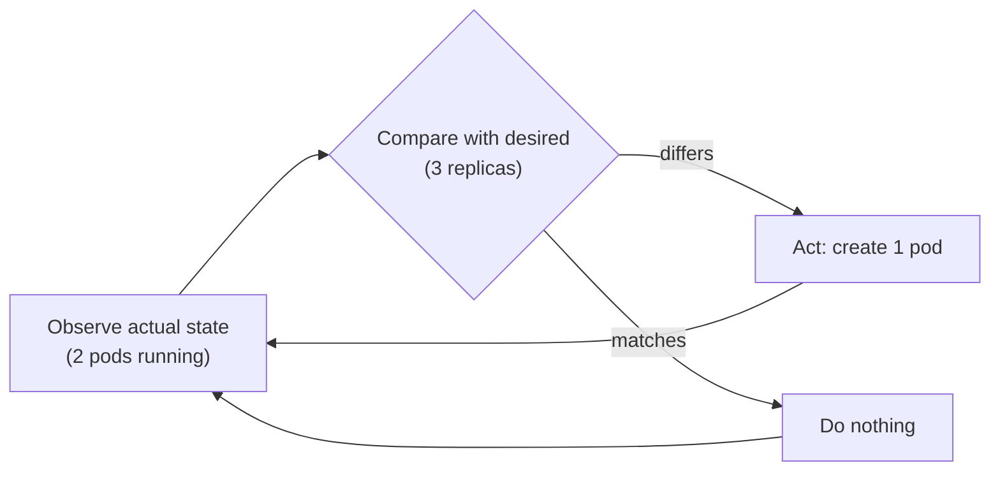
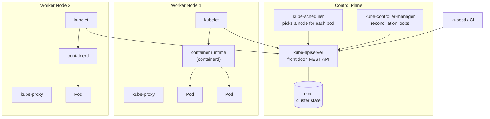
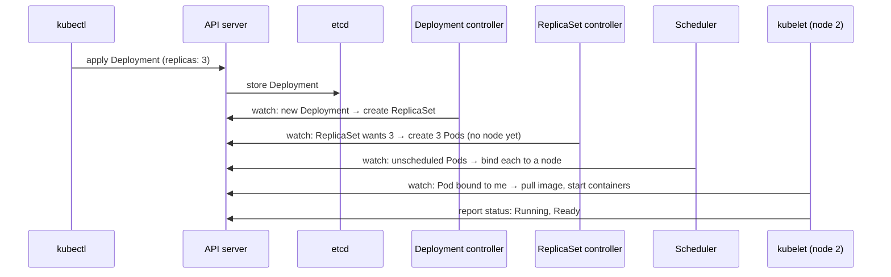

# Kubernetes Fundamentals — From "I Run Containers" to "The Cluster Runs Them for Me"

<!-- sdlc-stage:start -->
<div class="sdlc-stage">

📍 **SDLC stage: Deployment — infrastructure & runtime** · ShopNorth uses this in [Chapter 12 · Deploying on Kubernetes](/tutorials/journey-12-kubernetes)

</div>
<!-- sdlc-stage:end -->

> **Kubernetes · Fundamentals** — Builds directly on the Docker tutorials. You know how to build and run one container; this page explains how Kubernetes runs hundreds of them, keeps them alive, and why its whole design revolves around one idea: *desired state*.

---

## Table of Contents

1. The Shipping Port Analogy
2. Why Kubernetes Exists — What Docker Alone Doesn't Solve
3. The Big Idea — Declarative Desired State & Reconciliation
4. Cluster Architecture — Control Plane vs Worker Nodes
5. Pods — The Smallest Deployable Unit
6. Labels, Selectors & Namespaces
7. kubectl — The Commands You'll Use Daily
8. Your First Cluster (kind) — Hands-On
9. When NOT to Use Kubernetes
10. Practice Assignments (Low / Medium / High)
11. Mini Project — Break It and Watch It Heal
12. Interview Corner
13. Quick Reference

---

## 1. The Shipping Port Analogy

A container ship arrives with 5,000 containers. The port doesn't care what's *inside* each one — that's the point of standard containers.

- The **port authority office** (the **control plane**) keeps a ledger: "Container #4512 must be on truck 7 by 3 PM." It never lifts anything itself.
- **Cranes and trucks** (the **worker nodes**) do the actual moving.
- A **dock supervisor** at each berth (the **kubelet**) checks the ledger and makes sure its berth matches it.
- If a truck breaks down, the office doesn't panic: the ledger still says "container #4512 on a truck by 3 PM", so a supervisor notices the mismatch and loads it onto another truck.

That last point is Kubernetes in one sentence: **you write down what you want; the system keeps making reality match it, forever.**

---

## 2. Why Kubernetes Exists — What Docker Alone Doesn't Solve

With Docker you can run `docker run order-service:1.4` on a server. Now scale that to production:

| Problem | Docker alone | Kubernetes |
|---------|--------------|------------|
| A container crashes at 3 AM | Stays down (unless you configured a restart policy on that one host) | Restarted automatically; rescheduled if the whole node dies |
| Run 10 copies across 5 servers | You pick servers manually | Scheduler places them based on free CPU/memory |
| Deploy v1.5 without downtime | Custom scripts | Rolling update built in, with rollback |
| Other services find this one | Hard-coded IPs | Stable Service name + DNS |
| Traffic spike | Manually start more | Horizontal Pod Autoscaler |
| Config & secrets per environment | Env files on each host | ConfigMaps & Secrets |
| A server needs patching | Manually move workloads | `kubectl drain node` moves them safely |

<div class="callout-info">

**Kubernetes (K8s)** — "K", 8 letters, "s". Open-sourced by Google in 2014, based on lessons from its internal Borg system; now a CNCF project. Managed offerings: **Amazon EKS**, **Google GKE**, **Azure AKS**. Locally: **kind**, **minikube**, **k3d**, Docker Desktop.

</div>

---

## 3. The Big Idea — Declarative Desired State & Reconciliation

### Imperative vs declarative

```bash
# Imperative: HOW to do it, step by step
docker run -d order-service:1.4
docker run -d order-service:1.4
docker run -d order-service:1.4      # and if one dies... you notice and run it again

# Declarative: WHAT you want; Kubernetes figures out the steps
kubectl apply -f order-service.yaml   # "3 replicas of order-service:1.4 should exist"
```

```yaml
apiVersion: apps/v1
kind: Deployment
metadata:
  name: order-service
spec:
  replicas: 3                     # desired state
  selector:
    matchLabels: { app: order-service }
  template:
    metadata:
      labels: { app: order-service }
    spec:
      containers:
        - name: app
          image: ghcr.io/shop/order-service:1.4
          ports:
            - containerPort: 8080
```

### The reconciliation loop

Every Kubernetes controller runs the same loop, forever:



<div class="callout-interview">

**Q: "What does 'declarative' mean in Kubernetes?"**

You submit the desired state of an object — say, a Deployment with 3 replicas of an image — to the API server, which stores it in etcd. Controllers continuously compare the actual state of the cluster with that desired state and take actions to close the gap. You never say "start a container"; you say "3 should exist", and the system self-heals toward that, whether a pod crashes, a node dies, or someone deletes a pod by hand.

</div>

---

## 4. Cluster Architecture — Control Plane vs Worker Nodes



| Component | Where | Job |
|-----------|-------|-----|
| **kube-apiserver** | Control plane | The only component that talks to etcd. Everything (kubectl, kubelets, controllers) goes through its REST API. Handles authn, authz (RBAC), admission. |
| **etcd** | Control plane | Distributed key-value store (Raft consensus) holding all cluster state. **Back it up.** |
| **kube-scheduler** | Control plane | Assigns unscheduled pods to nodes based on resource requests, affinity, taints/tolerations. |
| **kube-controller-manager** | Control plane | Runs controllers: Deployment, ReplicaSet, Node, Job, EndpointSlice... |
| **cloud-controller-manager** | Control plane | Talks to the cloud: creates load balancers, attaches volumes |
| **kubelet** | Every node | Agent that makes sure the containers for pods assigned to its node are running and healthy; reports status. |
| **container runtime** | Every node | Actually runs containers (containerd, CRI-O). Docker Engine support via dockershim was removed in 1.24 — Docker-built images still run fine. |
| **kube-proxy** | Every node | Implements Service virtual IPs with iptables/IPVS rules (some CNIs like Cilium replace it with eBPF). |

### What happens on `kubectl apply`



Notice: **nobody calls anybody directly**. Every component *watches* the API server for changes and writes its results back. That loose coupling is why Kubernetes is extensible (your own controllers — "operators" — work the same way).

<div class="callout-scenario">

**Scenario**: On a managed EKS cluster, the control plane has an outage for 20 minutes. What happens to your running app? **Answer**: Running pods **keep running and keep serving traffic** — kubelets and kube-proxy keep their current configuration. What you lose is the ability to *change* things: no deploys, no scaling, no rescheduling if a node dies, no self-healing. The control plane is the brain for decisions, not the data path for requests.

</div>

---

## 5. Pods — The Smallest Deployable Unit

A **Pod** is one or more containers that are always scheduled together on the same node and share:

- a **network namespace** (one IP; containers reach each other on `localhost`),
- **volumes** mounted into each of them,
- a lifecycle.

```yaml
apiVersion: v1
kind: Pod
metadata:
  name: order-service-debug
  labels: { app: order-service }
spec:
  containers:
    - name: app
      image: ghcr.io/shop/order-service:1.4
      ports: [{ containerPort: 8080 }]
      env:
        - name: SPRING_PROFILES_ACTIVE
          value: dev
```

### Multi-container patterns

| Pattern | Example | Why in the same pod |
|---------|---------|---------------------|
| **Sidecar** | Log shipper, Envoy proxy (service mesh), secrets agent | Shares localhost/volumes with the app for its whole life |
| **Init container** | Wait for DB, run a migration, fetch config | Runs to completion **before** app containers start |
| **Adapter / Ambassador** | Convert metrics format; local proxy to an external DB | Hide complexity from the app |

Kubernetes now has **native sidecars** (stable in 1.33): an init container with `restartPolicy: Always` starts before the app, keeps running beside it, and shuts down after it.

### Pods are cattle, not pets

- Pods are **ephemeral**: they get a new IP and name when recreated.
- You almost never create Pods directly — you create a **Deployment** (or StatefulSet, Job...) that creates and replaces them. A bare Pod that dies stays dead.

### Pod lifecycle & statuses you'll see

| Status | Meaning |
|--------|---------|
| `Pending` | Accepted, but not running: waiting for scheduling (no node fits) or image pull |
| `ContainerCreating` | Scheduled; pulling image, mounting volumes |
| `Running` | At least one container running |
| `Completed` / `Succeeded` | All containers exited 0 (Jobs) |
| `CrashLoopBackOff` | Container keeps crashing; kubelet backs off restarts (10s, 20s, 40s... up to 5 min) |
| `ImagePullBackOff` / `ErrImagePull` | Wrong image name/tag or missing registry credentials |
| `OOMKilled` (in last state) | Exceeded its memory limit |
| `Evicted` | Node ran low on resources and evicted it |

<div class="callout-warn">

**Don't treat one pod like a server.** SSH-ing into a pod (`kubectl exec`) and editing files is a fix that vanishes on the next restart. Every change goes through the image or the manifests — that's what makes rollbacks and scaling trustworthy.

</div>

---

## 6. Labels, Selectors & Namespaces

**Labels** are key/value tags on objects; **selectors** query them. They're how Kubernetes wires things together — a Service finds its pods by label, not by name.

```yaml
metadata:
  labels:
    app: order-service
    tier: backend
    version: "1.4"
```

```bash
kubectl get pods -l app=order-service               # equality selector
kubectl get pods -l 'tier in (backend, worker)'     # set-based selector
```

**Namespaces** partition a cluster into virtual sub-clusters: separate names, RBAC, resource quotas.

```bash
kubectl create namespace payments
kubectl get pods -n payments
kubectl config set-context --current --namespace=payments   # change your default
```

| Typical namespace use | Example |
|-----------------------|---------|
| Per team / domain | `payments`, `orders`, `platform` |
| Per environment (small setups) | `dev`, `qa` (production usually gets its own **cluster**) |
| System components | `kube-system`, `ingress-nginx`, `monitoring` |

<div class="callout-tip">

**Applying this** — Use the recommended labels (`app.kubernetes.io/name`, `app.kubernetes.io/version`, `app.kubernetes.io/part-of`, `app.kubernetes.io/managed-by`) from day one. Dashboards, cost allocation tools, and Helm all understand them, and "which team owns this pod?" becomes a query instead of a Slack thread.

</div>

---

## 7. kubectl — The Commands You'll Use Daily

| Goal | Command |
|------|---------|
| See pods (with node and IP) | `kubectl get pods -o wide` |
| Everything in a namespace | `kubectl get all -n orders` |
| Why is it broken? (events at the bottom!) | `kubectl describe pod <name>` |
| Logs (and the previous crashed container's) | `kubectl logs <pod> [-c container] [--previous] -f` |
| Shell into a container | `kubectl exec -it <pod> -- sh` |
| Apply / delete manifests | `kubectl apply -f k8s/` / `kubectl delete -f k8s/` |
| Diff before applying | `kubectl diff -f k8s/` |
| Port-forward to test locally | `kubectl port-forward svc/order-service 8080:80` |
| Cluster events, newest last | `kubectl get events --sort-by=.lastTimestamp` |
| Resource usage (needs metrics-server) | `kubectl top pods` |
| Explain any field | `kubectl explain deployment.spec.strategy` |
| Generate YAML instead of writing it | `kubectl create deployment web --image=nginx --dry-run=client -o yaml` |
| Debug with an ephemeral container | `kubectl debug -it <pod> --image=busybox --target=app` |

<div class="callout-tip">

**Applying this** — Your troubleshooting reflex should be: `get` (what's the status?) → `describe` (read the **Events** section) → `logs --previous` (why did the last container die?). Those three commands solve most issues.

</div>

---

## 8. Your First Cluster (kind) — Hands-On

**kind** = "Kubernetes IN Docker": each node is a Docker container. Perfect for laptops and CI.

```bash
# 1. Create a cluster (Docker must be running)
kind create cluster --name dev
kubectl cluster-info --context kind-dev
kubectl get nodes

# 2. Deploy nginx with 3 replicas
kubectl create deployment web --image=nginx:1.27 --replicas=3
kubectl get pods -o wide

# 3. Expose it and test
kubectl expose deployment web --port=80
kubectl port-forward svc/web 8080:80      # open http://localhost:8080

# 4. Watch self-healing: delete a pod and watch a new one appear
kubectl delete pod -l app=web --wait=false
kubectl get pods -w

# 5. Scale
kubectl scale deployment web --replicas=5

# 6. Clean up
kind delete cluster --name dev
```

To run **your own image** without a registry: `kind load docker-image order-service:dev --name dev`.

---

## 9. When NOT to Use Kubernetes

| Situation | Better option |
|-----------|---------------|
| One or two services, small team, no platform engineers | AWS ECS/Fargate, Cloud Run, Azure Container Apps, App Runner, a PaaS |
| Event-driven, spiky, short functions | AWS Lambda / serverless |
| Monolith on a couple of VMs that works | Keep it; containerize first, orchestrate later |
| Team has no one to own upgrades, security patches, networking | Managed PaaS — Kubernetes is a platform you must operate |

<div class="callout-scenario">

**Scenario**: A 6-person startup with 3 services asks whether to adopt Kubernetes "because everyone uses it". **Decision**: Probably not yet. Kubernetes shines when you have many services, multiple teams, and someone to own the platform. Until then, ECS Fargate or Cloud Run gives rolling deploys, autoscaling, and health checks with far less to operate. Revisit when service count, team count, or portability needs grow — the Docker images carry over unchanged.

</div>

---

## 10. 🏋️ Practice Assignments

### 🟢 Low — Build the reflexes

**L1.** Match the component to the job: (a) stores cluster state, (b) decides which node a pod runs on, (c) starts containers on a node, (d) recreates pods when a ReplicaSet has too few, (e) the only component that talks to etcd.

<details>
<summary>Show answer</summary>

(a) etcd, (b) kube-scheduler, (c) kubelet (via the container runtime), (d) the ReplicaSet controller in kube-controller-manager, (e) kube-apiserver.

</details>

**L2.** A pod shows `ImagePullBackOff`. Which command tells you why, and what are the three most likely causes?

<details>
<summary>Show answer</summary>

`kubectl describe pod <name>` — read the Events. Likely causes: a typo in the image name or tag (or the tag was never pushed); a private registry without `imagePullSecrets` (or an expired token); the node can't reach the registry (network, proxy, or rate limiting such as Docker Hub's anonymous pull limits).

</details>

**L3.** You `kubectl delete pod order-service-7d9f...` and a new pod appears seconds later. Why? How would you actually stop it?

<details>
<summary>Show answer</summary>

The pod is owned by a ReplicaSet (created by a Deployment) whose desired count is still N; the controller sees N−1 and creates a replacement — reconciliation. To stop it, change the desired state: `kubectl scale deployment order-service --replicas=0`, or delete the Deployment.

</details>

### 🟡 Medium — Apply it

**M1.** Write a Pod manifest with an init container that waits until `postgres:5432` accepts TCP connections before the app starts.

<details>
<summary>Show answer</summary>

```yaml
apiVersion: v1
kind: Pod
metadata:
  name: order-service
  labels: { app: order-service }
spec:
  initContainers:
    - name: wait-for-db
      image: busybox:1.36
      command: ['sh', '-c', 'until nc -z postgres 5432; do echo waiting for db; sleep 2; done']
  containers:
    - name: app
      image: ghcr.io/shop/order-service:1.4
      ports: [{ containerPort: 8080 }]
```

Note: in real apps prefer making the app itself resilient (connection retries, readiness probes) — init-container waits only help at startup, not when the DB fails later.

</details>

**M2.** Explain step by step what happens between `kubectl apply -f deployment.yaml` and the app answering requests.

<details>
<summary>Show answer</summary>

1. kubectl sends the object to the API server → authentication, RBAC authorization, admission controllers (defaults, policies) → stored in etcd.
2. The Deployment controller sees the new Deployment and creates a ReplicaSet.
3. The ReplicaSet controller creates N Pod objects (no node yet).
4. The scheduler sees unscheduled pods and binds each to a node that fits (resources, affinity, taints).
5. The kubelet on that node sees the pod, pulls the image via containerd, sets up networking (CNI) and volumes, runs init containers, then app containers.
6. Probes run; once the readiness probe passes, the pod is Ready and gets added to the Service's EndpointSlices, so kube-proxy/iptables start routing traffic to it.

</details>

**M3.** Your team puts dev, QA, and prod in three namespaces of one cluster. List two risks and one mitigation for each.

<details>
<summary>Show answer</summary>

- **Noisy neighbor**: a dev load test starves prod of CPU → `ResourceQuota`/`LimitRange` per namespace, priority classes, or separate node pools.
- **Blast radius**: a cluster upgrade, a CNI bug, or a bad admission webhook breaks prod along with dev → separate prod into its own cluster (the common practice).
- **Security**: a compromised dev workload could reach prod services → `NetworkPolicy` default-deny between namespaces, strict RBAC, separate secrets.

</details>

### 🔴 High — Think like a senior

**H1.** etcd was lost on a self-managed cluster and there's no backup. What still works, what is lost, and how do you prevent it next time?

<details>
<summary>Show answer</summary>

Running containers on nodes may keep running for a while (kubelet and runtime don't need etcd to keep existing containers alive), but the cluster has lost **all** its state: Deployments, Services, Secrets, RBAC, everything. Nothing can be scheduled, scaled, or healed, and restarting components will not recover the objects. Recovery means rebuilding the cluster and re-applying manifests — only possible quickly if everything lives in Git (GitOps) — and restoring persistent data from volume snapshots. Prevention: regular `etcdctl snapshot save` backups stored off-cluster and **tested restores**; a 3- or 5-member etcd for quorum; or use a managed control plane (EKS/GKE/AKS), where the provider runs etcd. Keep all manifests in Git so the cluster is reproducible.

</details>

**H2.** Your company runs 12 Spring Boot services on EC2 with Ansible scripts. Leadership asks you to decide: Kubernetes (EKS) or ECS Fargate. Write the decision.

<details>
<summary>Show answer</summary>

Frame it as an ADR:

- **Context**: 12 services, likely growing; team skills (Docker? K8s?); is there a platform team; need for portability or multi-cloud; compliance.
- **ECS Fargate**: no nodes to manage, native AWS integration (IAM roles per task, ALB, CloudWatch), smaller learning curve, pay per task. Less ecosystem (no Helm/operators), AWS lock-in, fewer scheduling controls.
- **EKS**: portable, huge ecosystem (Helm, Argo CD, KEDA, service mesh, operators for Kafka/Postgres), fine-grained scheduling. Costs: control-plane fee, node management (or Fargate/EKS Auto Mode), upgrades every ~4 months per the Kubernetes release cadence, and a real need for platform expertise.
- **Recommendation pattern**: with 12 services and no dedicated platform team → ECS Fargate now, containerize cleanly so images and 12-factor config are portable; revisit EKS if service count, multi-team needs, or ecosystem requirements grow. With a platform team and plans for 50+ services → EKS with managed node groups, GitOps, and a paved-road Helm chart.
- **Either way**: containers, health endpoints, externalized config, and CI/CD pipelines are the same investment.

</details>

---

## 11. 🛠️ Mini Project — Break It and Watch It Heal

**Goal**: Build intuition for reconciliation by deliberately breaking things on a local cluster. 1-2 evenings.

**Setup**: a kind cluster with **3 nodes** (1 control plane, 2 workers):

```yaml
# kind-3node.yaml
kind: Cluster
apiVersion: kind.x-k8s.io/v1alpha4
nodes:
  - role: control-plane
  - role: worker
  - role: worker
```

```bash
kind create cluster --name lab --config kind-3node.yaml
```

**Tasks** (write down what you *predict*, then what you *observe*)

1. Deploy a tiny Spring Boot (or any HTTP) app with 4 replicas; see the pods spread with `kubectl get pods -o wide`.
2. Delete two pods at once — how long until replacements are Running?
3. "Kill a node": `docker stop lab-worker2`. How long until Kubernetes notices and reschedules the pods? (Hint: node status and pod eviction timeouts.) Start it again.
4. Deploy a broken image tag — observe `ImagePullBackOff`. Deploy an app whose process exits immediately — observe `CrashLoopBackOff` and the growing restart delay.
5. Set `replicas: 50` with a large memory request — find the `Pending` pods and read *why* in `describe`.
6. Run `kubectl get events -A --sort-by=.lastTimestamp` after each step and save the output.

**Deliverable**: a short `LAB-NOTES.md` with a table: action → prediction → observation → which controller/component reacted. This is excellent material for "tell me how Kubernetes self-healing works" interview answers.

---

## 🎯 Interview Corner

<div class="callout-interview">

**Q: "Explain the Kubernetes architecture."**

A cluster has a control plane and worker nodes. The control plane runs the API server — the single entry point, backed by etcd, which stores all cluster state — plus the scheduler, which assigns pods to nodes, and the controller manager, which runs reconciliation loops for Deployments, ReplicaSets, nodes, and so on. Each worker node runs the kubelet, which ensures the containers for its assigned pods are running through a runtime like containerd, and kube-proxy, which implements Service networking. Components don't call each other directly: they all watch the API server and write back status. That's what makes the system self-healing and extensible with custom controllers.

**Follow-up trap**: "If the control plane goes down, does my app go down?" → No. Running pods keep serving traffic, but nothing can be deployed, scaled, or healed until it's back.

</div>

<div class="callout-interview">

**Q: "What is a Pod, and why not just schedule containers directly?"**

A Pod is the smallest schedulable unit: one or more containers that share a network namespace — one IP, talking over localhost — share volumes, and are always co-located on the same node. It exists because some processes are tightly coupled helpers, like a service-mesh proxy, a log shipper, or an init step that must run before the app, and they need to share network and disk with the main container. In practice, one main container per pod plus optional sidecars. Pods are ephemeral and are normally managed by controllers like Deployments, never created by hand in production.

</div>

<div class="callout-interview">

**Q: "A pod is stuck in Pending. How do you debug it?"**

Pending means it hasn't been scheduled or hasn't started pulling. I run `kubectl describe pod` and read the Events. The common messages are: insufficient CPU or memory, where no node has enough allocatable resources for the pod's requests; untolerated taints, where nodes are reserved; node affinity or selector mismatches; an unbound PersistentVolumeClaim, meaning no matching volume or storage class; or a namespace ResourceQuota being exceeded. The fix depends on the message: lower the requests if they're inflated, add nodes or let the cluster autoscaler add them, fix the selectors or tolerations, or fix the storage class.

</div>

<div class="callout-interview">

**Q: "When would you NOT recommend Kubernetes?"**

When the operational cost outweighs the benefits: a few services, a small team, and nobody to own upgrades, networking, and security. Kubernetes is a platform you have to run: a minor release roughly every four months, CNI and ingress choices, RBAC, and policy. For that profile, ECS Fargate, Cloud Run, or a PaaS gives rolling deploys, autoscaling, and health checks with much less overhead. I'd containerize properly now so a later move is cheap, and adopt Kubernetes when service count, team count, or ecosystem needs like operators and GitOps justify it.

</div>

---

## Quick Reference

| Concept | One-Liner |
|---------|-----------|
| Declarative | Submit desired state; controllers reconcile forever |
| API server | Single front door; only talker to etcd |
| etcd | All cluster state — back it up |
| Scheduler | Picks a node using requests, affinity, taints |
| Controller manager | Runs reconciliation loops |
| kubelet | Node agent; runs pod containers, reports status |
| kube-proxy | Service VIP routing on each node |
| Pod | 1+ containers sharing IP, volumes, lifecycle; ephemeral |
| Labels/selectors | How objects find each other |
| Namespace | Virtual partition: names, RBAC, quotas |
| Debug trio | `get` → `describe` (Events) → `logs --previous` |
| Local cluster | `kind create cluster` |

---

## Related Topics

- `docker-fundamentals` — images and containers, the unit Kubernetes runs
- `k8s-workloads` — Deployments, StatefulSets, Jobs in depth
- `k8s-networking` — how Services and Ingress route traffic
- `cloud-infra-decisions` — ECS vs EKS vs Lambda

> **Kubernetes isn't a tool that runs containers — it's a tireless loop that keeps comparing what you asked for with what exists, and fixes the difference. Learn to think in desired state, and the rest is details.**

---

<!-- journey-link:start -->

<div class="callout-journey">

🛒 **ShopNorth Journey** — ShopNorth's stateless services run on EKS; managed AWS services hold the data.

**Continue the story:** [Chapter 12 · Deploying on Kubernetes](/tutorials/journey-12-kubernetes) · **New here?** [Start the journey](/tutorials/journey-start)

</div>

<!-- journey-link:end -->
