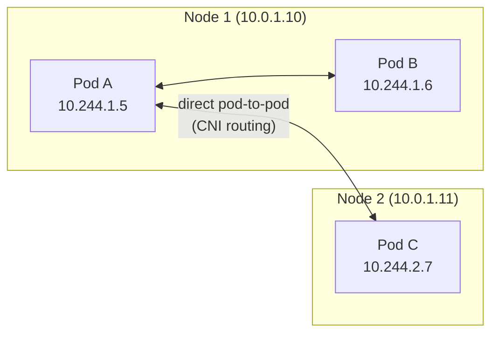
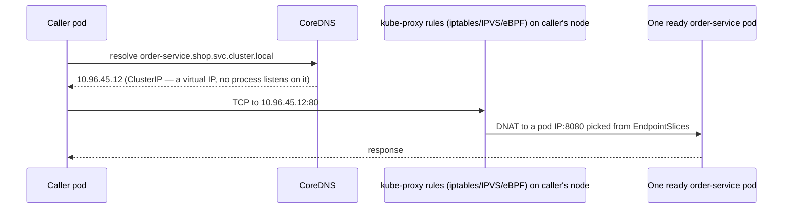
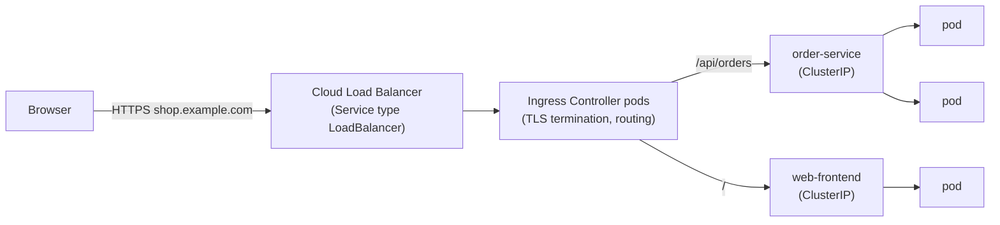

# Kubernetes Networking — Services, DNS, Ingress & Network Policies

> **Kubernetes · Networking & Config** — Pods come and go with new IPs every time. This page explains how anything still finds them: from one pod calling another, to a user's browser reaching your API through a load balancer.

---

## Table of Contents

1. The Company Phone System Analogy
2. The Kubernetes Networking Model — Four Rules
3. Services — Stable Addresses for Moving Pods
4. Service Types: ClusterIP, NodePort, LoadBalancer, Headless, ExternalName
5. DNS — How `http://order-service` Resolves
6. Ingress & the Gateway API — HTTP from the Outside World
7. NetworkPolicies — Firewalls Between Pods
8. Service Mesh — When (and When Not)
9. Debugging Connectivity Step by Step
10. Practice Assignments (Low / Medium / High)
11. Mini Project — Two-Service Shop with Ingress & Zero-Trust Policies
12. Interview Corner
13. Quick Reference

---

## 1. The Company Phone System Analogy

In a big company, employees change desks all the time. Nobody memorizes desk phone numbers:

- You call the **department extension** ("Payments: ext. 4400"), and the switchboard rings whichever payments person is free. → **Service** (stable virtual IP + DNS name, load-balancing over pods)
- The **company directory** turns "Payments" into ext. 4400. → **CoreDNS**
- Customers from outside call **one public number**, and a receptionist routes them by what they ask for ("billing questions → Payments, orders → Sales"). → **Ingress / Gateway**
- Security rules say "interns can't call the executive floor". → **NetworkPolicy**

---

## 2. The Kubernetes Networking Model — Four Rules

1. Every Pod gets its **own IP address**.
2. Pods can reach **all other Pods** directly, on any node, **without NAT** (unless a NetworkPolicy blocks it).
3. Agents on a node (kubelet) can reach all pods on that node.
4. Containers inside a Pod share the IP and talk over `localhost`.

Kubernetes defines these rules; a **CNI plugin** implements them: Calico, Cilium, Flannel, or the AWS VPC CNI (on EKS, pods get real VPC IPs).



---

## 3. Services — Stable Addresses for Moving Pods

Pod IPs change on every restart, so you never call a pod IP. A **Service** gives a stable **virtual IP (ClusterIP)** and **DNS name**, and load-balances over the pods matching its **selector**.

```yaml
apiVersion: v1
kind: Service
metadata:
  name: order-service
  namespace: shop
spec:
  selector:
    app.kubernetes.io/name: order-service     # pods with this label
  ports:
    - name: http
      port: 80            # the Service's port (what callers use)
      targetPort: 8080    # the container's port
```

### How it works under the hood



- The **EndpointSlice controller** keeps a list of **ready** pod IPs for each Service. Only pods passing their **readiness probe** are included — that's how readiness gates traffic.
- **kube-proxy** on every node programs rules so traffic to the ClusterIP goes to one of those pods. The load balancing is per **connection**, not per request.

<div class="callout-warn">

**Connection-level balancing surprises**: HTTP/1.1 keep-alive and especially **gRPC/HTTP/2** reuse one long-lived connection, so all requests from one client pod can stick to one server pod while others sit idle. Fixes: client-side load balancing (gRPC with a headless Service + `round_robin`), a service mesh (L7 balancing), or periodic connection recycling (`max connection age` on the server).

</div>

---

## 4. Service Types

| Type | Reachable from | How | Typical use |
|------|----------------|-----|-------------|
| **ClusterIP** (default) | Inside the cluster only | Virtual IP | Service-to-service calls |
| **NodePort** | `<any-node-IP>:30000-32767` | Opens a port on every node | Dev/test; behind an external LB you manage |
| **LoadBalancer** | Internet / VPC | Cloud controller provisions a cloud LB (AWS NLB, GCP LB) pointing at the nodes/pods | Exposing non-HTTP (TCP/UDP) services; the Ingress controller's own entry point |
| **Headless** (`clusterIP: None`) | Inside the cluster | DNS returns **pod IPs** directly, no VIP | StatefulSets (`kafka-0.kafka-headless`), client-side load balancing |
| **ExternalName** | Inside the cluster | DNS CNAME to an external host | Alias `payments-db` → `mydb.xxxx.rds.amazonaws.com` |

<div class="callout-tip">

**Applying this** — Don't create a `LoadBalancer` Service per microservice: each one is a separate cloud load balancer with its own cost and public IP. Expose HTTP services through **one** Ingress controller or Gateway (one LB, routing by host/path), and keep everything else `ClusterIP`.

</div>

---

## 5. DNS — How `http://order-service` Resolves

CoreDNS gives every Service a name:

```text
<service>.<namespace>.svc.cluster.local
order-service.shop.svc.cluster.local
```

| From a pod in namespace... | You can call |
|----------------------------|--------------|
| `shop` (same) | `http://order-service` |
| `payments` (different) | `http://order-service.shop` or the full name |
| Anywhere | `http://order-service.shop.svc.cluster.local` |
| StatefulSet pod via headless Service | `kafka-0.kafka-headless.data.svc.cluster.local` |

<div class="callout-info">

**The `ndots:5` performance gotcha**: pods' `/etc/resolv.conf` has `options ndots:5` and several search domains. Resolving an external name like `api.stripe.com` (only 2 dots) first tries `api.stripe.com.shop.svc.cluster.local`, `...svc.cluster.local`, and so on — several wasted DNS queries per lookup. For high-volume external calls, use a trailing dot (`api.stripe.com.`), lower `ndots` in `dnsConfig`, or rely on NodeLocal DNSCache. Also make sure the JVM doesn't cache DNS forever (`networkaddress.cache.ttl`).

</div>

---

## 6. Ingress & the Gateway API — HTTP from the Outside World

### Ingress

An **Ingress** resource defines HTTP routing rules; an **Ingress controller** (NGINX, Traefik, HAProxy, AWS Load Balancer Controller) actually implements them.

```yaml
apiVersion: networking.k8s.io/v1
kind: Ingress
metadata:
  name: shop
  namespace: shop
spec:
  ingressClassName: nginx
  tls:
    - hosts: [shop.example.com]
      secretName: shop-tls              # certificate, often issued by cert-manager (Let's Encrypt)
  rules:
    - host: shop.example.com
      http:
        paths:
          - path: /api/orders
            pathType: Prefix
            backend:
              service: { name: order-service, port: { number: 80 } }
          - path: /
            pathType: Prefix
            backend:
              service: { name: web-frontend, port: { number: 80 } }
```



### Gateway API — the successor

Ingress is limited: only host/path routing, and most features live in controller-specific annotations. The **Gateway API** (GA since v1.0, 2023) is the standard evolution:

| | Ingress | Gateway API |
|--|---------|-------------|
| Resources | One `Ingress` | `GatewayClass` (infra provider) → `Gateway` (listeners, owned by platform team) → `HTTPRoute`/`GRPCRoute` (owned by app teams) |
| Features | Host/path + annotations | Header/query matching, **traffic weights (canary)**, redirects, rewrites, mirroring — in the spec |
| Protocols | HTTP(S) | HTTP, gRPC, TCP, TLS, UDP |
| Role separation | Weak | Built in |

```yaml
apiVersion: gateway.networking.k8s.io/v1
kind: HTTPRoute
metadata:
  name: orders
  namespace: shop
spec:
  parentRefs: [{ name: public-gateway, namespace: infra }]
  hostnames: [shop.example.com]
  rules:
    - matches: [{ path: { type: PathPrefix, value: /api/orders } }]
      backendRefs:
        - { name: order-service,    port: 80, weight: 90 }
        - { name: order-service-v2, port: 80, weight: 10 }    # 10% canary
```

<div class="callout-scenario">

**Scenario**: You're choosing the edge setup for a new EKS cluster in 2026. **Decision**: Prefer the **Gateway API** with an implementation such as the AWS Load Balancer Controller, Envoy Gateway, Cilium, or Istio. The community `ingress-nginx` controller announced its retirement (best-effort maintenance ended in March 2026), so new clusters shouldn't build on it, and existing ones should plan a migration. If you keep Ingress for simplicity, pick a maintained controller and avoid heavy annotation-specific logic that locks you in.

</div>

---

## 7. NetworkPolicies — Firewalls Between Pods

By default, **every pod can talk to every pod** in the cluster. A compromised pod in `dev-tools` can reach your payments database. NetworkPolicies restrict that (the CNI must support them — Calico and Cilium do; plain Flannel doesn't).

```yaml
# 1. Default deny all ingress traffic in the namespace
apiVersion: networking.k8s.io/v1
kind: NetworkPolicy
metadata:
  name: default-deny-ingress
  namespace: payments
spec:
  podSelector: {}               # all pods in the namespace
  policyTypes: [Ingress]
---
# 2. Allow only order-service (from namespace shop) to reach payment-service on 8080
apiVersion: networking.k8s.io/v1
kind: NetworkPolicy
metadata:
  name: allow-orders-to-payments
  namespace: payments
spec:
  podSelector:
    matchLabels: { app.kubernetes.io/name: payment-service }
  policyTypes: [Ingress]
  ingress:
    - from:
        - namespaceSelector:
            matchLabels: { kubernetes.io/metadata.name: shop }
          podSelector:
            matchLabels: { app.kubernetes.io/name: order-service }
      ports:
        - { protocol: TCP, port: 8080 }
```

<div class="callout-warn">

**Two classic mistakes**: (1) In `from`, a `namespaceSelector` and `podSelector` in the **same** list item mean AND; as **separate** items (each with its own `-`) they mean OR — one missing dash can open a namespace to everything. (2) A default-deny **egress** policy also blocks **DNS**: always allow UDP/TCP 53 to `kube-system` (CoreDNS), or nothing resolves.

</div>

---

## 8. Service Mesh — When (and When Not)

A service mesh (Istio, Linkerd, Cilium service mesh) adds a proxy layer (sidecars or node-level/ambient proxies) that provides:

| Capability | Without a mesh |
|------------|----------------|
| **mTLS** between all services, automatic cert rotation | App-level TLS, cert management per service |
| L7 load balancing (per request, gRPC-aware) | Connection-level via kube-proxy |
| Retries, timeouts, circuit breaking as config | Resilience4j in each app |
| Uniform metrics and traces for every call | Instrument each app |
| Traffic shifting, mirroring, fault injection | Gateway API weights (edge only) |

| Adopt a mesh when... | Skip it when... |
|----------------------|-----------------|
| Many services, polyglot stacks, zero-trust/mTLS mandated | A handful of services |
| Platform team to operate it | No one to own upgrades and debugging |
| Consistent L7 policy needed across teams | Spring apps already handle resilience and observability well |

---

## 9. Debugging Connectivity Step by Step

"order-service can't reach payment-service." Walk the path:

```bash
# 1. Is the target Service selecting any READY pods?
kubectl get endpointslices -n payments -l kubernetes.io/service-name=payment-service
#    Empty → selector/label mismatch, or pods not Ready (check readiness probes)

# 2. Do the Service ports match the container port?
kubectl get svc payment-service -n payments -o yaml      # port / targetPort
kubectl get pod <payment-pod> -n payments -o yaml | grep -A3 ports

# 3. Can DNS resolve it from the caller's pod?
kubectl run tmp --rm -it -n shop --image=busybox:1.36 --restart=Never -- nslookup payment-service.payments

# 4. Can we connect? (from inside the caller's namespace)
kubectl run tmp --rm -it -n shop --image=curlimages/curl --restart=Never -- \
  curl -sv http://payment-service.payments/actuator/health

# 5. Is a NetworkPolicy blocking it?
kubectl get networkpolicy -n payments
```

| Symptom | Likely cause |
|---------|--------------|
| `Could not resolve host` | Wrong name/namespace, DNS egress blocked by a policy, CoreDNS problems |
| `Connection refused` | Service `targetPort` ≠ container port, or the app listens on `127.0.0.1` instead of `0.0.0.0` |
| Timeout | NetworkPolicy dropping packets, no ready endpoints, security groups (EKS) |
| Works via pod IP, not via Service | Selector mismatch → empty endpoints |
| 502/503 at the Ingress | Backend Service has no ready endpoints, or wrong port name/number |

---

## 10. 🏋️ Practice Assignments

### 🟢 Low — Build the reflexes

**L1.** A pod in namespace `billing` must call Service `inventory` in namespace `warehouse` on port 80. What URL works?

<details>
<summary>Show answer</summary>

`http://inventory.warehouse` (or the fully qualified `http://inventory.warehouse.svc.cluster.local`). Plain `http://inventory` would resolve only within `billing`.

</details>

**L2.** Which Service type for each: (a) internal REST API, (b) Kafka brokers that clients must address individually, (c) a TCP game server exposed to the internet, (d) an alias for an RDS endpoint?

<details>
<summary>Show answer</summary>

(a) ClusterIP. (b) Headless Service for the StatefulSet (and a per-broker external exposure if clients are outside the cluster). (c) LoadBalancer (e.g., an NLB). (d) ExternalName.

</details>

**L3.** A Service exists but `kubectl get endpointslices` for it shows no endpoints. Give two causes.

<details>
<summary>Show answer</summary>

The Service's `selector` doesn't match the pods' labels (typo, different label key), or the matching pods aren't **Ready** (readiness probe failing, pods crash-looping or Pending).

</details>

### 🟡 Medium — Apply it

**M1.** Write an Ingress for `api.shop.com` routing `/orders` to `order-service:80` and `/payments` to `payment-service:80` with TLS from Secret `api-tls`.

<details>
<summary>Show answer</summary>

```yaml
apiVersion: networking.k8s.io/v1
kind: Ingress
metadata:
  name: api
spec:
  ingressClassName: nginx
  tls:
    - { hosts: [api.shop.com], secretName: api-tls }
  rules:
    - host: api.shop.com
      http:
        paths:
          - path: /orders
            pathType: Prefix
            backend: { service: { name: order-service, port: { number: 80 } } }
          - path: /payments
            pathType: Prefix
            backend: { service: { name: payment-service, port: { number: 80 } } }
```

Both Services must be in the Ingress's namespace (Ingress can't reference Services in other namespaces — one reason the Gateway API added cross-namespace references with `ReferenceGrant`).

</details>

**M2.** Write NetworkPolicies so that pods in namespace `db` accept traffic on 5432 **only** from pods labeled `role: backend` in any namespace labeled `env: prod`, and nothing else.

<details>
<summary>Show answer</summary>

```yaml
apiVersion: networking.k8s.io/v1
kind: NetworkPolicy
metadata: { name: default-deny, namespace: db }
spec:
  podSelector: {}
  policyTypes: [Ingress]
---
apiVersion: networking.k8s.io/v1
kind: NetworkPolicy
metadata: { name: allow-prod-backends, namespace: db }
spec:
  podSelector: {}
  policyTypes: [Ingress]
  ingress:
    - from:
        - namespaceSelector: { matchLabels: { env: prod } }
          podSelector: { matchLabels: { role: backend } }     # same item → AND
      ports: [{ protocol: TCP, port: 5432 }]
```

</details>

**M3.** A gRPC service with 6 replicas shows one pod at 90% CPU and five nearly idle. Explain and propose two fixes.

<details>
<summary>Show answer</summary>

kube-proxy balances **connections**, and gRPC multiplexes all requests over one long-lived HTTP/2 connection per client, so each client sticks to one backend. Fixes: (1) client-side load balancing — a headless Service so DNS returns all pod IPs, plus gRPC's `round_robin` policy; (2) an L7 proxy/mesh (Linkerd, Istio, Envoy) that balances per request; (3) server-side `MaxConnectionAge` so clients periodically reconnect and rebalance.

</details>

### 🔴 High — Think like a senior

**H1.** Design the network architecture for a multi-team EKS cluster: 20 services, 4 teams, public web + mobile APIs, PCI-scoped payments, and a requirement that "no service can call payments except checkout".

<details>
<summary>Show answer</summary>

- **Edge**: Gateway API with the AWS Load Balancer Controller (ALB) or Envoy Gateway; a platform-owned `Gateway` per trust zone (public, internal), app teams own their `HTTPRoute`s; TLS via cert-manager or ACM; WAF on the public ALB.
- **Namespaces** per team plus a dedicated `payments` namespace — ideally payments on a **dedicated node group** (taints/tolerations) or even a separate cluster to shrink PCI scope.
- **NetworkPolicies**: default-deny ingress **and** egress in every namespace (egress allowing DNS); payments allows ingress only from `checkout` pods; egress from payments only to the card processor (via an egress gateway / fixed NAT IPs the processor can allow-list).
- **mTLS / identity**: a mesh (Istio or Linkerd) with authorization policies by service identity, so "only checkout may call payments" is enforced at L7 and audited — not just by IP.
- **AWS layer**: security groups for pods where needed; VPC endpoints for AWS APIs; separate subnets.
- **Verification**: automated policy tests in CI (e.g., a job that attempts forbidden connections and must fail), flow logs, and regular reviews.

</details>

**H2.** After moving from EC2 to Kubernetes, p99 latency for calls to a third-party API rose by 40 ms. There's no CPU pressure. What would you investigate?

<details>
<summary>Show answer</summary>

1. **DNS**: `ndots:5` + search domains cause several failed lookups before the real one; conntrack races on UDP DNS; CoreDNS throttling. Check with `tcpdump`/CoreDNS metrics; fix with a trailing dot, lower `ndots`, NodeLocal DNSCache, and JVM DNS cache TTL.
2. **Connection reuse**: the HTTP client pool may be smaller or recreated per request, adding TLS handshakes; verify keep-alive and pool sizing.
3. **SNAT/egress path**: traffic through NAT gateways, conntrack table pressure, or port exhaustion on the NAT.
4. **Cross-AZ hops**: pods and NAT gateways in different zones.
5. **Mesh sidecars**: an extra proxy hop per call, if a mesh was added.

Measure each hop with timing breakdowns (DNS, connect, TLS, first byte) — `curl -w` inside the pod — before changing anything.

</details>

---

## 11. 🛠️ Mini Project — Two-Service Shop with Ingress & Zero-Trust Policies

**Goal**: A realistic networking setup on your laptop. 2 evenings.

**Setup**: kind with an ingress-ready config (port 80/443 mapped to the host), plus a Gateway API implementation or an Ingress controller, and **Calico or Cilium** as the CNI so NetworkPolicies are enforced (kind's default CNI doesn't enforce them).

**Build**

1. `order-service` (namespace `shop`) and `payment-service` (namespace `payments`), each 2 replicas with readiness probes. Order calls payment by DNS name (`http://payment-service.payments`).
2. Route `shop.localtest.me/api/orders` → order-service with Ingress or an `HTTPRoute`. (`*.localtest.me` resolves to 127.0.0.1.)
3. Add a `v2` of order-service and split traffic 90/10 with `HTTPRoute` weights; verify the ratio with a loop of 200 curl calls.
4. Apply default-deny in both namespaces; allow DNS egress; allow only order-service → payment-service:8080. Prove that a `curl` pod in another namespace **cannot** reach payments, while order-service still can.
5. Break it on purpose: a wrong `targetPort`, a label typo, a missing DNS egress rule — and document the symptom and the command that revealed each.

**Deliverable**: manifests in a `k8s/` folder + a `NETWORK-NOTES.md` with a diagram and the debugging table from step 5.

---

## 🎯 Interview Corner

<div class="callout-interview">

**Q: "How does a request from one pod reach another pod through a Service?"**

The caller resolves the Service name through CoreDNS and gets the ClusterIP, a virtual IP that no process actually listens on. When it opens a connection to that IP, rules programmed by kube-proxy on the caller's node — iptables, IPVS, or eBPF with Cilium — rewrite the destination to the IP and port of one backend pod. The backends come from EndpointSlices, which contain only pods that match the selector and pass their readiness probe. The CNI then routes the packet to the pod, even on another node, without NAT. The balancing is per connection, which matters for keep-alive and gRPC clients.

</div>

<div class="callout-interview">

**Q: "Ingress vs LoadBalancer Service vs Gateway API?"**

A LoadBalancer Service provisions one cloud load balancer that forwards TCP or UDP to a Service. It's simple, but one per service gets expensive and has no HTTP routing. Ingress is an HTTP routing resource — host and path to Service, plus TLS — implemented by a controller that typically sits behind a single LoadBalancer, so many services share one entry point. The Gateway API is its successor. It separates the infrastructure owner's `Gateway` from app teams' `HTTPRoute`s and standardizes features that used to be annotations: header matching, weighted canaries, redirects, and gRPC and TCP routes. For new clusters I'd pick the Gateway API.

**Follow-up trap**: "Is Ingress deprecated?" → The Ingress API itself isn't removed, but it's feature-frozen, and the popular community ingress-nginx controller has been retired, so new work should target the Gateway API.

</div>

<div class="callout-interview">

**Q: "How do you secure service-to-service traffic inside a cluster?"**

By default every pod can reach every other pod, so I layer controls. NetworkPolicies give default-deny per namespace with explicit allow rules — remembering to allow DNS egress — enforced by a CNI like Calico or Cilium. For identity and encryption I'd add mTLS, usually through a service mesh that issues workload certificates and enforces authorization by service identity rather than by IP. Applications still authenticate requests, for example with JWTs from the identity provider. Around that: RBAC and Pod Security Standards so a compromised pod can't escalate, and egress controls for traffic leaving the cluster.

</div>

---

## Quick Reference

| Concept | One-Liner |
|---------|-----------|
| Pod IP | Unique per pod, changes on restart — never hard-code |
| Service | Stable VIP + DNS over ready pods matching a selector |
| EndpointSlice | The live list of ready pod IPs behind a Service |
| kube-proxy | Programs VIP → pod rules; per-connection balancing |
| ClusterIP / NodePort / LB | Internal / node port / cloud load balancer |
| Headless | DNS returns pod IPs; StatefulSets, client-side LB |
| DNS name | `svc.ns.svc.cluster.local`; watch `ndots:5` |
| Ingress | HTTP host/path routing via a controller |
| Gateway API | Successor: roles, weights, gRPC/TCP, fewer annotations |
| NetworkPolicy | Default-allow until you add policies; allow DNS on egress deny |
| Mesh | mTLS, L7 balancing, policy — worth it at scale with a platform team |
| Debug path | EndpointSlices → ports → DNS → curl from a pod → policies |

---

## Related Topics

- `k8s-fundamentals` — kube-proxy and the node components
- `service-discovery` — client-side vs server-side discovery patterns
- `api-gateway-pattern` — what the edge does beyond routing
- `load-balancing` — L4 vs L7 balancing trade-offs

> **In Kubernetes you never call a pod — you call a name. DNS finds the Service, the Service finds ready pods, and policies decide who's allowed to ask. Debug in that same order.**

---

<!-- journey-link:start -->

<div class="callout-journey">

🛒 **ShopNorth Journey** — ShopNorth exposes only the gateway through an ALB ingress; NetworkPolicies decide which services may call which.

**Continue the story:** [Chapter 12 · Deploying on Kubernetes](/tutorials/journey-12-kubernetes) · **New here?** [Start the journey](/tutorials/journey-start)

</div>

<!-- journey-link:end -->
