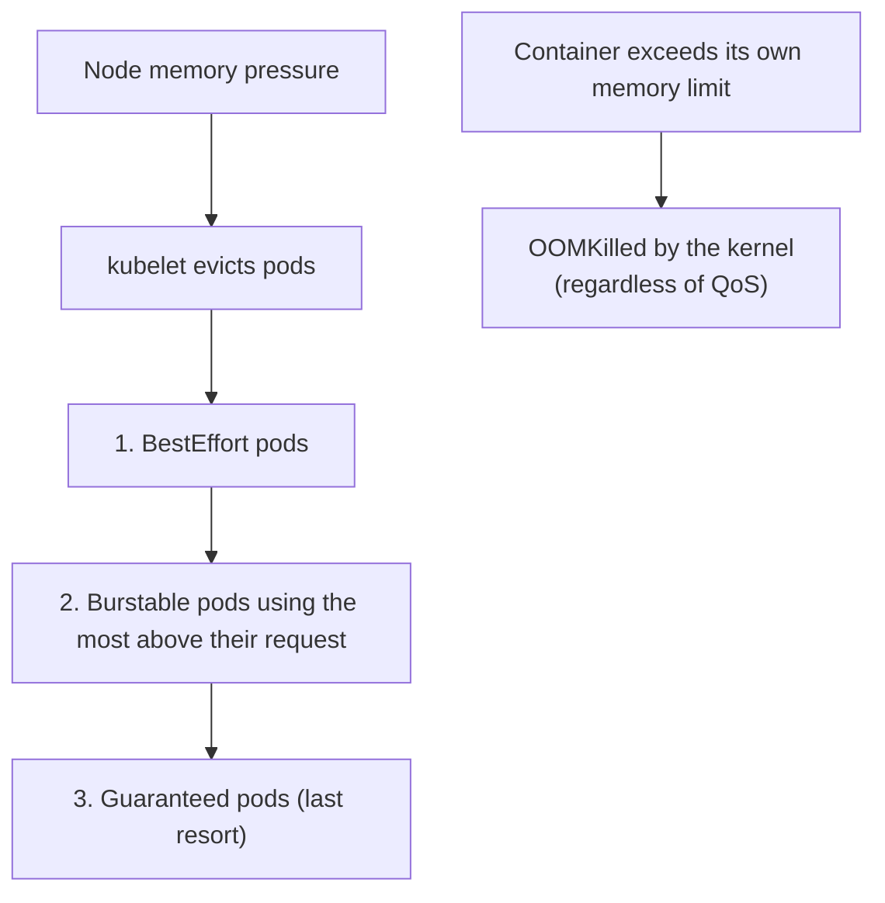
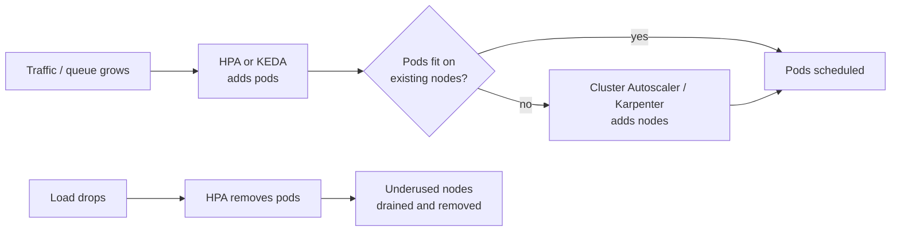
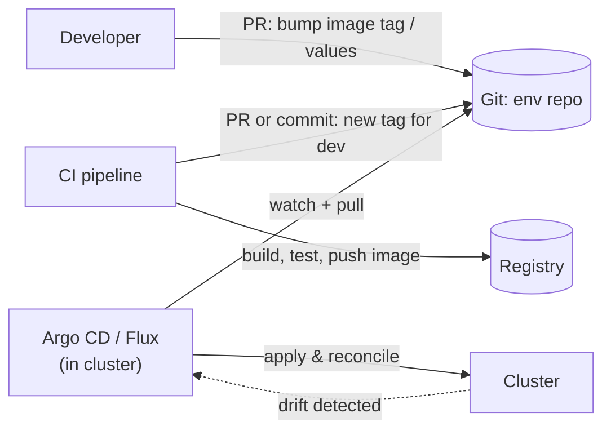
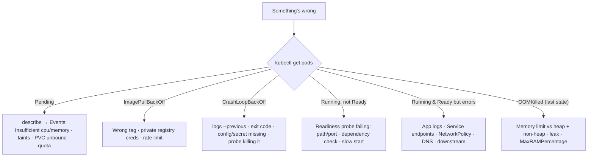

# Kubernetes in Production — Resources, Scaling, Security, GitOps & Troubleshooting

<!-- sdlc-stage:start -->
<div class="sdlc-stage">

📍 **SDLC stage: Deployment — infrastructure & runtime** · ShopNorth uses this in [Chapter 12 · Deploying on Kubernetes](/tutorials/journey-12-kubernetes)

</div>
<!-- sdlc-stage:end -->

> **Kubernetes · Production** — Getting a pod running is day 1. This page is day 2: keeping dozens of services reliable, secure, affordable, and debuggable when you're on call.

---

## Table of Contents

1. The City Utilities Analogy
2. Resources, QoS Classes & Evictions
3. Autoscaling — Pods, Nodes, and Events (HPA, VPA, Cluster Autoscaler/Karpenter, KEDA)
4. Security — RBAC, Service Accounts, Pod Security, Supply Chain
5. Observability — Metrics, Logs, Traces
6. GitOps — Argo CD / Flux
7. Cluster Upgrades & Multi-Environment Strategy
8. Troubleshooting Playbook — The Failures You'll Actually See
9. Cost Management
10. Practice Assignments (Low / Medium / High)
11. Mini Project — A Mini Production Platform on kind
12. Interview Corner
13. Quick Reference

---

## 1. The City Utilities Analogy

Running production Kubernetes is like running a city's utilities:

- **Zoning & quotas** — each district gets guaranteed power (requests) and a breaker that trips at a ceiling (limits). → **Resources & QoS**
- **Adding capacity** — more substations when demand rises, fewer at night. → **Autoscaling**
- **Building permits & keys** — who may build what, where, and who holds which keys. → **RBAC & Pod Security**
- **Meters and sensors everywhere** — you can't fix what you can't see. → **Observability**
- **The master plan** — the official blueprint in city hall; any unauthorized change gets reverted. → **GitOps**

---

## 2. Resources, QoS Classes & Evictions

Kubernetes assigns every pod a **Quality of Service class** from its requests and limits:

| QoS class | Rule | Eviction priority under node pressure |
|-----------|------|--------------------------------------|
| **Guaranteed** | Every container has CPU & memory requests **=** limits | Evicted last |
| **Burstable** | At least one request set, not Guaranteed | Middle (by how far over request) |
| **BestEffort** | No requests or limits at all | Evicted **first** |



<div class="callout-warn">

**Pods without requests break everything quietly.** The scheduler thinks they need nothing, packs them onto busy nodes, the HPA can't compute CPU utilization (it's a percentage of the request), and they're first to be evicted. Enforce requests with a `LimitRange` (defaults per namespace) and a policy engine (Kyverno / OPA Gatekeeper) that rejects pods without them.

</div>

### Guardrails per namespace

```yaml
apiVersion: v1
kind: ResourceQuota
metadata: { name: team-orders-quota, namespace: orders }
spec:
  hard:
    requests.cpu: "20"
    requests.memory: 40Gi
    limits.memory: 40Gi
    pods: "100"
---
apiVersion: v1
kind: LimitRange
metadata: { name: defaults, namespace: orders }
spec:
  limits:
    - type: Container
      defaultRequest: { cpu: 100m, memory: 256Mi }
      default: { memory: 512Mi }
```

<div class="callout-tip">

**Applying this** — Right-size from data, not guesses: compare actual usage (`container_cpu_usage_seconds_total`, `container_memory_working_set_bytes` at p95 over two weeks) with requests. Typical findings: CPU requests 3-5x higher than usage (wasted money) and memory limits too tight (OOMKills). The VPA in *recommendation mode* or tools like Goldilocks produce these numbers for you.

</div>

---

## 3. Autoscaling — Pods, Nodes, and Events



| Autoscaler | Scales | Signal | Notes |
|------------|--------|--------|-------|
| **HPA** | Pod count | CPU/memory %, custom & external metrics | The default for stateless services |
| **VPA** | Pod requests/limits | Historical usage | Use recommendation mode alongside HPA; don't let both act on CPU |
| **KEDA** | Pod count (incl. **to zero**) | Kafka lag, SQS depth, cron, Prometheus queries... | Ideal for consumers and workers |
| **Cluster Autoscaler** | Nodes (via node groups/ASGs) | Pending pods, underused nodes | Mature, works everywhere |
| **Karpenter** (AWS, now also others) | Nodes (provisions right-sized instances directly) | Pending pods | Faster, bin-packs, mixes spot/on-demand, consolidates |

```yaml
# KEDA: scale a Kafka consumer on consumer-group lag
apiVersion: keda.sh/v1alpha1
kind: ScaledObject
metadata: { name: payment-consumer }
spec:
  scaleTargetRef: { name: payment-consumer }
  minReplicaCount: 1
  maxReplicaCount: 12          # no point exceeding the topic's partition count
  triggers:
    - type: kafka
      metadata:
        bootstrapServers: kafka:9092
        consumerGroup: payments
        topic: payment-requests
        lagThreshold: "500"     # target lag per replica
```

<div class="callout-scenario">

**Scenario**: The Kafka consumer's HPA scales on CPU, but lag grows to 2 million messages while CPU sits at 30% — the consumer is waiting on a slow downstream API, not burning CPU. **Decision**: Scale on the signal that represents the work: **consumer lag via KEDA**, capped at the partition count (extra consumers in a group sit idle). Then fix the real bottleneck: add concurrency within the consumer or batch the downstream calls — scaling pods can't fix a downstream rate limit.

</div>

---

## 4. Security — RBAC, Service Accounts, Pod Security, Supply Chain

### RBAC — who can do what

```yaml
apiVersion: rbac.authorization.k8s.io/v1
kind: Role
metadata: { name: deployer, namespace: orders }
rules:
  - apiGroups: [apps]
    resources: [deployments]
    verbs: [get, list, watch, update, patch]
  - apiGroups: [""]
    resources: [pods, pods/log]
    verbs: [get, list, watch]
---
apiVersion: rbac.authorization.k8s.io/v1
kind: RoleBinding
metadata: { name: ci-deployer, namespace: orders }
subjects:
  - { kind: ServiceAccount, name: ci-bot, namespace: orders }
roleRef: { apiGroup: rbac.authorization.k8s.io, kind: Role, name: deployer }
```

| Object | Scope |
|--------|-------|
| Role + RoleBinding | One namespace |
| ClusterRole + ClusterRoleBinding | Whole cluster (or reuse a ClusterRole per namespace with a RoleBinding) |

Dangerous permissions to watch for: `secrets` get/list, `pods/exec`, `create pods` (can mount any secret, run privileged), `escalate`/`bind`, wildcard `*`, and anything bound to `cluster-admin`.

### Service accounts & cloud identity

- Every pod runs as a ServiceAccount; set `automountServiceAccountToken: false` for apps that don't call the Kubernetes API.
- Give pods **cloud permissions via workload identity** — EKS **IRSA** or **EKS Pod Identity**, GKE Workload Identity — never by putting cloud access keys in Secrets.

### Pod Security Standards

PodSecurityPolicy was removed in 1.25; its replacement is **Pod Security Admission**, enforced per namespace with labels:

```yaml
apiVersion: v1
kind: Namespace
metadata:
  name: orders
  labels:
    pod-security.kubernetes.io/enforce: restricted     # privileged | baseline | restricted
    pod-security.kubernetes.io/warn: restricted
```

`restricted` requires: non-root, no privilege escalation, drop all capabilities, a seccomp profile, no host namespaces/paths. For richer rules (require resource requests, allowed registries, required labels), add **Kyverno** or **OPA Gatekeeper**.

### Supply chain

| Control | Tool examples |
|---------|---------------|
| Scan images for CVEs in CI and continuously | Trivy, Grype, ECR/Artifact Registry scanning |
| Minimal base images | Distroless, Chainguard, Alpine (with care), Buildpacks |
| Sign images, verify at admission | Sigstore **cosign** + Kyverno/policy-controller |
| SBOMs | Syft, `docker buildx --sbom` |
| Allowed registries only | Kyverno/Gatekeeper policy |

<div class="callout-interview">

**Q: "How do you secure workloads on Kubernetes?"**

Least-privilege RBAC with no shared cluster-admin; workload identity instead of cloud keys; the `restricted` Pod Security Standard — non-root, read-only root filesystem, dropped capabilities, seccomp; default-deny NetworkPolicies; Secrets from a secret manager with encryption at rest; and a supply chain with scanned, signed images from allowed registries, verified at admission. Plus audit logs, runtime detection such as Falco, and keeping the cluster version patched.

</div>

---

## 5. Observability — Metrics, Logs, Traces

| Pillar | Standard stack | What to capture |
|--------|----------------|-----------------|
| **Metrics** | Prometheus (kube-prometheus-stack) + Grafana; managed options (AMP, Grafana Cloud) | RED per service (Rate, Errors, Duration), USE per node, JVM metrics (Micrometer), kube-state-metrics |
| **Logs** | Fluent Bit (DaemonSet) → Loki / OpenSearch / CloudWatch | JSON logs to stdout with trace IDs; never write log files inside containers |
| **Traces** | OpenTelemetry Collector → Tempo / Jaeger / X-Ray | Micrometer Tracing / OTel Java agent in Spring Boot |
| **Events** | kube-state-metrics, event exporter | OOMKills, restarts, failed scheduling |

### Alerts worth having on day 1

| Alert | Why |
|-------|-----|
| Error rate / latency SLO burn rate per service | User-facing symptoms first |
| Pod restarts increasing (`kube_pod_container_status_restarts_total`) | Crash loops, OOMKills |
| Deployment replicas unavailable | Failed rollouts |
| Pending pods > 5 minutes | Capacity or scheduling problems |
| Node not ready, disk pressure | Infrastructure issues |
| CPU throttling high for latency-sensitive pods | Mis-sized CPU limits |
| Certificate expiry < 14 days | Avoid the classic outage |
| CronJob last success too old | Silent batch failures |

<div class="callout-tip">

**Applying this** — Alert on **symptoms** users feel (SLO burn rate on errors and latency), and use cause-level metrics (CPU, restarts) for dashboards and investigation. A pager that fires for every pod restart trains people to ignore it.

</div>

---

## 6. GitOps — Argo CD / Flux

**GitOps**: the desired state of every cluster lives in Git; an in-cluster agent continuously **pulls** and applies it, and reverts drift.



| Push-based CD (CI runs `kubectl`/`helm`) | GitOps (pull-based) |
|------------------------------------------|---------------------|
| CI needs cluster credentials | Cluster pulls; no external admin credentials |
| Drift goes unnoticed | Drift detected and reverted |
| Audit = CI logs | Audit = Git history (who changed what, reviewed via PR) |
| Rollback = rerun an old pipeline | Rollback = `git revert` |

```yaml
apiVersion: argoproj.io/v1alpha1
kind: Application
metadata:
  name: order-service-prod
  namespace: argocd
spec:
  project: shop
  source:
    repoURL: https://github.com/shop/platform-envs.git
    path: prod/order-service            # Helm values or Kustomize overlay for prod
    targetRevision: main
  destination:
    server: https://kubernetes.default.svc
    namespace: orders
  syncPolicy:
    automated: { prune: true, selfHeal: true }
    syncOptions: [CreateNamespace=true]
```

<div class="callout-scenario">

**Scenario**: During an incident, an engineer scales a Deployment by hand with `kubectl scale`, and five minutes later it's back to the old replica count. **Answer**: Argo CD's `selfHeal` reverted the drift to what Git declares — working as designed. The fix is to commit the change (a PR with a fast-track approval for incidents), or temporarily pause auto-sync for that app with a documented procedure. Better still: let the HPA own replica counts, and have Argo CD ignore the `replicas` field (`ignoreDifferences`).

</div>

---

## 7. Cluster Upgrades & Multi-Environment Strategy

- Kubernetes ships a minor release roughly **every 4 months**, and each gets about 14 months of patch support; managed providers force upgrades after end of support (EKS extended support costs extra). **Upgrades are routine work, not a project.**
- Upgrade path: read the deprecation guide → scan manifests for removed APIs (`pluto`, `kubent`) → upgrade dev → staging → prod; control plane first, then node groups (surge/rolling replacement), then add-ons (CNI, CoreDNS, ingress/gateway, CSI drivers).
- PDBs must allow drains; stateful workloads need extra care.

| Environment model | Pros | Cons |
|-------------------|------|------|
| One cluster per environment (dev/stage/prod) | Isolation, safe upgrades testing | More clusters to run |
| Namespaces per env in one cluster | Cheap | Shared blast radius; upgrade risk hits prod |
| Many clusters per region/tenant (fleet) | Blast-radius limits, compliance | Needs fleet tooling (Argo CD ApplicationSets, Cluster API) |

<div class="callout-info">

**Treat clusters as cattle too.** If you can recreate a cluster from Git (Terraform/Cluster API for the cluster, GitOps for everything in it), you can do blue/green **cluster** upgrades, recover from disasters, and spin up test clusters on demand. If you can't, every upgrade is scary.

</div>

---

## 8. Troubleshooting Playbook — The Failures You'll Actually See



### Exit codes decoder

| Exit code | Meaning |
|-----------|---------|
| 0 | Exited normally (bad for a server — something told it to stop, or `main` returned) |
| 1 | Application error (read the logs) |
| 126 / 127 | Command not executable / not found (wrong entrypoint) |
| 137 | SIGKILL — usually **OOMKilled**, or killed after the grace period |
| 139 | Segfault (native code) |
| 143 | SIGTERM — normal graceful termination |

### Commands you'll run at 3 AM

```bash
kubectl get pods -n orders -o wide
kubectl describe pod <pod> -n orders                       # Events at the bottom
kubectl logs <pod> -n orders --previous --tail=200         # why the LAST container died
kubectl get events -n orders --sort-by=.lastTimestamp
kubectl top pods -n orders --containers
kubectl get endpointslices -n orders
kubectl rollout history deployment/order-service -n orders
kubectl rollout undo deployment/order-service -n orders    # when a release is the cause
kubectl debug -it <pod> -n orders --image=nicolaka/netshoot --target=app   # network tools
kubectl get pod <pod> -n orders -o jsonpath='{.status.containerStatuses[*].lastState}'
```

<div class="callout-tip">

**Applying this** — In an incident, **restore service first, find the root cause second**. If a deploy happened in the last hour, roll it back before debugging. Write the timeline as you go; it becomes the postmortem.

</div>

---

## 9. Cost Management

| Lever | Typical savings | Notes |
|-------|-----------------|-------|
| Right-size requests (VPA recommendations, Goldilocks) | 20-40% | Most clusters are heavily over-requested |
| Bin-packing & consolidation (Karpenter) | 10-30% | Fewer, better-fitted nodes |
| **Spot / preemptible** nodes for stateless and batch | 60-90% on those nodes | Needs PDBs, multiple instance types, graceful shutdown |
| Scale down non-prod at night / weekends (KEDA cron, kube-downscaler) | ~60% of non-prod | Easy win |
| ARM nodes (Graviton) | ~20% price-performance | Multi-arch images needed |
| Cost visibility per team (OpenCost / Kubecost, labels) | Behavioral | You can't manage what isn't attributed |

---

## 10. 🏋️ Practice Assignments

### 🟢 Low — Build the reflexes

**L1.** Classify the QoS class: (a) cpu request 500m, limit 500m, memory request 1Gi, limit 1Gi; (b) cpu request 250m, no limits; (c) no resources at all.

<details>
<summary>Show answer</summary>

(a) Guaranteed (requests = limits for both CPU and memory, in every container). (b) Burstable. (c) BestEffort — first to be evicted under node pressure.

</details>

**L2.** A pod's last state shows `Reason: OOMKilled, Exit Code: 137`, but the application logs show no `OutOfMemoryError`. What happened?

<details>
<summary>Show answer</summary>

The container's **total** memory (heap + non-heap: metaspace, threads, direct buffers, native) exceeded its memory limit, so the kernel's OOM killer sent SIGKILL. The JVM never threw an OOM because the heap itself wasn't full. Fix sizing (`MaxRAMPercentage` ~75%) or find the non-heap growth.

</details>

**L3.** Name three permissions you would never grant to a CI service account deploying one app.

<details>
<summary>Show answer</summary>

Any of: `cluster-admin` / wildcard verbs or resources; `get/list` on `secrets` cluster-wide; `pods/exec`; `escalate`/`bind`/`impersonate`; creating ClusterRoleBindings; access to namespaces other than its own. (With GitOps, CI needs no cluster access at all — it just commits to Git.)

</details>

### 🟡 Medium — Apply it

**M1.** Write a Role and RoleBinding that let a developer group (`dev-orders`) view pods, logs, deployments, and events in namespace `orders`, and restart deployments — nothing else.

<details>
<summary>Show answer</summary>

```yaml
apiVersion: rbac.authorization.k8s.io/v1
kind: Role
metadata: { name: orders-dev, namespace: orders }
rules:
  - apiGroups: [""]
    resources: [pods, pods/log, events, services, configmaps]
    verbs: [get, list, watch]
  - apiGroups: [apps]
    resources: [deployments, replicasets]
    verbs: [get, list, watch]
  - apiGroups: [apps]
    resources: [deployments]
    verbs: [patch]          # kubectl rollout restart patches a pod-template annotation
---
apiVersion: rbac.authorization.k8s.io/v1
kind: RoleBinding
metadata: { name: orders-dev, namespace: orders }
subjects: [{ kind: Group, name: dev-orders, apiGroup: rbac.authorization.k8s.io }]
roleRef: { kind: Role, name: orders-dev, apiGroup: rbac.authorization.k8s.io }
```

Note `patch` on deployments also allows changing the image — if that's too broad, restrict restarts to CI/GitOps instead. No `secrets`, no `pods/exec`.

</details>

**M2.** A service is `CrashLoopBackOff` right after a release. Write your first five commands and what each tells you.

<details>
<summary>Show answer</summary>

1. `kubectl get pods -o wide` — how many pods, restart counts, which nodes.
2. `kubectl describe pod <pod>` — last state (exit code, OOMKilled?), probe failures, events.
3. `kubectl logs <pod> --previous` — the crashed container's last output (stack trace, missing config).
4. `kubectl rollout history deployment/<name>` + `kubectl diff`/Git log — what changed in this release (image, env, config).
5. `kubectl rollout undo deployment/<name>` — restore service if users are affected, then continue debugging from the logs and the diff.

</details>

**M3.** Design autoscaling for (a) a REST API with daily peaks, (b) an SQS-driven image processor that's idle most of the night.

<details>
<summary>Show answer</summary>

(a) HPA on CPU (or RPS via a custom metric) with `minReplicas` sized for baseline plus spread across zones, fast scale-up/slow scale-down behavior, and optionally a KEDA cron trigger to pre-scale before the morning peak; Karpenter or Cluster Autoscaler for nodes. (b) KEDA `ScaledObject` on SQS queue length with `minReplicaCount: 0` (scale to zero), `maxReplicaCount` bounded by downstream limits, spot nodes for cost, and a visibility timeout longer than the processing time + graceful shutdown so in-flight messages aren't lost on scale-down.

</details>

### 🔴 High — Think like a senior

**H1.** You're asked to design the "paved road" platform for 15 product teams moving to EKS. What goes into it?

<details>
<summary>Show answer</summary>

- **Clusters**: per environment (dev/stage/prod), maybe per region; created by Terraform/`eksctl`; managed node groups or Karpenter with spot + on-demand pools; Graviton where possible.
- **GitOps**: Argo CD with ApplicationSets; an env repo per environment; promotion by PR; Argo Rollouts for canaries on critical services.
- **Golden Helm chart** for Spring Boot services (probes, graceful shutdown, security context, PDB, HPA/KEDA, spread constraints, labels, ServiceMonitor), versioned and consumed by teams with small values files.
- **Guardrails**: Pod Security `restricted`; Kyverno policies (requests required, allowed registries, signed images, no `:latest`); LimitRanges and ResourceQuotas per team namespace; default-deny NetworkPolicies.
- **Identity & secrets**: EKS Pod Identity/IRSA per service; External Secrets Operator + Secrets Manager; KMS encryption.
- **Edge**: Gateway API with the AWS LB Controller; cert-manager; WAF.
- **Observability**: kube-prometheus-stack or managed Prometheus, Grafana, Loki, OpenTelemetry Collector → Tempo/X-Ray; standard dashboards and SLO alerts per service generated from the chart.
- **Cost**: OpenCost with team labels; non-prod downscaling schedules.
- **Operations**: an upgrade calendar (every ~4 months), runbooks, a backup plan (Velero for cluster objects, managed DB backups), and documentation plus office hours. Measure adoption and the time it takes a team to ship a new service ("idea to production in a day").

</details>

**H2.** After a node-group upgrade, 20% of pods across services show p99 latency doubling, but CPU usage per pod is lower than before. What could explain it?

<details>
<summary>Show answer</summary>

Hypotheses to check, in order: (1) **CPU throttling** — the new nodes have a different CPU/core layout or kernel cgroup version (cgroup v2) changing CFS quota behavior; check `container_cpu_cfs_throttled_periods_total`. Lower usage + higher latency is the classic throttling signature. (2) **Different instance type** (e.g., moved to ARM or burstable `t`-class instances out of credits). (3) **JVM ergonomics changed**: the JVM sees a different CPU count, so GC threads and ForkJoin pool sizes changed — pin with `-XX:ActiveProcessorCount` if needed. (4) **Topology**: pods now concentrated in one AZ, adding cross-AZ hops to databases. (5) **Noisy neighbors** due to changed bin-packing. Compare old vs new node labels, throttling metrics, and GC logs; roll back the node group if user impact is significant.

</details>

---

## 11. 🛠️ Mini Project — A Mini Production Platform on kind

**Goal**: Assemble the production building blocks around the service from `k8s-spring-boot`, locally. 3 evenings; each step is independently valuable.

**Build**

1. **GitOps**: install Argo CD on kind; create a Git repo with `envs/dev/order-service` (Helm values). Deploy via an Argo `Application` with auto-sync and self-heal. Change an image tag in Git and watch it roll out; `kubectl edit` something and watch it revert.
2. **Observability**: install `kube-prometheus-stack` via Helm; add a ServiceMonitor for Spring's `/actuator/prometheus`; build a Grafana dashboard with RED metrics + JVM heap/non-heap + restart count; add one SLO-style alert rule.
3. **Guardrails**: label the namespace with Pod Security `restricted`; install Kyverno with policies "require requests/limits" and "disallow `:latest`". Try to deploy a violating pod and capture the rejection message.
4. **RBAC**: create a `viewer` ServiceAccount; generate a kubeconfig for it; verify it can read pods/logs but not Secrets or `exec` (`kubectl auth can-i --as=...`).
5. **Autoscaling**: metrics-server + HPA; load test and record scale-up time.
6. **Chaos drill**: delete pods randomly during load (a simple loop or a chaos tool) and show the SLO dashboard stays green.

**Deliverable**: a repo with everything as code, plus `RUNBOOK.md` covering the troubleshooting playbook (section 8) for your service, and screenshots of the dashboard during the drills.

---

## 🎯 Interview Corner

<div class="callout-interview">

**Q: "Explain requests and limits and what happens when they're wrong."**

Requests are what the scheduler reserves when placing a pod, and the basis for HPA utilization and fair CPU sharing. Limits are hard ceilings at runtime: above the CPU limit the container is throttled, and above the memory limit it's OOMKilled. If requests are too low, pods get crammed onto busy nodes, suffer contention and eviction, and the HPA scales on misleading percentages. If they're too high, you pay for idle capacity and pods sit Pending. A memory limit that's too tight causes OOMKills. A CPU limit that's too tight causes throttling and latency spikes even at low average CPU. I size from observed p95 usage, set memory limit equal to request, and I'm cautious with CPU limits on latency-sensitive JVMs.

**Follow-up trap**: "Which pods get evicted first under memory pressure?" → BestEffort pods, then Burstable pods using the most above their requests, with Guaranteed last. A container exceeding its own limit is OOMKilled regardless of class.

</div>

<div class="callout-interview">

**Q: "What is GitOps and why would you use it over deploying from CI?"**

GitOps keeps the desired state of every environment declared in Git, and an agent inside the cluster, like Argo CD or Flux, continuously pulls and applies it and reverts manual drift. Compared with CI pushing `kubectl` or `helm` commands, the cluster doesn't expose admin credentials to CI. Every change is a reviewed pull request with a full audit trail. Rollback is a `git revert`. And you can rebuild a cluster from the repo, which also makes disaster recovery and cluster upgrades far less scary. CI still builds, tests, and publishes images; promotion between environments becomes a PR that changes a version.

</div>

<div class="callout-interview">

**Q: "You're on call: a service is failing after a deployment. Walk me through what you do."**

First, restore service. If the failure lines up with a release, I roll it back — `kubectl rollout undo`, or a revert in Git with GitOps — and confirm recovery on the SLO dashboard. Then I diagnose. `kubectl get pods` for status and restarts. `describe` for events: probe failures, OOMKilled, scheduling problems. `logs --previous` for the crashed container's stack trace. Then I diff what changed — image, config, secrets, dependencies — and check whether a downstream service or database was the real trigger. I keep a timeline throughout, and afterwards write a blameless postmortem with action items, such as adding a readiness check or a canary step that would have caught it earlier.

</div>

<div class="callout-interview">

**Q: "How would you reduce the Kubernetes bill by 30%?"**

First make cost visible per team with labels and OpenCost, so it's clear where the money goes. The biggest lever is usually over-requested resources: compare requests with p95 usage and right-size using VPA recommendations, which alone is often 20-40%. Then improve node efficiency with Karpenter consolidation and right-sized instance types, move stateless and batch workloads to spot capacity behind PDBs and graceful shutdown, consider Graviton instances, and scale non-production environments down at night and on weekends. I'd track cost per request, or per business unit, as the metric, so savings don't quietly come at the expense of reliability.

</div>

---

## Quick Reference

| Area | Key practice |
|------|--------------|
| Resources | Requests on everything; memory limit = request; watch throttling |
| QoS | Guaranteed > Burstable > BestEffort (eviction order reversed) |
| Namespace guardrails | ResourceQuota + LimitRange |
| Pod autoscaling | HPA (CPU/custom), KEDA (queues, lag, cron, to zero) |
| Node autoscaling | Cluster Autoscaler or Karpenter |
| RBAC | Least privilege; no secrets/exec for most; no cluster-admin sharing |
| Identity | IRSA / EKS Pod Identity; no cloud keys in Secrets |
| Pod security | PSA `restricted` + Kyverno/Gatekeeper |
| Supply chain | Scan, sign (cosign), verify at admission, SBOM |
| Observability | Prometheus/Grafana, Fluent Bit → Loki, OTel traces, SLO alerts |
| Delivery | GitOps (Argo CD/Flux); Argo Rollouts for canaries |
| Upgrades | Every ~4 months; scan deprecated APIs; dev → stage → prod |
| Debugging | get → describe → logs --previous → rollback first if a release |
| Cost | Right-size, consolidate, spot, downscale non-prod, attribute per team |

---

## Related Topics

- `k8s-spring-boot` — the per-service production settings
- `k8s-networking` — NetworkPolicies and edge security
- `cloud-infra-decisions` — EKS vs ECS vs Lambda
- `ai-sdlc` — guardrails and GitOps-style review for AI-generated changes

> **Production Kubernetes is less about clever YAML and more about boring discipline: honest resource numbers, least privilege, everything in Git, and alerts that describe what users feel. Boring is what lets you sleep.**

---

<!-- journey-link:start -->

<div class="callout-journey">

🛒 **ShopNorth Journey** — ShopNorth combines HPA, Karpenter, GitOps with Argo CD, and Kyverno policies — and pre-scales before the sale.

**Continue the story:** [Chapter 12 · Deploying on Kubernetes](/tutorials/journey-12-kubernetes) · **New here?** [Start the journey](/tutorials/journey-start)

</div>

<!-- journey-link:end -->
