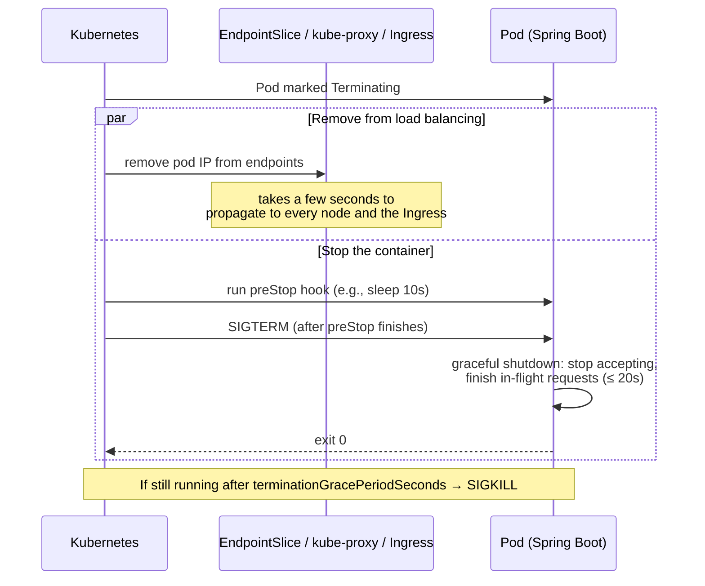

# Deploying Spring Boot on Kubernetes — The Production-Ready Checklist

<!-- sdlc-stage:start -->
<div class="sdlc-stage">

📍 **SDLC stage: Deployment — infrastructure & runtime** · ShopNorth uses this in [Chapter 12 · Deploying on Kubernetes](/tutorials/journey-12-kubernetes)

</div>
<!-- sdlc-stage:end -->

> **Kubernetes · Hands-On** — Everything from the previous Kubernetes pages, applied to the app you actually write: a Spring Boot service. Probes that tell the truth, memory settings the JVM respects, shutdowns that don't drop requests, autoscaling, and a Helm chart to package it all.

---

## Table of Contents

1. The Airline Crew Analogy
2. The Target: What "Production-Ready" Means
3. Building the Image (Recap)
4. Health Probes — Liveness, Readiness, Startup
5. Resources & the JVM — Requests, Limits, Heap
6. Graceful Shutdown — No Dropped Requests
7. Configuration & Profiles on Kubernetes
8. Horizontal Pod Autoscaler
9. Packaging with Helm
10. The Complete Manifest Set
11. Practice Assignments (Low / Medium / High)
12. Mini Project — Ship order-service with Helm on kind
13. Interview Corner
14. Quick Reference

---

## 1. The Airline Crew Analogy

A flight crew runs strict checklists:

- **Before boarding** (startup probe): "Is the aircraft fully prepared?" Nobody boards during fueling — however long fueling takes.
- **Doors open for boarding** (readiness probe): passengers board only when the crew says "ready". Mid-flight turbulence? Stop serving (not ready), but don't abandon the plane.
- **Is the pilot conscious?** (liveness probe): if not, the aircraft needs a new pilot — restart.
- **Landing** (graceful shutdown): stop boarding new passengers first, let everyone on board disembark, then shut down the engines.

Confusing these checklists — say, declaring the pilot unconscious because catering is late — is exactly how pods get killed for no reason.

---

## 2. The Target: What "Production-Ready" Means

| Concern | Kubernetes side | Spring Boot side |
|---------|-----------------|------------------|
| Only receive traffic when ready | `readinessProbe` | `/actuator/health/readiness` (readiness state) |
| Restart when truly stuck | `livenessProbe` | `/actuator/health/liveness` (liveness state) |
| Slow JVM startup | `startupProbe` | — |
| Predictable memory | requests/limits | `MaxRAMPercentage`, container-aware JVM |
| No dropped requests on deploy | `preStop`, `terminationGracePeriodSeconds` | `server.shutdown=graceful` |
| Environment config | ConfigMap/Secret | Profiles, `configtree:` |
| Scale with load | HPA | Stateless design |
| Security | `securityContext`, non-root | Minimal image, no secrets in env dumps |
| Observability | scraping annotations / ServiceMonitor | Micrometer + Prometheus, JSON logs, tracing |

---

## 3. Building the Image (Recap)

Covered in depth in `docker-spring-boot`. The two good options:

```bash
# Option A — Cloud Native Buildpacks: no Dockerfile, layered, non-root, JVM memory calculator included
./mvnw spring-boot:build-image -Dspring-boot.build-image.imageName=ghcr.io/shop/order-service:1.5.0

# Option B — multi-stage Dockerfile with layered jar extraction
docker build -t ghcr.io/shop/order-service:1.5.0 .
```

For kind: `kind load docker-image ghcr.io/shop/order-service:1.5.0 --name dev`.

---

## 4. Health Probes — Liveness, Readiness, Startup

When Spring Boot detects it's running on Kubernetes (it checks for the `KUBERNETES_SERVICE_HOST` env var), it **automatically** exposes probe groups:

| Endpoint | Reflects | Should include |
|----------|----------|----------------|
| `/actuator/health/liveness` | `LivenessState` (`CORRECT` / `BROKEN`) | **Nothing external.** Only "is this JVM process healthy?" |
| `/actuator/health/readiness` | `ReadinessState` (`ACCEPTING_TRAFFIC` / `REFUSING_TRAFFIC`) | Things without which *this pod* can't serve at all (maybe its own DB) |

```yaml
# application.yml
management:
  endpoint:
    health:
      probes:
        enabled: true                     # explicit, so it also works locally
      group:
        readiness:
          include: readinessState,db      # add the DB only if the pod is useless without it
  server:
    port: 8081                            # keep actuator off the public port
```

```yaml
# In the container spec
startupProbe:                     # protects slow starts: liveness/readiness wait until this passes
  httpGet: { path: /actuator/health/liveness, port: 8081 }
  periodSeconds: 5
  failureThreshold: 30            # up to 150s to start
livenessProbe:
  httpGet: { path: /actuator/health/liveness, port: 8081 }
  periodSeconds: 10
  failureThreshold: 3
readinessProbe:
  httpGet: { path: /actuator/health/readiness, port: 8081 }
  periodSeconds: 5
  failureThreshold: 3
```

<div class="callout-warn">

**The most expensive probe mistake: checking dependencies in liveness.** If the liveness probe includes the database and the DB has a 2-minute hiccup, Kubernetes **restarts every pod** of every service that uses it — turning a partial outage into a total one, plus a thundering herd of JVMs starting at once. Liveness = "the process is stuck and a restart would help". A DB outage is not fixed by restarting your app.

</div>

<div class="callout-scenario">

**Scenario**: Pods get killed in a loop during startup: `Liveness probe failed ... Killing container`. The app takes ~70 seconds to start (Flyway + cache warmup), and the liveness probe has `initialDelaySeconds: 30`. **Answer**: The probe kills the container before it ever finishes starting → CrashLoopBackOff. Use a **startupProbe** with enough `failureThreshold × periodSeconds` for the worst-case start; liveness and readiness don't run until it succeeds. Also check CPU requests: a throttled JVM starts much slower (the JIT and class loading are CPU-hungry).

</div>

### Telling Kubernetes you're temporarily not ready

```java
@Component
class CacheWarmup {
    private final ApplicationEventPublisher events;
    CacheWarmup(ApplicationEventPublisher events) { this.events = events; }

    void onMaintenanceStart() {
        AvailabilityChangeEvent.publish(events, this, ReadinessState.REFUSING_TRAFFIC);   // drop out of the Service
    }
    void onMaintenanceEnd() {
        AvailabilityChangeEvent.publish(events, this, ReadinessState.ACCEPTING_TRAFFIC);
    }
}
```

---

## 5. Resources & the JVM — Requests, Limits, Heap

### Requests vs limits

| | Request | Limit |
|--|---------|-------|
| Meaning | Guaranteed amount; the **scheduler** uses it to place the pod | Hard ceiling enforced at runtime |
| CPU | Share of CPU under contention | **Throttling** above it (CFS quota) — the process slows down |
| Memory | Reserved | Above it → the container is **OOMKilled** |

### The JVM in a container

Modern JVMs (JDK 10+, and 8u191+) are **container-aware**: they read the cgroup memory limit and CPU quota. By default the max heap is only **25%** of the container memory — too little for most services.

```yaml
resources:
  requests:
    cpu: "500m"
    memory: "768Mi"
  limits:
    memory: "768Mi"          # memory limit = request → predictable, no overcommit surprises
    # no CPU limit: avoids throttling-induced latency spikes (a common, debated choice — see below)
env:
  - name: JAVA_TOOL_OPTIONS
    value: >-
      -XX:MaxRAMPercentage=75.0
      -XX:+ExitOnOutOfMemoryError
```

Where the other 25% goes: metaspace, thread stacks (~1 MB per thread × 200 Tomcat threads), code cache, direct buffers (Netty), GC overhead. Set heap to 100% of the limit and the kernel will OOMKill the pod even though the JVM "had room".

| Symptom | Likely cause | Fix |
|---------|--------------|-----|
| `OOMKilled`, exit code 137, no Java OOM in logs | Total process memory > limit (heap + non-heap) | Lower `MaxRAMPercentage` or raise the limit; check thread count, direct memory |
| `java.lang.OutOfMemoryError: Java heap space` | Heap too small or a leak | Heap dump analysis; `-XX:+ExitOnOutOfMemoryError` so Kubernetes restarts it cleanly |
| Latency spikes every 100 ms, CPU "only 40%" | CPU limit throttling (bursty GC/JIT) | Raise or remove the CPU limit; check `container_cpu_cfs_throttled_periods_total` |
| Very slow startup | CPU request too low | Raise the CPU request (startup is CPU-bound); consider CDS / CRaC |

<div class="callout-info">

**The CPU limit debate**: many teams set CPU *requests* but no CPU *limits*, because CFS throttling hurts latency-sensitive JVMs and the request already guarantees a fair share. Others require limits for cost control or multi-tenant fairness (and some policies enforce them). Whatever you choose, **measure throttling** and always set **memory** limits.

</div>

---

## 6. Graceful Shutdown — No Dropped Requests

When a pod is deleted (rolling update, scale-down, node drain), two things happen **in parallel**:



Without the `preStop` delay, the app may stop accepting connections **before** every node and the Ingress have removed it — requests arriving in that window fail with connection errors.

```yaml
# Spring Boot (graceful shutdown is the default since Boot 3.4; explicit is clearer)
server:
  shutdown: graceful
spring:
  lifecycle:
    timeout-per-shutdown-phase: 20s
```

```yaml
# Pod spec
spec:
  terminationGracePeriodSeconds: 45       # > preStop (10) + Spring shutdown phase (20) + margin
  containers:
    - name: app
      lifecycle:
        preStop:
          sleep:
            seconds: 10                   # native sleep action (Kubernetes 1.30+); no shell needed
```

(On older clusters: `preStop: exec: command: ["sh", "-c", "sleep 10"]`, which requires a shell in the image.)

<div class="callout-tip">

**Applying this** — Graceful shutdown also matters for **message consumers**: on shutdown, a Kafka listener should stop polling, finish the current batch, and commit offsets. Spring Kafka does this when the application context closes — as long as the grace period is long enough for your slowest batch. Tune `terminationGracePeriodSeconds` to your real worst case, not the default 30s.

</div>

---

## 7. Configuration & Profiles on Kubernetes

```yaml
env:
  - name: SPRING_PROFILES_ACTIVE
    value: "prod"
  - name: SPRING_CONFIG_IMPORT
    value: "optional:configtree:/secrets/"
  - name: POD_NAME
    valueFrom: { fieldRef: { fieldPath: metadata.name } }       # downward API: great for logs
  - name: NODE_NAME
    valueFrom: { fieldRef: { fieldPath: spec.nodeName } }
envFrom:
  - configMapRef: { name: order-service-config }
```

Rules of thumb (details in `k8s-config-storage`):

- Keep a **single** image; profiles select environment config, not different code paths.
- Secrets as files via `configtree`, sourced from a secret manager.
- Bind config into validated `@ConfigurationProperties` so bad config fails **at startup** — the startup/readiness probes then stop the rollout before any traffic is affected.

<div class="callout-info">

**Spring Cloud Kubernetes** can read ConfigMaps/Secrets through the Kubernetes API and reload them at runtime. It works, but it couples the app to the Kubernetes API and needs RBAC permissions. Most teams prefer plain env vars/mounted files plus rolling restarts on change — simpler and safer.

</div>

---

## 8. Horizontal Pod Autoscaler

```yaml
apiVersion: autoscaling/v2
kind: HorizontalPodAutoscaler
metadata:
  name: order-service
spec:
  scaleTargetRef: { apiVersion: apps/v1, kind: Deployment, name: order-service }
  minReplicas: 3
  maxReplicas: 20
  metrics:
    - type: Resource
      resource:
        name: cpu
        target: { type: Utilization, averageUtilization: 65 }   # % of the CPU *request*
  behavior:
    scaleUp:
      stabilizationWindowSeconds: 0
      policies: [{ type: Percent, value: 100, periodSeconds: 60 }]   # at most double per minute
    scaleDown:
      stabilizationWindowSeconds: 300                                  # wait 5 min before shrinking
```

- The HPA needs **metrics-server** (CPU/memory) or a metrics adapter for custom metrics (Prometheus Adapter, or **KEDA** for queue length, Kafka lag, etc.).
- Utilization is relative to the **request** — if requests are wrong, autoscaling is wrong.
- Don't set `replicas:` in the Deployment manifest you re-apply (or Helm will fight the HPA); let the HPA own it.

| Scale on... | When |
|-------------|------|
| CPU | CPU-bound request processing (typical REST services) |
| Memory | Rarely — JVM heap doesn't shrink, so it scales up and never down |
| Requests per second / latency (custom metric) | Better signal for I/O-bound services |
| Kafka consumer lag / queue depth (**KEDA**) | Consumers and workers; can scale to zero |

<div class="callout-scenario">

**Scenario**: At 9 AM traffic triples in two minutes; the HPA adds pods, but they take 60 seconds to become Ready, and p99 latency spikes for 3 minutes. **Decision**: Combine (1) a higher `minReplicas` during business hours (a scheduled scale via KEDA's cron scaler), (2) faster startup (CDS, lazy initialization where safe, smaller context, or GraalVM native for small services), (3) aggressive `scaleUp` policies, and (4) cluster-level headroom — spare capacity or over-provisioning placeholder pods — so new pods don't also wait for new **nodes**.

</div>

---

## 9. Packaging with Helm

Hand-maintaining YAML per environment doesn't scale. **Helm** packages manifests as a **chart** with templated values.

```text
order-service-chart/
 ├─ Chart.yaml            # name, version (chart), appVersion (app)
 ├─ values.yaml           # defaults
 ├─ values-prod.yaml      # environment overrides
 └─ templates/
     ├─ deployment.yaml
     ├─ service.yaml
     ├─ hpa.yaml
     ├─ configmap.yaml
     ├─ pdb.yaml
     └─ _helpers.tpl       # shared template snippets (names, labels)
```

```yaml
# values.yaml
image:
  repository: ghcr.io/shop/order-service
  tag: "1.5.0"
replicaCount: 3
resources:
  requests: { cpu: 500m, memory: 768Mi }
  limits: { memory: 768Mi }
autoscaling: { enabled: true, minReplicas: 3, maxReplicas: 20, targetCPU: 65 }
config:
  paymentGatewayBaseUrl: https://sandbox.gateway.example
```

```yaml
# templates/deployment.yaml (excerpt)
apiVersion: apps/v1
kind: Deployment
metadata:
  name: {{ include "order-service.fullname" . }}
  labels: {{- include "order-service.labels" . | nindent 4 }}
spec:
  {{- if not .Values.autoscaling.enabled }}
  replicas: {{ .Values.replicaCount }}
  {{- end }}
  template:
    metadata:
      annotations:
        checksum/config: {{ include (print $.Template.BasePath "/configmap.yaml") . | sha256sum }}
    spec:
      containers:
        - name: app
          image: "{{ .Values.image.repository }}:{{ .Values.image.tag }}"
          resources: {{- toYaml .Values.resources | nindent 12 }}
```

```bash
helm lint ./order-service-chart
helm template ./order-service-chart -f values-prod.yaml          # render locally, review the YAML
helm upgrade --install order-service ./order-service-chart \
  -n shop --create-namespace -f values-prod.yaml \
  --set image.tag=1.5.1 --atomic --timeout 5m                    # --atomic: roll back if not healthy
helm history order-service -n shop
helm rollback order-service 3 -n shop
```

| Tool | Approach | Good for |
|------|----------|----------|
| **Helm** | Templates + values; releases with history | Distributing apps, many knobs, third-party software |
| **Kustomize** (built into kubectl) | Plain YAML + overlays/patches, no templating | Simple per-environment differences |
| Both | Helm for the base chart, Kustomize patches on top | Common in GitOps setups |

<div class="callout-tip">

**Applying this** — Build a **golden chart** (a "paved road") for all your Spring services: probes, graceful shutdown, security context, PDB, HPA, and labels baked in with good defaults. Teams then write a 20-line `values.yaml` instead of 300 lines of YAML — and platform fixes reach every service by bumping the chart version.

</div>

---

## 10. The Complete Manifest Set

```yaml
apiVersion: apps/v1
kind: Deployment
metadata:
  name: order-service
  labels: { app.kubernetes.io/name: order-service, app.kubernetes.io/version: "1.5.0" }
spec:
  selector:
    matchLabels: { app.kubernetes.io/name: order-service }
  strategy:
    rollingUpdate: { maxSurge: 1, maxUnavailable: 0 }
  template:
    metadata:
      labels: { app.kubernetes.io/name: order-service }
      annotations:
        prometheus.io/scrape: "true"
        prometheus.io/port: "8081"
        prometheus.io/path: /actuator/prometheus
    spec:
      terminationGracePeriodSeconds: 45
      securityContext:
        runAsNonRoot: true
        seccompProfile: { type: RuntimeDefault }
      topologySpreadConstraints:
        - maxSkew: 1
          topologyKey: topology.kubernetes.io/zone
          whenUnsatisfiable: ScheduleAnyway
          labelSelector: { matchLabels: { app.kubernetes.io/name: order-service } }
      containers:
        - name: app
          image: ghcr.io/shop/order-service:1.5.0
          ports:
            - { name: http, containerPort: 8080 }
            - { name: management, containerPort: 8081 }
          env:
            - { name: SPRING_PROFILES_ACTIVE, value: prod }
            - { name: SPRING_CONFIG_IMPORT, value: "optional:configtree:/secrets/" }
            - { name: JAVA_TOOL_OPTIONS, value: "-XX:MaxRAMPercentage=75.0 -XX:+ExitOnOutOfMemoryError" }
          envFrom:
            - configMapRef: { name: order-service-config }
          resources:
            requests: { cpu: 500m, memory: 768Mi }
            limits: { memory: 768Mi }
          startupProbe:
            httpGet: { path: /actuator/health/liveness, port: management }
            periodSeconds: 5
            failureThreshold: 30
          livenessProbe:
            httpGet: { path: /actuator/health/liveness, port: management }
            periodSeconds: 10
          readinessProbe:
            httpGet: { path: /actuator/health/readiness, port: management }
            periodSeconds: 5
          lifecycle:
            preStop: { sleep: { seconds: 10 } }
          securityContext:
            allowPrivilegeEscalation: false
            readOnlyRootFilesystem: true
            capabilities: { drop: [ALL] }
          volumeMounts:
            - { name: secrets, mountPath: /secrets, readOnly: true }
            - { name: tmp, mountPath: /tmp }
      volumes:
        - name: secrets
          secret: { secretName: order-service-secrets }
        - name: tmp
          emptyDir: { sizeLimit: 512Mi }
---
apiVersion: v1
kind: Service
metadata: { name: order-service }
spec:
  selector: { app.kubernetes.io/name: order-service }
  ports: [{ name: http, port: 80, targetPort: http }]
---
apiVersion: policy/v1
kind: PodDisruptionBudget
metadata: { name: order-service }
spec:
  maxUnavailable: 1
  selector: { matchLabels: { app.kubernetes.io/name: order-service } }
```

(Plus the HPA from section 8, a ConfigMap, and an ExternalSecret for `order-service-secrets`.)

---

## 11. 🏋️ Practice Assignments

### 🟢 Low — Build the reflexes

**L1.** For each check, liveness, readiness, both, or neither? (a) Tomcat thread pool deadlocked, (b) Postgres down, (c) warming a cache for 30 s after start, (d) a downstream fraud API slow.

<details>
<summary>Show answer</summary>

(a) **Liveness** — the process is stuck; a restart helps. (b) **Readiness at most**, and only if the pod truly can't serve anything without it — never liveness. (c) **Readiness** (and a startupProbe window if it's during startup). (d) **Neither** — handle with timeouts, circuit breakers, and fallbacks; take pods out of rotation for a downstream blip and you cause a full outage.

</details>

**L2.** A pod with `limits.memory: 1Gi` runs a JVM with `-Xmx1g`. What happens under load?

<details>
<summary>Show answer</summary>

The heap alone can use the whole limit; metaspace, thread stacks, code cache, and direct buffers push total process memory above 1 GiB, so the kernel OOMKills the container (exit code 137) — often with no Java error in the logs. Use `-XX:MaxRAMPercentage=75` (or `-Xmx` ≈ 70-75% of the limit) and check non-heap usage via Micrometer JVM metrics.

</details>

**L3.** Put these in the order they happen when a pod is deleted: SIGTERM, preStop hook, SIGKILL (if still running), endpoints removal starts, Spring stops accepting new requests.

<details>
<summary>Show answer</summary>

Endpoint removal starts **at the same time** as the preStop hook (both are triggered by the pod entering Terminating). Then: preStop finishes → SIGTERM → Spring graceful shutdown stops accepting and drains in-flight requests → exit, or SIGKILL at `terminationGracePeriodSeconds` if it's still running. The preStop sleep exists to cover the time it takes endpoint removal to propagate.

</details>

### 🟡 Medium — Apply it

**M1.** Write an HPA that keeps average CPU at 60% of requests, between 2 and 12 replicas, scales down no faster than 1 pod per 2 minutes, and scales up quickly.

<details>
<summary>Show answer</summary>

```yaml
apiVersion: autoscaling/v2
kind: HorizontalPodAutoscaler
metadata: { name: order-service }
spec:
  scaleTargetRef: { apiVersion: apps/v1, kind: Deployment, name: order-service }
  minReplicas: 2
  maxReplicas: 12
  metrics:
    - type: Resource
      resource: { name: cpu, target: { type: Utilization, averageUtilization: 60 } }
  behavior:
    scaleUp:
      stabilizationWindowSeconds: 0
      policies:
        - { type: Percent, value: 100, periodSeconds: 30 }
        - { type: Pods, value: 4, periodSeconds: 30 }
      selectPolicy: Max
    scaleDown:
      stabilizationWindowSeconds: 300
      policies: [{ type: Pods, value: 1, periodSeconds: 120 }]
```

</details>

**M2.** Your Spring Boot service takes 90 s to start. Design the probes.

<details>
<summary>Show answer</summary>

`startupProbe` on `/actuator/health/liveness` with `periodSeconds: 5`, `failureThreshold: 30` (150 s budget for a 90 s typical start). `livenessProbe` every 10 s, `failureThreshold: 3`. `readinessProbe` every 5 s. No `initialDelaySeconds` needed — the startup probe handles it. Also investigate the 90 s: CPU requests (throttling), eager bean initialization, Flyway migrations (move to a Job), cache warmup (move after readiness, or make readiness wait for it deliberately).

</details>

**M3.** Convert three environment-specific Deployment YAMLs (dev/staging/prod differing in replicas, image tag, resources, and one URL) into a Helm chart. Show the values files.

<details>
<summary>Show answer</summary>

`values.yaml` (defaults, used by dev):

```yaml
image: { repository: ghcr.io/shop/order-service, tag: "1.5.0" }
replicaCount: 1
resources: { requests: { cpu: 250m, memory: 512Mi }, limits: { memory: 512Mi } }
config: { paymentGatewayBaseUrl: https://sandbox.gateway.example }
autoscaling: { enabled: false }
```

`values-staging.yaml`: `replicaCount: 2`. `values-prod.yaml`:

```yaml
resources: { requests: { cpu: 500m, memory: 768Mi }, limits: { memory: 768Mi } }
config: { paymentGatewayBaseUrl: https://api.gateway.example }
autoscaling: { enabled: true, minReplicas: 3, maxReplicas: 20, targetCPU: 65 }
```

The image tag is set by CI (`--set image.tag=$GIT_SHA`) or written into the environment's values by a GitOps promotion step. Templates reference `.Values.*`; `helm template` diffs between environments become reviewable.

</details>

### 🔴 High — Think like a senior

**H1.** During every deployment, ~0.5% of requests fail with 502 at the Ingress, even with readiness probes and `maxUnavailable: 0`. Diagnose and fix.

<details>
<summary>Show answer</summary>

Classic termination race: when an old pod terminates, endpoint removal propagates asynchronously to kube-proxy on every node **and** to the Ingress controller's upstream list, while the pod already received SIGTERM and stopped accepting connections (or closed keep-alive connections abruptly). Fixes: a `preStop` sleep (5-15 s) so the pod keeps serving while it's removed from all load balancers; Spring `server.shutdown=graceful` with a shutdown phase timeout; `terminationGracePeriodSeconds` > preStop + drain time; make the Ingress/upstream keep-alive timeout lower than the app's so the proxy never reuses a connection the app is closing. With the AWS Load Balancer Controller in IP mode, also configure the target group deregistration delay and pod readiness gates. Verify with a load test during rollouts (errors must be 0).

</details>

**H2.** Pods are OOMKilled every few hours, but heap usage graphs look flat at 60% of the heap maximum. Investigate.

<details>
<summary>Show answer</summary>

The heap is fine; **non-heap** memory is growing until the container total exceeds the limit. Suspects: native memory from direct `ByteBuffer`s (Netty, NIO clients) — cap with `-XX:MaxDirectMemorySize`; thread count growth (each thread ~1 MB stack) from unbounded executors; metaspace growth from classloader leaks (dynamic proxies, scripting engines); glibc malloc arenas fragmentation (`MALLOC_ARENA_MAX=2` is a known mitigation); JNI libraries. Tools: `-XX:NativeMemoryTracking=summary` + `jcmd <pid> VM.native_memory summary` over time, Micrometer's `jvm.buffer.memory.used`, `jvm.threads.live`, and `container_memory_working_set_bytes` versus JVM-reported memory. Fix the leak; meanwhile lower `MaxRAMPercentage` to leave more headroom.

</details>

---

## 12. 🛠️ Mini Project — Ship order-service with Helm on kind

**Goal**: A production-shaped deployment of a real Spring Boot service you can demo and discuss. 2-3 evenings.

**Build**

1. A Spring Boot 3 service with Actuator (probes + Prometheus), a `/api/orders` endpoint backed by Postgres (Bitnami Helm chart or a simple StatefulSet in dev), and a `/api/slow?ms=` endpoint for testing graceful shutdown.
2. A Helm chart with Deployment, Service, ConfigMap (with checksum annotation), Secret (or ExternalSecret), HPA, PDB, and an Ingress/HTTPRoute. `values.yaml` + `values-prod.yaml`.
3. Install metrics-server on kind (with `--kubelet-insecure-tls`), deploy, then run a load test (`hey` or k6) and watch the HPA scale: `kubectl get hpa -w`.
4. **Shutdown test**: send long `/api/slow?ms=8000` requests while running `helm upgrade` with a new tag. With graceful shutdown + preStop, zero requests fail; remove them and count the failures.
5. **Memory test**: set the limit to 384Mi with `MaxRAMPercentage=90`, drive load, and observe OOMKills; fix it and document the numbers.
6. `helm upgrade --atomic` with a deliberately broken image; confirm automatic rollback.

**Acceptance criteria**

- `helm lint` passes; `helm template` output is committed for review.
- Zero failed requests during rollout with the final configuration.
- A README with the probe design, resource sizing rationale, and test results.

---

## 🎯 Interview Corner

<div class="callout-interview">

**Q: "How do you configure health probes for a Spring Boot app on Kubernetes?"**

I use Spring Boot's probe groups. Liveness points at `/actuator/health/liveness`, which reflects only the application's internal state — never external dependencies — because a liveness failure restarts the container, and restarting doesn't fix a database outage. Readiness points at `/actuator/health/readiness` and includes only what this pod truly can't serve without. For slow JVM starts I add a startup probe with a generous failure threshold, so liveness doesn't kill the pod mid-startup. I expose actuator on a separate management port. The app can also publish availability events, so it takes itself out of rotation during maintenance.

**Follow-up trap**: "Why not just use one health endpoint for everything?" → Because the actions differ. Readiness failure removes the pod from load balancing, while liveness failure kills it. Mixing them means a dependency blip restarts your whole fleet.

</div>

<div class="callout-interview">

**Q: "How do you size memory for a JVM in a container?"**

The JVM is container-aware, but its default max heap is only 25% of the container memory, so I set `MaxRAMPercentage` to around 70-75% and leave the rest for metaspace, thread stacks, code cache, and direct buffers. The memory limit equals the request, so behavior is predictable and pods aren't placed on overcommitted nodes. I add `ExitOnOutOfMemoryError` so a heap OOM becomes a clean restart. Then I validate with real load, watching Micrometer JVM metrics against the container's working-set memory. If pods get OOMKilled while the heap looks fine, the growth is non-heap, and native memory tracking finds it.

</div>

<div class="callout-interview">

**Q: "Your deployments cause a few failed requests every time. How do you get to zero?"**

Failures during rollouts usually come from the termination race. Kubernetes removes the pod from endpoints and sends SIGTERM in parallel, and endpoint removal takes a few seconds to reach every node and the ingress. So I add a preStop sleep of about 10 seconds so the pod keeps serving while it's being deregistered. I enable Spring's graceful shutdown to drain in-flight requests, and set `terminationGracePeriodSeconds` higher than preStop plus drain time. On the startup side: a truthful readiness probe, `maxUnavailable: 0`, and backward-compatible database changes. I prove it with a load test during a rollout rather than assuming.

</div>

---

## Quick Reference

| Concern | Setting |
|---------|---------|
| Liveness | `/actuator/health/liveness` — no external deps |
| Readiness | `/actuator/health/readiness` — only must-have deps |
| Slow start | `startupProbe` with `failureThreshold × periodSeconds` > worst start |
| Actuator port | `management.server.port: 8081` |
| Heap | `-XX:MaxRAMPercentage=75.0` |
| OOM | `-XX:+ExitOnOutOfMemoryError`; memory limit = request |
| CPU | Request always; limit optional — watch throttling |
| Shutdown | `server.shutdown: graceful` + `preStop sleep 10` + grace period 45s |
| Config | ConfigMap env/file; secrets via `configtree:` files |
| Autoscale | HPA on CPU (of request) or KEDA for lag/queues |
| Package | Helm chart + values per env; `upgrade --install --atomic` |
| Hardening | non-root, read-only rootfs, drop ALL caps, seccomp RuntimeDefault |

---

## Related Topics

- `docker-spring-boot` — building the image
- `k8s-workloads` — rolling update mechanics
- `k8s-config-storage` — ConfigMaps, Secrets, and volumes
- `spring-boot-fundamentals` — Actuator and externalized configuration
- `k8s-production` — autoscaling, security, and GitOps at scale

> **Kubernetes can only be as reliable as the signals your app gives it. Tell the truth in your probes, respect the memory you're given, and leave gracefully — the platform handles the rest.**

---

<!-- journey-link:start -->

<div class="callout-journey">

🛒 **ShopNorth Journey** — ShopNorth's order service uses separate startup, readiness, and liveness probes and a no-dropped-requests shutdown sequence.

**Continue the story:** [Chapter 12 · Deploying on Kubernetes](/tutorials/journey-12-kubernetes) · **New here?** [Start the journey](/tutorials/journey-start)

</div>

<!-- journey-link:end -->
