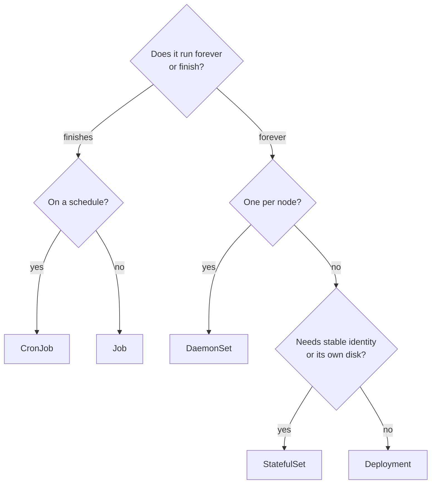
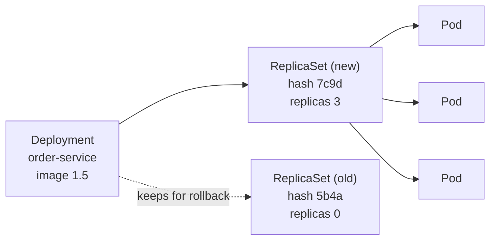
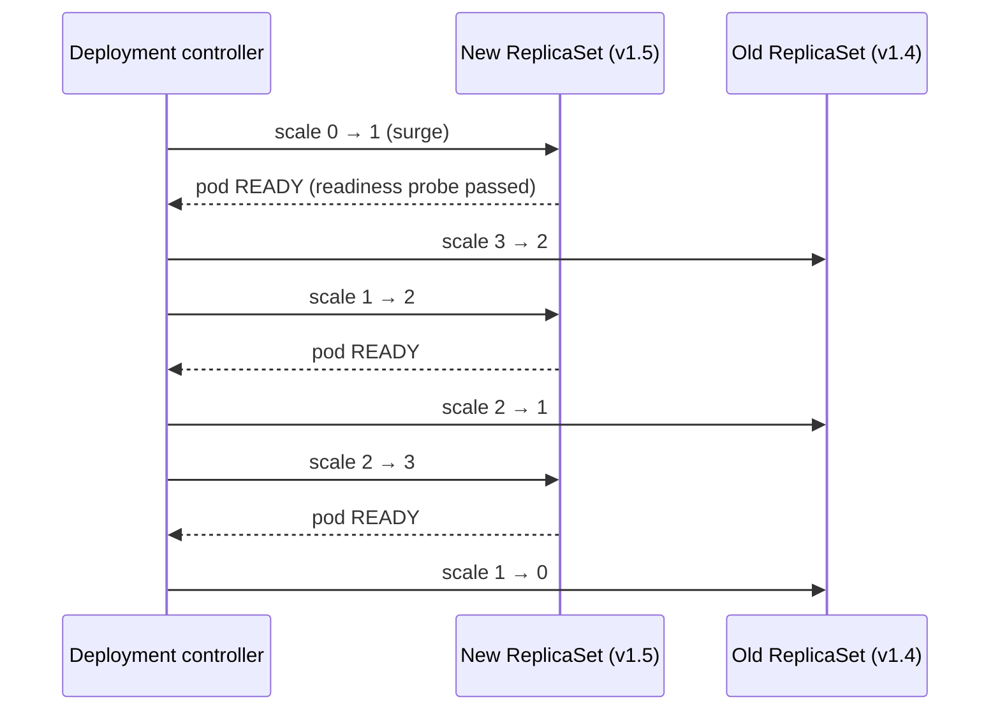

# Workloads — Deployments, StatefulSets, DaemonSets, Jobs

> **Kubernetes · Fundamentals** — You rarely create Pods yourself. You create a *controller* that creates and replaces Pods for you. Picking the right controller — and configuring its rollout — is most of day-to-day Kubernetes work.

---

## Table of Contents

1. The Staffing Agency Analogy
2. The Controller Family at a Glance
3. Deployments & ReplicaSets
4. Rolling Updates, Rollbacks & Zero Downtime
5. Deployment Strategies Beyond Rolling (Blue/Green, Canary)
6. StatefulSets — Identity and Stable Storage
7. DaemonSets — One Pod per Node
8. Jobs & CronJobs — Run to Completion
9. Scheduling Controls — Affinity, Taints, Spread, PDBs
10. Practice Assignments (Low / Medium / High)
11. Mini Project — Zero-Downtime Release Drill
12. Interview Corner
13. Quick Reference

---

## 1. The Staffing Agency Analogy

A hotel hires staff through an agency, and different roles need different contracts:

- **Front-desk clerks** are interchangeable: "always keep 5 on shift". If one leaves, anyone qualified replaces them. → **Deployment**
- **Department heads** each have a name, a desk, and their own filing cabinet; the new "Head of Finance #2" must get cabinet #2, not a random one. → **StatefulSet**
- **One security guard per building entrance** — every new entrance automatically gets a guard. → **DaemonSet**
- **The auditor** comes in, finishes the audit, and leaves. → **Job**
- **The night auditor** comes in every night at 2 AM. → **CronJob**

---

## 2. The Controller Family at a Glance

| Controller | Pod identity | Scaling | Storage | Use for |
|------------|--------------|---------|---------|---------|
| **Deployment** | Random names, interchangeable | Any order, parallel | Usually none (stateless) | REST APIs, web frontends, stateless workers |
| **StatefulSet** | Stable names `db-0`, `db-1`, stable DNS | Ordered (0, 1, 2...) by default | A PVC **per pod**, kept across restarts | Databases, Kafka, ZooKeeper, Elasticsearch |
| **DaemonSet** | One per (matching) node | Follows node count | Usually hostPath / none | Log agents, node exporters, CNI, CSI drivers |
| **Job** | Runs until N successful completions | Parallelism setting | Optional | Migrations, batch imports, one-off tasks |
| **CronJob** | Creates Jobs on a schedule | — | Optional | Nightly reports, cleanup, reconciliation |
| ReplicaSet | Interchangeable | — | — | Don't use directly; Deployments manage them |



---

## 3. Deployments & ReplicaSets



- A **Deployment** manages **ReplicaSets**; each ReplicaSet corresponds to one version of the pod template (identified by a hash).
- Changing the pod template (image, env, resources) creates a **new** ReplicaSet and shifts pods from old to new.
- Old ReplicaSets are kept (scaled to 0) for rollbacks — `revisionHistoryLimit` (default 10).

```yaml
apiVersion: apps/v1
kind: Deployment
metadata:
  name: order-service
  labels: { app.kubernetes.io/name: order-service }
spec:
  replicas: 3
  revisionHistoryLimit: 5
  selector:
    matchLabels: { app.kubernetes.io/name: order-service }   # immutable after creation!
  strategy:
    type: RollingUpdate
    rollingUpdate:
      maxSurge: 1          # at most 1 extra pod above desired during the update
      maxUnavailable: 0    # never go below desired capacity
  template:
    metadata:
      labels: { app.kubernetes.io/name: order-service }
    spec:
      containers:
        - name: app
          image: ghcr.io/shop/order-service:1.5
          ports: [{ containerPort: 8080 }]
          readinessProbe:
            httpGet: { path: /actuator/health/readiness, port: 8080 }
            periodSeconds: 5
```

<div class="callout-warn">

**Never use `:latest` in manifests.** Kubernetes only rolls out when the pod template *changes*. With `:latest`, pushing a new image changes nothing in the spec — no rollout, and different nodes may run different "latest" images depending on when they pulled. Use immutable tags (`1.5`, a git SHA) or digests.

</div>

---

## 4. Rolling Updates, Rollbacks & Zero Downtime

### How a rolling update proceeds (replicas 3, maxSurge 1, maxUnavailable 0)



The key dependency: **the rollout only advances when new pods become Ready.** A readiness probe that lies (always green) makes rolling updates unsafe; a missing one means pods receive traffic the moment the container starts, before Spring has finished booting.

### Commands

```bash
kubectl set image deployment/order-service app=ghcr.io/shop/order-service:1.5
kubectl rollout status deployment/order-service          # waits; non-zero exit on failure (use in CI)
kubectl rollout history deployment/order-service
kubectl rollout undo deployment/order-service            # back to the previous revision
kubectl rollout undo deployment/order-service --to-revision=3
kubectl rollout restart deployment/order-service         # re-create pods (e.g., to pick up a changed Secret)
kubectl rollout pause / resume deployment/order-service
```

| Setting | Effect |
|---------|--------|
| `maxSurge: 25%, maxUnavailable: 25%` (defaults) | Faster, but capacity can dip 25% during rollout |
| `maxSurge: 1, maxUnavailable: 0` | Never below capacity; needs spare cluster room for one extra pod |
| `minReadySeconds: 10` | A pod must stay Ready 10s before it counts — catches apps that crash shortly after start |
| `progressDeadlineSeconds: 600` | Rollout is marked failed if it makes no progress (CI can then roll back) |

<div class="callout-scenario">

**Scenario**: A bad release makes new pods crash on startup. With `maxUnavailable: 0`, what happens to users? **Answer**: Nothing visible: the first new pod never becomes Ready, so the controller never scales down the old ReplicaSet. Old pods keep serving; the rollout stalls and is marked failed after `progressDeadlineSeconds`. CI running `kubectl rollout status` fails, and you (or automation) run `kubectl rollout undo`. With `maxUnavailable: 25%`, you'd have lost a quarter of your capacity first.

</div>

<div class="callout-tip">

**Applying this** — Zero-downtime deploys need all four pieces together: (1) a truthful **readiness probe**, (2) `maxUnavailable: 0`, (3) **graceful shutdown** in the app (finish in-flight requests on SIGTERM) plus a short `preStop` delay so the pod is removed from load balancers before it stops accepting connections, and (4) backward-compatible changes (DB migrations that work with both old and new versions). See `k8s-spring-boot` for the Spring side.

</div>

---

## 5. Deployment Strategies Beyond Rolling

| Strategy | How | Pros | Cons | Tooling |
|----------|-----|------|------|---------|
| **Recreate** | Kill all old, then start new (`strategy.type: Recreate`) | Simple; never two versions at once | Downtime | Built in |
| **Rolling** | Gradually replace | Built in, no extra capacity (mostly) | Two versions serve simultaneously; slow rollback of a bad version that *looks* healthy | Built in |
| **Blue/Green** | Run full v2 beside v1, switch the Service selector | Instant switch and rollback | Double capacity during release | Two Deployments + selector switch, or Argo Rollouts |
| **Canary** | Send 5% → 25% → 100% of traffic to v2, watching metrics | Limits blast radius; data-driven | Needs traffic splitting + metrics analysis | Argo Rollouts, Flagger, service mesh, Gateway API weights |

<div class="callout-info">

**Recreate is the right choice** when two versions must never run at once — e.g., a singleton consumer that must not double-process, or an app holding an exclusive lock on a volume (`ReadWriteOnce` PVC). Accept the short downtime or redesign.

</div>

---

## 6. StatefulSets — Identity and Stable Storage

```yaml
apiVersion: apps/v1
kind: StatefulSet
metadata:
  name: kafka
spec:
  serviceName: kafka-headless            # headless Service gives each pod a DNS name
  replicas: 3
  selector:
    matchLabels: { app: kafka }
  template:
    metadata:
      labels: { app: kafka }
    spec:
      containers:
        - name: kafka
          image: apache/kafka:3.9.0
          volumeMounts:
            - { name: data, mountPath: /var/lib/kafka/data }
  volumeClaimTemplates:                  # one PVC per pod: data-kafka-0, data-kafka-1, ...
    - metadata: { name: data }
      spec:
        accessModes: [ReadWriteOnce]
        resources: { requests: { storage: 50Gi } }
```

What StatefulSets guarantee:

| Guarantee | Meaning |
|-----------|---------|
| Stable names | `kafka-0`, `kafka-1`, `kafka-2` — survive rescheduling |
| Stable DNS | `kafka-0.kafka-headless.<ns>.svc.cluster.local` |
| Stable storage | `kafka-1` always re-attaches PVC `data-kafka-1` |
| Ordered operations | Start 0→1→2, terminate in reverse, rolling updates from the highest ordinal down (configurable with `podManagementPolicy: Parallel`) |

<div class="callout-warn">

**A StatefulSet is not a database operator.** It gives identity and disks — not backups, failover, replication setup, or version upgrades. For production databases on Kubernetes use a mature **operator** (CloudNativePG, Strimzi for Kafka, the Elastic operator), or simply use a managed service (RDS, MSK, Cloud SQL). "Should we run Postgres on Kubernetes?" is usually answered: *managed service, unless you have a strong reason and an operator.*

</div>

---

## 7. DaemonSets — One Pod per Node

```yaml
apiVersion: apps/v1
kind: DaemonSet
metadata:
  name: log-agent
  namespace: monitoring
spec:
  selector:
    matchLabels: { app: log-agent }
  template:
    metadata:
      labels: { app: log-agent }
    spec:
      tolerations:
        - operator: Exists                  # also run on tainted nodes (e.g., control plane)
      containers:
        - name: fluent-bit
          image: fluent/fluent-bit:3.1
          volumeMounts:
            - { name: varlog, mountPath: /var/log, readOnly: true }
      volumes:
        - name: varlog
          hostPath: { path: /var/log }
```

Add a node → it gets a log-agent pod. Remove a node → its pod goes away. Use a `nodeSelector` to target only some nodes (e.g., GPU drivers only on GPU nodes).

---

## 8. Jobs & CronJobs — Run to Completion

```yaml
apiVersion: batch/v1
kind: Job
metadata:
  name: reindex-products
spec:
  completions: 10              # 10 successful pods needed in total
  parallelism: 3               # at most 3 at a time
  completionMode: Indexed      # each pod gets JOB_COMPLETION_INDEX 0..9 → process one shard each
  backoffLimit: 4              # retries before the Job is marked failed
  activeDeadlineSeconds: 3600  # hard timeout for the whole Job
  ttlSecondsAfterFinished: 86400
  template:
    spec:
      restartPolicy: Never     # Jobs need Never or OnFailure
      containers:
        - name: worker
          image: ghcr.io/shop/reindexer:2.1
```

```yaml
apiVersion: batch/v1
kind: CronJob
metadata:
  name: nightly-settlement
spec:
  schedule: "0 2 * * *"            # 02:00 every day
  timeZone: "Asia/Kolkata"         # otherwise the controller's timezone (usually UTC)
  concurrencyPolicy: Forbid        # don't start a new run if the last is still running
  startingDeadlineSeconds: 600     # skip the run if it couldn't start within 10 min
  successfulJobsHistoryLimit: 3
  failedJobsHistoryLimit: 5
  jobTemplate:
    spec:
      backoffLimit: 2
      template:
        spec:
          restartPolicy: OnFailure
          containers:
            - name: settle
              image: ghcr.io/shop/settlement:3.0
```

<div class="callout-scenario">

**Scenario**: The nightly settlement CronJob occasionally runs **twice**, double-posting ledger entries. **Answer**: Kubernetes CronJobs are designed to create *about* one Job per schedule, but a Job can run more than once (a pod retried after a node failure, or controller edge cases), and `concurrencyPolicy: Forbid` only prevents *overlapping* runs. The real fix is making the job **idempotent**: a settlement table with a unique key on `(settlement_date)`, or processing records by state (`status = PENDING` → `SETTLED` in a transaction) so a second run finds nothing to do. Never rely on a scheduler for exactly-once.

</div>

### Database migrations: Job vs app startup

| Approach | Pros | Cons |
|----------|------|------|
| Flyway/Liquibase on app startup | Simple | N replicas race (Flyway locks, but slows startup); long migrations fail probes |
| **Pre-deploy Job** (Helm hook / Argo CD PreSync) | Runs once, before new pods | More moving parts; needs expand/contract discipline |

---

## 9. Scheduling Controls — Affinity, Taints, Spread, PDBs

| Tool | Question it answers | Example |
|------|---------------------|---------|
| `nodeSelector` | "Only run on nodes with this label" | `disktype: ssd` |
| Node affinity | Same, with preferences and operators | Prefer spot nodes, require amd64 |
| Pod anti-affinity | "Don't put replicas together" | Spread replicas across nodes |
| **Topology spread constraints** | "Balance replicas across zones/nodes" | `maxSkew: 1` across `topology.kubernetes.io/zone` |
| Taints & tolerations | "Keep pods *off* these nodes unless they tolerate it" | GPU nodes, dedicated nodes |
| **PodDisruptionBudget** | "During voluntary disruptions, keep at least N running" | Node drains, cluster upgrades |
| PriorityClass | "Who gets evicted/preempted first?" | Payments > batch |

```yaml
# Spread replicas across availability zones
topologySpreadConstraints:
  - maxSkew: 1
    topologyKey: topology.kubernetes.io/zone
    whenUnsatisfiable: DoNotSchedule
    labelSelector:
      matchLabels: { app.kubernetes.io/name: order-service }
---
apiVersion: policy/v1
kind: PodDisruptionBudget
metadata:
  name: order-service-pdb
spec:
  minAvailable: 2          # a node drain waits rather than taking us below 2
  selector:
    matchLabels: { app.kubernetes.io/name: order-service }
```

<div class="callout-warn">

**PDB pitfalls**: `minAvailable: 3` with `replicas: 3` means **no** pod can ever be voluntarily evicted — node drains and cluster upgrades hang forever. Leave headroom (`maxUnavailable: 1` is often the safest form). And PDBs only cover *voluntary* disruptions (drains, upgrades) — not node crashes; that's what multiple replicas across zones are for.

</div>

---

## 10. 🏋️ Practice Assignments

### 🟢 Low — Build the reflexes

**L1.** Pick the controller: (a) a REST API with 4 replicas, (b) a Prometheus node exporter, (c) a 3-node ZooKeeper ensemble, (d) a weekly cleanup of old S3 files, (e) a one-time data backfill split into 20 shards.

<details>
<summary>Show answer</summary>

(a) Deployment. (b) DaemonSet. (c) StatefulSet (ideally via an operator, or a managed service). (d) CronJob. (e) Job with `completions: 20`, `completionMode: Indexed`, and a sensible `parallelism`.

</details>

**L2.** You changed only a ConfigMap that the app reads at startup, and nothing happened. Why? How do you roll it out?

<details>
<summary>Show answer</summary>

The Deployment's pod template didn't change, so no rollout is triggered; env vars from ConfigMaps are read only at container start. Options: `kubectl rollout restart deployment/<name>`; or add a checksum annotation of the config to the pod template (Helm's `checksum/config` pattern) so any config change changes the template and triggers a rollout; or use immutable, versioned ConfigMap names (`app-config-v7`, as Kustomize's generator does).

</details>

**L3.** What does `maxSurge: 0, maxUnavailable: 0` do?

<details>
<summary>Show answer</summary>

It's invalid — the API rejects it, because the rollout could never make progress (no extra pod allowed and none may be removed). At least one of the two must be greater than zero.

</details>

### 🟡 Medium — Apply it

**M1.** Write a Deployment for 3 replicas that (a) never drops below 3 ready pods during rollout, (b) spreads pods across zones, and (c) keeps at least 2 pods during node drains.

<details>
<summary>Show answer</summary>

Combine `strategy.rollingUpdate: { maxSurge: 1, maxUnavailable: 0 }` + a readiness probe; `topologySpreadConstraints` on `topology.kubernetes.io/zone` with `maxSkew: 1`; and a `PodDisruptionBudget` with `minAvailable: 2` (or `maxUnavailable: 1`) matching the same labels. Note the spread constraint with `DoNotSchedule` can leave pods Pending if a zone lacks capacity — use `ScheduleAnyway` if availability matters more than perfect balance.

</details>

**M2.** A CronJob that should run every 5 minutes sometimes runs for 8 minutes. Choose `concurrencyPolicy` values for (a) a report generator, (b) a job that syncs the latest prices from a partner API.

<details>
<summary>Show answer</summary>

(a) `Forbid` — skip a run rather than generate overlapping reports hammering the DB. (b) `Replace` — the newest run's data is what matters, so cancel the old slow run and start fresh. (`Allow` is only safe if runs are independent and idempotent.) Also investigate *why* it takes 8 minutes, and set `activeDeadlineSeconds` as a safety net.

</details>

**M3.** Your rollout is "stuck": `kubectl rollout status` has been waiting for 10 minutes. List the likely causes and the commands to find out.

<details>
<summary>Show answer</summary>

`kubectl get rs,pods -l app=...` and `kubectl describe pod <new-pod>`:
- New pods **Pending**: no capacity for the surge pod (requests too high, quota) → Events show "Insufficient cpu/memory".
- New pods **CrashLoopBackOff** / **ImagePullBackOff**: bad image or config → `kubectl logs --previous`.
- New pods Running but **not Ready**: failing readiness probe (wrong path/port, downstream dependency checked in readiness) → `describe` shows probe failures.
- A PDB or quota blocking replacement.
Then `kubectl rollout undo` if production is affected, and fix forward.

</details>

### 🔴 High — Think like a senior

**H1.** A release requires renaming a DB column `customer_name` → `full_name`. Design a zero-downtime rollout with rolling updates.

<details>
<summary>Show answer</summary>

Use **expand/contract** across several releases, because during a rolling update v1 and v2 pods run simultaneously against the same schema:

1. **Expand** (migration Job): add `full_name` (nullable). v1 is unaffected.
2. **Release A**: the app writes **both** columns and reads `full_name` falling back to `customer_name`. Roll out.
3. **Backfill Job**: copy `customer_name` → `full_name` in batches (idempotent, resumable).
4. **Release B**: read/write only `full_name`. Roll out.
5. **Contract** (a later release, after rollback risk passes): drop `customer_name`.

At every step, the old and new versions both work with the current schema, so rolling updates and rollbacks stay safe. Run migrations as pre-deploy Jobs, not on app startup.

</details>

**H2.** You operate Kafka on Kubernetes with a plain StatefulSet. A node dies and `kafka-1` is stuck `Pending` for 30 minutes. Explain why and what you'd change.

<details>
<summary>Show answer</summary>

`kafka-1` must re-attach its PVC `data-kafka-1`. With zonal block storage (EBS, Persistent Disk), that volume lives in **one availability zone**; if there's no schedulable node with capacity in that zone, the pod can't start anywhere else — Events show volume node affinity conflicts. There may also be a delay because the old pod isn't confirmed dead (a node that's merely unreachable keeps the pod in `Terminating`/`Unknown`, and the StatefulSet won't create a duplicate identity until it's gone).

Changes: node groups in every zone with headroom (or a cluster autoscaler configured per zone); `WaitForFirstConsumer` storage classes; topology spread so brokers are in different zones; rely on Kafka replication (RF=3, `min.insync.replicas=2`) so one broker down isn't an outage; use an operator (Strimzi) that understands Kafka's own recovery; document the runbook for force-deleting a pod on a truly dead node. Or move to a managed service (MSK / Confluent Cloud) if the team doesn't want to own this.

</details>

---

## 11. 🛠️ Mini Project — Zero-Downtime Release Drill

**Goal**: Prove, with numbers, that your rollout configuration really causes zero failed requests. 2 evenings.

**Build**

1. A small Spring Boot app (or reuse one) with `/api/version` returning its version and `/actuator/health/readiness`.
2. Deploy 3 replicas on kind with a Service.
3. Run continuous load during every release: `hey -z 120s -c 20 http://localhost:8080/api/version` (via `port-forward`, or better via an Ingress) and record non-2xx responses.
4. Release v1 → v2 four times with different settings, recording errors each time:
   - a. Defaults, **no** readiness probe.
   - b. Readiness probe added.
   - c. + `maxUnavailable: 0` and `minReadySeconds: 10`.
   - d. + graceful shutdown in Spring and a `preStop` sleep of 10s.
5. Release a deliberately broken v3 (crashes after 5 seconds). Show that (c)/(d) settings protect users, then `kubectl rollout undo`.
6. Add a Job that runs a Flyway migration before the deploy, and a CronJob that hits a cleanup endpoint every 5 minutes with `concurrencyPolicy: Forbid`.

**Deliverable**: a table — configuration → failed requests during rollout → rollout duration. Most people discover that (a) produces dozens of errors and (d) produces zero; being able to explain *why* is a strong interview answer.

---

## 🎯 Interview Corner

<div class="callout-interview">

**Q: "How does a rolling update work in Kubernetes, and how do you make it truly zero-downtime?"**

A Deployment change creates a new ReplicaSet, and the controller shifts pods from old to new, bounded by `maxSurge` (extra pods allowed) and `maxUnavailable` (pods allowed missing). It only proceeds when new pods pass their readiness probe. Zero downtime needs four things. A truthful readiness probe, so traffic only reaches pods that are actually ready. `maxUnavailable: 0`, so capacity never drops. Graceful shutdown: the app finishes in-flight requests on SIGTERM, plus a short preStop delay so endpoints are removed before it stops accepting connections. And backward-compatible changes, especially DB migrations with expand/contract, since both versions run at once. I'd also gate CI on `kubectl rollout status` and roll back automatically on failure.

**Follow-up trap**: "Readiness probe checks the database too — good idea?" → Usually not. If the DB blips, every pod goes unready at once, and the whole service disappears from the load balancer. Readiness should reflect whether this pod can serve, not the health of every dependency.

</div>

<div class="callout-interview">

**Q: "Deployment vs StatefulSet — when do you use each?"**

Deployments are for interchangeable pods: random names, no per-pod storage, scaled and replaced in any order — most APIs and workers. StatefulSets give each pod a stable identity: an ordinal name, a stable DNS entry through a headless Service, and its own PersistentVolumeClaim that follows it across rescheduling, with ordered start, stop, and updates. That's what clustered stateful systems need, like Kafka, ZooKeeper, or Elasticsearch. But a StatefulSet doesn't do backups, failover, or upgrades. For real databases I'd use an operator or, more often, a managed service.

</div>

<div class="callout-interview">

**Q: "How would you run a nightly batch job on Kubernetes safely?"**

As a CronJob with an explicit `timeZone`. I'd set `concurrencyPolicy: Forbid` so runs never overlap, `startingDeadlineSeconds` so a missed run doesn't fire hours late, `backoffLimit` and `activeDeadlineSeconds` for bounded retries and a timeout, and history limits for debugging. Most important, the job itself must be idempotent, because Kubernetes doesn't guarantee exactly-once execution: a pod can be retried after a node failure. I'd use a unique key per run date or state-based processing, so a duplicate run is harmless. I'd also add monitoring for the last successful completion time, because silent CronJob failures are common.

</div>

---

## Quick Reference

| Concept | One-Liner |
|---------|-----------|
| Deployment | Stateless, interchangeable pods; manages ReplicaSets |
| ReplicaSet | One per template version; kept for rollback |
| Rolling update | Bounded by `maxSurge`/`maxUnavailable`; advances on readiness |
| Rollback | `kubectl rollout undo` |
| Recreate | All old down, then new — when versions can't coexist |
| Canary / blue-green | Argo Rollouts, Flagger, mesh, Gateway API weights |
| StatefulSet | Stable name + DNS + PVC per pod; ordered ops |
| DaemonSet | One pod per node |
| Job | Run to completion; `completions`, `parallelism`, `backoffLimit` |
| CronJob | Scheduled Jobs; `concurrencyPolicy`, `timeZone`; make it idempotent |
| Spread & PDB | Topology spread across zones; PDB with headroom |
| Never | `:latest` tags in manifests |

---

## Related Topics

- `k8s-fundamentals` — reconciliation and the control plane
- `k8s-spring-boot` — probes and graceful shutdown for Spring apps
- `k8s-production` — autoscaling and resource management
- `distributed-transactions` — idempotency patterns for jobs and consumers

> **A Deployment is a promise about capacity during change. Readiness probes, surge settings, and graceful shutdown are how you keep that promise while the ground moves under your pods.**

---

<!-- journey-link:start -->

<div class="callout-journey">

🛒 **ShopNorth Journey** — ShopNorth uses Deployments in staging and Argo Rollouts canaries in production, protected by PodDisruptionBudgets.

**Continue the story:** [Chapter 12 · Deploying on Kubernetes](/tutorials/journey-12-kubernetes) · **New here?** [Start the journey](/tutorials/journey-start)

</div>

<!-- journey-link:end -->
