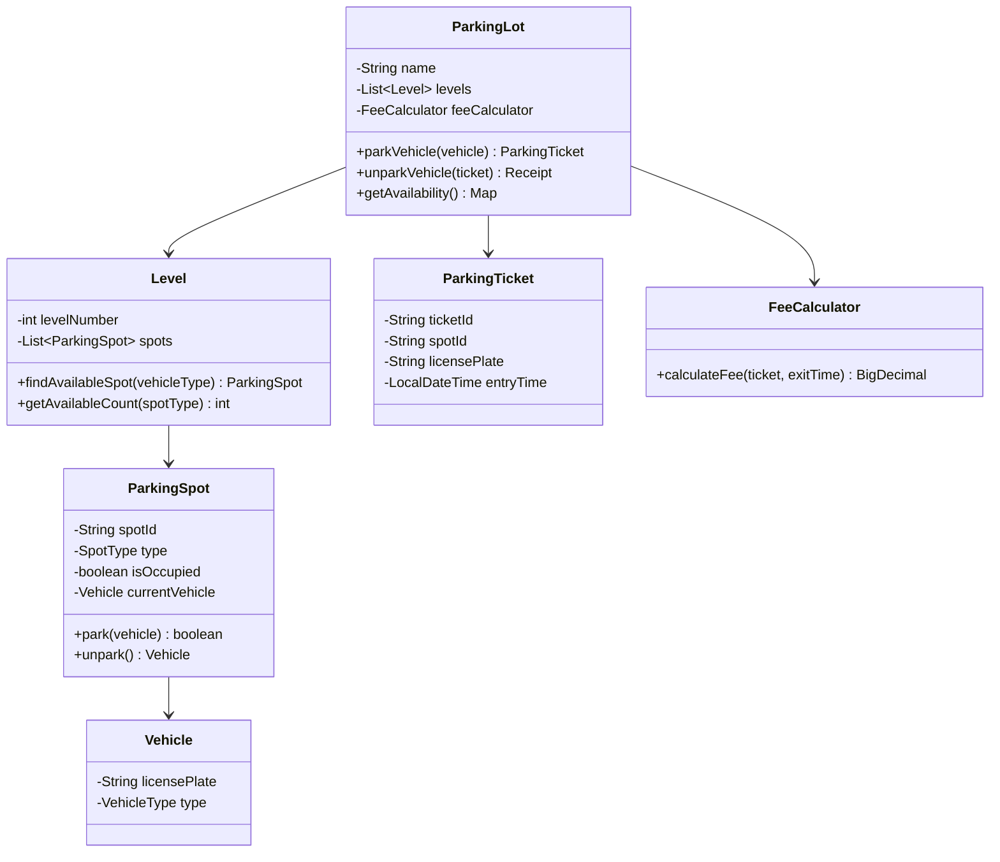

# Design Parking Lot System — The Hotel Room Booking Analogy

## The Hotel Analogy

A parking lot is like a hotel — different room types (single, double, suite) for different guests (motorcycle, car, bus). You need to check availability, assign the right room, track check-in/check-out, calculate billing, and handle the case where all rooms are full. The twist: guests arrive and leave unpredictably, and you need real-time availability.

---

## 1. Requirements

### Functional
- Multiple levels, each with multiple rows of spots
- Spot types: Compact, Regular, Large (for motorcycles, cars, buses)
- Assign nearest available spot of appropriate size
- Track entry/exit with timestamps
- Calculate parking fee based on duration and vehicle type
- Display real-time availability per level

### Non-Functional
- **Real-time**: Availability updates instantly on entry/exit
- **Concurrent**: Handle multiple vehicles entering/exiting simultaneously
- **Fair pricing**: Accurate billing, no overcharging

---

## 2. Class Design (LLD)



---

## 3. Spot Assignment Algorithm

```java
public ParkingSpot findBestSpot(VehicleType vehicleType) {
    SpotType requiredType = getMinimumSpotType(vehicleType);

    // Strategy: Find nearest spot of the smallest suitable type
    for (Level level : levels) {
        // First try exact match (don't waste large spots on small vehicles)
        ParkingSpot spot = level.findSpot(requiredType);
        if (spot != null) return spot;

        // If no exact match, try next larger type
        for (SpotType larger : SpotType.largerThan(requiredType)) {
            spot = level.findSpot(larger);
            if (spot != null) return spot;
        }
    }
    throw new ParkingFullException("No available spots for " + vehicleType);
}
```

<div class="callout-scenario">

**Scenario**: A motorcycle arrives but all compact spots are taken. Regular spots are available. **Decision**: Allow the motorcycle to use a regular spot, but prefer compact spots first. Never assign a compact spot to a bus. The assignment follows: smallest suitable spot → next larger → next larger. This maximizes lot utilization.

</div>

---

## 4. Pricing Strategy

```java
public BigDecimal calculateFee(ParkingTicket ticket, LocalDateTime exitTime) {
    long minutes = Duration.between(ticket.getEntryTime(), exitTime).toMinutes();
    long hours = (long) Math.ceil(minutes / 60.0);

    BigDecimal baseRate = getRatePerHour(ticket.getVehicleType());

    // First hour: full rate, subsequent hours: 80% rate
    BigDecimal fee = baseRate; // first hour
    if (hours > 1) {
        fee = fee.add(baseRate.multiply(BigDecimal.valueOf(0.8))
                              .multiply(BigDecimal.valueOf(hours - 1)));
    }

    // Daily cap
    BigDecimal dailyCap = getDailyCap(ticket.getVehicleType());
    return fee.min(dailyCap);
}
```

| Vehicle Type | Rate/Hour | Daily Cap |
|-------------|-----------|-----------|
| Motorcycle | ₹20 | ₹150 |
| Car | ₹40 | ₹300 |
| Bus | ₹100 | ₹800 |

---

## 5. Concurrency — Multiple Entries Simultaneously

```java
// Thread-safe spot assignment using CAS
public class ParkingSpot {
    private final AtomicReference<Vehicle> currentVehicle = new AtomicReference<>(null);

    public boolean park(Vehicle vehicle) {
        return currentVehicle.compareAndSet(null, vehicle); // atomic
    }

    public Vehicle unpark() {
        return currentVehicle.getAndSet(null);
    }
}
```

<div class="callout-tip">

**Applying this** — Use `AtomicReference.compareAndSet()` for lock-free spot assignment. Two vehicles arriving simultaneously both try to CAS the same spot — only one succeeds, the other retries with the next available spot. No locks, no deadlocks, high throughput.

</div>

---

<!-- practice-pack -->

## 🏢 More Real-World Scenarios

<div class="callout-scenario">

**Scenario**: A mall's parking system issues paper tickets at entry and charges at exit. On weekends, exit queues stretch for 20 minutes because every car stops at the booth, and lost tickets cause arguments at the barrier. **Decision**: Move to **ANPR (number-plate recognition)** at entry and exit plus pay-on-foot / app payment: the plate is the ticket, the session is opened at entry, the customer pays before returning to the car (kiosk or UPI/app), and the exit barrier opens automatically when the plate has a paid session with a grace period (e.g., 15 minutes). Keep a fallback for unreadable plates (manual lookup by entry time and photo).

</div>

## 🏋️ Practice Assignments

### 🟢 Low — Build the reflexes

**L1.** Which classes would you start with, and how are they related?

<details>
<summary>Show answer</summary>

`ParkingLot` has many `Level`s; each `Level` has many `ParkingSpot`s (composition). `ParkingSpot` has a `SpotType` (MOTORCYCLE, COMPACT, LARGE, EV) and a status. `Vehicle` is abstract with `Motorcycle`, `Car`, `Truck` subclasses (or a `VehicleType` enum). `Ticket` links vehicle, spot, and entry time. `EntryGate`/`ExitGate`, `PricingStrategy`, and `Payment` complete the model.

</details>

**L2.** Why use the Strategy pattern for pricing?

<details>
<summary>Show answer</summary>

Pricing rules change often and differ by lot (hourly, flat weekend rate, daily cap, first 30 minutes free, EV charging surcharge). A `PricingStrategy` interface with implementations lets you change or combine rules without modifying ticket or gate code (Open/Closed principle), and test each rule in isolation.

</details>

**L3.** How do you find a free spot of the right type quickly?

<details>
<summary>Show answer</summary>

Keep per-type collections of free spots (e.g., a `ConcurrentLinkedDeque` or priority queue ordered by distance from the entrance/elevator) per level, instead of scanning every spot. Parking removes a spot from the free set; leaving adds it back. Counts per type come for free and drive the display boards.

</details>

### 🟡 Medium — Apply it

**M1.** Calculate the fee: ₹40 for the first hour, ₹30 per extra hour (partial hours round up), daily cap ₹300, first 15 minutes free. A car parks for 3 h 10 min.

<details>
<summary>Show answer</summary>

Duration > 15 minutes, so charge from the start. 3 h 10 min rounds up to 4 billable hours → ₹40 + 3 × ₹30 = **₹130**, below the ₹300 cap. In code: compose strategies — `GracePeriodRule` → `HourlyRate` → `DailyCapRule` — and test edge cases (exactly 15 minutes, exactly 1 hour, multi-day stays where the cap applies per 24 h).

</details>

**M2.** Add EV charging spots and reservations. What changes in the model?

<details>
<summary>Show answer</summary>

`EV` spot type with a `Charger` (power rating, status) and a charging session billed per kWh in addition to parking time. A `Reservation` (spot type, time window, user, status) holds capacity: the allocator subtracts reserved spots from availability during their window, and releases a reservation after a no-show grace period. Overstay rules for EV spots (idle fees after charging completes) keep chargers available.

</details>

**M3.** Two entry gates assign spots at the same time. How do you avoid giving the same spot twice?

<details>
<summary>Show answer</summary>

Within one process: atomically take a spot from a concurrent free-set (`poll()` on a concurrent queue is atomic) or use compare-and-set on the spot's status (`AtomicReference<SpotStatus>`). Across processes/servers: a conditional DB update (`UPDATE spot SET status='OCCUPIED', ticket_id=? WHERE id=? AND status='FREE'` — check rows updated = 1) or a Redis `SPOP` from a set of free spots. Retry with another spot on failure.

</details>

### 🔴 High — Think like a senior

**H1.** Scale to a city-wide parking platform with 500 lots and a mobile app showing live availability.

<details>
<summary>Show answer</summary>

Each lot runs a local system (gates, sensors, ANPR) that keeps working offline and publishes events (entry, exit, spot occupied/free, payment) to a central platform via MQTT/Kafka. Central services: availability (per lot and type, in Redis, updated from events), reservations and payments, pricing configuration, and analytics. The app reads availability from a cached API (a few seconds of staleness is fine). Reservations must be confirmed by the lot's local system (capacity held locally) to avoid overbooking during network partitions; reconcile sessions and payments centrally.

</details>

**H2.** Design dynamic pricing for peak hours without upsetting customers.

<details>
<summary>Show answer</summary>

Price by occupancy band and time (e.g., +20% when occupancy > 85%), computed per lot every 15 minutes, with caps and minimum change intervals to avoid price flapping. The price is **locked at entry** (stored on the ticket/session) so a customer is never surprised at exit; display current prices at the entrance and in the app. A/B test or pilot in a few lots, measure occupancy smoothing and revenue, and keep pricing rules auditable for regulators or the mall's tenants.

</details>

## 🛠️ Mini Project — Parking Lot System (LLD to Running Service)

**Goal**: An interview-ready LLD that also runs as a service. 2-3 evenings.

**Build**

1. Java domain model: levels, spots, vehicle types, tickets, composable pricing rules (grace period, hourly, daily cap), and a spot allocator with per-type free sets.
2. Spring Boot API: `POST /entries` (plate, vehicle type → ticket + spot), `POST /exits` (fee calculation, payment stub), `GET /availability`.
3. Concurrency: 1,000 parallel entries against 500 spots — prove no spot is assigned twice and exactly 500 succeed.
4. Persist with PostgreSQL using conditional updates; then switch the allocator to Redis `SPOP` and compare throughput.
5. Unit tests for pricing edge cases.

**Acceptance criteria**: zero double allocations; pricing table of test cases in the README; class diagram matching the code.

---

## 🎯 Interview Corner

<div class="callout-interview">

**Q: "How would you handle the parking lot being full?"**

Multiple strategies: (1) **Display board** at entrance showing "FULL" — prevent vehicles from entering. (2) **Waitlist queue** — vehicle gets a notification when a spot opens. (3) **Reservation system** — allow pre-booking spots for a time window. (4) **Overflow routing** — direct to nearby partner parking lots. For the display board, use an event-driven approach — every park/unpark event updates a counter. The entrance gate checks the counter before allowing entry. Use Redis for the counter if multiple entrances need to share state.

**Follow-up trap**: "What about the race condition between checking availability and parking?" → The gate allows entry based on approximate availability. The actual spot assignment happens inside with CAS. If by the time the vehicle reaches a spot it's taken, they get the next available. The gate counter is eventually consistent — a vehicle might enter when the lot is technically full, but they'll find a spot within seconds as others leave.

</div>

<div class="callout-interview">

**Q: "How would you extend this to a smart parking system with sensors?"**

Each spot gets an IoT sensor (ultrasonic or magnetic) that detects vehicle presence. Sensors publish events to an MQTT broker → processed by a streaming service (Kafka) → updates the real-time availability database. Benefits: (1) Exact real-time availability (no relying on entry/exit counts). (2) Detect vehicles parked without tickets (enforcement). (3) Guide drivers to empty spots via LED indicators on each spot. (4) Analytics — peak hours, average duration, revenue optimization. The sensor data also enables dynamic pricing — charge more during peak hours, less during off-peak.

</div>

<div class="callout-interview">

**Q: "A car leaves without paying. Or the system crashes and loses which spot each car is in. How do you design for that?"**

Make the entry event the durable source of truth: write the ticket (plate photo, entry time, gate) to persistent storage before the barrier opens. Exit barriers open only for a paid session or a valid grace period, so "leaving without paying" requires tailgating. ANPR at exit records it, and the unpaid session goes to a follow-up flow (invoice to the registered owner, or a block on the next entry). If spot assignments are lost, rebuild occupancy from sensors where available, or reconcile from open tickets. Spot-level accuracy matters less than session accuracy, since billing depends on entry and exit times, not the spot.

**Follow-up trap**: "What if the database is down at entry?" → The gate controller has a local journal. It issues the ticket and stores the event locally, then syncs when the database recovers. Never trap cars outside because a central service is down.

</div>

---

## Quick Reference

| Concept | One-Liner |
|---------|-----------|
| Spot Assignment | Smallest suitable type first, then upgrade |
| CAS | Compare-And-Set for lock-free concurrent parking |
| Daily Cap | Maximum charge regardless of duration |
| Display Board | Real-time availability counter at entrance |
| Overflow Routing | Redirect to partner lots when full |

---

> **A parking lot system teaches you OOP fundamentals better than any textbook — inheritance (vehicle types), composition (lot → levels → spots), strategy pattern (pricing), and concurrency (multiple entries).**

---

<!-- journey-link:start -->

<div class="callout-journey">

🛒 **ShopNorth Journey** — Extra case study — pricing as composable strategies; ShopNorth's pricing engine uses the same Strategy pipeline for coupons and bank offers.

**Continue the story:** [Chapter 3 · Low-Level Design](/tutorials/journey-03-low-level-design) · **New here?** [Start the journey](/tutorials/journey-start)

</div>

<!-- journey-link:end -->
