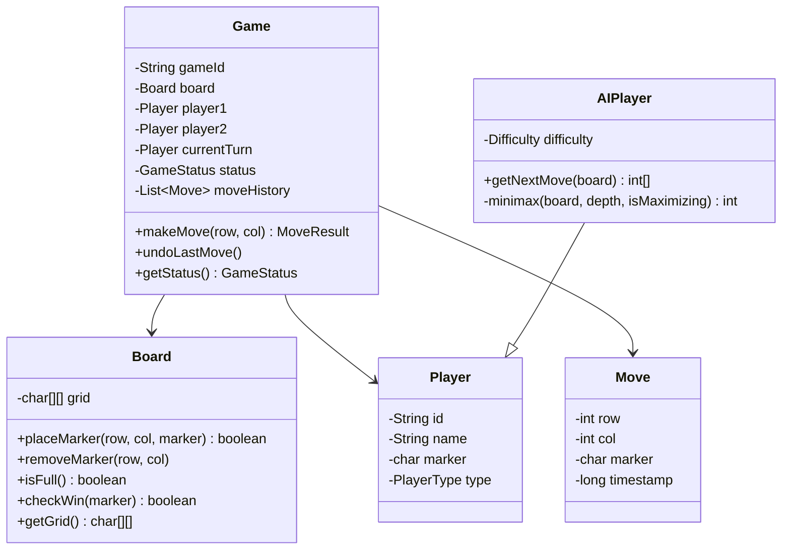
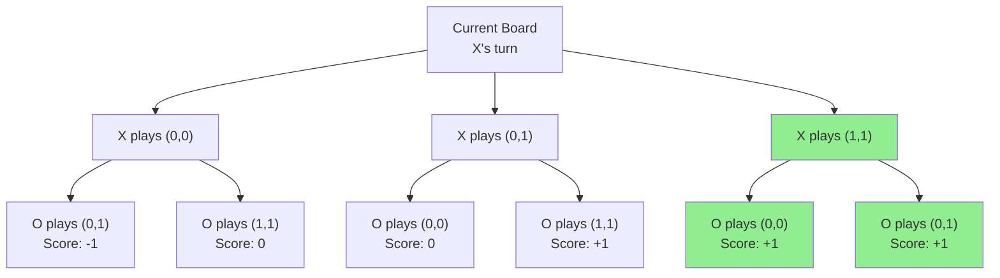
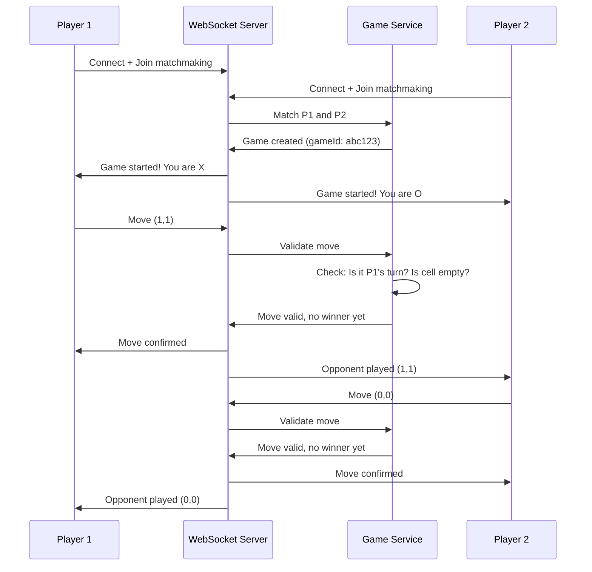

# Design Tic-Tac-Toe Game — The Strategy Board Analogy

## The Strategy Board Analogy

Tic-Tac-Toe seems simple — a 3×3 grid, two players, first to get three in a row wins. But designing it as a system reveals interesting challenges: game state management, AI opponents, win detection algorithms, and if you make it multiplayer online — real-time synchronization, cheating prevention, and matchmaking.

---

## 1. Requirements

### Functional
- Two-player game (Human vs Human or Human vs Computer)
- 3×3 grid, players alternate placing X and O
- Detect win (row/column/diagonal), draw, or ongoing
- Support undo/redo moves
- Online multiplayer with matchmaking

### Non-Functional
- **Real-time**: Move reflected on opponent's screen in < 100ms
- **Fair**: Prevent cheating (playing out of turn, modifying board)
- **Scalable**: Support thousands of concurrent games

---

## 2. Class Design (LLD)



---

## 3. Win Detection — The O(1) Approach

### Naive: Check All Lines After Every Move — O(n²)

```java
// ❌ Checks all rows, columns, diagonals every time
public boolean checkWin(char[][] grid, char marker) {
    // Check rows, columns, diagonals...
    // Works but inefficient for larger boards
}
```

### Smart: Track Counts — O(1) Per Move

```java
public class WinDetector {
    private int[] rowCounts;    // sum per row
    private int[] colCounts;    // sum per column
    private int diagCount;       // main diagonal sum
    private int antiDiagCount;   // anti-diagonal sum
    private int n;

    public WinDetector(int size) {
        this.n = size;
        rowCounts = new int[n];
        colCounts = new int[n];
    }

    // Returns true if this move wins
    public boolean recordMove(int row, int col, char marker) {
        int value = (marker == 'X') ? 1 : -1;

        rowCounts[row] += value;
        colCounts[col] += value;
        if (row == col) diagCount += value;
        if (row + col == n - 1) antiDiagCount += value;

        // Win if any line sums to +n (X wins) or -n (O wins)
        return Math.abs(rowCounts[row]) == n
            || Math.abs(colCounts[col]) == n
            || Math.abs(diagCount) == n
            || Math.abs(antiDiagCount) == n;
    }
}
```

<div class="callout-info">

**Key insight**: Instead of scanning the entire board, track running sums. X adds +1, O adds -1. If any row/column/diagonal sum reaches +3 or -3, that player wins. This is O(1) per move regardless of board size.

</div>

---

## 4. AI Opponent — Minimax Algorithm



```java
public int minimax(char[][] board, int depth, boolean isMaximizing) {
    if (checkWin(board, 'X')) return 10 - depth;  // X wins (AI), prefer faster wins
    if (checkWin(board, 'O')) return depth - 10;   // O wins (human), prefer slower losses
    if (isBoardFull(board)) return 0;              // Draw

    if (isMaximizing) {
        int bestScore = Integer.MIN_VALUE;
        for (int[] move : getAvailableMoves(board)) {
            board[move[0]][move[1]] = 'X';
            int score = minimax(board, depth + 1, false);
            board[move[0]][move[1]] = ' '; // undo
            bestScore = Math.max(bestScore, score);
        }
        return bestScore;
    } else {
        int bestScore = Integer.MAX_VALUE;
        for (int[] move : getAvailableMoves(board)) {
            board[move[0]][move[1]] = 'O';
            int score = minimax(board, depth + 1, true);
            board[move[0]][move[1]] = ' '; // undo
            bestScore = Math.min(bestScore, score);
        }
        return bestScore;
    }
}
```

<div class="callout-scenario">

**Scenario**: Both players play optimally in Tic-Tac-Toe. **Decision**: The game ALWAYS ends in a draw. Minimax proves this mathematically. That's why Tic-Tac-Toe is a "solved game." For difficulty levels: Easy = random moves, Medium = minimax with depth limit, Hard = full minimax (unbeatable).

</div>

---

## 5. Online Multiplayer Architecture



<div class="callout-tip">

**Applying this** — NEVER trust the client. All game logic (turn validation, win detection, move legality) must happen on the server. The client only sends "I want to place at (row, col)." The server validates and broadcasts the result. This prevents cheating.

</div>

---

<!-- practice-pack -->

## 🏢 More Real-World Scenarios

<div class="callout-scenario">

**Scenario**: A casual-games company launches online tic-tac-toe with move validation only in the mobile app. Within a week, modified clients make two moves per turn and overwrite opponents' cells, and leaderboards fill with impossible win streaks. **Decision**: The server is the single authority on game state. Clients send *intents* ("place at row 1, col 2, move #5"); the server validates turn order, cell emptiness, and game status, applies the move, and broadcasts the new state. Including a move sequence number makes retries idempotent and rejects stale or replayed moves.

</div>

## 🏋️ Practice Assignments

### 🟢 Low — Build the reflexes

**L1.** How does the O(1) win check work, and what does it store?

<details>
<summary>Show answer</summary>

Keep counters per row, per column, and for the two diagonals. Player X adds +1, player O adds −1 to the counters for the cell they play. If any counter reaches +n or −n after a move, that player won. Each move updates at most 4 counters, so the check is O(1) time with O(n) space instead of scanning the board.

</details>

**L2.** Which design patterns fit naturally in this LLD?

<details>
<summary>Show answer</summary>

**Strategy** for player types (`HumanPlayer`, `RandomAI`, `MinimaxAI` behind a `MoveStrategy`), **State** for game lifecycle (`WAITING_FOR_PLAYERS`, `IN_PROGRESS`, `WON`, `DRAW`, `ABANDONED`), **Observer** to notify UIs or spectators of moves, and optionally **Command** for moves (enables undo/replay).

</details>

**L3.** When is a game a draw, and can you detect it early?

<details>
<summary>Show answer</summary>

Simplest: the board is full and no one won (move count = n²). Early detection: if every row, column, and diagonal already contains both an X and an O, nobody can win — declare a draw before the board fills. Track a "blocked lines" count to do this in O(1) per move.

</details>

### 🟡 Medium — Apply it

**M1.** Add undo to the game without breaking the O(1) win check.

<details>
<summary>Show answer</summary>

Represent each move as a `Move` command (player, row, col) and keep a stack. Undo pops the last move, clears the cell, reverses the counter updates (−1 for X's counters, +1 for O's), decrements the move count, and switches the turn back. Because the counters are additive, undo is the exact inverse. Disallow undo after the game ends, or reopen the game state if you allow it.

</details>

**M2.** Minimax on 3×3 is instant, but on 4×4 it's slow. What do you do?

<details>
<summary>Show answer</summary>

Add **alpha-beta pruning** (same result, far fewer nodes), **memoization** of board states (transposition table keyed by a board hash, e.g., Zobrist hashing), move ordering (try center and winning/blocking moves first so pruning kicks in earlier), and a **depth limit** with a heuristic evaluation (count open lines per player) for larger boards. For something like 15×15 Gomoku, use threat-based search or Monte Carlo Tree Search instead of full minimax.

</details>

**M3.** Design the REST/WebSocket API for online play.

<details>
<summary>Show answer</summary>

`POST /games` (create, returns game ID and invite code), `POST /games/{id}/join`, `GET /games/{id}` (full state for reconnects), and a WebSocket channel `/games/{id}/stream`. Client sends `{type: "MOVE", moveNumber: 5, row: 1, col: 2}`; server replies with `MOVE_APPLIED` broadcast or `MOVE_REJECTED` with a reason. Server events: `PLAYER_JOINED`, `MOVE_APPLIED`, `GAME_OVER`, `OPPONENT_DISCONNECTED`, `TURN_TIMEOUT`.

</details>

### 🔴 High — Think like a senior

**H1.** Scale online play to 1 million concurrent games across many servers.

<details>
<summary>Show answer</summary>

Games are small and independent, so shard by game ID: each game lives on one server (in memory, with state persisted to Redis or a DB after each move for failover). A routing layer (consistent hashing on game ID, or a registry in Redis) sends both players' WebSocket connections to the owning server — or connections land anywhere and moves are forwarded via pub/sub on the game's channel. On server failure, another server loads the game from the store and players reconnect. Matchmaking is a separate service with its own queue.

</details>

**H2.** Design a ranked mode with an Elo rating and anti-cheating.

<details>
<summary>Show answer</summary>

After each ranked game, update both ratings: expected score `E = 1 / (1 + 10^((Rb − Ra)/400))`, new rating `Ra' = Ra + K × (S − E)` (S is 1 win, 0.5 draw, 0 loss), in one transaction with the game result (idempotent by game ID). Matchmaking pairs players within a rating band that widens over waiting time. Anti-cheating: server-authoritative moves, flag accounts that repeatedly play the same opponent (win trading), abnormal win rates against strong players, or moves that always match engine output with suspiciously consistent timing.

</details>

## 🛠️ Mini Project — Online Tic-Tac-Toe with Unbeatable AI

**Goal**: Clean LLD plus a real-time server. 2-3 evenings.

**Build**

1. Java core library: `Board` (n×n), O(1) win detection, `Player` + `MoveStrategy`, minimax with alpha-beta and memoization.
2. Spring Boot WebSocket server: create/join games, server-side move validation with move numbers, turn timeouts (30 s), and reconnect via `GET /games/{id}`.
3. A small web client (React or plain JS) with a "play vs AI" mode.
4. Tests: every win line on 3×3 and 4×4, undo correctness, rejected moves (wrong turn, occupied cell, stale move number), and "AI never loses" over all possible human move sequences on 3×3.

**Acceptance criteria**: the AI never loses in exhaustive tests; a modified client can't make illegal moves; README with the class diagram.

---

## 🎯 Interview Corner

<div class="callout-interview">

**Q: "How would you extend this to a larger board (e.g., 15×15 Gomoku — five in a row)?"**

The O(1) win detection with row/column sums doesn't work for "five in a row" on a 15×15 board because you need consecutive marks, not just total count. I'd switch to checking only the lines passing through the last move — 4 directions (horizontal, vertical, two diagonals), count consecutive marks in each direction from the placed position. This is O(k) where k is the win length (5), not O(n²). For the AI, minimax is too slow for 15×15 (225 cells). I'd use Alpha-Beta pruning to cut the search tree, limit depth to 4-5 moves ahead, and use a heuristic evaluation function that scores board positions based on open-ended sequences.

**Follow-up trap**: "What's the time complexity of minimax for Tic-Tac-Toe?" → O(9!) in the worst case = 362,880 states. With alpha-beta pruning, it drops to ~O(9^(9/2)) ≈ ~20,000 states. For 3×3, even brute force is instant. For larger boards, pruning is essential.

</div>

<div class="callout-interview">

**Q: "How do you handle a player disconnecting mid-game?"**

Start a reconnection timer (30 seconds). If the player reconnects within the window, restore the game state from the server (server is the source of truth). If they don't reconnect, the opponent wins by forfeit. For the reconnecting player, send the full game state (board, whose turn, move history) so they can resume seamlessly. Use WebSocket heartbeats (ping/pong every 5 seconds) to detect disconnections quickly rather than waiting for TCP timeout.

</div>

<div class="callout-interview">

**Q: "Your minimax AI is unbeatable. Product wants Easy, Medium, and Hard difficulty levels. How do you design that?"**

Keep one `MoveStrategy` interface and vary the behavior, not the game logic. Easy picks a random legal move, but takes an immediate win if one exists so it doesn't feel broken. Medium uses minimax with a shallow depth limit, or plays the best move only 60-70% of the time. Hard is full minimax with alpha-beta. A `StrategyFactory` maps the difficulty to an implementation, so adding "Expert" later doesn't touch the game engine. Tune the difficulty from data: aim for target win rates per level by measuring real games.

**Follow-up trap**: "Won't random moves look obviously dumb?" → Use weighted randomness instead: score all moves with minimax and pick from the top few with probabilities. The AI makes plausible mistakes rather than absurd ones.

</div>

<div class="callout-interview">

**Q: "Two moves from the same player arrive at the server at nearly the same time. How do you keep the game state correct?"**

Process all moves for a game sequentially. Either one actor/thread owns each game (a single-threaded event loop per game), or the server applies a conditional update: the move is accepted only if `moveNumber == state.moveCount + 1` and it's that player's turn, checked and applied atomically (synchronized on the game, or a compare-and-set in Redis with a Lua script). The second move fails validation and is rejected with the current state, so the client can resync. Sequence numbers also make client retries safe.

</div>

---

## Quick Reference

| Concept | One-Liner |
|---------|-----------|
| Minimax | Algorithm that assumes both players play optimally |
| Alpha-Beta Pruning | Optimization that skips branches that can't affect the result |
| O(1) Win Detection | Track row/col/diagonal sums instead of scanning board |
| Server Authority | All game logic validated server-side to prevent cheating |
| WebSocket | Bidirectional real-time communication for multiplayer |
| Solved Game | Tic-Tac-Toe always draws with optimal play from both sides |

---

> **Tic-Tac-Toe teaches you more about system design than you'd expect — state machines, AI algorithms, real-time sync, and the golden rule: never trust the client.**

---

<!-- journey-link:start -->

<div class="callout-journey">

🛒 **ShopNorth Journey** — Extra case study — the server is the single authority on game state, just as ShopNorth never trusts prices or identities sent by the client.

**Continue the story:** [Chapter 7 · Security & Login](/tutorials/journey-07-security) · **New here?** [Start the journey](/tutorials/journey-start)

</div>

<!-- journey-link:end -->
