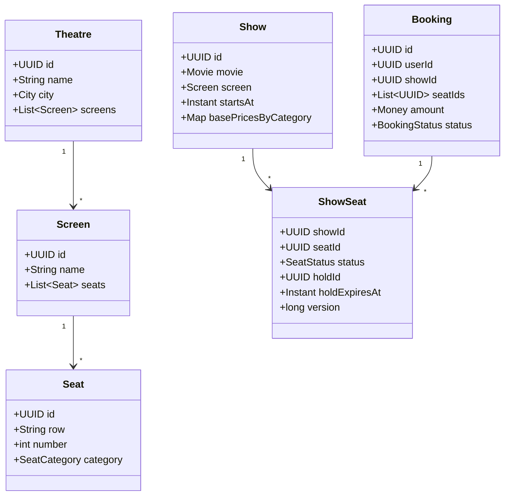
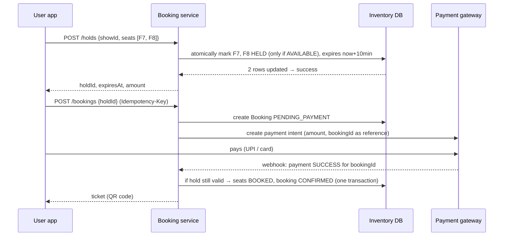
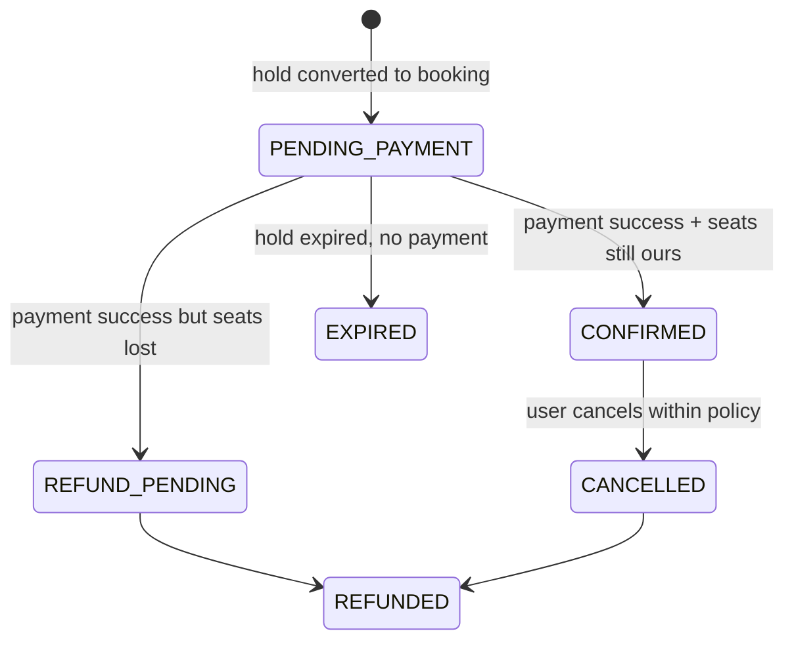
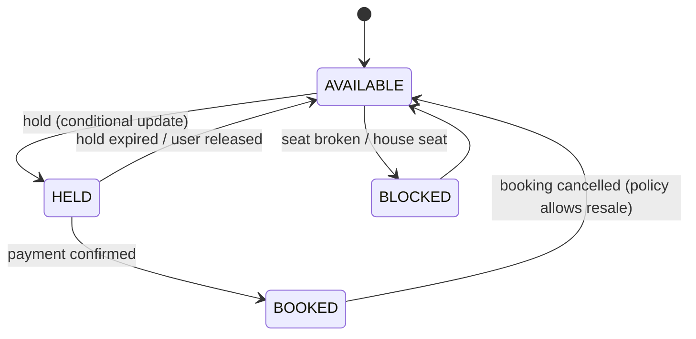

# Design BookMyShow — Seat Booking Without Double-Booking

<!-- sdlc-stage:start -->
<div class="sdlc-stage">

📍 **SDLC stage: Design — low-level design** · ShopNorth uses this in [Chapter 3 · Low-Level Design](/tutorials/journey-03-low-level-design)

</div>
<!-- sdlc-stage:end -->

> **Low-Level Design · Classic LLD** — The interviewer doesn't care about your `Movie` class. They care about one moment: two people tap the same seat at the same second. This design gets the model right *and* answers the concurrency, payment-timeout, and idempotency questions that decide the round.

---

## Table of Contents

1. The Theatre Box Office Analogy
2. Requirements & Clarifying Questions
3. Domain Model
4. The Booking Flow — Hold, Pay, Confirm
5. Concurrency: Preventing Double Booking (3 Approaches)
6. Seat Holds & Expiry
7. Payment Integration, Timeouts & Idempotency
8. Pricing (Strategy) and Notifications (Observer)
9. State Machines
10. Scaling for a Blockbuster Release
11. Practice Assignments (Low / Medium / High)
12. Mini Project — Seat Booking Service with a Concurrency Test
13. Interview Corner
14. Quick Reference

---

## 1. The Theatre Box Office Analogy

At an old theatre box office, you point at seat F7 on the paper chart. The clerk puts a **pencil mark** on F7 and says: *"I'll hold it for 10 minutes while you get cash."*

- Someone else asking for F7 is told it's taken — even though you haven't paid.
- If you come back with cash in time, the clerk **inks** the mark: sold.
- If you don't come back, the clerk **erases** the pencil mark and F7 is free again.

That's the whole design: **hold (pencil) → pay → confirm (ink), with expiry.** Everything else is making the pencil-mark step safe when thousands of clerks share one chart.

---

## 2. Requirements & Clarifying Questions

**Functional**

- Browse cities → theatres → screens → shows (movie + screen + start time).
- View the seat map with availability and prices per seat category.
- Select up to N seats, hold them for a limited time, pay, confirm, get a ticket.
- Cancel/refund per policy.

**Non-functional**

- **Never** sell the same seat twice.
- Holds expire automatically; abandoned carts release seats.
- Handle flash traffic (a blockbuster's first-day-first-show opening).

| Clarifying question | Impact |
|---------------------|--------|
| Max seats per booking? | Validation, hold size |
| Hold duration? | 5-10 min typical; drives expiry design |
| Can users pick seats, or best-available auto-assign? | Seat selection UI vs allocation algorithm |
| Payment inside our system or external gateway? | Timeouts, webhooks, reconciliation |
| Multiple channels (app, web, box office, partners)? | All must go through the same inventory service |

---

## 3. Domain Model



The key modeling insight: **a `Seat` is physical and permanent; a `ShowSeat` is that seat for one specific show** — that's what gets held and sold. A screen with 200 seats and 5 shows a day has 1,000 `ShowSeat` rows per day.

<div class="callout-info">

**Enums you'll need**: `SeatCategory { RECLINER, PREMIUM, REGULAR }`, `SeatStatus { AVAILABLE, HELD, BOOKED, BLOCKED }` (blocked = broken seat or house seat), `BookingStatus { PENDING_PAYMENT, CONFIRMED, EXPIRED, CANCELLED, REFUNDED }`.

</div>

---

## 4. The Booking Flow — Hold, Pay, Confirm



---

## 5. Concurrency: Preventing Double Booking (3 Approaches)

### Approach 1 — Conditional update (optimistic, the default choice)

```sql
UPDATE show_seats
SET status = 'HELD', hold_id = :holdId, hold_expires_at = now() + interval '10 minutes'
WHERE show_id = :showId
  AND seat_id IN (:seatIds)
  AND (status = 'AVAILABLE' OR (status = 'HELD' AND hold_expires_at < now()));   -- expired holds are reclaimable
```

In the same transaction, check the **row count**: if it's less than the number of requested seats, someone else got at least one seat → **roll back** and tell the user which seats are gone. The database's row locking guarantees only one transaction can flip a given row from AVAILABLE to HELD.

```java
@Transactional
public Hold hold(UUID showId, List<UUID> seatIds, UUID userId) {
    if (seatIds.size() > MAX_SEATS) throw new TooManySeatsException();
    List<UUID> sorted = seatIds.stream().sorted().toList();           // consistent order avoids deadlocks
    UUID holdId = UUID.randomUUID();
    int updated = showSeatRepo.holdIfAvailable(showId, sorted, holdId, clock.instant().plus(HOLD_TTL));
    if (updated != sorted.size()) {
        throw new SeatsUnavailableException(showSeatRepo.unavailableAmong(showId, sorted));  // triggers rollback
    }
    return new Hold(holdId, showId, sorted, userId, clock.instant().plus(HOLD_TTL));
}
```

### Approach 2 — Pessimistic locking

`SELECT ... FROM show_seats WHERE show_id = ? AND seat_id IN (...) ORDER BY seat_id FOR UPDATE NOWAIT` → check they're all available → update. `NOWAIT` (or a short lock timeout) fails fast instead of queueing users behind each other. Lock rows in a consistent order to avoid deadlocks.

### Approach 3 — Distributed lock / cache (Redis) in front of the DB

`SET seat:{showId}:{seatId} {holdId} NX EX 600` for each seat (via a Lua script, so all-or-nothing). Very fast for hot shows, but Redis becomes the source of truth for holds — you then need the DB write at confirmation to still be protected (unique constraint), because Redis isn't your system of record.

| Approach | Pros | Cons |
|----------|------|------|
| Conditional UPDATE | Simple, correct, no extra infra | DB load on hot shows |
| SELECT FOR UPDATE NOWAIT | Explicit; easy to reason about | Holds locks during the transaction |
| Redis holds + DB constraint | Absorbs huge spikes | Two sources of truth; more failure modes |

### The last line of defense — a unique constraint

```sql
-- A seat can belong to at most one confirmed booking per show
CREATE UNIQUE INDEX uq_booked_seat ON booking_seats (show_id, seat_id) WHERE status = 'CONFIRMED';
```

<div class="callout-interview">

**Q: "How do you prevent two users from booking the same seat?"**

Holding a seat is an atomic conditional update: set the show-seat rows to HELD only where they're still available or their hold has expired, then check the affected row count equals the number of seats requested, rolling back otherwise. The database's row locking means only one transaction can win each seat. I lock seats in a consistent order to avoid deadlocks, and back it with a unique constraint on confirmed bookings per show and seat as a last line of defense. For extreme spikes, Redis can front the holds, but the database constraint stays the source of truth.

</div>

---

## 6. Seat Holds & Expiry

Holds must disappear when users abandon checkout.

| Mechanism | How | Notes |
|-----------|-----|-------|
| **Lazy expiry** | Treat `HELD` with `hold_expires_at < now()` as available in the hold query (section 5) | Correct even if no job runs — the key property |
| **Sweeper job** | Every minute: `UPDATE show_seats SET status='AVAILABLE', hold_id=NULL WHERE status='HELD' AND hold_expires_at < now()` | Keeps the seat map accurate for browsing |
| Redis TTL | Key expires automatically | If using Redis holds |
| Delay queue | Schedule "release hold X at T" | More moving parts |

<div class="callout-warn">

**Clock skew and "expired at the payment moment"**: a user pays at 9:59 for a hold expiring at 10:00, and the payment webhook arrives at 10:01. Don't reject blindly. On confirmation: if the seats are still held by *this* hold (nobody else took them), confirm — the grace is harmless. If they were re-sold, **auto-refund** and notify. Always base expiry on the server's clock (`Clock` injected), never the client's.

</div>

---

## 7. Payment Integration, Timeouts & Idempotency



| Problem | Solution |
|---------|----------|
| User double-taps "Pay" | `Idempotency-Key` on `POST /bookings`; one booking per hold (unique `hold_id`) |
| Gateway sends the webhook twice | Process webhooks idempotently by payment ID (store processed IDs with a unique constraint) |
| Webhook never arrives | A reconciliation job polls the gateway for bookings stuck in `PENDING_PAYMENT` past N minutes |
| Payment succeeds after the hold expired and seats are resold | Transition to `REFUND_PENDING`, trigger refund automatically, notify the user |
| Webhook spoofing | Verify the gateway's signature on every webhook |

```java
@Transactional
public void onPaymentSucceeded(PaymentEvent evt) {
    if (!processedPayments.markProcessed(evt.paymentId())) return;         // duplicate webhook → no-op
    Booking booking = bookings.findForUpdate(evt.bookingId()).orElseThrow();
    if (booking.status() != BookingStatus.PENDING_PAYMENT) return;         // already handled
    int confirmed = showSeatRepo.confirmIfHeldBy(booking.showId(), booking.seatIds(), booking.holdId());
    if (confirmed == booking.seatIds().size()) {
        booking.confirm(evt.paymentId());
        events.publish(new BookingConfirmed(booking.id()));                // ticket email/SMS via outbox
    } else {
        booking.markRefundPending(evt.paymentId());
        events.publish(new RefundRequested(booking.id(), evt.paymentId()));
    }
}
```

---

## 8. Pricing (Strategy) and Notifications (Observer)

```java
public interface PricingRule { Money apply(Money current, PricingContext ctx); }

// Base price per seat category → weekend surcharge → dynamic demand → coupon → convenience fee + GST
List<PricingRule> pipeline = List.of(
    new CategoryBasePrice(), new WeekendSurcharge(Percent.of(10)),
    new DemandBasedPricing(occupancyService), new CouponDiscount(couponService),
    new ConvenienceFeeAndTax());
```

Compute the price **at hold time** and store it on the hold/booking — the user must pay the price they saw, even if dynamic pricing changes a minute later.

Notifications follow the **Observer** idea at the service level: `BookingConfirmed` events are published (via a transactional outbox so they're not lost) and consumed by ticket-email, SMS, loyalty-points, and analytics listeners — the booking service doesn't know or wait for them.

---

## 9. State Machines



Encode transitions in one place (the `ShowSeat` entity or the SQL `WHERE` clauses) so no code path can move a seat from BOOKED to HELD.

---

## 10. Scaling for a Blockbuster Release

When a major film's advance booking opens, 2 million users hit a few thousand shows in minutes.

| Technique | Why |
|-----------|-----|
| **Virtual waiting room** | Admit users in batches; protects every downstream system |
| Cache seat maps (short TTL, a few seconds) | Browsing is 100x more frequent than holding; exact state is checked at hold time anyway |
| Partition inventory by show | Hot shows don't lock each other; route by `show_id` |
| Rate limit holds per user/device | Stops scalpers' bots from holding everything |
| Limit active holds per user | One hold at a time per show |
| Async ticket generation & notifications | Keep the confirmation path short |
| Pre-scale and load test | The opening time is known in advance |

<div class="callout-scenario">

**Scenario**: At booking launch, bots hold every seat for 10 minutes, release, and hold again, so real fans never see availability. **Decision**: Per-account and per-device hold limits, CAPTCHA or device attestation at the hold step, shorter hold TTLs for hot shows, rate limiting by IP/device fingerprint, a queue (waiting room) with one active session per verified account, and anomaly detection on hold→payment conversion rates. Inventory fairness is a product requirement, not just a technical one.

</div>

---

## 11. 🏋️ Practice Assignments

### 🟢 Low — Build the reflexes

**L1.** Why model `ShowSeat` separately from `Seat`?

<details>
<summary>Show answer</summary>

A `Seat` is physical (row F, number 7, category) and exists across all shows. Availability, holds, and bookings are per **show**, so the state lives on `ShowSeat` (show + seat). Putting status on `Seat` would make one show's booking block the seat for every show.

</details>

**L2.** A user holds seats and closes the app. Without any background job running, how are the seats released?

<details>
<summary>Show answer</summary>

**Lazy expiry**: the hold query treats `HELD` seats whose `hold_expires_at` is in the past as available, so the next user can take them. A sweeper job is only needed to keep the seat map display accurate.

</details>

**L3.** Which constraint guarantees no seat is ever confirmed twice for the same show, even if application code has a bug?

<details>
<summary>Show answer</summary>

A unique index on `(show_id, seat_id)` for confirmed bookings (e.g., a partial unique index `WHERE status = 'CONFIRMED'`, or a unique constraint on a `booking_seats` table containing only active bookings).

</details>

### 🟡 Medium — Apply it

**M1.** Two users request overlapping seats at the same time: A wants [F7, F8], B wants [F8, F9]. Walk through what happens with the conditional-update approach, and why sorting seat IDs matters.

<details>
<summary>Show answer</summary>

Both transactions run `UPDATE ... WHERE status = 'AVAILABLE'`. Row F8 can be locked by only one transaction at a time; the other waits on it. Suppose A locks F7 and F8 and commits. B then re-checks F8, finds it HELD, and skips it, so B's update affects only 1 row (F9) instead of 2 → B throws, its transaction rolls back (releasing F9), and B is told "F8 is no longer available".

Why sort: imagine A requests [F7, F9] and B requests [F9, F7]. Unsorted, A locks F7 while B locks F9; each then waits for the row the other holds → a deadlock, which the database breaks by aborting one of them with an error. If every transaction locks seats in the same (sorted) order, the second one simply waits for the first, and deadlocks between holds can't happen.

</details>

**M2.** The payment webhook arrives 3 minutes after the hold expired and the seats were bought by someone else. Design the handling end to end.

<details>
<summary>Show answer</summary>

On the webhook (verified signature, idempotent by payment ID): lock the booking; attempt `confirmIfHeldBy(holdId)`; it updates 0 rows because the seats now belong to another booking. Move the booking to `REFUND_PENDING`, publish `RefundRequested` through the outbox; a refund worker calls the gateway's refund API idempotently (refund keyed by booking ID), then marks `REFUNDED` and notifies the user with an apology and possibly alternative seats. Metrics: count of late payments; if frequent, extend the hold slightly beyond the payment page timeout or stop allowing payment initiation when < 60 s remain on the hold.

</details>

**M3.** Implement the "best available N seats together" allocation for users who don't want to pick seats.

<details>
<summary>Show answer</summary>

For the requested category, iterate rows in preference order (e.g., middle rows first), and in each row find the longest runs of consecutive AVAILABLE seats (a sliding window over seat numbers, skipping aisle gaps); choose the run closest to the row center that fits N. Then attempt the atomic hold on those exact seats; if it fails (a race), recompute and retry a few times. Keep the seat map in memory per show (from a short-lived cache) for the search, since the DB hold is the real guarantee.

</details>

### 🔴 High — Think like a senior

**H1.** Partners (other ticketing apps) and physical box offices sell the same inventory. Design the integration so no seat is double-sold across channels.

<details>
<summary>Show answer</summary>

One **inventory service** owns `ShowSeat` state; every channel — our app, partner APIs, box-office terminals — goes through its hold/confirm API. Partners get API credentials with quotas and a shorter hold TTL; confirmations are idempotent and signed. Box offices use the same API (with an offline fallback of pre-allocated seat blocks that are reconciled when connectivity returns). Optional: allocate fixed quotas to partners for high-demand shows. All confirmations flow into one ledger with the unique constraint; nightly reconciliation per partner compares their records with ours and settles money accordingly. Never let partners write to our DB or maintain their own copy of availability as a source of truth.

</details>

**H2.** Design the system to survive a 1M-user spike in 5 minutes for 3,000 shows, with a 200 ms p95 hold latency target.

<details>
<summary>Show answer</summary>

Front door: CDN + virtual waiting room issuing signed admission tokens at a controlled rate (sized to the backend's tested capacity). Reads: seat maps served from Redis snapshots refreshed every 1-2 s per show, pushed to clients via WebSockets or polled. Writes: holds via Redis Lua scripts (all-or-nothing per seat set, TTL = hold duration), keyed by show, sharded across a Redis cluster by show ID; confirmation writes to Postgres partitioned by show with the unique constraint as the final guard; if the DB rejects a confirm (conflict), refund. Bot defense and per-account hold limits. Async ticket issuing via Kafka. Load test at 2x the expected peak, pre-scale pods and DB replicas, feature flags to disable non-essential features (recommendations, reviews) during the spike, and a runbook with clear degradation steps.

</details>

---

## 12. 🛠️ Mini Project — Seat Booking Service with a Concurrency Test

**Goal**: Prove your design can't double-book. 2-3 evenings.

**Build**

1. Spring Boot + Postgres (Testcontainers): tables `shows`, `seats`, `show_seats`, `holds`, `bookings`, `booking_seats`, `processed_payments`.
2. `POST /shows/{id}/holds` using the conditional update (sorted IDs, row-count check), `POST /bookings` with `Idempotency-Key`, a fake payment gateway that calls your webhook after a random delay (sometimes twice, sometimes late).
3. Lazy expiry + a `@Scheduled` sweeper.
4. The partial unique index on confirmed seats.
5. **The key test**: 200 threads concurrently try to hold random overlapping pairs of seats in a 100-seat show, then pay. Assert: no seat is in two confirmed bookings; every hold that succeeded had exactly its requested seats; late payments for lost seats end in `REFUND_PENDING`.

**Acceptance criteria**

- The concurrency test passes 20 runs in a row.
- A README section explaining each defense (conditional update, ordering, unique constraint, idempotency).

**Stretch**: replace holds with a Redis Lua implementation and compare throughput with JMH or a Gatling/k6 test.

---

## 🎯 Interview Corner

<div class="callout-interview">

**Q: "Design BookMyShow. What are your core entities and the booking flow?"**

Theatre, Screen, and Seat are physical. Movie and Show — a movie on a screen at a time — are scheduling. ShowSeat holds a seat's state for one show: available, held, booked, or blocked, with a hold ID and expiry. Booking ties a user to a set of show seats and a payment, with its own state machine. The flow has three steps. Hold is an atomic conditional update with a TTL. Then a booking in pending-payment status with an idempotency key, and a payment intent. Then confirm on the verified, idempotent payment webhook, converting held seats to booked only if the hold is still ours, and otherwise refunding automatically. Pricing is a strategy pipeline computed at hold time, and notifications go out as events through an outbox.

</div>

<div class="callout-interview">

**Q: "What happens if the payment succeeds but the booking confirmation fails?"**

The user has paid, so the system must end in a consistent state: either a confirmed booking or a refund. Payment webhooks are processed idempotently by payment ID, so retries and duplicates are safe. If confirmation fails transiently, for example a database error, the webhook handler returns an error so the gateway retries, and a reconciliation job also polls for bookings stuck in pending-payment. If confirmation is impossible because the seats were resold after the hold expired, the booking moves to refund-pending and an idempotent refund is issued and the user notified. I monitor the count of paid-but-unconfirmed bookings as a key alert.

**Follow-up trap**: "Why not hold the DB transaction open during payment?" → Payments can take minutes, including OTPs and UPI app switches. Holding locks that long would block other users and exhaust the connection pool. The hold with a TTL is the right way to reserve without locking.

</div>

<div class="callout-interview">

**Q: "How does your design behave when a blockbuster's bookings open?"**

I protect the core with admission control: a virtual waiting room lets users in at the rate the system was load-tested for. Seat maps are served from a short-TTL cache, since exact availability is only checked at hold time. Holds are partitioned by show so hot shows don't contend with each other, and they can move to Redis Lua scripts with the database unique constraint as the final guard. Per-account and per-device hold limits plus bot detection keep inventory fair. Ticket generation and notifications are asynchronous, and non-essential features are behind flags we can switch off during the spike.

</div>

---

## Quick Reference

| Concept | One-Liner |
|---------|-----------|
| Core entity | `ShowSeat` = seat × show, with status, hold ID, expiry, version |
| Flow | Hold (TTL) → Booking PENDING_PAYMENT → payment webhook → CONFIRMED |
| No double booking | Conditional UPDATE + row count check; sorted IDs; unique index on confirmed seats |
| Alternatives | `FOR UPDATE NOWAIT`; Redis Lua holds + DB constraint |
| Expiry | Lazy (query treats expired holds as free) + sweeper |
| Payments | Idempotency key, signed + idempotent webhooks, reconciliation job, auto-refund |
| Pricing | Strategy pipeline; price locked at hold time |
| Notifications | Events via outbox (Observer at service level) |
| Scale | Waiting room, cached seat maps, partition by show, bot limits |

---

## Related Topics

- `lld-thinking-framework` — approaching any LLD problem
- `spring-transactional` — locking and isolation behind the hold
- `payment-gateway` — idempotency and reconciliation in depth
- `distributed-transactions` — outbox for booking events

> **A booking system is a promise that one seat goes to one person. Make the database keep that promise with atomic updates and constraints — then build every friendly feature on top of that guarantee.**

---

<!-- journey-link:start -->

<div class="callout-journey">

🛒 **ShopNorth Journey** — ShopNorth's 15-minute stock reservation during checkout is the same pattern as BookMyShow's temporary seat hold.

**Continue the story:** [Chapter 3 · Low-Level Design](/tutorials/journey-03-low-level-design) · **New here?** [Start the journey](/tutorials/journey-start)

</div>

<!-- journey-link:end -->
