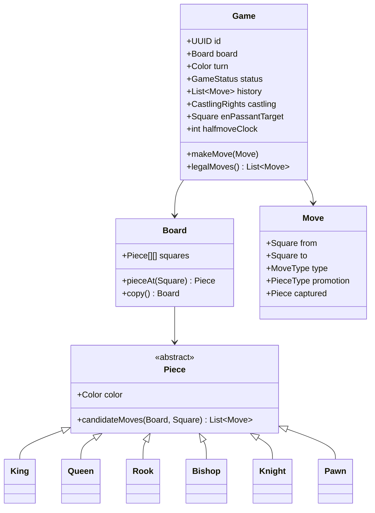
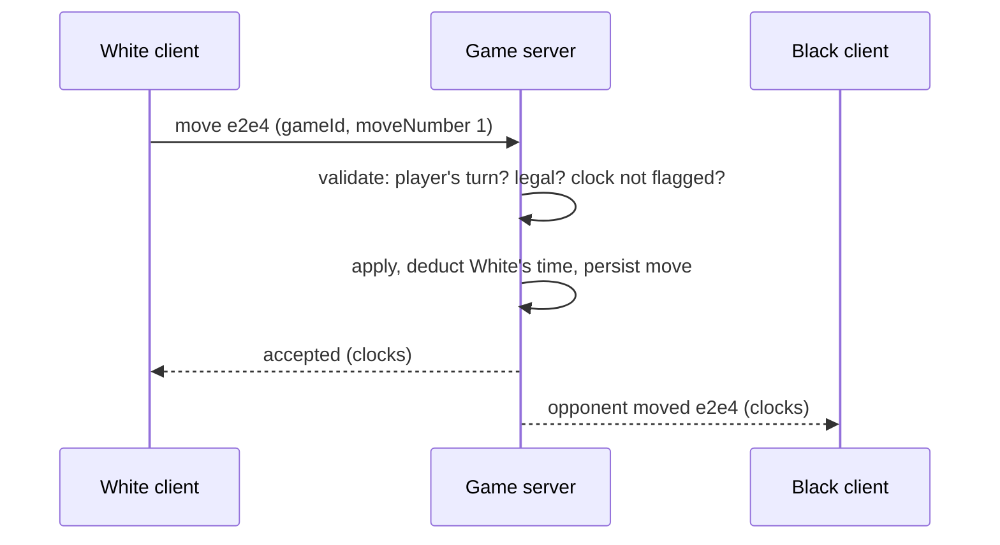

# Design a Chess Game — Polymorphism, Legal Moves, Check Detection, and Online Play

> **Low-Level Design · Classic LLD** — Chess tests whether you can model rich rules without a 2,000-line `if` statement: polymorphic pieces, a clear separation between "how a piece moves" and "is this move legal", special moves, undo via the Command pattern — and, for senior rounds, what changes when two players play online.

---

## Table of Contents

1. The Referee Analogy
2. Requirements & Clarifying Questions
3. Domain Model
4. Pieces and Movement (Polymorphism)
5. Legal Moves — Pseudo-Legal Generation + King-Safety Filter
6. Special Moves: Castling, En Passant, Promotion
7. Game State: Check, Checkmate, Stalemate, Draws
8. Move History, Undo, and Notation (Command Pattern)
9. Online Multiplayer: Server Authority, Clocks, Reconnects
10. Testing Chess Logic
11. Practice Assignments (Low / Medium / High)
12. Mini Project — Playable Chess Engine Core + REST/WebSocket API
13. Interview Corner
14. Quick Reference

---

## 1. The Referee Analogy

In a tournament, each **piece** knows how it moves (a knight jumps in an L; a bishop slides diagonally). But the **referee** decides whether a move is actually allowed: is it your turn, is the path blocked, does the move leave your own king under attack? The referee also declares check, checkmate, stalemate, and draws, and keeps the scoresheet.

Good design mirrors this split:

- **Piece classes** answer "where *could* I go on this board?" (movement geometry).
- **The game/rules engine** answers "is this move *legal* now?" and "what's the game status?"
- **The move history** is the scoresheet — replayable and undoable.

---

## 2. Requirements & Clarifying Questions

**Functional**

- Two players, standard 8×8 board and starting position; white moves first.
- Validate moves for all pieces, including castling, en passant, and promotion.
- Detect check, checkmate, stalemate; draws by threefold repetition, the 50-move rule, insufficient material; resignation and draw offers.
- Move history in standard notation; undo (for practice mode).

| Clarifying question | Impact |
|---------------------|--------|
| Local two-player, vs computer, or online? | Online adds server authority, clocks, reconnection |
| Time controls? | Clock per player, increments, flag-fall |
| Undo allowed? | Practice only — never in rated online games |
| Need an AI opponent? | Adds a search engine (minimax) — usually out of scope for LLD |

---

## 3. Domain Model



`Square(file 0-7, rank 0-7)` is an immutable record. `MoveType { NORMAL, CAPTURE, CASTLE_KINGSIDE, CASTLE_QUEENSIDE, EN_PASSANT, PROMOTION }`.

---

## 4. Pieces and Movement (Polymorphism)

Sliding pieces (rook, bishop, queen) share the "slide until blocked" logic; jumping pieces (knight, king) check fixed offsets.

```java
public abstract class Piece {
    protected final Color color;
    protected Piece(Color color) { this.color = color; }
    public abstract List<Move> candidateMoves(Board board, Square from);   // ignores king safety

    protected List<Move> slide(Board board, Square from, int[][] directions) {
        List<Move> moves = new ArrayList<>();
        for (int[] d : directions) {
            Square s = from.offset(d[0], d[1]);
            while (s != null) {                                   // null = off the board
                Piece p = board.pieceAt(s);
                if (p == null) moves.add(Move.normal(from, s));
                else {
                    if (p.color != color) moves.add(Move.capture(from, s, p));
                    break;                                        // blocked
                }
                s = s.offset(d[0], d[1]);
            }
        }
        return moves;
    }
}

public final class Bishop extends Piece {
    private static final int[][] DIAGONALS = {{1, 1}, {1, -1}, {-1, 1}, {-1, -1}};
    public Bishop(Color c) { super(c); }
    public List<Move> candidateMoves(Board b, Square from) { return slide(b, from, DIAGONALS); }
}

public final class Knight extends Piece {
    private static final int[][] JUMPS = {{1,2},{2,1},{2,-1},{1,-2},{-1,-2},{-2,-1},{-2,1},{-1,2}};
    public Knight(Color c) { super(c); }
    public List<Move> candidateMoves(Board b, Square from) {
        List<Move> moves = new ArrayList<>();
        for (int[] j : JUMPS) {
            Square s = from.offset(j[0], j[1]);
            if (s == null) continue;
            Piece p = b.pieceAt(s);
            if (p == null) moves.add(Move.normal(from, s));
            else if (p.color != color) moves.add(Move.capture(from, s, p));
        }
        return moves;
    }
}
```

`Queen` = rook directions + bishop directions. `Pawn` is the special one: forward one (or two from the starting rank if both squares are empty), captures diagonally, en passant, promotion on the last rank.

<div class="callout-tip">

**Applying this** — Resist putting game rules (turn order, check, castling rights) inside piece classes. Pieces know geometry; the `Game` knows history and state. That separation is what makes special moves and check detection clean — and it's exactly the "single responsibility" answer interviewers look for.

</div>

---

## 5. Legal Moves — Pseudo-Legal Generation + King-Safety Filter

The cleanest correct approach:

1. Generate **pseudo-legal** moves (piece geometry + special moves).
2. For each, apply it to a **copy** of the board (or make/unmake), and reject it if **your own king is attacked** afterward.

```java
public List<Move> legalMoves() {
    List<Move> legal = new ArrayList<>();
    for (Square from : board.squaresOf(turn)) {
        for (Move m : pseudoLegalMoves(from)) {           // candidateMoves + castling/en passant/promotion
            Board after = board.copy();
            after.apply(m);
            if (!isAttacked(after, after.kingSquare(turn), turn.opposite())) legal.add(m);
        }
    }
    return legal;
}

/** Is `target` attacked by any piece of `attacker` color? */
boolean isAttacked(Board b, Square target, Color attacker) {
    for (Square s : b.squaresOf(attacker)) {
        Piece p = b.pieceAt(s);
        // Pawns attack diagonally even onto empty squares; handle them separately from their moves
        if (p instanceof Pawn pawn ? pawn.attacks(s, target) : p.candidateMoves(b, s).stream().anyMatch(m -> m.to().equals(target)))
            return true;
    }
    return false;
}
```

This filter automatically handles **pins** (a pinned piece moving would expose the king), **moving into check**, and **responding to check** (only moves that end the check survive) — no special cases needed.

<div class="callout-interview">

**Q: "How do you prevent a player from moving into check?"**

I generate pseudo-legal moves from each piece's movement rules, then filter them: apply each move to a copy of the board, or make and unmake it, and discard it if the mover's king is attacked afterward. That one filter covers pins, moving the king into check, and the requirement to escape check, without special-case code. For performance, engines use make/unmake with incremental attack maps or bitboards, but the principle is the same.

</div>

---

## 6. Special Moves: Castling, En Passant, Promotion

| Move | Conditions | State needed |
|------|------------|--------------|
| **Castling** | King and that rook haven't moved; squares between are empty; king is **not in check, doesn't pass through or land on an attacked square** | `CastlingRights` (4 flags), updated whenever a king/rook moves or a rook is captured |
| **En passant** | Opponent's pawn just moved two squares and landed beside your pawn; capture on the square it skipped — **only on the immediately next move** | `enPassantTarget` square (set after a double pawn push, cleared after any other move) |
| **Promotion** | Pawn reaches the last rank; the player chooses queen/rook/bishop/knight | `Move.promotion` field; generate 4 moves (one per piece type) |

<div class="callout-warn">

**En passant is the classic bug**: the captured pawn is **not** on the destination square. `apply()` must remove the pawn beside the capturing pawn, and the king-safety filter must run on that result — en passant can expose your king along a rank (a famous edge case), which the "apply then check" approach catches automatically.

</div>

---

## 7. Game State: Check, Checkmate, Stalemate, Draws

```java
GameStatus evaluate() {
    boolean inCheck = isAttacked(board, board.kingSquare(turn), turn.opposite());
    boolean hasMoves = !legalMoves().isEmpty();
    if (!hasMoves) return inCheck ? GameStatus.checkmate(turn.opposite()) : GameStatus.STALEMATE;
    if (halfmoveClock >= 100) return GameStatus.DRAW_FIFTY_MOVES;          // 50 moves each w/o capture or pawn move
    if (positionCounts.getOrDefault(positionKey(), 0) >= 3) return GameStatus.DRAW_REPETITION;
    if (insufficientMaterial()) return GameStatus.DRAW_INSUFFICIENT_MATERIAL;
    return inCheck ? GameStatus.CHECK : GameStatus.ONGOING;
}
```

| Status | Rule |
|--------|------|
| Checkmate | In check and no legal moves |
| Stalemate | Not in check and no legal moves → draw |
| Threefold repetition | Same position (pieces, side to move, castling rights, en passant) occurs 3 times |
| 50-move rule | 100 half-moves without a capture or pawn move |
| Insufficient material | K vs K, K+B vs K, K+N vs K, etc. |

`positionKey()` can be a FEN string without the move counters, or a **Zobrist hash** (a 64-bit XOR of random numbers per piece-square) that updates incrementally — the standard engine technique.

---

## 8. Move History, Undo, and Notation (Command Pattern)

Each move is a **command** that knows how to execute and undo itself — including restoring captured pieces, castling rights, the en passant target, and the halfmove clock.

```java
public final class MoveCommand {
    private final Move move;
    private Snapshot before;                  // castling rights, en passant, halfmove clock, captured piece

    public void execute(Game g) {
        before = g.snapshotState();
        g.board().apply(move);
        g.updateStateAfter(move);
        g.switchTurn();
    }
    public void undo(Game g) {
        g.board().revert(move, before.captured());
        g.restoreState(before);
        g.switchTurn();
    }
}
```

Store history as a list of commands for undo (practice mode), and as **SAN** notation ("Nf3", "exd5", "O-O", "e8=Q+") for display and **PGN** export. Positions can be saved/loaded with **FEN**.

---

## 9. Online Multiplayer: Server Authority, Clocks, Reconnects



| Concern | Design |
|---------|--------|
| **Cheating / invalid moves** | The **server** is authoritative: it validates every move with the same rules engine; clients only render |
| Duplicate/out-of-order messages | Each move carries `moveNumber`; the server accepts only the next expected one (idempotent on retries) |
| **Clocks** | Server measures time between moves (clients display a countdown); increments added server-side; flag-fall detected by a server timer |
| Reconnection | Game state persisted (moves list); a reconnecting client receives the full move list or FEN and the current clocks |
| Transport | WebSockets for real-time moves; REST for history, lobby, profiles |
| Fair play | Engine-assistance detection is a separate, offline analysis problem |
| Scale | Games are independent — route each game to one server instance (sticky by game ID) or use a pub/sub channel per game |

<div class="callout-scenario">

**Scenario**: Players on slow mobile networks lose games on time even though they moved "instantly". **Decision**: Measure each player's time on the server but compensate for network latency: the client sends a timestamp of when the move was made, and the server credits back a bounded amount (lag compensation, capped per move, e.g., up to ~1 s) based on measured round-trip time. Log large compensations to detect abuse. This is the kind of fairness trade-off real platforms tune carefully.

</div>

---

## 10. Testing Chess Logic

| Technique | Why |
|-----------|-----|
| **Perft** (count all leaf nodes at depth N from a position) | The gold standard: known counts for standard positions (e.g., the starting position has 20 moves at depth 1, 400 positions at depth 2, 8,902 at depth 3, 197,281 at depth 4) catch almost any move-generation bug |
| FEN-based unit tests | Set up specific positions: castling through check, en passant pins, promotion with capture |
| Known games (PGN replay) | Replay famous games; every move must be legal and the final status must match |
| Undo round-trip | For random sequences: execute then undo everything → identical position and state |

---

## 11. 🏋️ Practice Assignments

### 🟢 Low — Build the reflexes

**L1.** Which pieces share sliding logic, and how do you avoid duplicating it?

<details>
<summary>Show answer</summary>

Rook (orthogonal), bishop (diagonal), and queen (both). Put a `slide(board, from, directions)` helper in the abstract `Piece` (or a `SlidingPiece` subclass) and let each class pass its direction set; the queen passes the union.

</details>

**L2.** What's the difference between checkmate and stalemate in terms of your `evaluate()` logic?

<details>
<summary>Show answer</summary>

Both mean the side to move has **no legal moves**. If that side's king is currently attacked → checkmate (the other side wins); if not → stalemate (draw).

</details>

**L3.** Why must the king-safety check be done on the board *after* the move, not before?

<details>
<summary>Show answer</summary>

Legality depends on the resulting position: moving a pinned piece exposes the king only after it moves; a king moving next to a sliding piece's line is attacked only at its new square; capturing the checking piece resolves check only after the capture. Evaluating the post-move board covers all these uniformly.

</details>

### 🟡 Medium — Apply it

**M1.** List every condition for kingside castling and where each piece of state comes from.

<details>
<summary>Show answer</summary>

(1) Castling right for that side still true (king and h-rook never moved; rook not captured) — from `CastlingRights`, updated on every king/rook move and rook capture. (2) f- and g-squares empty — from the board. (3) King not currently in check — `isAttacked(kingSquare)`. (4) The king doesn't pass through an attacked square (f1/f8) — `isAttacked` on f. (5) The king doesn't land on an attacked square (g1/g8) — covered by the general post-move king-safety filter. The move then moves both the king and the rook.

</details>

**M2.** Implement threefold-repetition detection efficiently.

<details>
<summary>Show answer</summary>

Maintain a `Map<Long, Integer>` of position hashes → count. Use a **Zobrist hash** covering piece placement, side to move, castling rights, and the en passant square (only if an en passant capture is actually possible), updated incrementally with XOR on every move (and decremented/restored on undo). After each move, increment the count; if it reaches 3, the game can be declared drawn (in standard rules a player claims it; online platforms usually auto-draw). Irreversible moves (captures, pawn moves) mean earlier positions can never repeat, so history before them can be pruned.

</details>

**M3.** Your online chess server receives "move e7e5, moveNumber 2" twice because the client retried. How do you handle it?

<details>
<summary>Show answer</summary>

Moves are keyed by `(gameId, moveNumber)`. The server expects move 2 next; the first message applies it (persisted with a unique constraint on `(game_id, move_number)`), and the retry finds move 2 already recorded with the same content → respond with the same "accepted" result (idempotent) instead of rejecting it as "not your turn". A different move with an already-used number is rejected. Out-of-order future numbers are rejected or buffered briefly.

</details>

### 🔴 High — Think like a senior

**H1.** Design a simple AI opponent within the same architecture.

<details>
<summary>Show answer</summary>

Add a `Player` interface with `HumanPlayer` (moves from UI/network) and `EnginePlayer`. The engine runs **minimax with alpha-beta pruning** over `legalMoves()` using make/unmake (Command pattern) to avoid board copies, with an evaluation function (material + piece-square tables + mobility), iterative deepening with a time limit, move ordering (captures first, MVV-LVA), and a transposition table keyed by the Zobrist hash. Difficulty levels = search depth/time + occasional randomness. Keep the rules engine shared and deterministic; the engine is just another client of it. Run it off the request thread (a worker pool) in an online setting.

</details>

**H2.** Scale the online platform to 200,000 concurrent games with 3+2 blitz time control.

<details>
<summary>Show answer</summary>

Games are independent, so shard by game ID: a game-service instance owns a set of games in memory (authoritative state + clocks), with sticky routing of WebSocket connections by game ID (or connections terminate at a gateway that forwards to the owning instance via pub/sub). Each move: validate, apply, append to a durable log (Kafka or a DB insert) *before* acknowledging, so a crashed instance can rebuild the game from the move list on another instance. Server-side timers for flag-fall use a timing wheel (cheap for many timers). Lobby/matchmaking is a separate service (Elo-based queues). Spectators subscribe to a game's broadcast channel through fan-out nodes. Completed games are archived as PGN for history and anti-cheat analysis. Load test at 2x peak; monitor move latency p99 (must be tiny for blitz).

</details>

---

## 12. 🛠️ Mini Project — Playable Chess Engine Core + REST/WebSocket API

**Goal**: A correct rules engine you can prove with perft, plus a thin online layer. 1 week of evenings.

**Build**

1. Domain: `Square`, `Piece` hierarchy with sliding/jumping helpers, `Board`, `Move`, `CastlingRights`, `Game` with `legalMoves()`, `makeMove()`, `evaluate()`.
2. FEN import/export and SAN output for the history.
3. `MoveCommand` with execute/undo restoring all state.
4. **Perft tests** for the starting position to depth 4 (20 / 400 / 8,902 / 197,281) plus 2-3 well-known tricky test positions from chess programming references.
5. Spring Boot: `POST /games`, `GET /games/{id}` (FEN + history), a WebSocket endpoint `/games/{id}/moves` that validates moves server-side with move numbers and pushes updates to both players.
6. Server-side clocks with increments; flag-fall ends the game.

**Acceptance criteria**

- Perft counts match exactly.
- Undoing an entire random game restores the initial FEN.
- Illegal and out-of-turn moves over the WebSocket are rejected without changing state.

---

## 🎯 Interview Corner

<div class="callout-interview">

**Q: "Design a chess game. How do you structure the classes?"**

`Game` owns the board, whose turn it is, the move history, and rule state: castling rights, the en passant target, the halfmove clock, and repetition counts. `Board` is an 8×8 grid of pieces with query and apply operations. `Piece` is an abstract class with subclasses for each type implementing `candidateMoves` — just movement geometry — with a shared sliding helper for rook, bishop, and queen. Legality lives in the game: pseudo-legal moves plus special moves, filtered by applying each to a copy and discarding any that leave the mover's king attacked. `evaluate` then detects check, checkmate, stalemate, and draws. Moves are commands with execute and undo, which also gives me history, PGN export, and practice-mode undo.

**Follow-up trap**: "Why not put check detection in the King class?" → Check depends on every opposing piece and the whole board state, which is game-level knowledge. Putting it in King couples the piece to the whole board and duplicates logic.

</div>

<div class="callout-interview">

**Q: "How do you detect checkmate?"**

After each move I evaluate the side to move. If their king is attacked by any opposing piece and they have no legal moves — after the king-safety filter — it's checkmate. If they have no legal moves and aren't in check, it's stalemate. Because the legal-move generator already excludes moves that leave the king in check, checkmate detection is just "in check and the legal move list is empty", with no special-case search. I validate the move generator with perft counts from known positions, which catches almost any rules bug.

</div>

<div class="callout-interview">

**Q: "What changes when the game is played online?"**

The server becomes authoritative. It runs the same rules engine, validates every move — turn, legality, clock — and clients only render. Moves carry a move number, so retries are idempotent and out-of-order messages are rejected. Clocks are measured on the server with bounded lag compensation. Every move is persisted before acknowledging, so a game can be rebuilt after a crash or a reconnection. Games are independent, so I shard them by game ID across instances, with WebSockets for real-time updates and spectator fan-out through pub/sub.

</div>

---

## Quick Reference

| Concept | One-Liner |
|---------|-----------|
| Pieces | Polymorphic `candidateMoves`; shared `slide()` for rook/bishop/queen |
| Legality | Pseudo-legal + "king not attacked after the move" filter |
| Special moves | Castling rights, en passant target, promotion choice — game state |
| Status | No legal moves + in check = mate; no legal moves + not in check = stalemate |
| Draws | Threefold (Zobrist), 50-move (100 half-moves), insufficient material |
| History | Command pattern with execute/undo; SAN/PGN; FEN positions |
| Testing | Perft counts, FEN edge cases, undo round-trips |
| Online | Server-authoritative, move numbers, server clocks, persist-then-ack |

---

## Related Topics

- `lld-thinking-framework` — the general LLD approach
- `design-tic-tac-toe` — a smaller game with the same server-authority ideas
- `java-oop` — polymorphism and abstract classes
- `dsa-recursion` — minimax is recursive search with pruning

> **Let pieces know how they move, and let the game decide what's legal. That one boundary turns chess's hardest rules into a filter — and makes the whole engine testable.**

---

<!-- journey-link:start -->

<div class="callout-journey">

🛒 **ShopNorth Journey** — Extra case study — rich domain modeling and validation, the same skills behind ShopNorth's order and pricing classes.

**Continue the story:** [Chapter 3 · Low-Level Design](/tutorials/journey-03-low-level-design) · **New here?** [Start the journey](/tutorials/journey-start)

</div>

<!-- journey-link:end -->
