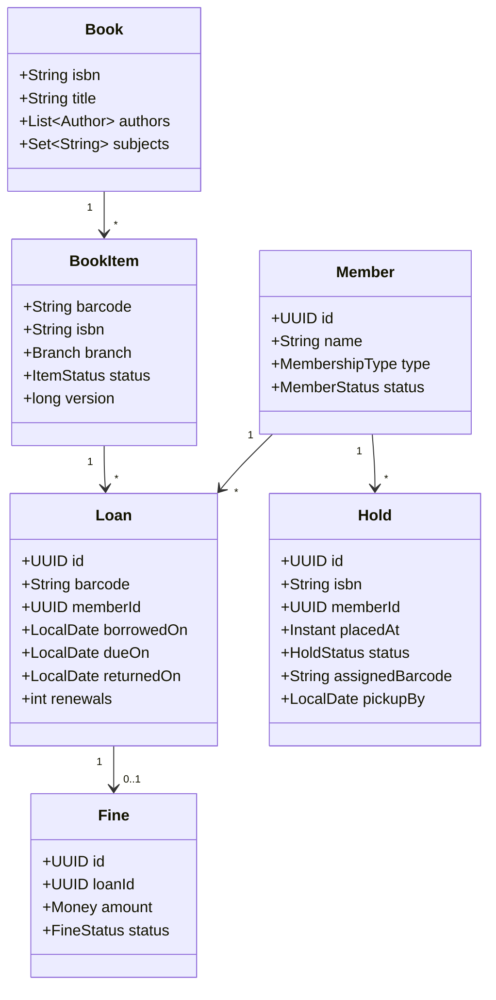
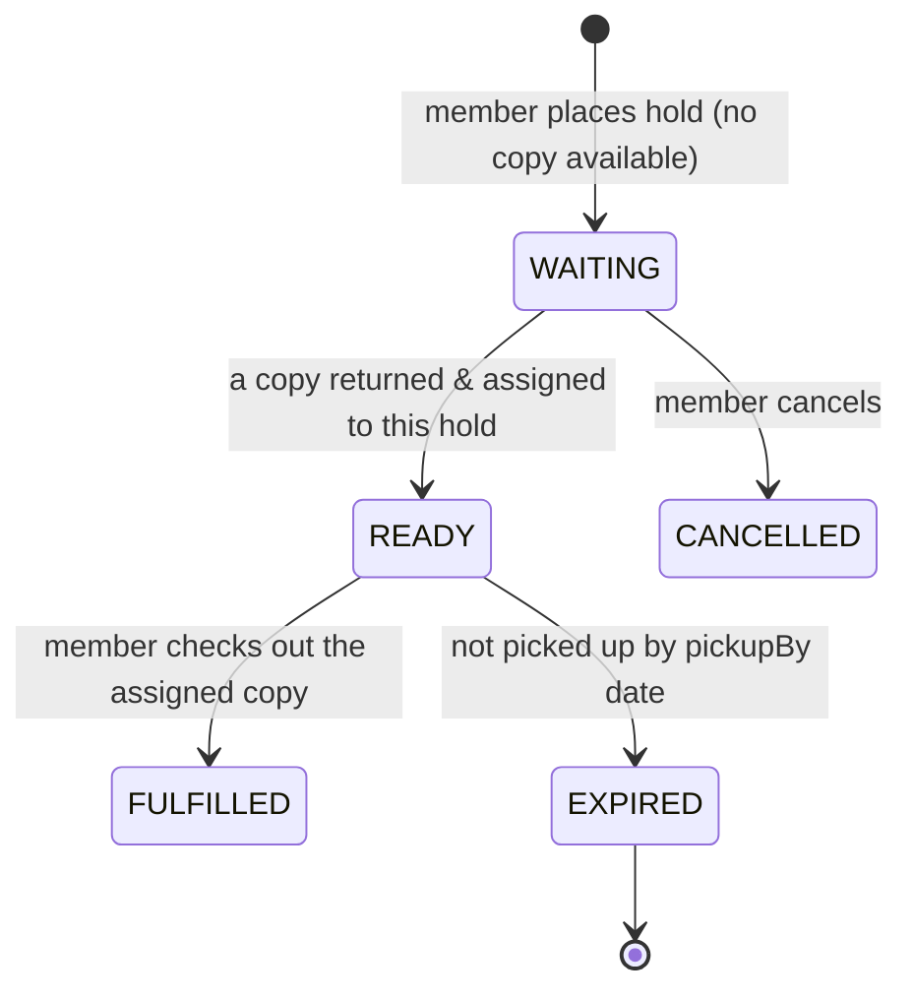

# Design a Library Management System — Beyond CRUD: Copies, Reservations, Fines, and Fairness

> **Low-Level Design · Classic LLD** — Interviewers use this "easy" problem to see whether you model the domain precisely (a *book* is not a *copy*), put rules in the right place, and handle the tricky parts: reservation queues, fines with dates and money, and two members grabbing the last copy.

---

## Table of Contents

1. The Neighborhood Library Analogy
2. Requirements & Clarifying Questions
3. Domain Model — Book vs BookItem
4. Core Use Cases: Checkout, Return, Renew
5. Reservations — A Fair Waiting Queue
6. Fines — Dates, Money, and Policies
7. Search
8. Notifications (Observer) and Policies (Strategy)
9. Concurrency: The Last Copy Problem
10. Persistence & API
11. Practice Assignments (Low / Medium / High)
12. Mini Project — Library Service with Policies and Holds
13. Interview Corner
14. Quick Reference

---

## 1. The Neighborhood Library Analogy

Your library owns **one title** — "Clean Code" — but **three physical copies** with barcodes. When all three are out, you add your name to the **hold list** at the desk. When a copy comes back, the librarian doesn't put it on the shelf; they check the hold list, put it on the **hold shelf** with your name, and call you. If you don't pick it up in 3 days, it goes to the next person.

Return it late and you pay a **fine** — ₹5 a day, capped at the book's price, and you can't borrow more until you pay above a limit.

Every rule in that story is a requirement your design must express clearly.

---

## 2. Requirements & Clarifying Questions

**Functional**

- Catalog: search titles by title, author, subject, ISBN.
- Members borrow **copies**, return them, and renew (if nobody is waiting).
- Borrowing limits per membership type (e.g., Student 3 items / 14 days, Faculty 10 items / 30 days).
- Reserve (place a hold) on a title when no copy is available; notify when ready.
- Fines for late returns; block borrowing above an unpaid-fine threshold.
- Librarians add/remove copies, mark lost/damaged.

| Clarifying question | Impact |
|---------------------|--------|
| Multiple branches? | Copies have a home branch; holds may be fulfilled from any branch (transfers) |
| Item types beyond books (DVDs, journals)? | Different loan periods and rules per item type |
| Are holds per title or per specific copy? | Almost always per title (any copy fulfills it) |
| Online payments for fines? | Payment integration, idempotency |

---

## 3. Domain Model — Book vs BookItem



| Concept | Why it's separate |
|---------|-------------------|
| `Book` (title, ISBN) | What people search for and reserve |
| `BookItem` (barcode) | What people physically borrow; has its own status and location |
| `Loan` | The history of who had which copy when — never delete it |
| `Hold` | A queue entry per **title** |

`ItemStatus { AVAILABLE, ON_LOAN, ON_HOLD_SHELF, IN_TRANSIT, LOST, DAMAGED, WITHDRAWN }`

<div class="callout-warn">

**The classic modeling mistake**: a single `Book` class with a `quantity` field. It can't tell you *which* copy is late, which one is damaged, or who had copy #3 last month when it came back with a torn cover. Model physical items individually.

</div>

---

## 4. Core Use Cases: Checkout, Return, Renew

### Checkout

```java
@Transactional
public Loan checkout(UUID memberId, String barcode) {
    Member member = members.findById(memberId).orElseThrow();
    BookItem item = items.findForUpdate(barcode).orElseThrow();           // row lock on the copy
    LoanPolicy policy = policies.forMember(member.type());

    member.ensureCanBorrow(loans.activeCount(memberId), fines.unpaidTotal(memberId), policy);
    item.ensureCanBeBorrowedBy(member.id());      // AVAILABLE, or ON_HOLD_SHELF assigned to this member

    item.markOnLoan();
    Loan loan = Loan.start(item, member, clock.today(), policy.loanPeriodFor(item));
    holds.fulfillIfAssignedTo(item.barcode(), member.id());                // picked up their hold
    return loans.save(loan);
}
```

The rules live in the domain objects (`ensureCanBorrow`, `ensureCanBeBorrowedBy`) — not in a 300-line service method.

### Return

```java
@Transactional
public ReturnResult returnItem(String barcode) {
    BookItem item = items.findForUpdate(barcode).orElseThrow();
    Loan loan = loans.findActiveByBarcode(barcode).orElseThrow();
    loan.close(clock.today());

    Optional<Fine> fine = fineCalculator.calculate(loan, item)            // Strategy per item type/policy
        .map(fines::save);

    Optional<Hold> next = holds.nextWaiting(item.isbn());                 // FIFO queue for this title
    if (next.isPresent()) {
        item.markOnHoldShelf();
        next.get().assign(item.barcode(), clock.today().plusDays(PICKUP_DAYS));
        events.publish(new HoldReadyForPickup(next.get().id()));
    } else {
        item.markAvailable();
    }
    return new ReturnResult(loan, fine);
}
```

### Renew

Allowed only if: not overdue beyond policy, renewals < max, **no one is waiting** for the title, and the member isn't blocked. New due date = today + loan period (or due date + period — a policy choice to state explicitly).

---

## 5. Reservations — A Fair Waiting Queue



| Rule | Implementation |
|------|----------------|
| FIFO by time placed | `ORDER BY placed_at, id` (tie-breaker for identical timestamps) |
| One active hold per member per title | Unique partial index `(isbn, member_id) WHERE status IN ('WAITING','READY')` |
| Pickup window | Scheduler expires `READY` holds past `pickupBy` and passes the copy to the next hold |
| Priority members (faculty) | Optional: a priority field, then time — make fairness rules explicit |

<div class="callout-scenario">

**Scenario**: A popular textbook has 3 copies and 40 holds. Students complain the queue "skips" people. Investigation shows copies returned at another branch were put back on the shelf there and borrowed by walk-ins. **Decision**: Returns at **any** branch must check the title's hold queue first; a copy needed elsewhere moves to `IN_TRANSIT` with a transfer record. The rule "holds before shelves" is enforced in the return use case, not left to staff memory, and a report shows copies of held titles sitting on shelves (should be zero).

</div>

---

## 6. Fines — Dates, Money, and Policies

```java
public interface FinePolicy {
    Optional<Money> fineFor(Loan loan, BookItem item);
}

public final class DailyCappedFine implements FinePolicy {
    private final Money perDay;
    private final int graceDays;

    public Optional<Money> fineFor(Loan loan, BookItem item) {
        long daysLate = ChronoUnit.DAYS.between(loan.dueOn(), loan.returnedOn()) - graceDays;
        if (daysLate <= 0) return Optional.empty();
        Money raw = perDay.times(daysLate);
        return Optional.of(raw.min(item.replacementCost()));              // never more than the book's cost
    }
}
```

| Detail | Correct handling |
|--------|------------------|
| Dates | Use `LocalDate` (calendar days in the library's time zone), not `Instant` arithmetic; inject a `Clock` for tests |
| Closed days | Option: don't charge for days the library was closed (a holiday calendar) |
| Money | `Money` value object (paise as `long`), never `double` |
| Caps | Cap at replacement cost; lost items charge replacement + processing fee |
| Blocking | Borrowing blocked when unpaid fines exceed a threshold (policy per membership) |
| Waivers | Librarian waivers recorded with reason and who approved (audit) |

---

## 7. Search

| Need | Implementation |
|------|----------------|
| Exact ISBN | Indexed column lookup |
| Title/author keyword search | PostgreSQL full-text search (`tsvector` + GIN index) or OpenSearch for larger catalogs |
| Fuzzy ("clen code") | Trigram index (`pg_trgm`) or OpenSearch fuzzy queries |
| Filters | Subject, format, branch, availability (`EXISTS` an AVAILABLE copy) |
| Availability shown in results | Count per title from `book_items` — cache it, since it changes often but reads dominate |

---

## 8. Notifications (Observer) and Policies (Strategy)

- **Observer** (event-driven): `HoldReadyForPickup`, `LoanDueSoon` (2 days before), `LoanOverdue`, `FineCharged`. Publishers don't know the listeners (email, SMS, app push). Publish through a transactional outbox so events aren't lost if the process crashes after the commit.
- **Strategy**: `LoanPolicy` per membership type (limits, loan period, renewals) and `FinePolicy` per item type. New membership tiers become configuration or a new class, not `if (type == FACULTY)` scattered everywhere.

<div class="callout-tip">

**Applying this** — Keep policy **values** (limits, fine rates) in configuration or a `policies` table editable by admins, and policy **behavior** in strategy classes. Librarians can change "₹5/day" to "₹10/day" without a deploy, while developers review new behavior types.

</div>

---

## 9. Concurrency: The Last Copy Problem

A physical copy can't be scanned at two kiosks at once, so the races come from the system acting on the same data concurrently:

| Race | Defense |
|------|---------|
| A hold is assigned while a walk-in borrows the same copy | Lock the `BookItem` row (`SELECT ... FOR UPDATE` or optimistic `version`) in both checkout and hold assignment |
| Two holds assigned to one returned copy | Assignment happens in the same transaction as the return, under the item lock; unique constraint: one READY hold per barcode |
| A member exceeds the borrowing limit via two simultaneous checkouts | Lock the member row (or a per-member counter) during checkout, or re-check the count inside the transaction with `SERIALIZABLE` for that operation |
| Online hold placed twice (double-click) | Unique partial index on active holds per member+title |

---

## 10. Persistence & API

```sql
CREATE TABLE book_items (
  barcode VARCHAR(20) PRIMARY KEY, isbn VARCHAR(13) NOT NULL REFERENCES books(isbn),
  branch_id UUID NOT NULL, status VARCHAR(20) NOT NULL, version BIGINT NOT NULL DEFAULT 0
);
CREATE TABLE loans (
  id UUID PRIMARY KEY, barcode VARCHAR(20) NOT NULL REFERENCES book_items(barcode),
  member_id UUID NOT NULL, borrowed_on DATE NOT NULL, due_on DATE NOT NULL,
  returned_on DATE, renewals INT NOT NULL DEFAULT 0
);
CREATE UNIQUE INDEX one_active_loan_per_item ON loans (barcode) WHERE returned_on IS NULL;
CREATE TABLE holds (
  id UUID PRIMARY KEY, isbn VARCHAR(13) NOT NULL, member_id UUID NOT NULL,
  placed_at TIMESTAMPTZ NOT NULL, status VARCHAR(12) NOT NULL,
  assigned_barcode VARCHAR(20), pickup_by DATE
);
CREATE UNIQUE INDEX one_active_hold_per_member_title ON holds (isbn, member_id) WHERE status IN ('WAITING','READY');
CREATE INDEX holds_queue ON holds (isbn, status, placed_at);
```

| Endpoint | Purpose |
|----------|---------|
| `GET /books?q=&subject=&available=` | Search |
| `POST /loans` `{memberId, barcode}` | Checkout |
| `POST /returns` `{barcode}` | Return (fine + hold assignment) |
| `POST /loans/{id}/renew` | Renew |
| `POST /holds` `{memberId, isbn}` | Place a hold |
| `GET /members/{id}/account` | Loans, holds, fines |

---

## 11. 🏋️ Practice Assignments

### 🟢 Low — Build the reflexes

**L1.** Why does `Loan` store `dueOn` instead of computing it from `borrowedOn + policy.loanPeriod` on the fly?

<details>
<summary>Show answer</summary>

Policies change over time (e.g., the loan period changes from 14 to 21 days), and renewals move the due date. The due date agreed at checkout (or renewal) is a historical fact that must not change retroactively, so store it on the loan.

</details>

**L2.** A copy is returned and three members have holds on the title. What happens to the copy?

<details>
<summary>Show answer</summary>

It doesn't go back to the shelf. The earliest `WAITING` hold (FIFO by `placed_at`) is assigned that copy → hold becomes `READY` with a `pickupBy` date, the copy becomes `ON_HOLD_SHELF`, and the member is notified. The other two keep waiting.

</details>

**L3.** A book was due on the 10th, returned on the 16th, grace period 2 days, ₹5/day, replacement cost ₹400. What's the fine?

<details>
<summary>Show answer</summary>

6 days late − 2 grace days = 4 chargeable days × ₹5 = **₹20** (below the ₹400 cap).

</details>

### 🟡 Medium — Apply it

**M1.** Add a new membership type "Senior Citizen" (5 items, 21 days, fines halved) without modifying existing checkout code. Show the design.

<details>
<summary>Show answer</summary>

`LoanPolicy` and `FinePolicy` are interfaces resolved per membership type from a registry (`Map<MembershipType, LoanPolicy>` built from Spring beans or a `policies` table). Add `SENIOR` to the enum (or a row in the table) and register `LoanPolicy(maxItems=5, loanDays=21, maxRenewals=2)` plus a `FinePolicy` decorator `HalfFine(DailyCappedFine)`. Checkout and return code call `policies.forMember(member.type())` and never branch on types, so they don't change (Open/Closed).

</details>

**M2.** A member with 2 books out (limit 3) triggers two checkouts at two kiosks at the same moment. Both succeed and they end up with 4. Fix it.

<details>
<summary>Show answer</summary>

The limit check (`activeCount < max`) and the insert are not atomic across concurrent transactions. Fixes: lock the member row at the start of checkout (`SELECT ... FROM members WHERE id = ? FOR UPDATE`) so checkouts for the same member serialize; or maintain an `active_loans` counter on the member updated with a conditional `UPDATE members SET active_loans = active_loans + 1 WHERE id = ? AND active_loans < ?` and check the row count; or run that operation at `SERIALIZABLE` with retries. Add a concurrency test.

</details>

**M3.** Design the "hold not picked up" flow including notifications.

<details>
<summary>Show answer</summary>

A daily (or hourly) job finds `READY` holds with `pickupBy < today`: in one transaction per hold, mark it `EXPIRED`, find the next `WAITING` hold for the title; if one exists, reassign the same copy (new `pickupBy`) and publish `HoldReadyForPickup`; otherwise mark the copy `AVAILABLE`. Send reminders the day before expiry (`HoldPickupReminder`). Idempotent job (each hold processed under a lock; re-running does nothing new). Metrics: expired-hold rate per branch.

</details>

### 🔴 High — Think like a senior

**H1.** Extend to a 30-branch city library network where holds can be fulfilled by any branch and members choose a pickup branch.

<details>
<summary>Show answer</summary>

Holds gain `pickupBranchId`. On return at branch X: check the hold queue for the title; if the next hold's pickup branch is X, put it on X's hold shelf; otherwise create a `Transfer(barcode, from=X, to=pickupBranch)` and set the copy `IN_TRANSIT`; on arrival, mark `ON_HOLD_SHELF` and notify. Optimization: when a hold is placed and copies are available at other branches, a "paging list" asks staff at the branch with an available copy to pull it (instead of waiting for returns). Fairness trade-off: strict FIFO network-wide vs. preferring local copies to reduce transit (e.g., FIFO but prefer a copy at the pickup branch when the difference in wait is small) — make it an explicit, configurable policy. Track transit times and lost-in-transit items.

</details>

**H2.** The library wants e-books with a licensing model: each purchased license allows one simultaneous loan, expires after 26 loans or 2 years. How does the model change?

<details>
<summary>Show answer</summary>

Add `DigitalLicense(id, isbn, maxLoans=26, loansUsed, expiresOn, concurrency=1)` instead of physical `BookItem`s. Checkout picks an active license with a free slot (atomic conditional update: `loans_used < max_loans AND active_loans < concurrency AND expires_on > today`), increments counters, and issues a time-limited download token from the provider (DRM). Returns are automatic at due date (no fines — access simply ends). Holds work the same (per title) but are fulfilled when any license frees up. Expiring licenses trigger purchase suggestions based on hold queue length. Model it behind the same `Loanable` abstraction so search, holds, and member accounts work for both physical and digital items.

</details>

---

## 12. 🛠️ Mini Project — Library Service with Policies and Holds

**Goal**: A clean, tested domain model with real rules. 2 evenings.

**Build**

1. Spring Boot + Postgres with the schema above; seed 20 books, 50 copies, 3 branches, 10 members of different types.
2. Use cases: checkout, return (fine + hold assignment), renew, place/cancel hold, expire holds job — all rules in domain objects and policy strategies.
3. Inject `java.time.Clock` everywhere; tests use a fixed/mutable clock to simulate late returns and pickup expiries.
4. Events via an outbox table; a simple listener that "sends" notifications to the log.
5. Tests: limits per membership type, fine calculation with grace and cap, FIFO holds, renewal blocked when someone is waiting, the concurrent-checkout test from M2.

**Acceptance criteria**

- No `if (memberType == ...)` in services (ArchUnit or a code search check).
- Unique indexes prevent two active loans per copy and duplicate active holds.
- The README contains the state diagrams for `BookItem` and `Hold`.

---

## 🎯 Interview Corner

<div class="callout-interview">

**Q: "Design a library management system. What are your main classes?"**

I separate the title from the physical copy. Book holds the ISBN, title, authors, and subjects — what members search for and reserve — while BookItem is a barcoded copy with its own status and branch, which is what gets borrowed. Member has a membership type that maps to a LoanPolicy strategy for limits, loan periods, and renewals. Loan records who had which copy and when, with a stored due date. Hold is a FIFO queue entry per title with a pickup deadline. Fine uses a Money value object produced by a FinePolicy strategy. Rules live in the domain objects, and events like hold-ready or overdue go out through an outbox to notification listeners.

</div>

<div class="callout-interview">

**Q: "How do reservations work when all copies are out?"**

A member places a hold on the title, not a specific copy, and a unique index prevents duplicate active holds for the same member and title. When any copy is returned, the return transaction checks the title's queue first: the oldest waiting hold is assigned that copy, the copy moves to the hold shelf, and the member is notified with a pickup deadline. A scheduled job expires unclaimed holds and passes the copy to the next person. Renewals are blocked while anyone is waiting. All of this happens under a lock on the copy, so a walk-in borrower and the hold queue can never both get it.

</div>

<div class="callout-interview">

**Q: "Where do you put business rules like borrowing limits and fines?"**

In the domain and in policy strategies, not scattered across controllers. `Member.ensureCanBorrow` checks limits and fine thresholds using the member's LoanPolicy, and a FinePolicy computes fines from dates and a Money value object, with grace periods and caps. Policy values like rates and limits live in configuration or an admin-editable table, and policy behaviors are strategy classes, so adding a membership type or changing a fine rate doesn't touch the checkout flow. All date logic uses an injected Clock, so the rules are fully unit-testable.

</div>

---

## Quick Reference

| Concept | One-Liner |
|---------|-----------|
| Book vs BookItem | Title (search/reserve) vs barcoded copy (borrow) |
| Loan | Historical record; stores due date; one active loan per copy (unique index) |
| Hold | FIFO per title; one active per member+title; pickup window |
| Return flow | Close loan → fine → assign to next hold or shelve |
| Fines | `FinePolicy` strategy, `LocalDate`, `Money`, grace + cap |
| Policies | Strategy per membership/item type; values in config |
| Events | Hold ready, due soon, overdue — via outbox |
| Concurrency | Lock the copy; serialize per member for limits |
| Testing | Injected `Clock`; property-style checks for fines |

---

## Related Topics

- `lld-thinking-framework` — the general LLD approach
- `java-oop` — strategy and encapsulation in practice
- `spring-transactional` — locking for the limit and last-copy races
- `sql-indexing` — partial unique indexes and full-text search

> **A library looks like CRUD until you ask which copy, whose turn, and how many days late. Model the physical world precisely, put each rule in one place, and the edge cases stop being surprises.**

---

<!-- journey-link:start -->

<div class="callout-journey">

🛒 **ShopNorth Journey** — Extra case study — holds with due dates are the same idea as ShopNorth's 15-minute stock reservations.

**Continue the story:** [Chapter 3 · Low-Level Design](/tutorials/journey-03-low-level-design) · **New here?** [Start the journey](/tutorials/journey-start)

</div>

<!-- journey-link:end -->
