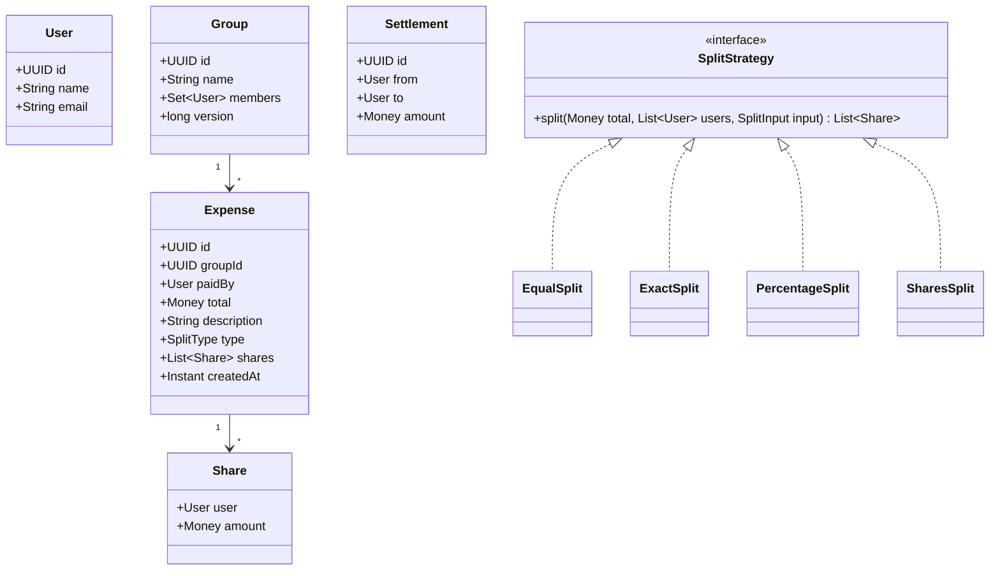

# Design Splitwise — Expense Sharing Done Right (Money, Rounding, Concurrency, Debt Simplification)

<!-- sdlc-stage:start -->
<div class="sdlc-stage">

📍 **SDLC stage: Design — low-level design** · Extra case study for [Chapter 3 · Low-Level Design](/tutorials/journey-03-low-level-design)

</div>
<!-- sdlc-stage:end -->

> **Low-Level Design · Classic LLD** — Splitwise looks like a toy problem until you handle real money: ₹100 split three ways, two people adding expenses to the same group at the same second, a settlement that must never be applied twice. This version is interview-ready *and* production-shaped.

---

## Table of Contents

1. The Shared-Flat Notebook Analogy
2. Requirements & Clarifying Questions
3. The #1 Mistake: Money as `double`
4. Domain Model
5. Split Strategies (Strategy Pattern) with Correct Rounding
6. Balances: Ledger vs Running Totals
7. Debt Simplification
8. Concurrency & Idempotency
9. Persistence & API
10. Testing the Design
11. Practice Assignments (Low / Medium / High)
12. Mini Project — Splitwise Core as a Spring Boot Service
13. Interview Corner
14. Quick Reference

---

## 1. The Shared-Flat Notebook Analogy

Four flatmates keep a notebook on the fridge. Every time someone pays for something shared, they write a line: *"Ravi paid ₹1,200 for groceries — split between all four."* At month end, someone adds everything up and says: *"Asha owes Ravi ₹300, Meera owes Karan ₹150..."*

Three things go wrong in real life, and they're exactly the three things your design must handle:

- **Rounding**: ₹100 split three ways is ₹33.33 + ₹33.33 + ₹33.33 = ₹99.99. Who pays the missing paisa?
- **Two people writing at once**: two flatmates add expenses at the same moment and one line gets lost.
- **Too many transfers**: 12 pairwise debts where 3 transfers would settle everything.

---

## 2. Requirements & Clarifying Questions

**Functional**

- Users, groups, and expenses (inside a group or between two friends).
- Split types: **EQUAL**, **EXACT** amounts, **PERCENTAGE**, **SHARES** (e.g., 2:1:1).
- Show each user's balances: "you owe X", "Y owes you".
- Record **settlements** (payments between users).
- **Simplify debts** within a group.
- Edit/delete an expense (balances must update correctly).

**Non-functional**

- Money must be exact — no floating-point drift.
- Concurrent updates to the same group must not corrupt balances.
- Every change auditable (who added/edited what, when).

| Clarifying question | Why it matters |
|---------------------|----------------|
| Single currency or multi-currency? | Multi-currency needs per-currency balances and FX handling |
| Can an expense be paid by multiple people? | Changes the model: `payers` list instead of `paidBy` |
| Is history editable? | Edits must reverse the old effect, not just overwrite |
| Scale: per-group size, expenses per group? | Decides whether to compute balances on the fly or maintain them |

---

## 3. The #1 Mistake: Money as `double`

```java
double total = 0.1 + 0.2;
System.out.println(total);            // 0.30000000000000004
System.out.println(100.0 / 3 * 3);    // 100.0 here, but sums of many splits drift
```

Binary floating point can't represent most decimal fractions exactly. Over thousands of expenses, balances drift by paise, and a group whose balances should sum to **exactly zero** doesn't.

✅ **Store money as integer minor units** (paise for INR, cents for USD) in a `long`, or use `BigDecimal` with a fixed scale. Wrap it in a value object:

```java
public record Money(long minorUnits, Currency currency) {
    public Money {
        Objects.requireNonNull(currency);
    }
    public static Money inr(String rupees) {                     // "1200.50" → 120050 paise
        return new Money(new BigDecimal(rupees).movePointRight(2).longValueExact(), Currency.getInstance("INR"));
    }
    public Money plus(Money o)  { sameCurrency(o); return new Money(minorUnits + o.minorUnits, currency); }
    public Money minus(Money o) { sameCurrency(o); return new Money(minorUnits - o.minorUnits, currency); }
    public boolean isZero() { return minorUnits == 0; }
    private void sameCurrency(Money o) {
        if (!currency.equals(o.currency)) throw new IllegalArgumentException("Currency mismatch");
    }
}
```

<div class="callout-interview">

**Q: "Why not use double for money?"**

Binary floating point can't represent most decimal fractions exactly, so 0.1 + 0.2 isn't 0.3, and rounding errors accumulate across thousands of operations — in a ledger, balances stop summing to zero. I store money as a `long` in minor units, like paise, or as `BigDecimal` with an explicit scale and rounding mode, wrapped in a `Money` value object that also carries the currency and refuses to mix currencies.

</div>

---

## 4. Domain Model



Key invariant, enforced at construction: **the shares of an expense sum exactly to its total.**

```java
public record Expense(UUID id, UUID groupId, User paidBy, Money total, String description,
                      SplitType type, List<Share> shares, Instant createdAt) {
    public Expense {
        shares = List.copyOf(shares);
        long sum = shares.stream().mapToLong(s -> s.amount().minorUnits()).sum();
        if (sum != total.minorUnits())
            throw new InvalidSplitException("Shares sum to " + sum + " but total is " + total.minorUnits());
    }
}
```

---

## 5. Split Strategies (Strategy Pattern) with Correct Rounding

```java
public interface SplitStrategy {
    SplitType type();
    List<Share> split(Money total, List<User> participants, SplitInput input);
}
```

### Equal split — distribute the remainder deterministically

₹100.00 (10,000 paise) among 3 → 3,333 each = 9,999; **1 paisa remains**. Give remainder paise one each to the first participants in a **stable order** (e.g., sorted by user ID), so the result is reproducible and auditable.

```java
public final class EqualSplit implements SplitStrategy {
    public SplitType type() { return SplitType.EQUAL; }

    public List<Share> split(Money total, List<User> participants, SplitInput ignored) {
        if (participants.isEmpty()) throw new InvalidSplitException("No participants");
        List<User> ordered = participants.stream().sorted(comparing(User::id)).toList();
        long base = total.minorUnits() / ordered.size();
        long remainder = total.minorUnits() % ordered.size();
        List<Share> shares = new ArrayList<>();
        for (int i = 0; i < ordered.size(); i++) {
            long amount = base + (i < remainder ? 1 : 0);
            shares.add(new Share(ordered.get(i), new Money(amount, total.currency())));
        }
        return shares;                          // always sums exactly to total
    }
}
```

### Percentage and shares — the "largest remainder" method

For 33.33% / 33.33% / 33.34% of ₹999.99, compute each exact share, floor it, then hand out the leftover paise to the participants with the **largest fractional remainders**. Same approach for shares (2:1:1).

```java
static List<Long> allocate(long total, List<BigDecimal> weights) {       // weights: percents or shares
    BigDecimal sumW = weights.stream().reduce(BigDecimal.ZERO, BigDecimal::add);
    long[] floors = new long[weights.size()];
    BigDecimal[] fractions = new BigDecimal[weights.size()];
    long allocated = 0;
    for (int i = 0; i < weights.size(); i++) {
        BigDecimal exact = BigDecimal.valueOf(total).multiply(weights.get(i)).divide(sumW, 10, RoundingMode.DOWN);
        floors[i] = exact.setScale(0, RoundingMode.DOWN).longValueExact();
        fractions[i] = exact.subtract(BigDecimal.valueOf(floors[i]));
        allocated += floors[i];
    }
    Integer[] order = IntStream.range(0, weights.size()).boxed()
        .sorted((a, b) -> fractions[b].compareTo(fractions[a]))
        .toArray(Integer[]::new);
    for (int k = 0; k < total - allocated; k++) floors[order[k]]++;       // leftover paise
    return Arrays.stream(floors).boxed().toList();
}
```

| Strategy | Validation |
|----------|------------|
| EQUAL | ≥ 1 participant |
| EXACT | Amounts sum **exactly** to the total; no negatives |
| PERCENTAGE | Percentages sum to exactly 100 (use `BigDecimal`, not double) |
| SHARES | All weights positive integers |

<div class="callout-scenario">

**Scenario**: A user reports that their group's balances show "you owe ₹0.01" forever and can't be settled. **Answer**: A split strategy used `Math.round(total * pct / 100)` per participant, so the shares summed to total ± 1 paisa, leaving residue in the ledger. Fix: allocate with the largest-remainder method so shares always sum exactly to the total, enforce the "shares sum to total" invariant in the `Expense` constructor, and add a property-based test that generates random totals and weights and asserts the sum.

</div>

---

## 6. Balances: Ledger vs Running Totals

Two ways to know "who owes whom":

| Approach | How | Pros | Cons |
|----------|-----|------|------|
| **Derive from the ledger** | Balances = sum over all expenses and settlements | Always correct, trivially auditable, edits/deletes are easy | Slower for huge groups (fine for typical sizes; cache it) |
| **Maintain running balances** | Update a `balances` table on every change | Fast reads | Must update atomically with the expense; edits must reverse exactly; drift if any path forgets |

**Net balance per user** in a group: `net[u] = (sum paid by u) − (sum of u's shares) + (settlements paid by u) − (settlements received by u)`. Positive = others owe you; negative = you owe. **The sum of all net balances is always exactly 0** — a great invariant for tests and monitoring.

```java
Map<User, Long> netBalances(List<Expense> expenses, List<Settlement> settlements) {
    Map<User, Long> net = new HashMap<>();
    for (Expense e : expenses) {
        net.merge(e.paidBy(), e.total().minorUnits(), Long::sum);
        for (Share s : e.shares()) net.merge(s.user(), -s.amount().minorUnits(), Long::sum);
    }
    for (Settlement s : settlements) {
        net.merge(s.from(), s.amount().minorUnits(), Long::sum);   // paying reduces what you owe
        net.merge(s.to(), -s.amount().minorUnits(), Long::sum);
    }
    return net;
}
```

<div class="callout-tip">

**Applying this** — This is **double-entry thinking**, the same idea behind real ledgers and payment systems: every movement has equal and opposite sides, so the books always balance. An append-only ledger (edits = a reversal entry + a new entry) gives you an audit trail for free — exactly what a support team needs when a user says "my balance is wrong".

</div>

---

## 7. Debt Simplification

Given net balances, produce a small set of transfers that settles everyone.

```text
Net: Asha +600, Ravi +300, Karan −500, Meera −400
Greedy: largest debtor pays largest creditor, repeat
  Karan → Asha 500   (Asha +100, Karan 0)
  Meera → Ravi 300   (Ravi 0, Meera −100)
  Meera → Asha 100   (Asha 0, Meera 0)
3 transfers instead of up to 6 pairwise debts
```

```java
List<Transfer> simplify(Map<User, Long> net) {
    Comparator<Map.Entry<User, Long>> byAmount = comparingLong(e -> Math.abs(e.getValue()));
    PriorityQueue<Map.Entry<User, Long>> creditors = new PriorityQueue<>(byAmount.reversed());
    PriorityQueue<Map.Entry<User, Long>> debtors   = new PriorityQueue<>(byAmount.reversed());
    net.forEach((u, v) -> {
        if (v > 0) creditors.add(new AbstractMap.SimpleEntry<>(u, v));
        else if (v < 0) debtors.add(new AbstractMap.SimpleEntry<>(u, v));
    });

    List<Transfer> transfers = new ArrayList<>();
    while (!creditors.isEmpty() && !debtors.isEmpty()) {
        var c = creditors.poll();
        var d = debtors.poll();
        long amount = Math.min(c.getValue(), -d.getValue());
        transfers.add(new Transfer(d.getKey(), c.getKey(), amount));
        if (c.getValue() - amount > 0) creditors.add(new AbstractMap.SimpleEntry<>(c.getKey(), c.getValue() - amount));
        if (d.getValue() + amount < 0) debtors.add(new AbstractMap.SimpleEntry<>(d.getKey(), d.getValue() + amount));
    }
    return transfers;                                   // at most n−1 transfers; O(n log n)
}
```

| Fact to know | Detail |
|--------------|--------|
| Greedy guarantee | At most **n − 1** transfers for n people with non-zero balances |
| Optimal minimum | Finding the true minimum number of transfers is **NP-hard** (it relates to partitioning users into zero-sum subgroups); exact solutions are exponential, fine only for small n |
| Product consideration | Simplified debts may create transfers between people who never transacted — make it a **group setting** users opt into |

---

## 8. Concurrency & Idempotency

### Two expenses added to the same group at the same moment

With **derived balances from an append-only ledger**, two concurrent inserts are both simply rows — no lost update. With **running balances**, two transactions reading and writing the same balance rows can lose an update.

| Approach | How |
|----------|-----|
| Append-only ledger + derive | Inserts don't conflict; balances computed/cached per read |
| Optimistic locking on `Group.version` | Increment version on each change; retry on conflict |
| Atomic SQL updates | `UPDATE balances SET amount = amount + :delta WHERE ...` in the same transaction as the expense insert |

### Idempotent writes

Mobile clients retry on flaky networks. Without protection, "Add expense ₹1,200" can be recorded twice.

```java
@PostMapping("/groups/{groupId}/expenses")
ResponseEntity<ExpenseDto> add(@PathVariable UUID groupId,
                               @RequestHeader("Idempotency-Key") UUID key,
                               @Valid @RequestBody AddExpenseRequest req) {
    return idempotency.execute(key, () -> expenseService.add(groupId, req));   // unique key → same response on retry
}
```

<div class="callout-warn">

**Settlements are the most dangerous write.** A duplicated "Asha paid Ravi ₹5,000" silently flips balances. Always require an idempotency key (stored with a unique constraint) for settlements and expenses, and show the created record ID in the response so clients can reconcile.

</div>

---

## 9. Persistence & API

```sql
CREATE TABLE expenses (
  id UUID PRIMARY KEY, group_id UUID NOT NULL, paid_by UUID NOT NULL,
  total_minor BIGINT NOT NULL CHECK (total_minor > 0), currency CHAR(3) NOT NULL,
  split_type VARCHAR(12) NOT NULL, description TEXT,
  created_by UUID NOT NULL, created_at TIMESTAMPTZ NOT NULL DEFAULT now(),
  reversed_expense_id UUID NULL REFERENCES expenses(id)       -- edits are reversal + new entry
);
CREATE TABLE expense_shares (
  expense_id UUID REFERENCES expenses(id), user_id UUID NOT NULL,
  amount_minor BIGINT NOT NULL, PRIMARY KEY (expense_id, user_id)
);
CREATE TABLE settlements (
  id UUID PRIMARY KEY, group_id UUID NOT NULL, from_user UUID NOT NULL, to_user UUID NOT NULL,
  amount_minor BIGINT NOT NULL CHECK (amount_minor > 0), currency CHAR(3) NOT NULL,
  idempotency_key UUID UNIQUE NOT NULL, created_at TIMESTAMPTZ NOT NULL DEFAULT now()
);
CREATE INDEX ON expenses (group_id, created_at);
```

| Endpoint | Purpose |
|----------|---------|
| `POST /groups/{id}/expenses` (Idempotency-Key) | Add an expense with split input |
| `PUT /expenses/{id}` | Edit → reversal + new expense in one transaction |
| `GET /groups/{id}/balances` | Net balances per member |
| `GET /groups/{id}/simplified-debts` | Suggested transfers |
| `POST /groups/{id}/settlements` (Idempotency-Key) | Record a payment |

---

## 10. Testing the Design

| Test | What it proves |
|------|----------------|
| Equal split of 10,000 among 3 → [3,334, 3,333, 3,333] | Remainder distributed deterministically |
| **Property test**: random totals × random participants × each strategy → shares sum to total | No paisa lost, ever |
| **Property test**: sum of net balances == 0 after any random sequence of expenses/settlements | Ledger integrity |
| Simplify: after applying transfers, all balances are 0; count ≤ n−1 | Algorithm correctness |
| Edit expense → balances equal those of a fresh ledger with only the new version | Reversal logic |
| Concurrent adds (50 threads) → all expenses present, balances consistent | Concurrency safety |
| Same idempotency key twice → one expense | Retry safety |

---

## 11. 🏋️ Practice Assignments

### 🟢 Low — Build the reflexes

**L1.** Split ₹10.00 equally among 3 people using integer paise. What are the shares?

<details>
<summary>Show answer</summary>

1,000 paise / 3 = 333 remainder 1 → **[334, 333, 333]** paise (₹3.34, ₹3.33, ₹3.33), with the extra paisa going to the first participant in a stable order (e.g., by user ID). Sum = 1,000 exactly.

</details>

**L2.** Which design pattern fits split types, and why?

<details>
<summary>Show answer</summary>

**Strategy**: each split type (EQUAL, EXACT, PERCENTAGE, SHARES) is an interchangeable algorithm behind one interface. A new type (e.g., "by consumption units") is a new class, and the expense service doesn't change (Open/Closed Principle). Register strategies in a `Map<SplitType, SplitStrategy>` (Spring can inject them as a `List`).

</details>

**L3.** Net balances are A +500, B −200, C −300. List the simplified transfers.

<details>
<summary>Show answer</summary>

C → A 300, B → A 200. Two transfers (n − 1 = 2 for three non-zero balances).

</details>

### 🟡 Medium — Apply it

**M1.** Add support for an expense paid by **two** people (Asha paid ₹700, Ravi paid ₹300 for a ₹1,000 dinner split equally among 4). Show the model change and the net effect.

<details>
<summary>Show answer</summary>

Replace `paidBy` with `List<Payment> payers` (user + amount), with the invariant *payers sum to total* and *shares sum to total*. Effect per person: `net += paid − share`. Shares: 250 each. Asha: +700 − 250 = +450; Ravi: +300 − 250 = +50; the other two: −250 each. Sum = 0 ✓. The ledger calculation generalizes: loop over payers instead of a single `paidBy`.

</details>

**M2.** A user edits an expense from ₹1,200 (split among 4) to ₹1,500 (split among 3). How do you implement it so balances and history stay correct?

<details>
<summary>Show answer</summary>

In one transaction: insert a **reversal** of the original (the same shares with opposite sign, or a flag that excludes it from balance computation and links `reversed_expense_id`), then insert the new expense with the new split. Never update amounts in place. Balances derived from the ledger are automatically correct; the audit trail shows who changed what and when. Notify affected members (including the one removed from the split).

</details>

**M3.** Two group members add expenses simultaneously, and your implementation maintains a `balances` table with read-modify-write in Java. Describe the bug and two fixes.

<details>
<summary>Show answer</summary>

Lost update: both transactions read the same old balance, add their delta in Java, and write back — one delta disappears. Fixes: (1) atomic SQL increments (`UPDATE balances SET amount_minor = amount_minor + ? WHERE group_id = ? AND user_id = ?`) in the same transaction as the expense insert; (2) optimistic locking on a group version with retry; or (3) remove the mutable table entirely and derive balances from the append-only ledger (with a cache invalidated on writes).

</details>

### 🔴 High — Think like a senior

**H1.** Extend the design to multi-currency groups (a trip with INR and THB expenses).

<details>
<summary>Show answer</summary>

Keep **balances per currency** — never silently convert at entry time, since rates change and users disagree about which rate is fair. `net[user][currency]`. Simplification runs per currency. Offer an explicit "convert and settle" action: the user picks (or the app suggests) a rate from an FX provider; the conversion is recorded as a ledger entry with the rate, source, and timestamp, turning a THB debt into an INR debt. Money values always carry their currency; the `Money` type refuses to add different currencies. Rounding: use each currency's minor-unit scale (`Currency.getDefaultFractionDigits()`; JPY has 0).

</details>

**H2.** Splitwise-scale: 50M users, some groups with 200 members and 100K expenses. Balance reads must be < 100 ms. Design the balance subsystem.

<details>
<summary>Show answer</summary>

Keep the append-only ledger as the source of truth, and maintain a **materialized balance projection** per (group, user, currency), updated in the same transaction as each ledger insert with atomic increments (or asynchronously from an outbox/CDC stream if slight staleness is acceptable, showing "updating…"). Reads hit the projection (indexed by group), with Redis caching for hot groups. A **nightly reconciliation job** recomputes balances from the ledger and alerts on any mismatch (it should always be zero — the sum-to-zero invariant is also checked continuously). Partition the ledger by group ID; archive old entries into yearly snapshots (opening balance entries) so recomputation stays fast. Debt simplification is computed on demand from the projection (O(n log n) for 200 members is trivial).

</details>

---

## 12. 🛠️ Mini Project — Splitwise Core as a Spring Boot Service

**Goal**: A correct, tested money-handling service you can discuss in depth. 2-3 evenings.

**Build**

1. `Money` value object (long minor units + currency), `Expense` with the sum invariant, four `SplitStrategy` implementations using remainder/largest-remainder allocation.
2. Postgres schema from section 9 (Flyway), append-only expenses with reversal-based edits.
3. Endpoints from section 9, with `Idempotency-Key` required on expense and settlement creation (unique constraint + stored response).
4. `GET /balances` derived from the ledger; `GET /simplified-debts` with the greedy algorithm.
5. Tests: the property tests from section 10 (use jqwik or plain randomized loops with a fixed seed), a concurrency test with 50 threads adding expenses, and an idempotency test.

**Acceptance criteria**

- No `double`/`float` anywhere in money code (add an ArchUnit rule to enforce it).
- The sum of balances is exactly 0 after every test.
- The README explains the rounding rule and why the ledger is append-only.

**Stretch**: multi-currency balances per H1, and a reconciliation endpoint that recomputes balances and compares with a cached projection.

---

## 🎯 Interview Corner

<div class="callout-interview">

**Q: "Design Splitwise. Walk me through your classes."**

User, Group, and Expense. An Expense holds the payer, a total as a `Money` value object in integer minor units with its currency, the split type, and a list of Shares — with the invariant, enforced in its constructor, that the shares sum exactly to the total. Split types are Strategy implementations: equal, exact, percentage, and shares. Equal distributes remainder paise deterministically, and percentage and shares use largest-remainder allocation. Settlements are separate ledger entries. Balances are derived from the append-only ledger as each person's paid minus owed plus settlements, which always sums to zero across the group. A simplification service turns net balances into at most n−1 transfers with a greedy heap algorithm. For production I'd add idempotency keys on writes and reversal-based edits for auditability.

**Follow-up trap**: "Is your simplification optimal?" → The greedy approach is bounded by n−1 transfers but not always minimal. Finding the true minimum is NP-hard, so exact solutions only make sense for very small groups.

</div>

<div class="callout-interview">

**Q: "How do you split ₹100 among three people so the numbers add up?"**

I work in integer paise: 10,000 divided by 3 is 3,333 with a remainder of 1. Everyone gets 3,333, and the leftover paisa goes to one participant chosen by a deterministic rule, for example the first by user ID, so the result is reproducible. For percentages or weighted shares, I compute exact shares, floor them, and distribute leftover paise to the largest fractional remainders. Either way, the invariant that shares sum exactly to the total is enforced in code and covered by property-based tests.

</div>

<div class="callout-interview">

**Q: "Two users add expenses to the same group at the same time. What can go wrong?"**

If balances are kept in a mutable table and updated with read-modify-write in application code, one update can overwrite the other — a lost update — and the group's books stop summing to zero. My preferred design avoids shared mutable state: expenses and settlements are append-only ledger rows, and balances are derived from them or maintained by atomic SQL increments in the same transaction as the insert. Separately, client retries are made safe with idempotency keys, so a network retry doesn't record the same expense twice.

</div>

---

## Quick Reference

| Concept | One-Liner |
|---------|-----------|
| Money | `long` minor units (or `BigDecimal`) in a `Money` value object with currency |
| Split | Strategy pattern: EQUAL, EXACT, PERCENTAGE, SHARES |
| Rounding | Deterministic remainder distribution / largest remainder |
| Invariant 1 | Shares sum exactly to the expense total |
| Invariant 2 | Net balances in a group sum to exactly 0 |
| Ledger | Append-only; edits = reversal + new entry |
| Simplify | Greedy heaps: ≤ n−1 transfers; optimal minimum is NP-hard |
| Concurrency | Append-only inserts or atomic SQL increments; avoid read-modify-write |
| Retries | Idempotency keys on expenses and settlements |
| Multi-currency | Balances per currency; explicit, recorded conversions |

---

## Related Topics

- `lld-thinking-framework` — the general approach to LLD problems
- `java-equals-hashcode` — value objects like `Money`
- `spring-transactional` — atomic updates and locking
- `payment-gateway` — idempotency and ledgers at system scale

> **In money software, "close enough" is a bug. Store exact amounts, make every paisa's destination deterministic, and design the books so they must balance — then prove it with tests.**

---

<!-- journey-link:start -->

<div class="callout-journey">

🛒 **ShopNorth Journey** — Extra case study — money and rounding rules; ShopNorth's Money value object in paise solves the same problem.

**Continue the story:** [Chapter 3 · Low-Level Design](/tutorials/journey-03-low-level-design) · **New here?** [Start the journey](/tutorials/journey-start)

</div>

<!-- journey-link:end -->
